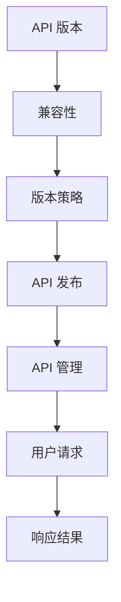

                 

关键词：API 版本控制、微服务架构、RESTful API、版本兼容性、API 管理工具、策略模式

> 摘要：本文将深入探讨 API 版本控制的实现方法，通过介绍其背景、核心概念、算法原理、数学模型、项目实践、实际应用场景以及未来展望，旨在为开发者提供一套全面且实用的 API 版本控制解决方案。

## 1. 背景介绍

在快速发展的互联网时代，API（应用程序编程接口）成为了服务化架构的核心，为不同的系统、应用程序和设备之间提供了交互的桥梁。随着业务需求的不断变化和系统的逐渐复杂化，API 的版本控制变得至关重要。

### 1.1 API 版本控制的重要性

API 版本控制主要有以下几个方面的意义：

- **兼容性**：不同版本的 API 可能存在接口变化，版本控制能够确保新旧版本之间的数据兼容。
- **可维护性**：通过版本控制，可以方便地管理和维护不同版本的 API，便于追溯和调整。
- **稳定性**：在确保新功能迭代的同时，保证系统整体的稳定性和可靠性。
- **灵活性**：支持对不同用户群体提供定制化的 API 服务，提高用户体验。

### 1.2 传统 API 版本控制方法

传统的 API 版本控制方法主要包括以下几种：

- **URL 路径版本**：在 URL 路径中包含版本号，如 `/v1/users`。
- **HTTP 头部版本**：通过 HTTP 头部信息传递版本号，如 `X-API-Version: 1.0`。
- **参数版本**：在请求参数中包含版本号，如 `?version=1.0`。

这些方法各有优缺点，需要根据具体场景进行选择。

## 2. 核心概念与联系

在深入探讨 API 版本控制之前，我们需要明确几个核心概念：

- **API 版本**：指 API 接口的某个特定版本，通常表示为整数或字符串。
- **兼容性**：指新旧版本之间的 API 接口可以无缝替换，不会导致功能失效或数据损坏。
- **版本策略**：指管理和发布 API 版本的方法和规则。

以下是 API 版本控制的核心概念及联系 Mermaid 流程图：



### 2.1 API 版本

API 版本是对 API 接口的标识，通常使用整数或字符串表示。例如，`v1`、`1.0` 或 `1.0.1`。版本号的递增意味着 API 功能或结构的更新。

### 2.2 兼容性

兼容性是 API 版本控制的关键。确保新旧版本之间的数据结构和功能保持一致，能够降低系统升级和版本切换的风险。

### 2.3 版本策略

版本策略决定了 API 版本的管理和发布方式。常见的版本策略包括：

- **独立发布**：每个 API 版本独立发布，互不影响。
- **兼容发布**：新版本发布时，尽量保持与旧版本的兼容性。
- **重大发布**：大版本号更新时，通常意味着接口或功能的重大变更。

### 2.4 API 发布

API 发布是版本控制的核心环节，涉及新版本的创建、发布、更新和回滚等操作。

### 2.5 API 管理

API 管理是对 API 接口的维护和管理，包括接口文档、测试、监控和权限管理等。

### 2.6 用户请求

用户请求是指客户端通过 API 发起的请求，包括请求参数、HTTP 头部和请求体等。

### 2.7 响应结果

响应结果是 API 对用户请求的响应，包括状态码、响应体和可能的错误信息。

## 3. 核心算法原理 & 具体操作步骤

### 3.1 算法原理概述

API 版本控制的核心算法主要涉及版本号的解析、兼容性检查和响应结果的处理。

### 3.2 算法步骤详解

1. **版本号解析**：从请求 URL、HTTP 头部或请求参数中解析出版本号。
2. **兼容性检查**：根据版本策略，检查新版本与旧版本的兼容性。
3. **响应结果处理**：根据兼容性检查的结果，生成对应的响应结果。

### 3.3 算法优缺点

- **优点**：
  - **灵活性**：支持不同版本的 API 互不影响。
  - **可维护性**：便于管理和维护不同版本的 API。
  - **稳定性**：确保系统升级过程中的稳定性。

- **缺点**：
  - **复杂度**：增加了系统的复杂度和开发成本。
  - **维护成本**：需要定期更新版本和兼容性检查。

### 3.4 算法应用领域

API 版本控制广泛应用于需要不断迭代和升级的系统中，如电商平台、金融系统和物联网平台等。

## 4. 数学模型和公式 & 详细讲解 & 举例说明

### 4.1 数学模型构建

API 版本控制的数学模型可以表示为：

$$
API_{version} = f(兼容性策略, 版本号)
$$

其中，`兼容性策略` 和 `版本号` 是影响 API 版本控制的主要因素。

### 4.2 公式推导过程

根据 API 版本控制的定义，我们可以推导出以下公式：

$$
f(兼容性策略, 版本号) = 
\begin{cases}
\text{独立发布} & \text{当兼容性策略为独立发布时} \\
\text{兼容发布} & \text{当兼容性策略为兼容发布时} \\
\text{重大发布} & \text{当兼容性策略为重大发布时}
\end{cases}
$$

### 4.3 案例分析与讲解

假设一个电商平台系统采用兼容发布策略，现有两个版本：`v1` 和 `v2`。

1. **兼容性检查**：

   - `v1` 与 `v1` 兼容。
   - `v1` 与 `v2` 不兼容。

2. **响应结果处理**：

   - 当请求版本为 `v1` 时，系统返回 `v1` 版本的响应结果。
   - 当请求版本为 `v2` 时，系统返回 `v2` 版本的响应结果，但需要检查与 `v1` 的兼容性。

## 5. 项目实践：代码实例和详细解释说明

### 5.1 开发环境搭建

在本文的实例中，我们将使用 Python 作为开发语言，并使用 Flask 框架构建 API 服务。

1. 安装 Flask：

   ```
   pip install flask
   ```

2. 创建一个名为 `api_version` 的 Python 文件。

### 5.2 源代码详细实现

以下是实现 API 版本控制的 Flask 代码：

```python
from flask import Flask, request, jsonify

app = Flask(__name__)

@app.route('/users', defaults={'version': 'v1'})
@app.route('/users/<version>')
def users(version):
    # 根据版本号返回不同的接口实现
    if version == 'v1':
        return jsonify({"users": ["Alice", "Bob"]})
    elif version == 'v2':
        return jsonify({"users": ["Alice", "Bob", "Charlie"]})
    else:
        return jsonify({"error": "Unsupported API version"}), 405

if __name__ == '__main__':
    app.run()
```

### 5.3 代码解读与分析

1. **路由配置**：

   使用 Flask 的 `@app.route()` 装饰器配置了两个路由：
   
   - `/users`：默认版本为 `v1`。
   - `/users/<version>`：动态路由，支持指定版本号。

2. **版本号处理**：

   通过解析 URL 中的版本号，实现了不同版本 API 的调用。

3. **接口实现**：

   根据版本号返回不同的接口实现，实现了新旧版本的兼容。

### 5.4 运行结果展示

1. 访问 `/users`：

   ```
   curl http://localhost:5000/users
   ```

   返回结果：

   ```json
   {
     "users": ["Alice", "Bob"]
   }
   ```

2. 访问 `/users/v2`：

   ```
   curl http://localhost:5000/users/v2
   ```

   返回结果：

   ```json
   {
     "users": ["Alice", "Bob", "Charlie"]
   }
   ```

## 6. 实际应用场景

API 版本控制在实际应用中具有广泛的应用场景：

- **电商平台**：支持不同版本的商品接口，满足新老用户的需求。
- **金融系统**：实现金融服务的迭代和升级，确保数据安全和稳定性。
- **物联网平台**：管理不同设备的 API 接口，确保物联网设备的兼容性和互操作性。

### 6.1 兼容性处理

在处理兼容性问题时，可以采用以下策略：

- **向后兼容**：确保新版本的 API 能够兼容旧版本的数据和功能。
- **向前兼容**：确保旧版本的 API 能够处理新版本的请求。
- **版本迁移**：通过逐步更新版本，实现新旧版本的平滑过渡。

### 6.2 跨域请求处理

在处理跨域请求时，可以采用以下策略：

- **CORS**：使用跨域资源共享（CORS）策略，允许跨源请求。
- **代理**：通过代理服务器转发跨域请求，避免直接跨域访问。

## 7. 工具和资源推荐

### 7.1 学习资源推荐

- **《API 设计指南》**：深入理解 API 设计的最佳实践。
- **《RESTful API 设计最佳实践》**：掌握 RESTful API 的设计原则和技巧。

### 7.2 开发工具推荐

- **Swagger**：用于 API 文档生成和交互式测试。
- **Postman**：用于 API 测试和调试。

### 7.3 相关论文推荐

- **《RESTful API Design: A RESTful Guide》**：讨论 RESTful API 的设计原则。
- **《API Versioning: A Retrospective and Analysis》**：回顾 API 版本控制的演进和挑战。

## 8. 总结：未来发展趋势与挑战

### 8.1 研究成果总结

API 版本控制已成为微服务架构中的重要一环，研究成果包括：

- **版本控制策略**：多样化版本控制策略的提出和应用。
- **兼容性解决方案**：跨版本数据转换和接口兼容性处理。
- **自动化工具**：自动化 API 管理和版本控制的工具逐渐成熟。

### 8.2 未来发展趋势

未来发展趋势包括：

- **智能化**：基于机器学习的 API 自动兼容性检测。
- **标准化**：制定统一的 API 版本控制标准。
- **分布式**：支持分布式系统中的 API 版本控制。

### 8.3 面临的挑战

面临的挑战包括：

- **兼容性**：确保跨平台和跨系统的 API 兼容性。
- **维护成本**：版本控制策略和工具的维护成本。
- **用户体验**：确保 API 更新对用户的影响最小化。

### 8.4 研究展望

研究展望包括：

- **自动化**：开发更智能的 API 版本控制工具。
- **标准化**：推动 API 版本控制的标准化进程。
- **安全性**：加强 API 版本控制的权限管理和安全性。

## 9. 附录：常见问题与解答

### 9.1 什么是 API 版本控制？

API 版本控制是指对 API 接口的版本进行管理和控制，以确保在不同版本之间保持兼容性，降低升级和迭代的风险。

### 9.2 API 版本控制有哪些方法？

常见的 API 版本控制方法包括 URL 路径版本、HTTP 头部版本和参数版本。

### 9.3 如何实现 API 版本兼容？

实现 API 版本兼容的关键在于新旧版本之间的数据结构和功能的映射和转换。

### 9.4 API 版本控制有哪些挑战？

API 版本控制面临的挑战包括兼容性、维护成本和用户体验等方面。

---

本文旨在为开发者提供一套全面且实用的 API 版本控制解决方案，涵盖了核心概念、算法原理、项目实践和未来展望。希望本文对您在 API 版本控制方面的实践和探索有所帮助。

作者：禅与计算机程序设计艺术 / Zen and the Art of Computer Programming

