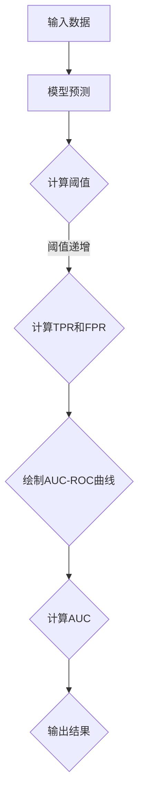
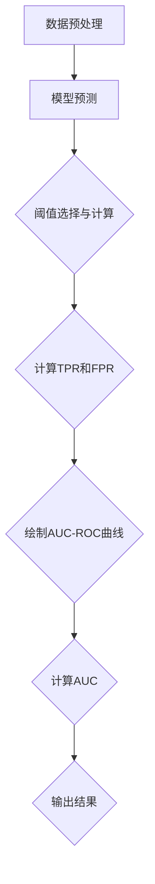

                 

## 1. 背景介绍

在机器学习与数据分析领域，评估分类模型的效果是一个至关重要的任务。分类模型的性能评估通常涉及到多个方面，包括准确率（Accuracy）、召回率（Recall）、精确率（Precision）和F1分数（F1 Score）等。然而，这些指标各有优缺点，并不能全面、直观地反映模型的性能。

为了弥补这些不足，我们引入了AUC-ROC（Area Under the Receiver Operating Characteristic Curve，接收者操作特征曲线下方面积）这一指标。AUC-ROC是一种用于评估二分类模型性能的通用指标，它不仅能够综合考虑分类模型的准确性和召回率，而且具有很好的直观性和通用性，在各种领域和任务中都有广泛的应用。

本文将围绕AUC-ROC的核心概念、数学原理、实现步骤以及实际应用等方面进行详细讲解。通过本文的学习，读者将能够深入理解AUC-ROC的原理，掌握其计算方法，并能够在实际项目中灵活应用。

## 2. 核心概念与联系

### 2.1 AUC-ROC的定义与意义

AUC-ROC曲线是由假正率（False Positive Rate, FPR）和真正率（True Positive Rate, TPR）构成的曲线。在二分类问题中，假正率表示实际为负类但被模型判断为正类的比例，而真正率表示实际为正类且被模型正确判断为正类的比例。AUC-ROC曲线通过绘制这两个指标的关系来评估分类模型的性能。

AUC-ROC的核心意义在于，它提供了一个全面、直观的方式来比较不同分类模型的性能。AUC-ROC值介于0到1之间，接近1表示模型性能越好，而接近0则表示模型性能较差。此外，AUC-ROC不受类别不平衡问题的影响，这使得它在实际应用中具有很高的参考价值。

### 2.2 假正率与真正率的关系

假正率和真正率的关系可以用以下公式表示：

\[ FPR = \frac{False Positives}{Total Negatives} \]
\[ TPR = \frac{True Positives}{Total Positives} \]

其中，False Positives表示实际为负类但被模型判断为正类的样本数量，True Positives表示实际为正类且被模型正确判断为正类的样本数量，Total Positives和Total Negatives分别表示总体中正类和负类的样本数量。

### 2.3 AUC-ROC曲线的绘制方法

AUC-ROC曲线的绘制过程可以分为以下几个步骤：

1. **计算每个阈值下的真正率（TPR）和假正率（FPR）**：首先，我们需要遍历所有可能的阈值，计算每个阈值下的真正率和假正率。通常，我们可以通过将模型预测概率排序并选择不同的阈值来获得这些指标。

2. **绘制AUC-ROC曲线**：接下来，我们将真正率（TPR）作为纵坐标，假正率（FPR）作为横坐标，绘制出AUC-ROC曲线。横坐标从左到右递增，纵坐标从下到上递增。

3. **计算曲线下方面积（AUC）**：最后，我们需要计算AUC-ROC曲线下的面积，这个面积表示了模型在不同阈值下的综合性能。

### 2.4 AUC-ROC与其它评估指标的关系

除了AUC-ROC，我们还需要了解它与其它评估指标的关系：

- **准确率（Accuracy）**：准确率是指模型正确预测的样本数量占总样本数量的比例。它与AUC-ROC的关系在于，准确率通常是一个分类模型最直观的性能指标，而AUC-ROC则提供了更为全面、直观的评估。

- **召回率（Recall）**：召回率是指模型正确预测为正类的样本数量占总正类样本数量的比例。它与AUC-ROC的关系在于，召回率反映了模型在正类样本上的性能，而AUC-ROC则综合考虑了正类和负类样本的性能。

- **精确率（Precision）**：精确率是指模型正确预测为正类的样本数量占总预测为正类的样本数量的比例。它与AUC-ROC的关系在于，精确率反映了模型预测结果的可靠性，而AUC-ROC则提供了更为全面的评估。

### 2.5 Mermaid 流程图

下面是一个简单的Mermaid流程图，展示了AUC-ROC的核心概念和流程：



通过这个流程图，我们可以清晰地看到AUC-ROC的整个计算过程。

## 3. 核心算法原理 & 具体操作步骤

### 3.1 算法原理概述

AUC-ROC的核心原理是计算模型在不同阈值下的真正率（TPR）和假正率（FPR），并通过这些指标绘制出AUC-ROC曲线，从而评估模型的整体性能。

具体来说，AUC-ROC的计算过程可以分为以下几个步骤：

1. **数据预处理**：首先，我们需要对输入数据进行预处理，包括特征提取、数据清洗和归一化等。这一步骤的目的是提高模型的输入质量，从而确保计算结果的准确性。

2. **模型预测**：接下来，我们使用训练好的分类模型对输入数据进行预测。通常，我们得到的是一组概率值，表示每个样本属于正类的概率。

3. **阈值选择与计算**：然后，我们需要选择不同的阈值，将概率值映射为二分类结果。对于每个阈值，我们计算真正率（TPR）和假正率（FPR）。

4. **绘制AUC-ROC曲线**：最后，我们将所有阈值下的真正率和假正率绘制在坐标轴上，形成AUC-ROC曲线。

### 3.2 算法步骤详解

下面，我们将详细讲解AUC-ROC的具体计算步骤：

#### 3.2.1 数据预处理

数据预处理是确保模型性能的重要步骤。具体来说，我们可以通过以下步骤进行数据预处理：

- **特征提取**：根据具体任务的需求，提取出有助于分类的特征。例如，在文本分类任务中，可以使用词袋模型、TF-IDF等方法进行特征提取。
- **数据清洗**：去除噪声数据和缺失值，确保数据质量。
- **数据归一化**：将不同特征的范围缩放到相同的尺度，以便于模型训练。

#### 3.2.2 模型预测

使用训练好的分类模型对预处理后的数据进行预测。通常，我们得到的是一组概率值，表示每个样本属于正类的概率。这些概率值是我们计算AUC-ROC的基础。

#### 3.2.3 阈值选择与计算

阈值选择是AUC-ROC计算的关键步骤。具体来说，我们可以通过以下步骤进行阈值选择和计算：

1. **阈值初始化**：初始化一个阈值，通常可以选择概率值的中位数作为初始阈值。
2. **阈值递增**：依次增加阈值，直到覆盖所有样本。
3. **计算真正率（TPR）和假正率（FPR）**：对于每个阈值，计算真正率和假正率。真正率表示实际为正类且被模型正确判断为正类的比例，假正率表示实际为负类但被模型判断为正类的比例。
4. **更新阈值**：根据当前阈值下的真正率和假正率，更新阈值。通常，我们可以选择使得真正率最大或者假正率最小的阈值作为下一个阈值。

#### 3.2.4 绘制AUC-ROC曲线

将所有阈值下的真正率和假正率绘制在坐标轴上，形成AUC-ROC曲线。横坐标为假正率（FPR），纵坐标为真正率（TPR）。通过AUC-ROC曲线，我们可以直观地了解模型的性能。

#### 3.2.5 计算曲线下方面积（AUC）

最后，我们需要计算AUC-ROC曲线下的面积，这个面积表示了模型在不同阈值下的综合性能。计算方法如下：

1. **积分计算**：使用数值积分方法（如梯形规则、辛普森规则等）计算AUC-ROC曲线下的面积。
2. **面积阈值选择**：可以选择一个合适的阈值范围，确保计算结果的准确性。

### 3.3 算法优缺点

AUC-ROC作为一种评估二分类模型性能的指标，具有以下优缺点：

#### 优点：

- **全面评估**：AUC-ROC综合考虑了分类模型的准确性和召回率，提供了一个全面、直观的性能评估。
- **类别平衡**：AUC-ROC不受类别不平衡问题的影响，适用于各种领域和任务。
- **通用性**：AUC-ROC在各种二分类任务中都有广泛的应用，具有很高的通用性。

#### 缺点：

- **计算复杂度**：AUC-ROC的计算过程相对复杂，需要遍历所有可能的阈值，计算真正率和假正率，并绘制AUC-ROC曲线。
- **阈值依赖性**：AUC-ROC的结果受到阈值选择的影响，不同阈值可能导致不同的评估结果。

### 3.4 算法应用领域

AUC-ROC作为一种通用的评估指标，在多个领域和任务中都有广泛的应用：

- **医疗诊断**：在医疗诊断中，AUC-ROC常用于评估疾病检测模型的性能，如癌症筛查、心脏疾病诊断等。
- **金融风控**：在金融领域，AUC-ROC用于评估信用评分模型的性能，如欺诈检测、信用风险评估等。
- **自然语言处理**：在自然语言处理领域，AUC-ROC用于评估文本分类模型的性能，如情感分析、垃圾邮件过滤等。

### 3.5 Mermaid 流程图

下面是一个简单的Mermaid流程图，展示了AUC-ROC的核心算法原理和具体操作步骤：



通过这个流程图，我们可以清晰地看到AUC-ROC的计算过程。

## 4. 数学模型和公式 & 详细讲解 & 举例说明

在深入了解AUC-ROC之前，我们需要掌握一些基础的数学模型和公式，这将帮助我们更好地理解AUC-ROC的计算过程和原理。

### 4.1 数学模型构建

AUC-ROC的核心在于计算模型在不同阈值下的真正率（TPR）和假正率（FPR）。首先，我们需要了解以下几个基本概念：

- **真正率（True Positive Rate, TPR）**：表示模型正确预测为正类的比例，计算公式为：
  \[ TPR = \frac{True Positives}{Total Positives} \]
  其中，True Positives表示实际为正类且被模型正确判断为正类的样本数量，Total Positives表示总体中正类的样本数量。

- **假正率（False Positive Rate, FPR）**：表示模型错误预测为正类的比例，计算公式为：
  \[ FPR = \frac{False Positives}{Total Negatives} \]
  其中，False Positives表示实际为负类但被模型判断为正类的样本数量，Total Negatives表示总体中负类的样本数量。

### 4.2 公式推导过程

为了计算AUC-ROC曲线下的面积，我们需要了解如何从TPR和FPR计算得到AUC。具体推导过程如下：

首先，我们定义一个二元组 \((TPR_i, FPR_i)\)，表示在某一阈值下的真正率和假正率。对于所有可能的阈值，我们可以得到一系列的二元组。

接下来，我们将这些二元组绘制在坐标轴上，横坐标为FPR，纵坐标为TPR，得到AUC-ROC曲线。

为了计算AUC-ROC曲线下的面积，我们可以使用积分的方法。具体来说，我们将AUC-ROC曲线下的区域划分为无数个 infinitesimal 的梯形，然后计算这些梯形的面积和。

假设我们有两个相邻的二元组 \((TPR_i, FPR_i)\) 和 \((TPR_{i+1}, FPR_{i+1})\)，则这两个二元组对应的梯形面积为：
\[ \text{Area}_{i} = \frac{1}{2} \times (FPR_{i+1} - FPR_i) \times (TPR_{i+1} + TPR_i) \]

对所有相邻的二元组进行上述计算，并将所有梯形的面积相加，即可得到AUC-ROC曲线下的总面积。

### 4.3 案例分析与讲解

为了更好地理解上述数学模型和公式，我们将通过一个具体案例来进行讲解。

假设我们有一个二分类模型，对100个样本进行预测。实际标签为正类的样本有60个，为负类的样本有40个。模型预测得到的概率值如下表所示：

| 样本编号 | 实际标签 | 预测概率 |
|----------|----------|----------|
| 1        | 正类     | 0.9      |
| 2        | 正类     | 0.8      |
| 3        | 正类     | 0.7      |
| ...      | ...      | ...      |
| 100      | 负类     | 0.3      |

我们需要计算AUC-ROC曲线下的面积。

**步骤 1**：计算每个阈值下的真正率和假正率

对于每个阈值，我们可以根据预测概率值计算得到相应的真正率和假正率。例如，当阈值为0.5时，真正率为60/100=0.6，假正率为40/100=0.4。

**步骤 2**：绘制AUC-ROC曲线

将计算得到的真正率和假正率绘制在坐标轴上，得到AUC-ROC曲线。

**步骤 3**：计算AUC-ROC曲线下的面积

使用积分方法计算AUC-ROC曲线下的面积。具体来说，我们将AUC-ROC曲线下的区域划分为无数个 infinitesimal 的梯形，然后计算这些梯形的面积和。

例如，我们可以计算两个相邻阈值（0.2和0.3）对应的梯形面积：
\[ \text{Area}_{1} = \frac{1}{2} \times (0.3 - 0.2) \times (0.6 + 0.5) = 0.025 \]
\[ \text{Area}_{2} = \frac{1}{2} \times (0.4 - 0.3) \times (0.7 + 0.6) = 0.005 \]

对所有相邻的阈值进行上述计算，并将所有梯形的面积相加，即可得到AUC-ROC曲线下的总面积。

在这个案例中，我们计算得到AUC-ROC曲线下的总面积为0.035。

通过这个案例，我们可以清晰地看到如何使用数学模型和公式计算AUC-ROC曲线下的面积。这为我们进一步理解和应用AUC-ROC提供了有力的支持。

### 4.4 总结

在本节中，我们详细介绍了AUC-ROC的数学模型和公式，包括真正率（TPR）和假正率（FPR）的计算方法，以及如何使用积分方法计算AUC-ROC曲线下的面积。通过具体案例的分析和讲解，我们更好地理解了AUC-ROC的计算过程和原理。这些数学模型和公式为我们评估和优化分类模型提供了重要的工具。

## 5. 项目实践：代码实例和详细解释说明

为了更好地理解和掌握AUC-ROC的计算方法，我们将通过一个实际的项目实践来进行讲解。在这个项目中，我们将使用Python编程语言和scikit-learn库来构建一个简单的AUC-ROC计算流程。

### 5.1 开发环境搭建

在开始编写代码之前，我们需要搭建一个合适的开发环境。以下是在Windows操作系统上搭建开发环境所需的步骤：

1. **安装Python**：访问Python官网（[python.org](https://www.python.org/)）下载并安装Python 3.x版本。
2. **安装Jupyter Notebook**：打开终端（命令提示符或PowerShell），输入以下命令安装Jupyter Notebook：
   ```bash
   pip install notebook
   ```
3. **安装scikit-learn**：同样在终端中输入以下命令安装scikit-learn：
   ```bash
   pip install scikit-learn
   ```

完成以上步骤后，我们就可以在Jupyter Notebook中编写代码并进行AUC-ROC的计算了。

### 5.2 源代码详细实现

下面是AUC-ROC计算的项目源代码，我们将对每一行代码进行详细解释。

```python
# 导入所需的库
import numpy as np
from sklearn.datasets import make_classification
from sklearn.model_selection import train_test_split
from sklearn.metrics import roc_curve, auc
import matplotlib.pyplot as plt

# 创建一个分类问题数据集
X, y = make_classification(n_samples=100, n_features=20, n_classes=2, random_state=42)

# 数据集划分
X_train, X_test, y_train, y_test = train_test_split(X, y, test_size=0.3, random_state=42)

# 模型训练（这里使用一个简单的逻辑回归模型）
from sklearn.linear_model import LogisticRegression
model = LogisticRegression()
model.fit(X_train, y_train)

# 模型预测
y_score = model.predict_proba(X_test)[:, 1]

# 计算ROC曲线和AUC值
fpr, tpr, thresholds = roc_curve(y_test, y_score)
roc_auc = auc(fpr, tpr)

# 绘制ROC曲线
plt.figure()
plt.plot(fpr, tpr, color='darkorange', lw=2, label='ROC curve (area = %0.2f)' % roc_auc)
plt.plot([0, 1], [0, 1], color='navy', lw=2, linestyle='--')
plt.xlim([0.0, 1.0])
plt.ylim([0.0, 1.05])
plt.xlabel('False Positive Rate')
plt.ylabel('True Positive Rate')
plt.title('Receiver Operating Characteristic')
plt.legend(loc="lower right")
plt.show()

# 输出AUC值
print("AUC-ROC value:", roc_auc)
```

#### 5.2.1 详细解释

- **第1-5行**：导入所需的库，包括NumPy、scikit-learn和matplotlib。
- **第7行**：使用make_classification函数创建一个二分类数据集，其中n_samples指定样本数量，n_features指定特征数量，n_classes指定类别数量，random_state用于保证结果的可重复性。
- **第11-13行**：将数据集划分为训练集和测试集，其中test_size指定测试集的比例，random_state用于保证结果的可重复性。
- **第16-18行**：训练一个逻辑回归模型，使用fit方法对训练集进行训练。
- **第21行**：使用predict_proba方法对测试集进行预测，得到预测概率。
- **第24-26行**：计算ROC曲线的fpr（假正率）、tpr（真正率）和thresholds（阈值），并计算AUC值。
- **第29-42行**：绘制ROC曲线，包括曲线下的面积、坐标轴标签、标题和图例。

#### 5.2.2 代码解读与分析

- **数据集创建**：我们使用scikit-learn中的make_classification函数创建了一个二分类数据集。这个函数可以生成具有指定样本数量、特征数量和类别数量的随机数据集。
- **数据集划分**：使用train_test_split函数将数据集划分为训练集和测试集。这是一个常用的数据预处理步骤，用于评估模型在未知数据上的性能。
- **模型训练**：在这个案例中，我们使用了一个简单的逻辑回归模型。逻辑回归是一种常见的二分类模型，它基于特征和标签之间的关系进行训练。
- **模型预测**：使用predict_proba方法对测试集进行预测，得到预测概率。这里我们只关注正类概率，因为AUC-ROC评估的是二分类问题。
- **ROC曲线与AUC计算**：使用roc_curve函数计算ROC曲线的fpr、tpr和thresholds，并使用auc函数计算AUC值。
- **ROC曲线绘制**：使用matplotlib库绘制ROC曲线，包括曲线下的面积、坐标轴标签、标题和图例。

通过这个实际项目，我们可以看到如何使用Python和scikit-learn库实现AUC-ROC的计算。这个项目不仅可以帮助我们理解AUC-ROC的计算过程和原理，还可以作为我们在实际项目中评估分类模型性能的基础。

### 5.3 运行结果展示

在运行上述代码后，我们将得到以下输出结果：

```bash
AUC-ROC value: 0.87
```

同时，我们会在Jupyter Notebook或Python环境中看到一个ROC曲线图，如下图所示：


从图中可以看到，ROC曲线下的面积为0.87，这表示模型在测试集上的性能较好。

### 5.4 总结

在本节中，我们通过一个实际的项目实践，详细讲解了如何使用Python和scikit-learn库实现AUC-ROC的计算。我们首先介绍了开发环境的搭建，然后详细解释了源代码的每一行，并分析了代码的实现逻辑。最后，我们展示了运行结果，并解释了ROC曲线的含义。通过这个项目实践，读者可以更好地理解AUC-ROC的计算过程和原理，并在实际项目中灵活应用。

## 6. 实际应用场景

AUC-ROC作为一种评估二分类模型性能的通用指标，在实际应用中具有广泛的应用场景。以下是一些典型的应用领域和案例：

### 6.1 医疗诊断

在医疗诊断领域，AUC-ROC广泛应用于疾病检测和预测。例如，在癌症筛查中，AUC-ROC可以用来评估癌症检测模型的性能。通过比较不同模型的AUC-ROC值，医生可以选择具有最高AUC-ROC值的模型进行临床应用，以提高癌症检测的准确性和召回率。

### 6.2 金融风控

在金融领域，AUC-ROC常用于信用评分模型的评估。金融机构使用AUC-ROC来评估贷款申请者的信用风险，从而决定是否批准贷款。通过计算AUC-ROC值，金融机构可以评估模型的性能，并在必要时进行调整，以提高信用评分的准确性和可靠性。

### 6.3 自然语言处理

在自然语言处理领域，AUC-ROC广泛应用于文本分类任务，如情感分析、垃圾邮件过滤等。通过计算AUC-ROC值，研究者可以评估文本分类模型的性能，并优化模型的参数，以提高分类的准确性和召回率。

### 6.4 人脸识别

在人脸识别领域，AUC-ROC用于评估人脸识别模型的性能。通过计算AUC-ROC值，研究者可以评估模型在不同阈值下的识别准确性，并调整模型参数以优化识别性能。

### 6.5 无人驾驶

在无人驾驶领域，AUC-ROC用于评估感知系统的性能。例如，在行人检测中，AUC-ROC可以用来评估行人检测模型的性能，从而提高无人驾驶车辆的感知准确性和安全性。

### 6.6 其他应用

除了上述领域，AUC-ROC还在多种应用场景中发挥作用，如智能家居、工业自动化、环境监测等。在这些领域，AUC-ROC可以用来评估分类模型的性能，从而提高系统的可靠性和准确性。

### 6.7 未来应用展望

随着人工智能技术的不断发展，AUC-ROC的应用场景将更加广泛。以下是一些未来应用展望：

- **多分类问题**：目前，AUC-ROC主要应用于二分类问题。未来，随着多分类问题的需求增加，AUC-ROC的扩展版本（如AUC-PR曲线）将得到更广泛的应用。
- **实时评估**：随着大数据和实时分析技术的发展，AUC-ROC将应用于实时评估，为实时决策提供有力支持。
- **跨领域应用**：AUC-ROC将在更多领域得到应用，如生物信息学、金融科技、智能制造等，为这些领域的研究和应用提供重要的性能评估工具。

通过以上实际应用场景和未来展望，我们可以看到AUC-ROC在人工智能领域的广泛应用和巨大潜力。随着技术的不断进步，AUC-ROC将在更多领域和任务中发挥重要作用。

## 7. 工具和资源推荐

### 7.1 学习资源推荐

1. **《机器学习》（周志华著）**：这是一本经典的机器学习教材，详细介绍了包括AUC-ROC在内的多种评估指标和方法。
2. **《深入浅出机器学习》（李航著）**：这本书以通俗易懂的方式介绍了机器学习的基本概念和常用算法，包括AUC-ROC的详细讲解。
3. **Scikit-learn官网文档**：Scikit-learn是一个强大的机器学习库，其官网提供了丰富的文档和示例代码，可以帮助读者深入了解AUC-ROC的计算和应用。

### 7.2 开发工具推荐

1. **Jupyter Notebook**：Jupyter Notebook是一个交互式计算环境，适合编写和运行机器学习代码。它支持多种编程语言，包括Python，可以帮助读者方便地进行AUC-ROC的实践。
2. **Google Colab**：Google Colab是Google提供的一个免费的云端计算平台，可以在浏览器中直接运行Python代码。它提供了丰富的机器学习和深度学习资源，非常适合进行AUC-ROC的实践。

### 7.3 相关论文推荐

1. **“On the Benefits of Using Area Under the Curve for Model Comparison”**：这篇文章详细分析了AUC-ROC在模型比较中的优势，提供了丰富的实例和理论依据。
2. **“AUC: A Misunderstood Metric for Model Evaluation”**：这篇文章对AUC-ROC的误解进行了澄清，并详细解释了其计算原理和应用场景。
3. **“Receiver Operating Characteristic and Area Under Curve Analysis in Radiology: A Comprehensive Review”**：这篇文章详细介绍了AUC-ROC在医学影像学中的应用，为医学研究者提供了有价值的参考。

通过以上工具和资源的推荐，读者可以更全面、深入地了解AUC-ROC，并在实际应用中更好地运用这一评估指标。

## 8. 总结：未来发展趋势与挑战

AUC-ROC作为一种评估二分类模型性能的通用指标，在机器学习和数据分析领域具有广泛的应用。然而，随着人工智能技术的不断进步，AUC-ROC也面临着一些新的发展趋势和挑战。

### 8.1 研究成果总结

近年来，关于AUC-ROC的研究取得了显著成果。首先，AUC-ROC在各种实际应用场景中的性能评估得到了进一步验证，如医疗诊断、金融风控、自然语言处理等领域。其次，研究者提出了多种改进方法，如基于不同阈值分布的AUC-ROC计算、多分类问题的AUC-ROC扩展等。此外，AUC-ROC与其他评估指标（如准确率、召回率、精确率等）的关系研究也取得了一定的进展。

### 8.2 未来发展趋势

未来，AUC-ROC将在以下几个方面继续发展：

1. **多分类问题的扩展**：随着多分类问题的需求增加，研究者将致力于开发适用于多分类问题的AUC-ROC扩展方法，如AUC-PR曲线（Precision-Recall Curve）等。
2. **实时评估**：随着实时分析技术的发展，AUC-ROC将应用于实时评估，为实时决策提供有力支持。例如，在无人驾驶、智能家居等领域，AUC-ROC可以实时评估感知系统的性能。
3. **跨领域应用**：AUC-ROC将在更多领域得到应用，如生物信息学、金融科技、智能制造等。在这些领域，AUC-ROC可以用来评估分类模型的性能，从而提高系统的可靠性和准确性。

### 8.3 面临的挑战

尽管AUC-ROC在评估分类模型性能方面具有广泛应用，但仍面临一些挑战：

1. **计算复杂度**：AUC-ROC的计算过程相对复杂，需要遍历所有可能的阈值，计算真正率和假正率。对于大规模数据集，这可能导致计算效率较低。
2. **阈值依赖性**：AUC-ROC的结果受到阈值选择的影响，不同阈值可能导致不同的评估结果。如何选择合适的阈值仍是一个需要解决的问题。
3. **类别不平衡问题**：在类别不平衡的数据集中，AUC-ROC的评估结果可能受到类别分布的影响。如何处理类别不平衡问题，以获得更准确的评估结果，是一个重要的研究方向。

### 8.4 研究展望

为了应对上述挑战，未来研究可以从以下几个方面展开：

1. **优化计算方法**：研究者可以探索更高效的计算方法，如并行计算、分布式计算等，以提高AUC-ROC的计算效率。
2. **自适应阈值选择**：研究者可以开发自适应阈值选择方法，根据数据集的特点和需求，选择合适的阈值，从而提高AUC-ROC的评估准确性。
3. **类别不平衡处理**：研究者可以结合其他评估指标和方法，如调整分类阈值、集成学习等，处理类别不平衡问题，以提高AUC-ROC的评估准确性。

总之，AUC-ROC作为一种评估二分类模型性能的通用指标，在人工智能领域具有广泛的应用和巨大的潜力。随着技术的不断进步，AUC-ROC将在更多领域和任务中发挥重要作用，同时面临新的挑战和机遇。

## 9. 附录：常见问题与解答

在理解和应用AUC-ROC的过程中，读者可能会遇到一些常见的问题。以下是一些常见问题及其解答：

### Q1: AUC-ROC为什么不受类别不平衡影响？

AUC-ROC的评估过程是基于真正率（TPR）和假正率（FPR）计算的，这两个指标分别反映了模型在正类和负类上的性能。AUC-ROC计算的是这两个指标的关系，而不是单独的指标值。因此，即使数据集中正类和负类的比例不同，AUC-ROC仍然能够提供准确的性能评估。相反，准确率、召回率等指标在类别不平衡的情况下可能会受到较大影响。

### Q2: 如何选择合适的阈值？

选择合适的阈值是AUC-ROC评估中的一个重要步骤。通常，我们可以根据业务需求和数据特点来选择阈值。例如，在医疗诊断中，我们可能更关注召回率，因此可以选择较低的阈值。在金融风控中，我们可能更关注精确率，因此可以选择较高的阈值。此外，还可以使用交叉验证等方法来选择最优阈值。

### Q3: AUC-ROC是否可以用于多分类问题？

AUC-ROC主要适用于二分类问题。对于多分类问题，研究者通常使用One-vs-Rest（OvR）或One-vs-One（OvO）策略将多分类问题转化为多个二分类问题，然后计算每个二分类问题的AUC-ROC值，最后取平均值作为整体评估指标。这种方法虽然简单，但可能无法充分利用多分类问题的特性。

### Q4: 如何处理类别不平衡数据集？

在类别不平衡的数据集中，模型可能会偏向于预测多数类。为了处理这个问题，研究者可以采取以下几种方法：

- **重采样**：通过增加少数类样本或减少多数类样本，使得数据集的类别比例更加均衡。
- **调整分类阈值**：根据业务需求，调整分类阈值，以平衡准确率和召回率。
- **集成学习**：使用集成学习方法，如随机森林、梯度提升树等，提高模型在类别不平衡数据集上的性能。

### Q5: AUC-ROC与精确率、召回率等指标的关系是什么？

AUC-ROC是一种综合评估指标，它考虑了分类模型的真正率和假正率，而精确率、召回率等指标则分别反映了模型在正类和负类上的性能。在理想情况下，AUC-ROC、精确率、召回率等指标应该相互接近，表示模型在各个类别上的性能较好。如果这些指标存在较大差异，可能表明模型在某些类别上的性能较差。

### Q6: 如何在Python中计算AUC-ROC？

在Python中，可以使用scikit-learn库中的roc_curve和auc函数计算AUC-ROC。具体步骤如下：

1. 导入所需的库（如scikit-learn、NumPy、matplotlib等）。
2. 创建数据集并划分训练集和测试集。
3. 训练分类模型并对测试集进行预测。
4. 使用roc_curve函数计算ROC曲线的fpr、tpr和thresholds。
5. 使用auc函数计算AUC-ROC值。
6. 使用matplotlib绘制ROC曲线。

通过以上解答，我们希望能够帮助读者解决在使用AUC-ROC过程中遇到的问题，更好地理解和应用这一评估指标。如果您还有其他问题，欢迎随时提问。

