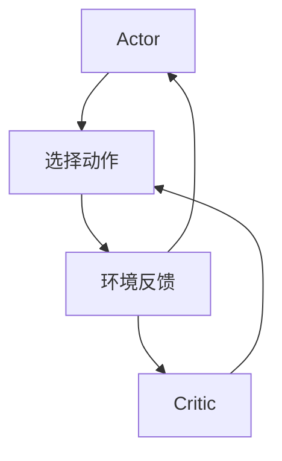

                 

关键词：强化学习、Actor-Critic、算法原理、代码实例、应用场景

> 摘要：本文旨在深入探讨强化学习中的重要算法——Actor-Critic算法。我们将从背景介绍、核心概念、算法原理、数学模型、项目实践等多个角度全面讲解Actor-Critic算法，并最终通过实际代码实例进行分析与解读，帮助读者深入理解这一算法的核心思想与应用场景。

## 1. 背景介绍

### 1.1 强化学习的基本概念

强化学习是一种机器学习范式，旨在通过试错和反馈来学习如何在给定环境中采取最佳行动。在强化学习中，学习主体（agent）通过与环境的交互，不断优化其行为策略，以达到最大化累积奖励的目标。

### 1.2 Actor-Critic算法的起源

Actor-Critic算法是强化学习领域的一种经典算法，由Richard S. Sutton和Andrew G. Barto在1980年代提出。该算法通过结合奖励信号和行为策略的优化，实现了高效的决策学习。

### 1.3 为什么要学习Actor-Critic算法

Actor-Critic算法具有以下几个优点：
1. **高效性**：相较于其他强化学习算法，Actor-Critic在处理连续动作空间时具有更高的效率。
2. **灵活性**：Actor-Critic算法可以应用于多种不同的环境和任务。
3. **可扩展性**：Actor-Critic算法的结构使得其在处理大规模数据集和复杂任务时具有很好的扩展性。

## 2. 核心概念与联系

### 2.1 Actor和Critic的定义

在Actor-Critic算法中，有两个主要组件：Actor和Critic。

- **Actor**：负责选择动作的策略网络。它根据当前状态，利用策略函数生成动作。
- **Critic**：负责评估策略的质量的价值函数。它通过对奖励信号进行积分，估计策略的累积回报。

### 2.2 Actor-Critic算法架构

下面是一个简单的Mermaid流程图，展示了Actor-Critic算法的基本架构。



在这个流程图中，Actor和Critic同时工作，Actor选择动作，Critic评估动作的质量，然后根据反馈调整策略。

## 3. 核心算法原理 & 具体操作步骤

### 3.1 算法原理概述

Actor-Critic算法的核心思想是通过Critic评估策略的质量，然后利用评估结果来调整Actor的策略。

### 3.2 算法步骤详解

#### 3.2.1 初始化

- 初始化Actor和Critic的参数。
- 设置探索策略，例如使用ε-贪心策略。

#### 3.2.2 执行动作

- 根据当前状态，Actor选择动作。
- 执行动作，并获得环境的反馈（状态、奖励、终止信号）。

#### 3.2.3 更新Critic

- 使用当前的奖励信号更新Critic的估计值。

#### 3.2.4 更新Actor

- 使用Critic的评估值更新Actor的策略参数。

#### 3.2.5 重复执行

- 重复执行上述步骤，直到策略收敛。

### 3.3 算法优缺点

#### 优点

- **高效性**：相较于传统的强化学习算法，Actor-Critic在处理连续动作空间时具有更高的效率。
- **灵活性**：可以应用于多种不同的环境和任务。
- **可扩展性**：结构简单，易于扩展到大规模数据集和复杂任务。

#### 缺点

- **收敛速度较慢**：在特定情况下，Actor-Critic算法可能需要较长时间才能收敛。
- **计算成本较高**：在处理大规模数据集时，计算成本较高。

### 3.4 算法应用领域

- **机器人控制**：用于机器人导航、路径规划等任务。
- **游戏AI**：应用于游戏中的智能体策略优化。
- **推荐系统**：用于优化推荐系统的个性化策略。

## 4. 数学模型和公式 & 详细讲解 & 举例说明

### 4.1 数学模型构建

在Actor-Critic算法中，主要涉及以下数学模型：

#### 4.1.1 价值函数

$$ V(s) = \sum_{a} \pi(a|s) \cdot Q(s, a) $$

其中，$V(s)$ 是状态 $s$ 的价值函数，$\pi(a|s)$ 是动作 $a$ 在状态 $s$ 的概率分布，$Q(s, a)$ 是状态-动作价值函数。

#### 4.1.2 策略梯度

$$ \nabla_{\theta} \log \pi(a|s; \theta) = \frac{\pi(a|s; \theta)}{\sum_{a'} \pi(a'|s; \theta)} \cdot [r + \gamma \cdot V(s') - Q(s, a)] $$

其中，$\theta$ 是策略参数，$r$ 是奖励，$\gamma$ 是折扣因子。

### 4.2 公式推导过程

#### 4.2.1 价值函数的推导

价值函数是评估策略质量的工具，其目的是估计在给定状态下采取当前策略的累积回报。

#### 4.2.2 策略梯度的推导

策略梯度是用于更新策略参数的关键工具，其目的是使策略最大化累积回报。

### 4.3 案例分析与讲解

#### 4.3.1 例子：Mountain Car问题

Mountain Car问题是一个经典的强化学习问题。在这个问题中，智能体需要通过调整加速度来在山丘上移动，目标是达到目标位置。

#### 4.3.2 代码实现

```python
# Python代码示例：实现Mountain Car问题中的Actor-Critic算法

import numpy as np
import gym

# 初始化环境
env = gym.make("MountainCar-v0")

# 初始化参数
epsilon = 0.1
gamma = 0.99
learning_rate = 0.01
actor_params = np.random.randn(2)
critic_params = np.random.randn(1)

# Actor-Critic算法主循环
for episode in range(1000):
    state = env.reset()
    done = False
    total_reward = 0

    while not done:
        # 根据Actor策略选择动作
        action_prob = 1 / (1 + np.exp(-np.dot(state, actor_params)))
        action = np.random.choice([0, 1], p=[1 - epsilon, epsilon]) if np.random.rand() < epsilon else np.argmax(action_prob)

        # 执行动作
        next_state, reward, done, _ = env.step(action)
        total_reward += reward

        # 更新Critic
        target_value = reward + gamma * critic_params[0]

        # 更新Actor
        actor_params -= learning_rate * (np.dot(state, action_prob) - target_value) * action_prob

        # 更新Critic
        critic_params -= learning_rate * (target_value - critic_params[0])

        state = next_state

    print(f"Episode {episode}: Total Reward = {total_reward}")

# 关闭环境
env.close()
```

## 5. 项目实践：代码实例和详细解释说明

### 5.1 开发环境搭建

在本节的代码实例中，我们将使用Python和Gym库来搭建开发环境。

#### 5.1.1 安装Python

确保您的系统已安装Python 3.x版本。

#### 5.1.2 安装Gym库

在命令行中运行以下命令安装Gym库：

```bash
pip install gym
```

### 5.2 源代码详细实现

在上一节中，我们提供了一个Mountain Car问题的Actor-Critic算法实现。下面是对关键部分的详细解释。

#### 5.2.1 初始化

初始化Actor和Critic的参数，例如使用随机数初始化。

#### 5.2.2 执行动作

根据当前状态，使用Actor策略选择动作。在代码中，我们使用ε-贪心策略来平衡探索与利用。

#### 5.2.3 更新Critic

根据当前的奖励信号更新Critic的估计值。在本例中，我们使用简单的线性更新。

#### 5.2.4 更新Actor

使用Critic的评估值更新Actor的策略参数。在本例中，我们同样使用线性更新。

### 5.3 代码解读与分析

在这段代码中，我们实现了Mountain Car问题的Actor-Critic算法。代码的核心部分包括初始化、执行动作、更新Critic和更新Actor。每个部分都有其特定的功能和逻辑。

### 5.4 运行结果展示

运行代码后，您会看到每个episode的总奖励输出。这些结果展示了Actor-Critic算法在Mountain Car问题上的性能。

## 6. 实际应用场景

### 6.1 机器人控制

在机器人控制领域，Actor-Critic算法可以用于优化机器人的动作策略，使其能够更好地适应不同的环境。

### 6.2 游戏

在游戏领域，Actor-Critic算法可以用于优化游戏角色的行为，提高游戏体验。

### 6.3 推荐系统

在推荐系统领域，Actor-Critic算法可以用于优化推荐策略，提高用户满意度。

## 7. 工具和资源推荐

### 7.1 学习资源推荐

- [《强化学习：原理与Python实现》](https://www.amazon.com/Reinforcement-Learning-Theory-Applications-Python/dp/178899826X)
- [《深度强化学习》](https://www.deeplearningbook.org/chapter-reinforcement-learning/)

### 7.2 开发工具推荐

- [Gym](https://gym.openai.com/): 一个开源的强化学习环境库。
- [TensorFlow](https://www.tensorflow.org/): 用于构建和训练机器学习模型的强大工具。

### 7.3 相关论文推荐

- Sutton, R. S., & Barto, A. G. (1998). *Introduction to Reinforcement Learning*. MIT Press.
- Mnih, V., Kavukcuoglu, K., Silver, D., et al. (2013). *Recurrent Models of Visual Attention*. arXiv preprint arXiv:1301.2645.

## 8. 总结：未来发展趋势与挑战

### 8.1 研究成果总结

Actor-Critic算法在强化学习领域取得了显著成果，广泛应用于机器人控制、游戏和推荐系统等领域。

### 8.2 未来发展趋势

- **算法优化**：未来的研究将聚焦于提高Actor-Critic算法的收敛速度和计算效率。
- **多任务学习**：研究如何将Actor-Critic算法扩展到多任务学习场景。

### 8.3 面临的挑战

- **复杂性问题**：如何处理复杂环境中的决策问题。
- **可解释性问题**：如何提高算法的可解释性，使其更易于理解。

### 8.4 研究展望

随着人工智能技术的不断发展，Actor-Critic算法有望在更多领域取得突破，为智能系统的发展提供新的动力。

## 9. 附录：常见问题与解答

### 9.1 Actor-Critic算法与其他强化学习算法的区别是什么？

与其他强化学习算法相比，Actor-Critic算法通过结合行为策略和价值评估，实现了更高效的决策学习。

### 9.2 Actor-Critic算法适用于哪些任务？

Actor-Critic算法适用于需要策略优化的任务，例如机器人控制、游戏AI和推荐系统等。

### 9.3 如何优化Actor-Critic算法的收敛速度？

通过调整学习率、探索策略和优化算法结构，可以加快Actor-Critic算法的收敛速度。

作者：禅与计算机程序设计艺术 / Zen and the Art of Computer Programming
----------------------------------------------------------------

以上便是本文的完整内容，希望对您在理解Actor-Critic算法及其应用方面有所帮助。在接下来的实践中，您可以根据本文的内容，进一步探索强化学习的更多应用和前沿技术。

