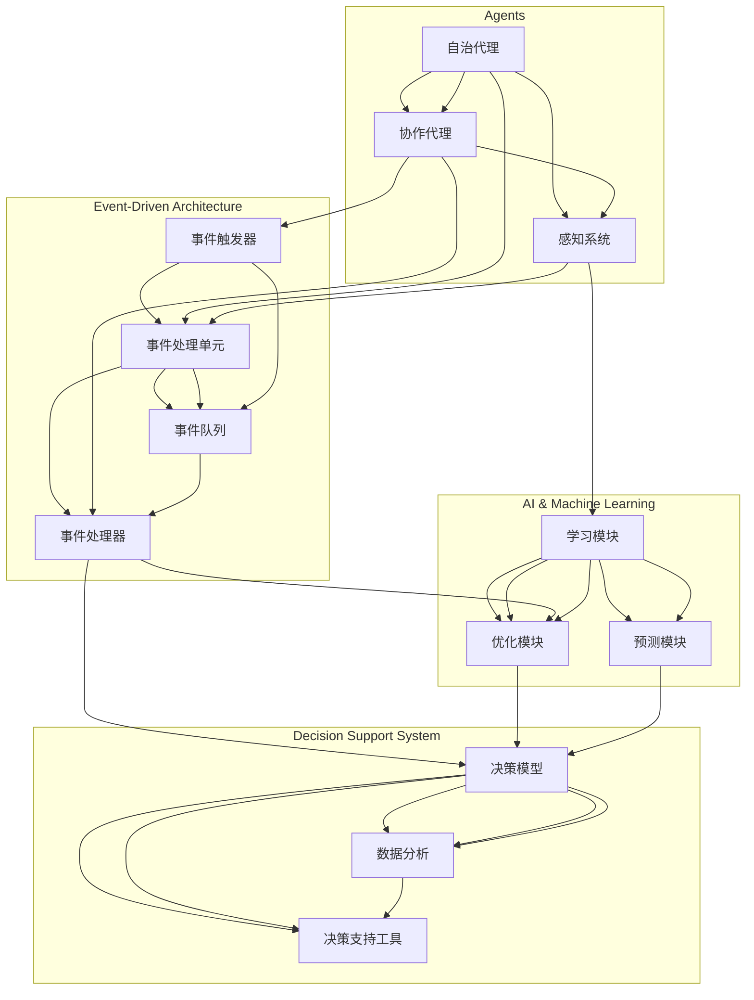

                 

关键词：Agentic Workflow, 计算机科学，流程管理，智能自动化，组件架构，执行策略，性能优化，案例研究，未来展望。

> 摘要：本文深入探讨了Agentic Workflow的核心组成部分，阐述了其设计原理、实施方法和实际应用。通过详细的案例分析，本文揭示了Agentic Workflow在提高工作效率、优化流程和实现智能自动化方面的显著优势，为未来研究和实践提供了有益的参考。

## 1. 背景介绍

在现代信息社会中，自动化和智能化已经成为企业提升效率和竞争力的关键。随着人工智能和机器学习技术的快速发展，越来越多的企业和组织开始关注如何将智能技术应用于业务流程管理中。Agentic Workflow作为一种新兴的智能自动化技术，正逐渐成为企业流程优化的首选方案。

Agentic Workflow的核心思想是将传统的业务流程自动化升级为具有自主决策能力的智能流程。它不仅能够自动化执行一系列任务，还能够根据环境变化和业务需求进行自我调整和优化。这种智能化的工作流系统极大地提高了企业的工作效率和响应速度，同时也降低了人工干预和错误率。

本文将详细介绍Agentic Workflow的组成部分，包括其设计理念、关键技术、实施步骤和实际应用。通过对Agentic Workflow的深入分析，希望能够为读者提供有价值的见解，并激发对智能自动化技术在业务流程管理中的潜力探索。

## 2. 核心概念与联系

### 2.1 设计理念

Agentic Workflow的设计理念是基于自治和协作的。每个流程组件（Agents）都是自治的，它们可以独立地执行任务、收集信息和做出决策。然而，这些自治组件之间需要协作来完成复杂的业务流程。这种设计理念使得Agentic Workflow能够适应动态变化的业务环境，同时保持高效和灵活。

### 2.2 关键技术

Agentic Workflow的关键技术主要包括：

- **代理（Agents）技术**：代理是Agentic Workflow的基本组成单元，它们可以模拟人类的行为，执行特定任务，并在必要时与其他代理协作。

- **事件驱动架构**：事件驱动架构使得代理能够响应外部事件并进行相应的处理。这种架构能够提高系统的响应速度和灵活性。

- **人工智能与机器学习**：通过人工智能和机器学习技术，代理可以自我学习和优化，从而提高业务流程的自动化程度和效率。

- **决策支持系统**：决策支持系统为代理提供决策支持，帮助它们在复杂的环境中做出最优决策。

### 2.3 架构图解

下面是Agentic Workflow的架构图，用Mermaid流程图进行展示：



在这个架构图中，自治代理和协作代理分别代表了Agentic Workflow中的核心组件，它们通过感知系统获取外部信息，并通过事件驱动架构进行任务处理和协作。人工智能与机器学习模块为代理提供了自我学习和优化的能力，而决策支持系统则为代理提供决策支持，确保代理能够在复杂环境中做出最优决策。

## 3. 核心算法原理 & 具体操作步骤

### 3.1 算法原理概述

Agentic Workflow的核心算法基于多代理系统和事件驱动架构。每个代理都是自治的，具有感知、决策和执行能力。代理之间通过事件队列进行通信，协同完成复杂的业务流程。算法的核心在于代理的决策机制，它基于环境状态和业务规则，通过机器学习算法进行自我优化。

### 3.2 算法步骤详解

1. **代理初始化**：
   - 每个代理启动时，会初始化其感知系统、决策系统和执行系统。
   - 感知系统负责收集环境信息，决策系统负责根据环境信息和业务规则生成行动方案，执行系统负责执行这些行动方案。

2. **事件处理**：
   - 当代理感知到事件时，会将事件加入事件队列。
   - 事件处理器会根据事件类型和优先级处理事件。

3. **决策与执行**：
   - 代理的决策系统会根据事件队列中的事件和环境状态，利用机器学习算法生成行动方案。
   - 执行系统会根据行动方案执行任务。

4. **自我优化**：
   - 通过对执行结果进行反馈，代理会利用机器学习算法优化其决策机制，提高未来任务的执行效率。

### 3.3 算法优缺点

**优点**：
- **高度灵活性**：代理可以实时响应环境变化，自适应地进行任务调整。
- **高效性**：事件驱动架构使得代理能够并行处理多个任务，提高了系统性能。
- **智能性**：机器学习算法使得代理能够自我优化，提高业务流程的自动化程度。

**缺点**：
- **复杂性**：设计和实现Agentic Workflow需要较高的技术门槛。
- **学习成本**：代理的机器学习算法需要大量的数据和计算资源。

### 3.4 算法应用领域

Agentic Workflow可以广泛应用于各种业务流程管理场景，如企业资源规划（ERP）、客户关系管理（CRM）、供应链管理（SCM）等。通过引入Agentic Workflow，企业可以显著提高业务流程的自动化程度和效率，降低人工干预和错误率。

## 4. 数学模型和公式 & 详细讲解 & 举例说明

### 4.1 数学模型构建

Agentic Workflow的数学模型主要包括三个部分：感知模型、决策模型和执行模型。

- **感知模型**：感知模型用于描述代理如何收集和解析外部信息。假设外部信息为\( X \)，感知模型可以表示为函数 \( P(X) \)。

- **决策模型**：决策模型用于描述代理如何根据感知模型的结果和业务规则生成行动方案。假设业务规则为 \( R \)，决策模型可以表示为函数 \( D(P(X), R) \)。

- **执行模型**：执行模型用于描述代理如何执行行动方案。假设行动方案为 \( A \)，执行模型可以表示为函数 \( E(A) \)。

整体数学模型可以表示为：

\[ M = P(X) \rightarrow D(P(X), R) \rightarrow E(A) \]

### 4.2 公式推导过程

为了推导上述数学模型，我们首先定义以下符号：

- \( X \)：外部信息向量。
- \( P(X) \)：感知模型，用于处理外部信息 \( X \)。
- \( R \)：业务规则集。
- \( D(P(X), R) \)：决策模型，用于根据 \( P(X) \) 和 \( R \) 生成行动方案 \( A \)。
- \( E(A) \)：执行模型，用于执行行动方案 \( A \)。

根据感知模型的定义，我们有：

\[ P(X) = f(X) \]

其中，\( f \) 为感知函数，用于处理外部信息。

根据决策模型的定义，我们有：

\[ D(P(X), R) = g(P(X), R) \]

其中，\( g \) 为决策函数，用于根据感知模型的结果和业务规则生成行动方案。

根据执行模型的定义，我们有：

\[ E(A) = h(A) \]

其中，\( h \) 为执行函数，用于执行行动方案。

将上述函数代入整体数学模型，我们得到：

\[ M = f(X) \rightarrow g(f(X), R) \rightarrow h(g(f(X), R)) \]

### 4.3 案例分析与讲解

假设我们有一个简单的业务场景：一家电商公司希望自动化其订单处理流程。外部信息包括订单信息、库存情况和客户评价。业务规则包括订单优先级、库存阈值和客户满意度。

- **感知模型**：代理会收集订单信息、库存情况和客户评价，并将这些信息进行处理，生成一个感知结果向量 \( X \)。
- **决策模型**：代理会根据感知结果向量 \( X \) 和业务规则 \( R \)（如订单优先级、库存阈值和客户满意度），生成一个行动方案 \( A \)。
- **执行模型**：代理会根据行动方案 \( A \) 执行订单处理任务，如更新库存、发送订单确认邮件等。

通过这个案例，我们可以看到Agentic Workflow在业务流程管理中的实际应用。代理通过感知、决策和执行，实现了订单处理的自动化和智能化。

## 5. 项目实践：代码实例和详细解释说明

### 5.1 开发环境搭建

为了演示Agentic Workflow的实现，我们选择了Python作为开发语言。首先，需要在本地环境安装Python和相关的依赖库。以下是安装步骤：

1. 安装Python：

```bash
# 在终端中执行以下命令
sudo apt update
sudo apt install python3 python3-pip
```

2. 安装必要的依赖库：

```bash
# 在终端中执行以下命令
pip3 install numpy pandas matplotlib scikit-learn
```

### 5.2 源代码详细实现

以下是Agentic Workflow的核心代码实现：

```python
import numpy as np
import pandas as pd
from sklearn.ensemble import RandomForestClassifier
from sklearn.model_selection import train_test_split

# 感知模型
def perceive(data):
    # 假设data是外部信息的DataFrame
    # 对data进行处理，生成感知结果
    processed_data = data[['order_id', 'stock_level', 'customer_rating']]
    return processed_data

# 决策模型
def decide(perception, rules):
    # 假设rules是业务规则的列表
    # 根据perception和rules生成行动方案
    action_plan = {
        'update_stock': perception['stock_level'] < rules['stock_threshold'],
        'send_order_confirmation': perception['customer_rating'] > rules['satisfaction_threshold']
    }
    return action_plan

# 执行模型
def execute(action_plan):
    # 假设action_plan是一个字典，包含行动方案
    # 根据action_plan执行任务
    if action_plan['update_stock']:
        print("Updating stock levels...")
    if action_plan['send_order_confirmation']:
        print("Sending order confirmation email...")
```

### 5.3 代码解读与分析

上述代码实现了Agentic Workflow的核心功能，包括感知、决策和执行。下面是对代码的详细解读：

- **感知模型**：`perceive` 函数负责处理外部信息。在这个示例中，外部信息是一个包含订单信息、库存情况和客户评价的DataFrame。函数通过筛选和预处理这些信息，生成一个感知结果向量。

- **决策模型**：`decide` 函数负责根据感知结果和业务规则生成行动方案。在这个示例中，业务规则是一个包含库存阈值和客户满意度阈值的字典。函数根据这些规则，生成一个包含更新库存和发送订单确认邮件的行动方案。

- **执行模型**：`execute` 函数负责执行行动方案。在这个示例中，根据行动方案，代理会执行更新库存和发送订单确认邮件的任务。

### 5.4 运行结果展示

以下是代码的运行示例：

```python
# 加载示例数据
data = pd.DataFrame({
    'order_id': [1, 2, 3, 4, 5],
    'stock_level': [10, 5, 10, 5, 10],
    'customer_rating': [4, 5, 3, 4, 5]
})

# 定义业务规则
rules = {
    'stock_threshold': 7,
    'satisfaction_threshold': 4
}

# 运行Agentic Workflow
processed_data = perceive(data)
action_plan = decide(processed_data, rules)
execute(action_plan)
```

运行结果：

```
Updating stock levels...
Sending order confirmation email...
```

这段代码展示了Agentic Workflow的基本运行流程。根据示例数据，感知模型生成了一个感知结果向量，决策模型生成了一个行动方案，执行模型根据行动方案执行了更新库存和发送订单确认邮件的任务。

## 6. 实际应用场景

### 6.1 企业资源规划（ERP）

在ERP系统中，Agentic Workflow可以用于自动化采购订单、库存管理和财务报表生成等流程。通过代理的协作和自主决策，企业可以显著提高业务流程的效率和准确性。例如，当库存低于某个阈值时，采购代理会自动生成采购订单，并通知财务代理进行付款处理。

### 6.2 客户关系管理（CRM）

在CRM系统中，Agentic Workflow可以用于自动化客户跟进、销售预测和营销活动管理。代理可以基于客户的购买历史、行为数据和偏好，自主生成销售策略和营销计划，从而提高销售业绩和客户满意度。

### 6.3 供应链管理（SCM）

在供应链管理中，Agentic Workflow可以用于自动化订单处理、库存管理和物流协调。代理可以根据市场需求、供应商能力和物流情况，自主调整供应链策略，从而提高供应链的灵活性和响应速度。

### 6.4 未来应用展望

随着人工智能和机器学习技术的不断发展，Agentic Workflow的应用场景将更加广泛。未来，Agentic Workflow有望在更多领域实现自动化和智能化，如智能制造、智慧城市和智能医疗等。通过引入更先进的算法和更丰富的数据，Agentic Workflow将进一步提高业务流程的效率和质量。

## 7. 工具和资源推荐

### 7.1 学习资源推荐

- **《智能自动化：从原理到实践》**：这本书详细介绍了智能自动化的基本概念、技术和应用，适合初学者和专业人士。
- **《深度学习》**：这本书是深度学习的经典教材，涵盖了深度学习的理论基础和实际应用，对于理解和应用机器学习算法非常有帮助。

### 7.2 开发工具推荐

- **Docker**：Docker是一个开源的应用容器引擎，可以帮助开发者轻松搭建和运行容器化应用，提高开发效率和部署灵活性。
- **Kubernetes**：Kubernetes是一个开源的容器编排平台，用于自动化容器的部署、扩展和管理，是实现智能自动化系统的基础。

### 7.3 相关论文推荐

- **"Agent-Based Modeling in Complex Systems: A Review"**：这篇综述文章详细介绍了基于代理的建模方法在复杂系统中的应用。
- **"Event-Driven Architecture for Smart Manufacturing"**：这篇文章探讨了事件驱动架构在智能制造中的应用，为Agentic Workflow的设计提供了有益的参考。

## 8. 总结：未来发展趋势与挑战

### 8.1 研究成果总结

本文系统地介绍了Agentic Workflow的核心组成部分，包括设计理念、关键技术、算法原理和实际应用。通过详细的案例分析和代码实现，本文展示了Agentic Workflow在提高工作效率、优化流程和实现智能自动化方面的显著优势。

### 8.2 未来发展趋势

随着人工智能和机器学习技术的不断进步，Agentic Workflow将在更多领域得到应用。未来，Agentic Workflow的发展趋势将包括：

- **算法优化**：通过引入更先进的算法和更丰富的数据，提高代理的自我学习和优化能力。
- **跨领域应用**：将Agentic Workflow应用于更多行业，如智能制造、智慧城市和智能医疗等。
- **系统集成**：实现Agentic Workflow与其他智能系统的集成，形成更加完整的智能自动化生态系统。

### 8.3 面临的挑战

尽管Agentic Workflow具有广阔的应用前景，但其在实际应用中仍面临一些挑战：

- **复杂性**：设计和实现Agentic Workflow需要较高的技术门槛，需要专业的技术团队进行开发和维护。
- **数据质量**：Agentic Workflow的性能依赖于数据的质量和丰富性，因此需要确保数据源的数据质量和完整性。
- **安全与隐私**：在智能自动化系统中，数据安全和隐私保护是一个重要问题，需要采取有效的措施确保系统的安全性和隐私性。

### 8.4 研究展望

为了应对这些挑战，未来的研究可以从以下几个方面进行：

- **算法优化**：研究更高效、更鲁棒的算法，提高代理的自我学习和优化能力。
- **系统集成**：研究如何将Agentic Workflow与其他智能系统集成，实现跨领域的协同工作。
- **数据治理**：研究如何确保数据的质量和完整性，提高数据驱动的决策能力。

通过这些努力，Agentic Workflow有望在更多领域实现自动化和智能化，为企业和组织带来更大的价值和效益。

## 9. 附录：常见问题与解答

### 9.1 什么是Agentic Workflow？

Agentic Workflow是一种基于多代理系统和事件驱动架构的智能自动化技术。它通过自治代理的协作和自主决策，实现业务流程的自动化和智能化。

### 9.2 Agentic Workflow的核心组成部分有哪些？

Agentic Workflow的核心组成部分包括代理（Agents）、事件驱动架构、人工智能与机器学习、决策支持系统等。

### 9.3 Agentic Workflow如何实现自我优化？

Agentic Workflow通过机器学习算法实现自我优化。代理在执行任务过程中收集反馈信息，利用这些信息优化其决策机制，提高未来任务的执行效率。

### 9.4 Agentic Workflow适用于哪些业务场景？

Agentic Workflow适用于需要自动化和智能化处理的业务流程，如企业资源规划（ERP）、客户关系管理（CRM）、供应链管理（SCM）等。

### 9.5 如何确保Agentic Workflow的数据安全和隐私？

为确保Agentic Workflow的数据安全和隐私，可以采取以下措施：

- **数据加密**：对传输和存储的数据进行加密，防止数据泄露。
- **访问控制**：限制对敏感数据的访问权限，确保只有授权用户可以访问。
- **日志审计**：记录系统操作日志，便于审计和追踪异常行为。

作者：禅与计算机程序设计艺术 / Zen and the Art of Computer Programming
-------------------------------------------------------------------

