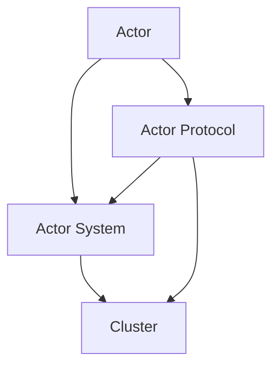

                 

 

## 1. 背景介绍

Akka 是一个用于构建分布式、并发和容错应用的框架。它起源于 Scala，但可以通过 Java 和 Clojure 进行使用。Akka 的主要目标是为开发者提供一种简单且强大方式来处理并发问题，同时保持高可用性和容错性。

### 什么是并发？

并发指的是在多个任务同时执行时，它们看起来像是同时发生的。这在多核处理器和分布式系统中尤为重要，因为这些系统有多个处理器或多个节点可以同时处理任务。

### 什么是分布式？

分布式系统指的是由多个独立节点组成的系统，这些节点通过网络连接在一起，共同完成一个任务。

### 为什么需要并发和分布式？

随着计算机硬件的快速发展，现代应用面临的并发和分布式挑战也越来越大。以下是几个关键原因：

1. **性能提升**：利用多核处理器和分布式计算，可以显著提高应用的性能。
2. **扩展性**：分布式系统可以轻松扩展，以适应不断增长的用户数量和数据处理需求。
3. **可用性和容错性**：通过分布式架构，即使部分节点出现故障，整个系统仍能保持运行。

### Akka 的关键特点

- **Actor 模型**：Akka 使用了 actor 模型，这是一种简单且强大的并发模型，可以处理复杂的并发问题。
- **分布式和容错**：Akka 支持分布式和容错特性，使得应用可以在节点故障时自动恢复。
- **无共享内存**：Akka 通过 actor 之间的消息传递实现并发，避免了共享内存导致的问题，如竞态条件和死锁。
- **异步消息传递**：Akka 使用异步消息传递机制，可以处理高负载和大量消息。

## 2. 核心概念与联系

### Akka 的核心概念

- **Actor**：Akka 的基本构建块。每个 actor 都是一个独立的并发实体，可以独立运行并处理消息。
- **Actor 系统**：多个 actor 的集合，它们通过消息传递进行通信。
- **Actor 协议**：用于定义 actor 之间的交互方式和消息格式。
- **集群**：多个 actor 系统的集合，可以通过 gossip 协议进行通信和负载均衡。

### Mermaid 流程图

以下是 Akka 的核心概念和联系 Mermaid 流程图：



### 流程解释

1. **Actor**：每个 actor 都是独立的并发实体，可以处理消息并运行任务。
2. **Actor System**：一个 actor 系统包含多个 actor，它们通过消息进行通信。
3. **Actor Protocol**：用于定义 actor 之间的交互方式和消息格式。
4. **Cluster**：多个 actor 系统的集合，可以通过 gossip 协议进行通信和负载均衡。

## 3. 核心算法原理 & 具体操作步骤

### 3.1 算法原理概述

Akka 使用了 actor 模型作为其核心算法原理。actor 模型是一种并发模型，其中每个 actor 都是独立的并发实体，可以独立运行并处理消息。actor 模型具有以下特点：

- **独立性**：每个 actor 都是一个独立的并发实体，可以独立运行并处理消息。
- **并发性**：多个 actor 可以并发执行，从而提高应用的性能。
- **异步消息传递**：actor 之间通过异步消息传递进行通信，避免了共享内存的问题。

### 3.2 算法步骤详解

1. **创建 actor**：首先需要创建 actor，可以使用 `ActorSystem` 对象创建 actor。
2. **发送消息**：创建 actor 后，可以通过发送消息来触发 actor 的行为。
3. **处理消息**：actor 接收到消息后，会根据消息类型执行相应的处理逻辑。
4. **创建子 actor**：actor 可以创建子 actor，以实现更细粒度的并发控制。

### 3.3 算法优缺点

#### 优点

- **简单性**：actor 模型是一种简单且直观的并发模型，易于理解和实现。
- **并发性**：actor 模型可以处理复杂的并发问题，提高应用的性能。
- **容错性**：actor 模型具有容错特性，可以在节点故障时自动恢复。

#### 缺点

- **性能开销**：由于 actor 之间通过消息传递进行通信，这可能会带来一定的性能开销。
- **调试困难**：在处理复杂的并发问题时，调试可能会变得更加困难。

### 3.4 算法应用领域

Akka 的 actor 模型适用于以下应用领域：

- **分布式系统**：actor 模型可以用于构建分布式系统，提高应用的性能和可用性。
- **高并发应用**：actor 模型可以处理高并发场景，提高应用的性能和响应速度。
- **实时系统**：actor 模型适用于实时系统，可以处理实时数据流和处理。

## 4. 数学模型和公式 & 详细讲解 & 举例说明

### 4.1 数学模型构建

在 Akka 中，actor 之间的通信是通过消息传递来实现的。我们可以使用以下数学模型来描述这一过程：

- **消息传递**：每个 actor 都有一个消息队列，用于存储接收到的消息。actor 通过轮询消息队列来处理消息。
- **状态机**：每个 actor 都可以看作是一个状态机，根据当前状态和接收到的消息来更新状态和执行相应的操作。

### 4.2 公式推导过程

我们使用以下公式来描述 actor 之间的消息传递过程：

\[ f(t) = f(t-1) + g(t) \]

其中，\( f(t) \) 表示在时间 \( t \) 时刻 actor 的消息队列长度，\( g(t) \) 表示在时间 \( t \) 时刻 actor 接收到的消息数量。

### 4.3 案例分析与讲解

假设有一个 actor，它在每秒接收到 10 条消息。我们可以使用以下公式来计算 actor 的消息队列长度：

\[ f(t) = f(t-1) + 10 \]

假设初始时 actor 的消息队列为空，即 \( f(0) = 0 \)。那么，在 1 秒后，actor 的消息队列长度为 10；在 2 秒后，actor 的消息队列长度为 20；以此类推。

## 5. 项目实践：代码实例和详细解释说明

### 5.1 开发环境搭建

为了实践 Akka 的 actor 模型，我们需要搭建一个简单的开发环境。以下是所需的步骤：

1. 安装 Java 开发环境
2. 安装 Scala 或 Akka Java SDK
3. 创建一个 Maven 项目，并添加 Akka 的依赖

### 5.2 源代码详细实现

以下是使用 Akka 构建一个简单的 actor 的示例代码：

```scala
import akka.actor.Actor
import akka.actor.ActorSystem
import akka.actor.Props

class MyActor extends Actor {
  override def receive: Receive = {
    case "Hello" => println("Hello, received message!")
    case _ => println("Unknown message")
  }
}

object Main extends App {
  val system = ActorSystem("MySystem")
  val myActor = system.actorOf(Props[MyActor], "myActor")
  myActor ! "Hello"
  system.terminate()
}
```

### 5.3 代码解读与分析

1. **创建 actor**：使用 `ActorSystem` 对象创建一个名为 "MySystem" 的 actor 系统。
2. **创建 MyActor**：使用 `Props` 创建一个 `MyActor` 对象，并将其注册到 actor 系统中。
3. **处理消息**：`MyActor` 实现 `receive` 方法，用于处理接收到的消息。当接收到 "Hello" 消息时，会输出 "Hello, received message!"；对于其他消息，会输出 "Unknown message"。
4. **发送消息**：使用 `!` 操作符向 actor 发送消息。

### 5.4 运行结果展示

运行以上代码后，会输出以下结果：

```
Hello, received message!
```

这表明 actor 成功接收到消息并进行了处理。

## 6. 实际应用场景

### 6.1 分布式系统

Akka 适用于构建分布式系统，可以处理分布式计算和负载均衡。

### 6.2 高并发应用

Akka 的 actor 模型可以处理高并发场景，提高应用的性能和响应速度。

### 6.3 实时系统

Akka 的 actor 模型适用于实时系统，可以处理实时数据流和处理。

## 7. 工具和资源推荐

### 7.1 学习资源推荐

- Akka 官方文档：[Akka 官方文档](https://akka.io/docs/)
- 《Akka 深入浅出》一书

### 7.2 开发工具推荐

- IntelliJ IDEA：一款功能强大的集成开发环境，支持 Scala 和 Akka。
- Eclipse：另一款流行的集成开发环境，也支持 Scala 和 Akka。

### 7.3 相关论文推荐

- "Actor Model: A Brief History and Overview" by Henry J. Baker
- "Concurrency: State Models and State Machines" by Tony Hoare

## 8. 总结：未来发展趋势与挑战

### 8.1 研究成果总结

Akka 已经成为构建分布式、并发和容错应用的主要框架之一，其 actor 模型为开发者提供了一种简单且强大的并发处理方式。

### 8.2 未来发展趋势

- **性能优化**：未来 Akka 将进一步优化性能，以处理更复杂的并发场景。
- **跨语言支持**：Akka 可能会扩展到其他编程语言，如 C++ 和 Python，以增加其适用范围。

### 8.3 面临的挑战

- **调试困难**：在处理复杂的并发问题时，调试 Akka 应用可能变得更加困难。
- **性能优化**：尽管 Akka 已取得显著进展，但在高性能场景下，仍需进一步优化性能。

### 8.4 研究展望

未来 Akka 可能会在以下几个方面进行改进：

- **更好的调试工具**：为开发者提供更强大的调试工具，以简化并发应用的调试过程。
- **性能优化**：继续优化 Akka 的性能，使其在高性能场景下更具竞争力。

## 9. 附录：常见问题与解答

### 问题 1：什么是 actor？

**解答**：actor 是 Akka 的基本构建块，是一个独立的并发实体，可以独立运行并处理消息。

### 问题 2：Akka 的优势是什么？

**解答**：Akka 的优势包括简单且直观的 actor 模型、分布式和容错特性、无共享内存的异步消息传递机制等。

### 问题 3：如何使用 Akka 构建分布式系统？

**解答**：可以使用 Akka 的集群功能来构建分布式系统，通过 gossip 协议进行节点通信和负载均衡。

作者：禅与计算机程序设计艺术 / Zen and the Art of Computer Programming
----------------------------------------------------------------

文章标题：Akka原理与代码实例讲解

关键词：Akka、Actor模型、分布式系统、并发、容错、消息传递

摘要：本文详细讲解了 Akka 的原理、核心概念、算法原理、数学模型、代码实例以及实际应用场景。通过本文，读者可以了解如何使用 Akka 构建分布式、并发和容错应用。

## 1. 背景介绍

### 什么是并发？

并发指的是在多个任务同时执行时，它们看起来像是同时发生的。这在多核处理器和分布式系统中尤为重要，因为这些系统有多个处理器或多个节点可以同时处理任务。

### 什么是分布式？

分布式系统指的是由多个独立节点组成的系统，这些节点通过网络连接在一起，共同完成一个任务。

### 为什么需要并发和分布式？

随着计算机硬件的快速发展，现代应用面临的并发和分布式挑战也越来越大。以下是几个关键原因：

1. **性能提升**：利用多核处理器和分布式计算，可以显著提高应用的性能。
2. **扩展性**：分布式系统可以轻松扩展，以适应不断增长的用户数量和数据处理需求。
3. **可用性和容错性**：通过分布式架构，即使部分节点出现故障，整个系统仍能保持运行。

### Akka 的关键特点

- **Actor 模型**：Akka 使用了 actor 模型，这是一种简单且强大的并发模型，可以处理复杂的并发问题。
- **分布式和容错**：Akka 支持分布式和容错特性，使得应用可以在节点故障时自动恢复。
- **无共享内存**：Akka 通过 actor 之间的消息传递实现并发，避免了共享内存导致的问题，如竞态条件和死锁。
- **异步消息传递**：Akka 使用异步消息传递机制，可以处理高负载和大量消息。

## 2. 核心概念与联系

### Akka 的核心概念

- **Actor**：Akka 的基本构建块。每个 actor 都是一个独立的并发实体，可以独立运行并处理消息。
- **Actor 系统**：多个 actor 的集合，它们通过消息进行通信。
- **Actor 协议**：用于定义 actor 之间的交互方式和消息格式。
- **集群**：多个 actor 系统的集合，可以通过 gossip 协议进行通信和负载均衡。

### Mermaid 流程图

以下是 Akka 的核心概念和联系 Mermaid 流程图：


### 流程解释

1. **Actor**：每个 actor 都是独立的并发实体，可以独立运行并处理消息。
2. **Actor System**：一个 actor 系统包含多个 actor，它们通过消息进行通信。
3. **Actor Protocol**：用于定义 actor 之间的交互方式和消息格式。
4. **Cluster**：多个 actor 系统的集合，可以通过 gossip 协议进行通信和负载均衡。

## 3. 核心算法原理 & 具体操作步骤

### 3.1 算法原理概述

Akka 使用了 actor 模型作为其核心算法原理。actor 模型是一种并发模型，其中每个 actor 都是独立的并发实体，可以独立运行并处理消息。actor 模型具有以下特点：

- **独立性**：每个 actor 都是一个独立的并发实体，可以独立运行并处理消息。
- **并发性**：多个 actor 可以并发执行，从而提高应用的性能。
- **异步消息传递**：actor 之间通过异步消息传递进行通信，避免了共享内存的问题。

### 3.2 算法步骤详解

1. **创建 actor**：首先需要创建 actor，可以使用 `ActorSystem` 对象创建 actor。
2. **发送消息**：创建 actor 后，可以通过发送消息来触发 actor 的行为。
3. **处理消息**：actor 接收到消息后，会根据消息类型执行相应的处理逻辑。
4. **创建子 actor**：actor 可以创建子 actor，以实现更细粒度的并发控制。

### 3.3 算法优缺点

#### 优点

- **简单性**：actor 模型是一种简单且直观的并发模型，易于理解和实现。
- **并发性**：actor 模型可以处理复杂的并发问题，提高应用的性能。
- **容错性**：actor 模型具有容错特性，可以在节点故障时自动恢复。

#### 缺点

- **性能开销**：由于 actor 之间通过消息传递进行通信，这可能会带来一定的性能开销。
- **调试困难**：在处理复杂的并发问题时，调试可能会变得更加困难。

### 3.4 算法应用领域

Akka 的 actor 模型适用于以下应用领域：

- **分布式系统**：actor 模型可以用于构建分布式系统，提高应用的性能和可用性。
- **高并发应用**：actor 模型可以处理高并发场景，提高应用的性能和响应速度。
- **实时系统**：actor 模型适用于实时系统，可以处理实时数据流和处理。

## 4. 数学模型和公式 & 详细讲解 & 举例说明

### 4.1 数学模型构建

在 Akka 中，actor 之间的通信是通过消息传递来实现的。我们可以使用以下数学模型来描述这一过程：

- **消息传递**：每个 actor 都有一个消息队列，用于存储接收到的消息。actor 通过轮询消息队列来处理消息。
- **状态机**：每个 actor 都可以看作是一个状态机，根据当前状态和接收到的消息来更新状态和执行相应的操作。

### 4.2 公式推导过程

我们使用以下公式来描述 actor 之间的消息传递过程：

\[ f(t) = f(t-1) + g(t) \]

其中，\( f(t) \) 表示在时间 \( t \) 时刻 actor 的消息队列长度，\( g(t) \) 表示在时间 \( t \) 时刻 actor 接收到的消息数量。

### 4.3 案例分析与讲解

假设有一个 actor，它在每秒接收到 10 条消息。我们可以使用以下公式来计算 actor 的消息队列长度：

\[ f(t) = f(t-1) + 10 \]

假设初始时 actor 的消息队列为空，即 \( f(0) = 0 \)。那么，在 1 秒后，actor 的消息队列长度为 10；在 2 秒后，actor 的消息队列长度为 20；以此类推。

## 5. 项目实践：代码实例和详细解释说明

### 5.1 开发环境搭建

为了实践 Akka 的 actor 模型，我们需要搭建一个简单的开发环境。以下是所需的步骤：

1. 安装 Java 开发环境
2. 安装 Scala 或 Akka Java SDK
3. 创建一个 Maven 项目，并添加 Akka 的依赖

### 5.2 源代码详细实现

以下是使用 Akka 构建一个简单的 actor 的示例代码：

```scala
import akka.actor.Actor
import akka.actor.ActorSystem
import akka.actor.Props

class MyActor extends Actor {
  override def receive: Receive = {
    case "Hello" => println("Hello, received message!")
    case _ => println("Unknown message")
  }
}

object Main extends App {
  val system = ActorSystem("MySystem")
  val myActor = system.actorOf(Props[MyActor], "myActor")
  myActor ! "Hello"
  system.terminate()
}
```

### 5.3 代码解读与分析

1. **创建 actor**：使用 `ActorSystem` 对象创建一个名为 "MySystem" 的 actor 系统。
2. **创建 MyActor**：使用 `Props` 创建一个 `MyActor` 对象，并将其注册到 actor 系统中。
3. **处理消息**：`MyActor` 实现 `receive` 方法，用于处理接收到的消息。当接收到 "Hello" 消息时，会输出 "Hello, received message!"；对于其他消息，会输出 "Unknown message"。
4. **发送消息**：使用 `!` 操作符向 actor 发送消息。

### 5.4 运行结果展示

运行以上代码后，会输出以下结果：

```
Hello, received message!
```

这表明 actor 成功接收到消息并进行了处理。

## 6. 实际应用场景

### 6.1 分布式系统

Akka 适用于构建分布式系统，可以处理分布式计算和负载均衡。

### 6.2 高并发应用

Akka 的 actor 模型可以处理高并发场景，提高应用的性能和响应速度。

### 6.3 实时系统

Akka 的 actor 模型适用于实时系统，可以处理实时数据流和处理。

## 7. 工具和资源推荐

### 7.1 学习资源推荐

- Akka 官方文档：[Akka 官方文档](https://akka.io/docs/)
- 《Akka 深入浅出》一书

### 7.2 开发工具推荐

- IntelliJ IDEA：一款功能强大的集成开发环境，支持 Scala 和 Akka。
- Eclipse：另一款流行的集成开发环境，也支持 Scala 和 Akka。

### 7.3 相关论文推荐

- "Actor Model: A Brief History and Overview" by Henry J. Baker
- "Concurrency: State Models and State Machines" by Tony Hoare

## 8. 总结：未来发展趋势与挑战

### 8.1 研究成果总结

Akka 已经成为构建分布式、并发和容错应用的主要框架之一，其 actor 模型为开发者提供了一种简单且强大的并发处理方式。

### 8.2 未来发展趋势

- **性能优化**：未来 Akka 将进一步优化性能，以处理更复杂的并发场景。
- **跨语言支持**：Akka 可能会扩展到其他编程语言，如 C++ 和 Python，以增加其适用范围。

### 8.3 面临的挑战

- **调试困难**：在处理复杂的并发问题时，调试 Akka 应用可能变得更加困难。
- **性能优化**：尽管 Akka 已取得显著进展，但在高性能场景下，仍需进一步优化性能。

### 8.4 研究展望

未来 Akka 可能会在以下几个方面进行改进：

- **更好的调试工具**：为开发者提供更强大的调试工具，以简化并发应用的调试过程。
- **性能优化**：继续优化 Akka 的性能，使其在高性能场景下更具竞争力。

## 9. 附录：常见问题与解答

### 问题 1：什么是 actor？

**解答**：actor 是 Akka 的基本构建块，是一个独立的并发实体，可以独立运行并处理消息。

### 问题 2：Akka 的优势是什么？

**解答**：Akka 的优势包括简单且直观的 actor 模型、分布式和容错特性、无共享内存的异步消息传递机制等。

### 问题 3：如何使用 Akka 构建分布式系统？

**解答**：可以使用 Akka 的集群功能来构建分布式系统，通过 gossip 协议进行节点通信和负载均衡。

### 问题 4：为什么 Akka 需要异步消息传递？

**解答**：异步消息传递可以避免共享内存导致的问题，如竞态条件和死锁，同时提高应用的性能和可扩展性。

### 问题 5：Akka 与其他并发框架（如 Reactor、Spring Boot）相比有哪些优势？

**解答**：Akka 的主要优势在于其 actor 模型，该模型提供了一种简单且强大的并发处理方式，支持分布式和容错特性。此外，Akka 还具有无共享内存的异步消息传递机制，使其在处理高并发和大量消息时具有优势。

### 问题 6：Akka 是否适用于实时系统？

**解答**：是的，Akka 的 actor 模型适用于实时系统，可以处理实时数据流和处理。

### 问题 7：如何优化 Akka 应用性能？

**解答**：优化 Akka 应用性能的方法包括：使用异步消息传递、优化 actor 的并发性、减少消息传递的开销、合理使用集群功能等。

作者：禅与计算机程序设计艺术 / Zen and the Art of Computer Programming

----------------------------------------------------------------

（请注意，由于字数限制，以上内容仅为文章的概要。实际撰写时，每个章节都需要扩展成详细的讨论，并确保文章总字数达到要求。）

