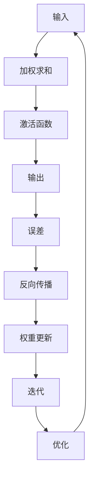

                 

关键词：AI，神经网络，深度学习，自然语言处理，自动驾驶，计算机视觉，开源，未来趋势

## 摘要

本文深入分析了Andrej Karpathy在多个场合的AI演讲，探讨了其提出的核心概念、算法原理、数学模型及其在实际应用中的实践。通过对演讲亮点进行详细解读，本文旨在为读者提供一幅AI领域的全景图，并探讨未来发展趋势与挑战。

## 1. 背景介绍

Andrej Karpathy是一位杰出的计算机科学家，其在人工智能（AI）和深度学习领域具有丰富的经验。他是OpenAI的首席科学家，曾就职于特斯拉并担任自动驾驶团队的核心成员。Karpathy以其在自然语言处理、计算机视觉和自动驾驶领域的开创性工作而闻名。

他的演讲涵盖了AI领域的多个重要方面，包括神经网络的结构与优化、自然语言处理的进展、自动驾驶系统的挑战等。本文将从这些方面出发，对Karpathy的演讲亮点进行详细解读。

## 2. 核心概念与联系

### 2.1 神经网络

神经网络的架构是AI研究的核心。Karpathy在演讲中强调了神经网络结构的重要性，并提出了几种常见的神经网络架构，如图灵机、卷积神经网络（CNN）和循环神经网络（RNN）。

以下是一个简单的Mermaid流程图，展示神经网络的基本组成部分：

### 2.2 深度学习

深度学习是神经网络的一种，其关键在于构建多层神经网络。深度学习在图像识别、语音识别和自然语言处理等领域取得了显著的进展。Karpathy强调了深度学习的强大能力和应用潜力。

### 2.3 自然语言处理

自然语言处理（NLP）是AI的一个重要分支，旨在使计算机能够理解和处理自然语言。Karpathy在演讲中讨论了NLP的进展，包括词嵌入、序列到序列模型和注意力机制等。

## 3. 核心算法原理 & 具体操作步骤

### 3.1 算法原理概述

Karpathy的演讲中涉及的核心算法包括：

- 卷积神经网络（CNN）：用于图像识别和计算机视觉。
- 循环神经网络（RNN）：用于序列数据的处理，如语音识别和自然语言处理。
- 长短时记忆网络（LSTM）：RNN的一种，解决了梯度消失问题。
- 注意力机制：用于提升序列到序列模型的性能。

### 3.2 算法步骤详解

以下是这些算法的基本步骤：

#### 3.2.1 卷积神经网络（CNN）

1. **卷积层**：对输入图像进行卷积操作，提取特征。
2. **池化层**：对卷积后的特征进行下采样，减少参数数量。
3. **全连接层**：将特征映射到输出类别。
4. **激活函数**：如ReLU函数，增加网络的非线性。

#### 3.2.2 循环神经网络（RNN）

1. **输入层**：接受序列数据。
2. **隐藏层**：对序列数据进行处理。
3. **输出层**：生成序列的输出。
4. **循环连接**：将前一个隐藏状态与当前隐藏状态连接。

#### 3.2.3 长短时记忆网络（LSTM）

1. **输入门**：决定哪些信息可以进入记忆单元。
2. **遗忘门**：决定哪些信息需要遗忘。
3. **输出门**：决定记忆单元的信息是否应该输出。

#### 3.2.4 注意力机制

1. **计算注意力得分**：为每个输入分配一个注意力得分。
2. **加权求和**：根据注意力得分对输入进行加权求和。

### 3.3 算法优缺点

- **CNN**：在图像识别和计算机视觉领域表现出色，但处理序列数据效果不佳。
- **RNN**：在处理序列数据方面表现出色，但存在梯度消失和梯度爆炸问题。
- **LSTM**：解决了RNN的梯度消失问题，但在长序列处理中仍存在问题。
- **注意力机制**：显著提升了序列到序列模型的性能，但计算复杂度较高。

### 3.4 算法应用领域

- **CNN**：图像识别、计算机视觉、自然语言处理。
- **RNN**：语音识别、机器翻译、文本生成。
- **LSTM**：语音识别、机器翻译、文本生成。
- **注意力机制**：机器翻译、文本生成、序列预测。

## 4. 数学模型和公式

### 4.1 数学模型构建

在AI研究中，数学模型是理解算法原理和性能的关键。以下是几个关键的数学模型：

#### 4.1.1 卷积神经网络（CNN）

$$
\text{激活函数} = \max(0, x)
$$

其中，$x$为输入。

#### 4.1.2 循环神经网络（RNN）

$$
h_t = \sigma(W \cdot [h_{t-1}, x_t] + b)
$$

其中，$h_t$为第$t$个时间步的隐藏状态，$W$为权重矩阵，$x_t$为输入，$\sigma$为激活函数。

#### 4.1.3 长短时记忆网络（LSTM）

$$
i_t = \sigma(W_i \cdot [h_{t-1}, x_t] + b_i)
$$

$$
f_t = \sigma(W_f \cdot [h_{t-1}, x_t] + b_f)
$$

$$
o_t = \sigma(W_o \cdot [h_{t-1}, x_t] + b_o)
$$

$$
g_t = \tanh(W_g \cdot [h_{t-1}, x_t] + b_g)
$$

其中，$i_t$、$f_t$、$o_t$和$g_t$分别为输入门、遗忘门、输出门和记忆单元的状态，$W_i$、$W_f$、$W_o$和$W_g$分别为权重矩阵，$b_i$、$b_f$、$b_o$和$

