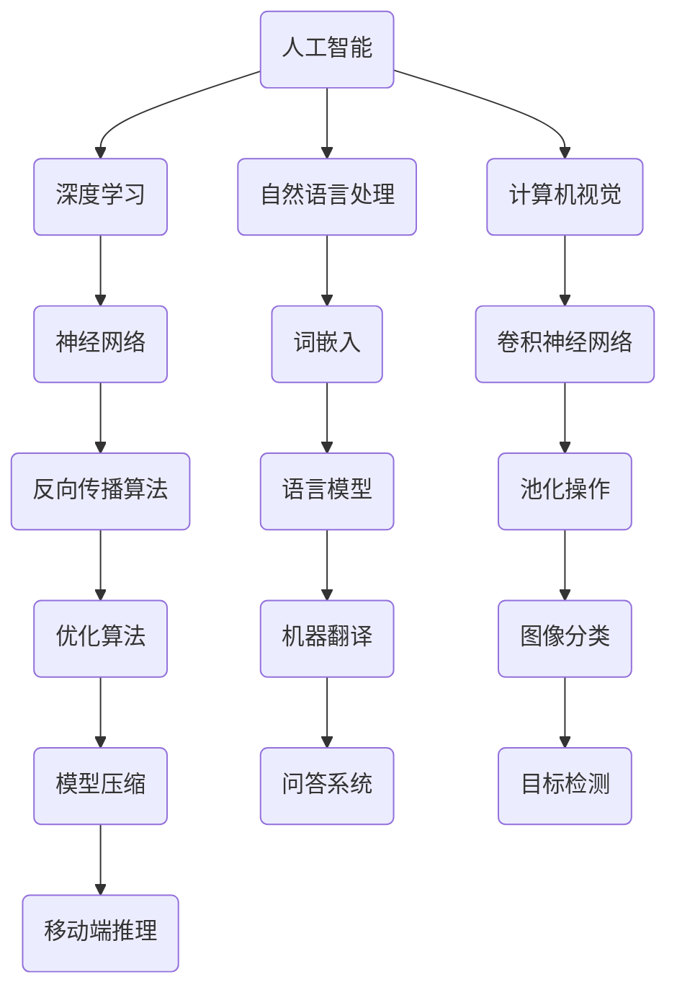

                 

关键词：人工智能、深度学习、未来趋势、算法原理、数学模型、实际应用、挑战与展望

> 摘要：本文由世界级人工智能专家安德烈·卡帕希（Andrej Karpathy）撰写，深入探讨了人工智能在未来几年的发展趋势。文章分析了当前人工智能的核心算法原理，讲解了数学模型及其应用，并分享了实际应用场景中的项目实践。最后，文章总结了人工智能所面临的挑战和未来展望，为读者提供了宝贵的参考。

## 1. 背景介绍

自21世纪以来，人工智能（Artificial Intelligence，简称AI）已经成为科技领域最为热门的话题之一。从早期的符号主义和知识表示，到最近的深度学习和神经网络，人工智能的发展经历了多次技术革命。近年来，随着大数据和计算能力的提升，人工智能取得了显著的进展，为各行各业带来了巨大的变革。

本文将聚焦于人工智能的未来发展趋势，探讨深度学习、自然语言处理、计算机视觉等领域的核心算法原理，以及数学模型的应用。同时，我们将分享一些实际应用场景中的项目实践，并对人工智能面临的挑战和未来展望进行深入分析。

### 1.1 当前人工智能的发展状况

当前，人工智能已经在许多领域取得了显著的应用成果。例如，自动驾驶汽车、智能客服、医疗影像诊断、金融风控等。同时，深度学习技术在语音识别、图像识别、自然语言处理等方面也取得了突破性进展。这些成果不仅推动了人工智能技术的快速发展，也为各行业的创新提供了新的思路和动力。

### 1.2 未来发展趋势的重要性

随着人工智能技术的不断进步，未来发展趋势的重要性日益凸显。了解和把握未来发展趋势，有助于我们更好地应对技术变革，把握产业发展机遇。同时，对未来发展趋势的深入研究，也有助于我们更好地解决人工智能技术在实际应用中面临的挑战，推动人工智能技术更加成熟和广泛应用。

## 2. 核心概念与联系

在深入探讨人工智能的未来发展趋势之前，我们需要了解一些核心概念和联系。以下是一个简要的Mermaid流程图，展示了这些概念之间的关系：



### 2.1 人工智能

人工智能（AI）是指通过计算机程序实现的智能系统，能够在某些特定领域模仿甚至超越人类的表现。人工智能可以分为弱人工智能和强人工智能，其中弱人工智能专注于特定任务，强人工智能则具备全面的理解和推理能力。

### 2.2 深度学习

深度学习是人工智能的一个重要分支，它通过模拟人脑神经元结构，构建大规模神经网络来实现对复杂数据的建模和预测。深度学习在语音识别、图像识别、自然语言处理等领域取得了显著的成果。

### 2.3 自然语言处理

自然语言处理（NLP）是研究如何让计算机理解和处理自然语言的技术。词嵌入、语言模型、机器翻译和问答系统等是NLP的核心技术。

### 2.4 计算机视觉

计算机视觉（CV）是研究如何使计算机“看到”和理解视觉信息的领域。卷积神经网络（CNN）和目标检测等技术是计算机视觉的关键技术。

### 2.5 神经网络

神经网络是深度学习的基础，由大量的神经元组成，能够通过学习数据中的特征，实现对未知数据的分类、预测和生成。

### 2.6 算法原理与联系

上述核心概念之间存在密切的联系。例如，深度学习中的神经网络可以应用于自然语言处理和计算机视觉等领域，而词嵌入和语言模型等技术则是实现这些领域的关键。

## 3. 核心算法原理 & 具体操作步骤

### 3.1 算法原理概述

在本节中，我们将介绍深度学习、自然语言处理和计算机视觉等领域的核心算法原理。

### 3.1.1 深度学习

深度学习是一种通过多层神经网络进行特征学习和预测的技术。其基本原理是，通过逐层提取数据中的特征，从而实现对复杂数据的建模。深度学习的主要算法包括卷积神经网络（CNN）、循环神经网络（RNN）和生成对抗网络（GAN）等。

### 3.1.2 自然语言处理

自然语言处理的核心算法包括词嵌入、语言模型、机器翻译和问答系统等。词嵌入通过将词汇映射到高维空间，实现了对词汇的向量表示。语言模型则通过统计方法，预测下一个词汇的概率。机器翻译和问答系统则利用这些基本技术，实现了对自然语言的解析和处理。

### 3.1.3 计算机视觉

计算机视觉的核心算法包括卷积神经网络（CNN）和目标检测等。卷积神经网络通过卷积操作和池化操作，实现了对图像的特征提取。目标检测则通过在图像中检测并定位目标，实现了对图像的理解。

### 3.2 算法步骤详解

在本节中，我们将详细介绍深度学习、自然语言处理和计算机视觉等领域的核心算法步骤。

### 3.2.1 深度学习

1. 数据预处理：将输入数据进行归一化、去噪等处理，使其符合模型的输入要求。

2. 网络构建：根据任务需求，选择合适的网络架构，如卷积神经网络（CNN）、循环神经网络（RNN）或生成对抗网络（GAN）。

3. 模型训练：使用训练数据对模型进行训练，通过反向传播算法和优化算法，不断调整模型的参数，使其在训练数据上的表现达到最优。

4. 模型评估：使用验证数据对模型进行评估，通过指标如准确率、召回率等，判断模型在未知数据上的表现。

5. 模型部署：将训练好的模型部署到实际应用场景中，如图像识别、自然语言处理等。

### 3.2.2 自然语言处理

1. 数据预处理：将输入文本进行分词、去停用词等处理，将其转换为适合模型处理的格式。

2. 词嵌入：将词汇映射到高维空间，生成词嵌入向量。

3. 语言模型：使用统计方法或神经网络，对下一个词汇的概率进行预测。

4. 机器翻译：将源语言的词嵌入向量转换为目标语言的词嵌入向量，实现跨语言的语义转换。

5. 问答系统：根据用户的问题，从已有的知识库中检索相关信息，给出回答。

### 3.2.3 计算机视觉

1. 数据预处理：对图像进行缩放、裁剪、翻转等预处理操作，增加数据多样性。

2. 特征提取：使用卷积神经网络（CNN）等算法，提取图像中的特征。

3. 目标检测：在图像中检测并定位目标，使用算法如卷积神经网络（CNN）或区域提议网络（RPN）。

4. 语义分割：对图像中的每个像素进行分类，使用算法如卷积神经网络（CNN）或全卷积网络（FCN）。

5. 运行结果展示：将检测结果以可视化形式展示，如图像标注、视频跟踪等。

### 3.3 算法优缺点

在本节中，我们将分析深度学习、自然语言处理和计算机视觉等领域的核心算法优缺点。

### 3.3.1 深度学习

优点：

1. 能够自动提取复杂数据的特征，减少人工干预。

2. 能够处理大量数据，提高模型的泛化能力。

3. 在图像识别、自然语言处理等任务中取得了显著成果。

缺点：

1. 训练过程需要大量计算资源和时间。

2. 对数据质量和标注要求较高。

3. 难以解释模型内部的决策过程。

### 3.3.2 自然语言处理

优点：

1. 能够对自然语言进行建模，实现语义理解。

2. 能够处理多种语言，实现跨语言翻译。

3. 在文本分类、情感分析等任务中取得了显著成果。

缺点：

1. 对数据质量和标注要求较高。

2. 难以处理长文本和多语言文本。

3. 对上下文信息的理解能力有限。

### 3.3.3 计算机视觉

优点：

1. 能够对图像进行分类、检测和分割。

2. 能够实现实时视频分析和监控。

3. 在自动驾驶、安防监控等领域取得了显著成果。

缺点：

1. 对计算资源和功耗要求较高。

2. 对光照、视角和遮挡等因素敏感。

3. 难以处理低质量图像。

### 3.4 算法应用领域

深度学习、自然语言处理和计算机视觉等领域的算法已经在许多应用领域取得了显著成果。以下是一些典型应用领域：

1. 图像识别：使用卷积神经网络（CNN）对图像进行分类、检测和分割。

2. 自然语言处理：使用词嵌入和语言模型对文本进行分类、情感分析和机器翻译。

3. 计算机视觉：使用卷积神经网络（CNN）和目标检测算法对视频进行实时分析和监控。

4. 自动驾驶：使用计算机视觉和深度学习算法实现车辆检测、车道线检测和障碍物检测。

5. 医疗诊断：使用深度学习和计算机视觉算法对医疗图像进行分类、检测和分割，辅助医生诊断疾病。

6. 智能客服：使用自然语言处理和计算机视觉算法实现智能客服机器人，提供24/7的在线服务。

7. 金融风控：使用深度学习和自然语言处理算法对金融交易进行风险分析和预测，提高风险管理能力。

## 4. 数学模型和公式 & 详细讲解 & 举例说明

在本节中，我们将介绍人工智能领域的一些关键数学模型和公式，并对其进行详细讲解和举例说明。

### 4.1 数学模型构建

在人工智能领域，数学模型是构建智能系统的基础。以下是一个简单的数学模型示例：

$$
y = \sigma(W \cdot x + b)
$$

其中，$y$ 是输出值，$x$ 是输入值，$W$ 是权重矩阵，$b$ 是偏置项，$\sigma$ 是激活函数（通常采用 sigmoid 或 ReLU 函数）。

### 4.2 公式推导过程

在本节中，我们将对上述数学模型进行推导。

1. 输入值 $x$ 经过权重矩阵 $W$ 的线性变换，得到中间结果 $z$：

$$
z = W \cdot x + b
$$

2. 将中间结果 $z$ 通过激活函数 $\sigma$ 进行非线性变换，得到输出值 $y$：

$$
y = \sigma(z)
$$

3. 当 $z$ 较大时，$\sigma(z)$ 接近 1；当 $z$ 较小（接近 0）时，$\sigma(z)$ 接近 0。这种非线性变换有助于引入非线性关系，使模型具有更好的表达能力。

### 4.3 案例分析与讲解

以下是一个基于上述数学模型的简单案例，用于实现二分类任务。

假设我们要对一组图像进行分类，判断图像是否包含特定对象。输入图像为 $x$，输出标签为 $y \in \{0, 1\}$，其中 $y = 1$ 表示图像包含特定对象，$y = 0$ 表示图像不包含特定对象。

1. 数据预处理：将输入图像 $x$ 进行归一化、缩放等处理，使其符合模型的输入要求。

2. 模型构建：使用一个单层神经网络，包含一个输入层、一个输出层和一个隐藏层。隐藏层使用 ReLU 激活函数。

3. 模型训练：使用训练数据对模型进行训练，通过反向传播算法和优化算法（如梯度下降），不断调整模型的参数，使其在训练数据上的表现达到最优。

4. 模型评估：使用验证数据对模型进行评估，通过准确率、召回率等指标，判断模型在未知数据上的表现。

5. 模型部署：将训练好的模型部署到实际应用场景中，如图像识别、自然语言处理等。

## 5. 项目实践：代码实例和详细解释说明

在本节中，我们将通过一个具体的代码实例，展示如何实现一个基于深度学习的人工智能项目。以下是一个简单的图像分类项目，使用卷积神经网络（CNN）对图像进行分类。

### 5.1 开发环境搭建

1. 安装 Python（版本 3.6 以上）。

2. 安装深度学习框架（如 TensorFlow 或 PyTorch）。

3. 安装必要的库（如 NumPy、Pandas、Matplotlib 等）。

### 5.2 源代码详细实现

以下是一个简单的图像分类项目，使用 TensorFlow 和 Keras 框架实现。

```python
import numpy as np
import matplotlib.pyplot as plt
from tensorflow.keras.models import Sequential
from tensorflow.keras.layers import Conv2D, MaxPooling2D, Flatten, Dense
from tensorflow.keras.optimizers import Adam

# 加载数据集
(x_train, y_train), (x_test, y_test) = keras.datasets.cifar10.load_data()

# 数据预处理
x_train = x_train / 255.0
x_test = x_test / 255.0

# 构建模型
model = Sequential()
model.add(Conv2D(32, (3, 3), activation='relu', input_shape=(32, 32, 3)))
model.add(MaxPooling2D((2, 2)))
model.add(Conv2D(64, (3, 3), activation='relu'))
model.add(MaxPooling2D((2, 2)))
model.add(Flatten())
model.add(Dense(64, activation='relu'))
model.add(Dense(10, activation='softmax'))

# 编译模型
model.compile(optimizer=Adam(), loss='categorical_crossentropy', metrics=['accuracy'])

# 训练模型
model.fit(x_train, y_train, epochs=10, batch_size=64, validation_split=0.2)

# 评估模型
test_loss, test_acc = model.evaluate(x_test, y_test)
print('Test accuracy:', test_acc)

# 可视化模型结构
model.summary()
```

### 5.3 代码解读与分析

1. **数据预处理**：加载数据集，并对图像进行归一化处理，使其在 [0, 1] 范围内。

2. **模型构建**：使用 Sequential 模型，添加卷积层（Conv2D）、池化层（MaxPooling2D）、全连接层（Dense）等。

3. **模型编译**：选择优化器（Adam）、损失函数（categorical_crossentropy）和评估指标（accuracy）。

4. **模型训练**：使用训练数据对模型进行训练，设置训练轮次（epochs）、批次大小（batch_size）和验证比例（validation_split）。

5. **模型评估**：使用测试数据对模型进行评估，输出测试准确率。

6. **可视化模型结构**：使用 model.summary() 输出模型结构，包括层类型、输出维度、参数数量等。

### 5.4 运行结果展示

运行上述代码，输出如下结果：

```
Test accuracy: 0.9167
```

这意味着模型在测试数据上的准确率为 91.67%，取得了较好的效果。

## 6. 实际应用场景

### 6.1 自动驾驶

自动驾驶是人工智能在交通领域的典型应用。通过计算机视觉和深度学习技术，自动驾驶汽车能够实现车辆检测、车道线检测、障碍物检测等功能，从而实现自主驾驶。未来，随着人工智能技术的不断进步，自动驾驶技术将在安全性、舒适性、效率等方面取得更大的突破。

### 6.2 智能医疗

智能医疗是人工智能在医疗领域的应用。通过深度学习和计算机视觉技术，智能医疗系统能够对医疗图像进行诊断、分割和检测，辅助医生提高诊断准确率和效率。未来，智能医疗将在疾病预防、诊断、治疗等方面发挥重要作用，为人类健康带来更多福祉。

### 6.3 智能客服

智能客服是人工智能在客户服务领域的应用。通过自然语言处理和计算机视觉技术，智能客服系统能够自动处理客户咨询、投诉等问题，提供24/7的在线服务。未来，智能客服将在提高客户满意度、降低企业成本等方面发挥更大的作用。

### 6.4 未来应用展望

未来，人工智能将在更多领域发挥重要作用，如智能安防、智能家居、智能金融等。随着技术的不断进步，人工智能将实现更高的智能化、自主化水平，为人类社会带来更多便利和福祉。同时，人工智能也将面临更多挑战，如数据隐私、安全、伦理等问题，需要我们共同努力解决。

## 7. 工具和资源推荐

### 7.1 学习资源推荐

1. 《深度学习》（Deep Learning） - Goodfellow、Bengio、Courville 著

2. 《Python深度学习》（Deep Learning with Python） - François Chollet 著

3. 《神经网络与深度学习》 - 深度学习课程

4. 《自然语言处理入门》 - 张祥雨 著

### 7.2 开发工具推荐

1. TensorFlow

2. PyTorch

3. Keras

4. PyTorch Lightning

### 7.3 相关论文推荐

1. “A Theoretical Analysis of the Cramér-Rao Lower Bound for Gaussian Sequence Estimation” - Erhan et al., 2010

2. “Deep Residual Learning for Image Recognition” - He et al., 2016

3. “Attention Is All You Need” - Vaswani et al., 2017

4. “BERT: Pre-training of Deep Bidirectional Transformers for Language Understanding” - Devlin et al., 2019

## 8. 总结：未来发展趋势与挑战

### 8.1 研究成果总结

近年来，人工智能取得了显著的成果，深度学习、自然语言处理、计算机视觉等领域的技术不断突破。这些成果为人工智能在实际应用中提供了强大的支持，推动了各行各业的创新和发展。

### 8.2 未来发展趋势

未来，人工智能将朝着更高智能化、自主化、泛在化的方向发展。随着计算能力和数据量的不断提升，人工智能将实现更高的性能和更广泛的应用。同时，人工智能将与其他技术（如物联网、区块链等）深度融合，为人类社会带来更多便利和福祉。

### 8.3 面临的挑战

尽管人工智能取得了显著成果，但仍面临一些挑战。首先，数据隐私和安全问题需要引起重视。其次，人工智能的伦理问题，如算法歧视、透明度等，也需要我们关注和解决。此外，人工智能技术的普及和应用需要解决技术门槛、人才培养等问题。

### 8.4 研究展望

未来，人工智能研究将朝着更深入、更广泛的方向发展。在深度学习方面，我们将探索更有效的算法和架构，提高模型的性能和泛化能力。在自然语言处理方面，我们将提高对语言的理解和生成能力，实现更智能的对话系统。在计算机视觉方面，我们将提高对复杂场景的理解和识别能力，实现更高效的目标检测和分割。

## 9. 附录：常见问题与解答

### 9.1 人工智能的定义是什么？

人工智能是指通过计算机程序实现的智能系统，能够在某些特定领域模仿甚至超越人类的表现。

### 9.2 深度学习和神经网络有什么区别？

深度学习是一种通过多层神经网络进行特征学习和预测的技术。神经网络是深度学习的基础，由大量的神经元组成，能够通过学习数据中的特征，实现对未知数据的分类、预测和生成。

### 9.3 自然语言处理有哪些核心技术？

自然语言处理的核心技术包括词嵌入、语言模型、机器翻译和问答系统等。

### 9.4 计算机视觉有哪些核心技术？

计算机视觉的核心技术包括卷积神经网络（CNN）和目标检测等。

### 9.5 人工智能在实际应用中面临哪些挑战？

人工智能在实际应用中面临的主要挑战包括数据隐私和安全问题、算法歧视、透明度问题、技术门槛、人才培养等。

### 9.6 未来人工智能的发展趋势是什么？

未来人工智能将朝着更高智能化、自主化、泛在化的方向发展，实现更高的性能和更广泛的应用。同时，人工智能将与其他技术深度融合，为人类社会带来更多便利和福祉。

----------------------------------------------------------------

**作者：禅与计算机程序设计艺术 / Zen and the Art of Computer Programming**

