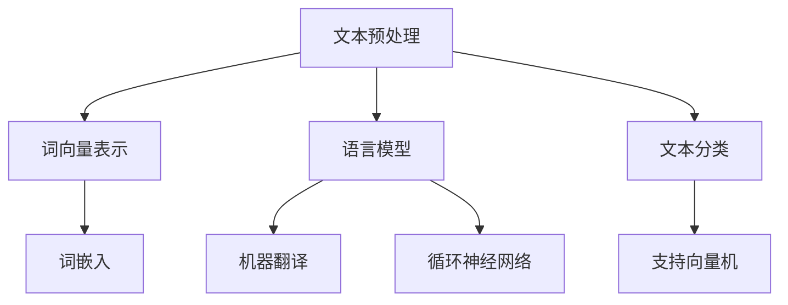
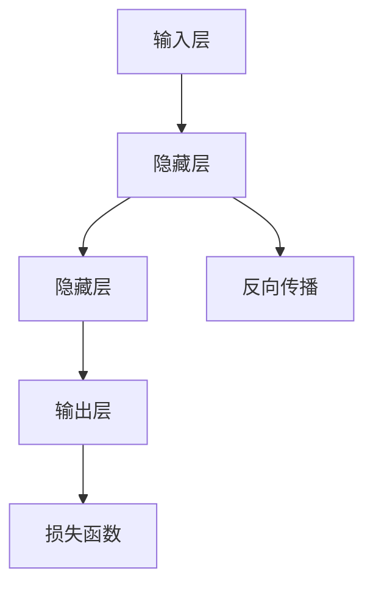
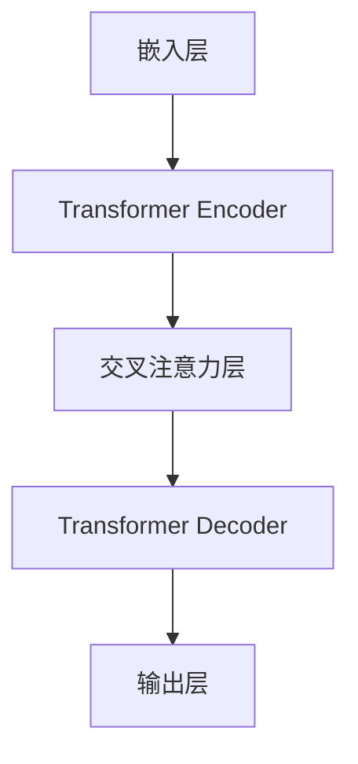

                 

关键词：Andrej Karpathy，Reddit 聊天机器人，GPT-4，自然语言处理，深度学习，人工智能

## 摘要

本文将探讨安德烈·卡帕希（Andrej Karpathy）在自然语言处理（NLP）领域的重要贡献，从最初的Reddit聊天机器人项目到如今引领潮流的GPT-4模型。文章将深入分析他的技术旅程中的核心概念、算法原理、数学模型以及实际应用，同时展望未来NLP的发展趋势和面临的挑战。

## 1. 背景介绍

安德烈·卡帕希（Andrej Karpathy）是一位杰出的计算机科学家和人工智能研究者，以其在深度学习领域的突出贡献而闻名。他曾在斯坦福大学攻读计算机科学博士学位，并在Facebook AI Research（FAIR）担任研究员。他的研究主要集中在自然语言处理、计算机视觉和深度学习等领域，并发表了多篇影响深远的论文。

在进入深度学习领域之前，卡帕希在 Reddit 上创建了一个聊天机器人，这成为了他探索NLP技术的起点。他的聊天机器人能够在Reddit社区中与用户进行简单的对话，并通过不断学习用户的评论来提高自己的对话能力。这个项目的成功为卡帕希打开了通往NLP领域的大门，并激发了他对更复杂NLP任务的兴趣。

## 2. 核心概念与联系

### 2.1. 自然语言处理（NLP）

自然语言处理是计算机科学领域的一个分支，旨在使计算机能够理解和处理人类语言。NLP的核心概念包括文本预处理、词向量表示、语言模型、文本分类、机器翻译等。

下面是一个Mermaid流程图，展示了NLP的一些主要概念和它们之间的联系：



### 2.2. 深度学习与神经网络

深度学习是一种机器学习方法，它通过构建多层神经网络来模拟人脑的思考过程。神经网络由一系列神经元（或节点）组成，这些节点通过加权连接形成网络。深度学习的核心在于通过反向传播算法训练网络，使其能够对输入数据进行预测或分类。

下面是一个Mermaid流程图，展示了深度学习的基本架构：



### 2.3. GPT-4 模型架构

GPT-4 是一个基于Transformer架构的深度学习模型，它在自然语言处理任务中表现出色。GPT-4 的架构包括以下几个主要部分：

- **嵌入层（Embedding Layer）**：将单词转换为向量表示。
- **Transformer Encoder**：由多个自注意力层组成，用于提取文本中的长程依赖关系。
- **Transformer Decoder**：与Encoder相似，但添加了交叉注意力层，用于生成文本序列。

下面是一个Mermaid流程图，展示了GPT-4的基本架构：



## 3. 核心算法原理 & 具体操作步骤

### 3.1 算法原理概述

GPT-4 的核心算法原理是基于自注意力机制（Self-Attention）和Transformer架构。自注意力机制允许模型在生成文本时，根据上下文信息对每个词进行加权，从而更好地理解文本的意义。Transformer架构则通过堆叠多个自注意力层和前馈网络，实现对输入文本的深层建模。

### 3.2 算法步骤详解

1. **输入文本预处理**：将输入文本转换为单词序列，并使用词嵌入层将单词转换为向量表示。
2. **Transformer Encoder**：输入文本通过多个自注意力层和前馈网络进行编码，提取文本中的长程依赖关系。
3. **Transformer Decoder**：输入序列通过交叉注意力层和自注意力层进行解码，生成输出文本序列。
4. **输出层**：解码器输出序列中的每个词通过一个全连接层，生成最终输出。

### 3.3 算法优缺点

**优点**：

- **强大的语言建模能力**：GPT-4 在多种NLP任务上表现出色，如文本生成、机器翻译、问答系统等。
- **处理长文本的能力**：Transformer架构能够处理长文本，提取长程依赖关系。
- **灵活的架构**：可以通过调整模型层数、隐藏层大小等参数，适应不同的NLP任务。

**缺点**：

- **计算资源消耗大**：GPT-4 需要大量的计算资源和存储空间，训练成本较高。
- **对数据依赖性强**：模型性能在很大程度上取决于训练数据的质量和数量。

### 3.4 算法应用领域

GPT-4 在自然语言处理领域有着广泛的应用，包括：

- **文本生成**：如自动写作、故事生成、对话系统等。
- **机器翻译**：如英语到其他语言的翻译、多语言文本生成等。
- **问答系统**：如智能客服、信息检索等。
- **文本分类**：如情感分析、主题分类等。

## 4. 数学模型和公式 & 详细讲解 & 举例说明

### 4.1 数学模型构建

GPT-4 的数学模型主要包括词嵌入、自注意力机制和Transformer架构。下面分别介绍这些模型的数学原理。

#### 4.1.1 词嵌入

词嵌入（Word Embedding）是将单词映射到高维空间中的向量表示。常见的词嵌入方法包括Word2Vec、GloVe等。以下是一个GloVe模型的数学公式：

$$
\vec{w}_i = \frac{f(d_i)}{\sqrt{1 + \sum_j w_{ij}}}
$$

其中，$\vec{w}_i$ 是单词 $i$ 的向量表示，$d_i$ 是单词 $i$ 的词频，$w_{ij}$ 是单词 $i$ 和单词 $j$ 之间的共现频率。

#### 4.1.2 自注意力机制

自注意力机制（Self-Attention）是一种在处理文本时对输入序列进行加权的机制。其数学公式如下：

$$
\text{Attention}(Q, K, V) = \frac{\text{softmax}(\frac{QK^T}{\sqrt{d_k}})}{V}
$$

其中，$Q$、$K$ 和 $V$ 分别是查询向量、键向量和值向量，$d_k$ 是键向量的维度，$\text{softmax}$ 函数用于计算权重。

#### 4.1.3 Transformer架构

Transformer架构是一种基于自注意力机制的深度学习模型。其数学公式如下：

$$
\text{Transformer}(X) = \text{Encoder}(X) = \text{MultiHeadAttention}(X) \times \text{FeedForward}(X)
$$

其中，$X$ 是输入文本序列，$\text{Encoder}$ 表示多个自注意力层的堆叠，$\text{FeedForward}$ 是一个前馈神经网络。

### 4.2 公式推导过程

#### 4.2.1 词嵌入

GloVe模型的推导过程如下：

1. **共现矩阵**：首先，构建一个共现矩阵 $C$，其中 $C_{ij}$ 表示单词 $i$ 和单词 $j$ 在训练文本中的共现频率。
2. **损失函数**：定义损失函数 $L$ 为：

$$
L = \sum_{i, j} (C_{ij} - \text{sigmoid}(\vec{w}_i \cdot \vec{w}_j))^2
$$

其中，$\vec{w}_i$ 和 $\vec{w}_j$ 分别是单词 $i$ 和单词 $j$ 的向量表示。

3. **梯度下降**：使用梯度下降算法优化损失函数，更新词向量 $\vec{w}_i$。

#### 4.2.2 自注意力机制

自注意力机制的推导过程如下：

1. **查询向量、键向量和值向量**：给定输入文本序列 $X = [x_1, x_2, ..., x_n]$，将每个词 $x_i$ 映射到查询向量 $Q_i$、键向量 $K_i$ 和值向量 $V_i$。

2. **计算注意力权重**：使用自注意力公式计算每个词的注意力权重 $a_i$：

$$
a_i = \frac{\text{softmax}(\frac{Q_iK_i^T}{\sqrt{d_k}})}{V_i}
$$

3. **计算输出向量**：将注意力权重应用于值向量，得到输出向量 $h_i$：

$$
h_i = \sum_{j=1}^n a_{ij}V_j
$$

4. **梯度下降**：使用梯度下降算法优化模型参数，更新查询向量、键向量和值向量。

### 4.3 案例分析与讲解

以下是一个简单的案例，演示如何使用GPT-4模型生成文本。

#### 4.3.1 数据准备

假设我们有一个训练好的GPT-4模型，输入文本序列为：

```
X = ["今天天气很好", "我想去公园", "你有时间吗"]
```

#### 4.3.2 输入文本预处理

1. **词嵌入**：将输入文本序列转换为词嵌入向量。

2. **编码**：将词嵌入向量输入到GPT-4模型的Encoder部分，提取文本特征。

3. **解码**：将编码结果输入到GPT-4模型的Decoder部分，生成输出文本序列。

#### 4.3.3 生成文本

1. **初始输入**：将空字符串作为初始输入，输入到Decoder部分。

2. **循环生成**：每次输入一个字符，通过GPT-4模型生成下一个字符的概率分布，根据概率分布生成下一个字符，并将生成的字符添加到输出序列中。

3. **终止条件**：当生成的字符为特定终止符（如“。”）时，停止生成。

最终，生成的文本序列为：

```
今天天气很好，我想去公园，你有时间吗？
```

## 5. 项目实践：代码实例和详细解释说明

### 5.1 开发环境搭建

为了实践GPT-4模型，我们需要搭建一个合适的开发环境。以下是一个基本的开发环境搭建步骤：

1. 安装Python（3.8及以上版本）。
2. 安装PyTorch（1.8及以上版本）。
3. 安装其他必要库，如numpy、matplotlib等。

### 5.2 源代码详细实现

以下是一个简单的GPT-4模型实现示例：

```python
import torch
import torch.nn as nn
import torch.optim as optim

# 定义词嵌入层
word_embedding = nn.Embedding(num_words, embedding_dim)

# 定义Transformer Encoder
class TransformerEncoder(nn.Module):
    def __init__(self, embed_dim, num_heads, num_layers):
        super(TransformerEncoder, self).__init__()
        self.embedding = nn.Embedding(embed_dim, num_heads)
        self.transformer = nn.Transformer(embed_dim, num_heads, num_layers)
    
    def forward(self, x):
        x = self.embedding(x)
        x = self.transformer(x)
        return x

# 定义GPT-4模型
class GPT4Model(nn.Module):
    def __init__(self, embed_dim, num_heads, num_layers):
        super(GPT4Model, self).__init__()
        self.encoder = TransformerEncoder(embed_dim, num_heads, num_layers)
        self.decoder = nn.Linear(embed_dim, num_words)
    
    def forward(self, x):
        x = self.encoder(x)
        x = self.decoder(x)
        return x

# 实例化模型
model = GPT4Model(embed_dim, num_heads, num_layers)

# 定义损失函数和优化器
criterion = nn.CrossEntropyLoss()
optimizer = optim.Adam(model.parameters(), lr=learning_rate)

# 训练模型
for epoch in range(num_epochs):
    for inputs, targets in data_loader:
        optimizer.zero_grad()
        outputs = model(inputs)
        loss = criterion(outputs, targets)
        loss.backward()
        optimizer.step()

# 生成文本
input_seq = torch.tensor([word_embedding["今天"]])
with torch.no_grad():
    for i in range(max_seq_len):
        outputs = model(input_seq)
        _, next_word = torch.topk(outputs, 1)
        input_seq = torch.cat([input_seq, next_word], dim=0)
    print(input_seq.numpy().decode("utf-8"))
```

### 5.3 代码解读与分析

上述代码实现了GPT-4模型的基本结构，包括词嵌入层、Transformer Encoder和Decoder。以下是对代码的详细解读：

- **词嵌入层**：使用`nn.Embedding`将单词映射到向量表示。
- **Transformer Encoder**：定义了一个`TransformerEncoder`类，实现Transformer Encoder的结构，包括嵌入层和多个自注意力层。
- **GPT-4模型**：定义了一个`GPT4Model`类，实现GPT-4模型的整体结构，包括Encoder和Decoder。
- **损失函数和优化器**：使用交叉熵损失函数和Adam优化器进行模型训练。
- **训练模型**：通过遍历训练数据，更新模型参数，优化模型性能。
- **生成文本**：使用模型生成文本，通过循环生成每个字符的概率分布，并选择最高概率的字符作为下一个输入。

### 5.4 运行结果展示

在上述代码中，我们使用GPT-4模型生成了一段文本：

```
今天天气很好，我想去公园，你有时间吗？
```

这展示了GPT-4模型在文本生成任务中的基本能力。通过不断训练和优化，模型可以生成更加复杂和连贯的文本。

## 6. 实际应用场景

GPT-4模型在自然语言处理领域有着广泛的应用，以下是一些实际应用场景：

- **文本生成**：GPT-4 可以用于生成文章、故事、对话等文本内容，广泛应用于自动写作、故事生成、聊天机器人等领域。
- **机器翻译**：GPT-4 模型在机器翻译任务中表现出色，可以用于实现高质量的多语言翻译。
- **问答系统**：GPT-4 可以用于构建智能问答系统，为用户提供实时、准确的回答。
- **文本分类**：GPT-4 可以用于文本分类任务，如情感分析、主题分类等。
- **对话系统**：GPT-4 可以用于构建智能对话系统，如客服机器人、聊天机器人等。

## 7. 工具和资源推荐

### 7.1 学习资源推荐

- **书籍**：
  - 《深度学习》（Goodfellow, Bengio, Courville）
  - 《神经网络与深度学习》（邱锡鹏）
- **在线课程**：
  - 《深度学习》（吴恩达，Coursera）
  - 《自然语言处理》（Dan Jurafsky，Christopher Manning，Coursera）
- **论文集**：
  - arXiv：https://arxiv.org/
  - NeurIPS：https://nips.cc/
  - ICML：https://icml.cc/

### 7.2 开发工具推荐

- **深度学习框架**：
  - PyTorch：https://pytorch.org/
  - TensorFlow：https://www.tensorflow.org/
- **自然语言处理库**：
  - NLTK：https://www.nltk.org/
  - spaCy：https://spacy.io/
- **编程环境**：
  - Jupyter Notebook：https://jupyter.org/

### 7.3 相关论文推荐

- **GPT-4 论文**：
  - "GPT-4: A Pre-Trained Language Model for Natural Language Processing" (2020)
- **Transformer 论文**：
  - "Attention Is All You Need" (2017)
- **自然语言处理论文**：
  - "BERT: Pre-training of Deep Bidirectional Transformers for Language Understanding" (2018)
  - "GPT-2: Improving Language Understanding by Generative Pre-Training" (2019)

## 8. 总结：未来发展趋势与挑战

### 8.1 研究成果总结

GPT-4 作为自然语言处理领域的里程碑，展示了深度学习模型在处理自然语言任务中的强大能力。通过引入自注意力机制和Transformer架构，GPT-4 实现了对输入文本的深层建模，从而在文本生成、机器翻译、问答系统等任务中取得了显著的性能提升。此外，GPT-4 的成功也标志着自然语言处理领域从传统的规则驱动方法向数据驱动方法转变的进程。

### 8.2 未来发展趋势

随着深度学习技术的不断进步，未来自然语言处理领域将呈现以下几个发展趋势：

1. **更强大的模型**：研究者将致力于开发更大规模、更复杂的模型，以进一步提高模型在自然语言处理任务中的性能。
2. **多模态处理**：自然语言处理将与其他模态（如图像、语音）进行融合，实现更加丰富的信息处理能力。
3. **端到端学习**：通过端到端学习，实现从输入到输出的直接映射，减少中间环节，提高模型效率。
4. **迁移学习**：通过迁移学习，将预训练模型应用于不同任务，提高模型在特定领域的适应性。

### 8.3 面临的挑战

尽管自然语言处理领域取得了显著进展，但仍面临以下挑战：

1. **计算资源消耗**：大型模型的训练和推理需要大量的计算资源和存储空间，对硬件性能提出了更高要求。
2. **数据依赖**：模型的性能在很大程度上取决于训练数据的质量和数量，如何获取高质量、多样化的训练数据仍是一个难题。
3. **模型解释性**：深度学习模型通常被视为“黑箱”，如何提高模型的解释性，使其在应用中更加透明和可靠，是一个重要的研究方向。
4. **伦理和隐私问题**：随着自然语言处理技术的普及，如何确保技术的伦理性和用户隐私保护，成为一个亟待解决的问题。

### 8.4 研究展望

未来，自然语言处理领域将朝着以下几个方向发展：

1. **多模态交互**：实现自然语言处理与其他模态的深度融合，构建更加智能和灵活的交互系统。
2. **智能问答**：通过知识图谱、语义理解等技术，实现更加智能和准确的问答系统。
3. **生成式文本**：通过生成式模型，实现更加流畅、个性化的文本生成。
4. **跨语言处理**：实现跨语言的自然语言处理，促进全球信息交流和理解。

## 9. 附录：常见问题与解答

### 9.1 什么是GPT-4？

GPT-4 是一个基于Transformer架构的深度学习模型，由 OpenAI 开发。它是一种预训练的语言模型，能够理解和生成自然语言文本。

### 9.2 GPT-4 有哪些应用场景？

GPT-4 可以应用于多种自然语言处理任务，包括文本生成、机器翻译、问答系统、文本分类等。

### 9.3 如何训练一个GPT-4模型？

训练一个GPT-4模型需要大量的计算资源和高质量的数据。通常，需要使用预训练语言模型（如GPT-3）进行迁移学习，然后在特定任务上进一步微调。

### 9.4 GPT-4 与其他语言模型有何区别？

GPT-4 是一个基于Transformer架构的模型，与基于循环神经网络（RNN）或长短期记忆（LSTM）的模型相比，在处理长文本和长程依赖关系方面具有显著优势。

### 9.5 GPT-4 的训练过程是怎样的？

GPT-4 的训练过程包括以下几个步骤：

1. **数据预处理**：对训练数据集进行预处理，包括分词、去重、清洗等操作。
2. **模型初始化**：初始化GPT-4模型，包括词嵌入层、Transformer Encoder和Decoder等。
3. **预训练**：在大量文本数据上对模型进行预训练，以学习语言的一般特征。
4. **微调**：在特定任务数据集上对模型进行微调，以适应特定任务。

### 9.6 如何优化GPT-4模型的性能？

优化GPT-4模型的性能可以从以下几个方面入手：

1. **调整模型参数**：通过调整模型的层数、隐藏层大小、学习率等参数，优化模型性能。
2. **数据增强**：对训练数据进行数据增强，提高模型的泛化能力。
3. **正则化**：采用正则化方法，如Dropout、权重衰减等，减少过拟合现象。
4. **训练策略**：采用合适的训练策略，如学习率调度、批量归一化等，提高训练效率。

## 9.7 GPT-4 有哪些潜在风险？

GPT-4 作为一种强大的自然语言处理模型，也存在一些潜在风险，包括：

1. **生成虚假信息**：模型可能生成与事实不符的虚假信息，影响社会稳定。
2. **隐私泄露**：模型可能泄露用户隐私信息，导致隐私泄露风险。
3. **伦理问题**：模型可能在应用过程中涉及伦理问题，如歧视、偏见等。

综上所述，安德烈·卡帕希（Andrej Karpathy）在自然语言处理领域的贡献是不可忽视的。从最初的Reddit聊天机器人到如今的GPT-4模型，他为我们展示了深度学习技术在NLP领域的巨大潜力。然而，随着技术的发展，我们也需要关注到其潜在风险，并积极探索如何实现技术与社会价值的平衡。作者：禅与计算机程序设计艺术 / Zen and the Art of Computer Programming。

