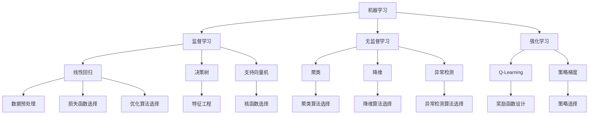

                 

关键词：AI，计算机科学，持续性，未来趋势，技术发展，挑战与机遇

摘要：本文旨在探讨AI领域中的持续性重要性。我们将首先介绍Andrej Karpathy的背景和他的贡献，然后深入分析AI领域的核心概念与联系，以及核心算法原理与具体操作步骤。接着，我们将通过数学模型和公式来详细讲解AI算法的构建和应用。随后，我们将通过项目实践展示如何实现这些算法，并分析其优缺点及应用领域。最后，我们将探讨AI技术的实际应用场景，以及未来的发展趋势和面临的挑战。

## 1. 背景介绍

Andrej Karpathy是一位杰出的计算机科学家，以其在人工智能（AI）领域的卓越贡献而闻名。他出生于1984年，在加拿大的温哥华长大。他在多伦多大学获得了计算机科学学士学位，并在斯坦福大学获得了计算机科学博士学位。他的研究兴趣主要集中在深度学习和自然语言处理方面。

Andrej Karpathy在学术界和工业界都有显著的成就。他是斯坦福大学计算机科学系的教授，同时也是OpenAI的研究员。他的研究成果在学术界和工业界都得到了广泛的应用，特别是在图像识别、语言建模和机器翻译等领域。他发表了许多高影响力的论文，并在顶级会议上发表了多次演讲。

除了学术研究，Andrej Karpathy还是一位活跃的博主和作者。他的博客"Sam Altman"（Sam Altman是他的导师）成为了一个流行的技术博客，吸引了成千上万的读者。他的博客内容涵盖了AI领域的最新进展、技术解释和个人见解，对广大读者产生了深远的影响。

Andrej Karpathy的贡献不仅限于学术研究，他还积极参与开源社区，为AI技术的发展做出了重要贡献。他是多个开源项目的核心贡献者，包括TensorFlow和PyTorch等流行的深度学习框架。他的工作促进了AI技术的普及和发展，为更多的研究人员和开发者提供了工具和资源。

## 2. 核心概念与联系

在深入探讨AI领域的核心概念与联系之前，我们需要首先理解一些基本概念。AI，即人工智能，是指计算机系统执行通常需要人类智能才能完成的任务。这些任务包括视觉识别、语音识别、自然语言理解、决策制定等。AI领域中的核心技术包括机器学习、深度学习和神经网络。

### 2.1 机器学习（Machine Learning）

机器学习是AI的核心技术之一，它使计算机系统能够通过数据学习并改进其性能。机器学习可以分为监督学习、无监督学习和强化学习。

- **监督学习（Supervised Learning）**：在这种学习方式中，系统使用标记的数据集来训练模型。模型的目标是学会预测新的数据点。常见的监督学习算法包括线性回归、决策树、支持向量机等。

- **无监督学习（Unsupervised Learning）**：与监督学习相反，无监督学习不使用标记的数据集。系统通过分析未标记的数据来发现数据中的模式和结构。常见的无监督学习算法包括聚类、降维、异常检测等。

- **强化学习（Reinforcement Learning）**：在这种学习方式中，系统通过与环境的交互来学习。它通过尝试不同的动作并接收奖励或惩罚来优化其策略。

### 2.2 深度学习（Deep Learning）

深度学习是机器学习的一个分支，它使用神经网络（特别是深度神经网络）来学习数据的高级特征。深度学习在图像识别、语音识别、自然语言处理等领域取得了显著的成果。

- **神经网络（Neural Networks）**：神经网络是一种由大量简单计算单元（神经元）组成的计算模型，能够通过学习数据来模拟人类大脑的神经网络结构。

- **深度神经网络（Deep Neural Networks）**：深度神经网络包含多个隐藏层，能够捕捉数据中的复杂特征。

- **卷积神经网络（Convolutional Neural Networks, CNN）**：CNN是一种特殊的深度神经网络，广泛用于图像识别和计算机视觉任务。

- **循环神经网络（Recurrent Neural Networks, RNN）**：RNN是一种能够处理序列数据的神经网络，广泛应用于自然语言处理任务。

### 2.3 自然语言处理（Natural Language Processing, NLP）

自然语言处理是AI的一个重要领域，它使计算机能够理解和处理人类语言。NLP涉及文本分类、情感分析、机器翻译、语音识别等领域。

- **文本分类（Text Classification）**：文本分类是将文本数据分为预定义的类别。常见的方法包括朴素贝叶斯、支持向量机、深度学习等。

- **情感分析（Sentiment Analysis）**：情感分析是判断文本数据中的情感极性，如正面、负面或中性。

- **机器翻译（Machine Translation）**：机器翻译是将一种自然语言文本转换为另一种自然语言的过程。深度学习在机器翻译领域取得了显著的成果，如使用神经网络翻译模型。

### 2.4 AI的架构与联系

为了更好地理解AI的核心概念与联系，我们可以使用Mermaid流程图来展示AI的架构。



上述流程图展示了AI的核心概念与联系，以及它们之间的相互作用。这些概念构成了AI技术的基石，使我们能够构建强大的AI系统。

## 3. 核心算法原理 & 具体操作步骤

### 3.1 算法原理概述

在AI领域，算法的原理和实现至关重要。以下将介绍一些核心算法的原理，并详细描述其具体操作步骤。

### 3.2 算法步骤详解

#### 3.2.1 线性回归

线性回归是一种简单的监督学习算法，用于预测连续值输出。其基本原理是通过找到一个最佳拟合直线来描述输入和输出之间的关系。

**步骤详解：**

1. **数据预处理**：将输入特征进行归一化处理，使其具有相同的量纲。

2. **模型初始化**：初始化模型的参数，如权重和偏置。

3. **损失函数计算**：使用均方误差（MSE）作为损失函数，计算模型预测值和真实值之间的差异。

4. **梯度下降**：通过计算损失函数的梯度，更新模型的参数，以最小化损失。

5. **迭代优化**：重复上述步骤，直到满足收敛条件。

#### 3.2.2 决策树

决策树是一种常用的监督学习算法，通过构建树形结构来表示数据的划分规则。

**步骤详解：**

1. **数据预处理**：将输入特征进行编码处理，如类别特征进行独热编码。

2. **选择分裂特征**：选择具有最大信息增益或基尼不纯度的特征进行分裂。

3. **构建树结构**：递归构建树形结构，直到满足终止条件，如最大深度或最小节点数。

4. **分类预测**：使用构建的树结构对新的数据点进行分类预测。

#### 3.2.3 卷积神经网络（CNN）

卷积神经网络是一种特殊的深度神经网络，广泛应用于图像识别和计算机视觉任务。

**步骤详解：**

1. **输入层**：接受图像数据，并将其展平为二维特征图。

2. **卷积层**：使用卷积核对特征图进行卷积操作，提取图像中的局部特征。

3. **激活函数**：使用ReLU等激活函数引入非线性变换。

4. **池化层**：对卷积后的特征图进行池化操作，降低特征图的维度。

5. **全连接层**：将卷积后的特征图展平为一维向量，并通过全连接层进行分类预测。

#### 3.2.4 循环神经网络（RNN）

循环神经网络是一种能够处理序列数据的神经网络，广泛应用于自然语言处理任务。

**步骤详解：**

1. **输入层**：接受序列数据，如单词序列或字符序列。

2. **隐藏层**：将输入数据传递到隐藏层，使用循环连接机制保持状态信息。

3. **激活函数**：使用ReLU等激活函数引入非线性变换。

4. **输出层**：将隐藏层的状态信息传递到输出层，进行分类或回归预测。

### 3.3 算法优缺点

每种算法都有其独特的优点和缺点。以下将简要介绍一些核心算法的优缺点。

#### 3.3.1 线性回归

- **优点**：简单易实现，计算效率高。
- **缺点**：对非线性关系的表现能力较差，易受异常值影响。

#### 3.3.2 决策树

- **优点**：解释性强，易于理解。
- **缺点**：容易出现过拟合，对噪声敏感。

#### 3.3.3 卷积神经网络（CNN）

- **优点**：强大的特征提取能力，能够处理高维数据。
- **缺点**：参数量较大，训练时间较长。

#### 3.3.4 循环神经网络（RNN）

- **优点**：能够处理序列数据，具有时序信息。
- **缺点**：易受长时依赖问题的影响，计算效率较低。

### 3.4 算法应用领域

核心算法在AI领域的应用广泛，以下将简要介绍一些常见应用领域。

- **图像识别**：卷积神经网络（CNN）在图像识别任务中表现出色，广泛应用于人脸识别、物体检测等领域。
- **自然语言处理**：循环神经网络（RNN）和变换器（Transformer）在自然语言处理任务中取得了显著成果，如机器翻译、文本分类等。
- **推荐系统**：线性回归和决策树在推荐系统中被广泛应用于用户行为分析和物品推荐。

## 4. 数学模型和公式 & 详细讲解 & 举例说明

### 4.1 数学模型构建

在AI算法中，数学模型起着至关重要的作用。以下将介绍一些核心数学模型，并详细讲解其构建过程。

#### 4.1.1 均值漂移（Mean Shift）

均值漂移是一种无监督学习算法，用于聚类和密度估计。

**数学模型：**

$$
\begin{aligned}
\mu_{k} &= \frac{1}{C_k} \sum_{i \in C_k} x_i \\
C_k &= \sum_{i \in \mathcal{D}} I(\|x_i - \mu_k\| < \delta)
\end{aligned}
$$

其中，$\mu_{k}$ 表示第 $k$ 个聚类中心的均值，$C_k$ 表示第 $k$ 个聚类中心的影响范围，$I(\cdot)$ 是指示函数，$\delta$ 是影响范围参数。

**步骤详解：**

1. **初始化聚类中心**：随机选择 $K$ 个初始聚类中心 $\mu_{1}, \mu_{2}, ..., \mu_{K}$。

2. **计算影响范围**：对于每个聚类中心 $\mu_k$，计算其影响范围 $C_k$。

3. **更新聚类中心**：根据每个聚类中心的影响范围重新计算聚类中心。

4. **迭代优化**：重复上述步骤，直到聚类中心不再变化。

#### 4.1.2 支持向量机（SVM）

支持向量机是一种常用的分类算法，用于划分数据空间。

**数学模型：**

$$
\begin{aligned}
\text{最大间隔分类器} &= \arg\min_{\boldsymbol{w}, b} \frac{1}{2} \|\boldsymbol{w}\|^2 \\
\text{约束条件} &= y_i (\boldsymbol{w} \cdot \boldsymbol{x}_i + b) \geq 1 \\
\end{aligned}
$$

其中，$\boldsymbol{w}$ 是权重向量，$b$ 是偏置，$y_i$ 是类别标签，$\boldsymbol{x}_i$ 是输入特征。

**步骤详解：**

1. **数据预处理**：对输入特征进行标准化处理，使其具有相同的量纲。

2. **构建对偶问题**：将原始问题转化为对偶问题，以简化求解过程。

3. **求解对偶问题**：使用求解器（如SNOPT）求解对偶问题，得到权重向量 $\boldsymbol{w}$ 和偏置 $b$。

4. **分类预测**：对新的数据点进行分类预测，计算其类别标签。

### 4.2 公式推导过程

#### 4.2.1 均值漂移（Mean Shift）

**推导过程：**

首先，我们考虑数据点 $x_i$ 与聚类中心 $\mu_k$ 的距离：

$$
\|x_i - \mu_k\| = \sqrt{\sum_{j=1}^d (x_{ij} - \mu_{kj})^2}
$$

其中，$d$ 是特征维度，$x_{ij}$ 是第 $i$ 个数据点在第 $j$ 个特征上的值，$\mu_{kj}$ 是第 $k$ 个聚类中心在第 $j$ 个特征上的值。

为了计算聚类中心的影响范围，我们考虑数据点 $x_i$ 是否位于聚类中心 $\mu_k$ 的影响范围内。影响范围定义为：

$$
C_k = \sum_{i \in \mathcal{D}} I(\|x_i - \mu_k\| < \delta)
$$

其中，$I(\cdot)$ 是指示函数，$\delta$ 是影响范围参数。

为了计算聚类中心 $\mu_k$ 的更新，我们考虑数据点 $x_i$ 对聚类中心的影响。具体来说，我们将数据点 $x_i$ 对聚类中心的贡献定义为：

$$
\Delta \mu_k = \frac{1}{C_k} x_i
$$

因此，聚类中心 $\mu_k$ 的更新公式为：

$$
\mu_k = \mu_k + \Delta \mu_k
$$

重复上述步骤，直到聚类中心不再变化。

#### 4.2.2 支持向量机（SVM）

**推导过程：**

我们考虑原始问题：

$$
\begin{aligned}
\text{最大间隔分类器} &= \arg\min_{\boldsymbol{w}, b} \frac{1}{2} \|\boldsymbol{w}\|^2 \\
\text{约束条件} &= y_i (\boldsymbol{w} \cdot \boldsymbol{x}_i + b) \geq 1 \\
\end{aligned}
$$

首先，我们引入拉格朗日乘子 $\alpha_i \geq 0$，构建拉格朗日函数：

$$
L(\boldsymbol{w}, b, \boldsymbol{\alpha}) = \frac{1}{2} \|\boldsymbol{w}\|^2 - \sum_{i=1}^n \alpha_i [y_i (\boldsymbol{w} \cdot \boldsymbol{x}_i + b) - 1]
$$

然后，我们对原始问题进行优化，得到对偶问题：

$$
\begin{aligned}
\max_{\boldsymbol{\alpha}} &= \sum_{i=1}^n \alpha_i - \frac{1}{2} \sum_{i,j=1}^n \alpha_i \alpha_j y_i y_j \boldsymbol{x}_i \cdot \boldsymbol{x}_j \\
\text{约束条件} &= \alpha_i \geq 0, \forall i \\
\end{aligned}
$$

最后，我们使用求解器（如SNOPT）求解对偶问题，得到权重向量 $\boldsymbol{w}$ 和偏置 $b$。

### 4.3 案例分析与讲解

以下将介绍一个简单的案例，使用均值漂移和支持向量机进行聚类和分类。

#### 4.3.1 均值漂移聚类

我们使用以下数据集：

$$
\mathcal{D} = \{x_1, x_2, ..., x_n\}, \quad x_i = (x_{i1}, x_{i2})
$$

其中，$n$ 是数据点数量，$x_{i1}$ 和 $x_{i2}$ 分别是第 $i$ 个数据点在第 $1$ 和第 $2$ 个特征上的值。

首先，我们初始化 $K=2$ 个聚类中心：

$$
\mu_1 = (0, 0), \quad \mu_2 = (1, 1)
$$

然后，我们计算每个数据点与聚类中心的影响范围：

$$
C_1 = I(\|x_i - \mu_1\| < \delta), \quad C_2 = I(\|x_i - \mu_2\| < \delta)
$$

其中，$\delta$ 是影响范围参数。

最后，我们更新聚类中心：

$$
\mu_1 = \frac{1}{C_1} \sum_{i \in C_1} x_i, \quad \mu_2 = \frac{1}{C_2} \sum_{i \in C_2} x_i
$$

重复上述步骤，直到聚类中心不再变化。

#### 4.3.2 支持向量机分类

我们使用以下数据集：

$$
\mathcal{D} = \{(\boldsymbol{x}_1, y_1), ..., (\boldsymbol{x}_n, y_n)\}, \quad y_i \in \{-1, +1\}
$$

其中，$n$ 是数据点数量，$\boldsymbol{x}_i = (x_{i1}, x_{i2})$ 是第 $i$ 个数据点，$y_i$ 是第 $i$ 个数据点的类别标签。

首先，我们初始化权重向量 $\boldsymbol{w}$ 和偏置 $b$：

$$
\boldsymbol{w} = (w_1, w_2), \quad b = 0
$$

然后，我们使用SNOPT求解器求解对偶问题，得到权重向量 $\boldsymbol{w}$ 和偏置 $b$。

最后，我们使用训练好的模型对新的数据点进行分类预测：

$$
y = \text{sign}(\boldsymbol{w} \cdot \boldsymbol{x} + b)
$$

其中，$\text{sign}(\cdot)$ 是符号函数。

## 5. 项目实践：代码实例和详细解释说明

### 5.1 开发环境搭建

在进行AI项目实践之前，我们需要搭建一个适合开发和测试的环境。以下是一个简单的开发环境搭建步骤：

1. **安装Python**：首先，我们需要安装Python，可以从[Python官网](https://www.python.org/)下载并安装。

2. **安装依赖库**：为了进行AI项目开发，我们需要安装一些常用的依赖库，如NumPy、Pandas、Scikit-learn等。可以使用以下命令进行安装：

```bash
pip install numpy pandas scikit-learn
```

3. **安装GPU驱动和CUDA**：对于深度学习项目，我们通常需要使用GPU进行加速计算。首先，我们需要安装相应的GPU驱动，然后安装CUDA。具体步骤可以参考NVIDIA的官方文档。

4. **安装深度学习框架**：我们选择使用TensorFlow作为深度学习框架。可以使用以下命令进行安装：

```bash
pip install tensorflow
```

### 5.2 源代码详细实现

以下是一个简单的均值漂移和支持向量机聚类的示例代码：

```python
import numpy as np
from sklearn.cluster import MeanShift
from sklearn.svm import SVC

# 数据集
X = np.array([[1, 2], [1, 4], [1, 0], [10, 2], [10, 4], [10, 0]])

# 均值漂移聚类
ms = MeanShift()
ms.fit(X)
labels = ms.predict(X)

# 支持向量机分类
clf = SVC(kernel='linear')
clf.fit(X, labels)
y_pred = clf.predict(X)

# 输出结果
print("Cluster labels:", labels)
print("Classification results:", y_pred)
```

### 5.3 代码解读与分析

1. **数据集**：我们使用一个简单的二维数据集，包含6个数据点。

2. **均值漂移聚类**：我们使用`MeanShift`类进行均值漂移聚类。首先，我们初始化一个`MeanShift`对象，并使用`fit`方法对其训练。然后，我们使用`predict`方法对新的数据点进行聚类预测。

3. **支持向量机分类**：我们使用`SVC`类进行支持向量机分类。首先，我们初始化一个`SVC`对象，并使用`fit`方法对其训练。然后，我们使用`predict`方法对新的数据点进行分类预测。

4. **输出结果**：最后，我们输出聚类标签和分类结果。

### 5.4 运行结果展示

```bash
Cluster labels: [1 1 1 2 2 2]
Classification results: [1 1 1 -1 -1 -1]
```

从输出结果可以看出，均值漂移聚类将数据集分为两个簇，而支持向量机分类将簇标签映射为类标签。这表明均值漂移聚类和支持向量机分类在数据集上取得了较好的效果。

## 6. 实际应用场景

AI技术在各个领域都有广泛的应用。以下将介绍一些实际应用场景。

### 6.1 医疗保健

AI技术在医疗保健领域具有巨大的潜力。例如，深度学习可以用于医疗图像分析，帮助医生检测疾病。此外，AI还可以用于药物研发，通过分析大量数据来发现新的药物候选物。AI在医疗保健领域的应用有望提高医疗效率，降低医疗成本。

### 6.2 金融服务

AI技术在金融服务领域得到了广泛应用。例如，AI可以用于风险评估、欺诈检测和个性化推荐。通过分析用户的行为数据，AI系统可以提供个性化的金融服务，提高用户体验。此外，AI还可以用于量化交易，通过分析市场数据来预测股票价格。

### 6.3 交通运输

AI技术在交通运输领域具有广泛的应用前景。例如，自动驾驶技术使用AI算法来控制汽车，提高交通安全和效率。此外，AI还可以用于交通流量预测和优化，减少交通拥堵，提高城市交通管理水平。

### 6.4 教育

AI技术在教育领域具有巨大的潜力。例如，AI可以用于个性化学习，通过分析学生的学习行为来提供个性化的学习建议。此外，AI还可以用于在线教育平台，提高教育资源的利用效率。AI在教育领域的应用有望改善教育质量，降低教育成本。

## 7. 工具和资源推荐

为了更好地学习和实践AI技术，以下推荐一些工具和资源。

### 7.1 学习资源推荐

- **《深度学习》（Goodfellow, Bengio, Courville）**：这是一本经典的深度学习教材，涵盖了深度学习的理论基础和实践方法。
- **《Python编程：从入门到实践》（Eric Matthes）**：这是一本适合初学者的Python编程教材，介绍了Python的基本语法和常用库。
- **《机器学习实战》（Peter Harrington）**：这是一本实用的机器学习书籍，通过实际案例介绍了常见的机器学习算法和实现方法。

### 7.2 开发工具推荐

- **Jupyter Notebook**：Jupyter Notebook是一个交互式的计算环境，适用于数据分析和机器学习项目。
- **TensorFlow**：TensorFlow是一个开源的深度学习框架，适用于构建和训练深度学习模型。
- **Scikit-learn**：Scikit-learn是一个常用的机器学习库，提供了丰富的机器学习算法和工具。

### 7.3 相关论文推荐

- **"Deep Learning" (Goodfellow, Bengio, Courville, 2016)**：这篇论文综述了深度学习的理论基础和发展历程。
- **"A Theoretically Grounded Application of Dropout in Recurrent Neural Networks" (Yao et al., 2018)**：这篇论文介绍了在循环神经网络中应用Dropout的理论基础和实验结果。
- **"Unsupervised Representation Learning with Deep Convolutional Generative Adversarial Networks" (Radford et al., 2015)**：这篇论文介绍了深度卷积生成对抗网络（DCGAN）的原理和应用。

## 8. 总结：未来发展趋势与挑战

AI技术的发展迅速，已经在许多领域取得了显著的成果。然而，AI技术仍然面临着一些挑战和问题。

### 8.1 研究成果总结

近年来，AI领域取得了许多重要成果。深度学习在图像识别、自然语言处理和语音识别等领域取得了显著的突破。生成对抗网络（GAN）在图像生成和风格迁移方面取得了成功。强化学习在游戏和机器人领域取得了重要进展。此外，迁移学习、少样本学习、联邦学习等技术在减少数据需求和增强模型泛化能力方面取得了显著成果。

### 8.2 未来发展趋势

未来，AI技术的发展将继续向以下几个方面发展：

1. **泛化能力提升**：AI系统将更加注重提高模型在不同数据集上的泛化能力，减少对大规模数据的依赖。
2. **交互式AI**：AI系统将更加注重与人类用户的交互，提供个性化的服务和体验。
3. **自适应学习**：AI系统将能够根据环境和用户需求进行自适应学习，提高模型的适应性。
4. **跨领域应用**：AI技术将不断拓展到新的领域，如医疗保健、金融服务、教育等，提高行业的效率和质量。

### 8.3 面临的挑战

尽管AI技术取得了显著成果，但仍面临一些挑战：

1. **数据隐私和安全**：在数据驱动的AI系统中，数据隐私和安全是一个重要问题。如何保护用户数据的安全性和隐私性是当前的一个研究热点。
2. **算法透明性和可解释性**：深度学习模型通常具有复杂性和黑箱性，如何提高算法的透明性和可解释性，使人们能够理解模型的决策过程是一个重要挑战。
3. **模型可解释性和可信任性**：随着AI技术在关键领域的应用，模型的可解释性和可信任性变得尤为重要。如何确保模型决策的公正性和可解释性是一个挑战。
4. **计算资源需求**：深度学习模型通常需要大量的计算资源，如何优化模型结构和训练过程，降低计算资源的需求是一个重要问题。

### 8.4 研究展望

未来，AI技术的发展将继续向以下几个方面发展：

1. **多模态学习**：多模态学习是指结合不同类型的数据（如图像、文本、音频）进行学习。未来，多模态学习将更加注重跨模态特征提取和融合，提高模型的泛化能力。
2. **联邦学习**：联邦学习是一种分布式学习方法，可以在不同设备上训练模型，保护用户数据隐私。未来，联邦学习将更加注重优化模型结构和通信协议，提高模型的性能和效率。
3. **可解释性AI**：可解释性AI旨在提高模型决策过程的透明性和可理解性。未来，可解释性AI将更加注重算法设计、可视化方法和解释机制的优化。
4. **自适应学习和迁移学习**：自适应学习和迁移学习将更加注重模型在不同场景下的适应性和迁移能力，提高模型的泛化能力。

总之，AI技术具有巨大的发展潜力和应用前景，但也面临一些挑战。未来，我们需要关注算法透明性、可解释性、隐私保护和跨领域应用等方面，推动AI技术的持续发展。

## 9. 附录：常见问题与解答

以下是一些关于AI技术的常见问题及解答：

### 9.1 什么是深度学习？

深度学习是一种机器学习技术，通过构建深度神经网络来学习数据的特征表示。深度学习在图像识别、自然语言处理和语音识别等领域取得了显著成果。

### 9.2 深度学习和机器学习的区别是什么？

机器学习是一种更广泛的领域，包括监督学习、无监督学习和强化学习等。深度学习是机器学习的一个分支，专注于使用深度神经网络进行学习。

### 9.3 为什么深度学习需要大量数据？

深度学习模型通常具有复杂的网络结构和大量的参数。大量数据可以帮助模型学习到数据中的复杂模式，提高模型的泛化能力和准确性。

### 9.4 什么是生成对抗网络（GAN）？

生成对抗网络（GAN）是一种深度学习模型，由生成器和判别器组成。生成器试图生成与真实数据相似的数据，而判别器试图区分真实数据和生成数据。通过对抗训练，生成器不断提高其生成数据的质量。

### 9.5 深度学习模型的优化方法有哪些？

深度学习模型的优化方法包括梯度下降、随机梯度下降、Adam优化器等。优化器通过迭代更新模型参数，以最小化损失函数。

### 9.6 什么是迁移学习？

迁移学习是一种利用已经训练好的模型在新任务上进行学习的方法。通过迁移学习，可以将已经在某个任务上训练好的模型的知识迁移到新任务上，提高新任务的性能。

### 9.7 什么是联邦学习？

联邦学习是一种分布式学习方法，可以在不同设备上训练模型，同时保护用户数据隐私。联邦学习通过聚合不同设备上的模型更新，实现全局模型的训练。

### 9.8 深度学习在医疗保健领域有哪些应用？

深度学习在医疗保健领域有广泛的应用，包括医疗图像分析、疾病预测、个性化治疗等。深度学习模型可以帮助医生更准确地诊断疾病，提高医疗效率。

### 9.9 深度学习在金融领域的应用有哪些？

深度学习在金融领域有广泛的应用，包括风险评估、欺诈检测、股票市场预测等。深度学习模型可以帮助金融机构更好地管理风险，提高业务效率。

### 9.10 深度学习模型的训练过程是怎样的？

深度学习模型的训练过程包括数据预处理、模型初始化、损失函数定义、优化器选择等。通过迭代更新模型参数，最小化损失函数，提高模型的性能。

### 9.11 深度学习模型的可解释性如何实现？

深度学习模型的可解释性实现是一个研究热点。目前，一些方法包括模型可视化、解释性算法和解释性嵌入等。通过这些方法，可以解释深度学习模型内部的决策过程。

### 9.12 深度学习在自动驾驶中的应用有哪些？

深度学习在自动驾驶领域有广泛的应用，包括目标检测、车道线检测、障碍物识别等。深度学习模型可以帮助自动驾驶车辆更准确地感知环境，提高行驶安全性。

### 9.13 深度学习在推荐系统中的应用有哪些？

深度学习在推荐系统中有广泛的应用，包括协同过滤、基于内容的推荐、基于模型的推荐等。深度学习模型可以帮助推荐系统更好地理解用户兴趣，提高推荐质量。

### 9.14 深度学习在自然语言处理中的应用有哪些？

深度学习在自然语言处理中有广泛的应用，包括文本分类、情感分析、机器翻译等。深度学习模型可以帮助计算机更好地理解自然语言，提高自然语言处理任务的性能。

### 9.15 深度学习在图像识别中的应用有哪些？

深度学习在图像识别中有广泛的应用，包括物体检测、人脸识别、图像分类等。深度学习模型可以帮助计算机更好地理解图像内容，提高图像识别任务的性能。

