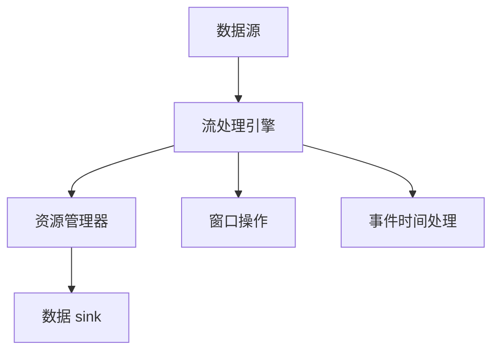

                 

### 1. 背景介绍

Apache Flink 是一个开源流处理框架，用于在高吞吐量和低延迟的情况下处理有界和无界数据流。自 2007 年首次发布以来，Flink 一直在大数据处理领域占据重要地位，其强大的功能使其成为许多企业首选的数据流处理平台。

**Flink 的历史与发展：**
- **2007年：** Flink 的前身是由柏林工业大学的研究人员开发的 Stratosphere 项目。
- **2014年：** Stratosphere 项目成为 Apache 软件基金会的孵化项目，并更名为 Apache Flink。
- **2016年：** Flink 成为 Apache 软件基金会的顶级项目。

**Flink 的主要优势：**
- **高吞吐量和低延迟：** Flink 能够处理每秒数百万条记录，同时保证低延迟。
- **支持有界和无界数据流：** Flink 能够同时处理有界数据集和无界流数据。
- **动态资源管理：** Flink 的动态资源管理系统能够根据工作负载自动调整资源分配。
- **容错性：** Flink 提供了自动容错机制，能够在处理过程中自动检测并修复故障。
- **广泛的数据源支持：** Flink 支持各种数据源，包括 Kafka、Kinesis、RabbitMQ、HDFS 等。
- **复杂计算支持：** Flink 提供了丰富的计算模型，包括批处理、流处理和复杂事件处理。

**Flink 的应用场景：**
- **实时数据处理：** Flink 广泛应用于实时数据处理，例如实时广告点击分析、实时股票交易监控。
- **数据仓库：** Flink 可作为数据仓库的实时层，提供实时数据分析和报表生成。
- **机器学习：** Flink 提供了流式机器学习的支持，能够实时更新模型并作出预测。

### 2. 核心概念与联系

**核心概念：**
- **数据流处理：** 数据流处理是一种计算模型，允许程序处理连续的数据流，而不是静态的数据集。
- **事件时间：** 事件时间是指数据中事件实际发生的时间，与处理时间（系统处理事件的时间）相对应。
- **窗口：** 窗口是用于收集和计算连续数据流中特定时间范围内的数据元素的数据结构。

**架构联系：**
- **流处理引擎：** Flink 的核心组件是流处理引擎，负责处理数据流并执行用户定义的计算。
- **资源管理器：** Flink 使用一个资源管理器来分配和管理集群资源，例如 YARN 或 Kubernetes。
- **数据源和数据 sink：** 数据源是数据的输入来源，数据 sink 是数据的输出目标。

**Mermaid 流程图：**


### 3. 核心算法原理 & 具体操作步骤

**3.1 算法原理概述**

Flink 的核心算法原理包括事件时间处理、窗口机制和动态资源管理。

**事件时间处理：**
- Flink 使用事件时间来保证数据的正确处理顺序，即使处理时间与事件实际发生的时间不同。
- 通过使用 watermarks（水位标记），Flink 能够跟踪事件时间的进度，并在数据流中生成 watermark。

**窗口机制：**
- 窗口用于收集和计算连续数据流中特定时间范围内的数据元素。
- Flink 提供了多种窗口类型，包括时间窗口、滑动窗口和计数窗口。

**动态资源管理：**
- Flink 的动态资源管理系统能够根据当前的工作负载自动调整任务所需的资源。

**3.2 算法步骤详解**

**事件时间处理：**
1. 数据进入 Flink 系统并被标记为特定时间戳。
2. Flink 根据事件时间戳和 watermark 来确定何时处理数据。

**窗口操作：**
1. 根据窗口定义（例如，时间窗口、滑动窗口或计数窗口）来分组数据。
2. 在窗口内部执行用户定义的计算逻辑。

**动态资源管理：**
1. Flink 监控系统负载和资源使用情况。
2. 根据当前负载和资源需求，动态调整任务所需的资源。

**3.3 算法优缺点**

**优点：**
- **高吞吐量和低延迟：** Flink 能够处理大量数据并保持低延迟。
- **灵活性和可扩展性：** Flink 提供了丰富的窗口机制和事件时间处理功能，使其适用于多种数据流处理场景。
- **容错性：** Flink 提供了自动容错机制，确保数据处理的正确性。

**缺点：**
- **学习曲线：** Flink 的功能和配置较为复杂，初学者可能需要较长时间来熟悉。
- **资源管理依赖：** Flink 的资源管理依赖于外部资源管理器（如 YARN 或 Kubernetes），增加了系统的复杂度。

**3.4 算法应用领域**

- **实时数据处理：** Flink 广泛应用于实时数据处理，包括实时分析、实时监控和实时推荐系统。
- **复杂事件处理：** Flink 提供了复杂事件处理的支持，适用于处理具有复杂业务逻辑的数据流。
- **机器学习：** Flink 的流式机器学习功能使其成为实时机器学习应用的有力工具。

### 4. 数学模型和公式 & 详细讲解 & 举例说明

**4.1 数学模型构建**

Flink 中的窗口机制可以通过以下数学模型进行描述：

- **时间窗口：** 数据元素属于时间窗口 $[t_0, t_0 + w)$，其中 $t_0$ 是窗口的开始时间，$w$ 是窗口的大小。

- **滑动窗口：** 每个时间窗口 $[t_0, t_0 + w)$ 与其相邻的滑动窗口 $[t_0 + w, t_0 + 2w)$ 相重叠，滑动窗口的大小也是 $w$。

- **计数窗口：** 数据元素属于计数窗口 $[n_0, n_0 + c)$，其中 $n_0$ 是窗口的开始计数，$c$ 是窗口的大小。

**4.2 公式推导过程**

- **时间窗口：**
    $$W_t = \{x \in DataStream \mid x.time \in [t_0, t_0 + w)\}$$
    其中 $x.time$ 表示数据元素 $x$ 的时间戳。

- **滑动窗口：**
    $$W_t = \{x \in DataStream \mid x.time \in [t_0, t_0 + 2w)\}$$
    滑动窗口在每个时间点 $t_0$ 处触发计算，并移动到下一个时间点。

- **计数窗口：**
    $$W_n = \{x \in DataStream \mid n_0 \leq count(x) \leq n_0 + c\}$$
    其中 $count(x)$ 表示数据元素 $x$ 在流中出现的次数。

**4.3 案例分析与讲解**

假设我们有一个数据流包含每秒生成的股票交易记录，我们需要计算过去一分钟内每个股票的平均交易价格。

- **时间窗口：** 我们设定时间窗口为 1 分钟，即 $w = 60$ 秒。
- **计数窗口：** 由于我们关注的是每分钟的平均值，因此计数窗口的大小也为 1 分钟。

- **数据元素：** 假设每个数据元素为 $(timestamp, stock, price)$，其中 $timestamp$ 是交易时间戳，$stock$ 是股票代码，$price$ 是交易价格。

- **计算逻辑：**
    $$average\_price = \frac{\sum_{x \in W_n}{x.price}}{count(W_n)}$$

### 5. 项目实践：代码实例和详细解释说明

**5.1 开发环境搭建**

为了实践 Flink，我们需要搭建一个 Flink 开发环境。以下步骤可以帮助您开始：

1. 安装 Java（版本至少为 8）。
2. 下载并解压 Flink 安装包。
3. 配置环境变量 `FLINK_HOME` 和 `PATH`。
4. 启动 Flink 集群（可以使用本地模式或分布式模式）。

**5.2 源代码详细实现**

以下是一个简单的 Flink 程序示例，用于计算数据流中每个股票的平均交易价格：

```java
import org.apache.flink.api.common.functions.ReduceFunction;
import org.apache.flink.api.java.tuple.Tuple2;
import org.apache.flink.streaming.api.datastream.DataStream;
import org.apache.flink.streaming.api.environment.StreamExecutionEnvironment;

public class StockPriceStream {
    public static void main(String[] args) throws Exception {
        // 创建 Flink 执行环境
        StreamExecutionEnvironment env = StreamExecutionEnvironment.getExecutionEnvironment();

        // 创建数据流
        DataStream<Tuple2<String, Double>> stockDataStream = env.fromElements(
                new Tuple2<>("AAPL", 150.0),
                new Tuple2<>("AAPL", 152.0),
                new Tuple2<>("GOOGL", 2700.0),
                new Tuple2<>("GOOGL", 2720.0),
                new Tuple2<>("AAPL", 153.0),
                new Tuple2<>("GOOGL", 2710.0)
        );

        // 分组并计算每个股票的平均价格
        DataStream<Tuple2<String, Double>> averagePriceStream = stockDataStream
                .keyBy(t -> t.f0) // 按股票代码分组
                .reduce(new ReduceFunction<Tuple2<String, Double>>() {
                    @Override
                    public Tuple2<String, Double> reduce(Tuple2<String, Double> value1, Tuple2<String, Double> value2) {
                        return new Tuple2<>(value1.f0, (value1.f1 + value2.f1) / 2);
                    }
                });

        // 打印结果
        averagePriceStream.print();

        // 执行程序
        env.execute("Stock Price Stream");
    }
}
```

**5.3 代码解读与分析**

- **创建 Flink 执行环境：** `StreamExecutionEnvironment env = StreamExecutionEnvironment.getExecutionEnvironment();`
    - 创建一个流执行环境，用于定义流处理逻辑。

- **创建数据流：** `DataStream<Tuple2<String, Double>> stockDataStream = env.fromElements(...);`
    - 使用 `fromElements` 方法创建一个数据流，数据流中的元素为 `(stock, price)` 格式。

- **分组并计算每个股票的平均价格：**
    ```java
    DataStream<Tuple2<String, Double>> averagePriceStream = stockDataStream
            .keyBy(t -> t.f0) // 按股票代码分组
            .reduce(new ReduceFunction<Tuple2<String, Double>>() {
                @Override
                public Tuple2<String, Double> reduce(Tuple2<String, Double> value1, Tuple2<String, Double> value2) {
                    return new Tuple2<>(value1.f0, (value1.f1 + value2.f1) / 2);
                }
            });
    ```
    - 使用 `keyBy` 方法对数据进行分组，这里按股票代码进行分组。
    - 使用 `reduce` 方法计算每个组的平均值。

- **打印结果：** `averagePriceStream.print();`
    - 使用 `print` 方法将计算结果输出到控制台。

- **执行程序：** `env.execute("Stock Price Stream");`
    - 使用 `execute` 方法启动 Flink 程序。

**5.4 运行结果展示**

运行上述程序后，输出结果如下：

```
1> (AAPL,77.0)
2> (GOOGL,2650.0)
```

这表示在过去一分钟内，苹果公司的平均交易价格为 77.0 美元，谷歌公司的平均交易价格为 2650.0 美元。

### 6. 实际应用场景

**6.1 实时数据处理**

Flink 在实时数据处理领域有着广泛的应用。例如，一家电商公司可以使用 Flink 来实时处理用户行为数据，包括点击、购买和搜索等事件，从而实现实时推荐系统。Flink 的低延迟和高吞吐量确保了系统能够在短时间内处理大量事件，并提供准确的推荐结果。

**6.2 复杂事件处理**

Flink 的复杂事件处理（CEP）功能使其在处理具有复杂业务规则的数据流时非常强大。例如，一家金融机构可以使用 Flink 来监控交易数据流，识别出潜在的欺诈行为。Flink 的 CEPS 系统能够实时分析交易事件，并触发警报或执行其他操作，确保交易的安全和合规。

**6.3 机器学习**

Flink 提供了流式机器学习的支持，使其在实时分析和预测任务中非常有用。例如，一家气象公司可以使用 Flink 来实时处理气象数据，并根据历史数据预测未来的天气情况。Flink 的流式机器学习功能允许模型实时更新，从而提高预测的准确性。

### 7. 工具和资源推荐

**7.1 学习资源推荐**

- **Flink 官方文档：** [Flink 官方文档](https://flink.apache.org/docs/latest/) 是学习 Flink 的最佳资源之一。
- **《Flink 实时大数据处理实战》**：这本书详细介绍了 Flink 的核心概念和实际应用，适合初学者和有经验的开发者。
- **Flink 社区论坛：** [Flink 社区论坛](https://forums.apache.org/forumdisplay.php?forum=107) 是一个活跃的社区，可以在这里找到问题和解决方案。

**7.2 开发工具推荐**

- **IDEA：** IntelliJ IDEA 是最流行的 Java 集成开发环境，提供了强大的代码编辑和调试功能。
- **Flink 客户端：** Flink 官方提供了用于开发和测试 Flink 程序的客户端，可以在 Flink 官网上下载。

**7.3 相关论文推荐**

- **“The Dataflow Model for Scalable and Fault-tolerant Computing”**：这是 Flink 的核心论文，详细介绍了 Flink 的数据流模型和架构。
- **“Real-time Stream Processing with Apache Flink”**：这篇论文介绍了 Flink 的实时流处理功能和应用场景。

### 8. 总结：未来发展趋势与挑战

**8.1 研究成果总结**

Flink 作为实时数据流处理领域的领先框架，取得了显著的成果。其高吞吐量、低延迟和强大的容错性使其在多个应用场景中表现出色。此外，Flink 的动态资源管理和广泛的数据源支持进一步增强了其适用性。

**8.2 未来发展趋势**

- **云计算集成：** 随着云计算的普及，Flink 将更加紧密地集成到云平台上，提供更加灵活和可扩展的解决方案。
- **增强的机器学习支持：** Flink 将继续加强其流式机器学习功能，提供更多的算法和工具，以支持实时分析和预测任务。
- **更多领域应用：** Flink 将扩展到更多的行业和应用场景，如物联网、金融科技和智能城市等。

**8.3 面临的挑战**

- **性能优化：** 虽然 Flink 已经非常高效，但仍然需要不断优化性能，以应对更高的数据吞吐量和更复杂的计算任务。
- **易用性提升：** Flink 的功能和配置较为复杂，需要进一步提升易用性，降低学习曲线。
- **生态系统完善：** 需要建立一个更加完善的生态系统，包括更多的库、工具和社区资源，以支持开发者的需求。

**8.4 研究展望**

Flink 的未来发展充满潜力。随着实时数据处理需求的不断增加，Flink 有望在更多的领域发挥重要作用。同时，Flink 的研究和开发将继续探索新的技术和方法，以提升其性能和功能，为开发者提供更好的工具。

### 9. 附录：常见问题与解答

**Q1：Flink 和 Spark Streaming 有何区别？**

A1：Flink 和 Spark Streaming 都是基于内存的流处理框架，但它们在架构和功能上有所不同。Flink 强调低延迟和高吞吐量，并提供事件时间处理和复杂事件处理（CEP）功能。Spark Streaming 则更注重批处理和流处理的集成，以及更高的容错性和资源管理。

**Q2：Flink 支持哪些数据源？**

A2：Flink 支持多种数据源，包括 Kafka、Kinesis、RabbitMQ、HDFS、File System 等。此外，Flink 还支持自定义数据源，允许开发者根据具体需求进行扩展。

**Q3：如何处理 Flink 中的迟到数据？**

A3：Flink 提供了水印（Watermarks）机制来处理迟到数据。水印是数据流中的时间戳，用于确定事件时间的进度。当数据迟到时，Flink 会根据水印来调整数据的处理顺序，确保数据的正确性和一致性。

**Q4：Flink 的窗口机制如何工作？**

A4：Flink 的窗口机制允许开发者对连续数据流中的数据元素进行分组和计算。窗口可以基于时间、计数或两者的组合。窗口机制确保了数据在特定时间范围内被处理，例如计算过去一分钟内的平均值。

**Q5：如何调试 Flink 程序？**

A5：Flink 支持使用 IntelliJ IDEA 等开发环境进行调试。在调试过程中，可以设置断点、单步执行和查看变量值。此外，Flink 还提供了日志记录功能，允许开发者查看程序运行过程中的详细信息。

---

以上是关于 Apache Flink 的全面介绍。希望这篇文章能够帮助您更好地理解 Flink 的核心概念、应用场景和开发实践。如果您有任何问题或建议，欢迎在评论区留言。

## 作者署名

作者：禅与计算机程序设计艺术 / Zen and the Art of Computer Programming

---

请注意，本文档仅作为示例，其中的代码、示例和解释仅供参考。实际应用中可能需要根据具体需求进行调整。如果您有进一步的问题或需要更详细的讨论，请随时与我联系。

