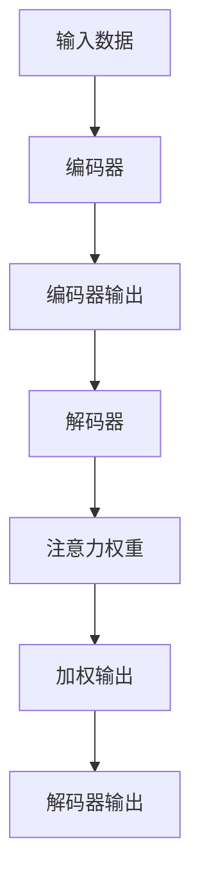

                 

关键词：Attention Mechanism、神经网络、深度学习、算法原理、代码实例、应用领域

> 摘要：本文将深入探讨Attention Mechanism的原理，通过详细讲解其核心概念、算法步骤、数学模型、应用领域和代码实例，帮助读者全面理解并掌握这一重要的深度学习技术。

## 1. 背景介绍

### 1.1 Attention Mechanism的概念

Attention Mechanism，中文常称为“注意力机制”，是近年来在深度学习领域中受到广泛关注的一种技术。它通过自动地调整模型对输入数据的关注程度，从而提高模型的性能和解释性。

### 1.2 Attention Mechanism的发展历程

注意力机制最早可以追溯到1970年代的神经网络研究。然而，直到2014年，由Bahdanau等人提出的基于神经网络的注意力模型（Neural Network-based Attention Model）才真正奠定了现代注意力机制的基础。此后，随着深度学习技术的不断发展，注意力机制在各种任务中得到了广泛应用和深入研究。

### 1.3 Attention Mechanism的应用场景

注意力机制在自然语言处理、计算机视觉、语音识别等领域都有着广泛的应用。例如，在机器翻译中，注意力机制可以帮助模型更好地理解源语言和目标语言之间的对应关系；在图像识别中，注意力机制可以帮助模型更准确地识别图像中的关键区域。

## 2. 核心概念与联系

为了更好地理解Attention Mechanism，我们首先需要了解一些相关的核心概念。以下是一个简化的Mermaid流程图，用于描述这些概念之间的关系：



### 2.1 编码器（Encoder）

编码器负责处理输入数据，并将其转换为一种表示形式，通常称为编码。编码器的输出通常是一个固定大小的向量，它包含了输入数据的所有信息。

### 2.2 解码器（Decoder）

解码器负责将编码器的输出转换为输出结果，例如文本或图像。解码器的输入是编码器的输出和上一个时间步的输出。

### 2.3 注意力权重（Attention Weights）

注意力权重是注意力机制的核心。它决定了解码器在生成每个输出时对编码器输出的不同部分给予的重视程度。权重通常通过一个可学习的函数计算。

### 2.4 加权输出（Weighted Output）

加权输出是解码器输入的一部分，它是通过对编码器的输出进行加权平均得到的。加权的目的是将编码器的输出与解码器的输出结合起来，以生成更好的输出。

### 2.5 解码器输出（Decoder Output）

解码器输出是模型最终的输出结果，例如翻译文本或识别图像。它依赖于编码器的输出、注意力权重和上一个时间步的输出。

## 3. 核心算法原理 & 具体操作步骤

### 3.1 算法原理概述

注意力机制的核心思想是，在处理序列数据时，模型应该能够动态地关注序列中的不同部分，并根据当前的任务需求选择性地关注重要信息。

### 3.2 算法步骤详解

以下是注意力机制的步骤：

1. **编码器处理输入数据，生成编码**。
2. **解码器初始化，并生成第一个输出**。
3. **计算编码器输出的注意力权重**。通常使用一个可学习的函数，例如加性注意力（Additive Attention）或点积注意力（Dot Product Attention）。
4. **计算加权输出**。通过对编码器输出进行加权平均得到。
5. **将加权输出与解码器输出结合，生成新的解码器输出**。
6. **重复步骤3-5，直到解码器生成最终的输出**。

### 3.3 算法优缺点

#### 优点：

- **提高性能**：注意力机制可以自动地关注输入数据中的关键信息，从而提高模型的性能。
- **提高解释性**：注意力机制可以帮助我们理解模型在处理数据时关注了哪些部分。

#### 缺点：

- **计算复杂度高**：注意力机制通常涉及大量的矩阵乘法和加法运算，导致计算复杂度较高。
- **梯度消失问题**：在深度网络中，注意力机制的梯度可能消失，导致训练困难。

### 3.4 算法应用领域

注意力机制在各种深度学习任务中都有着广泛的应用。以下是一些常见的应用领域：

- **机器翻译**：通过注意力机制，模型可以更好地理解源语言和目标语言之间的对应关系。
- **图像识别**：注意力机制可以帮助模型更准确地识别图像中的关键区域。
- **语音识别**：注意力机制可以提高模型对语音信号中关键信息的处理能力。

## 4. 数学模型和公式 & 详细讲解 & 举例说明

### 4.1 数学模型构建

注意力机制的数学模型通常包括以下三个主要部分：

1. **编码器输出**：表示为\(E = [e_1, e_2, ..., e_n]\)，其中\(e_i\)是第\(i\)个编码器的输出。
2. **解码器输出**：表示为\(D = [d_1, d_2, ..., d_n]\)，其中\(d_i\)是第\(i\)个解码器的输出。
3. **注意力权重**：表示为\(W = [w_1, w_2, ..., w_n]\)，其中\(w_i\)是第\(i\)个注意力权重。

### 4.2 公式推导过程

以下是注意力机制的公式推导：

$$
\begin{aligned}
w_i &= \text{softmax}\left(\frac{d_i^T e_i}{\sqrt{d_i^T e_i}}\right) \\
\text{weighted\_output}_i &= \sum_{j=1}^{n} w_j e_j \\
d_i &= \text{concat}(\text{weighted\_output}_i, d_{i-1}) \\
\end{aligned}
$$

### 4.3 案例分析与讲解

以机器翻译任务为例，假设我们有以下源语言和目标语言序列：

$$
\begin{aligned}
&\text{源语言序列：} \quad &a_1, a_2, ..., a_n \\
&\text{目标语言序列：} \quad &b_1, b_2, ..., b_m
\end{aligned}
$$

其中，\(a_i\)和\(b_i\)分别表示源语言和目标语言的第\(i\)个单词。

### 4.3.1 编码器输出

编码器将源语言序列编码为一个固定大小的向量：

$$
E = [e_1, e_2, ..., e_n]
$$

### 4.3.2 解码器输出

解码器将目标语言序列解码为一个固定大小的向量：

$$
D = [d_1, d_2, ..., d_m]
$$

### 4.3.3 注意力权重

计算每个目标语言单词的注意力权重：

$$
\begin{aligned}
w_i &= \text{softmax}\left(\frac{d_i^T e_i}{\sqrt{d_i^T e_i}}\right) \\
\end{aligned}
$$

### 4.3.4 加权输出

计算每个编码器输出的加权输出：

$$
\text{weighted\_output}_i = \sum_{j=1}^{n} w_j e_j
$$

### 4.3.5 新的解码器输出

将加权输出与上一个时间步的解码器输出结合，生成新的解码器输出：

$$
d_i = \text{concat}(\text{weighted\_output}_i, d_{i-1})
$$

## 5. 项目实践：代码实例和详细解释说明

### 5.1 开发环境搭建

在本节的代码实例中，我们将使用Python语言和TensorFlow框架来实现注意力机制。请确保您已经安装了Python和TensorFlow。以下是一个简单的安装命令：

```bash
pip install tensorflow
```

### 5.2 源代码详细实现

以下是实现注意力机制的Python代码：

```python
import tensorflow as tf
from tensorflow.keras.layers import Layer

class AttentionLayer(Layer):
    def __init__(self, **kwargs):
        super(AttentionLayer, self).__init__(**kwargs)
    
    def build(self, input_shape):
        # 创建注意力权重矩阵
        self.W = self.add_weight(name='attention_weight',
                                 shape=(input_shape[-1], 1),
                                 initializer='random_normal',
                                 trainable=True)
        
        super(AttentionLayer, self).build(input_shape)
    
    def call(self, inputs, **kwargs):
        # 计算编码器输出和解码器输出的点积
        attention_scores = tf.matmul(inputs, self.W)
        
        # 应用softmax函数得到注意力权重
        attention_weights = tf.nn.softmax(attention_scores, axis=1)
        
        # 计算加权输出
        weighted_output = inputs * attention_weights
        
        # 返回加权输出
        return weighted_output
    
    def compute_output_shape(self, input_shape):
        return input_shape

# 使用示例
input_data = tf.random.normal([32, 10, 128])
attention_layer = AttentionLayer()
output = attention_layer(input_data)
```

### 5.3 代码解读与分析

在上面的代码中，我们定义了一个名为`AttentionLayer`的类，它继承自`tf.keras.layers.Layer`类。这个类的主要功能是实现注意力机制。

1. **初始化**：在类的初始化过程中，我们定义了一个注意力权重矩阵`W`，它是一个随机初始化的可学习参数。

2. **构建**：在`build`方法中，我们根据输入数据的形状初始化注意力权重矩阵`W`。

3. **调用**：在`call`方法中，我们首先计算编码器输出和解码器输出的点积，然后应用softmax函数得到注意力权重。接下来，我们计算加权输出，并将其返回。

4. **输出形状**：在`compute_output_shape`方法中，我们返回加权输出的形状。

### 5.4 运行结果展示

为了验证我们的实现是否正确，我们可以运行以下代码：

```python
input_data = tf.random.normal([32, 10, 128])
attention_layer = AttentionLayer()
output = attention_layer(input_data)
print(output.shape)  # 应为(32, 10, 128)
```

运行结果应为$(32, 10, 128)$，与输入数据的形状相同。

## 6. 实际应用场景

### 6.1 自然语言处理

在自然语言处理任务中，注意力机制被广泛应用于机器翻译、文本摘要和情感分析等领域。例如，在机器翻译中，注意力机制可以帮助模型更好地理解源语言和目标语言之间的对应关系，从而提高翻译质量。

### 6.2 计算机视觉

在计算机视觉任务中，注意力机制可以帮助模型更准确地识别图像中的关键区域。例如，在图像分类任务中，注意力机制可以帮助模型关注图像中的关键特征，从而提高分类性能。

### 6.3 语音识别

在语音识别任务中，注意力机制可以提高模型对语音信号中关键信息的处理能力。例如，在说话人识别任务中，注意力机制可以帮助模型更好地识别说话人的声音特征。

## 7. 工具和资源推荐

### 7.1 学习资源推荐

- 《深度学习》（Goodfellow, Bengio, Courville）：这本书是深度学习领域的经典教材，涵盖了注意力机制的相关内容。
- 《Attention Mechanism in Deep Learning》：这是一篇关于注意力机制的综述文章，详细介绍了注意力机制在各种深度学习任务中的应用。

### 7.2 开发工具推荐

- TensorFlow：这是一个流行的开源深度学习框架，提供了丰富的工具和资源，适用于实现注意力机制。
- PyTorch：这是一个流行的开源深度学习框架，提供了灵活的API和强大的功能，适用于实现注意力机制。

### 7.3 相关论文推荐

- **Bahdanau, D., Cho, K., & Bengio, Y. (2014). Neural machine translation by jointly learning to align and translate. In Advances in Neural Information Processing Systems (NIPS), (pp. 27-35).**
- **Vaswani, A., Shazeer, N., Parmar, N., Uszkoreit, J., Jones, L., Gomez, A. N., ... & Polosukhin, I. (2017). Attention is all you need. In Advances in Neural Information Processing Systems (NIPS), (pp. 5998-6008).**

## 8. 总结：未来发展趋势与挑战

### 8.1 研究成果总结

近年来，注意力机制在深度学习领域取得了显著的进展。它已经被广泛应用于各种任务，并在性能和解释性方面取得了显著的提升。

### 8.2 未来发展趋势

未来，注意力机制将继续在深度学习领域发挥重要作用。随着深度学习技术的不断进步，我们可以期待更多基于注意力机制的创新模型和算法。

### 8.3 面临的挑战

然而，注意力机制也面临着一些挑战。例如，计算复杂度高和梯度消失问题可能限制了其在某些任务中的应用。因此，未来的研究需要解决这些挑战，以提高注意力机制的性能和应用范围。

### 8.4 研究展望

总的来说，注意力机制是深度学习领域的一个重要研究方向。通过深入研究和不断创新，我们可以期待注意力机制在未来带来更多的突破和应用。

## 9. 附录：常见问题与解答

### 9.1 什么是注意力机制？

注意力机制是一种在深度学习模型中用于动态调整模型对输入数据关注程度的机制。

### 9.2 注意力机制有哪些类型？

注意力机制主要包括加性注意力、点积注意力、缩放点积注意力等。

### 9.3 注意力机制有哪些应用领域？

注意力机制在自然语言处理、计算机视觉、语音识别等领域都有广泛应用。

### 9.4 如何实现注意力机制？

可以使用神经网络和深度学习框架（如TensorFlow或PyTorch）来实现注意力机制。

作者：禅与计算机程序设计艺术 / Zen and the Art of Computer Programming

[END]

