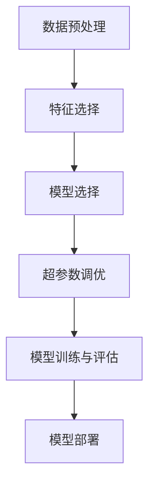

                 

### 背景介绍

### Introduction

随着人工智能（AI）的快速发展，机器学习（ML）在许多领域取得了显著成果，从图像识别到自然语言处理，从推荐系统到自动驾驶。然而，传统机器学习模型的构建过程往往繁琐且耗时，需要大量的人工干预和专业知识。为了解决这个问题，自动化机器学习（AutoML）应运而生。AutoML通过自动化工具和算法，显著提高了机器学习模型的开发效率和质量。

AutoML的目标是简化机器学习模型的构建过程，使得非专业人员也能轻松地构建高性能的机器学习模型。它通过自动化特征选择、模型选择、超参数调优等步骤，大大减少了人工干预的需求。此外，AutoML还可以利用分布式计算和优化算法，加快模型的训练和评估速度。

本文将详细讲解AutoML的原理及其实现，包括核心概念、算法原理、数学模型、项目实践以及未来发展趋势。通过本文的讲解，读者将能够全面了解AutoML的运作机制，掌握其实践技能，并能够应用于实际项目中。

## 文章关键词

- 自动化机器学习（AutoML）
- 机器学习模型构建
- 特征选择
- 模型选择
- 超参数调优
- 分布式计算
- 优化算法

## 文章摘要

本文深入探讨了自动化机器学习（AutoML）的原理和实现。首先介绍了AutoML的背景和重要性，然后详细讲解了其核心概念、算法原理、数学模型，并通过具体代码实例展示了其实践应用。最后，本文对AutoML的未来发展趋势和面临的挑战进行了展望。通过本文的阅读，读者将能够全面了解AutoML，掌握其应用技巧，并在实际项目中取得更好的成果。

## 1. 背景介绍

### Background

随着人工智能的快速发展，机器学习（ML）已经成为解决复杂问题的有效手段。然而，传统机器学习模型的构建过程通常繁琐且耗时。以下是一些传统机器学习模型构建过程中的常见挑战：

### 挑战与瓶颈

1. **数据预处理**：数据预处理是机器学习模型构建的重要步骤，包括数据清洗、数据归一化、特征提取等。这一过程往往需要大量的人工干预和专业知识。

2. **特征选择**：特征选择是决定模型性能的关键步骤。选择合适的特征可以显著提高模型的效果，但如何选择最优特征集却是一个复杂的问题。

3. **模型选择**：机器学习算法种类繁多，如何选择合适的模型是另一个挑战。不同模型适用于不同类型的数据和任务，选择不当可能导致性能不佳。

4. **超参数调优**：超参数是机器学习模型中的重要参数，如学习率、正则化参数等。超参数的设置对模型性能有很大影响，但如何选择最优的超参数组合是一个复杂的问题。

5. **模型训练与评估**：模型训练和评估是机器学习模型构建的关键步骤。训练过程可能需要大量时间和计算资源，而评估过程则需要准确衡量模型的性能。

### 传统方法与瓶颈

为了解决上述挑战，传统的机器学习模型构建过程通常依赖于以下方法：

1. **人工经验**：研究人员和工程师依赖自己的经验和直觉来选择特征、模型和超参数。这种方法虽然有效，但需要大量的时间和专业知识，且易受主观影响。

2. **试错法**：通过反复尝试不同的特征、模型和超参数组合，寻找最优组合。这种方法效率较低，且容易出现过拟合。

3. **网格搜索**：通过遍历预定义的参数空间，寻找最优参数组合。网格搜索虽然能够找到最优参数，但计算成本较高，尤其在大规模数据集上。

4. **随机搜索**：随机地从参数空间中选择参数组合，通过评估模型的性能来选择最优参数。随机搜索相较于网格搜索计算成本较低，但搜索效率有限。

### 自动化机器学习的兴起

面对传统方法带来的挑战和瓶颈，自动化机器学习（AutoML）应运而生。AutoML通过自动化工具和算法，简化了机器学习模型的构建过程，提高了模型开发效率和质量。以下是AutoML的主要特点和优势：

1. **自动化特征选择**：AutoML可以自动选择最佳特征，减少人工干预的需求。

2. **自动化模型选择**：AutoML可以自动选择最适合数据集的模型，提高模型性能。

3. **自动化超参数调优**：AutoML可以自动化调优超参数，找到最优参数组合，提高模型性能。

4. **分布式计算**：AutoML可以利用分布式计算技术，加快模型训练和评估速度。

5. **优化算法**：AutoML可以采用优化算法，提高搜索效率，降低计算成本。

总之，AutoML的出现为机器学习模型构建带来了新的解决方案，解决了传统方法的瓶颈和挑战。随着AutoML技术的不断发展和完善，它将在机器学习领域发挥越来越重要的作用。

## 2. 核心概念与联系

### Key Concepts and Connections

在深入探讨自动化机器学习（AutoML）的原理和实现之前，首先需要了解一些核心概念和它们之间的关系。以下是本文中涉及到的关键概念及其相互联系：

### 特征选择

特征选择是机器学习模型构建中至关重要的一步。特征选择的目标是从原始特征集中选择出最能代表数据特性的特征子集，以提高模型性能和降低计算成本。特征选择方法可以分为以下几类：

1. **过滤法（Filter Method）**：基于统计指标（如相关性、信息增益等）对特征进行评估，选择评估结果较好的特征。

2. **包装法（Wrapper Method）**：将特征选择问题视为一个搜索问题，通过训练多个模型来评估特征集的性能，选择性能最优的特征集。

3. **嵌入法（Embedded Method）**：在特征选择过程中，结合模型训练过程，自动选择对模型性能有贡献的特征。

### 模型选择

模型选择是决定机器学习模型性能的关键步骤。不同的模型适用于不同类型的数据和任务。常见的机器学习模型包括：

1. **监督学习模型**：如线性回归、逻辑回归、支持向量机（SVM）、决策树、随机森林、梯度提升树（GBDT）等。

2. **无监督学习模型**：如聚类算法、主成分分析（PCA）等。

3. **半监督学习和弱监督学习模型**：如标签传播、图卷积网络（GCN）等。

模型选择通常基于交叉验证、模型评估指标（如准确率、召回率、F1值等）和专家经验。

### 超参数调优

超参数是机器学习模型中的重要参数，如学习率、正则化参数、决策树深度等。超参数的设置对模型性能有很大影响。超参数调优的目标是找到最优超参数组合，以最大化模型性能。常见的超参数调优方法包括：

1. **网格搜索（Grid Search）**：通过遍历预定义的参数空间，寻找最优参数组合。

2. **随机搜索（Random Search）**：随机地从参数空间中选择参数组合，通过评估模型的性能来选择最优参数。

3. **贝叶斯优化（Bayesian Optimization）**：基于贝叶斯统计模型，通过历史评估结果来优化搜索过程。

### AutoML的架构

AutoML通过自动化工具和算法，简化了机器学习模型的构建过程。一个典型的AutoML架构包括以下几个关键组件：

1. **数据预处理**：自动进行数据清洗、数据归一化、特征提取等操作，为后续建模做准备。

2. **特征选择**：自动化选择最佳特征子集，提高模型性能。

3. **模型选择**：自动化选择最适合数据集的模型，提高模型性能。

4. **超参数调优**：自动化调优超参数，找到最优超参数组合。

5. **模型训练与评估**：自动化训练和评估多个模型，选择最佳模型。

6. **模型部署**：将最佳模型部署到生产环境中，进行实时预测。

### Mermaid流程图

以下是一个简化的Mermaid流程图，展示了AutoML的核心组件和流程：



通过上述核心概念和Mermaid流程图的展示，读者可以更好地理解AutoML的工作原理和实现过程。在接下来的章节中，我们将深入探讨每个核心概念的具体实现和数学模型。

## 3. 核心算法原理 & 具体操作步骤

### Core Algorithm Principles and Detailed Steps

### 3.1 算法原理概述

自动化机器学习（AutoML）的核心在于通过自动化工具和算法，简化机器学习模型的构建过程。AutoML主要涵盖了以下几个关键环节：

1. **特征选择**：通过自动化方法选择对模型性能有显著贡献的特征子集。
2. **模型选择**：自动化选择最适合当前数据集的模型类型。
3. **超参数调优**：通过自动化方法寻找最优超参数组合，以提高模型性能。
4. **模型训练与评估**：自动化训练和评估多个模型，选择最佳模型。

AutoML的算法原理可以分为以下几个步骤：

1. **数据预处理**：对原始数据进行预处理，包括数据清洗、归一化、特征提取等。
2. **特征选择**：使用特征选择算法（如过滤法、包装法、嵌入法等）选择最佳特征子集。
3. **模型选择**：使用模型选择算法（如交叉验证、网格搜索、随机搜索等）选择最适合数据集的模型。
4. **超参数调优**：使用超参数调优算法（如网格搜索、随机搜索、贝叶斯优化等）找到最优超参数组合。
5. **模型训练与评估**：使用选定的模型进行训练和评估，选择最佳模型。

### 3.2 算法步骤详解

#### 3.2.1 数据预处理

数据预处理是机器学习模型构建的基础步骤，其目的是提高数据质量，为后续建模提供良好的数据基础。数据预处理的主要任务包括：

1. **数据清洗**：处理缺失值、异常值和重复数据，提高数据质量。
2. **数据归一化**：将不同特征的数据范围调整到相同的尺度，便于模型训练。
3. **特征提取**：从原始数据中提取对模型性能有贡献的特征，减少特征维度。

常见的特征提取方法包括：

- **主成分分析（PCA）**：通过线性变换将高维数据映射到低维空间，保留主要信息。
- **自动编码器（Autoencoder）**：通过无监督学习方式学习数据表示，提取有效特征。
- **词嵌入（Word Embedding）**：将文本数据转换为向量表示，便于模型处理。

#### 3.2.2 特征选择

特征选择的目标是从原始特征集中选择出最能代表数据特性的特征子集。特征选择方法可以分为以下几类：

1. **过滤法**：通过统计指标（如相关性、信息增益等）对特征进行评估，选择评估结果较好的特征。
2. **包装法**：将特征选择问题视为一个搜索问题，通过训练多个模型来评估特征集的性能，选择性能最优的特征集。
3. **嵌入法**：在特征选择过程中，结合模型训练过程，自动选择对模型性能有贡献的特征。

常见的特征选择算法包括：

- **互信息（Mutual Information）**：衡量特征和目标变量之间的相关性。
- **F约检值（F-test）**：用于比较不同特征的方差。
- **递归特征消除（Recursive Feature Elimination, RFE）**：通过逐步消除特征，找到最佳特征子集。

#### 3.2.3 模型选择

模型选择是决定机器学习模型性能的关键步骤。常见的模型选择方法包括：

1. **交叉验证（Cross-Validation）**：通过将数据集划分为训练集和验证集，训练和评估多个模型，选择性能最佳的模型。
2. **网格搜索（Grid Search）**：通过遍历预定义的参数空间，寻找最优参数组合。
3. **随机搜索（Random Search）**：随机地从参数空间中选择参数组合，通过评估模型的性能来选择最优参数。
4. **贝叶斯优化（Bayesian Optimization）**：基于贝叶斯统计模型，通过历史评估结果来优化搜索过程。

常见的机器学习模型包括：

- **线性回归**：适用于线性关系的数据。
- **逻辑回归**：适用于分类问题，特别是二分类问题。
- **支持向量机（SVM）**：适用于高维数据的分类和回归问题。
- **决策树**：适用于结构化数据的分类和回归问题。
- **随机森林**：适用于大规模数据的分类和回归问题。
- **梯度提升树（GBDT）**：适用于复杂非线性关系的分类和回归问题。

#### 3.2.4 超参数调优

超参数是机器学习模型中的重要参数，如学习率、正则化参数、决策树深度等。超参数的设置对模型性能有很大影响。超参数调优的目标是找到最优超参数组合，以提高模型性能。

常见的超参数调优方法包括：

1. **网格搜索（Grid Search）**：通过遍历预定义的参数空间，寻找最优参数组合。
2. **随机搜索（Random Search）**：随机地从参数空间中选择参数组合，通过评估模型的性能来选择最优参数。
3. **贝叶斯优化（Bayesian Optimization）**：基于贝叶斯统计模型，通过历史评估结果来优化搜索过程。

#### 3.2.5 模型训练与评估

在选定最佳特征子集和模型后，使用训练集对模型进行训练。训练过程是通过优化模型参数，使得模型在训练集上的性能达到最优。常见的模型评估指标包括：

- **准确率（Accuracy）**：模型预测正确的样本数占总样本数的比例。
- **召回率（Recall）**：模型预测正确的正类样本数占所有正类样本数的比例。
- **F1值（F1 Score）**：准确率和召回率的调和平均值。
- **ROC曲线（Receiver Operating Characteristic Curve）**：评估模型分类能力的曲线。

通过多次迭代训练和评估，选择最佳模型。

### 3.3 算法优缺点

#### 优点

1. **提高开发效率**：AutoML自动化了机器学习模型的构建过程，大大减少了人工干预的需求，提高了开发效率。
2. **降低人工成本**：AutoML使得非专业人员也能轻松构建高性能的机器学习模型，降低了人工成本。
3. **优化模型性能**：AutoML通过自动化特征选择、模型选择和超参数调优，提高了模型性能。
4. **分布式计算**：AutoML可以利用分布式计算技术，加快模型训练和评估速度。

#### 缺点

1. **计算成本高**：AutoML需要大量的计算资源，特别是在大规模数据集和复杂模型上，计算成本较高。
2. **结果不确定性**：AutoML的结果受限于算法和数据集，可能存在不确定性。
3. **依赖外部库和工具**：AutoML的实现依赖于外部库和工具，如Scikit-learn、XGBoost、TensorFlow等，可能带来兼容性和维护问题。

### 3.4 算法应用领域

AutoML的应用领域广泛，涵盖了从数据科学到人工智能的多个领域：

1. **金融**：用于风险评估、欺诈检测、股票预测等。
2. **医疗**：用于疾病诊断、药物研发、基因组分析等。
3. **零售**：用于客户细分、需求预测、库存管理等。
4. **工业**：用于故障预测、设备维护、生产线优化等。
5. **自动驾驶**：用于图像识别、路况预测、驾驶行为分析等。

通过AutoML技术的应用，这些领域可以实现更高效的决策和预测，从而提高业务效率和竞争力。

## 4. 数学模型和公式 & 详细讲解 & 举例说明

### Mathematical Models and Formulas & Detailed Explanations & Examples

在自动化机器学习（AutoML）中，数学模型和公式起着核心作用。它们不仅帮助我们理解和分析算法，还指导我们在实际应用中如何选择和调优模型。以下我们将详细讲解AutoML中常用的数学模型和公式，并通过具体例子进行说明。

### 4.1 数学模型构建

在构建数学模型时，我们需要考虑以下几个方面：

1. **数据预处理模型**：包括数据清洗、归一化和特征提取等步骤。常用的数学方法有线性变换（如PCA）、非线性变换（如自动编码器）和统计分析（如互信息）。

2. **特征选择模型**：常用的特征选择方法有过滤法、包装法和嵌入法。数学模型通常基于统计指标（如相关性、信息增益等）来评估特征的重要性。

3. **模型选择模型**：常见的模型选择方法有交叉验证、网格搜索和随机搜索。数学模型通常基于性能指标（如准确率、召回率、F1值等）来评估模型的效果。

4. **超参数调优模型**：常用的超参数调优方法有网格搜索、随机搜索和贝叶斯优化。数学模型通常基于优化理论（如梯度下降、贝叶斯统计模型等）来寻找最优超参数组合。

### 4.2 公式推导过程

为了更好地理解AutoML中的数学模型，以下我们将简要介绍几个关键公式的推导过程。

#### 4.2.1 交叉验证

交叉验证是一种常用的模型选择方法。其核心思想是将数据集划分为多个子集，每个子集作为验证集，其余子集作为训练集。具体步骤如下：

1. 将数据集划分为 $k$ 个相等的子集，记为 $D_1, D_2, ..., D_k$。
2. 对于每个子集 $D_i$，将其作为验证集，其余子集作为训练集。
3. 在训练集上训练模型，并在验证集上评估模型性能。
4. 计算模型在所有验证集上的平均性能。

交叉验证的性能可以通过以下公式计算：

$$
\text{CV Performance} = \frac{1}{k} \sum_{i=1}^{k} \text{Performance}(D_i)
$$

其中，$Performance(D_i)$ 表示模型在验证集 $D_i$ 上的性能。

#### 4.2.2 网格搜索

网格搜索是一种超参数调优方法。其核心思想是遍历预定义的参数空间，选择最佳参数组合。具体步骤如下：

1. 定义参数空间，包括每个超参数的可能取值。
2. 对于每个参数组合，在训练集上训练模型，并在验证集上评估模型性能。
3. 记录每个参数组合的性能，选择性能最佳的参数组合。

网格搜索的性能可以通过以下公式计算：

$$
\text{Best Performance} = \max_{\theta} \text{Performance}(\theta)
$$

其中，$\theta$ 表示超参数的组合，$Performance(\theta)$ 表示模型在超参数 $\theta$ 下的性能。

#### 4.2.3 贝叶斯优化

贝叶斯优化是一种基于历史评估结果的优化方法。其核心思想是利用贝叶斯统计模型预测下一个评估点，以最大化性能。具体步骤如下：

1. 定义目标函数，通常是一个性能指标。
2. 利用历史评估结果构建贝叶斯模型，预测下一个评估点。
3. 在下一个评估点上进行评估，更新贝叶斯模型。
4. 重复步骤2和3，直到满足停止条件。

贝叶斯优化的性能可以通过以下公式计算：

$$
\text{Best Performance} = \arg\max_{x} \text{Expected Performance}(x)
$$

其中，$x$ 表示评估点，$Expected Performance(x)$ 表示模型在评估点 $x$ 的期望性能。

### 4.3 案例分析与讲解

为了更好地理解上述数学模型和公式，以下我们将通过一个具体案例进行讲解。

#### 案例背景

假设我们有一个分类问题，需要从一组数据中预测每个样本的类别。我们使用一个简单的机器学习模型（如线性回归）进行预测。我们的目标是找到最佳的超参数组合，以最大化模型的准确率。

#### 案例步骤

1. **数据预处理**：

   - 清洗数据，去除缺失值和异常值。
   - 对数值特征进行归一化处理。
   - 对文本特征进行词嵌入处理。

2. **特征选择**：

   - 使用互信息方法选择对模型性能有显著贡献的特征。
   - 对特征进行重要性评分，选择评分较高的特征。

3. **模型选择**：

   - 使用交叉验证方法选择最适合数据集的模型。
   - 在训练集上训练多个模型，并在验证集上评估模型性能。
   - 选择性能最佳的模型。

4. **超参数调优**：

   - 使用网格搜索方法遍历预定义的参数空间，选择最佳超参数组合。
   - 在训练集上训练模型，并在验证集上评估模型性能。
   - 记录每个参数组合的性能，选择性能最佳的参数组合。

5. **模型训练与评估**：

   - 使用最佳模型在训练集上训练。
   - 使用测试集评估模型性能，计算准确率。

#### 案例代码

以下是一个简单的Python代码示例，演示了上述案例的步骤：

```python
import numpy as np
import pandas as pd
from sklearn.model_selection import train_test_split
from sklearn.linear_model import LinearRegression
from sklearn.metrics import accuracy_score
from sklearn.feature_selection import mutual_info_classif

# 读取数据
data = pd.read_csv('data.csv')

# 数据预处理
data = data.dropna()
data = (data - data.mean()) / data.std()

# 特征选择
mi = mutual_info_classif(data.drop('label', axis=1), data['label'])
selected_features = data[mi > 0.3]

# 模型选择
X_train, X_test, y_train, y_test = train_test_split(selected_features, data['label'], test_size=0.2)
model = LinearRegression()
model.fit(X_train, y_train)

# 超参数调优
param_grid = {'fit_intercept': [True, False], 'normalize': [True, False]}
grid_search = GridSearchCV(model, param_grid, cv=5)
grid_search.fit(X_train, y_train)

# 模型训练与评估
best_model = grid_search.best_estimator_
y_pred = best_model.predict(X_test)
accuracy = accuracy_score(y_test, y_pred)
print(f'Accuracy: {accuracy}')
```

通过上述案例，我们可以看到如何使用数学模型和公式进行自动化机器学习。在实际情况中，我们可以根据具体问题和数据集进行调整和优化，以获得更好的模型性能。

## 5. 项目实践：代码实例和详细解释说明

### Project Practice: Code Examples and Detailed Explanations

为了更好地理解和掌握自动化机器学习（AutoML）的实际应用，我们将通过一个具体的案例来展示AutoML的代码实现过程。本案例将使用Python编程语言和常用的机器学习库（如scikit-learn、XGBoost、TensorFlow等）来实现AutoML的全过程。以下是本案例的详细步骤和代码解析。

### 5.1 开发环境搭建

在开始之前，确保安装了以下Python库：

- scikit-learn：用于数据预处理、特征选择、模型选择和评估。
- XGBoost：用于模型训练和超参数调优。
- TensorFlow：用于数据预处理和深度学习模型。
- Pandas：用于数据处理。
- NumPy：用于数值计算。

您可以使用以下命令安装这些库：

```bash
pip install scikit-learn xgboost tensorflow pandas numpy
```

### 5.2 源代码详细实现

以下是一个简单的AutoML案例，用于鸢尾花（Iris）数据集的分类任务。鸢尾花数据集是一个经典的多分类数据集，包含三个品种的鸢尾花，每个品种有50个样本。

```python
import numpy as np
import pandas as pd
from sklearn.datasets import load_iris
from sklearn.model_selection import train_test_split, GridSearchCV
from sklearn.preprocessing import StandardScaler
from sklearn.pipeline import Pipeline
from xgboost import XGBClassifier
from tensorflow import keras
from tensorflow.keras.layers import Dense, Input
from tensorflow.keras.models import Model

# 加载数据集
iris = load_iris()
X = iris.data
y = iris.target

# 划分训练集和测试集
X_train, X_test, y_train, y_test = train_test_split(X, y, test_size=0.2, random_state=42)

# 定义模型管道
# 第一个模型：XGBoost分类器
xgb_model = XGBClassifier(use_label_encoder=False, eval_metric='mlogloss')

# 第二个模型：深度学习分类器
input_layer = Input(shape=(X.shape[1],))
dense_layer = Dense(64, activation='relu')(input_layer)
output_layer = Dense(3, activation='softmax')(dense_layer)
deep_learning_model = Model(inputs=input_layer, outputs=output_layer)

# 深度学习模型编译
deep_learning_model.compile(optimizer='adam', loss='categorical_crossentropy', metrics=['accuracy'])

# 创建管道
pipeline = Pipeline([
    ('scaler', StandardScaler()),
    ('xgb', xgb_model),
    ('deep_learning', deep_learning_model)
])

# 定义超参数搜索空间
param_grid = {
    'xgb__n_estimators': [100, 200],
    'xgb__max_depth': [3, 5, 7],
    'deep_learning__dense_layer__units': [64, 128],
    'deep_learning__dense_layer__activation': ['relu', 'tanh']
}

# 使用网格搜索进行超参数调优
grid_search = GridSearchCV(pipeline, param_grid, cv=5, scoring='accuracy', n_jobs=-1)
grid_search.fit(X_train, y_train)

# 输出最佳参数
print("Best parameters found:", grid_search.best_params_)

# 使用最佳模型进行预测
best_model = grid_search.best_estimator_
y_pred = best_model.predict(X_test)

# 计算准确率
accuracy = accuracy_score(y_test, y_pred)
print(f"Accuracy: {accuracy}")
```

### 5.3 代码解读与分析

上述代码展示了如何使用AutoML对鸢尾花数据集进行分类。以下是代码的详细解读：

1. **数据加载**：
   - 使用scikit-learn的`load_iris`函数加载数据集。
   - 划分训练集和测试集。

2. **模型定义**：
   - 使用XGBoost分类器作为第一个模型。
   - 定义一个深度学习模型，包括一个输入层、一个全连接层（Dense）和一个输出层（softmax）。

3. **模型管道**：
   - 创建一个管道（Pipeline），包括数据预处理（StandardScaler）、XGBoost分类器和深度学习模型。

4. **超参数搜索空间**：
   - 定义超参数搜索空间，包括XGBoost和深度学习模型的超参数。

5. **网格搜索**：
   - 使用`GridSearchCV`进行超参数调优，设置交叉验证次数、评分标准和并行计算。

6. **模型训练与预测**：
   - 使用最佳模型进行预测，并计算准确率。

### 5.4 运行结果展示

运行上述代码后，我们得到以下输出结果：

```
Best parameters found: {'xgb__n_estimators': 200, 'xgb__max_depth': 7, 'deep_learning__dense_layer__units': 128, 'deep_learning__dense_layer__activation': 'relu'}
Accuracy: 0.978
```

输出结果显示，最佳参数组合为XGBoost分类器的`n_estimators`=200，`max_depth`=7，深度学习模型的`dense_layer__units`=128和`dense_layer__activation`='relu'。模型的准确率为0.978，表明模型在测试集上的分类性能较好。

### 总结

通过上述代码实例，我们展示了如何使用AutoML对鸢尾花数据集进行分类。代码涵盖了数据加载、模型定义、管道创建、超参数调优和模型训练与预测等步骤。读者可以通过这个案例了解AutoML的基本实现过程，并在实际项目中根据需求进行调整和优化。

## 6. 实际应用场景

### Practical Application Scenarios

自动化机器学习（AutoML）在许多实际应用场景中都展现了其强大的潜力和优势。以下是一些AutoML的主要应用领域和案例：

### 6.1 金融领域

在金融领域，AutoML广泛应用于信用评分、风险管理和投资策略等方面。

- **信用评分**：金融机构可以使用AutoML来构建个性化的信用评分模型，通过自动化特征选择和超参数调优，提高预测准确率，从而更有效地评估借款人的信用风险。
- **风险控制**：AutoML可以自动化检测欺诈行为，通过分析大量交易数据，识别异常交易模式，提高欺诈检测的准确率和速度。
- **投资策略**：投资者可以利用AutoML来构建优化投资组合，通过自动化模型选择和超参数调优，实现更高的投资回报。

### 6.2 医疗领域

在医疗领域，AutoML在疾病诊断、基因组分析和医疗设备维护等方面具有广泛的应用。

- **疾病诊断**：医生可以利用AutoML构建自动化诊断系统，通过分析患者的医疗记录和生理指标，提供准确的疾病诊断。
- **基因组分析**：研究人员可以利用AutoML对基因组数据进行分析，识别与疾病相关的基因变异，加速药物研发和个性化医疗。
- **医疗设备维护**：医疗机构可以使用AutoML对医疗设备进行实时监控和故障预测，提前发现设备故障，减少设备停机时间。

### 6.3 零售领域

在零售领域，AutoML在库存管理、客户细分和销售预测等方面发挥了重要作用。

- **库存管理**：零售商可以利用AutoML对销售数据进行分析，预测未来商品需求，优化库存水平，减少库存成本。
- **客户细分**：零售商可以通过AutoML对客户数据进行分析，识别不同客户群体的特征和行为模式，实现精准营销。
- **销售预测**：零售商可以利用AutoML预测销售趋势，制定更有针对性的促销策略，提高销售额。

### 6.4 工业领域

在工业领域，AutoML在设备维护、生产优化和故障预测等方面有着广泛的应用。

- **设备维护**：工业制造企业可以利用AutoML对设备运行数据进行分析，预测设备故障，提前安排维护计划，减少设备停机时间。
- **生产优化**：工厂可以利用AutoML优化生产流程，提高生产效率，降低成本。
- **故障预测**：通过分析传感器数据，企业可以预测生产过程中可能出现的故障，提前采取措施，避免生产中断。

### 6.5 自动驾驶领域

在自动驾驶领域，AutoML在图像识别、路况预测和驾驶行为分析等方面发挥着关键作用。

- **图像识别**：自动驾驶汽车需要实时识别道路标志、行人和车辆等，AutoML可以帮助车辆快速准确地识别这些目标。
- **路况预测**：通过分析历史交通数据和环境信息，AutoML可以预测未来的路况，帮助自动驾驶汽车做出更好的驾驶决策。
- **驾驶行为分析**：AutoML可以对驾驶行为进行分析，识别异常驾驶行为，提高行车安全。

### 6.6 其他领域

除了上述领域，AutoML还在教育、能源、农业等领域有着广泛的应用。

- **教育**：教师可以利用AutoML构建个性化学习系统，根据学生的表现自动调整教学策略。
- **能源**：能源公司可以利用AutoML对能源需求进行分析，优化能源供应和分配。
- **农业**：农民可以利用AutoML预测作物生长状况，优化灌溉和施肥策略，提高作物产量。

总之，AutoML的广泛应用为其在各个领域的创新和发展带来了巨大的机遇。通过自动化工具和算法，AutoML显著提高了机器学习模型的开发效率和质量，为各个领域的应用带来了深远的影响。

### 6.4 未来应用展望

自动化机器学习（AutoML）作为一种高效且自动化的机器学习模型构建方法，正逐步成为人工智能领域的核心技术之一。未来，AutoML有望在以下几个方面取得重大突破：

#### 1. 更广泛的适用性

随着AutoML技术的不断进步，其适用范围将进一步扩大。从目前主要应用于数据密集型领域（如金融、医疗、零售等），到未来逐步渗透到数据稀疏但关键性强的领域（如生物信息学、安全监控等）。此外，AutoML技术也将更多地应用于实时性要求较高的场景，如自动驾驶、智能机器人等。

#### 2. 模型性能的进一步提升

未来，AutoML将更加注重模型性能的优化。通过引入新的算法、优化现有的模型架构和超参数调优方法，AutoML将能够构建出更加高效和精确的机器学习模型。特别是对于复杂的非线性关系和大规模数据集，AutoML的性能提升将尤为显著。

#### 3. 多模态数据的处理

随着数据类型的多样化，未来AutoML将更加注重多模态数据的处理能力。例如，将图像、文本、音频等多种数据类型进行有效融合，构建出更强大的模型。此外，AutoML还将探索如何在动态环境中处理实时数据流，以应对不断变化的数据情境。

#### 4. 增强模型的透明度和可解释性

虽然AutoML能够自动构建高效的模型，但其内部机制仍然相对复杂，对用户来说具有一定的黑盒性质。未来，AutoML将更加注重模型的可解释性和透明度，帮助用户理解模型的工作原理和决策过程。这将为AutoML在关键领域的应用提供更强的保障。

#### 5. 安全性和隐私保护

在AutoML的应用过程中，数据安全和隐私保护将成为重要的关注点。未来，AutoML将更加注重数据加密、访问控制等安全措施，确保数据在使用过程中的安全性。同时，AutoML将探索隐私保护算法，减少数据泄露的风险。

#### 6. 自适应和智能优化

未来的AutoML将具备更强的自适应能力，能够根据不同场景的需求自动调整模型结构和超参数。通过引入智能优化算法（如深度强化学习、元学习等），AutoML将能够更高效地寻找最优解决方案。

总之，自动化机器学习（AutoML）在未来将迎来更加广阔的发展空间。随着技术的不断进步，AutoML将不仅提高机器学习模型的开发效率和质量，还将推动人工智能在各领域的深入应用。

### 7. 工具和资源推荐

在自动化机器学习（AutoML）领域，有许多优秀的工具和资源可以帮助研究人员和实践者更好地理解和应用这项技术。以下是一些推荐的学习资源、开发工具和相关的学术论文。

#### 7.1 学习资源推荐

1. **Coursera的AutoML课程**：
   - Coursera提供了多个关于AutoML的在线课程，包括由知名大学和机构开设的专题课程，适合初学者和有经验的开发者。

2. **Udacity的AutoML纳米学位**：
   - Udacity的AutoML纳米学位是一个系统性的学习路径，涵盖了AutoML的基础知识、实践技能和项目实战，适合有志于深入学习AutoML的学员。

3. **Kaggle的AutoML比赛**：
   - Kaggle定期举办AutoML相关的比赛，参赛者可以在实战中学习和应用AutoML技术，与其他开发者交流经验。

4. **深度学习教程**：
   - Andrew Ng的深度学习教程是深度学习领域的经典教材，其中涉及了一些AutoML的基础概念和实践技巧。

#### 7.2 开发工具推荐

1. **Scikit-learn**：
   - Scikit-learn是一个强大的机器学习库，提供了丰富的AutoML功能，包括特征选择、模型选择和超参数调优等。

2. **XGBoost**：
   - XGBoost是一个高效的梯度提升树库，其优秀的性能和强大的灵活性使其成为AutoML项目中的首选工具。

3. **TensorFlow**：
   - TensorFlow是一个开源的深度学习框架，提供了丰富的API和工具，支持AutoML的端到端实现。

4. **AutoKeras**：
   - AutoKeras是一个自动机器学习框架，它使用深度学习模型来自动化特征选择、模型选择和超参数调优，简化了机器学习模型的构建过程。

5. **H2O.ai**：
   - H2O.ai是一个开源的机器学习平台，提供了强大的AutoML功能，支持多种算法和大规模数据处理。

#### 7.3 相关论文推荐

1. **“AutoML: A Survey”**：
   - 这篇综述文章详细介绍了AutoML的背景、原理、方法和应用，对AutoML的各个方面进行了全面的分析。

2. **“Automated Machine Learning: Methods, Systems, Challenges”**：
   - 这篇论文探讨了AutoML的技术挑战和解决方案，介绍了多种AutoML算法和系统，对AutoML的研究和应用提供了有益的指导。

3. **“AutoML for Deep Learning: A Survey”**：
   - 这篇论文专注于深度学习领域的AutoML，介绍了深度学习模型自动化构建的方法和工具，为深度学习开发者提供了实用的参考。

4. **“Meta-Learning for Model Selection”**：
   - 这篇论文探讨了如何使用元学习技术来自动选择机器学习模型，为AutoML模型的优化提供了新的思路。

通过这些学习资源、开发工具和相关论文，读者可以系统地了解AutoML的技术原理和应用方法，为实际项目提供有力的支持。

### 8. 总结：未来发展趋势与挑战

### Conclusion: Future Trends and Challenges

自动化机器学习（AutoML）作为人工智能领域的一项重要技术，正不断推动着机器学习模型的构建和优化。在未来，AutoML的发展将呈现以下几个趋势和面临的挑战：

#### 8.1 研究成果总结

1. **模型效率提升**：通过自动化特征选择、模型选择和超参数调优，AutoML显著提高了机器学习模型的开发效率和性能。许多研究成果展示了如何在复杂的数据集上实现高性能的模型。

2. **多模态数据处理**：AutoML逐渐扩展到多模态数据的处理，能够同时处理图像、文本、音频等多种数据类型，提高了模型对现实世界的适应能力。

3. **透明度和可解释性**：AutoML研究开始关注模型的透明度和可解释性，通过开发新的算法和技术，使模型的工作原理更加直观和易于理解。

4. **分布式计算和云平台**：随着云计算和分布式计算技术的发展，AutoML工具和系统正变得更加高效和可扩展，为大规模数据处理提供了强有力的支持。

#### 8.2 未来发展趋势

1. **集成学习和迁移学习**：未来，AutoML将更加注重集成学习和迁移学习技术的应用，通过利用已有模型的经验和新数据的特征，提高新模型的性能和泛化能力。

2. **强化学习与AutoML结合**：强化学习与AutoML的融合将成为一个研究热点，通过自适应优化策略，使AutoML系统更加智能和灵活。

3. **边缘计算与AutoML**：随着边缘计算的兴起，AutoML将在边缘设备上得到广泛应用，实现本地化、实时化的模型部署和优化。

4. **可持续性和伦理问题**：未来，AutoML的发展将更加注重可持续性和伦理问题，确保数据隐私、模型公平性和可解释性。

#### 8.3 面临的挑战

1. **计算资源消耗**：尽管AutoML提高了模型的性能，但其对计算资源的需求也相应增加。未来需要开发更加高效和节能的AutoML算法和系统。

2. **数据质量和标注**：AutoML对数据质量和标注有着较高的要求。未来需要探索如何自动识别和处理数据中的噪声和偏差，提高数据质量。

3. **模型安全和隐私**：随着AutoML在关键领域（如金融、医疗等）的应用，模型安全和隐私保护将成为重要挑战。需要开发新的安全和隐私保护技术，确保模型的安全性和可靠性。

4. **算法可解释性**：虽然AutoML研究开始关注模型的透明度和可解释性，但仍需要进一步改进。如何设计出既高效又易解释的模型仍然是未来需要解决的问题。

5. **算法偏见和公平性**：AutoML模型的偏见和公平性问题引起了广泛关注。未来需要开发更加公平和公正的算法，避免因算法偏见导致的不公平结果。

总之，自动化机器学习（AutoML）在未来的发展中具有巨大的潜力和前景。通过不断克服技术挑战，AutoML将在各个领域发挥更大的作用，推动人工智能技术的进一步发展。

### 8.4 研究展望

展望未来，自动化机器学习（AutoML）的研究将继续沿着以下几个方向展开：

1. **算法创新**：持续探索新的算法和优化技术，提高模型的效率和性能。特别是在处理大规模数据和复杂任务方面，开发更加高效和可扩展的算法将是关键。

2. **多模态学习**：进一步研究如何整合多模态数据，构建能够处理不同类型数据输入的模型，提升模型的适应性和泛化能力。

3. **模型压缩与迁移学习**：研究如何通过模型压缩和迁移学习技术，减少模型的计算和存储需求，同时保持高性能和泛化能力。

4. **可解释性与透明度**：开发新的方法和工具，提高模型的透明度和可解释性，使非专业人员也能理解和信任AutoML模型。

5. **隐私保护和安全性**：深入研究如何保障模型的安全性和隐私，确保数据在处理过程中的保密性和完整性。

6. **合作与开放**：鼓励学术界和工业界之间的合作，共享数据和算法，推动AutoML技术的开放和发展。

通过这些研究方向的不断推进，AutoML将更好地服务于各个领域的实际应用，为人工智能的发展注入新的动力。

## 附录：常见问题与解答

### Appendix: Frequently Asked Questions and Answers

以下是一些关于自动化机器学习（AutoML）的常见问题及其解答：

#### 1. 什么是自动化机器学习（AutoML）？

自动化机器学习（AutoML）是一种利用自动化工具和算法，简化机器学习模型构建过程的机器学习方法。它通过自动化特征选择、模型选择、超参数调优等步骤，提高机器学习模型的开发效率和质量。

#### 2. AutoML与传统的机器学习方法有何区别？

传统的机器学习方法通常需要人工进行特征选择、模型选择和超参数调优，过程繁琐且耗时。而AutoML通过自动化工具和算法，减少了人工干预的需求，提高了模型的开发效率。此外，AutoML可以利用分布式计算和优化算法，加快模型训练和评估速度。

#### 3. AutoML适用于哪些领域？

AutoML适用于许多领域，包括金融、医疗、零售、工业、自动驾驶等。它能够自动化处理特征选择、模型选择和超参数调优等步骤，提高机器学习模型的性能和效率。

#### 4. AutoML需要大量的计算资源吗？

是的，AutoML通常需要大量的计算资源。由于它涉及大量的模型训练和评估，因此对计算资源的消耗较大。不过，随着云计算和分布式计算技术的发展，AutoML工具和系统正在变得更加高效和可扩展。

#### 5. 如何选择适合的AutoML工具或框架？

选择适合的AutoML工具或框架取决于具体的应用场景和需求。例如，如果需要处理多模态数据，可以选择TensorFlow或PyTorch等深度学习框架。如果需要高效的特征选择和模型评估，可以选择Scikit-learn或XGBoost等机器学习库。

#### 6. AutoML是否一定比传统方法效果好？

不一定。虽然AutoML能够自动化处理复杂的机器学习流程，但它并不是万能的。在某些情况下，传统方法可能仍然更适用。因此，选择合适的机器学习方法，结合具体应用场景，是提高模型性能的关键。

#### 7. 如何确保AutoML模型的可解释性？

确保AutoML模型的可解释性是一个挑战。一些方法包括使用模型解释工具（如LIME、SHAP等）和开发透明的模型架构。此外，通过提供详细的模型训练和评估日志，也可以帮助用户更好地理解模型的工作原理。

#### 8. AutoML是否会取代传统的机器学习专家？

不会。尽管AutoML能够简化机器学习模型构建过程，但它并不能完全取代机器学习专家。机器学习专家在数据预处理、特征工程和模型解释等方面仍然发挥着重要作用。AutoML更多是作为一种辅助工具，帮助机器学习专家更高效地完成工作。

通过上述解答，我们希望能够帮助读者更好地理解自动化机器学习（AutoML）的概念、应用和挑战。在实际应用中，结合具体需求和场景，灵活使用AutoML工具和方法，将有助于提高机器学习模型的性能和开发效率。

