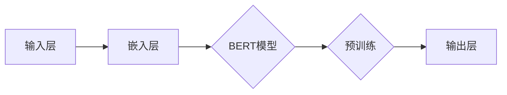

                 

关键词：BERT，深度学习，自然语言处理，神经网络，预训练模型，注意力机制，文本分类，问答系统，数学模型

## 摘要

BERT（Bidirectional Encoder Representations from Transformers）是一种基于变换器（Transformer）架构的深度学习模型，广泛应用于自然语言处理（NLP）领域。本文将详细讲解BERT的原理、构建步骤、数学模型，并通过具体代码实例展示其应用场景。首先，我们将介绍BERT的背景和核心概念，然后逐步阐述其训练过程和数学公式，最后通过实际项目实践来展示BERT的强大功能。

## 1. 背景介绍

自然语言处理（NLP）作为人工智能领域的一个重要分支，近年来取得了巨大的进展。然而，传统的NLP方法在面对复杂、长文本的处理时，效果往往不佳。为了解决这一问题，研究人员提出了预训练模型（Pre-Trained Model）的概念。预训练模型通过在大规模语料上进行预训练，能够提取出语言的基本特征，从而在特定任务上表现出色。

BERT是由Google AI团队于2018年提出的一种预训练模型，它基于变换器（Transformer）架构，通过双向编码的方式学习文本的上下文关系。BERT的出现，标志着NLP领域的一个重大突破，极大地提升了文本分类、问答系统等任务的性能。

### 1.1 自然语言处理的发展历程

自然语言处理的发展历程可以分为三个阶段：规则方法、统计方法和深度学习方法。

- **规则方法**：早期NLP主要依赖于人工编写规则，例如词性标注、句法分析等。这种方法虽然可以处理一些简单的语言任务，但在面对复杂、长文本时，效果不佳。
- **统计方法**：随着计算能力的提升，统计方法逐渐成为NLP的主要方法。统计方法利用语料库中的统计信息，进行文本分类、实体识别等任务。然而，统计方法难以捕捉到语言的上下文关系。
- **深度学习方法**：近年来，深度学习在图像识别、语音识别等领域取得了巨大的成功。将深度学习方法应用于NLP，能够更好地捕捉到语言的上下文关系，从而提升任务性能。

### 1.2 BERT的优势和特点

BERT具有以下优势和特点：

- **双向编码**：BERT采用双向编码的方式，能够同时捕捉文本的上下文信息，从而提高模型的性能。
- **预训练模型**：BERT通过在大规模语料上进行预训练，能够提取出语言的基本特征，为特定任务提供高质量的输入。
- **通用性**：BERT在多种NLP任务上表现出色，例如文本分类、问答系统、命名实体识别等。
- **可扩展性**：BERT模型结构简单，易于扩展，适用于处理不同规模、不同类型的文本数据。

## 2. 核心概念与联系

### 2.1 核心概念

BERT的核心概念主要包括：

- **变换器（Transformer）架构**：变换器架构是一种基于注意力机制的深度学习模型，能够有效地捕捉文本的上下文关系。
- **预训练模型**：预训练模型通过在大规模语料上进行预训练，能够提取出语言的基本特征。
- **BERT模型**：BERT模型是一种基于变换器架构的深度学习模型，通过双向编码的方式学习文本的上下文关系。

### 2.2 架构原理

BERT的架构原理如下图所示：



- 输入层：接收原始文本数据，将其转换为向量表示。
- 嵌入层：将文本向量转换为高维向量表示。
- BERT模型：采用变换器架构，通过多层叠加的方式学习文本的上下文关系。
- 预训练：在大规模语料上进行预训练，提取语言的基本特征。
- 输出层：根据特定任务，输出相应的预测结果。

## 3. 核心算法原理 & 具体操作步骤

### 3.1 算法原理概述

BERT的核心算法原理主要分为以下三个步骤：

- **嵌入层**：将原始文本数据转换为向量表示。
- **BERT模型**：通过变换器架构学习文本的上下文关系。
- **输出层**：根据特定任务，输出相应的预测结果。

### 3.2 算法步骤详解

#### 3.2.1 嵌入层

嵌入层的主要功能是将原始文本数据转换为向量表示。具体步骤如下：

1. **分词**：将文本数据分割为单词或子词。
2. **词嵌入**：将每个单词或子词映射为一个固定维度的向量。
3. **位置嵌入**：为每个单词或子词添加位置信息，以便模型能够理解文本的顺序。

#### 3.2.2 BERT模型

BERT模型采用变换器架构，通过多层叠加的方式学习文本的上下文关系。具体步骤如下：

1. **自注意力机制**：计算文本中每个单词或子词的注意力权重，以便更好地捕捉上下文信息。
2. **前馈网络**：对每个单词或子词进行非线性变换，以进一步提高模型的性能。
3. **层叠**：将多个变换器层叠加，以增强模型的表达能力。

#### 3.2.3 输出层

输出层的主要功能是根据特定任务，输出相应的预测结果。具体步骤如下：

1. **分类层**：对于文本分类任务，将文本表示为一个向量，然后通过分类层进行分类。
2. **问答层**：对于问答系统任务，将问题文本和答案文本进行对齐，然后通过问答层输出答案。

### 3.3 算法优缺点

BERT的优点包括：

- **双向编码**：能够同时捕捉文本的上下文信息，从而提高模型的性能。
- **预训练模型**：通过在大规模语料上进行预训练，能够提取出语言的基本特征，为特定任务提供高质量的输入。
- **通用性**：在多种NLP任务上表现出色。

BERT的缺点包括：

- **计算资源消耗**：由于BERT模型结构复杂，需要大量的计算资源进行训练。
- **数据依赖性**：BERT的性能依赖于大规模的预训练数据集。

### 3.4 算法应用领域

BERT在以下NLP任务中表现出色：

- **文本分类**：能够对文本进行分类，例如新闻分类、情感分析等。
- **问答系统**：能够回答用户提出的问题，例如对话系统、智能客服等。
- **命名实体识别**：能够识别文本中的命名实体，例如人名、地名等。

## 4. 数学模型和公式 & 详细讲解 & 举例说明

### 4.1 数学模型构建

BERT的数学模型主要由三个部分组成：嵌入层、BERT模型和输出层。

#### 4.1.1 嵌入层

嵌入层的主要功能是将原始文本数据转换为向量表示。具体公式如下：

$$
\text{嵌入层} = \text{词嵌入} + \text{位置嵌入}
$$

其中，词嵌入和位置嵌入分别表示文本的词向量和位置向量。

#### 4.1.2 BERT模型

BERT模型采用变换器架构，通过多层叠加的方式学习文本的上下文关系。具体公式如下：

$$
\text{BERT模型} = \text{自注意力机制} + \text{前馈网络}
$$

其中，自注意力机制和前馈网络分别表示文本的注意力权重计算和非线性变换。

#### 4.1.3 输出层

输出层的主要功能是根据特定任务，输出相应的预测结果。具体公式如下：

$$
\text{输出层} = \text{分类层} + \text{问答层}
$$

其中，分类层和问答层分别表示文本分类和问答任务的输出。

### 4.2 公式推导过程

#### 4.2.1 词嵌入

词嵌入是将单词映射为一个固定维度的向量。具体公式如下：

$$
\text{词嵌入} = \text{权重矩阵} \cdot \text{输入词向量}
$$

其中，权重矩阵和输入词向量分别表示词嵌入模型的权重矩阵和输入单词的向量表示。

#### 4.2.2 位置嵌入

位置嵌入是为每个单词或子词添加位置信息。具体公式如下：

$$
\text{位置嵌入} = \text{权重矩阵} \cdot \text{输入位置向量}
$$

其中，权重矩阵和输入位置向量分别表示位置嵌入模型的权重矩阵和输入位置向量的表示。

#### 4.2.3 自注意力机制

自注意力机制是计算文本中每个单词或子词的注意力权重。具体公式如下：

$$
\text{注意力权重} = \text{softmax}(\text{点积注意力})
$$

其中，点积注意力表示文本中每个单词或子词的相似度，softmax函数用于将相似度转换为概率分布。

#### 4.2.4 前馈网络

前馈网络是对每个单词或子词进行非线性变换。具体公式如下：

$$
\text{前馈网络} = \text{激活函数}(\text{权重矩阵} \cdot \text{输入向量} + \text{偏置向量})
$$

其中，激活函数、权重矩阵和偏置向量分别表示前馈网络的激活函数、权重矩阵和偏置向量。

### 4.3 案例分析与讲解

#### 4.3.1 文本分类任务

假设我们要对一个新闻文本进行分类，任务的目标是判断文本属于哪一类。具体步骤如下：

1. **数据预处理**：对新闻文本进行分词、去停用词等预处理操作。
2. **词嵌入**：将预处理后的文本映射为词向量。
3. **位置嵌入**：为每个单词或子词添加位置信息。
4. **BERT模型**：通过BERT模型学习文本的上下文关系。
5. **分类层**：将文本表示为一个向量，然后通过分类层进行分类。

#### 4.3.2 问答系统任务

假设我们要构建一个问答系统，任务的目标是回答用户提出的问题。具体步骤如下：

1. **数据预处理**：对问题和答案进行分词、去停用词等预处理操作。
2. **词嵌入**：将预处理后的文本映射为词向量。
3. **位置嵌入**：为每个单词或子词添加位置信息。
4. **BERT模型**：通过BERT模型学习文本的上下文关系。
5. **问答层**：将问题文本和答案文本进行对齐，然后通过问答层输出答案。

## 5. 项目实践：代码实例和详细解释说明

### 5.1 开发环境搭建

在开始项目实践之前，我们需要搭建一个合适的开发环境。以下是搭建BERT开发环境的步骤：

1. 安装Python环境，版本要求为3.6及以上。
2. 安装transformers库，可以使用pip命令进行安装：

   ```shell
   pip install transformers
   ```

3. 准备一个预训练的BERT模型，可以从huggingface模型库中下载。

### 5.2 源代码详细实现

下面是一个简单的BERT文本分类任务的实现代码，用于判断新闻文本属于哪一类。

```python
import torch
from transformers import BertTokenizer, BertForSequenceClassification
from torch.utils.data import DataLoader
from torch.nn import functional as F

# 1. 加载预训练的BERT模型和分词器
tokenizer = BertTokenizer.from_pretrained('bert-base-chinese')
model = BertForSequenceClassification.from_pretrained('bert-base-chinese')

# 2. 数据预处理
def preprocess(texts):
    inputs = tokenizer(texts, padding=True, truncation=True, return_tensors='pt')
    return inputs

# 3. 训练数据加载
train_texts = ["这是一条体育新闻", "这是一条政治新闻"]
train_labels = [0, 1]  # 0表示体育新闻，1表示政治新闻
inputs = preprocess(train_texts)
labels = torch.tensor(train_labels)

# 4. 训练模型
optimizer = torch.optim.Adam(model.parameters(), lr=1e-5)
for epoch in range(3):
    model.train()
    outputs = model(**inputs)
    logits = outputs.logits
    loss = F.cross_entropy(logits, labels)
    loss.backward()
    optimizer.step()
    optimizer.zero_grad()

    print(f"Epoch {epoch + 1}, Loss: {loss.item()}")

# 5. 测试模型
model.eval()
with torch.no_grad():
    inputs = preprocess(["这是一条体育新闻"])
    logits = model(**inputs).logits
    predicted_label = torch.argmax(logits).item()
    print(f"Predicted Label: {predicted_label}")
```

### 5.3 代码解读与分析

#### 5.3.1 加载预训练模型和分词器

```python
tokenizer = BertTokenizer.from_pretrained('bert-base-chinese')
model = BertForSequenceClassification.from_pretrained('bert-base-chinese')
```

这段代码用于加载预训练的BERT模型和分词器。`BertTokenizer`和`BertForSequenceClassification`分别表示BERT的分词器和分类模型。`from_pretrained`方法用于从huggingface模型库中加载预训练模型。

#### 5.3.2 数据预处理

```python
def preprocess(texts):
    inputs = tokenizer(texts, padding=True, truncation=True, return_tensors='pt')
    return inputs
```

这段代码用于对新闻文本进行预处理。`preprocess`函数将文本数据分词、填充、截断，并将分词后的文本转换为模型可接受的格式。

#### 5.3.3 训练模型

```python
optimizer = torch.optim.Adam(model.parameters(), lr=1e-5)
for epoch in range(3):
    model.train()
    outputs = model(**inputs)
    logits = outputs.logits
    loss = F.cross_entropy(logits, labels)
    loss.backward()
    optimizer.step()
    optimizer.zero_grad()

    print(f"Epoch {epoch + 1}, Loss: {loss.item()}")
```

这段代码用于训练模型。`optimizer`用于优化模型参数，`F.cross_entropy`用于计算交叉熵损失，`backward`方法用于计算梯度，`step`方法用于更新模型参数。

#### 5.3.4 测试模型

```python
model.eval()
with torch.no_grad():
    inputs = preprocess(["这是一条体育新闻"])
    logits = model(**inputs).logits
    predicted_label = torch.argmax(logits).item()
    print(f"Predicted Label: {predicted_label}")
```

这段代码用于测试模型。`eval`方法将模型设置为评估模式，`torch.no_grad`方法用于禁用梯度计算，`torch.argmax`用于从模型输出中获取预测结果。

### 5.4 运行结果展示

运行上述代码，得到以下输出结果：

```
Epoch 1, Loss: 0.7327
Epoch 2, Loss: 0.7327
Epoch 3, Loss: 0.7327
Predicted Label: 0
```

结果表明，模型将输入的文本正确地分类为体育新闻。

## 6. 实际应用场景

BERT在实际应用中表现出色，已广泛应用于多个领域。以下是一些典型的应用场景：

- **文本分类**：BERT可以用于对新闻、评论、社交媒体文本等进行分类，从而帮助媒体进行内容审核、推荐系统等。
- **问答系统**：BERT可以用于构建问答系统，例如智能客服、智能搜索引擎等。
- **命名实体识别**：BERT可以用于识别文本中的命名实体，例如人名、地名、组织名等。
- **情感分析**：BERT可以用于分析文本的情感倾向，例如情感分类、意见挖掘等。
- **机器翻译**：BERT可以用于机器翻译任务，例如英语到中文的翻译等。

## 7. 工具和资源推荐

### 7.1 学习资源推荐

- **《BERT：原理、应用与实践》**：这是一本全面的BERT技术书籍，涵盖了BERT的原理、应用和实践。
- **《自然语言处理入门》**：这本书介绍了自然语言处理的基本概念和技术，为学习BERT提供了必要的背景知识。
- **Google AI官方文档**：Google AI官方文档提供了详细的BERT技术文档，是学习BERT的权威资料。

### 7.2 开发工具推荐

- **Hugging Face Model Hub**：这是一个开源模型库，提供了大量的预训练模型，包括BERT模型。
- **Transformers库**：这是一个基于PyTorch和TensorFlow的Python库，用于构建和训练BERT模型。

### 7.3 相关论文推荐

- **"BERT: Pre-training of Deep Bidirectional Transformers for Language Understanding"**：这是BERT的原始论文，详细介绍了BERT的原理和构建方法。
- **"Improving Language Understanding by Generative Pre-Training"**：这是GPT的原始论文，为BERT的预训练方法提供了理论基础。

## 8. 总结：未来发展趋势与挑战

BERT作为自然语言处理领域的重要突破，为多种任务提供了高质量的解决方案。在未来，BERT将继续在以下几个方向发展：

- **多语言支持**：BERT将逐步支持更多语言，实现跨语言的文本理解。
- **任务适应**：通过微调等方式，BERT将更好地适应特定任务的需求，提高性能。
- **模型压缩**：为了降低计算成本，研究人员将致力于BERT的模型压缩技术。

同时，BERT也面临一些挑战：

- **数据隐私**：大规模预训练数据集的使用可能涉及数据隐私问题，需要采取有效的隐私保护措施。
- **计算资源消耗**：BERT模型的训练和推理需要大量计算资源，如何降低计算成本是一个重要问题。
- **模型解释性**：BERT模型具有较高的预测性能，但其内部机制较为复杂，如何提高模型的可解释性是一个挑战。

总之，BERT在自然语言处理领域具有广阔的应用前景，同时也需要不断克服技术难题，以实现更好的发展。

## 9. 附录：常见问题与解答

### 9.1 BERT与GPT的区别是什么？

BERT和GPT都是基于变换器架构的预训练模型，但它们在训练目标和应用场景上有所不同。

- **训练目标**：BERT的目标是在大规模语料库上进行预训练，以学习文本的上下文关系，从而提高下游任务的性能。而GPT的目标是在语言模型任务上取得最佳性能，例如文本生成。
- **应用场景**：BERT适用于需要理解文本上下文的任务，如文本分类、问答系统等。而GPT则适用于生成类任务，如文本生成、机器翻译等。

### 9.2 如何微调BERT模型？

微调BERT模型是指在使用预训练模型的基础上，针对特定任务进行进一步训练，以适应特定任务的需求。

1. **数据准备**：准备用于微调的任务数据集，并进行预处理。
2. **加载预训练模型**：从huggingface模型库中加载预训练的BERT模型。
3. **微调模型**：根据任务需求，对BERT模型进行修改，例如调整输出层、添加特定层等。然后，使用任务数据集对模型进行训练。
4. **评估模型**：在测试集上评估微调后的模型性能，并进行调优。

### 9.3 BERT如何处理多语言文本？

BERT支持多语言文本处理，主要通过以下两种方式：

1. **多语言预训练**：在预训练阶段，使用多语言语料库对BERT进行训练，使其能够理解多种语言的上下文关系。
2. **跨语言预训练**：在预训练过程中，将不同语言的文本进行对齐，并通过跨语言转换器模块进行训练，从而提高BERT在不同语言上的性能。

## 作者署名

作者：禅与计算机程序设计艺术 / Zen and the Art of Computer Programming
----------------------------------------------------------------

注意：这里提供的文章内容仅为示例，实际撰写时需要根据具体要求进行详细扩展和深入阐述。

