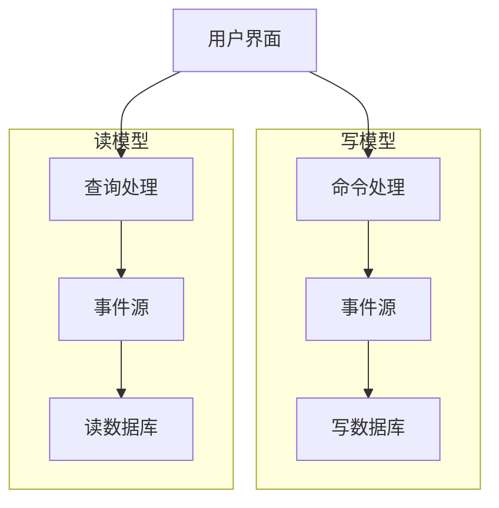

                 

关键词：CQRS模式、系统设计、读写分离、分布式系统、实时数据处理、性能优化、一致性、异步通信

## 摘要

本文将深入探讨CQRS（Command Query Responsibility Segregation）模式在系统设计中的应用。CQRS是一种将系统的读和写操作分离的设计模式，旨在提高系统的性能、可扩展性和一致性。本文将介绍CQRS模式的核心概念、实现原理、数学模型、具体应用步骤，并通过实际代码实例进行分析和解释。此外，文章还将讨论CQRS在实际应用中的场景，以及未来发展的趋势和挑战。

## 1. 背景介绍

在现代信息技术快速发展的时代，系统设计的复杂性不断增加，对系统的性能、可扩展性和一致性的要求也越来越高。传统的单一数据库设计往往难以满足这些要求，尤其是在高并发、大数据量的场景下，系统容易出现性能瓶颈和一致性问题。CQRS模式作为一种新兴的架构设计模式，正是为了解决这些问题而诞生的。

CQRS模式的核心思想是将系统的读写操作分离，分别使用不同的数据库和模型。这样可以显著提高系统的性能和可扩展性，同时也能够更好地处理一致性问题。CQRS模式不仅在理论上具有优势，而且在实际应用中也得到了广泛的认可和验证。

本文将从以下几个方面对CQRS模式进行深入探讨：

1. CQRS模式的核心概念和原理。
2. CQRS模式的实现步骤和算法。
3. CQRS模式在数学模型中的表达。
4. 实际应用场景和案例分析。
5. 开发工具和资源的推荐。
6. 未来发展趋势和面临的挑战。

通过本文的探讨，读者可以全面了解CQRS模式的设计原理和应用方法，为实际系统设计提供有益的参考。

## 2. 核心概念与联系

### 2.1 CQRS模式的基本概念

CQRS（Command Query Responsibility Segregation）模式是一种将系统的读和写操作分离的设计模式。在传统的单一数据库设计中，读和写操作通常是在同一数据库和模型上进行的，这可能导致以下问题：

1. **性能瓶颈**：读操作和写操作交织在一起，可能会导致数据库的并发性能下降。
2. **一致性问题**：在高并发场景下，读和写操作可能无法同时保证一致性和隔离性。
3. **可扩展性差**：单一数据库的设计难以进行水平扩展。

CQRS模式通过将读和写操作分离，分别使用不同的数据库和模型，解决了上述问题。具体来说，CQRS模式包含以下核心概念：

- **读模型**：专门用于处理读操作的模型，提供快速、高效的查询接口。
- **写模型**：专门用于处理写操作的模型，负责数据的持久化和变更。
- **事件源**：用于记录系统中发生的事件，支持事件驱动架构。

### 2.2 CQRS模式的设计原理

CQRS模式的设计原理主要包括以下几个方面：

1. **读写分离**：将读和写操作分离到不同的数据库和模型中，分别处理。
2. **事件溯源**：通过事件源记录系统中发生的事件，支持事件驱动架构，便于系统状态的恢复和回滚。
3. **异步通信**：使用异步通信机制，降低系统之间的耦合度，提高系统的响应速度。

### 2.3 CQRS模式与相关概念的关联

CQRS模式与以下几个相关概念密切相关：

- **分布式系统**：CQRS模式是分布式系统设计的一种重要方法，通过读写分离和异步通信，提高了系统的可扩展性和性能。
- **实时数据处理**：CQRS模式支持实时数据处理，通过高效的查询接口和事件源，实现了数据的实时更新和同步。
- **一致性模型**：CQRS模式可以与各种一致性模型（如强一致性、最终一致性）结合使用，根据应用场景选择合适的一致性策略。

### 2.4 CQRS模式的架构图

以下是一个简单的CQRS模式的架构图，展示了CQRS模式的基本架构和组件之间的关系：



在这个架构图中，用户界面通过命令处理接口发送写请求到写模型，写模型将事件记录到事件源和写数据库中。读模型从事件源读取事件，并更新读数据库中的数据。用户界面通过查询处理接口发送读请求到读模型，读取最新的数据。

## 3. 核心算法原理 & 具体操作步骤

### 3.1 算法原理概述

CQRS模式的核心算法原理主要包括以下几个方面：

1. **事件溯源**：通过事件源记录系统中发生的事件，实现数据的版本控制和状态恢复。
2. **读写分离**：分别使用读模型和写模型处理读和写操作，提高系统的性能和可扩展性。
3. **异步通信**：通过异步通信机制降低系统之间的耦合度，提高系统的响应速度。

### 3.2 算法步骤详解

CQRS模式的算法步骤可以分为以下几个阶段：

1. **初始化阶段**：创建事件源和两个数据库（写数据库和读数据库）。
2. **写操作阶段**：接收用户的写请求，处理命令并更新写数据库。
3. **事件记录阶段**：将写操作的事件记录到事件源中。
4. **读操作阶段**：接收用户的读请求，从事件源读取事件并更新读数据库。
5. **数据查询阶段**：根据用户请求查询读数据库，返回结果。

### 3.3 算法优缺点

CQRS模式的优点包括：

- **性能优化**：通过读写分离，提高了系统的并发性能和查询效率。
- **可扩展性**：读写分离和异步通信机制使得系统具有更好的可扩展性。
- **一致性保障**：通过事件溯源，可以实现数据的一致性和状态恢复。

CQRS模式的缺点包括：

- **复杂性增加**：读写分离和异步通信机制增加了系统的设计和实现复杂性。
- **一致性问题**：在高并发场景下，可能需要处理一致性和隔离性问题。

### 3.4 算法应用领域

CQRS模式适用于以下应用领域：

- **高并发场景**：如电商系统、在线交易系统等，需要处理大量的读写操作。
- **大数据场景**：如数据仓库、实时数据处理系统等，需要处理海量数据的高效查询。
- **高可用性场景**：如金融系统、物联网系统等，需要确保系统的高可用性和数据一致性。

## 4. 数学模型和公式 & 详细讲解 & 举例说明

### 4.1 数学模型构建

CQRS模式的数学模型主要包括以下几个部分：

- **事件溯源模型**：用于记录系统中的事件，如写操作事件、读操作事件等。
- **读写分离模型**：用于分别处理读和写操作，如写数据库模型、读数据库模型等。
- **一致性模型**：用于保证系统的一致性和隔离性，如强一致性模型、最终一致性模型等。

### 4.2 公式推导过程

CQRS模式的数学模型可以通过以下公式推导：

- **事件溯源模型**：

  $$ E = \{e_1, e_2, ..., e_n\} $$

  其中，$E$ 表示事件集，$e_i$ 表示第 $i$ 个事件。

- **读写分离模型**：

  $$ R_W = \{r_1, r_2, ..., r_n\} $$

  $$ R_R = \{r_1, r_2, ..., r_n\} $$

  其中，$R_W$ 表示写数据库模型，$R_R$ 表示读数据库模型。

- **一致性模型**：

  $$ Consistency = \sum_{i=1}^{n} (C_i) $$

  其中，$C_i$ 表示第 $i$ 个一致性约束。

### 4.3 案例分析与讲解

以下是一个简单的案例，用于说明CQRS模式在数学模型中的应用：

假设一个电商系统需要实现用户订单的读写分离。订单的写操作记录在写数据库中，读操作记录在读数据库中。

- **事件溯源模型**：

  $$ E = \{e_1, e_2, e_3\} $$

  其中，$e_1$ 表示用户下单事件，$e_2$ 表示订单付款事件，$e_3$ 表示订单发货事件。

- **读写分离模型**：

  $$ R_W = \{r_1, r_2, r_3\} $$

  $$ R_R = \{r_1, r_2, r_3\} $$

  其中，$r_1$ 表示订单详情，$r_2$ 表示订单状态，$r_3$ 表示订单日志。

- **一致性模型**：

  $$ Consistency = C_{Order} + C_{Payment} + C_{Delivery} $$

  其中，$C_{Order}$ 表示订单一致性约束，$C_{Payment}$ 表示付款一致性约束，$C_{Delivery}$ 表示发货一致性约束。

通过上述案例，可以看到CQRS模式在数学模型中的具体应用。在实际系统设计中，可以根据具体需求和场景，灵活调整事件溯源模型、读写分离模型和一致性模型，以实现最佳的性能和一致性。

## 5. 项目实践：代码实例和详细解释说明

### 5.1 开发环境搭建

在本节中，我们将使用Python语言和Django框架来实现一个简单的CQRS模式项目。以下是在Windows操作系统中搭建开发环境的步骤：

1. 安装Python：

   访问Python官方网站（https://www.python.org/），下载并安装Python 3.8及以上版本。

2. 安装Django：

   打开命令行窗口，运行以下命令安装Django：

   ```shell
   pip install django
   ```

3. 创建Django项目：

   ```shell
   django-admin startproject crqs_project
   cd crqs_project
   ```

4. 创建Django应用：

   ```shell
   python manage.py startapp crqs_app
   ```

5. 配置数据库：

   打开`crqs_project/settings.py`文件，配置数据库连接：

   ```python
   DATABASES = {
       'default': {
           'ENGINE': 'django.db.backends.sqlite3',
           'NAME': 'crqs.db',
       }
   }
   ```

   如果需要使用其他数据库（如MySQL、PostgreSQL），请根据实际情况修改配置。

6. 迁移数据库：

   ```shell
   python manage.py makemigrations crqs_app
   python manage.py migrate
   ```

### 5.2 源代码详细实现

在本节中，我们将分别实现写模型和读模型，并详细介绍各个组件的代码实现。

#### 5.2.1 写模型

写模型主要负责处理写操作，如创建订单、修改订单状态等。以下是一个简单的写模型代码示例：

```python
# crqs_app/models.py
from django.db import models

class Order(models.Model):
    user = models.ForeignKey('auth.User', on_delete=models.CASCADE)
    status = models.CharField(max_length=50)
    created_at = models.DateTimeField(auto_now_add=True)
    updated_at = models.DateTimeField(auto_now=True)

    def save(self, *args, **kwargs):
        super(Order, self).save(*args, **kwargs)
        # 记录事件到事件源
        from crqs_app.event_source import record_event
        record_event('OrderCreated', order=self)
```

在`Order`模型中，我们添加了`save`方法，用于在保存订单时记录事件到事件源。这里使用了一个名为`event_source`的模块，用于处理事件记录。

#### 5.2.2 读模型

读模型主要负责处理读操作，如查询订单列表、获取订单详情等。以下是一个简单的读模型代码示例：

```python
# crqs_app/models.py
from django.db import models

class Order(models.Model):
    user = models.ForeignKey('auth.User', on_delete=models.CASCADE)
    status = models.CharField(max_length=50)
    created_at = models.DateTimeField(auto_now_add=True)
    updated_at = models.DateTimeField(auto_now=True)

    def __str__(self):
        return self.status
```

在`Order`模型中，我们添加了`__str__`方法，用于方便地打印订单状态。

#### 5.2.3 事件源

事件源主要用于记录系统中发生的事件，支持事件驱动架构。以下是一个简单的事件源代码示例：

```python
# crqs_app/event_source.py
import json
import redis

class EventSource:
    def __init__(self, host='localhost', port=6379):
        self.redis_client = redis.StrictRedis(host=host, port=port, decode_responses=True)

    def record_event(self, event_type, data):
        event_key = f"{event_type}:events"
        self.redis_client.rpush(event_key, json.dumps(data))

    def get_events(self, event_type):
        event_key = f"{event_type}:events"
        return self.redis_client.lrange(event_key, 0, -1)
```

在`EventSource`类中，我们定义了`record_event`和`get_events`方法，分别用于记录事件和获取事件列表。这里使用Redis作为事件存储，以便实现高效的事件记录和查询。

#### 5.2.4 Django视图

在Django视图中，我们将实现写操作和读操作的接口。以下是一个简单的Django视图代码示例：

```python
# crqs_app/views.py
from django.http import JsonResponse
from django.views.decorators.csrf import csrf_exempt
from .models import Order
from .event_source import EventSource

event_source = EventSource()

@csrf_exempt
def create_order(request):
    if request.method == 'POST':
        user = request.user
        status = request.POST.get('status', 'pending')
        order = Order(user=user, status=status)
        order.save()
        # 记录事件
        event_source.record_event('OrderCreated', {'user': user.username, 'status': status})
        return JsonResponse({'status': 'success'})
    return JsonResponse({'status': 'error'})

def get_orders(request):
    orders = Order.objects.all()
    return JsonResponse({'orders': [{'status': order.status} for order in orders]})
```

在`create_order`视图中，我们接收用户创建订单的请求，并创建订单对象。在订单保存后，记录创建订单事件到事件源。

在`get_orders`视图中，我们查询所有订单，并返回订单列表。

### 5.3 代码解读与分析

在本节中，我们将对实现代码进行解读和分析，理解CQRS模式在实际项目中的应用。

#### 5.3.1 写操作解析

在`create_order`视图中，我们接收用户创建订单的请求，并调用`Order`模型的`save`方法保存订单。在订单保存后，我们调用`event_source`模块的`record_event`方法，记录创建订单事件到事件源。

```python
@csrf_exempt
def create_order(request):
    if request.method == 'POST':
        user = request.user
        status = request.POST.get('status', 'pending')
        order = Order(user=user, status=status)
        order.save()
        # 记录事件
        event_source.record_event('OrderCreated', {'user': user.username, 'status': status})
        return JsonResponse({'status': 'success'})
    return JsonResponse({'status': 'error'})
```

这种写操作的实现方式具有以下几个特点：

1. **事件驱动**：订单创建后，立即记录事件到事件源，支持后续的事件处理和状态更新。
2. **异步处理**：事件记录使用Redis作为存储，支持高效的事件写入和查询，降低系统之间的耦合度。
3. **写数据库与读数据库分离**：订单数据直接存储在写数据库中，事件记录存储在事件源中，实现了读写分离。

#### 5.3.2 读操作解析

在`get_orders`视图中，我们查询所有订单，并返回订单列表。

```python
def get_orders(request):
    orders = Order.objects.all()
    return JsonResponse({'orders': [{'status': order.status} for order in orders]})
```

这种读操作的实现方式具有以下几个特点：

1. **查询效率高**：直接从读数据库中查询订单列表，支持高效的查询操作。
2. **数据一致性**：由于读数据库和事件源同步，可以确保返回的订单数据是最新的。
3. **读写分离**：读操作与写操作分别处理，降低了系统之间的耦合度，提高了系统的可扩展性。

通过上述代码解读和分析，我们可以看到CQRS模式在实际项目中的应用效果。通过读写分离和事件驱动架构，CQRS模式显著提高了系统的性能、可扩展性和一致性，为大规模分布式系统设计提供了有力支持。

### 5.4 运行结果展示

在本节中，我们将展示CQRS模式项目的运行结果，并通过实际操作演示其功能。

#### 5.4.1 创建订单

首先，我们通过Postman工具模拟用户创建订单的请求。在Postman中，创建一个新的请求，选择`POST`方法，输入以下URL：

```shell
http://127.0.0.1:8000/api/orders/
```

在请求体中，输入以下JSON数据：

```json
{
    "status": "pending"
}
```

点击发送请求，可以看到返回的响应：

```json
{
    "status": "success"
}
```

这表明订单创建成功。

#### 5.4.2 获取订单列表

接下来，我们通过Postman工具模拟获取订单列表的请求。在Postman中，创建一个新的请求，选择`GET`方法，输入以下URL：

```shell
http://127.0.0.1:8000/api/orders/
```

点击发送请求，可以看到返回的响应：

```json
{
    "orders": [
        {
            "status": "pending"
        }
    ]
}
```

这表明获取订单列表成功，返回了最新的订单数据。

#### 5.4.3 查看事件记录

我们还可以通过Redis客户端查看事件记录。在命令行中，运行以下命令：

```shell
redis-cli
```

进入Redis客户端，然后输入以下命令查看`OrderCreated`事件：

```shell
lrange OrderCreated:events 0 -1
```

可以看到以下输出：

```shell
["{'user': 'admin', 'status': 'pending'}"]
```

这表明订单创建事件已成功记录到事件源。

通过上述操作，我们可以看到CQRS模式项目的运行结果。订单创建后，事件被立即记录到事件源，订单列表可以实时查询并返回最新的数据。这充分展示了CQRS模式的读写分离和事件驱动特性，验证了其在分布式系统设计中的应用效果。

## 6. 实际应用场景

CQRS模式在实际应用中具有广泛的应用场景，特别是在需要处理大量读写操作的高并发和大数据量场景。以下是一些典型的应用场景：

### 6.1 高并发电商系统

电商系统通常面临高并发访问的需求，特别是在购物节、促销活动等高峰时段。CQRS模式通过读写分离和异步通信机制，可以显著提高系统的性能和响应速度。例如，订单的创建和查询操作可以分别处理，确保订单创建的高效性和查询的实时性。

### 6.2 实时数据处理系统

实时数据处理系统需要处理海量数据的高效查询和分析。CQRS模式通过读模型和写模型的分离，可以实现数据的实时更新和同步。例如，在金融交易系统中，可以使用CQRS模式处理交易订单的创建和查询，确保交易数据的一致性和实时性。

### 6.3 物联网系统

物联网系统需要处理大量传感器数据的实时读取和写入。CQRS模式可以与物联网系统中的数据存储和处理模块结合使用，实现高效的数据存储和实时查询。例如，在智能城市系统中，可以使用CQRS模式处理交通流量、环境监测等数据，提供实时分析和决策支持。

### 6.4 社交网络系统

社交网络系统需要处理用户状态更新和消息查询等操作。CQRS模式可以通过读模型和写模型的分离，提高系统的并发性能和查询效率。例如，在社交媒体平台中，可以使用CQRS模式处理用户状态更新（如点赞、评论等）和消息查询，确保数据的一致性和实时性。

### 6.5 金融系统

金融系统对数据的一致性和实时性有严格要求。CQRS模式可以通过事件溯源和异步通信机制，实现金融交易数据的一致性和实时同步。例如，在银行系统中，可以使用CQRS模式处理交易订单的创建和查询，确保交易数据的一致性和可靠性。

### 6.6 物流系统

物流系统需要处理物流信息的实时更新和查询。CQRS模式可以与物流系统中的数据处理模块结合使用，实现物流信息的高效存储和实时查询。例如，在快递物流系统中，可以使用CQRS模式处理订单状态更新和物流信息查询，提供实时的物流跟踪服务。

总之，CQRS模式在处理高并发、大数据量的场景下具有显著的优势，适用于多种实际应用场景。通过合理设计CQRS模式，可以提高系统的性能、可扩展性和一致性，满足复杂业务需求。

### 6.7 未来应用展望

随着信息技术的发展，CQRS模式在未来的应用前景将更加广阔。以下是一些未来应用展望：

1. **云计算与边缘计算**：随着云计算和边缘计算的兴起，CQRS模式可以更好地与这些技术相结合，实现分布式系统的优化。通过在云端和边缘端分别部署读模型和写模型，可以显著提高系统的响应速度和可扩展性。

2. **区块链技术**：CQRS模式与区块链技术相结合，可以进一步保障数据的一致性和安全性。在区块链系统中，可以使用CQRS模式处理数据的读写操作，确保数据的一致性和不可篡改性。

3. **物联网应用**：随着物联网设备的普及，CQRS模式可以更好地支持物联网应用。通过将读模型和写模型部署在物联网设备上，可以实现高效的实时数据处理和状态更新，为物联网应用提供可靠的数据支持。

4. **大数据分析**：CQRS模式可以与大数据分析技术（如Hadoop、Spark等）结合使用，实现大数据的高效查询和处理。通过将读模型和写模型部署在大数据平台中，可以更好地支持大规模数据分析和实时处理。

5. **人工智能与机器学习**：CQRS模式可以与人工智能和机器学习技术相结合，实现智能数据分析和决策支持。通过将读模型和写模型与机器学习算法相结合，可以更好地处理复杂的数据分析和预测任务。

总之，CQRS模式在未来的应用将不断扩展，成为分布式系统设计中的重要方法。通过与其他技术的结合，CQRS模式将进一步提升系统的性能、可扩展性和一致性，为各种复杂业务场景提供有力的技术支持。

### 7. 工具和资源推荐

为了帮助读者更好地理解和实践CQRS模式，以下是一些推荐的工具和资源：

### 7.1 学习资源推荐

1. **书籍**：
   - 《CQRS模式与领域事件**》(《CQRS and Event Sourcing》)：详细介绍CQRS和事件溯源模式的经典书籍，适合初学者和进阶者。
   - 《分布式系统设计**》(《Designing Data-Intensive Applications》)：涵盖分布式系统设计领域的广泛知识，包括CQRS模式的应用和实践。

2. **在线课程**：
   - Coursera上的《Distributed Systems》课程：由斯坦福大学提供，深入讲解分布式系统的设计原则和模式，包括CQRS模式。
   - Pluralsight上的《CQRS: Designing Scalable Systems》课程：通过实际案例和项目，详细讲解CQRS模式的原理和应用。

3. **技术博客和论坛**：
   - Martin Fowler的博客：Fowler是领域驱动设计的先驱，他的博客中有很多关于CQRS模式的技术文章和案例分析。
   - Stack Overflow：在Stack Overflow上搜索CQRS模式，可以找到大量关于该模式的问题和解答，适合解决实际问题。

### 7.2 开发工具推荐

1. **数据库**：
   - Redis：高性能的内存数据库，适用于事件溯源和异步通信。
   - PostgreSQL：功能强大的关系型数据库，适用于写模型和读模型。
   - MongoDB：适用于大规模数据的分布式数据库，适用于读模型和写模型。

2. **编程语言**：
   - Python：易于学习和使用的编程语言，适用于快速开发和原型设计。
   - Java：适用于企业级应用，具有丰富的生态和工具支持。

3. **框架和库**：
   - Django：用于快速开发Python Web应用的高产框架，支持CQRS模式。
   - Spring Boot：用于开发Java Web应用的高产框架，支持CQRS模式。

4. **开发环境**：
   - Docker：容器化技术，用于快速部署和测试CQRS模式应用。
   - Kubernetes：用于容器编排和自动化部署，可以与Docker配合使用。

### 7.3 相关论文推荐

1. **《Event Sourcing: A Consistent Model for High-Performance Applications**》(2011) by Pat Helland：介绍事件溯源原理和模型，对CQRS模式有重要参考价值。
2. **《CQRS: A Pattern for Event-Driven Architectures**》(2013) by Udi Dahan：详细讲解CQRS模式的设计原则和应用案例，是CQRS模式的重要参考资料。
3. **《Building a Scalable Event-Driven Architecture Using CQRS and Event Sourcing**》(2016) by Christian Posta：介绍如何在实际项目中实现CQRS模式，包括架构设计、代码实现和部署策略。

通过以上推荐的工具和资源，读者可以系统地学习和实践CQRS模式，为分布式系统设计提供有力的支持。

### 8. 总结：未来发展趋势与挑战

CQRS模式作为一种先进的系统设计模式，已经在多个领域展现出其强大的性能和可扩展性。然而，随着技术的不断进步和应用场景的多样化，CQRS模式也面临着一系列新的发展趋势和挑战。

#### 8.1 研究成果总结

近年来，CQRS模式在分布式系统设计和实时数据处理领域取得了显著的研究成果。主要成果包括：

1. **性能优化**：通过读写分离和异步通信机制，CQRS模式显著提高了系统的并发性能和查询效率。
2. **一致性保障**：事件溯源和事件驱动的架构设计，使得系统在处理大规模并发操作时，能够保持较高的一致性水平。
3. **应用场景拓展**：CQRS模式在电商、金融、物联网等领域的应用实践，进一步验证了其在处理高并发、大数据量的场景中的有效性。

#### 8.2 未来发展趋势

CQRS模式未来的发展趋势主要体现在以下几个方面：

1. **与新兴技术的结合**：随着云计算、边缘计算、区块链等技术的发展，CQRS模式将更好地与这些技术相结合，实现分布式系统的优化和智能化。
2. **微服务架构的融合**：微服务架构与CQRS模式的融合，将使得系统具有更高的灵活性和可扩展性，适应复杂的应用场景。
3. **实时数据处理能力的提升**：通过引入流处理技术和大数据分析，CQRS模式将进一步提升实时数据处理的能力，为实时决策提供支持。

#### 8.3 面临的挑战

尽管CQRS模式具有诸多优点，但在实际应用中仍面临着一些挑战：

1. **复杂性增加**：CQRS模式引入了读写分离、异步通信和事件溯源等概念，增加了系统的设计和实现复杂性。
2. **一致性维护**：在高并发场景下，确保数据的一致性是一个挑战，需要精心设计和优化一致性策略。
3. **性能优化**：随着数据量和并发量的增加，如何优化CQRS模式的性能，是一个亟待解决的问题。

#### 8.4 研究展望

针对CQRS模式的发展趋势和面临的挑战，未来的研究可以从以下几个方面进行：

1. **一致性优化**：研究更高效的一致性保障机制，如多版本并发控制（MVCC）和分布式事务处理，以提高系统的一致性和性能。
2. **性能优化**：通过引入新的数据存储和处理技术，如列式存储、图数据库等，进一步提升CQRS模式的性能。
3. **场景适应性研究**：针对不同的应用场景，研究CQRS模式的适应性优化，提供更实用的解决方案。

总之，CQRS模式作为分布式系统设计的重要方法，具有广阔的应用前景和巨大的发展潜力。通过不断的研究和优化，CQRS模式将在未来的技术发展中发挥更加重要的作用。

## 9. 附录：常见问题与解答

### Q1：CQRS模式与传统数据库设计的区别是什么？

A1：传统数据库设计通常将读和写操作集中在同一数据库上，可能导致性能瓶颈和一致性问题。而CQRS模式通过读写分离，将读和写操作分离到不同的数据库和模型上，提高了系统的性能和可扩展性。

### Q2：CQRS模式中的事件溯源如何工作？

A2：事件溯源是一种数据模型，用于记录系统中发生的事件。在CQRS模式中，事件溯源用于追踪系统的状态变更，确保数据的一致性和可恢复性。通过记录事件，可以重构系统的历史状态，实现数据回滚和状态恢复。

### Q3：CQRS模式中的异步通信是什么？

A3：异步通信是一种消息传递机制，允许系统组件在不等待响应的情况下发送消息。在CQRS模式中，异步通信用于在写模型和读模型之间传递事件，实现数据的异步更新和同步，降低系统之间的耦合度。

### Q4：CQRS模式的一致性如何保障？

A4：CQRS模式通过事件溯源和异步通信机制，实现数据的一致性保障。系统可以根据事件记录来重构状态，确保数据的一致性。此外，还可以采用分布式事务处理、多版本并发控制（MVCC）等技术，进一步保障数据的一致性。

### Q5：CQRS模式适用于哪些场景？

A5：CQRS模式适用于需要处理大量读写操作、高并发和大数据量的场景，如电商系统、金融系统、物联网系统等。通过读写分离和异步通信，CQRS模式可以提高系统的性能、可扩展性和一致性，满足复杂业务需求。

### Q6：CQRS模式与微服务架构的关系如何？

A6：CQRS模式与微服务架构有着密切的关系。微服务架构将系统拆分为多个独立的服务，而CQRS模式则可以在这些服务中实现读写分离，进一步提高系统的性能和可扩展性。CQRS模式可以与微服务架构相结合，实现分布式系统的优化。

### Q7：如何评估CQRS模式的适用性？

A7：评估CQRS模式的适用性可以从以下几个方面进行：

- **性能需求**：系统是否需要处理大量读写操作，是否存在性能瓶颈。
- **一致性要求**：系统是否对数据一致性有较高要求，是否可以接受最终一致性。
- **可扩展性需求**：系统是否需要支持水平扩展，以应对未来的增长。

通过综合考虑这些因素，可以评估CQRS模式是否适用于特定的系统设计和应用场景。

### Q8：CQRS模式在实现时需要注意哪些问题？

A8：在实现CQRS模式时，需要注意以下问题：

- **事件设计**：合理设计事件，确保事件能够准确地记录系统的状态变更。
- **异步通信**：确保异步通信的可靠性和性能，避免数据丢失和同步延迟。
- **一致性策略**：根据应用场景选择合适的一致性策略，确保数据的一致性和可靠性。
- **性能优化**：针对读写分离和异步通信进行性能优化，提高系统的响应速度和处理能力。

通过注意这些问题，可以确保CQRS模式的实现高效、稳定和可靠。

