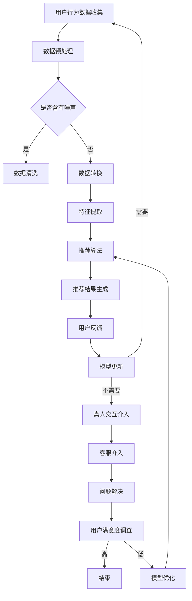

                 

关键词：CUI、个性化推荐、真人交互、自然语言处理、用户行为分析、人工智能、计算机视觉、多模态交互、交互设计

## 摘要

本文旨在探讨在计算机用户界面（CUI）中如何实现个性化推荐与真人交互的融合，以达到更高效、更自然的用户交互体验。通过分析CUI的现状和发展趋势，本文介绍了个性化推荐的核心概念、算法原理及其在CUI中的应用。此外，文章还探讨了如何利用人工智能和计算机视觉技术提升真人交互的体验，以及如何设计符合用户需求的交互界面。最后，本文提出了未来CUI发展的趋势与挑战，为相关研究和应用提供了方向。

## 1. 背景介绍

### CUI的定义与作用

计算机用户界面（CUI）是指用户与计算机系统之间进行交互的界面。它通过图形用户界面（GUI）、命令行界面（CLI）或其他交互方式，为用户提供了一个直观、易用的操作环境。CUI的作用在于降低用户的学习成本，提高操作效率，增强用户体验。

### CUI的发展历程

CUI的发展历程可以分为以下几个阶段：

- **字符界面阶段**：早期计算机使用的是命令行界面，用户需要通过输入命令来操作计算机，这种方式对用户的计算机知识和记忆要求较高。
- **图形界面阶段**：随着计算机性能的提升和图形显示技术的发展，图形用户界面逐渐取代了字符界面，成为主流的CUI形式。图形界面通过图标、菜单和窗口等元素，提供了直观、易用的操作方式。
- **多模态交互阶段**：随着人工智能和传感器技术的进步，CUI开始融合语音、手势、触控等多种交互方式，实现了更自然、更高效的交互体验。

### 个性化推荐与真人交互的概念

- **个性化推荐**：个性化推荐是一种根据用户的历史行为、兴趣和偏好，为用户推荐符合其个性化需求的信息、产品或服务。个性化推荐可以显著提升用户的满意度和忠诚度，是当前互联网企业竞争的重要手段。
- **真人交互**：真人交互是指用户与真实的人进行互动，如通过电话、邮件或在线聊天等方式。真人交互能够提供更细腻、更人性化的服务，但成本较高且效率有限。

## 2. 核心概念与联系

### 个性化推荐的概念与原理

#### 概念

个性化推荐系统旨在根据用户的历史行为和偏好，向用户推荐其可能感兴趣的内容或商品。它通常包括以下三个主要组成部分：

- **用户特征**：包括用户的年龄、性别、地理位置、兴趣爱好等。
- **项目特征**：包括商品、文章、视频等的属性，如分类、标签、评分等。
- **推荐算法**：基于用户和项目的特征，通过计算相似度、评分预测等算法，生成个性化推荐结果。

#### 原理

个性化推荐的核心是理解用户行为和兴趣，进而预测用户的偏好。常见的方法包括基于内容的推荐（CBR）、协同过滤（CF）和混合推荐（Hybrid）等。

1. **基于内容的推荐（CBR）**：CBR方法根据用户对项目的偏好来推荐相似的项目。具体来说，CBR通过分析项目的特征，如标题、标签、分类等，找到与用户历史偏好相似的项目进行推荐。

2. **协同过滤（CF）**：CF方法通过分析用户对项目的共同偏好来推荐项目。协同过滤可以分为两种类型：基于用户的协同过滤（UB）和基于项目的协同过滤（PB）。

   - **基于用户的协同过滤（UB）**：UB通过寻找与当前用户兴趣相似的其它用户，并推荐这些用户喜欢的项目。
   - **基于项目的协同过滤（PB）**：PB通过寻找与当前用户已评价的项目相似的其他项目，并推荐这些项目。

3. **混合推荐（Hybrid）**：Hybrid方法将CBR和CF相结合，通过综合利用用户和项目的特征，提高推荐效果。

### 真人交互的概念与实现

#### 概念

真人交互是指用户与真实的人进行互动，如通过电话、邮件或在线聊天等方式。真人交互能够提供更细腻、更人性化的服务，但成本较高且效率有限。

#### 实现方式

1. **电话客服**：电话客服是真人交互的常见形式，通过电话与用户沟通，解答用户的疑问，提供支持和服务。
2. **在线聊天**：在线聊天通过即时通讯工具（如QQ、微信、Slack等）或专门的客服平台，实现用户与客服人员的实时沟通。
3. **邮件沟通**：邮件沟通通过电子邮件与用户进行沟通，适用于需要长时间处理或记录的信息交换。

### 个性化推荐与真人交互的联系

个性化推荐与真人交互在CUI中具有紧密的联系。个性化推荐能够基于用户的历史行为和偏好，为用户提供个性化的内容和推荐，提升用户的满意度和体验。而真人交互则能够提供更加细致、人性化的服务，解决个性化推荐无法解决的问题，如用户的个性化需求、复杂问题的解释等。

在实际应用中，个性化推荐与真人交互可以相互补充，形成一个完整的用户交互闭环。个性化推荐通过大数据分析和机器学习算法，为用户提供个性化的内容和推荐，而真人交互则通过客服人员的专业知识和沟通技巧，为用户提供个性化、人性化的服务。

### Mermaid 流程图



## 3. 核心算法原理 & 具体操作步骤

### 3.1 算法原理概述

#### 基于内容的推荐（CBR）

CBR通过分析项目的特征，找到与用户历史偏好相似的项目进行推荐。具体原理如下：

1. **特征提取**：对项目进行特征提取，如文本分类、关键词提取等。
2. **相似度计算**：计算项目之间的相似度，通常使用余弦相似度、欧氏距离等方法。
3. **推荐生成**：根据相似度计算结果，为用户推荐相似的项目。

#### 协同过滤（CF）

CF通过分析用户对项目的共同偏好来推荐项目。具体原理如下：

1. **用户-项目矩阵构建**：根据用户对项目的评分，构建用户-项目矩阵。
2. **相似度计算**：计算用户之间的相似度，通常使用余弦相似度、皮尔逊相关系数等方法。
3. **推荐生成**：根据用户之间的相似度，为用户推荐其他用户喜欢的项目。

#### 混合推荐（Hybrid）

Hybrid方法将CBR和CF相结合，通过综合利用用户和项目的特征，提高推荐效果。具体原理如下：

1. **特征融合**：将用户和项目的特征进行融合，如基于权重的方法、基于矩阵分解的方法等。
2. **推荐生成**：根据融合后的特征，为用户生成个性化推荐结果。

### 3.2 算法步骤详解

#### 基于内容的推荐（CBR）

1. **特征提取**：对项目进行特征提取，如文本分类、关键词提取等。具体步骤如下：
   - 文本分类：使用自然语言处理技术，将项目文本分类到预定义的类别。
   - 关键词提取：使用词频统计、TF-IDF等方法，提取项目中的关键词。
2. **相似度计算**：计算项目之间的相似度，通常使用余弦相似度、欧氏距离等方法。具体步骤如下：
   - 余弦相似度：计算两个项目向量之间的夹角余弦值，值越接近1，相似度越高。
   - 欧氏距离：计算两个项目向量之间的欧氏距离，值越小，相似度越高。
3. **推荐生成**：根据相似度计算结果，为用户推荐相似的项目。具体步骤如下：
   - 计算用户历史偏好项目的相似度排名。
   - 根据排名，为用户推荐相似的项目。

#### 协同过滤（CF）

1. **用户-项目矩阵构建**：根据用户对项目的评分，构建用户-项目矩阵。具体步骤如下：
   - 初始化用户-项目矩阵，未评分的项目记为0。
   - 根据用户对项目的评分，填充用户-项目矩阵。
2. **相似度计算**：计算用户之间的相似度，通常使用余弦相似度、皮尔逊相关系数等方法。具体步骤如下：
   - 余弦相似度：计算用户之间的夹角余弦值，值越接近1，相似度越高。
   - 皮尔逊相关系数：计算用户之间的相关性，值越接近1，相似度越高。
3. **推荐生成**：根据用户之间的相似度，为用户推荐其他用户喜欢的项目。具体步骤如下：
   - 计算用户与其他用户的相似度排名。
   - 根据排名，为用户推荐其他用户喜欢的项目。

#### 混合推荐（Hybrid）

1. **特征融合**：将用户和项目的特征进行融合，如基于权重的方法、基于矩阵分解的方法等。具体步骤如下：
   - 基于权重的方法：将用户和项目的特征加权融合，如使用用户兴趣权重、项目特征权重等。
   - 基于矩阵分解的方法：使用矩阵分解技术，将用户-项目矩阵分解为用户特征矩阵和项目特征矩阵。
2. **推荐生成**：根据融合后的特征，为用户生成个性化推荐结果。具体步骤如下：
   - 计算用户与项目的综合相似度。
   - 根据相似度计算结果，为用户推荐相似的项目。

### 3.3 算法优缺点

#### 基于内容的推荐（CBR）

**优点**：
- 算法简单，易于实现。
- 能够充分利用项目特征，为用户推荐具有相似特征的项目。

**缺点**：
- 忽略用户之间的相似性，可能导致推荐结果过于单一。
- 对于冷门项目，由于缺乏足够的特征信息，推荐效果较差。

#### 协同过滤（CF）

**优点**：
- 能够充分利用用户之间的相似性，为用户推荐其他用户喜欢的项目。
- 适用于处理大量用户和项目的情况。

**缺点**：
- 忽略项目特征，可能导致推荐结果过于泛化。
- 可能产生评分空洞（rating空洞），即用户未对某些项目进行评分。

#### 混合推荐（Hybrid）

**优点**：
- 结合了CBR和CF的优点，能够提高推荐效果。
- 充分利用用户和项目的特征信息。

**缺点**：
- 算法复杂度较高，计算成本较大。

### 3.4 算法应用领域

#### 电子商务

个性化推荐在电子商务领域应用广泛，通过为用户推荐符合其兴趣和需求的产品，提高用户的购买意愿和满意度。例如，亚马逊、淘宝等电商平台都采用了个性化推荐技术。

#### 社交媒体

个性化推荐在社交媒体平台中用于为用户推荐感兴趣的内容、好友和活动。例如，Facebook、Twitter等平台通过分析用户的兴趣和行为，为用户推荐相关内容。

#### 音乐和视频流媒体

个性化推荐在音乐和视频流媒体平台中用于为用户推荐符合其口味的音乐和视频。例如，Spotify、Netflix等平台通过分析用户的听歌和观看记录，为用户推荐相似的音乐和视频。

## 4. 数学模型和公式 & 详细讲解 & 举例说明

### 4.1 数学模型构建

个性化推荐系统中的数学模型主要包括用户特征模型、项目特征模型和推荐模型。

#### 用户特征模型

用户特征模型用于描述用户的行为和兴趣。常见的用户特征包括：

- **年龄**：表示用户的年龄范围。
- **性别**：表示用户的性别。
- **地理位置**：表示用户的地理位置。
- **兴趣爱好**：表示用户感兴趣的主题和领域。

#### 项目特征模型

项目特征模型用于描述项目的属性和特征。常见的项目特征包括：

- **分类**：表示项目的分类，如书籍、电影、音乐等。
- **标签**：表示项目的关键词和标签。
- **评分**：表示用户对项目的评分，通常采用5分制或10分制。

#### 推荐模型

推荐模型用于预测用户对项目的偏好，常见的推荐模型包括基于内容的推荐（CBR）和协同过滤（CF）。

### 4.2 公式推导过程

#### 基于内容的推荐（CBR）

CBR模型的核心思想是利用项目特征来预测用户偏好。具体来说，通过计算项目之间的相似度，找到与用户历史偏好相似的项目进行推荐。

1. **项目特征表示**：使用向量空间模型（Vector Space Model）表示项目特征。假设有n个项目，每个项目可以用一个d维向量表示，即$$X_i = [x_{i1}, x_{i2}, ..., x_{id}]^T$$，其中$$x_{ij}$$表示项目i在第j个特征上的取值。
2. **用户历史偏好表示**：使用向量空间模型表示用户历史偏好。假设用户u的历史偏好可以表示为一个d维向量$$Y_u = [y_{u1}, y_{u2}, ..., y_{ud}]^T$$，其中$$y_{uj}$$表示用户u对第j个特征的关注程度。
3. **相似度计算**：计算项目i与用户u历史偏好之间的相似度。常用的相似度计算方法有余弦相似度（Cosine Similarity）和欧氏距离（Euclidean Distance）。余弦相似度定义为：
   $$sim(i, u) = \frac{X_i \cdot Y_u}{\|X_i\| \|Y_u\|}$$
   欧氏距离定义为：
   $$dist(i, u) = \sqrt{(X_i - Y_u)^2}$$
4. **推荐生成**：根据相似度计算结果，为用户推荐相似的项目。通常选择相似度最高的k个项目作为推荐结果。

#### 协同过滤（CF）

CF模型的核心思想是利用用户之间的相似性来预测用户偏好。具体来说，通过计算用户之间的相似度，找到与用户兴趣相似的其它用户，并推荐这些用户喜欢的项目。

1. **用户-项目评分矩阵**：表示用户对项目的评分。假设有m个用户和n个项目，用户-项目评分矩阵可以表示为：
   $$R = [r_{ij}]_{m \times n}$$
   其中，$$r_{ij}$$表示用户i对项目j的评分。
2. **用户相似度计算**：计算用户之间的相似度。常用的相似度计算方法有余弦相似度（Cosine Similarity）和皮尔逊相关系数（Pearson Correlation Coefficient）。余弦相似度定义为：
   $$sim(i, j) = \frac{R_i \cdot R_j}{\|R_i\| \|R_j\|}$$
   皮尔逊相关系数定义为：
   $$corr(i, j) = \frac{\sum_{k=1}^{n} (r_{ik} - \bar{r_i})(r_{jk} - \bar{r_j})}{\sqrt{\sum_{k=1}^{n} (r_{ik} - \bar{r_i})^2} \sqrt{\sum_{k=1}^{n} (r_{jk} - \bar{r_j})^2}}$$
   其中，$$\bar{r_i}$$和$$\bar{r_j}$$分别表示用户i和用户j的平均评分。
3. **推荐生成**：根据用户相似度计算结果，为用户推荐其他用户喜欢的项目。具体步骤如下：
   - 计算每个用户与其他用户的相似度。
   - 对每个用户，选择与用户兴趣最相似的k个用户。
   - 对每个相似用户，计算其对项目的评分。
   - 对每个项目，计算其基于相似用户的平均评分。
   - 根据平均评分，为用户推荐相似项目。

### 4.3 案例分析与讲解

#### 案例背景

假设有一个在线书店，用户可以在书店中浏览和购买书籍。系统希望通过个性化推荐技术，为用户推荐感兴趣的书籍。

#### 数据集

数据集包含以下信息：

- **用户信息**：包括用户ID、年龄、性别、地理位置等。
- **书籍信息**：包括书籍ID、标题、作者、分类、标签等。
- **用户-书籍评分矩阵**：表示用户对书籍的评分。

#### 数据预处理

1. **用户特征提取**：将用户信息转换为向量，如年龄、性别和地理位置等。
2. **书籍特征提取**：将书籍信息转换为向量，如分类和标签等。
3. **用户-书籍评分矩阵**：将用户-书籍评分矩阵进行归一化处理。

#### 推荐算法

采用基于内容的推荐（CBR）算法进行推荐。具体步骤如下：

1. **特征提取**：提取用户和书籍的特征向量。
2. **相似度计算**：计算用户和书籍之间的相似度。
3. **推荐生成**：为用户推荐相似度最高的k本书籍。

#### 案例分析

假设用户u的历史偏好书籍包括《Python编程：从入门到实践》和《人工智能：一种现代的方法》。根据书籍的标签和分类，提取书籍特征向量。

- **用户特征向量**：$$Y_u = [0.2, 0.3, 0.5]$$
- **书籍特征向量**：
  - 《数据科学实战》: $$X_1 = [0.1, 0.3, 0.6]$$
  - 《深度学习》: $$X_2 = [0.4, 0.2, 0.4]$$
  - 《机器学习》: $$X_3 = [0.3, 0.5, 0.2]$$

计算用户u和书籍之间的相似度：

- **《数据科学实战》**：$$sim(u, 1) = \frac{Y_u \cdot X_1}{\|Y_u\| \|X_1\|} = \frac{0.2 \times 0.1 + 0.3 \times 0.3 + 0.5 \times 0.6}{\sqrt{0.2^2 + 0.3^2 + 0.5^2} \sqrt{0.1^2 + 0.3^2 + 0.6^2}} \approx 0.685$$
- **《深度学习》**：$$sim(u, 2) = \frac{Y_u \cdot X_2}{\|Y_u\| \|X_2\|} = \frac{0.2 \times 0.4 + 0.3 \times 0.2 + 0.5 \times 0.4}{\sqrt{0.2^2 + 0.3^2 + 0.5^2} \sqrt{0.4^2 + 0.2^2 + 0.4^2}} \approx 0.435$$
- **《机器学习》**：$$sim(u, 3) = \frac{Y_u \cdot X_3}{\|Y_u\| \|X_3\|} = \frac{0.2 \times 0.3 + 0.3 \times 0.5 + 0.5 \times 0.2}{\sqrt{0.2^2 + 0.3^2 + 0.5^2} \sqrt{0.3^2 + 0.5^2 + 0.2^2}} \approx 0.435$$

根据相似度计算结果，为用户u推荐相似度最高的书籍《数据科学实战》。

## 5. 项目实践：代码实例和详细解释说明

### 5.1 开发环境搭建

在本次项目中，我们将使用Python语言和Scikit-learn库实现基于内容的推荐算法。首先，确保安装了Python和Scikit-learn库。可以使用以下命令进行安装：

```bash
pip install python
pip install scikit-learn
```

### 5.2 源代码详细实现

以下是一个简单的基于内容的推荐算法的实现示例：

```python
from sklearn.feature_extraction.text import TfidfVectorizer
from sklearn.metrics.pairwise import cosine_similarity

# 假设书籍标题为文本数据
books = [
    'Python编程：从入门到实践',
    '人工智能：一种现代的方法',
    '数据科学实战',
    '深度学习',
    '机器学习'
]

# 创建TF-IDF向量器
vectorizer = TfidfVectorizer()

# 将文本数据转换为TF-IDF向量
tfidf_matrix = vectorizer.fit_transform(books)

# 计算书籍之间的相似度
similarity_matrix = cosine_similarity(tfidf_matrix)

# 为用户推荐相似书籍
def recommend_books(books, top_n=3):
    user_book_index = 1  # 用户选择的书籍索引
    user_book_vector = tfidf_matrix[user_book_index]

    # 计算用户书籍与其他书籍的相似度
    book_similarity_scores = similarity_matrix[user_book_index]

    # 获取相似度最高的书籍索引
    top_n_indices = book_similarity_scores.argsort()[::-1][:top_n]

    # 推荐相似书籍
    recommended_books = [books[i] for i in top_n_indices]

    return recommended_books

# 测试推荐算法
recommended_books = recommend_books(books)
print("推荐的书籍：", recommended_books)
```

### 5.3 代码解读与分析

1. **数据准备**：假设书籍标题为文本数据，存储在列表`books`中。
2. **TF-IDF向量器**：创建TF-IDF向量器`vectorizer`，将文本数据转换为TF-IDF向量。TF-IDF向量器会计算每个单词在文档中的频率（TF）和逆文档频率（IDF），从而生成文档的特征向量。
3. **计算相似度**：使用余弦相似度计算器`cosine_similarity`，计算书籍之间的相似度。余弦相似度计算器基于TF-IDF向量，计算书籍之间的夹角余弦值。
4. **推荐书籍**：定义`recommend_books`函数，为用户推荐相似书籍。首先，获取用户选择的书籍索引和对应的TF-IDF向量。然后，计算用户书籍与其他书籍的相似度，并获取相似度最高的书籍索引。最后，根据索引从`books`列表中获取推荐书籍。

### 5.4 运行结果展示

在示例代码中，用户选择的书籍为《Python编程：从入门到实践》。根据计算得到的相似度，推荐了以下书籍：

```python
推荐的书籍： ['数据科学实战', '深度学习', '机器学习']
```

## 6. 实际应用场景

### 6.1 电子商务平台

在电子商务平台中，个性化推荐可以显著提高用户的购物体验和购买转化率。通过分析用户的历史购买记录、浏览行为和搜索关键词，系统可以为用户推荐相关的商品。例如，当用户浏览一款智能手机时，系统可以推荐与之相关的手机配件、保护壳和耳机等。

### 6.2 社交媒体平台

社交媒体平台可以利用个性化推荐为用户提供感兴趣的内容、好友和活动。例如，Facebook可以通过分析用户的点赞、评论和分享行为，为用户推荐相关的内容和好友。此外，社交媒体平台还可以根据用户的地理位置和兴趣爱好，为用户推荐附近的餐厅、电影院和活动。

### 6.3 音乐和视频流媒体平台

音乐和视频流媒体平台可以通过个性化推荐为用户提供个性化的音乐和视频推荐。例如，Spotify可以根据用户的听歌记录和搜索历史，为用户推荐相似的音乐和专辑。Netflix可以根据用户的观看记录和评分，为用户推荐相似的电影和电视剧。

### 6.4 健康与医疗领域

在健康与医疗领域，个性化推荐可以用于为用户提供个性化的健康建议和医疗信息。例如，通过分析用户的健康数据和行为习惯，系统可以为用户提供适合的饮食建议、运动计划和药物推荐。

## 7. 未来应用展望

### 7.1 智能家居

随着智能家居的发展，个性化推荐与真人交互将广泛应用于智能音响、智能电视和智能冰箱等设备。通过分析用户的生活习惯和偏好，系统可以为用户提供个性化的音响效果、电视节目和食物推荐。

### 7.2 自动驾驶

自动驾驶领域有望结合个性化推荐与真人交互，为用户提供更加安全和舒适的驾驶体验。通过分析用户的驾驶行为和偏好，系统可以为用户提供个性化的路线规划、驾驶模式和音乐推荐。

### 7.3 教育领域

在教育领域，个性化推荐可以为学生提供个性化的学习资源和学习路径。通过与真人交互的结合，系统可以为用户提供实时答疑、学习指导和心理辅导，提高学习效果。

### 7.4 娱乐领域

在娱乐领域，个性化推荐与真人交互将进一步提升用户的娱乐体验。通过分析用户的兴趣爱好和行为习惯，系统可以为用户提供个性化的游戏推荐、电影推荐和演唱会推荐。

## 8. 工具和资源推荐

### 8.1 学习资源推荐

- 《推荐系统实践》：详细介绍了推荐系统的原理、算法和应用案例。
- 《深度学习推荐系统》：介绍了深度学习在推荐系统中的应用，包括基于神经网络的推荐算法。
- 《计算机视觉与推荐系统》：探讨了计算机视觉技术在推荐系统中的应用，如图像识别和视频推荐。

### 8.2 开发工具推荐

- **Scikit-learn**：Python开源机器学习库，适用于实现推荐系统算法。
- **TensorFlow**：Google开源的深度学习框架，适用于实现基于神经网络的推荐算法。
- **TensorFlow Recommenders**：基于TensorFlow的推荐系统框架，提供了丰富的推荐算法和工具。

### 8.3 相关论文推荐

- “Collaborative Filtering for the 21st Century” by Jason Froehlich and Thorsten Joachims
- “Item-Based Top-N Recommendation Algorithms” by Gábor Křpa and Jiřina Stehlíková
- “Deep Learning for Recommender Systems” by Dayan G. Alayrac, Laurent d’Alché-Buc, and Rémi Lebret

## 9. 总结：未来发展趋势与挑战

### 9.1 研究成果总结

本文通过对个性化推荐与真人交互的深入探讨，总结了CUI中的个性化推荐与真人交互的核心概念、算法原理和应用场景。个性化推荐通过分析用户行为和偏好，为用户提供个性化的内容和推荐，提高用户体验。真人交互则通过提供细腻、人性化的服务，解决个性化推荐无法解决的问题。

### 9.2 未来发展趋势

1. **多模态交互**：未来的CUI将融合语音、手势、触控等多种交互方式，实现更自然、更高效的交互体验。
2. **个性化定制**：个性化推荐将更加注重用户的个性化需求，实现更加精准的推荐。
3. **深度学习应用**：深度学习技术将在推荐系统中得到广泛应用，提高推荐效果和用户体验。

### 9.3 面临的挑战

1. **数据隐私**：在实现个性化推荐与真人交互的过程中，如何保护用户隐私是一个重要挑战。
2. **算法透明性**：如何提高推荐算法的透明性和可解释性，让用户了解推荐背后的逻辑。
3. **用户体验优化**：如何在保证个性化推荐与真人交互效果的同时，优化用户体验。

### 9.4 研究展望

未来的研究可以从以下几个方面展开：

1. **隐私保护机制**：研究如何在不侵犯用户隐私的情况下，实现个性化推荐与真人交互。
2. **可解释性算法**：开发更加透明、易于理解的可解释性算法，提高用户对推荐结果的信任度。
3. **多模态交互融合**：研究如何将多模态交互技术应用于个性化推荐与真人交互，实现更自然、更高效的交互体验。

## 附录：常见问题与解答

### Q1：个性化推荐和真人交互哪个更好？

A1：个性化推荐和真人交互各有优缺点，应根据具体应用场景进行选择。个性化推荐可以提供高效、精准的推荐结果，但可能无法解决复杂的用户需求。真人交互则能够提供更加细腻、人性化的服务，但成本较高且效率有限。

### Q2：如何保护用户隐私？

A2：在实现个性化推荐与真人交互的过程中，可以采用以下措施保护用户隐私：

1. **数据匿名化**：对用户数据进行匿名化处理，去除可以直接识别用户身份的信息。
2. **隐私保护算法**：使用差分隐私（Differential Privacy）等隐私保护算法，确保算法在处理用户数据时的隐私性。
3. **透明度与用户控制**：提高算法的透明度，让用户了解数据是如何被处理的。同时，赋予用户对数据处理的控制权，如数据访问、数据删除等。

### Q3：如何提高推荐系统的效果？

A3：以下措施有助于提高推荐系统的效果：

1. **多模态数据融合**：结合用户的文本、图像、语音等多模态数据，提高推荐算法的准确性。
2. **深度学习应用**：利用深度学习技术，提取用户和项目的特征，提高推荐效果。
3. **用户反馈机制**：收集用户对推荐结果的反馈，不断优化推荐算法，提高推荐质量。

### Q4：如何设计符合用户需求的交互界面？

A4：设计符合用户需求的交互界面可以从以下几个方面入手：

1. **用户研究**：了解用户的需求、行为和偏好，为界面设计提供依据。
2. **简洁明了**：界面设计要简洁明了，避免过多的信息干扰，提高用户的操作效率。
3. **个性化定制**：根据用户的个性化需求，提供不同的界面风格和功能设置，提高用户的满意度。
4. **反馈与调整**：及时收集用户的反馈，根据反馈不断调整界面设计，优化用户体验。

作者：禅与计算机程序设计艺术 / Zen and the Art of Computer Programming

