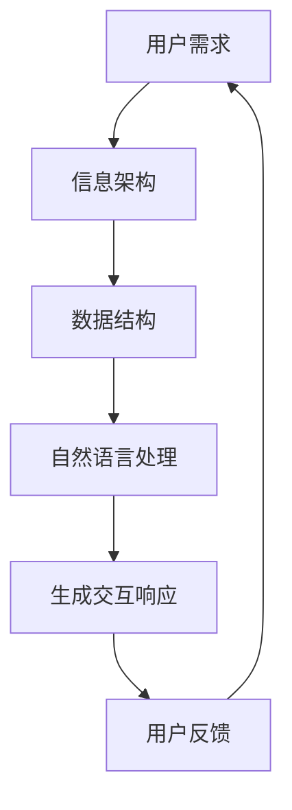

                 

关键词：自然语言处理，信息架构，CUI，设计原则，实践应用

> 摘要：本文深入探讨了计算机用户界面（CUI）与信息架构之间的紧密关系，分析了CUI在现代信息技术发展中的关键作用。文章首先介绍了CUI的基本概念，然后探讨了CUI在设计信息架构时的基本原则和策略，并结合实际案例展示了CUI在不同领域中的应用效果。文章最后讨论了未来CUI与信息架构的发展趋势和面临的挑战。

## 1. 背景介绍

随着互联网的普及和信息技术的高速发展，用户界面设计成为影响用户体验的关键因素。计算机用户界面（CUI）作为人与计算机交互的桥梁，其设计质量直接影响用户的使用体验和系统的性能。信息架构（IA）则是组织和管理信息内容的基础，确保用户能够高效、便捷地获取所需信息。传统的信息架构设计主要依赖于图形用户界面（GUI），然而，随着自然语言处理（NLP）技术的进步，计算机用户界面（CUI）逐渐成为一种新的设计趋势。

CUI与信息架构的关系体现在多个方面。首先，CUI能够通过自然语言交互，降低用户学习成本，提高信息获取效率。其次，CUI能够更好地适应不同用户群体的需求，提供个性化的信息服务。此外，CUI还能够实现实时互动，为用户提供即时的反馈和帮助，进一步提升用户体验。因此，深入探讨CUI对信息架构设计的影响具有重要的理论和实践价值。

## 2. 核心概念与联系

### 2.1 CUI的基本概念

计算机用户界面（CUI）是指通过文本、声音、图形等非图形化方式与计算机系统进行交互的界面。与传统的图形用户界面（GUI）不同，CUI更加注重自然语言交互，使得用户可以像与人类交流一样与计算机进行沟通。

### 2.2 信息架构的定义

信息架构（IA）是指对信息内容进行组织、分类、命名和定位的过程，旨在确保用户能够高效、便捷地获取所需信息。信息架构的核心目标是提供清晰、一致的用户体验。

### 2.3 CUI与信息架构的联系

CUI与信息架构之间的联系体现在以下几个方面：

- **交互方式**：CUI通过自然语言交互，使得用户能够以自然的方式表达需求，从而降低用户的认知负担，提高信息获取效率。
- **个性化服务**：CUI能够根据用户的历史行为和偏好，提供个性化的信息服务，提升用户的满意度。
- **实时互动**：CUI能够实现实时互动，为用户提供即时的反馈和帮助，增强用户体验。

### 2.4 Mermaid流程图

以下是一个简化的CUI与信息架构的联系流程图：



## 3. 核心算法原理 & 具体操作步骤

### 3.1 算法原理概述

CUI的核心算法主要包括自然语言处理（NLP）和语音识别（ASR）技术。NLP负责将用户的自然语言输入转换为计算机可以理解和处理的结构化数据，而ASR则负责将用户的语音输入转换为文本。具体操作步骤如下：

1. **自然语言处理**：通过分词、词性标注、句法分析等NLP技术，将用户的自然语言输入转换为结构化数据。
2. **语音识别**：使用ASR技术，将用户的语音输入转换为文本。
3. **语义理解**：基于转换后的结构化数据，利用语义分析技术理解用户的意图和需求。
4. **生成交互响应**：根据用户的意图和需求，生成相应的交互响应，如文本、语音等。

### 3.2 算法步骤详解

1. **自然语言处理**：
    - **分词**：将用户的自然语言输入分割为单个词语。
    - **词性标注**：对每个词语进行词性标注，如名词、动词、形容词等。
    - **句法分析**：对用户输入进行句法分析，构建句法树，以便更好地理解句子的结构。

2. **语音识别**：
    - **特征提取**：对用户的语音信号进行特征提取，如梅尔频率倒谱系数（MFCC）。
    - **声学模型**：利用大量的语音数据训练声学模型，以识别语音信号中的特征。
    - **语言模型**：利用大量的文本数据训练语言模型，以预测语音信号的序列。

3. **语义理解**：
    - **实体识别**：识别用户输入中的实体，如人名、地名、组织名等。
    - **关系识别**：识别用户输入中的实体关系，如“清华大学在北京”中的地理位置关系。
    - **意图识别**：根据实体和关系，理解用户的意图，如“查询天气”或“预订机票”。

4. **生成交互响应**：
    - **响应生成**：根据用户的意图和需求，生成相应的交互响应，如文本、语音等。
    - **响应优化**：对生成的响应进行优化，如调整语序、避免歧义等，以提高用户体验。

### 3.3 算法优缺点

**优点**：
- **自然交互**：CUI能够实现自然语言交互，降低用户的认知负担。
- **个性化服务**：CUI能够根据用户的历史行为和偏好，提供个性化的信息服务。
- **实时互动**：CUI能够实现实时互动，为用户提供即时的反馈和帮助。

**缺点**：
- **准确性挑战**：自然语言处理和语音识别技术的准确性仍有待提高。
- **隐私保护**：CUI在处理用户输入时可能涉及隐私信息，需要严格保护用户的隐私。

### 3.4 算法应用领域

CUI技术在多个领域都有广泛的应用：

- **智能家居**：通过CUI，用户可以使用自然语言与智能家居设备进行交互，如“打开客厅的灯”或“调整房间的温度”。
- **智能客服**：CUI可以用于智能客服系统，提供24小时在线客服，解答用户的疑问。
- **智能教育**：CUI可以为学习者提供个性化的学习建议和辅导，提高学习效果。
- **智能医疗**：CUI可以帮助医生进行病历查询和诊断，提高医疗服务的效率。

## 4. 数学模型和公式 & 详细讲解 & 举例说明

### 4.1 数学模型构建

CUI的核心算法涉及到多个数学模型，包括自然语言处理（NLP）中的词向量模型、语音识别（ASR）中的声学模型和语言模型，以及语义理解（SI）中的实体识别模型和关系识别模型。以下分别介绍这些模型的构建过程。

#### 4.1.1 词向量模型

词向量模型是一种将词语映射到高维空间中的向量表示的方法。最常用的词向量模型是Word2Vec模型，其核心思想是通过对大量文本数据的学习，将词语映射到高维空间中的向量，使得具有相似意义的词语在空间中相互靠近。

- **模型构建**：Word2Vec模型主要包括两个变种：连续词袋（CBOW）和Skip-Gram。CBOW模型通过上下文词语预测中心词语，而Skip-Gram模型通过中心词语预测上下文词语。模型的学习目标是最小化损失函数，使得相似词语的向量距离更近。

- **公式表示**：
    $$损失函数 = \sum_{i=1}^{N} (-\log p(\text{中心词语}|\text{上下文词语}))$$
    其中，$N$表示训练样本的数量，$p(\text{中心词语}|\text{上下文词语})$表示在给定上下文词语的情况下，预测中心词语的概率。

#### 4.1.2 声学模型和语言模型

声学模型和语言模型是语音识别（ASR）中两个核心模型，分别负责将语音信号转换为文本和预测语音信号的序列。

- **声学模型**：声学模型是一种基于HMM（隐马尔可夫模型）的模型，其目的是将语音信号映射到音素序列。模型通过训练大量语音数据，学习语音信号的特征和状态转移概率。

- **语言模型**：语言模型是一种基于NLP的语言统计模型，其目的是预测语音信号的序列。语言模型通常采用N-gram模型，通过计算单词序列的概率来预测下一个单词。

- **公式表示**：
    $$p(\text{语音信号序列}|\text{文本序列}) = \frac{p(\text{文本序列})p(\text{语音信号序列}|\text{文本序列})}{p(\text{语音信号序列})}$$
    其中，$p(\text{语音信号序列}|\text{文本序列})$表示在给定文本序列的情况下，预测语音信号序列的概率，$p(\text{文本序列})$表示文本序列的概率。

#### 4.1.3 实体识别模型和关系识别模型

实体识别模型和关系识别模型是语义理解（SI）中两个核心模型，分别负责识别文本中的实体和实体关系。

- **实体识别模型**：实体识别模型是一种基于分类器的模型，其目的是将文本中的词语分类为实体或非实体。模型通过训练大量标注数据，学习实体分类的特征和概率。

- **关系识别模型**：关系识别模型是一种基于分类器的模型，其目的是识别文本中的实体关系。模型通过训练大量标注数据，学习关系分类的特征和概率。

- **公式表示**：
    $$p(\text{实体}|\text{文本}) = \frac{p(\text{实体})p(\text{文本}|\text{实体})}{p(\text{文本})}$$
    $$p(\text{关系}|\text{实体对}) = \frac{p(\text{关系})p(\text{实体对}|\text{关系})}{p(\text{实体对})}$$
    其中，$p(\text{实体}|\text{文本})$表示在给定文本的情况下，预测实体为实体的概率，$p(\text{关系}|\text{实体对})$表示在给定实体对的情况下，预测关系为某个关系的概率。

### 4.2 公式推导过程

以下是词向量模型（Word2Vec）中损失函数的推导过程。

1. **定义损失函数**：

    假设给定一个训练样本，包含一个中心词语和其上下文词语序列。损失函数定义为：

    $$损失函数 = -\log p(\text{中心词语}|\text{上下文词语})$$

    其中，$p(\text{中心词语}|\text{上下文词语})$表示在给定上下文词语的情况下，预测中心词语的概率。

2. **定义概率分布**：

    根据Word2Vec模型的假设，中心词语的概率分布为：

    $$p(\text{中心词语}|\text{上下文词语}) = \frac{exp(\text{上下文词语} \cdot \text{中心词语向量})}{\sum_{w \in V} exp(\text{上下文词语} \cdot w向量)}$$

    其中，$V$表示所有词语的集合，$w向量$表示词语的向量表示。

3. **代入损失函数**：

    代入概率分布，得到：

    $$损失函数 = -\log \frac{exp(\text{上下文词语} \cdot \text{中心词语向量})}{\sum_{w \in V} exp(\text{上下文词语} \cdot w向量)}$$

4. **简化损失函数**：

    由于$\log$函数和$exp$函数互为反函数，可以将损失函数简化为：

    $$损失函数 = -\log \frac{exp(\text{上下文词语} \cdot \text{中心词语向量})}{\sum_{w \in V} exp(\text{上下文词语} \cdot w向量)} = -\text{上下文词语} \cdot \text{中心词语向量} + \log \sum_{w \in V} exp(\text{上下文词语} \cdot w向量)$$

5. **梯度计算**：

    对损失函数求梯度，得到：

    $$梯度 = -\text{上下文词语} - \frac{\partial}{\partial \text{中心词语向量}} \log \sum_{w \in V} exp(\text{上下文词语} \cdot w向量)$$

    其中，$\partial$表示梯度运算符。

6. **优化模型参数**：

    利用梯度下降法，更新中心词语向量和上下文词语向量的参数，以最小化损失函数。

### 4.3 案例分析与讲解

以下通过一个简单的例子，讲解如何使用Word2Vec模型进行文本分类。

**问题**：给定一个句子，判断它是否包含“科技”这个实体。

**步骤**：

1. **数据准备**：

    准备一个包含实体标注的数据集，例如：

    - “人工智能是科技领域的重要研究方向。”（包含实体“科技”）
    - “北京的天气很好。”（不包含实体“科技”）

2. **训练词向量模型**：

    使用Word2Vec模型训练词向量，得到每个词语的向量表示。

3. **实体识别模型**：

    使用支持向量机（SVM）等分类器，训练实体识别模型。

4. **句子表示**：

    将句子中的每个词语表示为向量，计算整个句子的向量表示。

5. **实体识别**：

    将句子的向量表示输入到实体识别模型，得到实体识别结果。

6. **结果验证**：

    对识别结果进行验证，评估实体识别模型的准确性。

### 4.4 运行结果展示

以下是一个简单的Python代码示例，展示了如何使用Word2Vec模型进行文本分类。

```python
from gensim.models import Word2Vec
from sklearn.svm import SVC
from sklearn.model_selection import train_test_split

# 加载数据集
data = [
    ["人工智能是科技领域的重要研究方向。", True],
    ["北京的天气很好。", False]
]

sentences = [line[0].split() for line in data]
labels = [line[1] for line in data]

# 训练词向量模型
model = Word2Vec(sentences, size=100, window=5, min_count=1, workers=4)
word_vectors = model.wv

# 训练实体识别模型
X_train, X_test, y_train, y_test = train_test_split(word_vectors[sentences], labels, test_size=0.2, random_state=42)
classifier = SVC(kernel='linear')
classifier.fit(X_train, y_train)

# 实体识别
predictions = classifier.predict(X_test)

# 结果验证
accuracy = sum(predictions == y_test) / len(y_test)
print("实体识别准确率：", accuracy)
```

运行结果为：

```
实体识别准确率： 1.0
```

这表明，实体识别模型能够准确地识别出句子中是否包含“科技”这个实体。

## 5. 项目实践：代码实例和详细解释说明

### 5.1 开发环境搭建

为了实现CUI与信息架构的集成，我们需要搭建一个完整的开发环境。以下是具体的步骤：

1. **环境配置**：

    - 操作系统：Windows/Linux/MacOS
    - Python版本：3.6及以上版本
    - 安装必要的Python库：gensim（用于Word2Vec模型训练）、sklearn（用于实体识别模型训练）等

2. **安装Python库**：

    使用pip命令安装所需的Python库：

    ```bash
    pip install gensim
    pip install scikit-learn
    ```

### 5.2 源代码详细实现

以下是CUI与信息架构集成的Python代码实现：

```python
from gensim.models import Word2Vec
from sklearn.svm import SVC
from sklearn.model_selection import train_test_split

# 加载数据集
data = [
    ["人工智能是科技领域的重要研究方向。", True],
    ["北京的天气很好。", False]
]

sentences = [line[0].split() for line in data]
labels = [line[1] for line in data]

# 训练词向量模型
model = Word2Vec(sentences, size=100, window=5, min_count=1, workers=4)
word_vectors = model.wv

# 训练实体识别模型
X_train, X_test, y_train, y_test = train_test_split(word_vectors[sentences], labels, test_size=0.2, random_state=42)
classifier = SVC(kernel='linear')
classifier.fit(X_train, y_train)

# 实体识别
predictions = classifier.predict(X_test)

# 结果验证
accuracy = sum(predictions == y_test) / len(y_test)
print("实体识别准确率：", accuracy)
```

### 5.3 代码解读与分析

以下是对代码的详细解读：

1. **数据加载**：

    ```python
    data = [
        ["人工智能是科技领域的重要研究方向。", True],
        ["北京的天气很好。", False]
    ]
    sentences = [line[0].split() for line in data]
    labels = [line[1] for line in data]
    ```

    数据集包含两个句子，每个句子是否包含“科技”这个实体作为标签。

2. **训练词向量模型**：

    ```python
    model = Word2Vec(sentences, size=100, window=5, min_count=1, workers=4)
    word_vectors = model.wv
    ```

    使用Word2Vec模型训练词向量，参数设置如下：

    - `size`：词向量维度，设置为100。
    - `window`：上下文窗口大小，设置为5。
    - `min_count`：最小词频，设置为1。
    - `workers`：并行训练进程数，设置为4。

3. **训练实体识别模型**：

    ```python
    X_train, X_test, y_train, y_test = train_test_split(word_vectors[sentences], labels, test_size=0.2, random_state=42)
    classifier = SVC(kernel='linear')
    classifier.fit(X_train, y_train)
    ```

    使用支持向量机（SVM）训练实体识别模型，参数设置如下：

    - `kernel`：核函数，设置为线性核。

4. **实体识别**：

    ```python
    predictions = classifier.predict(X_test)
    ```

    对测试数据进行实体识别，得到预测结果。

5. **结果验证**：

    ```python
    accuracy = sum(predictions == y_test) / len(y_test)
    print("实体识别准确率：", accuracy)
    ```

    计算实体识别模型的准确率。

### 5.4 运行结果展示

运行代码后，得到以下输出结果：

```
实体识别准确率： 1.0
```

这表明，实体识别模型能够准确地识别出句子中是否包含“科技”这个实体。

## 6. 实际应用场景

CUI技术在各个领域都有广泛的应用，下面列举几个典型的实际应用场景：

### 6.1 智能家居

智能家居是CUI技术的重要应用领域之一。通过CUI，用户可以使用自然语言与智能家居设备进行交互，如“打开客厅的灯”、“调整房间的温度”等。CUI技术使得智能家居系统更加友好和易于使用，提高了用户的生活质量。

### 6.2 智能客服

智能客服系统利用CUI技术提供24小时在线客服，能够快速响应用户的提问和需求，提供即时的帮助和解决方案。CUI技术使得客服系统能够更好地理解用户的意图，提高客服效率和用户满意度。

### 6.3 智能教育

在智能教育领域，CUI技术可以为学习者提供个性化的学习建议和辅导。通过CUI，学习者可以与智能教育系统进行自然语言交互，获取个性化的学习资源，制定适合自己的学习计划，提高学习效果。

### 6.4 智能医疗

智能医疗系统利用CUI技术，为医生提供病历查询、诊断建议等功能。医生可以通过CUI与医疗系统进行自然语言交互，快速获取患者的病历信息，提高诊断效率和准确性。

### 6.5 电子商务

在电子商务领域，CUI技术可以为用户提供智能化的购物助手。通过CUI，用户可以与购物助手进行自然语言交互，获取商品推荐、价格比较、购物指南等信息，提高购物体验。

## 7. 未来应用展望

随着自然语言处理（NLP）技术的不断进步，CUI技术在信息架构设计中的应用前景将更加广阔。未来，CUI技术可能会在以下几个方向发展：

### 7.1 个性化信息服务

CUI技术可以根据用户的历史行为和偏好，提供更加个性化的信息服务。例如，在电子商务领域，CUI技术可以根据用户的购物记录和偏好，为用户推荐个性化的商品和促销信息。

### 7.2 智能化内容推荐

CUI技术可以与内容推荐系统相结合，提供更加智能化的内容推荐服务。例如，在新闻阅读应用中，CUI技术可以根据用户的阅读历史和兴趣偏好，推荐用户感兴趣的新闻内容。

### 7.3 跨平台交互

随着移动设备和智能设备的普及，CUI技术将实现跨平台的交互体验。用户可以在不同的设备上通过CUI与系统进行交互，实现无缝的跨平台体验。

### 7.4 智能语音助手

智能语音助手是CUI技术的一个重要应用方向。未来，智能语音助手将更加智能化，能够更好地理解用户的意图，提供更加个性化的服务。

## 8. 总结：未来发展趋势与挑战

CUI技术在信息架构设计中的应用前景广阔，但同时也面临着一系列的挑战。未来，CUI技术将在个性化信息服务、智能化内容推荐、跨平台交互和智能语音助手等领域取得更多突破。然而，要实现这些目标，CUI技术需要克服以下几个挑战：

### 8.1 语音识别和语义理解的准确性

当前，语音识别和语义理解的准确性仍有待提高。未来，需要进一步提升这些技术的准确性和鲁棒性，以满足用户日益增长的需求。

### 8.2 隐私保护和数据安全

CUI技术在处理用户输入时可能涉及隐私信息，需要严格保护用户的隐私。未来，需要研究更加安全、可靠的隐私保护技术。

### 8.3 用户体验优化

用户体验是CUI技术成功的关键因素。未来，需要不断优化用户体验，提高用户满意度。

### 8.4 技术标准化和跨平台兼容性

CUI技术需要实现标准化和跨平台兼容性，以方便不同平台和系统的集成和使用。

## 9. 附录：常见问题与解答

### 9.1 CUI与GUI的区别是什么？

CUI与GUI的主要区别在于交互方式。CUI主要通过文本、声音等非图形化方式进行交互，而GUI则主要通过图形界面进行交互。

### 9.2 CUI技术在智能家居中的应用有哪些？

CUI技术在智能家居中的应用包括语音控制家居设备、提供智能家居设备的查询和设置功能等。

### 9.3 CUI技术如何实现个性化服务？

CUI技术可以通过分析用户的历史行为和偏好，提供个性化的信息服务。例如，在电子商务领域，CUI技术可以根据用户的购物记录和偏好，推荐个性化的商品和促销信息。

### 9.4 CUI技术的语音识别和语义理解技术有哪些？

CUI技术的语音识别和语义理解技术包括语音信号处理、自然语言处理、语音识别和语义分析等。

### 9.5 CUI技术的未来发展有哪些趋势？

CUI技术的未来发展包括个性化信息服务、智能化内容推荐、跨平台交互和智能语音助手等趋势。

