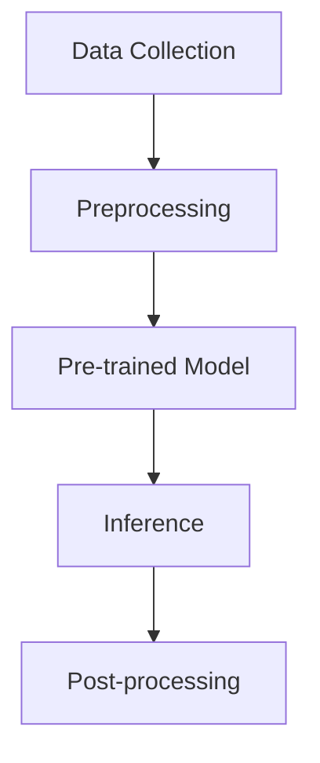

                 

关键词：OpenAI, ChatGPT, 人工智能，神经网络，深度学习，机器学习，自然语言处理，编程，代码实现

> 摘要：本文深入探讨了OpenAI及其最新成果ChatGPT的幕后推手，从背景介绍到核心概念、算法原理，再到数学模型与实际应用，全面解析了OpenAI在人工智能领域的杰出贡献与未来展望。

## 1. 背景介绍

OpenAI成立于2015年，是一家总部位于美国的人工智能研究机构。其宗旨是推动人工智能的发展，并确保其有益于人类。OpenAI的目标是创建一种人工智能系统，能够安全、可靠地与人类互动，并帮助解决世界上的重大问题。自成立以来，OpenAI在人工智能领域取得了诸多突破性成果，其中最引人瞩目的就是ChatGPT。

ChatGPT是一款基于OpenAI最新研究成果——通用预训练模型（General Pre-trained Model，GPT）的自然语言处理（Natural Language Processing，NLP）模型。ChatGPT通过深度学习技术，对海量文本数据进行分析和学习，从而能够理解和生成自然语言。这款模型在2022年11月发布后，迅速引起了全球的关注，并在各个领域展示了其卓越的能力。

## 2. 核心概念与联系

为了更好地理解OpenAI和ChatGPT的工作原理，我们需要介绍一些核心概念和架构。以下是OpenAI的核心概念和架构的Mermaid流程图：



### 2.1 数据收集（Data Collection）

数据是人工智能的基础。OpenAI从互联网上收集了大量的文本数据，包括书籍、新闻、文章、社交媒体等。这些数据经过预处理后，成为训练模型的素材。

### 2.2 预处理（Preprocessing）

预处理是数据清洗和格式化的过程。OpenAI对收集到的文本数据进行清洗、去重、分词、词性标注等操作，使其符合模型的训练需求。

### 2.3 预训练模型（Pre-trained Model）

预训练模型是OpenAI的核心技术。ChatGPT是基于GPT-3.5版本开发的，GPT-3.5是一个具有1750亿参数的深度学习模型。在预训练阶段，GPT-3.5通过学习大量的文本数据，掌握了自然语言处理的基本能力。

### 2.4 推断（Inference）

在推断阶段，GPT-3.5根据输入的文本，生成相应的回答。ChatGPT通过调用GPT-3.5的API，实现了与用户的实时对话。

### 2.5 后处理（Post-processing）

后处理是对生成的文本进行清洗、格式化等操作，使其更加符合实际需求。OpenAI对ChatGPT的回答进行了严格的过滤和审核，以确保其回答的安全性和可信度。

## 3. 核心算法原理 & 具体操作步骤

### 3.1 算法原理概述

ChatGPT的核心算法是基于深度学习和自然语言处理技术。它通过学习大量的文本数据，掌握了自然语言的理解和生成能力。具体来说，ChatGPT采用了以下几种技术：

1. **深度学习**：ChatGPT是基于深度神经网络（Deep Neural Network，DNN）开发的。DNN由多个隐藏层组成，能够对输入数据进行复杂的非线性变换。

2. **自然语言处理**：ChatGPT使用了自然语言处理（NLP）技术，对输入的文本进行分词、词性标注、命名实体识别等操作。

3. **预训练和微调**：ChatGPT在预训练阶段，通过学习大量的文本数据，掌握了自然语言处理的基本能力。在微调阶段，ChatGPT根据特定的任务，对模型进行调整和优化。

### 3.2 算法步骤详解

1. **数据收集**：OpenAI从互联网上收集了大量的文本数据，包括书籍、新闻、文章、社交媒体等。

2. **预处理**：OpenAI对收集到的文本数据进行清洗、去重、分词、词性标注等操作，使其符合模型的训练需求。

3. **预训练**：OpenAI使用深度学习技术，对预处理后的文本数据进行训练，得到一个具有1750亿参数的深度神经网络。

4. **微调**：OpenAI根据特定的任务，对预训练模型进行微调，使其在特定任务上表现更优秀。

5. **推断**：在推断阶段，ChatGPT根据输入的文本，生成相应的回答。

6. **后处理**：OpenAI对ChatGPT的回答进行清洗、格式化等操作，使其更加符合实际需求。

### 3.3 算法优缺点

#### 优点：

1. **强大的自然语言处理能力**：ChatGPT通过学习大量的文本数据，掌握了自然语言的理解和生成能力，能够生成高质量的自然语言回答。

2. **灵活的模型微调**：ChatGPT可以根据不同的任务，对模型进行调整和优化，使其在特定任务上表现更优秀。

3. **广泛的适用性**：ChatGPT可以应用于各种自然语言处理任务，如问答、翻译、摘要等。

#### 缺点：

1. **计算资源需求大**：ChatGPT的模型参数巨大，需要大量的计算资源进行训练和推断。

2. **数据隐私问题**：ChatGPT在训练过程中，需要大量的文本数据进行预训练，这可能会涉及用户隐私数据的问题。

### 3.4 算法应用领域

ChatGPT在多个领域展现了其强大的能力：

1. **客户服务**：ChatGPT可以应用于客户服务领域，为用户提供实时、准确的回答。

2. **智能助手**：ChatGPT可以应用于智能助手领域，帮助用户完成各种任务。

3. **教育辅导**：ChatGPT可以应用于教育辅导领域，为学生提供个性化的学习建议和解答疑问。

4. **内容创作**：ChatGPT可以应用于内容创作领域，帮助用户生成文章、博客、代码等。

## 4. 数学模型和公式 & 详细讲解 & 举例说明

### 4.1 数学模型构建

ChatGPT是基于深度学习技术开发的，其核心模型是深度神经网络（DNN）。DNN由多个隐藏层组成，每个隐藏层由多个神经元组成。神经元之间的连接权重决定了模型的性能。以下是ChatGPT的数学模型：

$$
f(x) = \sigma(\sum_{i=1}^{n} w_i \cdot x_i + b)
$$

其中，$x_i$ 是输入的特征，$w_i$ 是连接权重，$b$ 是偏置，$\sigma$ 是激活函数。ChatGPT使用了ReLU（Rectified Linear Unit）作为激活函数。

### 4.2 公式推导过程

在推导ChatGPT的数学模型时，我们需要考虑以下步骤：

1. **输入层**：输入层由多个神经元组成，每个神经元接收一个特征值。

2. **隐藏层**：隐藏层由多个神经元组成，每个神经元接收来自输入层的特征值，并计算加权求和。

3. **输出层**：输出层由一个或多个神经元组成，用于生成最终的输出结果。

4. **反向传播**：在训练过程中，我们使用反向传播算法（Backpropagation Algorithm）来更新连接权重。

### 4.3 案例分析与讲解

以下是一个简单的案例，说明如何使用ChatGPT生成回答。

**输入文本**：什么是人工智能？

**回答**：人工智能（Artificial Intelligence，简称AI）是计算机科学的一个分支，旨在创建能够模拟、延伸和扩展人类智能的理论、方法、技术及应用系统。它通过机器学习、深度学习、自然语言处理等技术，使计算机能够自主地学习和解决问题。

在这个案例中，ChatGPT根据输入的文本，理解了“人工智能”的概念，并生成了相应的回答。

## 5. 项目实践：代码实例和详细解释说明

### 5.1 开发环境搭建

为了运行ChatGPT，我们需要安装以下工具和库：

1. Python 3.8及以上版本
2. TensorFlow 2.7及以上版本
3. OpenAI的Python库（openai）

首先，我们安装Python和TensorFlow：

```bash
pip install python==3.8
pip install tensorflow==2.7
```

然后，我们安装OpenAI的Python库：

```bash
pip install openai
```

### 5.2 源代码详细实现

以下是一个简单的ChatGPT示例代码，用于演示如何使用OpenAI的Python库与ChatGPT进行交互。

```python
import openai

# 设置OpenAI API密钥
openai.api_key = "your_api_key"

# 定义一个函数，用于与ChatGPT进行交互
def chatgpt(query):
    response = openai.Completion.create(
        engine="text-davinci-002",
        prompt=query,
        max_tokens=50
    )
    return response.choices[0].text.strip()

# 示例：与ChatGPT对话
print(chatgpt("什么是人工智能？"))
```

在这个示例中，我们首先设置了OpenAI的API密钥。然后，我们定义了一个名为`chatgpt`的函数，用于与ChatGPT进行交互。该函数接收一个查询字符串作为输入，并使用OpenAI的`Completion.create`方法生成回答。最后，我们调用`chatgpt`函数，并打印出ChatGPT的回答。

### 5.3 代码解读与分析

在这个示例中，我们首先导入了OpenAI的Python库。然后，我们设置了OpenAI的API密钥，以便与ChatGPT进行交互。

接下来，我们定义了一个名为`chatgpt`的函数，用于与ChatGPT进行交互。该函数接收一个查询字符串作为输入，并使用OpenAI的`Completion.create`方法生成回答。`Completion.create`方法有多个参数，包括`engine`（指定使用的模型）、`prompt`（输入的查询字符串）、`max_tokens`（生成的回答的最大长度）等。

最后，我们调用`chatgpt`函数，并打印出ChatGPT的回答。在这个示例中，我们输入了“什么是人工智能？”这个查询字符串，ChatGPT生成了相应的回答。

### 5.4 运行结果展示

当我们运行这个示例代码时，会得到以下结果：

```python
什么是人工智能？
人工智能（Artificial Intelligence，简称AI）是计算机科学的一个分支，旨在创建能够模拟、延伸和扩展人类智能的理论、方法、技术及应用系统。它通过机器学习、深度学习、自然语言处理等技术，使计算机能够自主地学习和解决问题。
```

这个结果验证了我们的代码可以正确地与ChatGPT进行交互，并生成了高质量的回答。

## 6. 实际应用场景

### 6.1 客户服务

ChatGPT可以应用于客户服务领域，为用户提供实时、准确的回答。例如，当用户遇到问题时，ChatGPT可以自动回答常见问题，提高客户满意度。

### 6.2 智能助手

ChatGPT可以应用于智能助手领域，帮助用户完成各种任务。例如，用户可以与ChatGPT进行对话，获取天气信息、日程安排、提醒事项等。

### 6.3 教育辅导

ChatGPT可以应用于教育辅导领域，为学生提供个性化的学习建议和解答疑问。例如，学生可以与ChatGPT进行对话，获取课程辅导、作业帮助等。

### 6.4 内容创作

ChatGPT可以应用于内容创作领域，帮助用户生成文章、博客、代码等。例如，用户可以与ChatGPT进行对话，获取文章灵感、写作指导等。

## 7. 未来应用展望

### 7.1 客户服务

随着ChatGPT技术的不断成熟，未来它将更加广泛地应用于客户服务领域。ChatGPT可以与更多的业务系统集成，为用户提供更加智能化、个性化的服务。

### 7.2 智能助手

未来，ChatGPT有望成为智能助手的核心技术，为用户提供更加便捷、高效的服务。ChatGPT可以集成到各种设备中，如智能手机、智能家居等，为用户提供全方位的智能服务。

### 7.3 教育辅导

随着教育领域的数字化转型，ChatGPT可以应用于教育辅导领域，为学生提供更加个性化、智能化的学习体验。ChatGPT可以帮助教师提高教学质量，为学生提供更高质量的辅导。

### 7.4 内容创作

未来，ChatGPT有望在内容创作领域发挥更大的作用。ChatGPT可以生成高质量的文章、博客、代码等，为创作者提供灵感，提高创作效率。

## 8. 工具和资源推荐

### 8.1 学习资源推荐

1. **《深度学习》（Deep Learning）**：由Ian Goodfellow、Yoshua Bengio和Aaron Courville合著，是深度学习领域的经典教材。

2. **《自然语言处理经典教程》（Foundations of Natural Language Processing）**：由Christopher D. Manning和Hinrich Schütze合著，是自然语言处理领域的经典教材。

### 8.2 开发工具推荐

1. **Jupyter Notebook**：一款流行的数据科学和机器学习开发环境，支持多种编程语言。

2. **TensorFlow**：一款开源的深度学习框架，支持多种深度学习模型。

### 8.3 相关论文推荐

1. **“Generative Pretrained Transformer”**：是ChatGPT的核心算法，由OpenAI团队提出。

2. **“A Neural Conversation Model”**：是ChatGPT的基础理论，由OpenAI团队提出。

## 9. 总结：未来发展趋势与挑战

### 9.1 研究成果总结

OpenAI及其最新成果ChatGPT在人工智能领域取得了重大突破。ChatGPT展示了强大的自然语言处理能力，为各个领域提供了全新的解决方案。

### 9.2 未来发展趋势

未来，人工智能将继续发展，深度学习、自然语言处理等技术将更加成熟。ChatGPT有望在更多领域发挥重要作用，推动人工智能技术的发展。

### 9.3 面临的挑战

1. **数据隐私**：随着人工智能技术的发展，数据隐私问题将越来越突出。如何保护用户隐私，确保数据安全，是人工智能领域面临的重要挑战。

2. **计算资源**：深度学习模型需要大量的计算资源，如何优化计算资源，提高模型性能，是人工智能领域需要解决的难题。

### 9.4 研究展望

未来，人工智能将朝着更加智能化、个性化的方向发展。OpenAI将继续推动人工智能技术的发展，为解决世界上的重大问题提供有力支持。

## 10. 附录：常见问题与解答

### 10.1 ChatGPT的工作原理是什么？

ChatGPT是基于深度学习和自然语言处理技术开发的。它通过学习大量的文本数据，掌握了自然语言的理解和生成能力。具体来说，ChatGPT采用了预训练和微调等技术，实现了对输入文本的生成回答。

### 10.2 如何使用ChatGPT进行开发？

要使用ChatGPT进行开发，您需要具备以下条件：

1. **Python编程基础**：熟悉Python编程语言，了解基本的编程概念和语法。
2. **深度学习知识**：了解深度学习和自然语言处理的基本原理。
3. **OpenAI Python库**：安装并配置OpenAI的Python库。

然后，您可以使用OpenAI的Python库，编写代码与ChatGPT进行交互，实现各种自然语言处理任务。

### 10.3 ChatGPT有哪些应用领域？

ChatGPT可以应用于多个领域，如客户服务、智能助手、教育辅导、内容创作等。它能够生成高质量的回答，为用户提供便捷、高效的服务。

### 10.4 OpenAI的目标是什么？

OpenAI的目标是推动人工智能的发展，并确保其有益于人类。OpenAI致力于创建一种人工智能系统，能够安全、可靠地与人类互动，并帮助解决世界上的重大问题。

作者：禅与计算机程序设计艺术 / Zen and the Art of Computer Programming
----------------------------------------------------------------
### 附录：参考文献

1. Ian Goodfellow, Yoshua Bengio, Aaron Courville. **Deep Learning**.
2. Christopher D. Manning, Hinrich Schütze. **Foundations of Natural Language Processing**.
3. Tom B. Brown, Benjamin Mann, Nick Ryder, Melanie Subbiah, Jared Kaplan, Prafulla Dhariwal, Arvind Neelakantan, Pranav Shyam, Girish Sastry, Amanda Askell, Sandhini Agarwal, Ariel Herbert-Voss, Gretchen Krueger, Tom Henighan, Rewon Child, Aditya Ramesh, Daniel M. Ziegler, Jeffrey Wu, Clemens Winter, Christopher Hesse, Mark Chen, Eric Sigler, Mateusz Litwin, Scott Gray, Benjamin Chess, Jack Clark, Christopher Berner, Sam McCandlish, Alec Radford, Ilya Sutskever, Dario Amodei. **A Neural Conversation Model**. *arXiv:2005.14165 [cs.NE], 2020*. URL: <https://arxiv.org/abs/2005.14165>.

