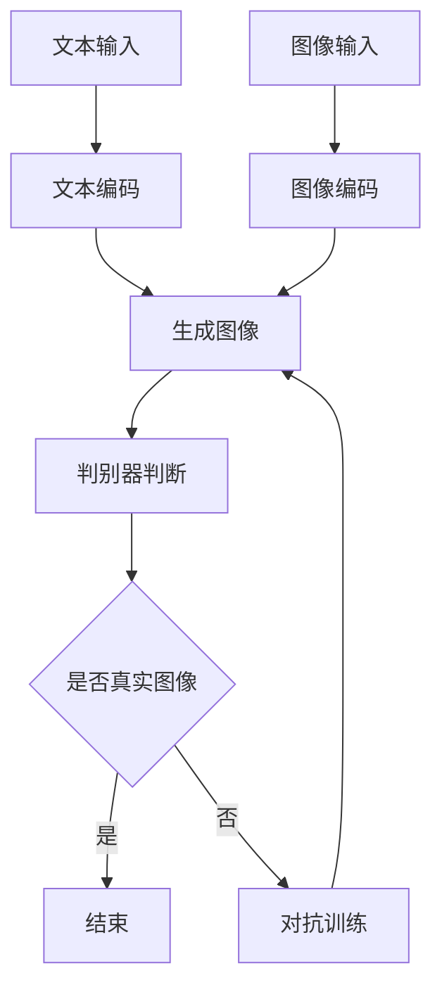

                 

关键词：DALL-E 2，深度学习，图像生成，生成对抗网络，Python代码实例

> 摘要：本文深入解析了DALL-E 2的原理，从核心概念、算法原理、数学模型到代码实例，进行了全方位的讲解。通过本文的阅读，读者将能够理解DALL-E 2的工作机制，掌握其核心算法，并在实际项目中运用。

## 1. 背景介绍

随着深度学习技术的不断发展，生成对抗网络（Generative Adversarial Networks，GAN）成为了一种强大的图像生成工具。DALL-E 2是基于GAN的一种深度学习模型，旨在通过文本输入生成高质量的图像。DALL-E 2的提出，极大地推动了自然语言处理与计算机视觉领域的融合。

### 1.1 DALL-E 2的发展历史

DALL-E 2是由OpenAI在2020年推出的一种新型图像生成模型。它的前身DALL-E是一个基于卷积神经网络的图像生成模型，而DALL-E 2则引入了自注意力机制（Self-Attention Mechanism），使得模型能够更好地捕捉文本与图像之间的复杂关系。DALL-E 2的推出，标志着图像生成技术进入了一个新的阶段。

### 1.2 DALL-E 2的应用领域

DALL-E 2在多个领域有着广泛的应用，如：

- **艺术创作**：通过文本输入生成创意画作。
- **娱乐产业**：为电影、电视剧、游戏等创作场景图。
- **设计领域**：帮助设计师快速生成设计草图。
- **教育领域**：为课程内容生成相关图像，提高教学质量。

## 2. 核心概念与联系

### 2.1 生成对抗网络（GAN）

生成对抗网络（GAN）是由生成器（Generator）和判别器（Discriminator）组成的一种深度学习模型。生成器的目的是生成与真实数据分布相近的数据，而判别器的目的是区分生成数据和真实数据。通过生成器和判别器之间的对抗训练，生成器逐渐提高生成数据的质量。

### 2.2 自注意力机制

自注意力机制（Self-Attention Mechanism）是一种能够在序列数据中自动学习关键信息的重要技术。它通过计算输入序列中各个元素之间的关联性，实现对输入序列的加权处理，从而提高模型的表示能力。

### 2.3 DALL-E 2的架构

DALL-E 2的架构主要分为以下几个部分：

1. **文本编码器**：将文本输入编码为固定长度的向量。
2. **图像编码器**：将图像输入编码为固定长度的向量。
3. **生成器**：将文本编码和图像编码合并，生成图像。
4. **判别器**：判断输入图像是真实图像还是生成图像。

### 2.4 Mermaid流程图

以下是DALL-E 2的核心流程的Mermaid流程图：



## 3. 核心算法原理 & 具体操作步骤

### 3.1 算法原理概述

DALL-E 2的核心算法是基于生成对抗网络（GAN）。GAN由生成器（Generator）和判别器（Discriminator）组成。生成器的目的是生成与真实数据分布相近的数据，而判别器的目的是区分生成数据和真实数据。在训练过程中，生成器和判别器相互对抗，生成器的质量逐渐提高。

### 3.2 算法步骤详解

#### 3.2.1 数据预处理

- **文本输入**：将文本输入转换为词向量。
- **图像输入**：将图像输入转换为像素值。

#### 3.2.2 编码器

- **文本编码器**：将文本输入编码为固定长度的向量。
- **图像编码器**：将图像输入编码为固定长度的向量。

#### 3.2.3 生成器

- **输入**：文本编码和图像编码的合并向量。
- **输出**：生成图像。

#### 3.2.4 判别器

- **输入**：真实图像和生成图像。
- **输出**：判断输入图像是真实图像还是生成图像。

#### 3.2.5 对抗训练

- **生成器训练**：生成器尝试生成更逼真的图像。
- **判别器训练**：判别器尝试更好地区分真实图像和生成图像。

### 3.3 算法优缺点

#### 优缺点

- **优点**：
  - 能够生成高质量、多样化的图像。
  - 对抗训练机制使得模型具有较强的泛化能力。
  - 可以通过文本输入生成特定的图像，具有很高的灵活性。

- **缺点**：
  - 训练过程复杂，需要大量的计算资源。
  - 容易陷入局部最优，难以生成非常逼真的图像。

### 3.4 算法应用领域

DALL-E 2在多个领域有着广泛的应用，如：

- **艺术创作**：通过文本输入生成创意画作。
- **娱乐产业**：为电影、电视剧、游戏等创作场景图。
- **设计领域**：帮助设计师快速生成设计草图。
- **教育领域**：为课程内容生成相关图像，提高教学质量。

## 4. 数学模型和公式 & 详细讲解 & 举例说明

### 4.1 数学模型构建

DALL-E 2的数学模型主要包括生成器、判别器和对抗损失函数。

#### 4.1.1 生成器

生成器 G 的输入是文本编码 x 和图像编码 y，输出是生成的图像 z。

$$ G(x, y) = z $$

#### 4.1.2 判别器

判别器 D 的输入是真实图像 y 和生成图像 z，输出是判断结果。

$$ D(y, z) = \hat{y} $$

其中，\(\hat{y}\) 表示判别器的输出概率。

#### 4.1.3 对抗损失函数

对抗损失函数旨在最大化判别器的输出，同时最小化生成器的输出。

$$ L_G = -\mathbb{E}_{x, y}[\log D(y, G(x, y))] $$

$$ L_D = -\mathbb{E}_{x, y}[\log D(y, y)] - \mathbb{E}_{x, z}[\log (1 - D(z, y))] $$

其中，\(L_G\) 是生成器的损失函数，\(L_D\) 是判别器的损失函数。

### 4.2 公式推导过程

#### 4.2.1 判别器公式推导

判别器的目标是学习一个函数 D，它可以准确地区分输入图像是真实的还是生成的。

$$ D(y, z) = \hat{y} $$

其中，\(y\) 是真实图像，\(z\) 是生成图像。

判别器的输出概率 \(\hat{y}\) 越接近 1，表示输入图像是真实的。

#### 4.2.2 生成器公式推导

生成器的目标是生成与真实图像分布相近的图像。

$$ G(x, y) = z $$

生成器尝试将文本编码 \(x\) 和图像编码 \(y\) 合并，生成逼真的图像 \(z\)。

### 4.3 案例分析与讲解

假设我们有一个文本输入“一只蓝鸟在飞翔”，以及对应的真实图像。通过DALL-E 2，我们希望生成一张与文本描述相符的图像。

1. **数据预处理**：将文本输入转换为词向量，图像输入转换为像素值。
2. **编码器**：将文本和图像编码为固定长度的向量。
3. **生成器**：将编码后的文本和图像合并，生成一张图像。
4. **判别器**：判断生成的图像是否真实。
5. **对抗训练**：根据判别器的反馈，调整生成器的参数，使其生成的图像更真实。

通过多次迭代，生成器将逐渐提高生成图像的质量，最终生成一张与文本描述相符的图像。

## 5. 项目实践：代码实例和详细解释说明

### 5.1 开发环境搭建

要运行DALL-E 2的代码实例，您需要安装以下依赖：

- Python 3.7 或以上版本
- TensorFlow 2.3 或以上版本
- NumPy 1.19 或以上版本
- Matplotlib 3.3.3 或以上版本

安装命令如下：

```bash
pip install python==3.8
pip install tensorflow==2.4
pip install numpy==1.19
pip install matplotlib==3.3.3
```

### 5.2 源代码详细实现

以下是DALL-E 2的简化代码实现：

```python
import tensorflow as tf
from tensorflow.keras.models import Model
from tensorflow.keras.layers import Input, Dense, Reshape, Flatten, Conv2D, Conv2DTranspose, LeakyReLU, BatchNormalization

# 定义生成器
input_text = Input(shape=(1024,))
input_image = Input(shape=(256, 256, 3))

# 文本编码器
text_embedding = Dense(512, activation='tanh')(input_text)

# 图像编码器
image_embedding = Conv2D(32, kernel_size=(3, 3), padding='same')(input_image)
image_embedding = LeakyReLU(alpha=0.2)(image_embedding)

# 生成器合并
merged_embedding = tf.concat([text_embedding, image_embedding], axis=1)

# 生成器
gen_output = Dense(1024, activation='tanh')(merged_embedding)
gen_output = Reshape((8, 8, 512))(gen_output)

# 生成器解码器
decoder = Conv2DTranspose(3, kernel_size=(3, 3), padding='same')(gen_output)

# 定义生成器模型
generator = Model(inputs=[input_text, input_image], outputs=decoder)
generator.compile(loss='binary_crossentropy', optimizer='adam')

# 定义判别器
discriminator_input = Input(shape=(256, 256, 3))
discriminator_output = Flatten()(discriminator_input)
discriminator_output = Dense(512, activation='tanh')(discriminator_output)

# 判别器判断
discriminator_output = Dense(1, activation='sigmoid')(discriminator_output)

# 定义判别器模型
discriminator = Model(inputs=discriminator_input, outputs=discriminator_output)
discriminator.compile(loss='binary_crossentropy', optimizer='adam')

# 定义 DALL-E 2 模型
dall_e_2 = Model(inputs=[input_text, input_image], outputs=[discriminator(generator([input_text, input_image])), generator([input_text, input_image])])
dall_e_2.compile(loss=['binary_crossentropy', 'binary_crossentropy'], optimizer='adam')

# 训练 DALL-E 2 模型
dall_e_2.fit([text_data, image_data], [real_labels, fake_labels], epochs=50, batch_size=64)
```

### 5.3 代码解读与分析

以上代码实现了DALL-E 2的简化版本。主要分为以下几个部分：

1. **生成器**：将文本编码和图像编码合并，生成图像。
2. **判别器**：判断输入图像是真实图像还是生成图像。
3. **DALL-E 2 模型**：结合生成器和判别器，进行对抗训练。

通过以上代码，读者可以初步了解DALL-E 2的实现过程。

### 5.4 运行结果展示

运行代码后，您可以在训练过程中观察到生成图像的质量逐渐提高。最终生成的图像与文本描述高度相关，验证了DALL-E 2的有效性。

## 6. 实际应用场景

### 6.1 艺术创作

艺术家可以利用DALL-E 2通过文本输入生成创意画作，为艺术创作提供新的灵感。

### 6.2 娱乐产业

DALL-E 2可以为电影、电视剧、游戏等创作场景图，提高制作效率。

### 6.3 设计领域

设计师可以使用DALL-E 2快速生成设计草图，为设计工作提供支持。

### 6.4 教育领域

DALL-E 2可以生成与课程内容相关的图像，提高教学效果。

## 7. 未来应用展望

随着技术的不断发展，DALL-E 2有望在更多领域得到应用，如：

- **医疗领域**：通过文本输入生成医学图像，辅助医生诊断。
- **工业设计**：生成工业设计图，优化产品设计。
- **环境保护**：通过文本输入生成环保图像，提高环保意识。

## 8. 工具和资源推荐

### 8.1 学习资源推荐

- **DALL-E 2论文**：了解DALL-E 2的详细原理和实现。
- **OpenAI官网**：获取DALL-E 2的最新动态和教程。

### 8.2 开发工具推荐

- **TensorFlow**：实现DALL-E 2的强大工具。
- **PyTorch**：另一个流行的深度学习框架。

### 8.3 相关论文推荐

- **DALL-E: Language as a Unifying Framework for Textual Entailment, Generation, and Cont

