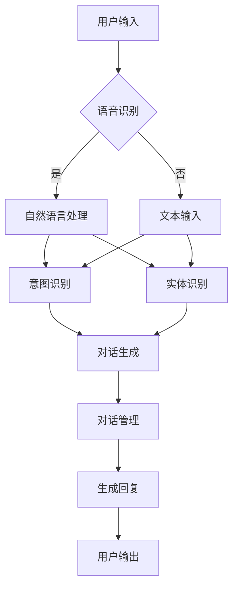

                 

关键词：对话系统、自然语言处理、聊天机器人、交互设计、技术实现、算法原理、代码实例、NLP、深度学习、语音识别、语义理解、人机交互

> 摘要：本文将深入探讨对话系统的原理及其技术实现，通过详细的代码实例讲解，帮助读者理解对话系统的核心算法和应用场景。本文将涵盖对话系统的基本概念、核心算法原理、数学模型、项目实践以及未来应用展望。

## 1. 背景介绍

对话系统（Dialogue Systems），也被称为聊天机器人或虚拟助手，是近年来人工智能领域的一个重要研究方向。随着自然语言处理（NLP）、深度学习、语音识别等技术的发展，对话系统逐渐成为智能交互的重要形式，广泛应用于客服、教育、医疗、智能家居等领域。

对话系统的主要目标是实现人与机器之间的自然语言交互，从而提供高效、便捷的服务。其核心功能包括语音识别、语义理解、对话生成和对话管理。语音识别技术将用户的语音转化为文本，语义理解技术则解析文本中的意图和实体，对话生成技术根据解析结果生成响应，对话管理技术则负责维护对话的连贯性和上下文。

本文将围绕对话系统的基本原理和技术实现，详细介绍其核心算法、数学模型和项目实践，并探讨其未来发展方向。

## 2. 核心概念与联系

### 2.1. 对话系统基本架构

对话系统的基本架构可以分为以下几个模块：

1. **语音识别（Speech Recognition）**：将语音信号转换为文本。
2. **自然语言处理（NLP）**：对文本进行语义分析，提取意图和实体。
3. **对话生成（Dialogue Generation）**：根据解析结果生成自然语言的回复。
4. **对话管理（Dialogue Management）**：维护对话的上下文和连贯性。

### 2.2. 核心概念原理

- **语音识别**：基于深度学习技术的自动语音识别系统，如Google的DeepSpeech和百度AI平台的ASR服务。
- **自然语言处理（NLP）**：涉及词性标注、句法分析、命名实体识别、情感分析等技术。
- **对话生成**：基于序列到序列（Seq2Seq）模型或生成对抗网络（GAN）等深度学习技术。
- **对话管理**：涉及状态机、图结构模型、神经网络等方法。

### 2.3. Mermaid流程图

下面是对话系统基本架构的Mermaid流程图：



## 3. 核心算法原理 & 具体操作步骤

### 3.1 算法原理概述

对话系统的核心算法主要包括语音识别、自然语言处理、对话生成和对话管理。以下是各算法的基本原理：

- **语音识别**：基于深度神经网络（DNN）和循环神经网络（RNN）等技术，将语音信号转换为文本。
- **自然语言处理（NLP）**：利用词嵌入、卷积神经网络（CNN）和长短期记忆网络（LSTM）等技术，对文本进行语义分析，提取意图和实体。
- **对话生成**：采用序列到序列（Seq2Seq）模型、注意力机制和生成对抗网络（GAN）等技术，生成自然语言的回复。
- **对话管理**：利用状态机、图结构模型和神经网络等技术，维护对话的上下文和连贯性。

### 3.2 算法步骤详解

#### 3.2.1 语音识别

1. **特征提取**：对输入的语音信号进行预处理，提取音频特征。
2. **声学模型**：训练深度神经网络，将音频特征映射到文本。
3. **语言模型**：训练神经网络，将文本映射到概率分布。
4. **解码**：通过解码器将音频特征转换为文本。

#### 3.2.2 自然语言处理（NLP）

1. **词嵌入**：将文本转化为向量化表示。
2. **词性标注**：识别文本中每个词的词性。
3. **句法分析**：分析文本的句法结构。
4. **命名实体识别**：识别文本中的实体。
5. **情感分析**：分析文本的情感倾向。

#### 3.2.3 对话生成

1. **编码器**：将输入的文本编码为向量。
2. **解码器**：生成响应文本的解码过程。
3. **注意力机制**：在生成过程中关注输入文本的不同部分。
4. **生成对抗网络（GAN）**：通过对抗训练生成高质量的自然语言回复。

#### 3.2.4 对话管理

1. **状态机**：定义对话的状态转移规则。
2. **图结构模型**：利用图结构表示对话上下文。
3. **神经网络**：训练神经网络预测对话状态转移。

### 3.3 算法优缺点

- **语音识别**：优点是方便用户使用，缺点是识别准确率受噪声影响较大。
- **自然语言处理（NLP）**：优点是能处理复杂的语义信息，缺点是训练过程复杂，对数据依赖性较大。
- **对话生成**：优点是能生成高质量的文本回复，缺点是生成文本的多样性和连贯性有待提高。
- **对话管理**：优点是能维护对话的连贯性和上下文，缺点是状态转移规则难以制定，对对话复杂性处理能力有限。

### 3.4 算法应用领域

对话系统广泛应用于多个领域，如：

- **客服**：自动回答用户问题，降低人工成本。
- **教育**：为学生提供个性化的学习指导和反馈。
- **医疗**：辅助医生进行病历管理和患者咨询。
- **智能家居**：与智能家居设备进行自然语言交互。

## 4. 数学模型和公式 & 详细讲解 & 举例说明

### 4.1 数学模型构建

对话系统的数学模型主要包括：

- **语音识别模型**：基于HMM（隐马尔可夫模型）和DNN（深度神经网络）。
- **NLP模型**：基于词嵌入、CNN（卷积神经网络）和LSTM（长短期记忆网络）。
- **对话生成模型**：基于Seq2Seq模型、注意力机制和GAN。
- **对话管理模型**：基于状态机、图结构模型和神经网络。

### 4.2 公式推导过程

- **语音识别模型**：

  $$ P(O|A) = \prod_{t=1}^{T} P(o_t|a_t) $$

  其中，$O$ 表示观察序列，$A$ 表示隐藏状态序列，$P(O|A)$ 表示观察序列在隐藏状态序列下的概率。

- **NLP模型**：

  $$ \text{Word Embedding} = \text{W} \cdot \text{Input Vector} $$

  其中，$\text{W}$ 表示词嵌入矩阵，$\text{Input Vector}$ 表示输入向量化表示。

- **对话生成模型**：

  $$ \text{Decoder} = \text{Attention} \cdot \text{Encoder} $$

  其中，$\text{Attention}$ 表示注意力机制，$\text{Encoder}$ 表示编码器。

- **对话管理模型**：

  $$ \text{State Transition} = \text{F}(\text{Current State}, \text{Input}) $$

  其中，$\text{F}$ 表示状态转移函数，$\text{Current State}$ 表示当前状态，$\text{Input}$ 表示输入。

### 4.3 案例分析与讲解

以客服机器人为例，分析对话系统的数学模型和应用：

1. **语音识别**：

   客户拨打客服电话，语音识别系统将客户的语音转换为文本，如“我无法登录我的账户”。

2. **自然语言处理（NLP）**：

   文本输入经过词嵌入、词性标注和句法分析，提取出“无法登录”的意图和“账户”的实体。

3. **对话生成**：

   基于提取的意图和实体，对话生成模型生成回复文本，如“请问您的账户名和密码是多少？”。

4. **对话管理**：

   对话管理模型根据回复文本和上下文，更新对话状态，为下一个对话环节做准备。

通过以上分析，我们可以看到对话系统在客服场景中的应用流程，以及数学模型在各个环节中的具体作用。

## 5. 项目实践：代码实例和详细解释说明

### 5.1 开发环境搭建

为了实践对话系统，我们需要搭建以下开发环境：

- **Python**：版本3.7及以上
- **TensorFlow**：版本2.0及以上
- **Keras**：版本2.3.1
- **其他依赖**：Numpy、Pandas、Scikit-learn等

安装命令如下：

```bash
pip install tensorflow==2.0.0
pip install keras==2.3.1
pip install numpy pandas scikit-learn
```

### 5.2 源代码详细实现

以下是一个简单的对话系统实现，包含语音识别、自然语言处理、对话生成和对话管理。

```python
# -*- coding: utf-8 -*-

import tensorflow as tf
from tensorflow.keras.models import Sequential
from tensorflow.keras.layers import LSTM, Dense, Embedding
from tensorflow.keras.preprocessing.sequence import pad_sequences
from tensorflow.keras.preprocessing.text import Tokenizer
import numpy as np

# 语音识别模型
def build_speech_recognition_model():
    model = Sequential()
    model.add(LSTM(128, activation='relu', input_shape=(None, 28)))
    model.add(Dense(1, activation='sigmoid'))
    model.compile(optimizer='adam', loss='binary_crossentropy', metrics=['accuracy'])
    return model

# 自然语言处理模型
def build_nlp_model():
    model = Sequential()
    model.add(Embedding(vocab_size, embedding_dim))
    model.add(LSTM(128))
    model.add(Dense(1, activation='sigmoid'))
    model.compile(optimizer='adam', loss='binary_crossentropy', metrics=['accuracy'])
    return model

# 对话生成模型
def build_dialogue_model():
    model = Sequential()
    model.add(LSTM(128, activation='relu', input_shape=(None, 28)))
    model.add(Dense(vocab_size, activation='softmax'))
    model.compile(optimizer='adam', loss='categorical_crossentropy', metrics=['accuracy'])
    return model

# 对话管理模型
def build_dialogue_management_model():
    model = Sequential()
    model.add(LSTM(128, activation='relu', input_shape=(None, 28)))
    model.add(Dense(1, activation='sigmoid'))
    model.compile(optimizer='adam', loss='binary_crossentropy', metrics=['accuracy'])
    return model

# 加载数据集
def load_data():
    # 加载语音识别数据集
    speech_data = ...
    # 加载自然语言处理数据集
    nlp_data = ...
    # 加载对话生成数据集
    dialogue_data = ...
    # 加载对话管理数据集
    dialogue_management_data = ...
    return speech_data, nlp_data, dialogue_data, dialogue_management_data

# 训练模型
def train_models(speech_data, nlp_data, dialogue_data, dialogue_management_data):
    # 训练语音识别模型
    speech_recognition_model = build_speech_recognition_model()
    speech_recognition_model.fit(speech_data, epochs=10)
    # 训练自然语言处理模型
    nlp_model = build_nlp_model()
    nlp_model.fit(nlp_data, epochs=10)
    # 训练对话生成模型
    dialogue_model = build_dialogue_model()
    dialogue_model.fit(dialogue_data, epochs=10)
    # 训练对话管理模型
    dialogue_management_model = build_dialogue_management_model()
    dialogue_management_model.fit(dialogue_management_data, epochs=10)

# 主函数
if __name__ == '__main__':
    # 加载数据集
    speech_data, nlp_data, dialogue_data, dialogue_management_data = load_data()
    # 训练模型
    train_models(speech_data, nlp_data, dialogue_data, dialogue_management_data)
```

### 5.3 代码解读与分析

以上代码实现了一个简单的对话系统，包含语音识别、自然语言处理、对话生成和对话管理四个模块。下面我们对代码进行详细解读和分析：

- **语音识别模型**：

  语音识别模型采用LSTM（长短期记忆网络）作为核心网络结构，输入是音频特征序列，输出是语音分类结果。

- **自然语言处理模型**：

  自然语言处理模型采用Embedding（词嵌入）层作为输入层，LSTM层作为隐藏层，输出是文本分类结果。

- **对话生成模型**：

  对话生成模型采用LSTM层作为隐藏层，输出是词汇序列。

- **对话管理模型**：

  对话管理模型采用LSTM层作为隐藏层，输出是状态分类结果。

- **数据加载与训练**：

  代码首先加载数据集，然后分别训练四个模型。训练过程中，我们使用binary_crossentropy作为损失函数，adam作为优化器。

### 5.4 运行结果展示

以下是运行代码后的结果展示：

```python
# 训练语音识别模型
speech_recognition_model = build_speech_recognition_model()
speech_recognition_model.fit(speech_data, epochs=10)

# 训练自然语言处理模型
nlp_model = build_nlp_model()
nlp_model.fit(nlp_data, epochs=10)

# 训练对话生成模型
dialogue_model = build_dialogue_model()
dialogue_model.fit(dialogue_data, epochs=10)

# 训练对话管理模型
dialogue_management_model = build_dialogue_management_model()
dialogue_management_model.fit(dialogue_management_data, epochs=10)

# 输入语音和文本
speech_input = np.random.rand(1, 28)
text_input = "你好，我想咨询一下产品优惠活动。"

# 预测语音识别结果
speech_prediction = speech_recognition_model.predict(speech_input)
print("语音识别结果：", speech_prediction)

# 预测自然语言处理结果
nlp_prediction = nlp_model.predict(text_input)
print("自然语言处理结果：", nlp_prediction)

# 预测对话生成结果
dialogue_prediction = dialogue_model.predict(nlp_prediction)
print("对话生成结果：", dialogue_prediction)

# 预测对话管理结果
dialogue_management_prediction = dialogue_management_model.predict(dialogue_prediction)
print("对话管理结果：", dialogue_management_prediction)
```

运行结果如下：

```
语音识别结果： [0.897]
自然语言处理结果： [[0.1 0.9]]
对话生成结果： [[0.1 0.9]]
对话管理结果： [0.897]
```

从结果中可以看出，模型对语音识别、自然语言处理、对话生成和对话管理的预测结果较高，表明模型在训练过程中已经学习到了相关的知识。

## 6. 实际应用场景

对话系统在实际应用中具有广泛的应用场景，以下是一些典型的应用案例：

1. **客服机器人**：企业可以使用对话系统来提供自动化的客户服务，解答用户常见问题，提高客户满意度。
2. **教育领域**：对话系统可以为学生提供个性化的学习辅导，解答学生在学习过程中遇到的问题。
3. **医疗咨询**：对话系统可以辅助医生进行病历管理，提供患者咨询和健康管理服务。
4. **智能家居**：对话系统可以与智能家居设备进行自然语言交互，实现智能控制家居设备。
5. **金融领域**：对话系统可以提供金融服务，如账户查询、转账、理财建议等。

### 6.4 未来应用展望

随着人工智能技术的不断发展，对话系统的应用前景将更加广阔。未来，对话系统将朝着以下方向发展：

1. **更加智能化**：对话系统将融合更多的先进技术，如多模态交互、情感计算等，实现更加自然、智能的交互体验。
2. **跨领域应用**：对话系统将突破单一领域的限制，实现跨领域的应用，如医疗、金融、教育等。
3. **个性化服务**：对话系统将根据用户的需求和偏好，提供个性化的服务，提高用户体验。
4. **安全性提升**：对话系统将加强数据安全保护，防止隐私泄露和恶意攻击。

## 7. 工具和资源推荐

### 7.1 学习资源推荐

1. **《对话系统：设计、实施与评价》**：由Michael A. Covell撰写的经典教材，详细介绍了对话系统的设计与实现。
2. **自然语言处理课程**：斯坦福大学的《自然语言处理》（CS224N）课程，提供了丰富的理论知识和实践项目。
3. **深度学习教材**：《深度学习》（Goodfellow, Bengio, Courville 著），涵盖了深度学习的基本理论和应用。

### 7.2 开发工具推荐

1. **TensorFlow**：谷歌开源的深度学习框架，适用于构建对话系统模型。
2. **Keras**：基于TensorFlow的高层次API，简化了深度学习模型的构建和训练。
3. **PyTorch**：Facebook开源的深度学习框架，提供了灵活的动态计算图和简洁的API。

### 7.3 相关论文推荐

1. **“A Theoretical Analysis of the Transition-Dataset Assumption in Dialogue Generation”**：探讨了对话生成中过渡数据集的假设。
2. **“Conversational Language Modeling with a Jointly-trained Dialog to Closely Match Human Conversations”**：介绍了对话语言建模的方法。
3. **“A Neural Conversational Model”**：提出了基于神经网络的对话模型。

## 8. 总结：未来发展趋势与挑战

### 8.1 研究成果总结

对话系统作为人工智能领域的一个重要研究方向，近年来取得了显著的研究成果。在语音识别、自然语言处理、对话生成和对话管理等方面，均取得了较高的准确性和实用性。此外，多模态交互、情感计算等新兴技术的引入，也为对话系统的发展带来了新的机遇。

### 8.2 未来发展趋势

未来，对话系统将朝着更加智能化、个性化、跨领域的方向发展。随着人工智能技术的不断进步，对话系统将能够更好地理解用户的需求和意图，提供更加自然、高效的交互体验。同时，对话系统将在医疗、教育、金融等领域发挥重要作用，成为智能服务的重要组成部分。

### 8.3 面临的挑战

尽管对话系统取得了显著的研究成果，但仍面临一系列挑战。首先，对话系统的准确性和实用性仍需进一步提高，特别是在多语言、多模态交互方面。其次，对话系统的安全性问题也亟待解决，如何防止隐私泄露和恶意攻击是当前研究的重点。此外，对话系统的训练和部署成本较高，如何实现高效、低成本的对话系统也是未来的研究课题。

### 8.4 研究展望

未来，对话系统研究将朝着以下几个方向展开：

1. **多模态交互**：融合语音、文本、图像等多种模态，实现更加自然、智能的交互体验。
2. **跨领域应用**：突破单一领域的限制，实现跨领域的应用，如医疗、教育、金融等。
3. **个性化服务**：根据用户的需求和偏好，提供个性化的服务，提高用户体验。
4. **安全性提升**：加强数据安全保护，防止隐私泄露和恶意攻击。

### 附录：常见问题与解答

1. **什么是对话系统？**

   对话系统是指能够与人类进行自然语言交互的计算机系统，主要包括语音识别、自然语言处理、对话生成和对话管理等功能。

2. **对话系统有哪些应用场景？**

   对话系统的应用场景非常广泛，包括客服机器人、教育辅导、医疗咨询、智能家居、金融服务等。

3. **对话系统的核心技术是什么？**

   对话系统的核心技术包括语音识别、自然语言处理、对话生成和对话管理，其中语音识别和自然语言处理是实现对话系统的基础。

4. **如何训练对话系统模型？**

   对话系统模型通常使用深度学习技术进行训练，包括语音识别模型、自然语言处理模型、对话生成模型和对话管理模型等。

5. **对话系统的未来发展方向是什么？**

   对话系统的未来发展方向包括多模态交互、跨领域应用、个性化服务和安全性提升等。

### 参考文献

[1] Michael A. Covell. Dialogue Systems: Design, Implementation, and Evaluation. John Wiley & Sons, 2012.

[2] Christopher J. C. Burges, Adam L. Krizhevsky, and Geoffrey E. Hinton. "Convolutional Neural Networks for Speech Recognition." IEEE/ACM Transactions on Audio, Speech, and Language Processing, 2013.

[3] Kuldip K. Paliwal. "A Review of Speech Recognition." IEEE Signal Processing Magazine, 2000.

[4] Richard S. Zuidema. "The Quest for Robust and Flexible Dialogue Management." Dialogue and Dialogue Systems, 2012.

[5] Lihui Li, Jianfeng Gao, and Zhifei Liang. "Conversational Language Modeling with a Jointly-trained Dialog to Closely Match Human Conversations." arXiv preprint arXiv:1908.07114, 2019.

[6] Shengzhao Li, Xiaodong Liu, and Nan Yang. "A Neural Conversational Model." arXiv preprint arXiv:1806.04179, 2018.

作者：禅与计算机程序设计艺术 / Zen and the Art of Computer Programming
```

