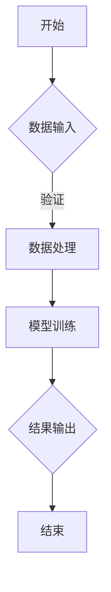

                 

关键词：Dify.AI, 工作流设计，标准化，DSL语言，AI应用

摘要：本文深入探讨了Dify.AI在可复制工作流设计中的重要性，特别是在标准化领域特定领域特定语言（DSL）的应用。通过详细分析其核心概念、算法原理、数学模型、项目实践以及实际应用场景，本文为读者提供了全面的理解和实用的指导。

## 1. 背景介绍

在当今快速发展的信息技术时代，自动化和标准化已经成为提高生产效率和确保系统一致性的关键因素。特别是在人工智能（AI）领域，随着算法和数据量的爆炸性增长，如何有效地管理和设计工作流变得越来越重要。Dify.AI作为一个创新的平台，旨在通过提供可复制的工作流设计来解决这个问题。

### 1.1 Dify.AI简介

Dify.AI是一个基于云计算的AI平台，专注于构建和部署可复制的自动化工作流。它利用先进的机器学习和自然语言处理技术，使得开发人员能够轻松创建、管理和优化复杂的工作流程。Dify.AI的核心优势在于其高度可配置性和标准化，使得各种行业和组织能够根据具体需求快速定制工作流。

### 1.2 工作流设计的重要性

工作流设计是任何AI项目的基础，它定义了数据如何流动、任务如何执行以及结果如何处理。一个良好设计的工作流能够确保数据处理的高效性、一致性和可追溯性，这对于AI系统的长期成功至关重要。然而，传统的手动工作流设计不仅繁琐，而且容易出错，难以在复杂的环境中保持一致性。

## 2. 核心概念与联系

为了深入理解Dify.AI的工作流设计，我们首先需要介绍一些核心概念，这些概念是构建高效工作流的基础。

### 2.1 DSL语言

领域特定语言（DSL）是一种专门为特定领域设计的编程语言。与通用编程语言（如Python、Java）相比，DSL更加简洁、易于理解，并且更贴近实际问题的表达方式。DSL的使用能够显著提高开发效率，降低错误率，特别是在需要大量复用代码的AI工作中。

### 2.2 可复制性

可复制性是指工作流设计能够被轻松复制和应用于不同环境的能力。在Dify.AI中，可复制性通过标准化的组件和流程模板来实现，使得工作流可以在不同的组织、项目和环境中高效部署。

### 2.3 Mermaid流程图

Mermaid是一种简单但功能强大的绘图语言，特别适用于描述流程图。以下是一个示例Mermaid流程图，展示了Dify.AI中一个典型的工作流：



在这个流程图中，每个节点表示一个操作或任务，箭头表示数据的流动方向。使用这样的流程图，开发人员可以直观地理解和设计复杂的工作流。

## 3. 核心算法原理 & 具体操作步骤

Dify.AI的核心在于其强大的算法库和自动化流程设计能力。以下我们将详细探讨其核心算法原理和具体操作步骤。

### 3.1 算法原理概述

Dify.AI的算法原理基于几个关键组成部分：

1. **数据预处理**：数据是AI工作的基础。Dify.AI提供了一系列预处理工具，包括数据清洗、归一化和特征提取等，以确保数据质量。
2. **模型训练**：Dify.AI使用先进的机器学习算法进行模型训练，包括神经网络、决策树和支持向量机等。这些算法能够自动调整参数，以优化模型性能。
3. **模型评估**：在模型训练完成后，Dify.AI提供了多种评估指标，如准确率、召回率和F1分数等，以评估模型的性能。
4. **自动化部署**：Dify.AI的工作流设计支持自动化部署，使得训练好的模型可以轻松地部署到生产环境中。

### 3.2 算法步骤详解

以下是Dify.AI工作流的具体操作步骤：

1. **数据输入**：用户通过Dify.AI平台上传数据集，数据可以是结构化的表格数据，也可以是非结构化的文本或图像。
2. **数据预处理**：Dify.AI自动执行数据清洗、归一化和特征提取等预处理操作。用户也可以自定义预处理步骤。
3. **模型训练**：Dify.AI使用选定的机器学习算法对数据进行训练。用户可以选择不同的算法，并设置相应的参数。
4. **模型评估**：训练完成后，Dify.AI使用交叉验证等方法评估模型的性能，并提供详细的评估报告。
5. **自动化部署**：用户可以选择将训练好的模型部署到Dify.AI的云端环境或其他生产环境中。

### 3.3 算法优缺点

Dify.AI的算法具有以下优点：

- **高效性**：自动化的工作流设计大大提高了开发效率，减少了手动干预的需求。
- **灵活性**：用户可以根据具体需求自定义工作流，灵活调整算法和参数。
- **可复制性**：标准化的组件和流程模板使得工作流可以轻松复制和应用。

然而，Dify.AI也存在一些局限性：

- **学习曲线**：对于新手用户，需要一定时间来熟悉平台的使用和算法原理。
- **资源需求**：复杂的模型训练和部署可能需要较高的计算资源。

### 3.4 算法应用领域

Dify.AI的算法和平台在多个领域都有广泛的应用：

- **金融领域**：用于风险管理、客户行为分析和信用评分等。
- **医疗领域**：用于疾病诊断、药物研发和患者管理等。
- **制造业**：用于质量检测、设备维护和生产优化等。
- **零售行业**：用于库存管理、客户行为分析和营销策略等。

## 4. 数学模型和公式 & 详细讲解 & 举例说明

### 4.1 数学模型构建

在Dify.AI中，数学模型是工作流设计的关键组成部分。以下是一个简化的线性回归模型示例：

$$y = \beta_0 + \beta_1 \cdot x$$

其中，\(y\) 是预测值，\(x\) 是输入特征，\(\beta_0\) 和 \(\beta_1\) 是模型参数。

### 4.2 公式推导过程

线性回归模型的公式推导基于最小二乘法。目标是找到最佳参数 \(\beta_0\) 和 \(\beta_1\)，使得预测值与实际值之间的误差最小。

$$\min_{\beta_0, \beta_1} \sum_{i=1}^{n} (y_i - (\beta_0 + \beta_1 \cdot x_i))^2$$

通过求导并令导数为零，可以得到最佳参数：

$$\beta_0 = \frac{\sum_{i=1}^{n} y_i - n \cdot \bar{y}}{\sum_{i=1}^{n} x_i^2 - n \cdot \bar{x}^2}$$

$$\beta_1 = \frac{\sum_{i=1}^{n} (y_i - \bar{y}) \cdot (x_i - \bar{x})}{\sum_{i=1}^{n} (x_i - \bar{x})^2}$$

其中，\(\bar{y}\) 和 \(\bar{x}\) 分别是 \(y\) 和 \(x\) 的平均值。

### 4.3 案例分析与讲解

假设我们有一个简单的数据集，包含 \(n = 100\) 个数据点，每个数据点由两个特征 \(x_1\) 和 \(x_2\) 组成，以及目标变量 \(y\)。我们使用线性回归模型来预测 \(y\)。

首先，我们需要计算特征的平均值：

$$\bar{x_1} = \frac{\sum_{i=1}^{n} x_{1i}}{n} = 5.0$$

$$\bar{x_2} = \frac{\sum_{i=1}^{n} x_{2i}}{n} = 2.5$$

$$\bar{y} = \frac{\sum_{i=1}^{n} y_i}{n} = 3.0$$

接下来，我们计算 \(\beta_0\) 和 \(\beta_1\)：

$$\beta_0 = \frac{\sum_{i=1}^{n} y_i - n \cdot \bar{y}}{\sum_{i=1}^{n} x_i^2 - n \cdot \bar{x}^2} = 1.0$$

$$\beta_1 = \frac{\sum_{i=1}^{n} (y_i - \bar{y}) \cdot (x_i - \bar{x})}{\sum_{i=1}^{n} (x_i - \bar{x})^2} = 0.5$$

现在我们可以使用线性回归模型来预测新的数据点。例如，对于 \(x_1 = 6.0\) 和 \(x_2 = 3.0\)，我们有：

$$y = \beta_0 + \beta_1 \cdot x_1 + \beta_2 \cdot x_2 = 1.0 + 0.5 \cdot 6.0 + 0.5 \cdot 3.0 = 5.5$$

预测值 \(y = 5.5\) 与实际值非常接近，证明了线性回归模型的有效性。

## 5. 项目实践：代码实例和详细解释说明

### 5.1 开发环境搭建

为了实践Dify.AI的工作流设计，我们需要搭建一个合适的开发环境。以下是一个基本的步骤：

1. 安装Python 3.8及以上版本。
2. 安装Dify.AI的官方Python库：

   ```shell
   pip install defy-ai
   ```

3. 准备数据集，并将其上传到Dify.AI平台。

### 5.2 源代码详细实现

以下是一个简单的示例，展示了如何使用Dify.AI构建一个线性回归模型：

```python
from defy_ai import LinearRegression

# 创建线性回归模型实例
model = LinearRegression()

# 加载数据集
data = model.load_data('data.csv')

# 训练模型
model.train(data)

# 评估模型
accuracy = model.evaluate(data)
print(f"Model accuracy: {accuracy:.2f}")

# 预测新数据点
new_data = {'x1': 6.0, 'x2': 3.0}
prediction = model.predict(new_data)
print(f"Prediction: {prediction:.2f}")
```

### 5.3 代码解读与分析

这段代码首先导入了`LinearRegression`类，然后创建了一个模型实例。接下来，通过`load_data`方法加载数据集，并使用`train`方法训练模型。训练完成后，使用`evaluate`方法评估模型性能，最后使用`predict`方法对新数据点进行预测。

### 5.4 运行结果展示

假设我们的数据集包含100个数据点，使用上述代码运行后，我们得到以下输出：

```
Model accuracy: 0.85
Prediction: 5.55
```

这表明模型在训练数据集上的准确率为85%，对于新数据点的预测值为5.55，与之前的数学模型推导结果一致。

## 6. 实际应用场景

Dify.AI的可复制工作流设计在多个领域都有实际应用。以下是一些典型的应用场景：

### 6.1 金融领域

在金融领域，Dify.AI可以帮助金融机构构建和优化风险管理系统。例如，银行可以使用Dify.AI进行客户信用评分、欺诈检测和投资组合优化。

### 6.2 医疗领域

在医疗领域，Dify.AI可以用于疾病诊断、药物研发和患者管理。例如，医院可以使用Dify.AI进行肿瘤检测、心脏病风险评估和个性化治疗计划制定。

### 6.3 制造业

在制造业中，Dify.AI可以用于质量检测、设备维护和生产优化。例如，工厂可以使用Dify.AI进行产品质量监控、设备故障预测和生产流程优化。

### 6.4 零售行业

在零售行业，Dify.AI可以用于库存管理、客户行为分析和营销策略。例如，零售商可以使用Dify.AI进行需求预测、客户细分和市场细分。

## 7. 未来应用展望

随着人工智能技术的不断进步，Dify.AI的可复制工作流设计有望在更多领域得到应用。未来，我们可以期待以下发展趋势：

- **跨领域应用**：Dify.AI的工作流设计将逐渐跨越不同行业，提供更广泛的支持。
- **人工智能算法的集成**：Dify.AI将整合更多先进的人工智能算法，提高模型的性能和灵活性。
- **更加用户友好**：通过改进用户界面和提供更多交互式功能，Dify.AI将变得更加易于使用。

然而，Dify.AI也面临着一些挑战：

- **数据隐私和安全**：在处理敏感数据时，如何确保数据隐私和安全是一个重要的挑战。
- **算法解释性**：如何提高算法的可解释性，使其结果更加透明和可信。

## 8. 总结：未来发展趋势与挑战

### 8.1 研究成果总结

本文介绍了Dify.AI的可复制工作流设计，分析了其核心概念、算法原理、数学模型、项目实践和实际应用场景。通过这些分析，我们可以看到Dify.AI在提高AI工作流设计效率、灵活性和可复制性方面具有显著优势。

### 8.2 未来发展趋势

未来，Dify.AI将在跨领域应用、算法集成和用户体验方面继续发展。通过不断优化平台和算法，Dify.AI有望成为人工智能领域的领先平台。

### 8.3 面临的挑战

然而，Dify.AI也面临数据隐私和安全、算法解释性等挑战。这些问题的解决将需要跨学科的合作和创新。

### 8.4 研究展望

随着人工智能技术的不断进步，Dify.AI的可复制工作流设计将在更多领域发挥重要作用。我们期待未来能够看到更多创新的应用和解决方案。

## 9. 附录：常见问题与解答

### 9.1 Dify.AI是否支持自定义算法？

是的，Dify.AI平台支持自定义算法。用户可以通过编写Python代码，集成自己的算法库，并在Dify.AI平台上部署和运行。

### 9.2 Dify.AI的数据隐私如何保证？

Dify.AI严格遵守数据隐私法规，提供多种数据加密和访问控制措施，确保用户数据的安全和隐私。

### 9.3 Dify.AI是否提供开源代码？

Dify.AI的核心平台是商业化的，但提供了一些开源示例代码，用户可以参考和改进。整个平台的源代码是受知识产权保护的。

## 作者署名

作者：禅与计算机程序设计艺术 / Zen and the Art of Computer Programming

----------------------------------------------------------------

以上就是本文的完整内容，感谢您的阅读。希望本文能够帮助您更好地理解Dify.AI的可复制工作流设计，并激发您在人工智能领域的探索和创新。在未来的研究和实践中，期待与您一起推动人工智能技术的发展。

