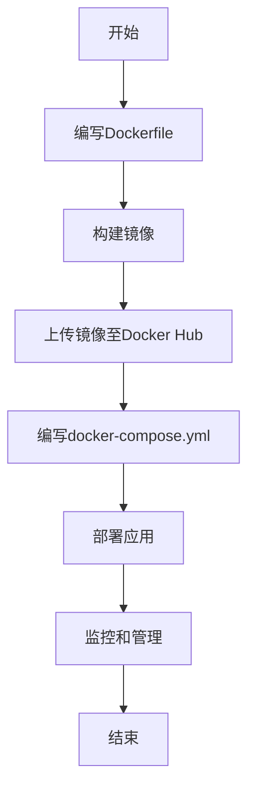

                 

关键词：Docker，容器化，部署，实战，容器编排，微服务，持续集成，持续部署

> 摘要：本文将深入探讨Docker容器化部署的实战技巧，从背景介绍、核心概念、算法原理、数学模型、项目实践、应用场景、工具资源推荐到未来发展趋势与挑战，全面揭示Docker容器化部署的奥秘。通过本篇文章，读者将能够掌握Docker容器化的核心技能，提升其在现代软件开发和运维中的竞争力。

## 1. 背景介绍

随着云计算和微服务架构的兴起，软件的交付和部署方式发生了巨大的变革。传统的部署方式依赖于操作系统级别的虚拟化，不仅效率低下，而且管理复杂。在这种背景下，容器技术应运而生，其中Docker成为了最受欢迎的容器化平台。Docker通过将应用程序及其依赖打包成一个轻量级、可移植的容器镜像，实现了“一次编写，到处运行”的目标。这种创新的部署方式，不仅大大简化了软件的部署过程，还提高了系统的可维护性和可扩展性。

本文将围绕Docker容器化部署的实战技巧，详细讲解从基础到高级的各个环节。通过阅读本文，读者将能够：

- 了解Docker容器化部署的基本概念和原理。
- 掌握Docker的核心命令和编排工具。
- 学习如何使用Docker Compose进行多容器应用的部署和管理。
- 掌握Docker Swarm集群的部署和运维。
- 探讨Docker在持续集成和持续部署（CI/CD）中的应用。
- 分析Docker容器化部署的优缺点和适用场景。
- 探索Docker容器化部署的未来发展趋势与挑战。

## 2. 核心概念与联系

在深入探讨Docker容器化部署之前，我们需要了解一些核心概念和它们之间的联系。

### 2.1 容器与虚拟机的区别

容器（Container）与虚拟机（VM）是两种不同的虚拟化技术。虚拟机通过在宿主机上模拟一个完整的操作系统环境，为应用程序提供隔离。而容器则直接运行在宿主机的操作系统之上，共享宿主机的内核，并通过命名空间、控制组（cgroups）和文件系统等机制实现隔离。

- **轻量级**：容器不需要单独的操作系统，因此启动速度快、占用资源小。
- **可移植性**：容器可以轻松地在不同的环境中运行，不受硬件和操作系统的限制。
- **性能**：容器不需要额外的操作系统开销，性能接近宿主机。

### 2.2 Docker架构

Docker的架构由以下几个核心组件组成：

- **Docker Engine**：Docker的运行核心，负责容器的创建、启动、运行和监控。
- **Dockerfile**：用于构建容器镜像的脚本文件，定义了镜像的构建过程和内容。
- **Docker Hub**：一个用于存储和分发容器镜像的远程仓库。
- **Docker Compose**：用于定义和运行多容器应用的工具。
- **Docker Swarm**：用于管理容器集群的工具。

### 2.3 Mermaid流程图

下面是一个简单的Mermaid流程图，展示了Docker容器化部署的基本流程。



## 3. 核心算法原理 & 具体操作步骤

### 3.1 算法原理概述

Docker容器化部署的核心算法原理主要基于以下几个方面：

- **容器镜像**：通过Dockerfile构建容器镜像，将应用程序及其依赖打包成一个轻量级的文件系统。
- **容器编排**：通过Docker Compose或Docker Swarm管理多个容器的部署、运行和扩展。
- **网络配置**：通过Docker Network配置容器之间的通信和外部访问。

### 3.2 算法步骤详解

#### 3.2.1 编写Dockerfile

Dockerfile是一个文本文件，用于定义如何构建Docker镜像。以下是一个简单的Dockerfile示例：

```dockerfile
# 使用官方Python镜像作为基础镜像
FROM python:3.8-slim

# 设置工作目录
WORKDIR /app

# 将当前目录的内容复制到容器内的/app目录
COPY . /app

# 安装依赖
RUN pip install -r requirements.txt

# 暴露容器的端口
EXPOSE 8000

# 运行应用程序
CMD ["python", "app.py"]
```

#### 3.2.2 构建镜像

使用以下命令构建镜像：

```shell
docker build -t myapp .
```

#### 3.2.3 上传镜像至Docker Hub

登录Docker Hub并上传镜像：

```shell
docker login
docker push myapp
```

#### 3.2.4 编写docker-compose.yml

docker-compose.yml是一个YAML文件，用于定义和运行多容器应用。以下是一个简单的docker-compose.yml示例：

```yaml
version: '3'
services:
  web:
    image: myapp
    ports:
      - "8000:8000"
```

#### 3.2.5 部署应用

使用以下命令部署应用：

```shell
docker-compose up -d
```

### 3.3 算法优缺点

#### 优点

- **轻量级**：容器不依赖宿主机的操作系统，启动速度快、占用资源小。
- **可移植性**：容器可以轻松地在不同的环境中运行，无需担心环境差异。
- **隔离性**：容器通过命名空间、cgroups和文件系统等机制实现隔离，提高了系统的安全性。
- **可扩展性**：容器可以方便地扩展和缩放，满足不同规模的应用需求。

#### 缺点

- **性能开销**：尽管容器性能接近宿主机，但相对于裸机仍有一定开销。
- **安全性**：容器虽然隔离性强，但仍存在一定的安全风险，需要严格的管理和监控。
- **依赖管理**：容器依赖的库和工具需要手动安装和管理，可能引入复杂性和不一致性。

### 3.4 算法应用领域

Docker容器化部署广泛应用于以下领域：

- **微服务架构**：容器化技术使得微服务的部署、管理和扩展变得简单高效。
- **持续集成与持续部署（CI/CD）**：容器化技术能够加快CI/CD流程，提高软件交付效率。
- **云计算与分布式系统**：容器化技术为云计算和分布式系统提供了灵活的部署和管理方式。
- **开发与测试**：容器化技术使得开发人员和测试人员可以快速搭建和部署测试环境。

## 4. 数学模型和公式 & 详细讲解 & 举例说明

在Docker容器化部署中，我们可以使用一些数学模型和公式来衡量和优化系统的性能。以下是一个简单的数学模型和公式的示例。

### 4.1 数学模型构建

假设我们有一个容器化应用，其容器数量为N，每个容器的资源需求为C，系统总资源为R。我们希望优化容器的部署，使得系统的资源利用率最高。

定义：
- \(N\)：容器数量
- \(C_i\)：第i个容器的资源需求
- \(R\)：系统总资源

目标：
- 最小化系统的平均资源利用率，即：

\[ \text{Average Utilization} = \frac{\sum_{i=1}^{N} C_i}{R} \]

### 4.2 公式推导过程

我们可以使用贪心算法来优化容器的部署。具体步骤如下：

1. 初始化容器数量 \(N = 0\) 和系统总资源 \(R\)。
2. 对于每个容器 \(i\)：
   - 如果 \(C_i \leq R\)，则部署容器 \(i\)，更新 \(N = N + 1\) 和 \(R = R - C_i\)。
   - 否则，跳过容器 \(i\)。
3. 返回部署的容器数量 \(N\)。

### 4.3 案例分析与讲解

假设我们有一个系统，总资源为100个CPU核心，每个容器的资源需求如下：

| 容器 | CPU需求 |
| ---- | ------ |
| A    | 10     |
| B    | 30     |
| C    | 20     |
| D    | 15     |
| E    | 25     |

根据上述贪心算法，我们的部署过程如下：

1. 部署容器 A（剩余资源 90）。
2. 部署容器 B（剩余资源 60）。
3. 部署容器 C（剩余资源 40）。
4. 跳过容器 D（资源不足）。
5. 部署容器 E（剩余资源 15）。

最终，我们的系统部署了 4 个容器，系统的平均资源利用率为：

\[ \text{Average Utilization} = \frac{10 + 30 + 20 + 25}{100} = 0.85 \]

## 5. 项目实践：代码实例和详细解释说明

为了更好地理解Docker容器化部署，我们将通过一个实际项目来演示其具体实现过程。

### 5.1 开发环境搭建

首先，确保您的系统中已经安装了Docker。如果没有安装，请访问[Docker官方网站](https://www.docker.com/)下载并安装。

### 5.2 源代码详细实现

我们以一个简单的Web应用为例，该项目使用Python和Flask框架实现。以下是项目的结构：

```shell
myapp/
├── Dockerfile
├── app.py
└── requirements.txt
```

- **Dockerfile**：构建容器的镜像脚本。
- **app.py**：Web应用的入口文件。
- **requirements.txt**：Python应用的依赖库。

**Dockerfile**：

```dockerfile
# 使用官方Python镜像作为基础镜像
FROM python:3.8-slim

# 设置工作目录
WORKDIR /app

# 将当前目录的内容复制到容器内的/app目录
COPY . /app

# 安装依赖
RUN pip install -r requirements.txt

# 暴露容器的端口
EXPOSE 8000

# 运行应用程序
CMD ["python", "app.py"]
```

**app.py**：

```python
from flask import Flask
app = Flask(__name__)

@app.route('/')
def hello():
    return 'Hello, Docker!'

if __name__ == '__main__':
    app.run(host='0.0.0.0', port=8000)
```

**requirements.txt**：

```shell
Flask==2.0.1
```

### 5.3 代码解读与分析

- **Dockerfile**：该文件定义了如何构建容器的镜像。首先使用官方的Python镜像作为基础，然后设置工作目录并复制项目文件到容器中。接着安装Python依赖库，并暴露容器的端口以供外部访问。

- **app.py**：这是一个简单的Flask Web应用，当访问根路由时，返回 "Hello, Docker!"。

- **requirements.txt**：列出应用所需的依赖库。

### 5.4 运行结果展示

1. **构建镜像**：

   ```shell
   docker build -t myapp .
   ```

2. **运行容器**：

   ```shell
   docker run -d -p 8000:8000 myapp
   ```

3. **访问应用**：

   打开浏览器，输入 `http://localhost`，可以看到 "Hello, Docker!" 的欢迎信息。

通过这个简单的示例，我们展示了如何使用Docker容器化部署一个Web应用。实际项目中，我们可以使用Docker Compose和Docker Swarm进行更复杂的应用部署和管理。

## 6. 实际应用场景

Docker容器化部署在实际应用中具有广泛的应用场景，以下是一些典型的应用案例：

### 6.1 微服务架构

微服务架构的核心思想是将大型应用程序拆分为一组小型、独立的服务，每个服务负责完成一个特定的业务功能。Docker容器化技术使得微服务的部署、管理和扩展变得简单高效。通过Docker Compose，我们可以轻松定义和运行多个容器化的服务，实现服务的自动部署和故障转移。

### 6.2 持续集成与持续部署（CI/CD）

持续集成和持续部署是现代软件开发中的关键流程，Docker容器化技术能够显著提高CI/CD的效率。通过将应用程序及其依赖打包成容器镜像，开发人员可以确保在任何环境中的一致性，从而简化集成和部署过程。Docker Hub提供了便捷的镜像存储和分发机制，使得持续部署变得更加高效。

### 6.3 云计算与分布式系统

云计算和分布式系统通常需要灵活的部署和管理方式，Docker容器化技术能够满足这些需求。通过Docker Swarm，我们可以轻松管理大规模的容器集群，实现应用的横向扩展和故障转移。Docker结合Kubernetes等编排工具，为云计算和分布式系统提供了强大的支持。

### 6.4 开发与测试

在开发与测试过程中，容器化技术能够帮助快速搭建和部署开发环境和测试环境。通过Docker，开发人员可以轻松地将自己的开发环境与代码一起打包，确保在不同环境中的一致性。测试人员也可以使用容器化技术创建隔离的测试环境，提高测试的准确性。

### 6.5 未来应用展望

随着容器化技术的不断发展，Docker容器化部署在未来具有广阔的应用前景。以下是一些可能的发展方向：

- **更高效的资源利用**：随着硬件性能的提升和虚拟化技术的进步，容器化部署的效率将进一步提高。
- **更完善的生态系统**：Docker生态系统将持续发展，提供更多强大的工具和框架，简化部署和管理过程。
- **更广泛的应用场景**：容器化技术将逐步渗透到更多的领域，如大数据、人工智能等。

## 7. 工具和资源推荐

### 7.1 学习资源推荐

- **官方文档**：Docker的官方文档（[https://docs.docker.com/](https://docs.docker.com/)）是学习Docker的最佳资源，涵盖了从基础到高级的各个方面。
- **在线教程**：网上有许多优秀的Docker教程，如[Pluralsight](https://www.pluralsight.com/)、[Coursera](https://www.coursera.org/)等平台提供的课程。
- **书籍**：《Docker Deep Dive》（[https://dockerdeep.com/](https://dockerdeep.com/)）是一本深度讲解Docker的书籍，适合有一定基础的读者。

### 7.2 开发工具推荐

- **Docker Desktop**：适用于Windows和macOS的开发人员，提供了简单直观的界面和丰富的功能。
- **Kitematic**：一个基于Electron的Docker桌面客户端，提供了易于使用的图形界面。

### 7.3 相关论文推荐

- **"Docker: Lightweight Virtualization for Development, Test, and Production"**：这是一篇关于Docker背景和核心概念的论文，提供了深入了解Docker的视角。
- **"Container-Based Microservices Deployment with Docker and Kubernetes"**：这篇论文探讨了如何使用Docker和Kubernetes实现微服务的部署和管理。

## 8. 总结：未来发展趋势与挑战

### 8.1 研究成果总结

Docker容器化部署技术自推出以来，迅速改变了软件的交付和部署方式。通过将应用程序及其依赖打包成容器镜像，Docker实现了“一次编写，到处运行”的目标。在实际应用中，Docker不仅提高了软件的可维护性和可扩展性，还显著加快了开发、测试和部署的效率。Docker生态系统不断完善，提供了丰富的工具和框架，使得容器化部署变得更加简单和高效。

### 8.2 未来发展趋势

- **更高效的资源利用**：随着硬件性能的提升和虚拟化技术的进步，容器化部署的效率将进一步提高。
- **更完善的生态系统**：Docker生态系统将持续发展，提供更多强大的工具和框架，简化部署和管理过程。
- **更广泛的应用场景**：容器化技术将逐步渗透到更多的领域，如大数据、人工智能等。
- **容器编排与自动化**：容器编排工具如Kubernetes和Docker Swarm将继续发展，提供更高级的自动化和运维功能。

### 8.3 面临的挑战

- **安全性**：容器虽然隔离性强，但仍存在一定的安全风险，需要严格的管理和监控。
- **依赖管理**：容器依赖的库和工具需要手动安装和管理，可能引入复杂性和不一致性。
- **性能优化**：容器部署需要考虑性能优化，以充分发挥硬件性能。
- **标准化**：尽管Docker已经成为容器化部署的事实标准，但仍然需要进一步标准化，以减少兼容性问题。

### 8.4 研究展望

未来，容器化技术将在以下几个方面进行深入研究：

- **安全性研究**：提高容器的安全性，减少安全漏洞和攻击面。
- **性能优化**：通过改进容器运行时和调度策略，提高容器性能。
- **依赖管理**：开发更智能的依赖管理工具，简化容器依赖的安装和管理。
- **标准化与互操作性**：推动容器化技术的标准化，提高不同平台和工具之间的互操作性。

## 9. 附录：常见问题与解答

### 9.1 Docker镜像拉取失败怎么办？

可能原因：网络连接不稳定、Docker Hub服务器故障、Docker版本不兼容。

解决方案：
- 检查网络连接是否稳定。
- 尝试更换网络环境或使用VPN。
- 检查Docker版本，确保与Docker Hub服务器兼容。

### 9.2 Docker容器无法访问外部服务怎么办？

可能原因：容器网络配置错误、外部服务未启动或未开放端口。

解决方案：
- 检查容器网络配置，确保使用了正确的网络模式。
- 确认外部服务已启动并开放了相应的端口。
- 使用`docker exec`命令进入容器，检查网络连接。

### 9.3 Docker容器资源使用过高怎么办？

可能原因：容器中运行的进程占用过多资源、容器配置不当。

解决方案：
- 使用`docker stats`命令监控容器资源使用情况。
- 检查容器中运行的进程，优化其资源使用。
- 调整容器的资源限制，如CPU、内存等。

### 9.4 Docker Compose服务无法启动怎么办？

可能原因：docker-compose.yml配置错误、依赖服务未启动。

解决方案：
- 检查docker-compose.yml文件，确保配置正确。
- 使用`docker-compose logs`命令查看服务日志，排查错误。
- 确认所有依赖服务已成功启动。

### 9.5 Docker容器无法更新怎么办？

可能原因：Dockerfile或容器配置问题、容器运行时损坏。

解决方案：
- 检查Dockerfile，确保更新逻辑正确。
- 尝试停止容器并重新启动，以解决可能的问题。
- 如果问题依旧，尝试创建一个新的容器并部署更新。

## 作者署名

作者：禅与计算机程序设计艺术 / Zen and the Art of Computer Programming

----------------------------------------------------------------

以上就是本文的全部内容，希望通过本文的详细讲解，读者能够对Docker容器化部署有更深入的理解和实践。在未来的软件开发和运维工作中，容器化技术将继续发挥重要作用，为开发者提供更加高效、灵活的解决方案。希望本文能为您的学习和实践提供帮助。

