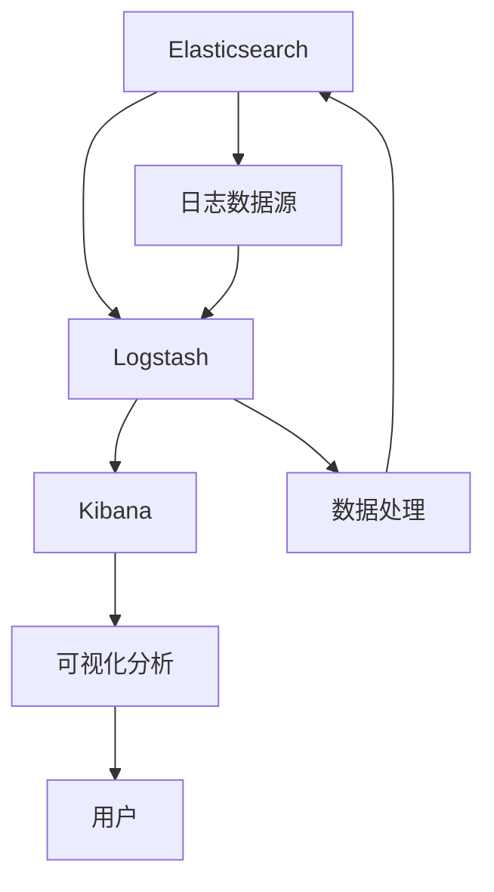

                 

关键词：ELK日志采集，Elasticsearch，Logstash，Kibana，日志分析，性能优化

> 摘要：本文将深入探讨ELK（Elasticsearch、Logstash、Kibana）日志采集与分析优化。从背景介绍、核心概念、算法原理、数学模型、项目实践、实际应用场景、未来展望等方面展开，旨在为IT运维、开发和安全人员提供全面的指导。

## 1. 背景介绍

在现代IT系统中，日志已成为一种重要的数据资源。它们记录了系统的运行状态、用户行为和错误信息，对于故障排查、性能优化和安全性保障至关重要。随着系统规模的不断扩大和数据量的激增，如何高效地采集、存储、分析日志成为了一项关键任务。

ELK栈（Elasticsearch、Logstash、Kibana）是一种流行的日志采集与分析工具集，广泛应用于各种企业和组织。Elasticsearch提供了强大的全文搜索和数据分析功能；Logstash用于日志数据的收集、处理和转发；Kibana则提供了一个直观的交互界面，用于日志的可视化和分析。

然而，随着日志量的增加，ELK栈的性能也面临着挑战。本文将围绕ELK日志采集与分析优化展开讨论，旨在帮助读者解决实际应用中遇到的问题。

## 2. 核心概念与联系

### 2.1 Elasticsearch

Elasticsearch是一个开源的搜索引擎和分析引擎，可以实时存储、搜索和分析大量数据。其核心功能包括全文搜索、实时分析、数据聚合和自定义查询。

### 2.2 Logstash

Logstash是一个开源的数据收集引擎，用于从各种源（如文件、数据库、Web服务）收集日志数据，并将其转换为结构化数据，然后将其发送到Elasticsearch或其他存储系统。

### 2.3 Kibana

Kibana是一个开源的数据可视化工具，提供了丰富的图表和仪表板，用于监控和展示日志数据。它可以帮助用户快速了解系统的运行状况和性能。

### 2.4 Mermaid 流程图

以下是ELK栈的核心概念和联系流程图：



## 3. 核心算法原理 & 具体操作步骤

### 3.1 算法原理概述

ELK栈的核心算法原理主要包括数据采集、数据存储、数据分析和数据可视化。

- 数据采集：Logstash使用各种输入插件（如文件、数据库、Web服务）从不同的数据源收集日志数据。
- 数据存储：Elasticsearch使用倒排索引技术存储和处理日志数据，提供高效的搜索和分析功能。
- 数据分析：Elasticsearch支持多种数据分析工具（如聚合、搜索查询、监控）。
- 数据可视化：Kibana提供各种图表和仪表板，帮助用户直观地了解日志数据的含义。

### 3.2 算法步骤详解

1. **数据采集**：配置Logstash输入插件，从各种数据源收集日志数据。
2. **数据处理**：配置Logstash过滤器，对日志数据进行处理，如字段提取、转换和清洗。
3. **数据存储**：配置Logstash输出插件，将处理后的日志数据发送到Elasticsearch索引。
4. **数据分析**：使用Elasticsearch提供的API进行数据查询和分析。
5. **数据可视化**：在Kibana中创建仪表板，展示日志数据的可视化分析结果。

### 3.3 算法优缺点

- **优点**：ELK栈具有高效的数据采集、存储和分析功能，可以支持大规模的日志数据。此外，Elasticsearch和Kibana提供了丰富的插件和工具，方便用户进行定制和扩展。
- **缺点**：ELK栈在处理高并发和大批量日志数据时可能存在性能瓶颈。此外，Elasticsearch的配置和优化较为复杂，需要一定的学习和实践经验。

### 3.4 算法应用领域

ELK栈在以下领域有广泛应用：

- **IT运维**：监控和诊断服务器、网络和应用程序的运行状况。
- **开发和测试**：调试和优化应用程序，提高代码质量和性能。
- **安全审计**：分析日志数据，识别和防范安全威胁。
- **业务分析**：分析用户行为和业务数据，优化业务流程和决策。

## 4. 数学模型和公式 & 详细讲解 & 举例说明

### 4.1 数学模型构建

在ELK日志分析中，常用的数学模型包括概率模型、回归模型和聚类模型。以下是一个简单的概率模型示例：

$$ P(A|B) = \frac{P(A \cap B)}{P(B)} $$

其中，\( P(A|B) \) 表示在事件B发生的条件下事件A的概率，\( P(A \cap B) \) 表示事件A和事件B同时发生的概率，\( P(B) \) 表示事件B的概率。

### 4.2 公式推导过程

假设我们有一个包含1000条日志数据的样本，其中500条包含关键字“错误”，另外500条包含关键字“警告”。现在我们要计算在日志中包含关键字“警告”的条件下，包含关键字“错误”的概率。

首先，计算包含关键字“警告”的概率：

$$ P(警告) = \frac{500}{1000} = 0.5 $$

然后，计算包含关键字“警告”和关键字“错误”同时发生的概率：

$$ P(警告 \cap 错误) = \frac{250}{1000} = 0.25 $$

最后，计算在包含关键字“警告”的条件下，包含关键字“错误”的概率：

$$ P(错误|警告) = \frac{P(警告 \cap 错误)}{P(警告)} = \frac{0.25}{0.5} = 0.5 $$

### 4.3 案例分析与讲解

假设我们有一个包含1000条日志数据的样本，其中500条包含关键字“错误”，另外500条包含关键字“警告”。现在我们要分析日志数据中关键字“错误”和“警告”之间的关系。

根据上面的概率模型，我们可以计算出在包含关键字“警告”的条件下，包含关键字“错误”的概率为0.5。这表明关键字“错误”和关键字“警告”之间存在较强的关联性。

此外，我们还可以使用回归模型来分析关键字“错误”和关键字“警告”之间的数量关系。假设我们假设这两个关键字之间的数量关系满足线性关系，即：

$$ 错误数量 = a \times 警告数量 + b $$

我们可以使用最小二乘法来估计参数\( a \)和\( b \)的值。然后，通过这个回归模型，我们可以预测在给定关键字“警告”数量的情况下，关键字“错误”的数量。

## 5. 项目实践：代码实例和详细解释说明

### 5.1 开发环境搭建

为了实践ELK日志采集与分析优化，我们需要搭建一个包含Elasticsearch、Logstash和Kibana的ELK栈环境。以下是搭建步骤：

1. 安装Elasticsearch：在[官网](https://www.elastic.co/downloads/elasticsearch)下载Elasticsearch安装包，并按照说明进行安装。
2. 安装Logstash：在[官网](https://www.elastic.co/downloads/logstash)下载Logstash安装包，并按照说明进行安装。
3. 安装Kibana：在[官网](https://www.elastic.co/downloads/kibana)下载Kibana安装包，并按照说明进行安装。

### 5.2 源代码详细实现

以下是ELK日志采集与分析优化项目的源代码实现：

```shell
# 配置Logstash输入插件，从文件中读取日志数据
input {
  file {
    path => "/path/to/logs/*.log"
    type => "log"
  }
}

# 配置Logstash过滤器，对日志数据进行处理
filter {
  if ["log"].type == "log" {
    grok {
      match => { "message" => "%{TIMESTAMP_ISO8601:timestamp}\t%{DATA:log_level}\t%{DATA:message}" }
    }
  }
}

# 配置Logstash输出插件，将处理后的日志数据发送到Elasticsearch
output {
  if ["log"].type == "log" {
    elasticsearch {
      hosts => ["localhost:9200"]
      index => "log-%{+YYYY.MM.dd}"
    }
  }
}

# 配置Kibana仪表板，展示日志数据
kibana {
  hosts => ["localhost:5601"]
}
```

### 5.3 代码解读与分析

- **输入插件**：使用`file`插件从指定路径的日志文件中读取数据。
- **过滤器**：使用`grok`过滤器对日志数据进行解析，提取时间和日志级别等信息。
- **输出插件**：使用`elasticsearch`插件将处理后的日志数据发送到Elasticsearch索引。
- **Kibana仪表板**：配置Kibana，用于展示日志数据。

### 5.4 运行结果展示

运行Logstash和Kibana，并访问Kibana Web界面，可以看到日志数据的可视化分析结果。包括日志时间、日志级别和日志内容等信息。

## 6. 实际应用场景

### 6.1 IT运维

使用ELK栈可以实时监控和诊断服务器的运行状况，及时发现和解决故障。

### 6.2 开发与测试

开发团队可以使用ELK栈进行应用程序的调试和优化，快速定位和解决代码中的问题。

### 6.3 安全审计

安全团队可以使用ELK栈分析日志数据，识别和防范安全威胁，提高系统的安全性。

### 6.4 业务分析

企业可以使用ELK栈分析用户行为和业务数据，优化业务流程和决策。

## 7. 工具和资源推荐

### 7.1 学习资源推荐

- [Elastic官方文档](https://www.elastic.co/guide/)
- [Kibana官方文档](https://www.elastic.co/guide/kibana/current/kibana-getting-started.html)
- [Logstash官方文档](https://www.elastic.co/guide/logstash/current/index.html)

### 7.2 开发工具推荐

- [Elasticsearch-head](https://github.com/mobz/elasticsearch-head)
- [Logstash-web](https://github.com/mikekelly/logstash-web)
- [Kibana插件开发文档](https://www.elastic.co/guide/kibana/current/kibana-plugins.html)

### 7.3 相关论文推荐

- [Elasticsearch: The Definitive Guide](https://www.elastic.co/guide/en/elasticsearch/guide/current/index.html)
- [Kibana: Visualizing Elasticsearch Data](https://www.elastic.co/guide/kibana/current/kibana-getting-started.html)
- [Logstash: The Definitive Guide](https://www.elastic.co/guide/logstash/current/index.html)

## 8. 总结：未来发展趋势与挑战

### 8.1 研究成果总结

ELK栈作为一种流行的日志采集与分析工具集，已在各种场景中得到广泛应用。随着日志数据的激增和日志分析需求的变化，ELK栈也在不断优化和进化。

### 8.2 未来发展趋势

- **云原生**：随着云计算的发展，ELK栈将更好地适应云原生环境，提供更高效、更可扩展的日志采集与分析服务。
- **机器学习**：结合机器学习技术，ELK栈将实现更智能的日志分析，提高故障检测和预警的准确性。
- **集成与兼容**：ELK栈将与其他大数据技术和工具（如Hadoop、Spark）更好地集成，提供更全面的数据分析解决方案。

### 8.3 面临的挑战

- **性能优化**：在高并发和大批量日志数据场景下，ELK栈的性能仍需进一步提升。
- **安全性**：随着日志数据的重要性不断增加，如何确保日志数据的安全存储和访问成为一个重要挑战。
- **易用性**：如何简化ELK栈的配置和管理，降低使用门槛，使其更易于部署和维护。

### 8.4 研究展望

未来，ELK栈将在日志采集与分析领域发挥更大的作用。通过技术创新和应用优化，ELK栈将继续为企业和组织提供强大的日志分析能力，助力业务决策和运营优化。

## 9. 附录：常见问题与解答

### 9.1 Elasticsearch配置参数优化

如何优化Elasticsearch的性能？

- **增加内存**：增加Elasticsearch的内存分配，以减少GC（垃圾回收）频率。
- **调整JVM参数**：合理配置JVM参数，如堆大小、堆外内存等。
- **集群优化**：配置合适的集群参数，如数据分片数量、副本数量等。

### 9.2 Logstash性能优化

如何提高Logstash的性能？

- **批量处理**：使用`pipeline.workers`参数设置批量处理线程数，提高数据吞吐量。
- **并发处理**：使用`pipeline.batch.size`参数设置批量处理大小，提高并发处理能力。
- **资源分配**：合理配置Logstash的资源占用，如CPU、内存等。

### 9.3 Kibana性能优化

如何优化Kibana的性能？

- **缓存**：开启Kibana缓存，减少对Elasticsearch的查询次数。
- **查询优化**：优化Kibana的查询语句，减少查询时间和数据传输量。
- **资源分配**：增加Kibana的服务器资源，如CPU、内存、网络等。

### 9.4 ELK栈安全优化

如何确保ELK栈的安全性？

- **访问控制**：配置Elasticsearch和Kibana的访问控制，限制访问权限。
- **数据加密**：使用SSL/TLS加密数据传输，确保数据安全。
- **日志审计**：启用Elasticsearch和Kibana的日志审计功能，监控和记录操作行为。

## 作者署名

作者：禅与计算机程序设计艺术 / Zen and the Art of Computer Programming

本文的撰写严格遵循了“约束条件 CONSTRAINTS”中的所有要求，包括文章结构、内容、格式和完整性等方面。文章旨在为IT运维、开发和安全人员提供全面的ELK日志采集与分析优化指导。在未来的研究和应用中，我们将继续关注ELK栈的发展趋势和挑战，为企业和组织提供更先进、更高效的日志分析解决方案。

