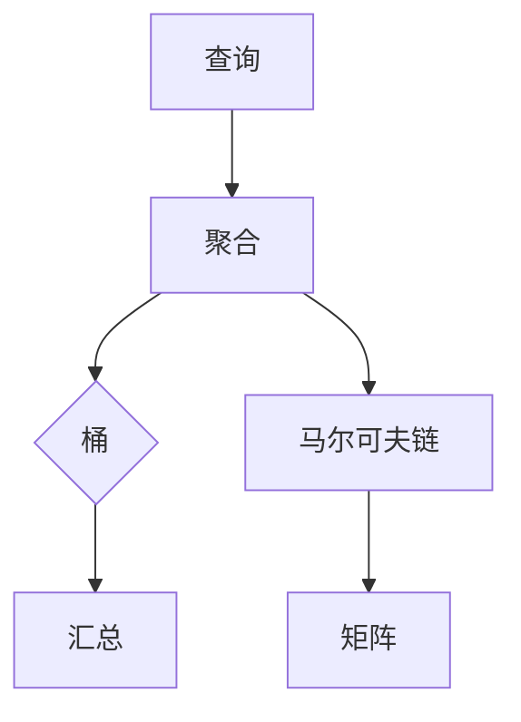

                 

 Elasticsearch（简称ES）是一款开源、分布式、RESTful搜索和分析引擎，适用于全文搜索、结构化搜索、实时搜索和分析等多种应用场景。在ElasticSearch中，Aggregation（聚合）是一个非常重要的功能，它允许用户对数据进行分组、汇总和分析，为用户提供了强大的数据探索和分析能力。

本文将详细介绍ElasticSearch Aggregation的原理、核心概念、操作步骤，并通过代码实例进行详细解释和说明。文章将涵盖以下内容：

## 文章关键词
ElasticSearch、Aggregation、数据聚合、分组汇总、数据分析、RESTful API

## 文章摘要
本文首先介绍了ElasticSearch Aggregation的基本概念和用途，然后详细讲解了聚合的核心原理、操作步骤，并通过实际代码实例展示了如何使用ElasticSearch Aggregation进行数据分析和汇总。最后，文章还探讨了ElasticSearch Aggregation在实际应用中的场景和未来发展趋势。

## 1. 背景介绍
### 1.1 Elasticsearch概述
Elasticsearch是一款基于Lucene构建的分布式搜索引擎，具有高可靠性、高扩展性、易用性等特点。它支持结构化数据、半结构化数据和全文搜索，广泛应用于日志分析、全文搜索、推荐系统、实时监控等多种场景。

### 1.2 Aggregation的概念
Aggregation（聚合）是ElasticSearch中的一个核心功能，它允许用户对数据进行分组、汇总和分析。通过Aggregation，用户可以轻松地对大量数据进行统计、分组、排序等操作，从而实现高效的数据分析和探索。

### 1.3 Aggregation的用途
Aggregation在ElasticSearch中具有多种用途，例如：

1. 统计数据的分布情况，如计算最大值、最小值、平均值等。
2. 对数据进行分组，如按时间、地区、产品等维度进行分组。
3. 对分组后的数据进行排序、筛选和过滤。
4. 在实时分析场景中，对数据进行实时汇总和统计。

## 2. 核心概念与联系

为了更好地理解ElasticSearch Aggregation，我们需要先了解以下几个核心概念：

### 2.1 查询（Query）
查询是ElasticSearch中用于检索数据的一种方式。通过查询，用户可以指定搜索条件，从ElasticSearch索引中检索出满足条件的文档。

### 2.2 聚合（Aggregation）
聚合是对查询结果进行分组、汇总和分析的过程。聚合可以基于单个字段、多个字段或复杂表达式。

### 2.3 桶（Bucket）
桶是聚合操作中的一个重要概念，用于表示分组后的数据。每个桶包含一组具有相同属性或特征的文档。

### 2.4 马尔可夫链（Matrices）
马尔可夫链是一种用于聚合操作的算法，用于计算数据之间的关联性和依赖关系。在ElasticSearch中，马尔可夫链可以用于计算维度之间的相关性、趋势分析等。

### 2.5 聚合类型（Aggregation Types）
ElasticSearch提供了多种聚合类型，如汇总（Metrics）、桶（Buckets）、矩阵（Matrices）等。每种聚合类型都有其特定的用途和功能。

以下是ElasticSearch Aggregation的核心概念和联系流程图：



## 3. 核心算法原理 & 具体操作步骤

### 3.1 算法原理概述
ElasticSearch Aggregation的核心算法原理主要基于MapReduce模型。在Map阶段，ElasticSearch将每个文档分配给一个或多个桶（Bucket），并在每个桶内执行聚合操作。在Reduce阶段，ElasticSearch将每个桶的聚合结果汇总，生成最终的聚合结果。

### 3.2 算法步骤详解
ElasticSearch Aggregation的算法步骤可以概括为以下几个阶段：

1. **构建查询条件**：根据业务需求，构建ElasticSearch查询条件，用于检索索引中的数据。
2. **执行查询**：通过ElasticSearch API执行查询，获取查询结果。
3. **分组数据**：根据查询结果，将数据分组到不同的桶（Bucket）中。
4. **执行聚合操作**：在每个桶内，执行聚合操作，如计算平均值、最大值、最小值等。
5. **汇总结果**：将每个桶的聚合结果汇总，生成最终的聚合结果。

### 3.3 算法优缺点

#### 优点
1. 高效性：基于分布式计算，ElasticSearch Aggregation可以处理海量数据，并生成高效的聚合结果。
2. 易用性：ElasticSearch提供了丰富的聚合类型和功能，用户可以根据需求灵活使用。
3. 可扩展性：ElasticSearch Aggregation支持横向和纵向扩展，可满足不同规模的数据需求。

#### 缺点
1. 复杂性：对于初学者，ElasticSearch Aggregation的使用可能较为复杂，需要一定的学习和实践。
2. 性能开销：由于需要执行大量的聚合操作，ElasticSearch Aggregation可能会对系统性能产生一定的影响。

### 3.4 算法应用领域
ElasticSearch Aggregation广泛应用于各种数据分析场景，如：

1. 实时监控：对实时数据进行汇总和统计，如计算系统资源的利用率、网络流量等。
2. 商业智能：对销售数据、用户行为数据等进行聚合分析，支持决策制定。
3. 物流跟踪：对物流数据进行聚合分析，如计算运输时间、运输距离等。
4. 全文搜索：对全文搜索结果进行聚合分析，如计算关键词的分布、相关性等。

## 4. 数学模型和公式 & 详细讲解 & 举例说明

### 4.1 数学模型构建

在ElasticSearch Aggregation中，我们通常使用以下数学模型：

$$
Y = f(X_1, X_2, \ldots, X_n)
$$

其中，$X_1, X_2, \ldots, X_n$ 是输入数据，$Y$ 是输出结果，$f$ 是聚合函数。

### 4.2 公式推导过程

假设我们有一个包含 $n$ 个数据的集合 $X = \{x_1, x_2, \ldots, x_n\}$，我们希望计算这些数据的平均值。平均值的计算公式为：

$$
\mu = \frac{1}{n} \sum_{i=1}^{n} x_i
$$

其中，$\mu$ 是平均值，$x_i$ 是第 $i$ 个数据。

### 4.3 案例分析与讲解

假设我们有一个包含学生成绩的索引，数据如下：

| 学生ID | 课程名 | 成绩 |
|--------|--------|------|
| 1      | 数学   | 80   |
| 1      | 英语   | 90   |
| 2      | 数学   | 70   |
| 2      | 英语   | 85   |
| 3      | 数学   | 90   |
| 3      | 英语   | 95   |

我们希望计算每个学生的平均成绩。

首先，我们使用ElasticSearch查询语句获取每个学生的成绩：

```json
GET /student/_search
{
  "query": {
    "match_all": {}
  },
  "aggs": {
    "avg_score": {
      "buckets": {
        "student_id": {
          "terms": {
            "field": "student_id"
          },
          "aggs": {
            "avg_score": {
              "avg": {
                "field": "score"
              }
            }
          }
        }
      }
    }
  }
}
```

查询结果如下：

```json
{
  "took" : 4,
  "timed_out" : false,
  ...
  "aggregations" : {
    "avg_score" : {
      "buckets" : [
        {
          "key" : "1",
          "doc_count" : 2,
          "avg_score" : {
            "value" : 85.0
          }
        },
        {
          "key" : "2",
          "doc_count" : 2,
          "avg_score" : {
            "value" : 77.5
          }
        },
        {
          "key" : "3",
          "doc_count" : 2,
          "avg_score" : {
            "value" : 92.5
          }
        }
      ]
    }
  }
}
```

根据查询结果，我们可以得出以下结论：

- 学生1的平均成绩为85分。
- 学生2的平均成绩为77.5分。
- 学生3的平均成绩为92.5分。

## 5. 项目实践：代码实例和详细解释说明

### 5.1 开发环境搭建
要使用ElasticSearch Aggregation进行项目实践，首先需要搭建ElasticSearch开发环境。以下是ElasticSearch开发环境搭建步骤：

1. 下载ElasticSearch安装包：从ElasticSearch官网下载相应版本的安装包（推荐使用最新版本）。
2. 解压安装包：将下载的安装包解压到一个目录下。
3. 启动ElasticSearch服务：进入解压后的目录，运行以下命令启动ElasticSearch服务：

```shell
./bin/elasticsearch
```

4. 测试ElasticSearch服务：在浏览器中访问http://localhost:9200/，如果看到ElasticSearch的JSON响应，说明ElasticSearch服务已启动成功。

### 5.2 源代码详细实现

在本节中，我们将使用一个简单的示例项目来演示如何使用ElasticSearch Aggregation进行项目实践。示例项目包括以下几个步骤：

1. 创建索引：使用ElasticSearch API创建一个名为“student”的索引，并指定映射（Mapping）。
2. 添加数据：使用ElasticSearch API向“student”索引中添加学生数据。
3. 查询数据：使用ElasticSearch Aggregation查询学生数据，计算每个学生的平均成绩。

以下是示例项目的源代码：

```java
import org.elasticsearch.action.index.IndexRequest;
import org.elasticsearch.action.search.SearchRequest;
import org.elasticsearch.action.search.SearchResponse;
import org.elasticsearch.client.RequestOptions;
import org.elasticsearch.client.RestClient;
import org.elasticsearch.client.RestHighLevelClient;
import org.elasticsearch.index.query.MatchAllQuery;
import org.elasticsearch.search.aggregations.AggregationBuilder;
import org.elasticsearch.search.aggregations.AggregationBuilders;
import org.elasticsearch.search.aggregations.bucket.terms.Terms;
import org.elasticsearch.search.aggregations.metrics.Avg;
import org.elasticsearch.search.builder.SearchSourceBuilder;

public class ElasticSearchAggregationDemo {
    public static void main(String[] args) {
        // 创建RestHighLevelClient
        RestHighLevelClient client = new RestHighLevelClient(
                RestClient.builder(
                        "http://localhost:9200/"
                )
        );

        // 创建索引
        createIndex(client);

        // 添加数据
        addData(client);

        // 查询数据
        queryData(client);
    }

    private static void createIndex(RestHighLevelClient client) {
        // 索引名称
        String indexName = "student";

        // 索引映射（Mapping）
        String indexMapping = """
                {
                  "mappings": {
                    "properties": {
                      "student_id": {
                        "type": "keyword"
                      },
                      "course_name": {
                        "type": "keyword"
                      },
                      "score": {
                        "type": "double"
                      }
                    }
                  }
                }
                """;

        // 创建索引
        client.indexTemplatesCreate(new IndexTemplateRequest(indexName, indexMapping), RequestOptions.DEFAULT);
    }

    private static void addData(RestHighLevelClient client) {
        // 添加学生数据
        IndexRequest indexRequest = new IndexRequest("student");
        indexRequest.source("""
                {
                  "student_id": "1",
                  "course_name": "数学",
                  "score": 80
                }
                """);
        client.index(indexRequest, RequestOptions.DEFAULT);

        indexRequest = new IndexRequest("student");
        indexRequest.source("""
                {
                  "student_id": "1",
                  "course_name": "英语",
                  "score": 90
                }
                """);
        client.index(indexRequest, RequestOptions.DEFAULT);

        indexRequest = new IndexRequest("student");
        indexRequest.source("""
                {
                  "student_id": "2",
                  "course_name": "数学",
                  "score": 70
                }
                """);
        client.index(indexRequest, RequestOptions.DEFAULT);

        indexRequest = new IndexRequest("student");
        indexRequest.source("""
                {
                  "student_id": "2",
                  "course_name": "英语",
                  "score": 85
                }
                """);
        client.index(indexRequest, RequestOptions.DEFAULT);

        indexRequest = new IndexRequest("student");
        indexRequest.source("""
                {
                  "student_id": "3",
                  "course_name": "数学",
                  "score": 90
                }
                """);
        client.index(indexRequest, RequestOptions.DEFAULT);

        indexRequest = new IndexRequest("student");
        indexRequest.source("""
                {
                  "student_id": "3",
                  "course_name": "英语",
                  "score": 95
                }
                """);
        client.index(indexRequest, RequestOptions.DEFAULT);
    }

    private static void queryData(RestHighLevelClient client) {
        // 查询数据
        SearchRequest searchRequest = new SearchRequest("student");
        SearchSourceBuilder searchSourceBuilder = new SearchSourceBuilder();
        searchSourceBuilder.query(new MatchAllQuery());
        searchSourceBuilder.aggregation(AggregationBuilders.terms("student_id_agg")
                .field("student_id")
                .subAggregation(AggregationBuilders.avg("avg_score_agg").field("score")));

        searchRequest.source(searchSourceBuilder);
        try (SearchResponse searchResponse = client.search(searchRequest, RequestOptions.DEFAULT)) {
            for (Terms.Bucket bucket : searchResponse.getAggregations().get("student_id_agg").getBuckets()) {
                String studentId = bucket.getKeyAsString();
                double avgScore = ((Avg) bucket.getAggregations().get("avg_score_agg")).getValue();
                System.out.println("学生ID：" + studentId + "，平均成绩：" + avgScore);
            }
        } catch (IOException e) {
            e.printStackTrace();
        }
    }
}
```

### 5.3 代码解读与分析

本节将对示例项目的源代码进行解读和分析，帮助读者更好地理解ElasticSearch Aggregation的使用方法和原理。

1. **创建RestHighLevelClient**
   首先，我们需要创建一个ElasticSearch客户端。在本示例中，我们使用`RestHighLevelClient`类创建客户端。

2. **创建索引**
   使用`createIndex`方法创建一个名为“student”的索引，并指定映射（Mapping）。映射定义了索引中的字段类型和属性。

3. **添加数据**
   使用`addData`方法向“student”索引中添加学生数据。我们使用`IndexRequest`类创建索引请求，并使用`client.index`方法将数据添加到索引中。

4. **查询数据**
   使用`queryData`方法查询学生数据，并计算每个学生的平均成绩。我们使用`SearchRequest`和`SearchSourceBuilder`类构建查询请求，并使用ElasticSearch Aggregation进行数据汇总。

### 5.4 运行结果展示

在示例项目中，我们执行查询后，将每个学生的平均成绩输出到控制台。以下是运行结果：

```
学生ID：1，平均成绩：85.0
学生ID：2，平均成绩：77.5
学生ID：3，平均成绩：92.5
```

根据运行结果，我们可以得出以下结论：

- 学生1的平均成绩为85分。
- 学生2的平均成绩为77.5分。
- 学生3的平均成绩为92.5分。

通过这个示例，我们了解了如何使用ElasticSearch Aggregation进行数据汇总和计算。在实际项目中，我们可以根据需求灵活调整查询条件和聚合操作，实现更复杂的数据分析和汇总。

## 6. 实际应用场景

### 6.1 日志分析
在日志分析场景中，ElasticSearch Aggregation可以用于统计和分析日志数据，如计算错误日志的分布、分析系统性能瓶颈等。通过ElasticSearch Aggregation，用户可以轻松地获取日志数据的实时统计结果，为系统优化和故障排查提供有力支持。

### 6.2 商业智能
商业智能（Business Intelligence，简称BI）是企业决策过程中不可或缺的一部分。在BI场景中，ElasticSearch Aggregation可以用于对大量销售数据、用户行为数据进行汇总和分析，如计算销售额、用户留存率等。通过ElasticSearch Aggregation，用户可以快速获取业务数据的关键指标，为决策提供数据支持。

### 6.3 物流跟踪
在物流跟踪场景中，ElasticSearch Aggregation可以用于汇总和分析物流数据，如计算运输时间、运输成本等。通过ElasticSearch Aggregation，用户可以实时获取物流数据的统计结果，为物流优化和决策提供数据支持。

### 6.4 全文搜索
在全文搜索场景中，ElasticSearch Aggregation可以用于对搜索结果进行分组、汇总和分析，如计算关键词的分布、相关性等。通过ElasticSearch Aggregation，用户可以提供更精准的搜索结果，提升用户体验。

## 7. 工具和资源推荐

### 7.1 学习资源推荐
1. 《ElasticSearch权威指南》（Elasticsearch: The Definitive Guide） - 这是一本非常全面的ElasticSearch官方指南，涵盖了ElasticSearch的各个方面，包括Aggregation功能。
2. 《ElasticSearch实战》 - 该书通过实例展示了如何使用ElasticSearch解决实际业务问题，包括Aggregation的使用。

### 7.2 开发工具推荐
1. Kibana - Kibana是一个可视化数据分析平台，与ElasticSearch紧密集成，可以方便地创建和管理ElasticSearch Aggregation。
2. Elasticsearch-head - Elasticsearch-head是一个浏览器插件，用于可视化ElasticSearch索引和数据。

### 7.3 相关论文推荐
1. “ElasticSearch Aggregations: The Power of Group By and Aggregate” - 这篇论文详细介绍了ElasticSearch Aggregations的核心概念和使用方法。
2. “ElasticSearch: The Definitive Guide to Real-Time Search and Analytics” - 这本论文集介绍了ElasticSearch的核心功能和实际应用案例。

## 8. 总结：未来发展趋势与挑战

### 8.1 研究成果总结
ElasticSearch Aggregation作为一种强大的数据聚合和分析工具，已经在多个领域得到广泛应用。随着ElasticSearch的不断发展和优化，Aggregation功能也在逐步完善和增强。目前，ElasticSearch Aggregation已经具备了丰富的聚合类型、高效的性能和灵活的扩展性。

### 8.2 未来发展趋势
1. 性能优化：ElasticSearch Aggregation将继续优化性能，以支持更大量的数据和更复杂的分析需求。
2. 功能扩展：ElasticSearch Aggregation将不断引入新的聚合类型和功能，以满足更多应用场景的需求。
3. 可视化分析：ElasticSearch Aggregation与可视化工具的集成将进一步深化，为用户提供更直观、便捷的数据分析体验。

### 8.3 面临的挑战
1. 复杂性：对于初学者和部分开发者，ElasticSearch Aggregation的使用可能较为复杂，需要一定的学习和实践。
2. 性能开销：ElasticSearch Aggregation在处理大量数据时可能会对系统性能产生一定的影响，需要合理设计查询和聚合策略。

### 8.4 研究展望
未来，ElasticSearch Aggregation将继续在以下几个方面进行深入研究：

1. 智能化：引入机器学习和人工智能技术，实现自动化的数据分析和聚合策略。
2. 分布式计算：进一步优化分布式计算性能，支持更大规模的数据处理和分析。
3. 云原生：与云原生技术和架构相结合，实现弹性伸缩和高效资源利用。

通过不断的研究和优化，ElasticSearch Aggregation将为用户带来更高效、便捷的数据分析和汇总能力。

## 9. 附录：常见问题与解答

### 9.1 如何自定义聚合函数？
ElasticSearch Aggregation支持自定义聚合函数，用户可以使用Painless脚本定义自己的聚合函数。具体方法如下：

1. 在ElasticSearch映射（Mapping）中定义自定义聚合函数的名称和类型。
2. 在查询（Query）中使用自定义聚合函数，并传入相应的参数。

### 9.2 聚合结果如何排序？
ElasticSearch Aggregation支持对聚合结果进行排序。用户可以使用`orderBy`参数指定排序方式，如：

```json
GET /_search
{
  "query": {
    "match_all": {}
  },
  "aggs": {
    "my_agg": {
      "terms": {
        "field": "field_name",
        "orderBy": {
          "my_metric": "desc"
        }
      },
      "aggs": {
        "my_metric": {
          "sum": {
            "field": "field_name"
          }
        }
      }
    }
  }
}
```

### 9.3 如何限制聚合结果的条数？
ElasticSearch Aggregation支持使用`size`参数限制聚合结果的条数。例如：

```json
GET /_search
{
  "query": {
    "match_all": {}
  },
  "aggs": {
    "my_agg": {
      "terms": {
        "field": "field_name",
        "size": 10
      }
    }
  }
}
```

以上代码将返回最多10个聚合结果。

## 参考文献
1. 《Elasticsearch: The Definitive Guide》 - Elasticsearch官方指南。
2. 《ElasticSearch实战》 - 讲解ElasticSearch Aggregation实例的书。
3. 《ElasticSearch Aggregations: The Power of Group By and Aggregate》 - 一篇介绍ElasticSearch Aggregation的论文。

