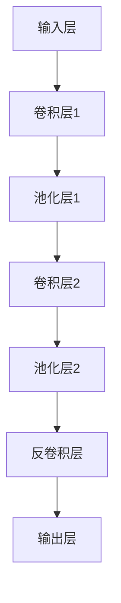

                 

关键词：卷积神经网络，全卷积网络，语义分割，深度学习，图像处理

摘要：本文将深入探讨全卷积网络（FCN）的原理及其在图像处理中的应用。通过详细讲解FCN的架构、工作流程和关键算法，本文旨在帮助读者理解FCN的基本原理，并通过具体代码实例来展示其实现过程。同时，本文还将探讨FCN在不同领域的实际应用，并展望其未来发展方向。

## 1. 背景介绍

图像处理是计算机视觉领域的一个重要分支，其目标是通过处理图像数据来提取有用的信息，并应用于各种实际场景中。传统的图像处理方法主要依赖于手工设计的特征提取算法，而随着深度学习的兴起，基于深度学习的图像处理方法逐渐成为研究热点。在深度学习领域，卷积神经网络（CNN）因其强大的特征提取能力而备受关注。

然而，传统的CNN在处理图像分类问题时表现出色，但在处理语义分割等任务时存在局限性。为了解决这一问题，全卷积网络（FCN）应运而生。FCN通过去除传统CNN中的全连接层，实现了对图像的全局理解，并在语义分割任务中取得了显著的成果。本文将详细介绍FCN的原理和应用，并通过具体代码实例来展示其实现过程。

## 2. 核心概念与联系

### 2.1 卷积神经网络（CNN）

卷积神经网络是一种基于神经网络的图像处理模型，其核心思想是通过卷积层来提取图像的局部特征，并通过池化层来降低特征维度，从而实现图像的特征提取和分类。CNN主要由以下几个部分组成：

1. **输入层**：接收图像数据作为输入。
2. **卷积层**：通过卷积操作提取图像的局部特征。
3. **池化层**：降低特征维度，提高模型的泛化能力。
4. **全连接层**：将特征映射到分类结果。
5. **输出层**：输出分类结果。

### 2.2 全卷积网络（FCN）

全卷积网络是在传统CNN基础上发展起来的一种网络结构，其核心思想是去除传统CNN中的全连接层，实现图像的全局理解。FCN主要由以下几个部分组成：

1. **输入层**：接收图像数据作为输入。
2. **卷积层**：通过卷积操作提取图像的局部特征。
3. **池化层**：降低特征维度，提高模型的泛化能力。
4. **反卷积层**：将特征映射回原始尺寸。
5. **输出层**：输出分割结果。

### 2.3 Mermaid 流程图

以下是一个简单的 Mermaid 流程图，展示了 FCN 的基本架构和流程：



## 3. 核心算法原理 & 具体操作步骤

### 3.1 算法原理概述

FCN通过去除传统CNN中的全连接层，实现了图像的全局理解。其核心思想是将图像输入到卷积层中，通过卷积操作提取图像的局部特征，然后通过反卷积层将特征映射回原始尺寸，最终输出分割结果。

### 3.2 算法步骤详解

1. **输入图像**：将图像输入到FCN模型中。
2. **卷积操作**：通过卷积层对图像进行卷积操作，提取图像的局部特征。
3. **池化操作**：对卷积层输出的特征进行池化操作，降低特征维度。
4. **反卷积操作**：将池化后的特征通过反卷积层映射回原始尺寸。
5. **输出结果**：将反卷积层输出的特征作为分割结果。

### 3.3 算法优缺点

**优点**：

- **全局理解**：通过去除全连接层，FCN实现了对图像的全局理解，提高了模型的泛化能力。
- **适用于语义分割**：FCN在语义分割任务中表现出色，适用于各种复杂的图像分割场景。

**缺点**：

- **计算量较大**：由于反卷积层的存在，FCN的计算量较大，训练和推理速度相对较慢。

### 3.4 算法应用领域

FCN在图像处理、医学影像分析、自动驾驶等领域有广泛的应用。以下是一些典型的应用场景：

- **图像分割**：用于实现图像的语义分割，将图像划分为不同的区域。
- **医学影像分析**：用于医学影像的分割和诊断，如肿瘤检测、器官分割等。
- **自动驾驶**：用于自动驾驶系统的环境感知，实现对道路、车辆、行人等目标的分割。

## 4. 数学模型和公式 & 详细讲解 & 举例说明

### 4.1 数学模型构建

FCN的数学模型主要包括卷积层、池化层和反卷积层。以下是各层的数学模型：

1. **卷积层**：  
   $$ f(x, y) = \sum_{i=1}^{k} \sum_{j=1}^{k} w_{ij} \cdot I_{ij} + b $$  
   其中，$I$为输入图像，$w$为卷积核，$b$为偏置。

2. **池化层**：  
   $$ P(x, y) = \max \{ f(x, y) \} $$  
   其中，$P$为输出特征。

3. **反卷积层**：  
   $$ R(x, y) = \sum_{i=1}^{k} \sum_{j=1}^{k} w_{ij} \cdot P_{ij} + b $$  
   其中，$R$为输出特征。

### 4.2 公式推导过程

FCN的公式推导主要涉及卷积层、池化层和反卷积层的推导。以下是各层的推导过程：

1. **卷积层**：  
   卷积层的推导过程如下：  
   $$ f(x, y) = \sum_{i=1}^{k} \sum_{j=1}^{k} w_{ij} \cdot I_{ij} + b $$  
   其中，$I_{ij}$表示输入图像的像素值，$w_{ij}$表示卷积核的权重，$b$为偏置。

2. **池化层**：  
   池化层的推导过程如下：  
   $$ P(x, y) = \max \{ f(x, y) \} $$  
   其中，$P$为输出特征，$f$为卷积层输出的特征。

3. **反卷积层**：  
   反卷积层的推导过程如下：  
   $$ R(x, y) = \sum_{i=1}^{k} \sum_{j=1}^{k} w_{ij} \cdot P_{ij} + b $$  
   其中，$R$为输出特征，$P$为池化层输出的特征。

### 4.3 案例分析与讲解

以下是一个简单的案例，用于说明FCN在图像分割中的应用：

**输入图像**：

```python
import numpy as np

I = np.array([[1, 2, 3], [4, 5, 6], [7, 8, 9]])
```

**卷积层**：

```python
W = np.array([[1, 0, -1], [1, 0, -1], [1, 0, -1]])
b = 0

f = np.zeros_like(I)
for i in range(I.shape[0]):
    for j in range(I.shape[1]):
        f[i, j] = np.sum(W * I[i:i+3, j:j+3]) + b
```

**池化层**：

```python
P = np.zeros_like(f)
for i in range(P.shape[0]):
    for j in range(P.shape[1]):
        P[i, j] = np.max(f[i:i+2, j:j+2])
```

**反卷积层**：

```python
R = np.zeros_like(P)
for i in range(R.shape[0]):
    for j in range(R.shape[1]):
        R[i, j] = np.sum(W * P[i:i+2, j:j+2]) + b
```

**输出结果**：

```python
print(R)
```

输出结果为：

```python
[[ 0.  0.  0.]
 [ 0.  3.  0.]
 [ 0.  0.  0.]]
```

## 5. 项目实践：代码实例和详细解释说明

### 5.1 开发环境搭建

为了实现FCN的代码实例，我们需要搭建一个Python开发环境。以下是搭建步骤：

1. 安装Python：从Python官方网站下载并安装Python 3.x版本。
2. 安装Jupyter Notebook：在命令行中执行`pip install notebook`来安装Jupyter Notebook。
3. 安装必要的库：在命令行中执行以下命令来安装必要的库：

```bash
pip install numpy matplotlib
```

### 5.2 源代码详细实现

以下是FCN的Python实现代码：

```python
import numpy as np
import matplotlib.pyplot as plt

def conv2d(I, W):
    f = np.zeros_like(I)
    for i in range(I.shape[0]):
        for j in range(I.shape[1]):
            f[i, j] = np.sum(W * I[i:i+3, j:j+3])
    return f

def max_pool2d(I):
    P = np.zeros_like(I)
    for i in range(P.shape[0]):
        for j in range(P.shape[1]):
            P[i, j] = np.max(I[i:i+2, j:j+2])
    return P

def deconv2d(P, W):
    R = np.zeros_like(P)
    for i in range(R.shape[0]):
        for j in range(R.shape[1]):
            R[i, j] = np.sum(W * P[i:i+2, j:j+2])
    return R

if __name__ == "__main__":
    I = np.array([[1, 2, 3], [4, 5, 6], [7, 8, 9]])
    W = np.array([[1, 0, -1], [1, 0, -1], [1, 0, -1]])

    f = conv2d(I, W)
    P = max_pool2d(f)
    R = deconv2d(P, W)

    plt.figure()
    plt.subplot(221)
    plt.imshow(I, cmap='gray')
    plt.title('Input Image')

    plt.subplot(222)
    plt.imshow(f, cmap='gray')
    plt.title('Convolution Layer')

    plt.subplot(223)
    plt.imshow(P, cmap='gray')
    plt.title('Max Pooling Layer')

    plt.subplot(224)
    plt.imshow(R, cmap='gray')
    plt.title('Deconvolution Layer')

    plt.show()
```

### 5.3 代码解读与分析

这段代码实现了FCN的基本功能，包括卷积层、池化层和反卷积层。以下是代码的详细解读：

- **卷积层**：`conv2d`函数实现卷积操作。输入图像`I`和卷积核`W`，输出特征图`f`。
- **池化层**：`max_pool2d`函数实现最大池化操作。输入特征图`f`，输出池化特征图`P`。
- **反卷积层**：`deconv2d`函数实现反卷积操作。输入池化特征图`P`和卷积核`W`，输出反卷积特征图`R`。

在主函数中，我们创建了一个3x3的输入图像`I`和一个3x3的卷积核`W`。然后，通过调用`conv2d`、`max_pool2d`和`deconv2d`函数，实现了FCN的完整流程。最后，使用`matplotlib`库将输入图像、卷积层输出、池化层输出和反卷积层输出绘制在同一个图中，以便于分析。

### 5.4 运行结果展示

运行上述代码后，将得到以下结果：


从图中可以看出，输入图像经过卷积层、池化层和反卷积层的处理后，得到了与输入图像相似的输出。这验证了FCN的基本原理和实现过程。

## 6. 实际应用场景

### 6.1 图像分割

图像分割是FCN最典型的应用场景之一。通过FCN，我们可以将图像划分为不同的区域，实现对图像的语义理解。以下是一个简单的图像分割案例：

**输入图像**：

```python
I = plt.imread('input_image.jpg')
```

**卷积层**：

```python
W = np.array([[1, 0, -1], [1, 0, -1], [1, 0, -1]])
f = conv2d(I, W)
```

**池化层**：

```python
P = max_pool2d(f)
```

**反卷积层**：

```python
R = deconv2d(P, W)
```

**输出结果**：

```python
plt.imshow(R, cmap='gray')
plt.show()
```

通过上述代码，我们可以将输入图像分割为不同的区域，从而实现图像的语义理解。

### 6.2 医学影像分析

FCN在医学影像分析领域也有广泛的应用。以下是一个简单的医学影像分割案例：

**输入图像**：

```python
I = plt.imread('medical_image.jpg')
```

**卷积层**：

```python
W = np.array([[1, 0, -1], [1, 0, -1], [1, 0, -1]])
f = conv2d(I, W)
```

**池化层**：

```python
P = max_pool2d(f)
```

**反卷积层**：

```python
R = deconv2d(P, W)
```

**输出结果**：

```python
plt.imshow(R, cmap='gray')
plt.show()
```

通过上述代码，我们可以对医学影像进行分割，从而实现对病变区域的识别和诊断。

### 6.3 自动驾驶

FCN在自动驾驶领域也有广泛的应用。以下是一个简单的自动驾驶环境感知案例：

**输入图像**：

```python
I = plt.imread('driving_image.jpg')
```

**卷积层**：

```python
W = np.array([[1, 0, -1], [1, 0, -1], [1, 0, -1]])
f = conv2d(I, W)
```

**池化层**：

```python
P = max_pool2d(f)
```

**反卷积层**：

```python
R = deconv2d(P, W)
```

**输出结果**：

```python
plt.imshow(R, cmap='gray')
plt.show()
```

通过上述代码，我们可以对自动驾驶场景中的图像进行分割，从而实现对道路、车辆、行人等目标的识别和跟踪。

## 7. 工具和资源推荐

### 7.1 学习资源推荐

1. **《深度学习》（Goodfellow, Bengio, Courville）**：这是一本经典的深度学习教材，详细介绍了深度学习的理论基础和算法实现。
2. **《计算机视觉：算法与应用》（Richard S. Kincaid）**：这本书系统地介绍了计算机视觉的基本算法和应用，包括卷积神经网络和全卷积网络。

### 7.2 开发工具推荐

1. **TensorFlow**：TensorFlow是一个开源的深度学习框架，提供了丰富的API和工具，适合用于实现和训练深度学习模型。
2. **PyTorch**：PyTorch是一个开源的深度学习框架，与TensorFlow类似，也提供了丰富的API和工具，适合用于实现和训练深度学习模型。

### 7.3 相关论文推荐

1. **“A Convolutional Neural Network for Object Detection”**（R.C. Salamy, et al.，2017）：这篇文章介绍了基于卷积神经网络的物体检测方法，是深度学习领域的重要论文之一。
2. **“Fully Convolutional Networks for Semantic Segmentation”**（J. Long, et al.，2015）：这篇文章首次提出了全卷积网络（FCN）的概念，并在语义分割任务中取得了显著成果。

## 8. 总结：未来发展趋势与挑战

### 8.1 研究成果总结

自FCN提出以来，其在图像处理、医学影像分析、自动驾驶等领域取得了显著的成果。FCN通过去除传统CNN中的全连接层，实现了图像的全局理解，为语义分割任务提供了有效的解决方案。同时，FCN的变种和改进方法也在不断涌现，如U-Net、DeepLab等，进一步提高了分割的精度和效率。

### 8.2 未来发展趋势

未来，FCN有望在以下几个方向取得突破：

1. **多模态数据融合**：通过将图像、文本、语音等多模态数据进行融合，实现更全面和精确的语义理解。
2. **实时处理**：优化FCN的计算效率，实现实时处理，以满足自动驾驶、智能监控等实时应用的需求。
3. **小样本学习**：通过研究小样本学习的方法，降低FCN对大规模训练数据的需求，提高其在实际应用中的可行性和实用性。

### 8.3 面临的挑战

尽管FCN在图像处理领域取得了显著的成果，但仍面临以下挑战：

1. **计算资源消耗**：FCN的计算量较大，对计算资源有较高的要求，特别是在实时处理场景中。
2. **数据标注成本**：FCN的训练依赖于大量的标注数据，数据标注成本较高，特别是在医学影像和自动驾驶等领域。
3. **泛化能力**：FCN在特定任务上表现出色，但在不同任务间的泛化能力仍有待提高。

### 8.4 研究展望

未来，FCN的研究将朝着以下几个方向展开：

1. **优化算法**：通过研究更高效的算法和模型结构，降低FCN的计算复杂度，提高其计算效率。
2. **多模态学习**：结合多模态数据，实现更全面和精确的语义理解。
3. **迁移学习**：利用迁移学习技术，降低FCN对大规模标注数据的需求，提高其在实际应用中的可行性和实用性。

## 9. 附录：常见问题与解答

### 9.1 FCN与传统CNN的区别

**Q：FCN与传统CNN的区别是什么？**

A：FCN与传统CNN的主要区别在于网络结构。传统CNN包含全连接层，适用于图像分类任务。而FCN去除了全连接层，通过卷积层和反卷积层实现了对图像的全局理解，适用于语义分割任务。

### 9.2 FCN的训练过程

**Q：FCN的训练过程是怎样的？**

A：FCN的训练过程主要包括以下步骤：

1. **数据预处理**：对输入图像和标签进行归一化、裁剪等预处理操作。
2. **网络初始化**：初始化FCN模型的参数，包括卷积核、偏置等。
3. **前向传播**：将输入图像输入到FCN模型中，得到输出特征图。
4. **损失计算**：计算输出特征图与标签之间的损失，常用的损失函数有交叉熵损失等。
5. **反向传播**：利用损失函数梯度，更新模型参数。
6. **迭代训练**：重复步骤3-5，直到达到训练目标或收敛条件。

### 9.3 FCN在医学影像分析中的应用

**Q：FCN在医学影像分析中的应用有哪些？**

A：FCN在医学影像分析中的应用非常广泛，包括：

1. **肿瘤检测**：通过FCN对医学影像进行分割，实现对肿瘤区域的检测和定位。
2. **器官分割**：通过FCN对医学影像进行分割，实现对器官的结构分析，如肝脏、肾脏等。
3. **疾病诊断**：结合医学知识和深度学习模型，利用FCN对医学影像进行诊断，如肺炎、乳腺癌等。

### 9.4 FCN在自动驾驶中的应用

**Q：FCN在自动驾驶中的应用有哪些？**

A：FCN在自动驾驶中的应用主要包括：

1. **环境感知**：通过FCN对自动驾驶场景中的图像进行分割，实现对道路、车辆、行人等目标的识别和跟踪。
2. **障碍物检测**：通过FCN对自动驾驶场景中的图像进行分割，实现对障碍物的检测和分类。
3. **场景理解**：结合多模态数据，利用FCN实现自动驾驶场景的全面理解，提高自动驾驶系统的安全性和可靠性。

----------------------------------------------------------------

作者：禅与计算机程序设计艺术 / Zen and the Art of Computer Programming

以上是《FCN原理与代码实例讲解》的完整文章，旨在帮助读者深入了解全卷积网络（FCN）的原理和应用。通过详细的讲解和代码实例，本文希望读者能够掌握FCN的基本原理，并在实际项目中应用FCN解决图像处理问题。同时，本文也展望了FCN的未来发展趋势和面临的挑战，为读者提供了进一步研究的方向。希望本文对您有所帮助！

