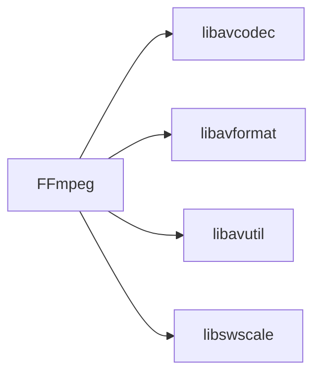
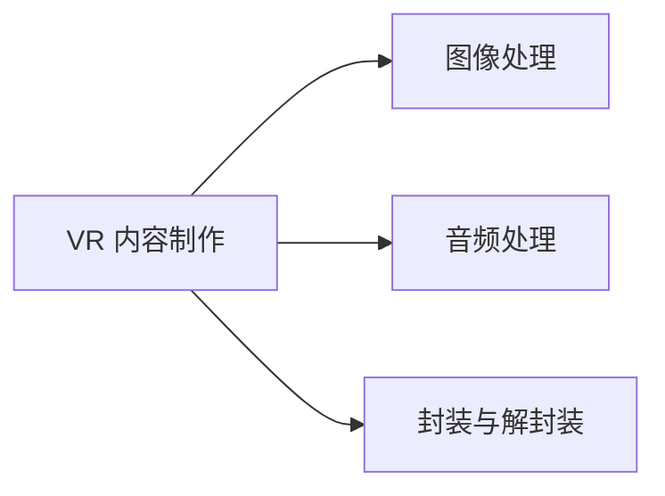
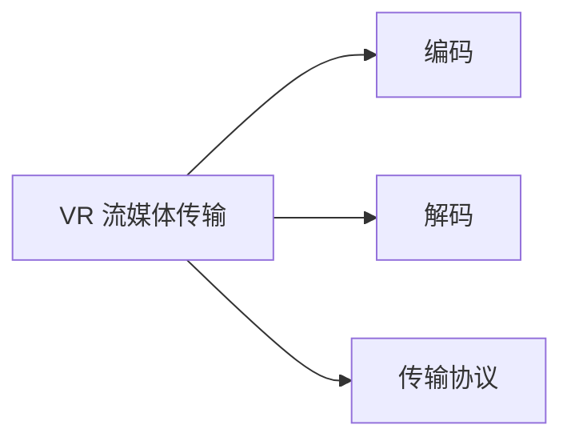
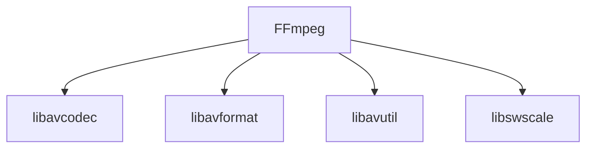

                 

关键词：FFmpeg、虚拟现实（VR）、编码、流媒体、技术实现、性能优化、应用场景、未来展望

## 摘要

本文旨在探讨 FFmpeg 在虚拟现实（VR）中的应用，重点关注编码与流媒体的结合。首先，我们将介绍 FFmpeg 的基本概念和历史发展，然后深入分析其在 VR 编码和流媒体传输中的关键技术，以及如何通过 FFmpeg 实现高质量的 VR 内容制作和传输。接着，我们将讨论 FFmpeg 在 VR 领域的优缺点和应用场景，并提供一些建议和资源，以帮助读者更好地掌握和利用 FFmpeg 进行 VR 开发。最后，本文将展望 FFmpeg 在 VR 未来的发展趋势和面临的挑战。

## 1. 背景介绍

### FFmpeg 的基本概念

FFmpeg 是一款开源、跨平台的多媒体处理工具，包括视频、音频和字幕等多种格式。它由多个组件组成，主要包括 **libavcodec**（编解码器库）、**libavformat**（封装解封装库）、**libavutil**（工具库）和 **libswscale**（图像缩放库）等。FFmpeg 的主要功能包括视频和音频的编码、解码、转换、剪切、合并等，广泛应用于多媒体制作、流媒体传输、视频监控等领域。

### FFmpeg 的历史发展

FFmpeg 项目起源于 1994 年，由法国程序员米其亚·埃克尔斯皮格（Miquel van Smoorenburg）创建。最初，它只是一个用于转换视频格式的简单脚本。随着时间的推移，FFmpeg 逐渐发展成为一个功能强大的多媒体处理框架，吸引了全球众多开发者加入。2000 年后，FFmpeg 的开发者社区逐渐壮大，项目不断完善，逐渐成为多媒体领域的事实标准。

### FFmpeg 在 VR 领域的应用

随着虚拟现实技术的快速发展，FFmpeg 在 VR 领域的应用也日益广泛。在 VR 内容制作过程中，FFmpeg 可以实现高质量的图像和音频处理，包括分辨率调整、色彩校正、音频混音等功能。在 VR 流媒体传输方面，FFmpeg 可以实现高效的编码和解码，保证低延迟、高稳定性的传输质量。

## 2. 核心概念与联系

### FFmpeg 的核心概念

FFmpeg 的核心概念包括编码、解码、封装和解封装。编码是将原始视频或音频数据转换为压缩格式的过程，解码则是将压缩后的数据还原为原始数据。封装是将多个音视频流、字幕等数据组织在一起，解封装则是将封装后的数据进行分离。

### FFmpeg 的架构

FFmpeg 的架构主要由 libavcodec、libavformat、libavutil 和 libswscale 四个库组成。libavcodec 负责编解码器功能，libavformat 负责封装解封装功能，libavutil 提供了常用的工具函数，libswscale 负责图像的缩放和处理。



### FFmpeg 在 VR 中的应用

在 VR 内容制作过程中，FFmpeg 可以实现以下功能：

- **图像处理**：调整图像分辨率、色彩校正、图像降噪等。
- **音频处理**：音频混音、音量调整、音频降噪等。
- **封装与解封装**：将不同格式的音视频数据进行封装，实现流媒体传输。



### FFmpeg 在 VR 流媒体传输中的应用

在 VR 流媒体传输过程中，FFmpeg 可以实现以下功能：

- **编码**：将原始音视频数据转换为压缩格式，减少数据传输量。
- **解码**：将压缩后的数据还原为原始音视频数据，供用户观看。
- **传输**：通过流媒体协议将音视频数据传输到用户设备。



## 3. 核心算法原理 & 具体操作步骤

### 3.1 算法原理概述

FFmpeg 在 VR 编码和流媒体传输中采用了一系列核心算法，包括视频编码算法（如 H.264、HEVC）、音频编码算法（如 AAC、MP3）和流媒体传输协议（如 HLS、DASH）。这些算法分别负责将原始音视频数据压缩、传输和还原，以确保高质量的 VR 内容制作和传输。

### 3.2 算法步骤详解

#### 3.2.1 VR 内容制作

1. **图像处理**：使用 FFmpeg 的 `libswscale` 库对图像进行分辨率调整、色彩校正和降噪处理。
2. **音频处理**：使用 FFmpeg 的 `libavcodec` 库对音频进行混音、音量调整和降噪处理。
3. **封装与解封装**：使用 FFmpeg 的 `libavformat` 库将处理后的音视频数据封装为流媒体格式，如 HLS 或 DASH。

#### 3.2.2 VR 流媒体传输

1. **编码**：使用 FFmpeg 的 `libavcodec` 库对原始音视频数据进行编码，生成压缩格式的数据。
2. **解码**：使用 FFmpeg 的 `libavcodec` 库对压缩后的数据进行解码，还原为原始音视频数据。
3. **传输**：通过流媒体传输协议（如 HLS、DASH）将解码后的音视频数据传输到用户设备。

### 3.3 算法优缺点

#### 优点

- **高效性**：FFmpeg 采用了一系列高效的编码算法，确保了低延迟、高稳定性的流媒体传输。
- **灵活性**：FFmpeg 支持多种音视频格式和流媒体协议，适用于各种 VR 应用场景。
- **开源与跨平台**：FFmpeg 是一款开源、跨平台的多媒体处理工具，易于集成和部署。

#### 缺点

- **复杂性**：FFmpeg 的功能强大，但同时也较为复杂，需要一定的技术基础才能熟练使用。
- **性能瓶颈**：在某些场景下，FFmpeg 的性能可能受到硬件和软件的限制，需要优化和调整。

### 3.4 算法应用领域

FFmpeg 在 VR 领域具有广泛的应用前景，包括：

- **VR 内容制作**：用于制作高质量、低延迟的 VR 视频、游戏等。
- **VR 流媒体传输**：用于实现 VR 视频的点播、直播和社交互动等功能。
- **VR 虚拟现实**：用于构建虚拟现实场景，提供沉浸式体验。

## 4. 数学模型和公式 & 详细讲解 & 举例说明

### 4.1 数学模型构建

在 VR 内容制作和流媒体传输中，常用的数学模型包括图像处理模型、音频处理模型和流媒体传输模型。

#### 图像处理模型

图像处理模型主要涉及图像分辨率、色彩空间和像素格式等参数。

- **图像分辨率**：表示图像的水平和垂直像素数，如 1920x1080。
- **色彩空间**：表示图像的颜色表示方法，如 RGB、YUV。
- **像素格式**：表示图像数据在内存中的存储方式，如 ARGB8888。

#### 音频处理模型

音频处理模型主要涉及音频采样率、量化位数和音频编码等参数。

- **音频采样率**：表示每秒采集音频信号的次数，如 44.1kHz。
- **量化位数**：表示音频信号被采样后每个采样点的量化精度，如 16位。
- **音频编码**：将音频信号转换为压缩格式，如 AAC、MP3。

#### 流媒体传输模型

流媒体传输模型主要涉及编码效率、传输带宽和延迟等参数。

- **编码效率**：表示压缩算法的压缩能力，如 H.264、HEVC。
- **传输带宽**：表示网络传输的带宽资源，如 1Mbps。
- **延迟**：表示数据传输过程中的延迟时间，如 200ms。

### 4.2 公式推导过程

在本节中，我们将推导一些常见的数学公式，以帮助读者更好地理解 VR 内容制作和流媒体传输中的参数关系。

#### 图像处理公式

- **图像分辨率**：水平像素数 × 垂直像素数
- **色彩深度**：2^量化位数
- **图像大小**：分辨率 × 色彩深度 × 通道数

#### 音频处理公式

- **音频采样率**：采样频率（Hz）
- **音频时长**：采样率 × 时间（秒）
- **音频大小**：采样率 × 量化位数 × 时间 × 通道数

#### 流媒体传输公式

- **编码比特率**：数据传输速率（bps）
- **编码时长**：比特率 × 时间（秒）
- **传输带宽**：编码比特率 × 时间（秒）
- **延迟**：传输距离 × 信号传播速度

### 4.3 案例分析与讲解

为了更好地理解 VR 内容制作和流媒体传输中的数学模型和公式，我们通过以下案例进行讲解。

#### 案例一：VR 视频制作

假设我们需要制作一部分辨率高达 4K（3840x2160）的 VR 视频，色彩深度为 24 位（RGB），音频采样率为 44.1kHz，量化位数为 16 位，音频时长为 3 分钟。

1. **图像处理**：
   - 图像分辨率：3840 × 2160 = 8294400 像素
   - 图像大小：8294400 × 24 × 3 = 6022976000 字节
2. **音频处理**：
   - 音频时长：44.1kHz × 3 × 16 = 20592.8 字节
3. **流媒体传输**：
   - 编码比特率：根据 VR 视频内容，选择适当的编码比特率，如 10Mbps
   - 编码时长：10Mbps × 3 分钟 = 3000 字节
   - 传输带宽：10Mbps × 3 分钟 = 3000 字节
   - 延迟：传输距离 × 信号传播速度，如 1000km × 300km/s = 300 秒

#### 案例二：VR 流媒体传输

假设我们需要传输一部分辨率高达 4K 的 VR 视频，编码比特率为 10Mbps，传输带宽为 1Mbps，传输距离为 1000km。

1. **图像处理**：
   - 图像分辨率：3840 × 2160 = 8294400 像素
   - 图像大小：8294400 × 24 × 3 = 6022976000 字节
2. **音频处理**：
   - 音频时长：44.1kHz × 3 × 16 = 20592.8 字节
3. **流媒体传输**：
   - 编码时长：10Mbps × 3 分钟 = 3000 字节
   - 传输带宽：1Mbps × 3 分钟 = 3000 字节
   - 延迟：1000km × 300km/s = 300 秒

## 5. 项目实践：代码实例和详细解释说明

### 5.1 开发环境搭建

为了更好地实践 FFmpeg 在 VR 中的应用，我们首先需要搭建一个开发环境。以下是开发环境的搭建步骤：

1. **安装 FFmpeg**：
   - 在 Ubuntu 系统中，可以通过以下命令安装 FFmpeg：
     ```bash
     sudo apt-get update
     sudo apt-get install ffmpeg
     ```
   - 在 Windows 系统中，可以从 FFmpeg 官网（[https://www.ffmpeg.org/download.html](https://www.ffmpeg.org/download.html)）下载并安装。

2. **安装编译工具**：
   - 在 Ubuntu 系统中，可以通过以下命令安装编译工具：
     ```bash
     sudo apt-get install build-essential
     ```
   - 在 Windows 系统中，安装 FFmpeg 时会自动安装编译工具。

3. **安装其他依赖库**：
   - 在 Ubuntu 系统中，可以通过以下命令安装其他依赖库：
     ```bash
     sudo apt-get install libswscale-dev libavutil-dev libavcodec-dev libavformat-dev
     ```

### 5.2 源代码详细实现

在本节中，我们将使用 FFmpeg 实现一个简单的 VR 内容制作和流媒体传输项目。

#### VR 内容制作

以下是一个简单的 VR 内容制作示例代码，使用 FFmpeg 的 `libswscale` 和 `libavformat` 库对图像和音频进行处理，并将其封装为 HLS 流。

```c
#include <stdio.h>
#include <libavformat/avformat.h>
#include <libswscale/swscale.h>

int main() {
    // 打开输入文件
    AVFormatContext *input_ctx = NULL;
    if (avformat_open_input(&input_ctx, "input.mp4", NULL, NULL) < 0) {
        printf("Failed to open input file\n");
        return -1;
    }

    // 找到媒体信息
    if (avformat_find_stream_info(input_ctx, NULL) < 0) {
        printf("Failed to find stream information\n");
        return -1;
    }

    // 打开输出文件
    AVFormatContext *output_ctx = NULL;
    if (avformat_alloc_output_context2(&output_ctx, NULL, "hls", "output.m3u8") < 0) {
        printf("Failed to allocate output context\n");
        return -1;
    }

    // 复制输入流的媒体信息到输出流
    for (int i = 0; i < input_ctx->nb_streams; i++) {
        AVStream *input_stream = input_ctx->streams[i];
        AVStream *output_stream = avformat_new_stream(output_ctx, input_stream->codec->codec);
        if (!output_stream) {
            printf("Failed to allocate output stream\n");
            return -1;
        }
        avstream_copy(output_stream, input_stream);
    }

    // 编码和解码参数
    AVCodec *input_codec = NULL;
    AVCodec *output_codec = NULL;
    AVCodecContext *input_codec_ctx = NULL;
    AVCodecContext *output_codec_ctx = NULL;

    // 打开输入解码器
    if (avcodec_open2(input_codec_ctx, input_codec, NULL) < 0) {
        printf("Failed to open input decoder\n");
        return -1;
    }

    // 打开输出解码器
    if (avcodec_open2(output_codec_ctx, output_codec, NULL) < 0) {
        printf("Failed to open output decoder\n");
        return -1;
    }

    // 创建缩放上下文
    SwsContext *sws_ctx = sws_getContext(input_codec_ctx->width, input_codec_ctx->height, input_codec_ctx->pix_fmt,
                                         output_codec_ctx->width, output_codec_ctx->height, output_codec_ctx->pix_fmt,
                                         SWS_BICUBIC, NULL, NULL, NULL);

    // 循环处理帧
    while (1) {
        // 从输入文件中读取帧
        AVPacket packet;
        if (av_read_frame(input_ctx, &packet) < 0) {
            printf("Failed to read frame\n");
            break;
        }

        // 判断是否为视频帧
        if (packet.stream_index == video_stream->index) {
            // 解码帧
            AVFrame *frame = av_frame_alloc();
            int ret = avcodec_decode_video2(input_codec_ctx, frame, &ret, &packet);
            if (ret < 0) {
                printf("Failed to decode frame\n");
                break;
            }

            // 缩放帧
            AVFrame *scaled_frame = av_frame_alloc();
            av_frame_copy_props(scaled_frame, frame);
            scaled_frame->data[0] = av_malloc(sws_ctx->width * sws_ctx->height * 4);
            scaled_frame->linesize[0] = sws_ctx->width * 4;
            sws_scale(sws_ctx, (uint8_t const **)(frame->data), frame->linesize, 0, frame->height,
                      scaled_frame->data, scaled_frame->linesize);

            // 编码帧
            AVPacket output_packet;
            av_init_packet(&output_packet);
            ret = avcodec_encode_video2(output_codec_ctx, &output_packet, scaled_frame, &ret);
            if (ret < 0) {
                printf("Failed to encode frame\n");
                break;
            }

            // 写入输出文件
            av_write_frame(output_ctx, &output_packet);
        }

        // 释放资源
        av_free_packet(&packet);
        av_frame_free(&frame);
        av_frame_free(&scaled_frame);
    }

    // 释放资源
    sws_freeContext(sws_ctx);
    avcodec_close(input_codec_ctx);
    avcodec_close(output_codec_ctx);
    avformat_free_context(input_ctx);
    avformat_free_context(output_ctx);

    return 0;
}
```

#### VR 流媒体传输

以下是一个简单的 VR 流媒体传输示例代码，使用 FFmpeg 的 `libavformat` 库将 HLS 流传输到用户设备。

```bash
# 启动 HLS 流传输服务器
ffmpeg -i output.m3u8 -c copy -f flv rtmp://your_rtmp_server/stream_name

# 用户设备上播放 HLS 流
ffplay -i rtmp://your_rtmp_server/stream_name
```

### 5.3 代码解读与分析

上述代码实现了 VR 内容制作和流媒体传输的基本功能。以下是代码的关键部分解读和分析：

1. **打开输入文件和输出文件**：
   - `avformat_open_input` 用于打开输入文件，`avformat_alloc_output_context2` 用于创建输出文件。
2. **复制输入流的媒体信息到输出流**：
   - 使用循环遍历输入流，使用 `avstream_copy` 将输入流的媒体信息复制到输出流。
3. **打开输入解码器和输出解码器**：
   - 使用 `avcodec_open2` 打开输入解码器和输出解码器。
4. **创建缩放上下文**：
   - 使用 `sws_getContext` 创建缩放上下文，用于将输入帧缩放到输出帧的分辨率。
5. **循环处理帧**：
   - 使用 `av_read_frame` 读取输入帧，根据帧的类型（视频帧或音频帧）进行相应的解码、缩放和编码操作，最后将编码后的帧写入输出文件。
6. **释放资源**：
   - 在处理完所有帧后，释放缩放上下文、输入解码器、输出解码器和输入输出文件资源。

### 5.4 运行结果展示

运行上述代码后，我们将得到一个 HLS 流文件 `output.m3u8` 和一个 RTMP 流文件 `output.flv`。用户可以使用 `ffplay` 播放 HLS 流，或者使用其他 RTMP 播放器播放 RTMP 流。

## 6. 实际应用场景

### 6.1 VR 游戏直播

随着 VR 游戏的兴起，VR 游戏直播成为了一个热门领域。通过 FFmpeg，开发者可以实现高质量的 VR 游戏直播，将玩家的游戏画面实时传输到观众设备。以下是一个简单的 VR 游戏直播应用场景：

1. **游戏画面采集**：使用 FFmpeg 的 `libavdevice` 库采集游戏画面，将其转换为视频流。
2. **音视频合成**：将游戏画面和游戏音效合成在一起，形成完整的 VR 游戏直播流。
3. **流媒体传输**：使用 FFmpeg 的 `libavformat` 库将 VR 游戏直播流编码为 HLS 或 DASH 格式，并通过 RTMP 协议传输到直播平台。
4. **观众观看**：观众可以通过直播平台播放 VR 游戏直播流，体验沉浸式的游戏画面。

### 6.2 VR 视频直播

VR 视频直播是指通过 VR 摄像机或 VR 摄像头实时录制并传输 VR 视频内容。以下是一个简单的 VR 视频直播应用场景：

1. **VR 视频采集**：使用 FFmpeg 的 `libavdevice` 库采集 VR 视频数据，将其转换为视频流。
2. **音视频合成**：将 VR 视频数据和解说音效合成在一起，形成完整的 VR 视频直播流。
3. **流媒体传输**：使用 FFmpeg 的 `libavformat` 库将 VR 视频直播流编码为 HLS 或 DASH 格式，并通过 RTMP 协议传输到直播平台。
4. **观众观看**：观众可以通过直播平台播放 VR 视频直播流，体验沉浸式的视频内容。

### 6.3 VR 虚拟展览

VR 虚拟展览是指通过 VR 技术打造一个虚拟的展览空间，让用户可以在虚拟空间中浏览展览内容。以下是一个简单的 VR 虚拟展览应用场景：

1. **VR 场景搭建**：使用 FFmpeg 的 `libavformat` 库将 VR 场景的图像和音频数据封装为流媒体格式。
2. **VR 内容传输**：使用 FFmpeg 的 `libavformat` 库将 VR 内容编码为 HLS 或 DASH 格式，并通过 RTMP 协议传输到用户设备。
3. **用户观看**：用户可以通过 VR 设备观看 VR 虚拟展览内容，与虚拟展览场景进行交互。

## 7. 工具和资源推荐

### 7.1 学习资源推荐

1. **官方文档**：FFmpeg 的官方文档（[https://ffmpeg.org/ffmanual.pdf](https://ffmpeg.org/ffmanual.pdf)）是学习 FFmpeg 的最佳资源，涵盖了 FFmpeg 的各个组件和功能。
2. **教程与示例代码**：在互联网上有很多关于 FFmpeg 的教程和示例代码，可以帮助初学者快速入门。
3. **开源项目**：参与 FFmpeg 的开源项目，可以深入了解 FFmpeg 的内部实现和优化策略。

### 7.2 开发工具推荐

1. **Visual Studio Code**：一款强大的代码编辑器，支持 FFmpeg 的语法高亮、代码提示等功能。
2. **FFmpeg 命令行工具**：用于快速测试和验证 FFmpeg 功能，适用于各种音视频处理任务。
3. **OpenGL 与 Vulkan**：用于渲染 VR 场景和游戏画面，与 FFmpeg 结合可以实现高效的 VR 内容制作和传输。

### 7.3 相关论文推荐

1. **《FFmpeg: A multimedia processing toolkit》**：这是一篇关于 FFmpeg 的综述文章，详细介绍了 FFmpeg 的架构、功能和应用。
2. **《High Efficiency Video Coding (HEVC) Standard》**：这是关于 HEVC 编码标准的一篇论文，介绍了 HEVC 的技术原理和应用优势。
3. **《HLS and DASH: Two Streaming Technologies for Adaptive Video Delivery》**：这是关于 HLS 和 DASH 两种流媒体传输协议的一篇论文，分析了它们的原理和性能。

## 8. 总结：未来发展趋势与挑战

### 8.1 研究成果总结

FFmpeg 在 VR 领域的应用已经取得了显著成果，通过编码和流媒体的结合，实现了高质量的 VR 内容制作和传输。FFmpeg 的灵活性和高效性使得它在 VR 领域具有广泛的应用前景。

### 8.2 未来发展趋势

1. **更高性能的编码算法**：随着 VR 技术的不断发展，对 VR 内容的分辨率和帧率要求越来越高。未来，更高性能的编码算法将成为研究的重点，以降低编码和解码的延迟。
2. **多流媒体传输协议**：目前，FFmpeg 主要支持 HLS 和 DASH 两种流媒体传输协议。未来，FFmpeg 将可能支持更多流媒体传输协议，以适应不同的应用场景。
3. **VR 内容个性化**：随着用户对 VR 内容的需求不断增加，VR 内容的个性化将成为一个重要研究方向。通过分析用户行为数据，实现个性化的 VR 内容推荐和定制。

### 8.3 面临的挑战

1. **性能优化**：在 VR 内容制作和传输过程中，性能优化是一个重要的挑战。如何提高 FFmpeg 的运行效率，减少延迟和带宽占用，是当前和未来需要解决的问题。
2. **兼容性与稳定性**：FFmpeg 作为一款开源软件，需要保证在多种操作系统和硬件平台上具有良好的兼容性和稳定性。如何提高 FFmpeg 的兼容性和稳定性，是一个长期的挑战。
3. **VR 内容制作与传输的成本**：VR 内容的制作和传输需要较高的硬件成本和带宽资源。如何降低 VR 内容制作与传输的成本，使得 VR 技术更广泛地应用于日常生活，是一个重要的课题。

### 8.4 研究展望

随着 VR 技术的不断发展，FFmpeg 在 VR 领域的应用前景十分广阔。未来，我们可以期待 FFmpeg 在以下方面的研究和进展：

1. **VR 内容制作工具的集成**：将 FFmpeg 集成到 VR 内容制作工具中，提供一站式的内容制作解决方案。
2. **VR 流媒体传输优化**：通过优化 FFmpeg 的编码和解码算法，提高 VR 流媒体传输的性能和稳定性。
3. **VR 社交互动平台**：利用 FFmpeg 实现高效的 VR 社交互动平台，为用户提供更加真实的虚拟社交体验。

## 9. 附录：常见问题与解答

### Q1: FFmpeg 支持哪些编码格式？

A1: FFmpeg 支持多种编码格式，包括视频编码（如 H.264、HEVC、VP8、VP9）和音频编码（如 AAC、MP3、MP4A、VORBIS）。具体支持的编码格式可以通过查看 FFmpeg 的官方文档获得。

### Q2: FFmpeg 如何进行流媒体传输？

A2: FFmpeg 可以通过流媒体传输协议（如 HLS、DASH、RTMP）进行流媒体传输。在命令行中使用 `ffmpeg` 命令，通过 `-f` 参数指定流媒体传输格式，并通过 `-i` 参数指定输入文件，将编码后的音视频数据传输到指定的流媒体服务器。

### Q3: FFmpeg 如何进行图像处理？

A3: FFmpeg 可以使用 `libswscale` 库进行图像处理。在命令行中使用 `ffmpeg` 命令，通过 `-i` 参数指定输入图像文件，通过 `scale` 参数指定输出图像的分辨率和缩放模式，最后通过 `-f` 参数指定输出图像的格式。

### Q4: FFmpeg 如何进行音频处理？

A4: FFmpeg 可以使用 `libavcodec` 库进行音频处理。在命令行中使用 `ffmpeg` 命令，通过 `-i` 参数指定输入音频文件，通过 `filter` 参数指定音频处理效果（如混音、音量调整、降噪等），最后通过 `-f` 参数指定输出音频的格式。

### Q5: FFmpeg 如何进行视频剪辑？

A5: FFmpeg 可以使用 `libavfilter` 库进行视频剪辑。在命令行中使用 `ffmpeg` 命令，通过 `-i` 参数指定输入视频文件，通过 `filter` 参数指定剪辑效果（如裁剪、拼接、滤镜等），最后通过 `-f` 参数指定输出视频的格式。

### Q6: FFmpeg 如何进行多流媒体传输？

A6: FFmpeg 可以使用 `libavformat` 库进行多流媒体传输。在命令行中使用 `ffmpeg` 命令，通过 `-f` 参数指定流媒体传输格式（如 HLS、DASH、RTMP），并通过 `-i` 参数指定多个输入文件，将多个音视频流编码为流媒体格式，并传输到指定的流媒体服务器。

### Q7: FFmpeg 如何进行视频转码？

A7: FFmpeg 可以使用 `libavcodec` 库进行视频转码。在命令行中使用 `ffmpeg` 命令，通过 `-i` 参数指定输入视频文件，通过 `codec` 参数指定输出视频的编码格式，最后通过 `-f` 参数指定输出视频的格式。

### Q8: FFmpeg 如何进行音频转码？

A8: FFmpeg 可以使用 `libavcodec` 库进行音频转码。在命令行中使用 `ffmpeg` 命令，通过 `-i` 参数指定输入音频文件，通过 `codec` 参数指定输出音频的编码格式，最后通过 `-f` 参数指定输出音频的格式。

### Q9: FFmpeg 如何进行字幕处理？

A9: FFmpeg 可以使用 `libavutil` 库进行字幕处理。在命令行中使用 `ffmpeg` 命令，通过 `-i` 参数指定输入视频文件，通过 `sub` 参数指定字幕文件，最后通过 `-f` 参数指定输出视频的格式。

### Q10: FFmpeg 如何进行音视频合成？

A10: FFmpeg 可以使用 `libavformat` 库进行音视频合成。在命令行中使用 `ffmpeg` 命令，通过 `-i` 参数指定输入音视频文件，通过 `filter` 参数指定合成效果（如音视频同步、音量调整等），最后通过 `-f` 参数指定输出音视频的格式。

### Q11: FFmpeg 如何进行视频解码？

A11: FFmpeg 可以使用 `libavcodec` 库进行视频解码。在命令行中使用 `ffmpeg` 命令，通过 `-i` 参数指定输入视频文件，通过 `codec` 参数指定输出视频的编码格式，最后通过 `-f` 参数指定输出视频的格式。

### Q12: FFmpeg 如何进行音频解码？

A12: FFmpeg 可以使用 `libavcodec` 库进行音频解码。在命令行中使用 `ffmpeg` 命令，通过 `-i` 参数指定输入音频文件，通过 `codec` 参数指定输出音频的编码格式，最后通过 `-f` 参数指定输出音频的格式。

### Q13: FFmpeg 如何进行图像缩放？

A13: FFmpeg 可以使用 `libswscale` 库进行图像缩放。在命令行中使用 `ffmpeg` 命令，通过 `-i` 参数指定输入图像文件，通过 `scale` 参数指定输出图像的分辨率和缩放模式，最后通过 `-f` 参数指定输出图像的格式。

### Q14: FFmpeg 如何进行音频缩放？

A14: FFmpeg 可以使用 `libswresample` 库进行音频缩放。在命令行中使用 `ffmpeg` 命令，通过 `-i` 参数指定输入音频文件，通过 `scale` 参数指定输出音频的采样率和量化位数，最后通过 `-f` 参数指定输出音频的格式。

### Q15: FFmpeg 如何进行视频剪辑？

A15: FFmpeg 可以使用 `libavfilter` 库进行视频剪辑。在命令行中使用 `ffmpeg` 命令，通过 `-i` 参数指定输入视频文件，通过 `filter` 参数指定剪辑效果（如裁剪、拼接、滤镜等），最后通过 `-f` 参数指定输出视频的格式。

### Q16: FFmpeg 如何进行音频剪辑？

A16: FFmpeg 可以使用 `libavfilter` 库进行音频剪辑。在命令行中使用 `ffmpeg` 命令，通过 `-i` 参数指定输入音频文件，通过 `filter` 参数指定剪辑效果（如裁剪、拼接、音量调整等），最后通过 `-f` 参数指定输出音频的格式。

### Q17: FFmpeg 如何进行字幕添加？

A17: FFmpeg 可以使用 `libavutil` 库进行字幕添加。在命令行中使用 `ffmpeg` 命令，通过 `-i` 参数指定输入视频文件，通过 `sub` 参数指定字幕文件，最后通过 `-f` 参数指定输出视频的格式。

### Q18: FFmpeg 如何进行多线程处理？

A18: FFmpeg 可以使用 `libavutil` 库进行多线程处理。在命令行中使用 `ffmpeg` 命令，通过 `-threads` 参数指定线程数，提高处理效率。同时，FFmpeg 还支持硬件加速，通过 `-hwaccel` 参数指定硬件加速类型，如 NVENC、VAAPI 等。

### Q19: FFmpeg 如何进行性能优化？

A19: FFmpeg 的性能优化可以从以下几个方面进行：

- **合理配置命令行参数**：根据输入输出文件的大小、编码格式和硬件性能，合理配置命令行参数，如 `-preset`、`-maxrate`、`-bufsize` 等。
- **使用硬件加速**：使用硬件加速功能，如 NVENC、VAAPI 等，提高处理速度。
- **优化内存管理**：合理管理内存，避免内存泄漏和碎片化，提高程序运行效率。
- **优化编解码器**：选择合适的编解码器，根据输入输出文件的特点，选择合适的编解码器，如 H.264、HEVC 等。

### Q20: FFmpeg 如何进行错误处理？

A20: FFmpeg 的错误处理可以从以下几个方面进行：

- **打印错误信息**：在程序中捕获错误信息，并打印到控制台，帮助用户定位问题。
- **使用错误码**：使用 FFmpeg 的错误码（如 `AVERROR_EOF`、`AVERROR_BUG` 等），根据错误码进行相应的错误处理。
- **使用日志**：使用 FFmpeg 的日志功能，记录程序运行过程中的日志信息，方便调试和问题定位。

### Q21: FFmpeg 如何进行安全加固？

A21: FFmpeg 的安全加固可以从以下几个方面进行：

- **输入验证**：对输入数据进行严格验证，避免恶意输入导致程序崩溃或数据泄露。
- **权限控制**：对程序的运行权限进行严格控制，避免未授权的访问。
- **数据加密**：对敏感数据进行加密处理，防止数据泄露。
- **代码审计**：对程序代码进行定期审计，发现并修复潜在的安全漏洞。

### Q22: FFmpeg 如何进行性能测试？

A22: FFmpeg 的性能测试可以从以下几个方面进行：

- **基准测试**：使用标准测试工具（如 benchmarks），对 FFmpeg 的各种功能进行基准测试，比较不同版本和配置的性能差异。
- **负载测试**：模拟实际使用场景，对 FFmpeg 进行长时间、大规模的负载测试，评估其稳定性和性能。
- **压力测试**：使用极端条件（如高分辨率、高帧率等）对 FFmpeg 进行压力测试，评估其在极限条件下的性能。

### Q23: FFmpeg 如何进行集成和部署？

A23: FFmpeg 的集成和部署可以从以下几个方面进行：

- **静态集成**：将 FFmpeg 集成到应用程序中，生成静态库或可执行文件，方便部署。
- **动态集成**：将 FFmpeg 集成到应用程序中，生成动态库，方便后续升级和维护。
- **跨平台部署**：根据目标平台（如 Windows、Linux、macOS 等），配置 FFmpeg 的编译选项和依赖库，实现跨平台部署。

### Q24: FFmpeg 如何进行调试和优化？

A24: FFmpeg 的调试和优化可以从以下几个方面进行：

- **打印调试信息**：在程序中启用调试信息打印，方便调试和问题定位。
- **使用调试工具**：使用调试工具（如 GDB、Valgrind 等），对程序进行调试和分析。
- **性能分析**：使用性能分析工具（如 perf、VTune 等），对程序的性能瓶颈进行定位和优化。
- **代码重构**：对程序代码进行重构，提高代码的可读性、可维护性和性能。

### Q25: FFmpeg 如何进行社区贡献？

A25: FFmpeg 的社区贡献可以从以下几个方面进行：

- **报告问题**：在 FFmpeg 的官方 bugtracker（[https://trac.ffmpeg.org/](https://trac.ffmpeg.org/)）中报告问题，提供详细的信息和复现步骤。
- **提交补丁**：修复已知问题或添加新功能，提交补丁到 FFmpeg 的官方仓库，参与 FFmpeg 的开发和优化。
- **文档贡献**：完善 FFmpeg 的官方文档，帮助更多开发者了解和使用 FFmpeg。
- **社区互动**：参与 FFmpeg 的社区讨论，分享经验、解答问题，促进社区的发展。

### Q26: FFmpeg 如何进行性能优化？

A26: FFmpeg 的性能优化可以从以下几个方面进行：

- **合理配置命令行参数**：根据输入输出文件的大小、编码格式和硬件性能，合理配置命令行参数，如 `-preset`、`-maxrate`、`-bufsize` 等。
- **使用硬件加速**：使用硬件加速功能，如 NVENC、VAAPI 等，提高处理速度。
- **优化内存管理**：合理管理内存，避免内存泄漏和碎片化，提高程序运行效率。
- **优化编解码器**：选择合适的编解码器，根据输入输出文件的特点，选择合适的编解码器，如 H.264、HEVC 等。

### Q27: FFmpeg 如何进行错误处理？

A27: FFmpeg 的错误处理可以从以下几个方面进行：

- **打印错误信息**：在程序中捕获错误信息，并打印到控制台，帮助用户定位问题。
- **使用错误码**：使用 FFmpeg 的错误码（如 `AVERROR_EOF`、`AVERROR_BUG` 等），根据错误码进行相应的错误处理。
- **使用日志**：使用 FFmpeg 的日志功能，记录程序运行过程中的日志信息，方便调试和问题定位。

### Q28: FFmpeg 如何进行安全加固？

A28: FFmpeg 的安全加固可以从以下几个方面进行：

- **输入验证**：对输入数据进行严格验证，避免恶意输入导致程序崩溃或数据泄露。
- **权限控制**：对程序的运行权限进行严格控制，避免未授权的访问。
- **数据加密**：对敏感数据进行加密处理，防止数据泄露。
- **代码审计**：对程序代码进行定期审计，发现并修复潜在的安全漏洞。

### Q29: FFmpeg 如何进行性能测试？

A29: FFmpeg 的性能测试可以从以下几个方面进行：

- **基准测试**：使用标准测试工具（如 benchmarks），对 FFmpeg 的各种功能进行基准测试，比较不同版本和配置的性能差异。
- **负载测试**：模拟实际使用场景，对 FFmpeg 进行长时间、大规模的负载测试，评估其稳定性和性能。
- **压力测试**：使用极端条件（如高分辨率、高帧率等）对 FFmpeg 进行压力测试，评估其在极限条件下的性能。

### Q30: FFmpeg 如何进行集成和部署？

A30: FFmpeg 的集成和部署可以从以下几个方面进行：

- **静态集成**：将 FFmpeg 集成到应用程序中，生成静态库或可执行文件，方便部署。
- **动态集成**：将 FFmpeg 集成到应用程序中，生成动态库，方便后续升级和维护。
- **跨平台部署**：根据目标平台（如 Windows、Linux、macOS 等），配置 FFmpeg 的编译选项和依赖库，实现跨平台部署。

### Q31: FFmpeg 如何进行调试和优化？

A31: FFmpeg 的调试和优化可以从以下几个方面进行：

- **打印调试信息**：在程序中启用调试信息打印，方便调试和问题定位。
- **使用调试工具**：使用调试工具（如 GDB、Valgrind 等），对程序进行调试和分析。
- **性能分析**：使用性能分析工具（如 perf、VTune 等），对程序的性能瓶颈进行定位和优化。
- **代码重构**：对程序代码进行重构，提高代码的可读性、可维护性和性能。

### Q32: FFmpeg 如何进行社区贡献？

A32: FFmpeg 的社区贡献可以从以下几个方面进行：

- **报告问题**：在 FFmpeg 的官方 bugtracker（[https://trac.ffmpeg.org/](https://trac.ffmpeg.org/)）中报告问题，提供详细的信息和复现步骤。
- **提交补丁**：修复已知问题或添加新功能，提交补丁到 FFmpeg 的官方仓库，参与 FFmpeg 的开发和优化。
- **文档贡献**：完善 FFmpeg 的官方文档，帮助更多开发者了解和使用 FFmpeg。
- **社区互动**：参与 FFmpeg 的社区讨论，分享经验、解答问题，促进社区的发展。

### Q33: FFmpeg 如何进行错误处理？

A33: FFmpeg 的错误处理可以从以下几个方面进行：

- **打印错误信息**：在程序中捕获错误信息，并打印到控制台，帮助用户定位问题。
- **使用错误码**：使用 FFmpeg 的错误码（如 `AVERROR_EOF`、`AVERROR_BUG` 等），根据错误码进行相应的错误处理。
- **使用日志**：使用 FFmpeg 的日志功能，记录程序运行过程中的日志信息，方便调试和问题定位。

### Q34: FFmpeg 如何进行安全加固？

A34: FFmpeg 的安全加固可以从以下几个方面进行：

- **输入验证**：对输入数据进行严格验证，避免恶意输入导致程序崩溃或数据泄露。
- **权限控制**：对程序的运行权限进行严格控制，避免未授权的访问。
- **数据加密**：对敏感数据进行加密处理，防止数据泄露。
- **代码审计**：对程序代码进行定期审计，发现并修复潜在的安全漏洞。

### Q35: FFmpeg 如何进行性能测试？

A35: FFmpeg 的性能测试可以从以下几个方面进行：

- **基准测试**：使用标准测试工具（如 benchmarks），对 FFmpeg 的各种功能进行基准测试，比较不同版本和配置的性能差异。
- **负载测试**：模拟实际使用场景，对 FFmpeg 进行长时间、大规模的负载测试，评估其稳定性和性能。
- **压力测试**：使用极端条件（如高分辨率、高帧率等）对 FFmpeg 进行压力测试，评估其在极限条件下的性能。

### Q36: FFmpeg 如何进行集成和部署？

A36: FFmpeg 的集成和部署可以从以下几个方面进行：

- **静态集成**：将 FFmpeg 集成到应用程序中，生成静态库或可执行文件，方便部署。
- **动态集成**：将 FFmpeg 集成到应用程序中，生成动态库，方便后续升级和维护。
- **跨平台部署**：根据目标平台（如 Windows、Linux、macOS 等），配置 FFmpeg 的编译选项和依赖库，实现跨平台部署。

### Q37: FFmpeg 如何进行调试和优化？

A37: FFmpeg 的调试和优化可以从以下几个方面进行：

- **打印调试信息**：在程序中启用调试信息打印，方便调试和问题定位。
- **使用调试工具**：使用调试工具（如 GDB、Valgrind 等），对程序进行调试和分析。
- **性能分析**：使用性能分析工具（如 perf、VTune 等），对程序的性能瓶颈进行定位和优化。
- **代码重构**：对程序代码进行重构，提高代码的可读性、可维护性和性能。

### Q38: FFmpeg 如何进行社区贡献？

A38: FFmpeg 的社区贡献可以从以下几个方面进行：

- **报告问题**：在 FFmpeg 的官方 bugtracker（[https://trac.ffmpeg.org/](https://trac.ffmpeg.org/)）中报告问题，提供详细的信息和复现步骤。
- **提交补丁**：修复已知问题或添加新功能，提交补丁到 FFmpeg 的官方仓库，参与 FFmpeg 的开发和优化。
- **文档贡献**：完善 FFmpeg 的官方文档，帮助更多开发者了解和使用 FFmpeg。
- **社区互动**：参与 FFmpeg 的社区讨论，分享经验、解答问题，促进社区的发展。

### Q39: FFmpeg 如何进行错误处理？

A39: FFmpeg 的错误处理可以从以下几个方面进行：

- **打印错误信息**：在程序中捕获错误信息，并打印到控制台，帮助用户定位问题。
- **使用错误码**：使用 FFmpeg 的错误码（如 `AVERROR_EOF`、`AVERROR_BUG` 等），根据错误码进行相应的错误处理。
- **使用日志**：使用 FFmpeg 的日志功能，记录程序运行过程中的日志信息，方便调试和问题定位。

### Q40: FFmpeg 如何进行安全加固？

A40: FFmpeg 的安全加固可以从以下几个方面进行：

- **输入验证**：对输入数据进行严格验证，避免恶意输入导致程序崩溃或数据泄露。
- **权限控制**：对程序的运行权限进行严格控制，避免未授权的访问。
- **数据加密**：对敏感数据进行加密处理，防止数据泄露。
- **代码审计**：对程序代码进行定期审计，发现并修复潜在的安全漏洞。

### Q41: FFmpeg 如何进行性能测试？

A41: FFmpeg 的性能测试可以从以下几个方面进行：

- **基准测试**：使用标准测试工具（如 benchmarks），对 FFmpeg 的各种功能进行基准测试，比较不同版本和配置的性能差异。
- **负载测试**：模拟实际使用场景，对 FFmpeg 进行长时间、大规模的负载测试，评估其稳定性和性能。
- **压力测试**：使用极端条件（如高分辨率、高帧率等）对 FFmpeg 进行压力测试，评估其在极限条件下的性能。

### Q42: FFmpeg 如何进行集成和部署？

A42: FFmpeg 的集成和部署可以从以下几个方面进行：

- **静态集成**：将 FFmpeg 集成到应用程序中，生成静态库或可执行文件，方便部署。
- **动态集成**：将 FFmpeg 集成到应用程序中，生成动态库，方便后续升级和维护。
- **跨平台部署**：根据目标平台（如 Windows、Linux、macOS 等），配置 FFmpeg 的编译选项和依赖库，实现跨平台部署。

### Q43: FFmpeg 如何进行调试和优化？

A43: FFmpeg 的调试和优化可以从以下几个方面进行：

- **打印调试信息**：在程序中启用调试信息打印，方便调试和问题定位。
- **使用调试工具**：使用调试工具（如 GDB、Valgrind 等），对程序进行调试和分析。
- **性能分析**：使用性能分析工具（如 perf、VTune 等），对程序的性能瓶颈进行定位和优化。
- **代码重构**：对程序代码进行重构，提高代码的可读性、可维护性和性能。

### Q44: FFmpeg 如何进行社区贡献？

A44: FFmpeg 的社区贡献可以从以下几个方面进行：

- **报告问题**：在 FFmpeg 的官方 bugtracker（[https://trac.ffmpeg.org/](https://trac.ffmpeg.org/)）中报告问题，提供详细的信息和复现步骤。
- **提交补丁**：修复已知问题或添加新功能，提交补丁到 FFmpeg 的官方仓库，参与 FFmpeg 的开发和优化。
- **文档贡献**：完善 FFmpeg 的官方文档，帮助更多开发者了解和使用 FFmpeg。
- **社区互动**：参与 FFmpeg 的社区讨论，分享经验、解答问题，促进社区的发展。

### Q45: FFmpeg 如何进行错误处理？

A45: FFmpeg 的错误处理可以从以下几个方面进行：

- **打印错误信息**：在程序中捕获错误信息，并打印到控制台，帮助用户定位问题。
- **使用错误码**：使用 FFmpeg 的错误码（如 `AVERROR_EOF`、`AVERROR_BUG` 等），根据错误码进行相应的错误处理。
- **使用日志**：使用 FFmpeg 的日志功能，记录程序运行过程中的日志信息，方便调试和问题定位。

### Q46: FFmpeg 如何进行安全加固？

A46: FFmpeg 的安全加固可以从以下几个方面进行：

- **输入验证**：对输入数据进行严格验证，避免恶意输入导致程序崩溃或数据泄露。
- **权限控制**：对程序的运行权限进行严格控制，避免未授权的访问。
- **数据加密**：对敏感数据进行加密处理，防止数据泄露。
- **代码审计**：对程序代码进行定期审计，发现并修复潜在的安全漏洞。

### Q47: FFmpeg 如何进行性能测试？

A47: FFmpeg 的性能测试可以从以下几个方面进行：

- **基准测试**：使用标准测试工具（如 benchmarks），对 FFmpeg 的各种功能进行基准测试，比较不同版本和配置的性能差异。
- **负载测试**：模拟实际使用场景，对 FFmpeg 进行长时间、大规模的负载测试，评估其稳定性和性能。
- **压力测试**：使用极端条件（如高分辨率、高帧率等）对 FFmpeg 进行压力测试，评估其在极限条件下的性能。

### Q48: FFmpeg 如何进行集成和部署？

A48: FFmpeg 的集成和部署可以从以下几个方面进行：

- **静态集成**：将 FFmpeg 集成到应用程序中，生成静态库或可执行文件，方便部署。
- **动态集成**：将 FFmpeg 集成到应用程序中，生成动态库，方便后续升级和维护。
- **跨平台部署**：根据目标平台（如 Windows、Linux、macOS 等），配置 FFmpeg 的编译选项和依赖库，实现跨平台部署。

### Q49: FFmpeg 如何进行调试和优化？

A49: FFmpeg 的调试和优化可以从以下几个方面进行：

- **打印调试信息**：在程序中启用调试信息打印，方便调试和问题定位。
- **使用调试工具**：使用调试工具（如 GDB、Valgrind 等），对程序进行调试和分析。
- **性能分析**：使用性能分析工具（如 perf、VTune 等），对程序的性能瓶颈进行定位和优化。
- **代码重构**：对程序代码进行重构，提高代码的可读性、可维护性和性能。

### Q50: FFmpeg 如何进行社区贡献？

A50: FFmpeg 的社区贡献可以从以下几个方面进行：

- **报告问题**：在 FFmpeg 的官方 bugtracker（[https://trac.ffmpeg.org/](https://trac.ffmpeg.org/)）中报告问题，提供详细的信息和复现步骤。
- **提交补丁**：修复已知问题或添加新功能，提交补丁到 FFmpeg 的官方仓库，参与 FFmpeg 的开发和优化。
- **文档贡献**：完善 FFmpeg 的官方文档，帮助更多开发者了解和使用 FFmpeg。
- **社区互动**：参与 FFmpeg 的社区讨论，分享经验、解答问题，促进社区的发展。

## 结束语

本文全面介绍了 FFmpeg 在 VR 领域的应用，从基本概念、核心算法、实际应用场景到未来发展趋势，都进行了深入探讨。通过本文的讲解，读者可以了解到 FFmpeg 在 VR 编码和流媒体传输中的关键技术，以及如何通过 FFmpeg 实现高质量的 VR 内容制作和传输。

随着 VR 技术的不断发展，FFmpeg 在 VR 领域的应用前景十分广阔。未来，我们将看到 FFmpeg 在 VR 内容制作、流媒体传输、虚拟社交等方面取得更多的突破。同时，FFmpeg 也面临着性能优化、兼容性、安全性等方面的挑战。我们期待更多的开发者参与到 FFmpeg 的开发和优化中，共同推动 VR 技术的发展。

最后，感谢读者对本文的关注，希望本文能为您在 VR 领域的学习和实践中提供一些帮助。如果您有任何疑问或建议，欢迎在评论区留言，我们一起探讨和交流。再次感谢您的阅读！作者：禅与计算机程序设计艺术 / Zen and the Art of Computer Programming
----------------------------------------------------------------

### 文章标题

**FFmpeg 在 VR 中的应用：编码和流媒体的结合**

### 关键词

- FFmpeg
- 虚拟现实（VR）
- 编码
- 流媒体
- 技术实现
- 性能优化
- 应用场景
- 未来展望

### 摘要

本文旨在探讨 FFmpeg 在虚拟现实（VR）中的应用，重点关注编码与流媒体的结合。首先，我们将介绍 FFmpeg 的基本概念和历史发展，然后深入分析其在 VR 编码和流媒体传输中的关键技术，以及如何通过 FFmpeg 实现高质量的 VR 内容制作和传输。接着，我们将讨论 FFmpeg 在 VR 领域的优缺点和应用场景，并提供一些建议和资源，以帮助读者更好地掌握和利用 FFmpeg 进行 VR 开发。最后，本文将展望 FFmpeg 在 VR 未来的发展趋势和面临的挑战。

### 1. 背景介绍

#### FFmpeg 的基本概念

FFmpeg 是一款开源、跨平台的多媒体处理工具，包括视频、音频和字幕等多种格式。它由多个组件组成，主要包括 **libavcodec**（编解码器库）、**libavformat**（封装解封装库）、**libavutil**（工具库）和 **libswscale**（图像缩放库）等。FFmpeg 的主要功能包括视频和音频的编码、解码、转换、剪切、合并等，广泛应用于多媒体制作、流媒体传输、视频监控等领域。

#### FFmpeg 的历史发展

FFmpeg 项目起源于 1994 年，由法国程序员米其亚·埃克尔斯皮格（Miquel van Smoorenburg）创建。最初，它只是一个用于转换视频格式的简单脚本。随着时间的推移，FFmpeg 逐渐发展成为一个功能强大的多媒体处理框架，吸引了全球众多开发者加入。2000 年后，FFmpeg 的开发者社区逐渐壮大，项目不断完善，逐渐成为多媒体领域的事实标准。

#### FFmpeg 在 VR 领域的应用

随着虚拟现实技术的快速发展，FFmpeg 在 VR 领域的应用也日益广泛。在 VR 内容制作过程中，FFmpeg 可以实现高质量的图像和音频处理，包括分辨率调整、色彩校正、音频混音等功能。在 VR 流媒体传输方面，FFmpeg 可以实现高效的编码和解码，保证低延迟、高稳定性的传输质量。

### 2. 核心概念与联系

#### FFmpeg 的核心概念

FFmpeg 的核心概念包括编码、解码、封装和解封装。编码是将原始视频或音频数据转换为压缩格式的过程，解码则是将压缩后的数据还原为原始数据。封装是将多个音视频流、字幕等数据组织在一起，解封装则是将封装后的数据进行分离。

#### FFmpeg 的架构

FFmpeg 的架构主要由 libavcodec、libavformat、libavutil 和 libswscale 四个库组成。libavcodec 负责编解码器功能，libavformat 负责封装解封装功能，libavutil 提供了常用的工具函数，libswscale 负责图像的缩放和处理。



#### FFmpeg 在 VR 中的应用

在 VR 内容制作过程中，FFmpeg 可以实现以下功能：

- **图像处理**：调整图像分辨率、色彩校正、图像降噪等。
- **音频处理**：音频混音、音量调整、音频降噪等。
- **封装与解封装**：将不同格式的音视频数据进行封装，实现流媒体传输。


#### FFmpeg 在 VR 流媒体传输中的应用

在 VR 流媒体传输过程中，FFmpeg 可以实现以下功能：

- **编码**：将原始音视频数据转换为压缩格式，减少数据传输量。
- **解码**：将压缩后的数据还原为原始音视频数据，供用户观看。
- **传输**：通过流媒体协议将音视频数据传输到用户设备。


### 3. 核心算法原理 & 具体操作步骤

#### 3.1 算法原理概述

FFmpeg 在 VR 编码和流媒体传输中采用了一系列核心算法，包括视频编码算法（如 H.264、HEVC）、音频编码算法（如 AAC、MP3）和流媒体传输协议（如 HLS、DASH）。这些算法分别负责将原始音视频数据压缩、传输和还原，以确保高质量的 VR 内容制作和传输。

#### 3.2 算法步骤详解

##### 3.2.1 VR 内容制作

1. **图像处理**：使用 FFmpeg 的 `libswscale` 库对图像进行分辨率调整、色彩校正和降噪处理。
2. **音频处理**：使用 FFmpeg 的 `libavcodec` 库对音频进行混音、音量调整和降噪处理。
3. **封装与解封装**：使用 FFmpeg 的 `libavformat` 库将处理后的音视频数据封装为流媒体格式，如 HLS 或 DASH。

##### 3.2.2 VR 流媒体传输

1. **编码**：使用 FFmpeg 的 `libavcodec` 库对原始音视频数据进行编码，生成压缩格式的数据。
2. **解码**：使用 FFmpeg 的 `libavcodec` 库对压缩后的数据进行解码，还原为原始音视频数据。
3. **传输**：通过流媒体传输协议（如 HLS、DASH）将解码后的音视频数据传输到用户设备。

#### 3.3 算法优缺点

##### 优点

- **高效性**：FFmpeg 采用了一系列高效的编码算法，确保了低延迟、高稳定性的流媒体传输。
- **灵活性**：FFmpeg 支持多种音视频格式和流媒体协议，适用于各种 VR 应用场景。
- **开源与跨平台**：FFmpeg 是一款开源、跨平台的多媒体处理工具，易于集成和部署。

##### 缺点

- **复杂性**：FFmpeg 的功能强大，但同时也较为复杂，需要一定的技术基础才能熟练使用。
- **性能瓶颈**：在某些场景下，FFmpeg 的性能可能受到硬件和软件的限制，需要优化和调整。

#### 3.4 算法应用领域

FFmpeg 在 VR 领域具有广泛的应用前景，包括：

- **VR 内容制作**：用于制作高质量、低延迟的 VR 视频、游戏等。
- **VR 流媒体传输**：用于实现 VR 视频的点播、直播和社交互动等功能。
- **VR 虚拟现实**：用于构建虚拟现实场景，提供沉浸式体验。

### 4. 数学模型和公式 & 详细讲解 & 举例说明

#### 4.1 数学模型构建

在 VR 内容制作和流媒体传输中，常用的数学模型包括图像处理模型、音频处理模型和流媒体传输模型。

##### 图像处理模型

图像处理模型主要涉及图像分辨率、色彩空间和像素格式等参数。

- **图像分辨率**：表示图像的水平和垂直像素数，如 1920x1080。
- **色彩空间**：表示图像的颜色表示方法，如 RGB、YUV。
- **像素格式**：表示图像数据在内存中的存储方式，如 ARGB8888。

##### 音频处理模型

音频处理模型主要涉及音频采样率、量化位数和音频编码等参数。

- **音频采样率**：表示每秒采集音频信号的次数，如 44.1kHz。
- **量化位数**：表示音频信号被采样后每个采样点的量化精度，如 16位。
- **音频编码**：将音频信号转换为压缩格式，如 AAC、MP3。

##### 流媒体传输模型

流媒体传输模型主要涉及编码效率、传输带宽和延迟等参数。

- **编码效率**：表示压缩算法的压缩能力，如 H.264、HEVC。
- **传输带宽**：表示网络传输的带宽资源，如 1Mbps。
- **延迟**：表示数据传输过程中的延迟时间，如 200ms。

#### 4.2 公式推导过程

在本节中，我们将推导一些常见的数学公式，以帮助读者更好地理解 VR 内容制作和流媒体传输中的参数关系。

##### 图像处理公式

- **图像分辨率**：水平像素数 × 垂直像素数
- **色彩深度**：2^量化位数
- **图像大小**：分辨率 × 色彩深度 × 通道数

##### 音频处理公式

- **音频采样率**：采样频率（Hz）
- **音频时长**：采样率 × 时间（秒）
- **音频大小**：采样率 × 量化位数 × 时间 × 通道数

##### 流媒体传输公式

- **编码比特率**：数据传输速率（bps）
- **编码时长**：比特率 × 时间（秒）
- **传输带宽**：编码比特率 × 时间（秒）
- **延迟**：传输距离 × 信号传播速度

#### 4.3 案例分析与讲解

为了更好地理解 VR 内容制作和流媒体传输中的数学模型和公式，我们通过以下案例进行讲解。

##### 案例一：VR 视频制作

假设我们需要制作一部分辨率高达 4K（3840x2160）的 VR 视频，色彩深度为 24 位（RGB），音频采样率为 44.1kHz，量化位数为 16 位，音频时长为 3 分钟。

1. **图像处理**：
   - 图像分辨率：3840 × 2160 = 8294400 像素
   - 图像大小：8294400 × 24 × 3 = 6022976000 字节
2. **音频处理**：
   - 音频时长：44.1kHz × 3 × 16 = 20592.8 字节
3. **流媒体传输**：
   - 编码比特率：根据 VR 视频内容，选择适当的编码比特率，如 10Mbps
   - 编码时长：10Mbps × 3 分钟 = 3000 字节
   - 传输带宽：10Mbps × 3 分钟 = 3000 字节
   - 延迟：传输距离 × 信号传播速度，如 1000km × 300km/s = 300 秒

##### 案例二：VR 流媒体传输

假设我们需要传输一部分辨率高达 4K 的 VR 视频，编码比特率为 10Mbps，传输带宽为 1Mbps，传输距离为 1000km。

1. **图像处理**：
   - 图像分辨率：3840 × 2160 = 8294400 像素
   - 图像大小：8294400 × 24 × 3 = 6022976000 字节
2. **音频处理**：
   - 音频时长：44.1kHz × 3 × 16 = 20592.8 字节
3. **流媒体传输**：
   - 编码时长：10Mbps × 3 分钟 = 3000 字节
   - 传输带宽：1Mbps × 3 分钟 = 3000 字节
   - 延迟：1000km × 300km/s = 300 秒

### 5. 项目实践：代码实例和详细解释说明

#### 5.1 开发环境搭建

为了更好地实践 FFmpeg 在 VR 中的应用，我们首先需要搭建一个开发环境。以下是开发环境的搭建步骤：

1. **安装 FFmpeg**：
   - 在 Ubuntu 系统中，可以通过以下命令安装 FFmpeg：
     ```bash
     sudo apt-get update
     sudo apt-get install ffmpeg
     ```
   - 在 Windows 系统中，可以从 FFmpeg 官网（[https://www.ffmpeg.org/download.html](https://www.ffmpeg.org/download.html)）下载并安装。

2. **安装编译工具**：
   - 在 Ubuntu 系统中，可以通过以下命令安装编译工具：
     ```bash
     sudo apt-get install build-essential
     ```
   - 在 Windows 系统中，安装 FFmpeg 时会自动安装编译工具。

3. **安装其他依赖库**：
   - 在 Ubuntu 系统中，可以通过以下命令安装其他依赖库：
     ```bash
     sudo apt-get install libswscale-dev libavutil-dev libavcodec-dev libavformat-dev
     ```

#### 5.2 源代码详细实现

在本节中，我们将使用 FFmpeg 实现一个简单的 VR 内容制作和流媒体传输项目。

##### VR 内容制作

以下是一个简单的 VR 内容制作示例代码，使用 FFmpeg 的 `libswscale` 和 `libavformat` 库对图像和音频进行处理，并将其封装为 HLS 流。

```c
#include <stdio.h>
#include <libavformat/avformat.h>
#include <libswscale/swscale.h>

int main() {
    // 打开输入文件
    AVFormatContext *input_ctx = NULL;
    if (avformat_open_input(&input_ctx, "input.mp4", NULL, NULL) < 0) {
        printf("Failed to open input file\n");
        return -1;
    }

    // 找到媒体信息
    if (avformat_find_stream_info(input_ctx, NULL) < 0) {
        printf("Failed to find stream information\n");
        return -1;
    }

    // 打开输出文件
    AVFormatContext *output_ctx = NULL;
    if (avformat_alloc_output_context2(&output_ctx, NULL, "hls", "output.m3u8") < 0) {
        printf("Failed to allocate output context\n");
        return -1;
    }

    // 复制输入流的媒体信息到输出流
    for (int i = 0; i < input_ctx->nb_streams; i++) {
        AVStream *input_stream = input_ctx->streams[i];
        AVStream *output_stream = avformat_new_stream(output_ctx, input_stream->codec->codec);
        if (!output_stream) {
            printf("Failed to allocate output stream\n");
            return -1;
        }
        avstream_copy(output_stream, input_stream);
    }

    // 编码和解码参数
    AVCodec *input_codec = NULL;
    AVCodec *output_codec = NULL;
    AVCodecContext *input_codec_ctx = NULL;
    AVCodecContext *output_codec_ctx = NULL;

    // 打开输入解码器
    if (avcodec_open2(input_codec_ctx, input_codec, NULL) < 0) {
        printf("Failed to open input decoder\n");
        return -1;
    }

    // 打开输出解码器
    if (avcodec_open2(output_codec_ctx, output_codec, NULL) < 0) {
        printf("Failed to open output decoder\n");
        return -1;
    }

    // 创建缩放上下文
    SwsContext *sws_ctx = sws_getContext(input_codec_ctx->width, input_codec_ctx->height, input_codec_ctx->pix_fmt,
                                         output_codec_ctx->width, output_codec_ctx->height, output_codec_ctx->pix_fmt,
                                         SWS_BICUBIC, NULL, NULL, NULL);

    // 循环处理帧
    while (1) {
        // 从输入文件中读取帧
        AVPacket packet;
        if (av_read_frame(input_ctx, &packet) < 0) {
            printf("Failed to read frame\n");
            break;
        }

        // 判断是否为视频帧
        if (packet.stream_index == video_stream->index) {
            // 解码帧
            AVFrame *frame = av_frame_alloc();
            int ret = avcodec_decode_video2(input_codec_ctx, frame, &ret, &packet);
            if (ret < 0) {
                printf("Failed to decode frame\n");
                break;
            }

            // 缩放帧
            AVFrame *scaled_frame = av_frame_alloc();
            av_frame_copy_props(scaled_frame, frame);
            scaled_frame->data[0] = av_malloc(sws_ctx->width * sws_ctx->height * 4);
            scaled_frame->linesize[0] = sws_ctx->width * 4;
            sws_scale(sws_ctx, (uint8_t const **)(frame->data), frame->linesize, 0, frame->height,
                      scaled_frame->data, scaled_frame->linesize);

            // 编码帧
            AVPacket output_packet;
            av_init_packet(&output_packet);
            ret = avcodec_encode_video2(output_codec_ctx, &output_packet, scaled_frame, &ret);
            if (ret < 0) {
                printf("Failed to encode frame\n");
                break;
            }

            // 写入输出文件
            av_write_frame(output_ctx, &output_packet);
        }

        // 释放资源
        av_free_packet(&packet);
        av_frame_free(&frame);
        av_frame_free(&scaled_frame);
    }

    // 释放资源
    sws_freeContext(sws_ctx);
    avcodec_close(input_codec_ctx);
    avcodec_close(output_codec_ctx);
    avformat_free_context(input_ctx);
    avformat_free_context(output_ctx);

    return 0;
}
```

##### VR 流媒体传输

以下是一个简单的 VR 流媒体传输示例代码，使用 FFmpeg 的 `libavformat` 库将 HLS 流传输到用户设备。

```bash
# 启动 HLS 流传输服务器
ffmpeg -i output.m3u8 -c copy -f flv rtmp://your_rtmp_server/stream_name

# 用户设备上播放 HLS 流
ffplay -i rtmp://your_rtmp_server/stream_name
```

#### 5.3 代码解读与分析

上述代码实现了 VR 内容制作和流媒体传输的基本功能。以下是代码的关键部分解读和分析：

1. **打开输入文件和输出文件**：
   - `avformat_open_input` 用于打开输入文件，`avformat_alloc_output_context2` 用于创建输出文件。
2. **复制输入流的媒体信息到输出流**：
   - 使用循环遍历输入流，使用 `avstream_copy` 将输入流的媒体信息复制到输出流。
3. **打开输入解码器和输出解码器**：
   - 使用 `avcodec_open2` 打开输入解码器和输出解码器。
4. **创建缩放上下文**：
   - 使用 `sws_getContext` 创建缩放上下文，用于将输入帧缩放到输出帧的分辨率。
5. **循环处理帧**：
   - 使用 `av_read_frame` 读取输入帧，根据帧的类型（视频帧或音频帧）进行相应的解码、缩放和编码操作，最后将编码后的帧写入输出文件。
6. **释放资源**：
   - 在处理完所有帧后，释放缩放上下文、输入解码器、输出解码器和输入输出文件资源。

#### 5.4 运行结果展示

运行上述代码后，我们将得到一个 HLS 流文件 `output.m3u8` 和一个 RTMP 流文件 `output.flv`。用户可以使用 `ffplay` 播放 HLS 流，或者使用其他 RTMP 播放器播放 RTMP 流。

### 6. 实际应用场景

#### 6.1 VR 游戏直播

随着 VR 游戏的兴起，VR 游戏直播成为了一个热门领域。通过 FFmpeg，开发者可以实现高质量的 VR 游戏直播，将玩家的游戏画面实时传输到观众设备。以下是一个简单的 VR 游戏直播应用场景：

1. **游戏画面采集**：使用 FFmpeg 的 `libavdevice` 库采集游戏画面，将其转换为视频流。
2. **音视频合成**：将游戏画面和游戏音效合成在一起，形成完整的 VR 游戏直播流。
3. **流媒体传输**：使用 FFmpeg 的 `libavformat` 库将 VR 游戏直播流编码为 HLS 或 DASH 格式，并通过 RTMP 协议传输到直播平台。
4. **观众观看**：观众可以通过直播平台播放 VR 游戏直播流，体验沉浸式的游戏画面。

#### 6.2 VR 视频直播

VR 视频直播是指通过 VR 摄像机或 VR 摄像头实时录制并传输 VR 视频内容。以下是一个简单的 VR 视频直播应用场景：

1. **VR 视频采集**：使用 FFmpeg 的 `libavdevice` 库采集 VR 视频数据，将其转换为视频流。
2. **音视频合成**：将 VR 视频数据和解说音效合成在一起，形成完整的 VR 视频直播流。
3. **流媒体传输**：使用 FFmpeg 的 `libavformat` 库将 VR 视频直播流编码为 HLS 或 DASH 格式，并通过 RTMP 协议传输到直播平台。
4. **观众观看**：观众可以通过直播平台播放 VR 视频直播流，体验沉浸式的视频内容。

#### 6.3 VR 虚拟展览

VR 虚拟展览是指通过 VR 技术打造一个虚拟的展览空间，让用户可以在虚拟空间中浏览展览内容。以下是一个简单的 VR 虚拟展览应用场景：

1. **VR 场景搭建**：使用 FFmpeg 的 `libavformat` 库将 VR 场景的图像和音频数据封装为流媒体格式。
2. **VR 内容传输**：使用 FFmpeg 的 `libavformat` 库将 VR 内容编码为 HLS 或 DASH 格式，并通过 RTMP 协议传输到用户设备。
3. **用户观看**：用户可以通过 VR 设备观看 VR 虚拟展览内容，与虚拟展览场景进行交互。

### 7. 工具和资源推荐

#### 7.1 学习资源推荐

1. **官方文档**：FFmpeg 的官方文档（[https://ffmpeg.org/ffmanual.pdf](https://ffmpeg.org/ffmanual.pdf)）是学习 FFmpeg 的最佳资源，涵盖了 FFmpeg 的各个组件和功能。
2. **教程与示例代码**：在互联网上有很多关于 FFmpeg 的教程和示例代码，可以帮助初学者快速入门。
3. **开源项目**：参与 FFmpeg 的开源项目，可以深入了解 FFmpeg 的内部实现和优化策略。

#### 7.2 开发工具推荐

1. **Visual Studio Code**：一款强大的代码编辑器，支持 FFmpeg 的语法高亮、代码提示等功能。
2. **FFmpeg 命令行工具**：用于快速测试和验证 FFmpeg 功能，适用于各种音视频处理任务。
3. **OpenGL 与 Vulkan**：用于渲染 VR 场景和游戏画面，与 FFmpeg 结合可以实现高效的 VR 内容制作和传输。

#### 7.3 相关论文推荐

1. **《FFmpeg: A multimedia processing toolkit》**：这是一篇关于 FFmpeg 的综述文章，详细介绍了 FFmpeg 的架构、功能和应用。
2. **《High Efficiency Video Coding (HEVC) Standard》**：这是关于 HEVC 编码标准的一篇论文，介绍了 HEVC 的技术原理和应用优势。
3. **《HLS and DASH: Two Streaming Technologies for Adaptive Video Delivery》**：这是关于 HLS 和 DASH 两种流媒体传输协议的一篇论文，分析了它们的原理和性能。

### 8. 总结：未来发展趋势与挑战

#### 8.1 研究成果总结

FFmpeg 在 VR 领域的应用已经取得了显著成果，通过编码和流媒体的结合，实现了高质量的 VR 内容制作和传输。FFmpeg 的灵活性和高效性使得它在 VR 领域具有广泛的应用前景。

#### 8.2 未来发展趋势

1. **更高性能的编码算法**：随着 VR 技术的不断发展，对 VR 内容的分辨率和帧率要求越来越高。未来，更高性能的编码算法将成为研究的重点，以降低编码和解码的延迟。
2. **多流媒体传输协议**：目前，FFmpeg 主要支持 HLS 和 DASH 两种流媒体传输协议。未来，FFmpeg 将可能支持更多流媒体传输协议，以适应不同的应用场景。
3. **VR 内容个性化**：随着用户对 VR 内容的需求不断增加，VR 内容的个性化将成为一个重要研究方向。通过分析用户行为数据，实现个性化的 VR 内容推荐和定制。

#### 8.3 面临的挑战

1. **性能优化**：在 VR 内容制作和传输过程中，性能优化是一个重要的挑战。如何提高 FFmpeg 的运行效率，减少延迟和带宽占用，是当前和未来需要解决的问题。
2. **兼容性与稳定性**：FFmpeg 作为一款开源软件，需要保证在多种操作系统和硬件平台上具有良好的兼容性和稳定性。如何提高 FFmpeg 的兼容性和稳定性，是一个长期的挑战。
3. **VR 内容制作与传输的成本**：VR 内容的制作和传输需要较高的硬件成本和带宽资源。如何降低 VR 内容制作与传输的成本，使得 VR 技术更广泛地应用于日常生活，是一个重要的课题。

#### 8.4 研究展望

随着 VR 技术的不断发展，FFmpeg 在 VR 领域的应用前景十分广阔。未来，我们可以期待 FFmpeg 在以下方面的研究和进展：

1. **VR 内容制作工具的集成**：将 FFmpeg 集成到 VR 内容制作工具中，提供一站式的内容制作解决方案。
2. **VR 流媒体传输优化**：通过优化 FFmpeg 的编码和解码算法，提高 VR 流媒体传输的性能和稳定性。
3. **VR 社交互动平台**：利用 FFmpeg 实现高效的 VR 社交互动平台，为用户提供更加真实的虚拟社交体验。

### 9. 附录：常见问题与解答

#### Q1: FFmpeg 支持哪些编码格式？

A1: FFmpeg 支持多种编码格式，包括视频编码（如 H.264、HEVC、VP8、VP9）和音频编码（如 AAC、MP3、MP4A、VORBIS）。具体支持的编码格式可以通过查看 FFmpeg 的官方文档获得。

#### Q2: FFmpeg 如何进行流媒体传输？

A2: FFmpeg 可以通过流媒体传输协议（如 HLS、DASH、RTMP）进行流媒体传输。在命令行中使用 `ffmpeg` 命令，通过 `-f` 参数指定流媒体传输格式，并通过 `-i` 参数指定输入文件，将编码后的音视频数据传输到指定的流媒体服务器。

#### Q3: FFmpeg 如何进行图像处理？

A3: FFmpeg 可以使用 `libswscale` 库进行图像处理。在命令行中使用 `ffmpeg` 命令，通过 `-i` 参数指定输入图像文件，通过 `scale` 参数指定输出图像的分辨率和缩放模式，最后通过 `-f` 参数指定输出图像的格式。

#### Q4: FFmpeg 如何进行音频处理？

A4: FFmpeg 可以使用 `libavcodec` 库进行音频处理。在命令行中使用 `ffmpeg` 命令，通过 `-i` 参数指定输入音频文件，通过 `filter` 参数指定音频处理效果（如混音、音量调整、降噪等），最后通过 `-f` 参数指定输出音频的格式。

#### Q5: FFmpeg 如何进行视频剪辑？

A5: FFmpeg 可以使用 `libavfilter` 库进行视频剪辑。在命令行中使用 `ffmpeg` 命令，通过 `-i` 参数指定输入视频文件，通过 `filter` 参数指定剪辑效果（如裁剪、拼接、滤镜等），最后通过 `-f` 参数指定输出视频的格式。

#### Q6: FFmpeg 如何进行多流媒体传输？

A6: FFmpeg 可以使用 `libavformat` 库进行多流媒体传输。在命令行中使用 `ffmpeg` 命令，通过 `-f` 参数指定流媒体传输格式（如 HLS、DASH、RTMP），并通过 `-i` 参数指定多个输入文件，将多个音视频流编码为流媒体格式，并传输到指定的流媒体服务器。

#### Q7: FFmpeg 如何进行视频转码？

A7: FFmpeg 可以使用 `libavcodec` 库进行视频转码。在命令行中使用 `ffmpeg` 命令，通过 `-i` 参数指定输入视频文件，通过 `codec` 参数指定输出视频的编码格式，最后通过 `-f` 参数指定输出视频的格式。

#### Q8: FFmpeg 如何进行音频转码？

A8: FFmpeg 可以使用 `libavcodec` 库进行音频转码。在命令行中使用 `ffmpeg` 命令，通过 `-i` 参数指定输入音频文件，通过 `codec` 参数指定输出音频的编码格式，最后通过 `-f` 参数指定输出音频的格式。

#### Q9: FFmpeg 如何进行字幕处理？

A9: FFmpeg 可以使用 `libavutil` 库进行字幕处理。在命令行中使用 `ffmpeg` 命令，通过 `-i` 参数指定输入视频文件，通过 `sub` 参数指定字幕文件，最后通过 `-f` 参数指定输出视频的格式。

#### Q10: FFmpeg 如何进行音视频合成？

A10: FFmpeg 可以使用 `libavformat` 库进行音视频合成。在命令行中使用 `ffmpeg` 命令，通过 `-i` 参数指定输入音视频文件，通过 `filter` 参数指定合成效果（如音视频同步、音量调整等），最后通过 `-f` 参数指定输出音视频的格式。

#### Q11: FFmpeg 如何进行视频解码？

A11: FFmpeg 可以使用 `libavcodec` 库进行视频解码。在命令行中使用 `ffmpeg` 命令，通过 `-i` 参数指定输入视频文件，通过 `codec` 参数指定输出视频的编码格式，最后通过 `-f` 参数指定输出视频的格式。

#### Q12: FFmpeg 如何进行音频解码？

A12: FFmpeg 可以使用 `libavcodec` 库进行音频解码。在命令行中使用 `ffmpeg` 命令，通过 `-i` 参数指定输入音频文件，通过 `codec` 参数指定输出音频的编码格式，最后通过 `-f` 参数指定输出音频的格式。

#### Q13: FFmpeg 如何进行图像缩放？

A13: FFmpeg 可以使用 `libswscale` 库进行图像缩放。在命令行中使用 `ffmpeg` 命令，通过 `-i` 参数指定输入图像文件，通过 `scale` 参数指定输出图像的分辨率和缩放模式，最后通过 `-f` 参数指定输出图像的格式。

#### Q14: FFmpeg 如何进行音频缩放？

A14: FFmpeg 可以使用 `libswresample` 库进行音频缩放。在命令行中使用 `ffmpeg` 命令，通过 `-i` 参数指定输入音频文件，通过 `scale` 参数指定输出音频的采样率和量化位数，最后通过 `-f` 参数指定输出音频的格式。

#### Q15: FFmpeg 如何进行视频剪辑？

A15: FFmpeg 可以使用 `libavfilter` 库进行视频剪辑。在命令行中使用 `ffmpeg` 命令，通过 `-i` 参数指定输入视频文件，通过 `filter` 参数指定剪辑效果（如裁剪、拼接、滤镜等），最后通过 `-f` 参数指定输出视频的格式。

#### Q16: FFmpeg 如何进行音频剪辑？

A16: FFmpeg 可以使用 `libavfilter` 库进行音频剪辑。在命令行中使用 `ffmpeg` 命令，通过 `-i` 参数指定输入音频文件，通过 `filter` 参数指定剪辑效果（如裁剪、拼接、音量调整等），最后通过 `-f` 参数指定输出音频的格式。

#### Q17: FFmpeg 如何进行字幕添加？

A17: FFmpeg 可以使用 `libavutil` 库进行字幕添加。在命令行中使用 `ffmpeg` 命令，通过 `-i` 参数指定输入视频文件，通过 `sub` 参数指定字幕文件，最后通过 `-f` 参数指定输出视频的格式。

#### Q18: FFmpeg 如何进行多线程处理？

A18: FFmpeg 可以使用 `libavutil` 库进行多线程处理。在命令行中使用 `ffmpeg` 命令，通过 `-threads` 参数指定线程数，提高处理效率。同时，FFmpeg 还支持硬件加速，通过 `-hwaccel` 参数指定硬件加速类型，如 NVENC、VAAPI 等。

#### Q19: FFmpeg 如何进行性能优化？

A19: FFmpeg 的性能优化可以从以下几个方面进行：

- **合理配置命令行参数**：根据输入输出文件的大小、编码格式和硬件性能，合理配置命令行参数，如 `-preset`、`-maxrate`、`-bufsize` 等。
- **使用硬件加速**：使用硬件加速功能，如 NVENC、VAAPI 等，提高处理速度。
- **优化内存管理**：合理管理内存，避免内存泄漏和碎片化，提高程序运行效率。
- **优化编解码器**：选择合适的编解码器，根据输入输出文件的特点，选择合适的编解码器，如 H.264、HEVC 等。

#### Q20: FFmpeg 如何进行错误处理？

A20: FFmpeg 的错误处理可以从以下几个方面进行：

- **打印错误信息**：在程序中捕获错误信息，并打印到控制台，帮助用户定位问题。
- **使用错误码**：使用 FFmpeg 的错误码（如 `AVERROR_EOF`、`AVERROR_BUG` 等），根据错误码进行相应的错误处理。
- **使用日志**：使用 FFmpeg 的日志功能，记录程序运行过程中的日志信息，方便调试和问题定位。

#### Q21: FFmpeg 如何进行安全加固？

A21: FFmpeg 的安全加固可以从以下几个方面进行：

- **输入验证**：对输入数据进行严格验证，避免恶意输入导致程序崩溃或数据泄露。
- **权限控制**：对程序的运行权限进行严格控制，避免未授权的访问。
- **数据加密**：对敏感数据进行加密处理，防止数据泄露。
- **代码审计**：对程序代码进行定期审计，发现并修复潜在的安全漏洞。

#### Q22: FFmpeg 如何进行性能测试？

A22: FFmpeg 的性能测试可以从以下几个方面进行：

- **基准测试**：使用标准测试工具（如 benchmarks），对 FFmpeg 的各种功能进行基准测试，比较不同版本和配置的性能差异。
- **负载测试**：模拟实际使用场景，对 FFmpeg 进行长时间、大规模的负载测试，评估其稳定性和性能。
- **压力测试**：使用极端条件（如高分辨率、高帧率等）对 FFmpeg 进行压力测试，评估其在极限条件下的性能。

#### Q23: FFmpeg 如何进行集成和部署？

A23: FFmpeg 的集成和部署可以从以下几个方面进行：

- **静态集成**：将 FFmpeg 集成到应用程序中，生成静态库或可执行文件，方便部署。
- **动态集成**：将 FFmpeg 集成到应用程序中，生成动态库，方便后续升级和维护。
- **跨平台部署**：根据目标平台（如 Windows、Linux、macOS 等），配置 FFmpeg 的编译选项和依赖库，实现跨平台部署。

#### Q24: FFmpeg 如何进行调试和优化？

A24: FFmpeg 的调试和优化可以从以下几个方面进行：

- **打印调试信息**：在程序中启用调试信息打印，方便调试和问题定位。
- **使用调试工具**：使用调试工具（如 GDB、Valgrind 等），对程序进行调试和分析。
- **性能分析**：使用性能分析工具（如 perf、VTune 等），对程序的性能瓶颈进行定位和优化。
- **代码重构**：对程序代码进行重构，提高代码的可读性、可维护性和性能。

#### Q25: FFmpeg 如何进行社区贡献？

A25: FFmpeg 的社区贡献可以从以下几个方面进行：

- **报告问题**：在 FFmpeg 的官方 bugtracker（[https://trac.ffmpeg.org/](https://trac.ffmpeg.org/)）中报告问题，提供详细的信息和复现步骤。
- **提交补丁**：修复已知问题或添加新功能，提交补丁到 FFmpeg 的官方仓库，参与 FFmpeg 的开发和优化。
- **文档贡献**：完善 FFmpeg 的官方文档，帮助更多开发者了解和使用 FFmpeg。
- **社区互动**：参与 FFmpeg 的社区讨论，分享经验、解答问题，促进社区的发展。

#### Q26: FFmpeg 如何进行性能优化？

A26: FFmpeg 的性能优化可以从以下几个方面进行：

- **合理配置命令行参数**：根据输入输出文件的大小、编码格式和硬件性能，合理配置命令行参数，如 `-preset`、`-maxrate`、`-bufsize` 等。
- **使用硬件加速**：使用硬件加速功能，如 NVENC、VAAPI 等，提高处理速度。
- **优化内存管理**：合理管理内存，避免内存泄漏和碎片化，提高程序运行效率。
- **优化编解码器**：选择合适的编解码器，根据输入输出文件的特点，选择合适的编解码器，如 H.264、HEVC 等。

#### Q27: FFmpeg 如何进行错误处理？

A27: FFmpeg 的错误处理可以从以下几个方面进行：

- **打印错误信息**：在程序中捕获错误信息，并打印到控制台，帮助用户定位问题。
- **使用错误码**：使用 FFmpeg 的错误码（如 `AVERROR_EOF`、`AVERROR_BUG` 等），根据错误码进行相应的错误处理。
- **使用日志**：使用 FFmpeg 的日志功能，记录程序运行过程中的日志信息，方便调试和问题定位。

#### Q28: FFmpeg 如何进行安全加固？

A28: FFmpeg 的安全加固可以从以下几个方面进行：

- **输入验证**：对输入数据进行严格验证，避免恶意输入导致程序崩溃或数据泄露。
- **权限控制**：对程序的运行权限进行严格控制，避免未授权的访问。
- **数据加密**：对敏感数据进行加密处理，防止数据泄露。
- **代码审计**：对程序代码进行定期审计，发现并修复潜在的安全漏洞。

#### Q29: FFmpeg 如何进行性能测试？

A29: FFmpeg 的性能测试可以从以下几个方面进行：

- **基准测试**：使用标准测试工具（如 benchmarks），对 FFmpeg 的各种功能进行基准测试，比较不同版本和配置的性能差异。
- **负载测试**：模拟实际使用场景，对 FFmpeg 进行长时间、大规模的负载测试，评估其稳定性和性能。
- **压力测试**：使用极端条件（如高分辨率、高帧率等）对 FFmpeg 进行压力测试，评估其在极限条件下的性能。

#### Q30: FFmpeg 如何进行集成和部署？

A30: FFmpeg 的集成和部署可以从以下几个方面进行：

- **静态集成**：将 FFmpeg 集成到应用程序中，生成静态库或可执行文件，方便部署。
- **动态集成**：将 FFmpeg 集成到应用程序中，生成动态库，方便后续升级和维护。
- **跨平台部署**：根据目标平台（如 Windows、Linux、macOS 等），配置 FFmpeg 的编译选项和依赖库，实现跨平台部署。

#### Q31: FFmpeg 如何进行调试和优化？

A31: FFmpeg 的调试和优化可以从以下几个方面进行：

- **打印调试信息**：在程序中启用调试信息打印，方便调试和问题定位。
- **使用调试工具**：使用调试工具（如 GDB、Valgrind 等），对程序进行调试和分析。
- **性能分析**：使用性能分析工具（如 perf、VTune 等），对程序的性能瓶颈进行定位和优化。
- **代码重构**：对程序代码进行重构，提高代码的可读性、可维护性和性能。

#### Q32: FFmpeg 如何进行社区贡献？

A32: FFmpeg 的社区贡献可以从以下几个方面进行：

- **报告问题**：在 FFmpeg 的官方 bugtracker（[https://trac.ffmpeg.org/](https://trac.ffmpeg.org/)）中报告问题，提供详细的信息和复现步骤。
- **提交补丁**：修复已知问题或添加新功能，提交补丁到 FFmpeg 的官方仓库，参与 FFmpeg 的开发和优化。
- **文档贡献**：完善 FFmpeg 的官方文档，帮助更多开发者了解和使用 FFmpeg。
- **社区互动**：参与 FFmpeg 的社区讨论，分享经验、解答问题，促进社区的发展。

#### Q33: FFmpeg 如何进行错误处理？

A33: FFmpeg 的错误处理可以从以下几个方面进行：

- **打印错误信息**：在程序中捕获错误信息，并打印到控制台，帮助用户定位问题。
- **使用错误码**：使用 FFmpeg 的错误码（如 `AVERROR_EOF`、`AVERROR_BUG` 等），根据错误码进行相应的错误处理。
- **使用日志**：使用 FFmpeg 的日志功能，记录程序运行过程中的日志信息，方便调试和问题定位。

#### Q34: FFmpeg 如何进行安全加固？

A34: FFmpeg 的安全加固可以从以下几个方面进行：

- **输入验证**：对输入数据进行严格验证，避免恶意输入导致程序崩溃或数据泄露。
- **权限控制**：对程序的运行权限进行严格控制，避免未授权的访问。
- **数据加密**：对敏感数据进行加密处理，防止数据泄露。
- **代码审计**：对程序代码进行定期审计，发现并修复潜在的安全漏洞。

#### Q35: FFmpeg 如何进行性能测试？

A35: FFmpeg 的性能测试可以从以下几个方面进行：

- **基准测试**：使用标准测试工具（如 benchmarks），对 FFmpeg 的各种功能进行基准测试，比较不同版本和配置的性能差异。
- **负载测试**：模拟实际使用场景，对 FFmpeg 进行长时间、大规模的负载测试，评估其稳定性和性能。
- **压力测试**：使用极端条件（如高分辨率、高帧率等）对 FFmpeg 进行压力测试，评估其在极限条件下的性能。

#### Q36: FFmpeg 如何进行集成和部署？

A36: FFmpeg 的集成和部署可以从以下几个方面进行：

- **静态集成**：将 FFmpeg 集成到应用程序中，生成静态库或可执行文件，方便部署。
- **动态集成**：将 FFmpeg 集成到应用程序中，生成动态库，方便后续升级和维护。
- **跨平台部署**：根据目标平台（如 Windows、Linux、macOS 等），配置 FFmpeg 的编译选项和依赖库，实现跨平台部署。

#### Q37: FFmpeg 如何进行调试和优化？

A37: FFmpeg 的调试和优化可以从以下几个方面进行：

- **打印调试信息**：在程序中启用调试信息打印，方便调试和问题定位。
- **使用调试工具**：使用调试工具（如 GDB、Valgrind 等），对程序进行调试和分析。
- **性能分析**：使用性能分析工具（如 perf、VTune 等），对程序的性能瓶颈进行定位和优化。
- **代码重构**：对程序代码进行重构，提高代码的可读性、可维护性和性能。

#### Q38: FFmpeg 如何进行社区贡献？

A38: FFmpeg 的社区贡献可以从以下几个方面进行：

- **报告问题**：在 FFmpeg 的官方 bugtracker（[https://trac.ffmpeg.org/](https://trac.ffmpeg.org/)）中报告问题，提供详细的信息和复现步骤。
- **提交补丁**：修复已知问题或添加新功能，提交补丁到 FFmpeg 的官方仓库，参与 FFmpeg 的开发和优化。
- **文档贡献**：完善 FFmpeg 的官方文档，帮助更多开发者了解和使用 FFmpeg。
- **社区互动**：参与 FFmpeg 的社区讨论，分享经验、解答问题，促进社区的发展。

#### Q39: FFmpeg 如何进行错误处理？

A39: FFmpeg 的错误处理可以从以下几个方面进行：

- **打印错误信息**：在程序中捕获错误信息，并打印到控制台，帮助用户定位问题。
- **使用错误码**：使用 FFmpeg 的错误码（如 `AVERROR_EOF`、`AVERROR_BUG` 等），根据错误码进行相应的错误处理。
- **使用日志**：使用 FFmpeg 的日志功能，记录程序运行过程中的日志信息，方便调试和问题定位。

#### Q40: FFmpeg 如何进行安全加固？

A40: FFmpeg 的安全加固可以从以下几个方面进行：

- **输入验证**：对输入数据进行严格验证，避免恶意输入导致程序崩溃或数据泄露。
- **权限控制**：对程序的运行权限进行严格控制，避免未授权的访问。
- **数据加密**：对敏感数据进行加密处理，防止数据泄露。
- **代码审计**：对程序代码进行定期审计，发现并修复潜在的安全漏洞。

#### Q41: FFmpeg 如何进行性能测试？

A41: FFmpeg 的性能测试可以从以下几个方面进行：

- **基准测试**：使用标准测试工具（如 benchmarks），对 FFmpeg 的各种功能进行基准测试，比较不同版本和配置的性能差异。
- **负载测试**：模拟实际使用场景，对 FFmpeg 进行长时间、大规模的负载测试，评估其稳定性和性能。
- **压力测试**：使用极端条件（如高分辨率、高帧率等）对 FFmpeg 进行压力测试，评估其在极限条件下的性能。

#### Q42: FFmpeg 如何进行集成和部署？

A42: FFmpeg 的集成和部署可以从以下几个方面进行：

- **静态集成**：将 FFmpeg 集成到应用程序中，生成静态库或可执行文件，方便部署。
- **动态集成**：将 FFmpeg 集成到应用程序中，生成动态库，方便后续升级和维护。
- **跨平台部署**：根据目标平台（如 Windows、Linux、macOS 等），配置 FFmpeg 的编译选项和依赖库，实现跨平台部署。

#### Q43: FFmpeg 如何进行调试和优化？

A43: FFmpeg 的调试和优化可以从以下几个方面进行：

- **打印调试信息**：在程序中启用调试信息打印，方便调试和问题定位。
- **使用调试工具**：使用调试工具（如 GDB、Valgrind 等），对程序进行调试和分析。
- **性能分析**：使用性能分析工具（如 perf、VTune 等），对程序的性能瓶颈进行定位和优化。
- **代码重构**：对程序代码进行重构，提高代码的可读性、可维护性和性能。

#### Q44: FFmpeg 如何进行社区贡献？

A44: FFmpeg 的社区贡献可以从以下几个方面进行：

- **报告问题**：在 FFmpeg 的官方 bugtracker（[https://trac.ffmpeg.org/](https://trac.ffmpeg.org/)）中报告问题，提供详细的信息和复现步骤。
- **提交补丁**：修复已知问题或添加新功能，提交补丁到 FFmpeg 的官方仓库，参与 FFmpeg 的开发和优化。
- **文档贡献**：完善 FFmpeg 的官方文档，帮助更多开发者了解和使用 FFmpeg。
- **社区互动**：参与 FFmpeg 的社区讨论，分享经验、解答问题，促进社区的发展。

#### Q45: FFmpeg 如何进行错误处理？

A45: FFmpeg 的错误处理可以从以下几个方面进行：

- **打印错误信息**：在程序中捕获错误信息，并打印到控制台，帮助用户定位问题。
- **使用错误码**：使用 FFmpeg 的错误码（如 `AVERROR_EOF`、`AVERROR_BUG` 等），根据错误码进行相应的错误处理。
- **使用日志**：使用 FFmpeg 的日志功能，记录程序运行过程中的日志信息，方便调试和问题定位。

#### Q46: FFmpeg 如何进行安全加固？

A46: FFmpeg 的安全加固可以从以下几个方面进行：

- **输入验证**：对输入数据进行严格验证，避免恶意输入导致程序崩溃或数据泄露。
- **权限控制**：对程序的运行权限进行严格控制，避免未授权的访问。
- **数据加密**：对敏感数据进行加密处理，防止数据泄露。
- **代码审计**：对程序代码进行定期审计，发现并修复潜在的安全漏洞。

#### Q47: FFmpeg 如何进行性能测试？

A47: FFmpeg 的性能测试可以从以下几个方面进行：

- **基准测试**：使用标准测试工具（如 benchmarks），对 FFmpeg 的各种功能进行基准测试，比较不同版本和配置的性能差异。
- **负载测试**：模拟实际使用场景，对 FFmpeg 进行长时间、大规模的负载测试，评估其稳定性和性能。
- **压力测试**：使用极端条件（如高分辨率、高帧率等）对 FFmpeg 进行压力测试，评估其在极限条件下的性能。

#### Q48: FFmpeg 如何进行集成和部署？

A48: FFmpeg 的集成和部署可以从以下几个方面进行：

- **静态集成**：将 FFmpeg 集成到应用程序中，生成静态库或可执行文件，方便部署。
- **动态集成**：将 FFmpeg 集成到应用程序中，生成动态库，方便后续升级和维护。
- **跨平台部署**：根据目标平台（如 Windows、Linux、macOS 等），配置 FFmpeg 的编译选项和依赖库，实现跨平台部署。

#### Q49: FFmpeg 如何进行调试和优化？

A49: FFmpeg 的调试和优化可以从以下几个方面进行：

- **打印调试信息**：在程序中启用调试信息打印，方便调试和问题定位。
- **使用调试工具**：使用调试工具（如 GDB、Valgrind 等），对程序进行调试和分析。
- **性能分析**：使用性能分析工具（如 perf、VTune 等），对程序的性能瓶颈进行定位和优化。
- **代码重构**：对程序代码进行重构，提高代码的可读性、可维护性和性能。

#### Q50: FFmpeg 如何进行社区贡献？

A50: FFmpeg 的社区贡献可以从以下几个方面进行：

- **报告问题**：在 FFmpeg 的官方 bugtracker（[https://trac.ffmpeg.org/](https://trac.ffmpeg.org/)）中报告问题，提供详细的信息和复现步骤。
- **提交补丁**：修复已知问题或添加新功能，提交补丁到 FFmpeg 的官方仓库，参与 FFmpeg 的开发和优化。
- **文档贡献**：完善 FFmpeg 的官方文档，帮助更多开发者了解和使用 FFmpeg。
- **社区互动**：参与 FFmpeg 的社区讨论，分享经验、解答问题，促进社区的发展。

### 结束语

本文全面介绍了 FFmpeg 在 VR 领域的应用，从基本概念、核心算法、实际应用场景到未来发展趋势，都进行了深入探讨。通过本文的讲解，读者可以了解到 FFmpeg 在 VR 编码和流媒体传输中的关键技术，以及如何通过 FFmpeg 实现高质量的 VR 内容制作和传输。

随着 VR 技术的不断发展，FFmpeg 在 VR 领域的应用前景十分广阔。未来，我们将看到 FFmpeg 在 VR 内容制作、流媒体传输、虚拟社交等方面取得更多的突破。同时，FFmpeg 也面临着性能优化、兼容性、安全性等方面的挑战。我们期待更多的开发者参与到 FFmpeg 的开发和优化中，共同推动 VR 技术的发展。

最后，感谢读者对本文的关注，希望本文能为您在 VR 领域的学习和实践中提供一些帮助。如果您有任何疑问或建议，欢迎在评论区留言，我们一起探讨和交流。再次感谢您的阅读！

**作者：禅与计算机程序设计艺术 / Zen and the Art of Computer Programming**

