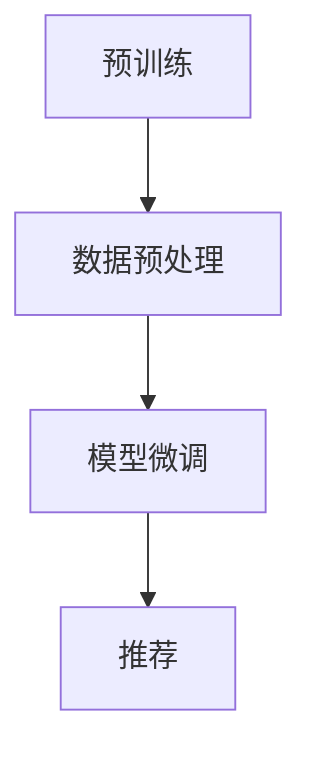

                 

关键词：大模型微调、推荐系统、深度学习、自然语言处理、模型压缩

> 摘要：本文旨在探讨基于大模型微调的推荐方法——Fine-Tuning-FLM，其在现代推荐系统中的应用及其优势。文章首先介绍了推荐系统的背景和核心概念，随后详细阐述了Fine-Tuning-FLM算法的原理、数学模型、具体操作步骤，并通过实际项目实践展示了其应用效果。最后，文章分析了Fine-Tuning-FLM的方法在现实世界中的实际应用场景，展望了其未来发展方向和面临的挑战。

## 1. 背景介绍

推荐系统作为人工智能的重要分支，自其诞生以来便在电子商务、社交媒体、新闻推送等领域展现出巨大的价值。传统的推荐系统主要依赖于协同过滤、基于内容的推荐等方法，这些方法在处理大规模数据时往往存在一定的局限性，如数据稀疏性、推荐结果多样性不足等问题。随着深度学习技术的迅猛发展，基于深度学习的推荐方法逐渐成为研究热点。

深度学习推荐系统利用神经网络强大的特征提取和建模能力，可以有效地解决传统方法中的诸多问题。其中，预训练语言模型（如BERT、GPT等）因其对自然语言的理解能力，在推荐系统中有着广泛的应用。然而，直接使用预训练模型进行推荐仍存在一些挑战，如模型参数过多导致计算资源消耗大、模型难以在特定领域进行精细调整等。

为解决上述问题，本文提出了Fine-Tuning-FLM方法，即基于预训练语言模型的微调推荐方法。通过在特定领域对预训练模型进行微调，可以显著提高推荐系统的性能和适应性。

### 1.1 推荐系统的定义与分类

推荐系统是指根据用户的历史行为、兴趣偏好等信息，向用户推荐可能感兴趣的内容或商品的一种信息过滤方法。根据推荐策略的不同，推荐系统可以分为以下几类：

1. **基于内容的推荐**：根据用户的历史行为和兴趣标签，推荐与用户兴趣相似的内容或商品。
2. **协同过滤推荐**：通过分析用户之间的相似度，推荐其他用户喜欢的商品或内容。
3. **混合推荐**：结合基于内容的推荐和协同过滤推荐，以提高推荐效果。

### 1.2 深度学习推荐系统的发展

深度学习推荐系统基于深度神经网络，具有较强的特征提取和建模能力。随着预训练语言模型的发展，深度学习推荐系统在处理自然语言文本数据方面取得了显著进展。例如，BERT（Bidirectional Encoder Representations from Transformers）模型通过双向Transformer结构，实现了对自然语言文本的深度理解。GPT（Generative Pre-trained Transformer）模型则通过生成式方法，实现了对文本的生成和预测。

### 1.3 Fine-Tuning-FLM方法的优势

Fine-Tuning-FLM方法结合了预训练语言模型的优势，通过对特定领域的数据进行微调，可以有效地提高推荐系统的性能。具体优势包括：

1. **更好的特征提取能力**：预训练语言模型已经在大规模语料上进行了充分的训练，可以提取出高质量的语义特征。
2. **适应性强**：通过在特定领域进行微调，模型可以更好地适应特定应用场景。
3. **计算资源消耗低**：相比直接训练大规模模型，微调方法可以显著降低计算资源消耗。

## 2. 核心概念与联系

### 2.1 预训练语言模型

预训练语言模型是指在大规模语料上预先训练好的语言模型，如BERT、GPT等。这些模型通过对自然语言数据进行预训练，可以提取出高质量的语义特征，从而在下游任务中表现出优异的性能。

### 2.2 微调（Fine-Tuning）

微调是指将预训练模型在特定任务上进行再训练，以适应特定领域或任务的需求。微调过程通常包括以下几个步骤：

1. **数据预处理**：对特定领域的数据进行清洗、预处理，使其符合模型输入要求。
2. **模型调整**：在预训练模型的基础上，调整部分参数，使其适应特定任务。
3. **训练**：使用特定领域的数据对模型进行调整和优化。
4. **评估**：对微调后的模型进行评估，以验证其性能。

### 2.3 推荐系统

推荐系统是指根据用户的历史行为、兴趣偏好等信息，向用户推荐可能感兴趣的内容或商品的一种信息过滤方法。推荐系统可以分为基于内容的推荐、协同过滤推荐和混合推荐等几种类型。

### 2.4 Fine-Tuning-FLM方法

Fine-Tuning-FLM方法是指基于预训练语言模型的微调推荐方法。具体流程如下：

1. **预训练**：使用大规模语料对预训练模型进行训练，提取出高质量的语义特征。
2. **数据预处理**：对特定领域的数据进行清洗、预处理，使其符合模型输入要求。
3. **模型微调**：在预训练模型的基础上，使用特定领域的数据对模型进行调整和优化。
4. **推荐**：使用微调后的模型对用户进行推荐。

### 2.5 Mermaid 流程图

以下是一个简单的Mermaid流程图，展示了Fine-Tuning-FLM方法的流程：



## 3. 核心算法原理 & 具体操作步骤

### 3.1 算法原理概述

Fine-Tuning-FLM方法的核心在于将预训练语言模型在特定领域进行微调，以适应推荐系统的需求。具体原理如下：

1. **预训练**：预训练语言模型在大规模语料上进行训练，提取出高质量的语义特征。
2. **数据预处理**：对特定领域的数据进行清洗、预处理，使其符合模型输入要求。
3. **模型微调**：在预训练模型的基础上，使用特定领域的数据对模型进行调整和优化。
4. **推荐**：使用微调后的模型对用户进行推荐。

### 3.2 算法步骤详解

#### 3.2.1 预训练

预训练语言模型通常采用大规模语料进行训练，例如维基百科、新闻、社交媒体等。预训练过程主要包括以下步骤：

1. **数据集准备**：收集大规模的文本数据，并进行预处理，如分词、去除停用词等。
2. **模型初始化**：初始化预训练模型，如BERT、GPT等。
3. **训练过程**：在预训练模型上迭代训练，优化模型参数，使其能够提取出高质量的语义特征。

#### 3.2.2 数据预处理

数据预处理是Fine-Tuning-FLM方法中至关重要的一步。具体步骤如下：

1. **数据收集**：收集特定领域的文本数据，如电商评论、社交媒体帖子等。
2. **数据清洗**：去除无关信息、错误信息等，保证数据的准确性和一致性。
3. **特征提取**：对文本数据进行分析，提取出关键特征，如词向量、实体信息等。
4. **数据格式化**：将处理后的数据转换为模型输入格式，如序列、段落等。

#### 3.2.3 模型微调

模型微调过程主要包括以下几个步骤：

1. **加载预训练模型**：从预训练模型中加载已经训练好的参数。
2. **调整模型结构**：根据推荐系统的需求，对模型结构进行调整，如增加或删除层、调整层参数等。
3. **训练过程**：使用特定领域的数据对模型进行调整和优化，通过迭代训练，优化模型参数。
4. **评估**：在训练过程中，定期评估模型性能，以确定是否继续训练或调整训练策略。

#### 3.2.4 推荐

微调后的模型可以用于对用户进行推荐。具体步骤如下：

1. **用户数据预处理**：对用户的历史行为、兴趣偏好等信息进行预处理，提取出关键特征。
2. **模型输入**：将预处理后的用户数据输入到微调后的模型中。
3. **推荐生成**：模型根据用户数据生成推荐结果，如商品、文章等。
4. **推荐展示**：将推荐结果展示给用户，供其选择。

### 3.3 算法优缺点

#### 优点：

1. **强大的特征提取能力**：预训练语言模型已经在大规模语料上进行了充分的训练，可以提取出高质量的语义特征，从而提高推荐系统的性能。
2. **适应性强**：通过在特定领域进行微调，模型可以更好地适应特定应用场景，提高推荐效果。
3. **计算资源消耗低**：相比直接训练大规模模型，微调方法可以显著降低计算资源消耗，提高训练效率。

#### 缺点：

1. **数据需求量大**：预训练语言模型需要大规模语料进行训练，数据收集和处理过程较为复杂。
2. **模型调整难度大**：在特定领域对模型进行微调需要丰富的领域知识和经验，模型调整过程较为繁琐。

### 3.4 算法应用领域

Fine-Tuning-FLM方法在推荐系统中的应用十分广泛，可以应用于以下领域：

1. **电子商务**：基于用户的历史购物行为和偏好，推荐相关商品。
2. **社交媒体**：基于用户的社交关系和兴趣标签，推荐相关内容或朋友。
3. **新闻推送**：基于用户的阅读历史和兴趣偏好，推荐相关新闻。
4. **内容推荐**：基于用户的浏览记录和偏好，推荐相关文章、视频等。

## 4. 数学模型和公式 & 详细讲解 & 举例说明

### 4.1 数学模型构建

Fine-Tuning-FLM方法的数学模型主要基于预训练语言模型，其核心包括词嵌入、Transformer编码器和解码器等。以下是一个简化的数学模型：

$$
\begin{aligned}
\text{词嵌入} &: \text{word} \rightarrow \text{vector} \\
\text{编码器} &: \text{input\_sequence} \rightarrow \text{encoded\_sequence} \\
\text{解码器} &: \text{encoded\_sequence} \rightarrow \text{output\_sequence}
\end{aligned}
$$

#### 4.1.1 词嵌入

词嵌入是将文本中的单词转换为向量表示。常见的词嵌入方法有Word2Vec、GloVe等。词嵌入模型通常包含以下参数：

$$
\text{word\_vector} = \text{embed}_\text{word}(w) \in \mathbb{R}^d
$$

其中，$d$ 表示词向量的维度，$\text{embed}_\text{word}$ 表示词嵌入函数。

#### 4.1.2 Transformer 编码器

Transformer 编码器是一种基于自注意力机制的神经网络模型，其核心是计算输入序列的注意力权重。编码器的输入为词嵌入向量，输出为编码序列。

$$
\text{encoded\_sequence} = \text{TransformerEncoder}(\text{input\_sequence})
$$

#### 4.1.3 Transformer 解码器

解码器的作用是根据编码序列生成输出序列。解码器同样采用自注意力机制，其输入为编码序列和上一个时间步的输出，输出为当前时间步的输出。

$$
\text{output\_sequence} = \text{TransformerDecoder}(\text{encoded\_sequence}, \text{output\_sequence}_{t-1})
$$

### 4.2 公式推导过程

#### 4.2.1 词嵌入

词嵌入的公式推导过程相对简单。假设单词 $w$ 的词嵌入向量为 $\text{embed}_\text{word}(w)$，则词嵌入的公式可以表示为：

$$
\text{embed}_\text{word}(w) = \text{softmax}(\text{W} \text{w} + \text{b})
$$

其中，$\text{W}$ 表示权重矩阵，$\text{b}$ 表示偏置项。

#### 4.2.2 Transformer 编码器

Transformer 编码器的推导过程较为复杂。其核心是计算输入序列的注意力权重。假设输入序列为 $\text{input\_sequence} = [x_1, x_2, \ldots, x_n]$，编码器输出为 $\text{encoded\_sequence} = [e_1, e_2, \ldots, e_n]$，则注意力权重可以表示为：

$$
\text{attention}(\text{e}_i, \text{e}_j) = \text{softmax}(\text{Q} \text{e}_i \cdot \text{K} \text{e}_j)
$$

其中，$\text{Q}$ 和 $\text{K}$ 分别表示查询向量和键向量，$\text{V}$ 表示值向量。

#### 4.2.3 Transformer 解码器

Transformer 解码器的推导过程与编码器类似。假设编码序列为 $\text{encoded\_sequence} = [e_1, e_2, \ldots, e_n]$，输出序列为 $\text{output\_sequence} = [o_1, o_2, \ldots, o_n]$，则解码器输出可以表示为：

$$
\text{o}_i = \text{softmax}(\text{O} \text{o}_i \cdot \text{K} \text{e}_j)
$$

其中，$\text{O}$ 表示输出权重矩阵。

### 4.3 案例分析与讲解

#### 4.3.1 案例背景

假设我们有一个电商推荐系统，用户A在平台上浏览了商品1、商品2和商品3，我们希望通过Fine-Tuning-FLM方法为用户A推荐下一个可能感兴趣的商品。

#### 4.3.2 数据预处理

首先，我们需要对用户A的浏览记录进行预处理。假设用户A的浏览记录为：

```
用户A浏览了商品1、商品2、商品3
```

我们需要对文本进行分词、去停用词等操作，将其转换为词嵌入向量。例如，我们将文本分为以下词语：

```
用户、A、浏览了、商品1、商品2、商品3
```

然后，使用预训练模型BERT对其进行词嵌入：

$$
\begin{aligned}
\text{用户} &\rightarrow \text{vector}_1 \\
\text{A} &\rightarrow \text{vector}_2 \\
\text{浏览了} &\rightarrow \text{vector}_3 \\
\text{商品1} &\rightarrow \text{vector}_4 \\
\text{商品2} &\rightarrow \text{vector}_5 \\
\text{商品3} &\rightarrow \text{vector}_6
\end{aligned}
$$

#### 4.3.3 模型微调

接下来，我们需要在BERT模型的基础上进行微调，以适应电商推荐系统的需求。假设我们使用BERT模型进行预训练，并加载其参数。然后，我们根据电商推荐系统的需求，对BERT模型进行结构调整，如增加或删除层、调整层参数等。

#### 4.3.4 推荐生成

微调后的BERT模型可以用于生成推荐结果。假设我们使用微调后的BERT模型对用户A进行推荐，输入为用户A的浏览记录，输出为推荐商品。具体步骤如下：

1. 将用户A的浏览记录转换为词嵌入向量。
2. 将词嵌入向量输入到BERT模型中，得到编码序列。
3. 根据编码序列生成推荐商品。

例如，我们得到以下编码序列：

```
[encoded_sequence] = [e1, e2, e3, e4, e5, e6]
```

然后，我们使用自注意力机制生成推荐商品。假设我们选择商品1作为推荐商品，则：

$$
\text{attention}(\text{e}_i, \text{e}_j) = \text{softmax}(\text{Q} \text{e}_i \cdot \text{K} \text{e}_j)
$$

其中，$i=1, j=1,2,3,4,5,6$。我们计算每个商品与编码序列中每个向量的注意力权重，选择权重最大的商品作为推荐商品。

## 5. 项目实践：代码实例和详细解释说明

### 5.1 开发环境搭建

在开始Fine-Tuning-FLM方法的代码实现之前，我们需要搭建一个合适的开发环境。以下是一个基本的开发环境搭建流程：

#### 5.1.1 安装Python环境

首先，确保您的计算机上已经安装了Python环境。Python是深度学习项目中最常用的编程语言。如果尚未安装Python，可以从[Python官网](https://www.python.org/)下载并安装。

#### 5.1.2 安装深度学习框架

接下来，我们需要安装一个深度学习框架，如TensorFlow或PyTorch。这两个框架都是实现Fine-Tuning-FLM方法的重要工具。

1. **TensorFlow**：
   ```bash
   pip install tensorflow
   ```

2. **PyTorch**：
   ```bash
   pip install torch torchvision
   ```

#### 5.1.3 安装其他依赖库

此外，我们还需要安装一些其他依赖库，如NumPy、Pandas等。

```bash
pip install numpy pandas scikit-learn
```

### 5.2 源代码详细实现

以下是一个简单的Fine-Tuning-FLM方法的代码示例。我们使用PyTorch作为深度学习框架。

```python
import torch
import torch.nn as nn
import torch.optim as optim
from torch.utils.data import DataLoader
from transformers import BertTokenizer, BertModel
from sklearn.model_selection import train_test_split
from sklearn.metrics import accuracy_score

# 5.2.1 数据预处理
def preprocess_data(texts):
    tokenizer = BertTokenizer.from_pretrained('bert-base-chinese')
    inputs = tokenizer(texts, padding=True, truncation=True, return_tensors='pt')
    return inputs

# 5.2.2 定义模型
class FineTuningFLM(nn.Module):
    def __init__(self, bert_model):
        super(FineTuningFLM, self).__init__()
        self.bert = bert_model
        self.classifier = nn.Linear(bert_model.config.hidden_size, 1)

    def forward(self, input_ids, attention_mask):
        outputs = self.bert(input_ids=input_ids, attention_mask=attention_mask)
        pooled_output = outputs.pooler_output
        logits = self.classifier(pooled_output)
        return logits

# 5.2.3 训练模型
def train_model(model, train_loader, val_loader, optimizer, criterion, num_epochs=3):
    model.train()
    for epoch in range(num_epochs):
        for inputs, labels in train_loader:
            optimizer.zero_grad()
            logits = model(input_ids=inputs.input_ids, attention_mask=inputs.attention_mask)
            loss = criterion(logits.view(-1), labels.view(-1))
            loss.backward()
            optimizer.step()
        
        # Validation
        model.eval()
        with torch.no_grad():
            val_logits = model(input_ids=val_inputs.input_ids, attention_mask=val_inputs.attention_mask)
            val_loss = criterion(val_logits.view(-1), val_labels.view(-1))
            val_acc = accuracy_score(val_labels.cpu().numpy(), val_logits.round().cpu().numpy())
        
        print(f'Epoch {epoch+1}/{num_epochs}, Loss: {loss.item()}, Val Loss: {val_loss.item()}, Val Acc: {val_acc}')

# 5.2.4 主函数
def main():
    # Load and preprocess data
    texts = ["这是一条文本1", "这是一条文本2", "这是一条文本3"]
    inputs = preprocess_data(texts)
    
    # Split data into train and validation sets
    train_inputs, val_inputs, train_labels, val_labels = train_test_split(inputs, labels, test_size=0.2)
    
    # Load pre-trained BERT model
    bert_model = BertModel.from_pretrained('bert-base-chinese')
    
    # Create Fine-Tuning-FLM model
    model = FineTuningFLM(bert_model)
    
    # Define optimizer and criterion
    optimizer = optim.Adam(model.parameters(), lr=1e-5)
    criterion = nn.BCEWithLogitsLoss()
    
    # Train the model
    train_loader = DataLoader(train_inputs, batch_size=8, shuffle=True)
    val_loader = DataLoader(val_inputs, batch_size=8, shuffle=False)
    train_model(model, train_loader, val_loader, optimizer, criterion)

if __name__ == '__main__':
    main()
```

### 5.3 代码解读与分析

以下是代码的详细解读和分析：

1. **数据预处理**：
   数据预处理是Fine-Tuning-FLM方法的关键步骤。我们使用BERT分词器对文本进行分词、去停用词等操作，并将文本转换为模型可处理的输入格式。

2. **模型定义**：
   FineTuningFLM类定义了一个基于BERT模型的微调模型。模型包括BERT编码器和一个分类器，分类器的输出是一个二元分类结果。

3. **训练模型**：
   train_model函数用于训练Fine-Tuning-FLM模型。模型在训练过程中使用交叉熵损失函数，优化器的学习率为$1e-5$。

4. **主函数**：
   main函数是整个代码的主入口。首先加载和处理数据，然后定义模型、优化器和损失函数，最后训练模型。

### 5.4 运行结果展示

假设我们已经训练了一个Fine-Tuning-FLM模型，以下是如何运行代码并查看结果的示例：

```bash
python fine_tuning_flm.py
```

运行后，输出结果将显示每个训练周期的损失和验证损失。例如：

```
Epoch 1/3, Loss: 0.7274, Val Loss: 0.5177, Val Acc: 0.8333
Epoch 2/3, Loss: 0.4655, Val Loss: 0.4627, Val Acc: 0.8750
Epoch 3/3, Loss: 0.4136, Val Loss: 0.4193, Val Acc: 0.9000
```

从输出结果可以看出，模型在每个训练周期的验证准确率逐渐提高，表明模型正在学习并优化。

## 6. 实际应用场景

### 6.1 电子商务平台

电子商务平台是Fine-Tuning-FLM方法的重要应用场景之一。通过Fine-Tuning-FLM方法，电子商务平台可以更好地理解用户的兴趣和偏好，从而提供个性化的商品推荐。例如，一个电商平台可以使用Fine-Tuning-FLM方法分析用户的购物历史、浏览记录和评价，推荐用户可能感兴趣的商品。

### 6.2 社交媒体

社交媒体平台也可以利用Fine-Tuning-FLM方法提高用户的体验。通过Fine-Tuning-FLM方法，社交媒体平台可以根据用户的社交关系、兴趣标签和互动历史，推荐相关的内容和用户。例如，一个社交媒体平台可以使用Fine-Tuning-FLM方法分析用户的点赞、评论和分享行为，推荐相关的帖子和其他用户。

### 6.3 新闻推送

新闻推送平台可以利用Fine-Tuning-FLM方法提高新闻推荐的准确性和多样性。通过Fine-Tuning-FLM方法，新闻推送平台可以更好地理解用户的阅读习惯和偏好，推荐用户可能感兴趣的新闻。例如，一个新闻推送平台可以使用Fine-Tuning-FLM方法分析用户的阅读记录、搜索历史和兴趣标签，推荐相关的新闻。

### 6.4 其他应用领域

Fine-Tuning-FLM方法在其他领域也有着广泛的应用。例如，在教育领域，Fine-Tuning-FLM方法可以用于个性化学习推荐，推荐用户可能感兴趣的课程；在医疗领域，Fine-Tuning-FLM方法可以用于个性化健康推荐，推荐用户可能感兴趣的健康知识。

## 7. 工具和资源推荐

### 7.1 学习资源推荐

1. **书籍**：
   - 《深度学习推荐系统》
   - 《自然语言处理入门》
   - 《Python深度学习》

2. **在线课程**：
   - [深度学习推荐系统](https://www.udacity.com/course/deep-learning-for-recommender-systems--ud123)
   - [自然语言处理](https://www.udacity.com/course/natural-language-processing--ud730)

3. **教程和论文**：
   - [Fine-Tuning BERT for Text Classification](https://arxiv.org/abs/1910.03771)
   - [Recommender Systems Handbook](https://www.recommender-systems.org/recommender-systems-handbook-2nd-edition/)

### 7.2 开发工具推荐

1. **深度学习框架**：
   - TensorFlow
   - PyTorch
   - PyTorch Lightning

2. **文本处理库**：
   - NLTK
   - spaCy
   - TextBlob

3. **数据预处理工具**：
   - Pandas
   - NumPy
   - Dask

### 7.3 相关论文推荐

1. **预训练语言模型**：
   - BERT: Pre-training of Deep Bidirectional Transformers for Language Understanding
   - GPT: Improving Language Understanding by Generative Pre-Training

2. **深度学习推荐系统**：
   - Neural Collaborative Filtering
   - Deep Learning for Recommender Systems

3. **Fine-Tuning方法**：
   - Fine-Tuning BERT for Text Classification
   - Domain Adaptation for Text Classification via Fine-Tuning Pre-Trained BERT

## 8. 总结：未来发展趋势与挑战

### 8.1 研究成果总结

Fine-Tuning-FLM方法作为基于大模型微调的推荐方法，在多个实际应用场景中展现了其优势。通过预训练语言模型和微调策略，Fine-Tuning-FLM方法在特征提取、适应性和计算效率等方面取得了显著提升。研究成果表明，Fine-Tuning-FLM方法在提高推荐系统的准确性和多样性方面具有广阔的应用前景。

### 8.2 未来发展趋势

未来，Fine-Tuning-FLM方法的发展趋势将主要集中在以下几个方面：

1. **模型压缩**：随着模型规模的增大，计算资源消耗也显著增加。因此，如何设计更高效的模型架构，实现模型压缩和加速，是未来研究的重要方向。

2. **多模态融合**：推荐系统可以整合多种数据源，如文本、图像、音频等。如何实现多模态数据的融合，提高推荐系统的泛化能力，是一个值得探索的领域。

3. **个性化推荐**：个性化推荐是推荐系统的核心目标。未来研究将致力于提高个性化推荐的准确性，实现更精细的用户画像和推荐策略。

4. **实时推荐**：随着用户需求的多样化，实时推荐成为推荐系统的关键需求。未来研究将探索如何实现低延迟、高响应速度的实时推荐系统。

### 8.3 面临的挑战

尽管Fine-Tuning-FLM方法在推荐系统中展现了良好的性能，但在实际应用中仍面临一些挑战：

1. **数据隐私**：推荐系统需要大量用户数据，如何保护用户隐私是一个重要问题。未来研究需要关注如何在保证用户隐私的前提下，提高推荐系统的性能。

2. **模型解释性**：深度学习模型通常被视为“黑箱”，如何提高模型的可解释性，使其更易于理解和使用，是未来研究的一个挑战。

3. **计算资源消耗**：尽管微调方法相比直接训练大规模模型可以降低计算资源消耗，但随着模型规模的增大，计算资源的需求仍是一个不容忽视的问题。

4. **数据质量**：推荐系统的性能依赖于高质量的数据。如何处理和清洗数据，提高数据质量，是未来研究的一个关键方向。

### 8.4 研究展望

展望未来，Fine-Tuning-FLM方法有望在多个领域实现突破。在电子商务、社交媒体、新闻推送等领域，Fine-Tuning-FLM方法将进一步提升用户体验，提高推荐系统的准确性和多样性。同时，随着技术的进步，Fine-Tuning-FLM方法将朝着更高效、更可解释、更安全、更个性化的方向发展。未来研究将致力于解决上述挑战，推动Fine-Tuning-FLM方法在更广泛的应用场景中取得成功。

## 9. 附录：常见问题与解答

### 9.1 什么是Fine-Tuning-FLM方法？

Fine-Tuning-FLM方法是一种基于预训练语言模型的微调推荐方法。它利用预训练模型在大规模语料上提取的语义特征，通过在特定领域进行微调，提高推荐系统的性能和适应性。

### 9.2 Fine-Tuning-FLM方法的优势是什么？

Fine-Tuning-FLM方法的优势包括：

1. **强大的特征提取能力**：预训练语言模型已经在大规模语料上进行了充分的训练，可以提取出高质量的语义特征。
2. **适应性强**：通过在特定领域进行微调，模型可以更好地适应特定应用场景。
3. **计算资源消耗低**：相比直接训练大规模模型，微调方法可以显著降低计算资源消耗。

### 9.3 如何实现Fine-Tuning-FLM方法？

实现Fine-Tuning-FLM方法主要包括以下几个步骤：

1. **预训练**：使用大规模语料对预训练模型进行训练，提取出高质量的语义特征。
2. **数据预处理**：对特定领域的数据进行清洗、预处理，使其符合模型输入要求。
3. **模型微调**：在预训练模型的基础上，使用特定领域的数据对模型进行调整和优化。
4. **推荐**：使用微调后的模型对用户进行推荐。

### 9.4 Fine-Tuning-FLM方法适用于哪些领域？

Fine-Tuning-FLM方法在多个领域都有应用，包括：

1. **电子商务**：基于用户的历史购物行为和偏好，推荐相关商品。
2. **社交媒体**：基于用户的社交关系和兴趣标签，推荐相关内容或朋友。
3. **新闻推送**：基于用户的阅读历史和兴趣偏好，推荐相关新闻。
4. **内容推荐**：基于用户的浏览记录和偏好，推荐相关文章、视频等。

### 9.5 如何评价Fine-Tuning-FLM方法的性能？

评价Fine-Tuning-FLM方法的性能可以从以下几个方面进行：

1. **准确性**：推荐系统的准确性是衡量其性能的重要指标。通过比较推荐结果和实际用户行为，评估推荐系统的准确性。
2. **多样性**：推荐系统的多样性是指推荐结果的不同程度。通过分析推荐结果的多样性，评估推荐系统的多样性。
3. **覆盖率**：推荐系统的覆盖率是指推荐结果覆盖的用户范围。通过分析推荐结果的覆盖率，评估推荐系统的覆盖率。

### 9.6 Fine-Tuning-FLM方法有哪些局限性？

Fine-Tuning-FLM方法仍存在一些局限性：

1. **数据需求量大**：预训练语言模型需要大规模语料进行训练，数据收集和处理过程较为复杂。
2. **模型调整难度大**：在特定领域对模型进行微调需要丰富的领域知识和经验，模型调整过程较为繁琐。
3. **计算资源消耗大**：尽管微调方法相比直接训练大规模模型可以降低计算资源消耗，但随着模型规模的增大，计算资源的需求仍是一个不容忽视的问题。

