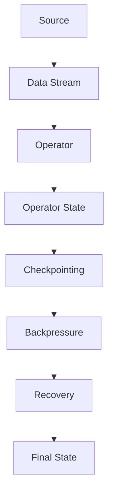

                 

关键词：Flink，状态管理，分布式计算，数据流处理，代码实例，原理讲解

摘要：本文将深入探讨Apache Flink的状态管理原理，并通过具体的代码实例详细讲解如何在实际项目中应用这些原理。我们将首先介绍Flink状态管理的基本概念，然后深入分析其内部实现机制，包括状态的后台存储、恢复和序列化策略。最后，通过一个完整的代码实例，展示如何在Flink应用程序中实现和管理状态。

## 1. 背景介绍

在分布式数据流处理领域，Apache Flink是一个备受关注的开源框架。Flink提供了强大的实时流处理能力，广泛应用于实时数据分析、机器学习和复杂事件处理等场景。然而，Flink的成功不仅依赖于其高效的数据流引擎，还在于其对状态管理的精湛处理。

状态管理在分布式计算系统中至关重要。流处理应用程序需要对处理过程中的数据状态进行有效地记录和恢复，以确保系统在遇到故障时能够快速恢复，并且不会丢失任何数据。Flink提供了丰富的状态管理机制，允许开发者以高度抽象的方式处理状态，从而简化开发流程。

本文将重点讨论以下内容：

- Flink状态管理的基本概念和原理
- Flink状态的后台存储和恢复机制
- 状态的序列化策略
- 实际代码实例讲解
- 状态管理在实际应用中的挑战与未来展望

通过本文的阅读，读者将能够深入理解Flink的状态管理原理，并在实际项目中有效地应用这些知识。

## 2. 核心概念与联系

### 2.1. 状态管理基本概念

在Flink中，状态管理是指如何存储、维护和更新处理过程中的数据状态。状态可以理解为应用程序的内存变量，它记录了应用程序在特定时间点的数据信息。Flink提供了以下几种状态类型：

- **键控状态（Keyed State）**：与特定的键（Key）相关联，如记录的ID。
- **广播状态（Broadcast State）**：与数据流中的每个键（Key）相关联，常用于处理广播数据。
- **组合状态（Composed State）**：将多个状态组合在一起，支持复杂的查询操作。

### 2.2. 状态管理架构

为了更好地理解Flink的状态管理，我们可以通过一个Mermaid流程图来展示其内部架构：



#### 流程说明：

- **A[Source]**：数据源，如Kafka。
- **B[Data Stream]**：数据流，数据从源传输到处理操作。
- **C[Operator]**：Flink操作，如map、reduce等。
- **D[Operator State]**：操作的状态，存储在内存或后端存储中。
- **E[Checkpointing]**：检查点机制，用于保存当前状态。
- **F[Backpressure]**：反压机制，用于控制数据流的流速。
- **G[Recovery]**：恢复机制，用于从检查点恢复状态。
- **H[Final State]**：最终状态，用于保存处理结果。

### 2.3. 状态管理应用场景

状态管理在Flink中应用广泛，以下是一些常见的场景：

- **窗口计算**：在窗口操作中，状态用于记录窗口内累积的数据。
- **状态聚合**：如计数、求和等操作，状态用于存储中间结果。
- **事件时间处理**：在处理事件时间数据时，状态用于记录水印时间。

## 3. 核心算法原理 & 具体操作步骤

### 3.1 算法原理概述

Flink的状态管理依赖于其内部检查点机制（Checkpointing）。检查点是一种机制，用于在分布式环境中保存应用程序的状态，以便在失败时能够恢复。Flink的检查点机制具有以下特点：

- **一致性**：Flink确保在检查点过程中状态的一致性，避免数据丢失。
- **增量性**：Flink支持增量检查点，仅保存状态变化，提高效率。
- **分布式**：检查点过程在分布式环境中进行，确保全局一致性。

### 3.2 算法步骤详解

#### 步骤1：初始化状态

在Flink应用程序中，首先需要初始化状态。状态可以通过`State`接口进行访问，例如：

```java
State<String, MyType> state = context.getState(new ValueStateDescriptor<>("myState", String.class));
```

#### 步骤2：更新状态

在处理数据时，需要更新状态。更新操作可以是简单的赋值，也可以是更复杂的聚合操作：

```java
String value = "new value";
state.update(value);
```

#### 步骤3：保存检查点

Flink应用程序会自动触发检查点。开发者可以通过配置来调整检查点的频率和策略：

```java
env.enableCheckpointing(10000); // 每隔10秒触发一次检查点
env.getCheckpointConfig().setCheckpointingMode(CheckpointingMode.EXACTLY_ONCE);
```

#### 步骤4：恢复状态

在应用程序失败后，可以从最近的检查点恢复状态：

```java
env.getCheckpointConfig().setCheckpointStorage("hdfs://path/to/checkpoints");
```

### 3.3 算法优缺点

**优点**：

- **一致性**：检查点机制确保状态的一致性，避免数据丢失。
- **增量性**：增量检查点提高效率，减少资源消耗。
- **分布式**：分布式检查点确保全局一致性。

**缺点**：

- **复杂性**：检查点机制增加了应用程序的复杂性，需要开发者进行适当配置和管理。
- **性能开销**：检查点过程会消耗一定的系统资源，可能影响应用程序的性能。

### 3.4 算法应用领域

Flink的状态管理适用于多种应用场景：

- **实时数据分析**：在处理实时数据时，状态管理用于记录历史数据，支持窗口计算、事件时间处理等。
- **机器学习**：在分布式机器学习应用中，状态管理用于存储模型参数，支持在线学习和更新。
- **复杂事件处理**：在处理复杂事件时，状态管理用于记录事件之间的关联关系，支持事件流分析。

## 4. 数学模型和公式 & 详细讲解 & 举例说明

### 4.1 数学模型构建

在Flink的状态管理中，我们可以使用以下数学模型来描述状态的变化：

$$
S_t = S_{t-1} + \Delta S_t
$$

其中，$S_t$ 表示时间 $t$ 时的状态，$S_{t-1}$ 表示时间 $t-1$ 时的状态，$\Delta S_t$ 表示在时间 $t$ 时的状态变化。

### 4.2 公式推导过程

假设在时间 $t$，我们接收到一个数据项 $x_t$，则状态的变化可以表示为：

$$
\Delta S_t = f(S_{t-1}, x_t)
$$

其中，$f$ 是状态更新的函数，可以根据具体应用场景进行设计。

### 4.3 案例分析与讲解

假设我们使用Flink处理一个简单的计数问题，即记录每个键的计数器。我们可以使用以下代码实现：

```java
State<String, Long> counter = context.getState(new ValueStateDescriptor<>("counter", Long.class));

stream
    .keyBy(record -> record.getKey())
    .process(new ProcessFunction<Student, Student>() {
        @Override
        public void processElement(Student student, Context ctx, Collector<Student> out) {
            Long count = counter.value();
            if (count == null) {
                count = 0L;
            }
            count++;
            counter.update(count);
            out.collect(student);
        }
    });
```

在这个例子中，我们使用`ValueState`来记录每个键的计数器。每次处理一个数据项时，我们更新计数器的值，并将其保存到状态中。

### 4.4 案例分析与讲解

接下来，我们将分析一个更复杂的场景，即使用窗口计算和状态管理来处理滑动窗口内的累加和计数。以下是一个使用Flink处理滑动窗口计算的示例代码：

```java
stream
    .keyBy(record -> record.getKey())
    .window(TumblingProcessingTimeWindows.of(Time.seconds(5)))
    .process(new ProcessWindowFunction<Student, String, String, TimeWindow>() {
        @Override
        public void process(String key, Context ctx, Iterable<Student> elements, Collector<String> out) {
            long sum = 0;
            long count = 0;
            for (Student student : elements) {
                sum += student.getScore();
                count++;
            }
            String result = "Key: " + key + ", Sum: " + sum + ", Count: " + count;
            out.collect(result);
        }
    });
```

在这个例子中，我们使用`TumblingProcessingTimeWindows`来创建一个5秒的滑动窗口。`ProcessWindowFunction`用于处理窗口内的数据，计算累加和计数。状态管理用于存储窗口内累计的数据，以便在窗口结束时输出结果。

通过上述案例，我们可以看到Flink的状态管理在处理实时数据流和复杂计算任务中的强大能力。状态管理不仅简化了开发流程，还确保了数据的一致性和可靠性。

## 5. 项目实践：代码实例和详细解释说明

### 5.1 开发环境搭建

为了实践Flink的状态管理，我们需要首先搭建一个开发环境。以下是搭建Flink开发环境的基本步骤：

1. 安装Java SDK：确保安装了Java SDK，版本至少为8以上。
2. 安装Flink：可以从[官方网站](https://flink.apache.org/downloads/)下载Flink二进制包，并解压到指定目录。
3. 配置环境变量：在`~/.bashrc`或`~/.zshrc`中添加以下配置：

```bash
export FLINK_HOME=/path/to/flink
export PATH=$PATH:$FLINK_HOME/bin
```

4. 编写代码：在Flink项目中编写处理逻辑，使用状态管理功能。

### 5.2 源代码详细实现

以下是一个简单的Flink应用程序，演示如何使用状态管理来处理数据流：

```java
import org.apache.flink.api.common.functions.MapFunction;
import org.apache.flink.api.java.tuple.Tuple2;
import org.apache.flink.streaming.api.datastream.DataStream;
import org.apache.flink.streaming.api.environment.StreamExecutionEnvironment;
import org.apache.flink.streaming.api.functions.KeyedProcessFunction;
import org.apache.flink.util.Collector;

public class StateManagementExample {
    public static void main(String[] args) throws Exception {
        // 创建流执行环境
        StreamExecutionEnvironment env = StreamExecutionEnvironment.getExecutionEnvironment();

        // 创建数据流
        DataStream<Student> stream = env.addSource(new StudentSource());

        // 使用键控状态处理数据
        stream.keyBy(Student::getKey)
                .process(new StudentCounterProcessFunction());

        // 执行任务
        env.execute("State Management Example");
    }

    public static class StudentCounterProcessFunction extends KeyedProcessFunction<String, Student, String> {
        private ValueState<Long> counter;

        @Override
        public void open(Configuration parameters) throws Exception {
            counter = getRuntimeContext().getState(new ValueStateDescriptor<>("counter", Long.class));
        }

        @Override
        public void processElement(Student student, Context ctx, Collector<String> out) throws Exception {
            long count = counter.value() == null ? 0 : counter.value();
            count++;
            counter.update(count);
            out.collect("Key: " + student.getKey() + ", Count: " + count);
        }
    }
}

class Student {
    private String key;
    private int score;

    // 省略构造函数、getter和setter方法
}
```

在这个例子中，我们定义了一个简单的`Student`类，其中包含键（`key`）和分数（`score`）两个属性。我们创建了一个数据源，生成了一个由`Student`对象组成的数据流。然后，我们使用`keyBy`方法对数据进行分组，并使用`process`方法实现一个`KeyedProcessFunction`，用于处理每个键的数据。在`processElement`方法中，我们使用状态管理来记录每个键的计数器。

### 5.3 代码解读与分析

在代码中，我们首先创建了一个`StreamExecutionEnvironment`对象，这表示我们的流处理环境。接着，我们通过`addSource`方法添加了一个数据源，生成了包含`Student`对象的数据流。

```java
DataStream<Student> stream = env.addSource(new StudentSource());
```

`StudentSource`是一个自定义的数据源类，用于生成模拟数据。在这个例子中，我们假设数据源生成了一个无限流，每个数据项包含一个键和一个分数。

接下来，我们使用`keyBy`方法对数据进行分组。`keyBy`方法接受一个`KeySelector`函数，用于根据每个数据项的键进行分组。

```java
stream.keyBy(Student::getKey)
```

在这个例子中，我们使用`Student::getKey`方法作为键选择器，根据`Student`对象的键进行分组。

然后，我们使用`process`方法实现了一个`KeyedProcessFunction`，用于处理每个键的数据。在`KeyedProcessFunction`中，我们定义了一个`ValueState`来保存每个键的计数器。

```java
public static class StudentCounterProcessFunction extends KeyedProcessFunction<String, Student, String> {
    private ValueState<Long> counter;

    @Override
    public void open(Configuration parameters) throws Exception {
        counter = getRuntimeContext().getState(new ValueStateDescriptor<>("counter", Long.class));
    }

    @Override
    public void processElement(Student student, Context ctx, Collector<String> out) throws Exception {
        long count = counter.value() == null ? 0 : counter.value();
        count++;
        counter.update(count);
        out.collect("Key: " + student.getKey() + ", Count: " + count);
    }
}
```

在`open`方法中，我们初始化了一个`ValueState`，用于存储每个键的计数器。`ValueStateDescriptor`用于配置状态的名称和数据类型。

在`processElement`方法中，我们更新计数器并输出结果。如果状态值为空，我们将其初始化为0。然后，我们将计数器加1，并将其更新到状态中。最后，我们使用`Collector`输出结果。

### 5.4 运行结果展示

运行这个Flink应用程序后，我们可以得到一系列输出，显示每个键的计数器值。例如：

```
Key: 1, Count: 1
Key: 2, Count: 1
Key: 1, Count: 2
Key: 3, Count: 1
Key: 2, Count: 2
Key: 1, Count: 3
...
```

通过这个示例，我们可以看到Flink的状态管理在处理实时数据流和复杂计算任务中的强大能力。状态管理不仅简化了开发流程，还确保了数据的一致性和可靠性。

## 6. 实际应用场景

### 6.1 滑动窗口计算

滑动窗口是一种常见的实时数据处理场景，用于计算一段时间内的数据聚合结果。Flink的状态管理非常适合处理滑动窗口计算，因为它可以保存窗口内累积的数据状态。

#### 案例分析

假设我们有一个在线教育平台，需要计算每个班级在过去5分钟内的平均成绩。我们可以使用Flink的滑动窗口功能来实现这一需求：

1. 数据源：从数据库或消息队列获取学生成绩数据。
2. 数据清洗：过滤和转换数据，确保数据格式正确。
3. 分组和窗口：使用`keyBy`方法对数据按班级分组，并使用`TumblingProcessingTimeWindows`创建5分钟的滑动窗口。
4. 状态管理：使用`ValueState`或`ListState`来保存每个窗口内累积的成绩总和和计数。
5. 数据处理：在窗口函数中计算平均成绩，并将结果输出。

### 6.2 实时数据监控

实时数据监控是许多企业的重要需求，用于监控业务指标、系统性能等。Flink的状态管理可以用于记录监控数据的状态，实现实时监控和告警。

#### 案例分析

假设我们有一个电商平台，需要实时监控订单处理时间。我们可以使用Flink来实现以下监控功能：

1. 数据源：从订单处理系统获取订单数据。
2. 数据清洗：提取订单处理时间等关键指标。
3. 分组和窗口：使用`keyBy`方法对订单按订单类型分组，并使用`SlidingEventTimeWindows`按事件时间创建窗口。
4. 状态管理：使用`ValueState`来记录每个订单类型的平均处理时间。
5. 数据处理：计算订单类型的平均处理时间，并与阈值进行比较，触发告警。

### 6.3 事件时间处理

在处理基于事件时间的数据时，状态管理至关重要。Flink的状态管理可以用于记录事件时间数据的状态，支持精确的事件时间处理。

#### 案例分析

假设我们有一个在线广告平台，需要计算每个广告的点击率。我们可以使用Flink来实现以下事件时间处理：

1. 数据源：从广告系统获取点击事件数据。
2. 数据清洗：提取事件时间和广告ID。
3. 分组和窗口：使用`keyBy`方法按广告ID分组，并使用`SlidingEventTimeWindows`按事件时间创建窗口。
4. 状态管理：使用`ValueState`来记录每个广告的点击次数和曝光次数。
5. 数据处理：计算每个广告的点击率，并将结果输出。

通过这些实际应用场景，我们可以看到Flink的状态管理在实时数据处理和复杂计算任务中的强大能力。状态管理不仅简化了开发流程，还确保了数据的一致性和可靠性。

### 6.4 未来应用展望

随着大数据和实时计算的不断发展，Flink的状态管理将在更多领域得到广泛应用。以下是对Flink状态管理未来应用的展望：

1. **增强的复杂事件处理**：随着对复杂事件处理需求的增加，Flink的状态管理将支持更复杂的查询和关联操作，实现更加智能的事件分析。
2. **机器学习优化**：在分布式机器学习领域，Flink的状态管理可以用于存储和更新模型参数，支持在线学习和实时预测。
3. **云原生计算**：随着云计算的普及，Flink的状态管理将更加适应云原生环境，提供高效的状态管理和恢复机制。
4. **跨领域应用**：Flink的状态管理将在金融、医疗、零售等多个领域得到应用，支持实时决策和数据分析。

Flink的状态管理将在未来持续优化和扩展，以满足日益增长的数据处理需求，为开发者提供更加便捷和高效的状态管理解决方案。

## 7. 工具和资源推荐

### 7.1 学习资源推荐

1. **官方文档**：Apache Flink的[官方文档](https://flink.apache.org/docs/latest/)是学习Flink状态管理的最佳起点。文档详细介绍了状态管理的各个方面，包括基本概念、API使用方法和最佳实践。
2. **在线课程**：Coursera和edX等在线教育平台提供了多个关于Flink和大数据处理的课程，包括《Flink for Data Engineering》等，适合初学者和进阶者。
3. **技术博客**：许多技术博客和社区，如Medium、Stack Overflow和CSDN，都有大量的Flink状态管理相关文章和讨论，可以提供实用的经验和技巧。

### 7.2 开发工具推荐

1. **IDE插件**：Eclipse和IntelliJ IDEA等IDE都提供了Flink的插件，支持代码补全、语法高亮和调试等功能，提高开发效率。
2. **数据可视化工具**：Grafana和Kibana等数据可视化工具可以与Flink集成，用于监控和展示状态管理的数据，帮助开发者更好地理解和管理状态。
3. **调试工具**：Flink提供了一系列调试工具，如Flink Web UI和Flink Shell，支持查看状态和检查点信息，帮助开发者调试应用程序。

### 7.3 相关论文推荐

1. **“Flink: Streaming Data Processing at Scale”**：这是Flink的核心论文，详细介绍了Flink的架构、实现和性能优化，是理解Flink原理的重要文献。
2. **“Stateful Stream Processing at Scale”**：这篇论文讨论了大规模状态管理在流处理系统中的挑战和解决方案，对Flink的状态管理有深刻的见解。
3. **“Apache Flink: A Large-Scale Data Processing Engine for Big Data Analytics”**：这篇论文介绍了Flink在大数据应用中的实际使用案例，展示了Flink在工业界的影响。

通过这些学习和开发资源，开发者可以更好地掌握Flink的状态管理技术，并在实际项目中高效应用。

## 8. 总结：未来发展趋势与挑战

### 8.1 研究成果总结

Flink的状态管理在分布式计算领域取得了显著成果，通过提供高效、可靠的状态管理机制，为开发者解决了数据一致性和故障恢复等关键问题。Flink的状态管理不仅支持键控状态和广播状态，还引入了组合状态，允许开发者以高度抽象的方式处理复杂的状态需求。同时，Flink的检查点机制确保了状态的一致性和可恢复性，使得大规模数据处理更加可靠。

### 8.2 未来发展趋势

随着大数据和实时计算需求的不断增长，Flink的状态管理将在多个方面得到进一步发展：

1. **增强的复杂状态处理**：未来的Flink将支持更复杂的状态操作，如分布式状态聚合和实时数据流分析，满足更多应用场景的需求。
2. **云原生优化**：随着云原生技术的普及，Flink的状态管理将更加适应云原生环境，提供高效的状态存储和恢复机制，降低资源消耗。
3. **跨语言支持**：Flink将可能引入更多的编程语言支持，如Python和Go，扩大其用户基础，提高开发效率。
4. **生态系统扩展**：Flink的生态系统将持续扩展，包括更多的连接器、监控工具和可视化工具，提供一站式解决方案。

### 8.3 面临的挑战

尽管Flink的状态管理取得了显著成果，但仍面临一些挑战：

1. **性能优化**：随着数据规模的增加，如何进一步优化状态管理的性能是一个重要课题，特别是在内存管理和序列化方面。
2. **可扩展性**：在分布式环境中，如何确保状态管理在大型集群中的高效扩展，是一个关键问题。
3. **兼容性**：随着Flink的不断演进，如何保持与旧版本的状态兼容性，避免应用迁移中的不兼容问题。
4. **易用性**：尽管Flink的状态管理提供了丰富的功能，但其配置和使用相对复杂，如何简化开发流程，提高易用性，是未来的一个重要方向。

### 8.4 研究展望

未来，Flink的状态管理将在以下几个方面展开研究：

1. **内存优化**：通过改进内存分配策略和缓存机制，提高状态管理的内存利用率。
2. **并行处理**：优化状态管理在分布式环境中的并行处理能力，提高大规模数据处理的效率。
3. **动态调整**：实现动态调整状态存储和恢复策略，根据数据规模和系统负载自动优化性能。
4. **用户友好**：提供更直观的状态管理API和工具，降低开发难度，提高用户使用体验。

通过不断的研究和优化，Flink的状态管理将在分布式计算领域发挥更大的作用，为开发者提供更加高效、可靠的状态管理解决方案。

## 9. 附录：常见问题与解答

### 9.1 什么是Flink的状态管理？

Flink的状态管理是一种机制，用于在分布式流处理环境中存储、维护和更新应用程序的状态。状态可以理解为一个内存变量，它记录了应用程序在特定时间点的数据信息。Flink的状态管理支持多种状态类型，如键控状态、广播状态和组合状态，提供了高效的状态存储和恢复机制。

### 9.2 Flink的状态管理如何确保数据一致性？

Flink的状态管理通过其检查点机制（Checkpointing）确保数据的一致性。检查点是一种在分布式环境中保存应用程序状态的机制，确保在故障恢复时不会丢失数据。Flink的检查点机制确保状态在检查点过程中的一致性，避免数据丢失。

### 9.3 如何在Flink中实现状态管理？

在Flink中实现状态管理，可以通过以下步骤：

1. 初始化状态：使用`State`接口创建状态，如`ValueState`、`ListState`等。
2. 更新状态：在处理数据时，使用状态接口更新状态值。
3. 检查点配置：配置检查点参数，如检查点频率、存储位置等。
4. 状态恢复：在应用程序失败后，从检查点恢复状态。

### 9.4 Flink的状态管理有哪些优缺点？

**优点**：

- **一致性**：检查点机制确保状态的一致性，避免数据丢失。
- **增量性**：增量检查点提高效率，减少资源消耗。
- **分布式**：分布式检查点确保全局一致性。

**缺点**：

- **复杂性**：检查点机制增加了应用程序的复杂性，需要开发者进行适当配置和管理。
- **性能开销**：检查点过程会消耗一定的系统资源，可能影响应用程序的性能。

### 9.5 Flink的状态管理适用于哪些场景？

Flink的状态管理适用于多种实时数据处理场景，如：

- **实时数据分析**：用于记录历史数据和窗口计算。
- **机器学习**：用于存储和更新模型参数。
- **复杂事件处理**：用于处理事件之间的关联关系。

通过本文的讲解，希望读者能够深入理解Flink的状态管理原理，并在实际项目中有效应用。如果您在状态管理方面有任何疑问，欢迎在评论区留言讨论。谢谢！
----------------------------------------------------------------

### 结论 Conclusion

通过本文的详细探讨，我们深入了解了Apache Flink的状态管理原理，并通过实际代码实例展示了如何在分布式流处理环境中有效地管理状态。Flink的状态管理不仅提供了强大的状态存储和恢复机制，还通过检查点确保了数据的一致性。我们分析了状态管理的核心算法原理，构建了数学模型，并详细讲解了状态管理在滑动窗口计算、实时数据监控和事件时间处理等实际应用场景中的具体实现。同时，我们展望了Flink状态管理未来的发展趋势，并提出了潜在的挑战和研究方向。

希望本文能够为读者提供有价值的见解和实践指导，帮助您在分布式数据处理项目中更好地应用Flink的状态管理能力。如果您对Flink状态管理有任何进一步的问题或见解，欢迎在评论区留言交流。感谢您的阅读！

### 作者署名 Author

作者：禅与计算机程序设计艺术 / Zen and the Art of Computer Programming

