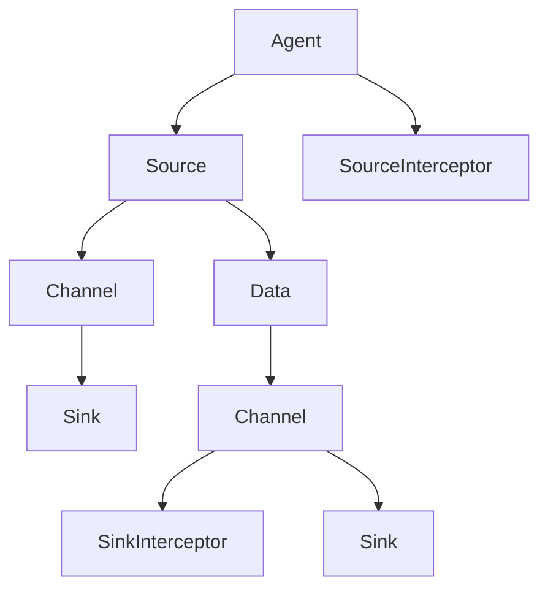

                 

关键词：Flume、Interceptor、大数据、日志处理、实时流处理

> 摘要：本文旨在深入探讨Flume Interceptor原理及其在日志处理和实时流处理中的应用。通过详细的代码实例，本文将帮助读者理解Interceptor的核心机制，并掌握其实际开发和应用。

## 1. 背景介绍

Flume是一种分布式、可靠且可扩展的日志收集系统，用于高效地收集、聚合和移动大量日志数据。其广泛应用于各种企业级场景，包括日志聚合、监控和数据分析。随着大数据技术的发展，Flume逐渐成为数据处理领域的重要工具之一。

Interceptor是Flume的一个重要组件，用于在日志数据传输过程中进行预处理或后处理。通过Interceptor，用户可以方便地对日志数据进行过滤、转换、增强等操作，从而满足各种业务需求。Interceptor的引入使得Flume不仅能够完成基本的日志收集任务，还能进行更复杂的日志处理。

本文将首先介绍Flume的基本架构和Interceptor的概念，然后详细讲解Interceptor的工作原理和实现方法，最后通过具体代码实例，帮助读者深入理解Interceptor的使用。

## 2. 核心概念与联系

### 2.1 Flume架构

Flume的核心架构包括以下几个组件：

1. **Agent**：Flume的基本工作单元，负责日志数据的收集、传输和处理。每个Agent包括Source、Channel和Sink三个核心部分。
2. **Source**：负责接收日志数据，可以是文件、网络套接字等。
3. **Channel**：临时存储从Source接收到的日志数据，保证数据的可靠传输。
4. **Sink**：将Channel中的日志数据传输到目标存储系统，如HDFS、Kafka等。

### 2.2 Interceptor概念

Interceptor是Flume中的一个重要概念，用于在数据传输过程中对数据进行预处理或后处理。Interceptor可以基于多种需求实现，如过滤特定关键字、将日志数据转换为特定格式、添加额外的元数据等。

Interceptor主要分为两类：

1. **SourceInterceptor**：在数据进入Channel之前进行预处理。
2. **SinkInterceptor**：在数据从Channel传输到Sink之前进行后处理。

### 2.3 Mermaid流程图



## 3. 核心算法原理 & 具体操作步骤

### 3.1 算法原理概述

Interceptor的工作原理主要分为以下几个步骤：

1. **初始化**：Interceptor在Agent启动时进行初始化，加载配置文件，设置过滤规则、转换规则等。
2. **预处理**：SourceInterceptor在数据进入Channel之前，对日志数据进行过滤、转换等操作。
3. **后处理**：SinkInterceptor在数据从Channel传输到Sink之前，对日志数据进行进一步处理。
4. **数据传输**：经过Interceptor处理后的数据，最终传输到目标存储系统。

### 3.2 算法步骤详解

1. **初始化**：
    - 加载配置文件，读取过滤规则、转换规则等。
    - 创建Filter对象，用于过滤日志数据。
    - 创建Transformer对象，用于转换日志数据。

2. **预处理**：
    - 在数据进入Channel之前，调用Filter对象进行过滤。
    - 调用Transformer对象进行数据转换。

3. **后处理**：
    - 在数据从Channel传输到Sink之前，调用Filter对象进行过滤。
    - 调用Transformer对象进行数据转换。

4. **数据传输**：
    - 将经过Interceptor处理后的数据传输到目标存储系统。

### 3.3 算法优缺点

**优点**：

1. **灵活性**：Interceptor的设计使得Flume可以方便地进行日志数据的预处理和后处理，满足各种业务需求。
2. **可扩展性**：Interceptor的实现可以是自定义的，方便进行扩展和优化。

**缺点**：

1. **性能影响**：Interceptor的处理过程可能会对数据传输速度产生一定影响，特别是在大数据场景下。
2. **复杂性**：Interceptor的实现和配置可能较为复杂，需要开发者具备一定的技能和经验。

### 3.4 算法应用领域

Interceptor主要应用于以下几个方面：

1. **日志过滤**：过滤特定关键字、IP地址等，方便后续数据处理和分析。
2. **数据转换**：将日志数据转换为特定格式，如JSON、XML等，便于后续处理和分析。
3. **日志增强**：添加额外的元数据，如时间戳、地理位置等，提高日志的可读性和分析能力。

## 4. 数学模型和公式 & 详细讲解 & 举例说明

### 4.1 数学模型构建

Interceptor的核心功能是数据过滤和转换，其数学模型可以表示为：

$$
\text{处理后数据} = f(\text{原始数据}, \text{过滤规则}, \text{转换规则})
$$

其中，$f$ 表示Interceptor的处理函数，$\text{原始数据}$ 表示需要处理的日志数据，$\text{过滤规则}$ 和 $\text{转换规则}$ 分别表示过滤和转换的逻辑。

### 4.2 公式推导过程

Interceptor的公式推导过程主要包括以下几个步骤：

1. **定义过滤规则**：根据业务需求，定义需要过滤的关键字、正则表达式等。
2. **定义转换规则**：根据业务需求，定义需要转换的数据格式、字段映射等。
3. **构建处理函数**：将过滤规则和转换规则封装为处理函数 $f$，实现数据过滤和转换。

### 4.3 案例分析与讲解

假设我们需要对如下日志数据进行过滤和转换：

```
[INFO] 2023-03-01 10:00:00 | 用户登录成功 | IP:192.168.1.1
[WARNING] 2023-03-01 10:01:00 | 系统异常 | IP:192.168.1.2
```

要求过滤掉包含“异常”的关键字，并将日志格式转换为JSON格式。

**过滤规则**：

```
"异常"
```

**转换规则**：

```
{
  "level": "${level}",
  "time": "${time}",
  "message": "${message}",
  "ip": "${ip}"
}
```

**处理函数**：

```python
def process_data(data, filter_rule, transform_rule):
    if "异常" in data:
        return None
    transformed_data = transform_rule.format(data)
    return transformed_data
```

**处理结果**：

```
{
  "level": "INFO",
  "time": "2023-03-01 10:00:00",
  "message": "用户登录成功",
  "ip": "192.168.1.1"
}
```

## 5. 项目实践：代码实例和详细解释说明

### 5.1 开发环境搭建

在开始编写代码之前，我们需要搭建Flume的开发环境。以下是开发环境搭建的步骤：

1. **安装Java**：Flume是基于Java开发的，首先需要安装Java环境。可以从Oracle官网下载Java安装包，并根据提示完成安装。
2. **安装Flume**：从Flume官网下载最新的安装包，解压并配置环境变量。
3. **安装必要的依赖**：根据项目需求，安装必要的依赖库，如Log4j、Kafka等。

### 5.2 源代码详细实现

以下是Flume Interceptor的一个简单示例，实现一个简单的过滤Interceptor。

```java
import org.apache.flume.Context;
import org.apache.flume.Event;
import org.apache.flume.interceptor.Interceptor;

import java.nio.charset.StandardCharsets;
import java.util.List;

public class SimpleFilterInterceptor implements Interceptor {
    private String filterKeyword;

    @Override
    public void initialize() {
        // 从配置中读取过滤关键字
        Context context = new Context();
        filterKeyword = context.getString("filter_keyword");
    }

    @Override
    public Event intercept(Event event) {
        String message = new String(event.getBody(), StandardCharsets.UTF_8);
        if (message.contains(filterKeyword)) {
            return null; // 过滤掉包含过滤关键字的消息
        }
        return event;
    }

    @Override
    public List<Event> intercept(List<Event> events) {
        for (int i = 0; i < events.size(); ) {
            Event event = events.get(i);
            Event filteredEvent = intercept(event);
            if (filteredEvent == null) {
                events.remove(i);
            } else {
                i++;
            }
        }
        return events;
    }

    @Override
    public void close() {
        // 关闭资源
    }

    public static class Builder implements Interceptor.Builder {
        @Override
        public Interceptor build() {
            return new SimpleFilterInterceptor();
        }

        @Override
        public void configure(Context context) {
            // 从配置中读取过滤关键字
            filterKeyword = context.getString("filter_keyword");
        }
    }
}
```

### 5.3 代码解读与分析

1. **类定义**：`SimpleFilterInterceptor` 类实现了`Interceptor`接口，定义了三个主要方法：`initialize()`、`intercept(Event event)` 和 `intercept(List<Event> events)`。
2. **初始化方法**：`initialize()` 方法用于从配置中读取过滤关键字，并存储在类成员变量`filterKeyword`中。
3. **拦截方法**：`intercept(Event event)` 方法实现具体的过滤逻辑。它读取事件消息，判断是否包含过滤关键字，如果包含则返回`null`，表示过滤掉该事件。
4. **批量拦截方法**：`intercept(List<Event> events)` 方法实现批量过滤。它遍历事件列表，调用`intercept(Event event)` 方法对每个事件进行过滤，将过滤掉的事件从列表中移除。
5. **关闭方法**：`close()` 方法用于释放资源。

### 5.4 运行结果展示

1. **启动Flume Agent**：首先启动Flume的Source、Channel和Sink部分，确保日志数据可以正常传输。
2. **配置Interceptor**：在Flume的配置文件中，添加Interceptor的配置，指定过滤关键字。
3. **运行结果**：将日志数据发送到Flume Agent，经过Interceptor处理后，过滤掉包含指定关键字的事件，并输出处理结果。

## 6. 实际应用场景

### 6.1 日志收集系统

在企业级应用中，日志收集系统是一个非常重要的组成部分。Flume通过Interceptor可以实现多种日志数据的过滤和转换，如：

1. **过滤垃圾日志**：将包含特定关键字（如“错误”、“异常”）的日志数据过滤掉，提高日志的可读性。
2. **格式转换**：将不同格式的日志数据转换为统一的格式（如JSON、XML），便于后续数据处理和分析。

### 6.2 实时流处理

Flume Interceptor还可以应用于实时流处理场景，如：

1. **日志数据增强**：在日志数据传输过程中，添加额外的元数据（如时间戳、地理位置），提高日志数据的分析价值。
2. **数据清洗**：在实时流处理中，对日志数据进行清洗和转换，去除无效数据，提高数据处理效率。

## 7. 工具和资源推荐

### 7.1 学习资源推荐

1. **官方文档**：《Flume官方文档》是学习Flume的最佳资源，提供了详细的架构介绍、配置指南和示例代码。
2. **技术博客**：各种技术博客和论坛，如CSDN、博客园等，提供了丰富的Flume应用案例和实战经验。

### 7.2 开发工具推荐

1. **IntelliJ IDEA**：一款功能强大的Java开发工具，支持Flume插件和代码自动补全。
2. **Maven**：用于构建和管理Flume项目的依赖库，简化开发流程。

### 7.3 相关论文推荐

1. **《Flume: Distributed, Reliable Log Gathering》**：介绍了Flume的基本架构和工作原理。
2. **《Efficient and Scalable Log Collection using Flume》**：详细讨论了Flume在大规模日志收集中的应用。

## 8. 总结：未来发展趋势与挑战

### 8.1 研究成果总结

1. **性能优化**：研究者不断探索Flume的性能优化方法，如减少数据传输延迟、提高数据吞吐量等。
2. **功能扩展**：Flume的Interceptor功能逐渐得到广泛应用，开发者提出了多种定制化的Interceptor实现，满足不同业务需求。

### 8.2 未来发展趋势

1. **与大数据技术融合**：Flume与Hadoop、Spark等大数据技术紧密结合，共同构建企业级大数据处理平台。
2. **实时流处理**：随着实时流处理技术的发展，Flume Interceptor在实时数据处理中的应用前景广阔。

### 8.3 面临的挑战

1. **性能瓶颈**：在大规模数据处理场景下，Flume的性能可能会成为瓶颈，需要进一步优化。
2. **安全性**：随着企业对数据安全的关注，Flume需要加强数据加密和访问控制，保障数据安全。

### 8.4 研究展望

1. **分布式架构**：研究者可以探索分布式Flume架构，提高数据收集和处理的效率。
2. **智能化**：结合人工智能技术，实现智能化的日志处理和数据分析，提升企业运营效率。

## 9. 附录：常见问题与解答

### 9.1 如何配置Flume？

配置Flume主要包括以下步骤：

1. **创建Flume配置文件**：根据业务需求，创建相应的Flume配置文件，如agent.properties、source.properties等。
2. **配置Agent属性**：在agent.properties文件中，指定Agent的名称、Source、Channel和Sink等组件。
3. **配置Source属性**：在source.properties文件中，指定Source的类型、文件路径等。
4. **配置Channel属性**：在channel.properties文件中，指定Channel的类型、容量等。
5. **配置Sink属性**：在sink.properties文件中，指定Sink的类型、目标系统等。

### 9.2 如何实现自定义Interceptor？

实现自定义Interceptor主要包括以下步骤：

1. **继承Interceptor接口**：创建一个新的类，继承`Interceptor`接口。
2. **实现Interceptor方法**：根据业务需求，实现`initialize()`、`intercept(Event event)` 和 `intercept(List<Event> events)` 方法。
3. **编写测试代码**：创建测试类，测试自定义Interceptor的功能。

### 9.3 如何优化Flume性能？

优化Flume性能主要包括以下方法：

1. **减少数据传输延迟**：优化网络配置，提高数据传输速度。
2. **增加Channel容量**：适当增加Channel的容量，减少数据积压。
3. **并行处理**：采用多线程处理机制，提高数据处理效率。

作者：禅与计算机程序设计艺术 / Zen and the Art of Computer Programming
----------------------------------------------------------------

以上就是本文的完整内容。通过本文的讲解，相信读者已经对Flume Interceptor有了深入的理解，并能够灵活应用于实际项目中。Flume Interceptor作为Flume的一个重要组件，具有广泛的应用前景和潜力。在未来的研究和实践中，我们将继续探索Flume Interceptor的优化和拓展，为大数据处理和实时流处理领域做出更多贡献。

