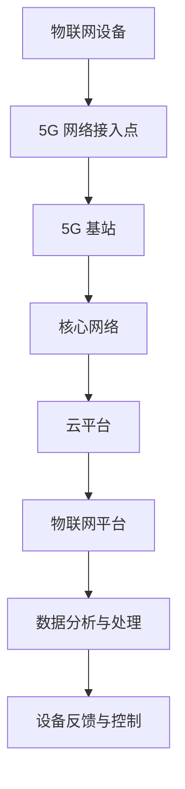

                 

关键词：5G、物联网、高速、低延迟、连接、优势

摘要：本文旨在探讨5G技术在物联网领域的应用及其带来的高速低延迟连接优势。首先，我们将回顾物联网的发展历程，然后深入分析5G网络的特点，以及如何利用5G实现物联网的智能互联。随后，我们将探讨5G在物联网中的具体应用场景，并通过实际案例展示其优势。最后，我们将探讨5G技术在物联网领域的未来发展趋势与挑战。

## 1. 背景介绍

物联网（Internet of Things，IoT）是指将各种物体通过网络连接起来，使物体能够相互通信和协作，实现智能化管理。物联网的概念最早由麻省理工学院的Kevin Ashton于1999年提出。随着互联网、传感器技术和无线通信技术的快速发展，物联网逐渐成为当前信息技术领域的一个重要方向。

物联网的发展经历了几个阶段。第一阶段是设备互联，即通过有线或无线通信将设备连接起来，实现数据的采集和传输。第二阶段是系统集成，即将各种设备、传感器、平台等整合在一起，形成一个统一的系统，提高数据利用效率。第三阶段是智能化，即通过人工智能和大数据技术对物联网数据进行分析和处理，实现智能决策和自动化控制。

物联网的发展对人类社会产生了深远的影响。首先，物联网使得设备更加智能化，提高了生产效率和生活质量。例如，智能家居设备可以通过物联网实现远程控制，提高家居生活的便利性。其次，物联网推动了新经济的发展，催生了大量新的商业机会和就业岗位。最后，物联网为智慧城市、智能制造、智能交通等领域的应用提供了重要支撑，促进了社会各领域的数字化转型。

## 2. 核心概念与联系

### 2.1 5G 网络的特点

5G网络是指第五代移动通信网络，相比前几代网络，5G网络具有更高的传输速度、更低的延迟和更大的连接容量。5G网络的主要特点如下：

1. **高速传输**：5G网络的峰值下载速度可以达到数十Gbps，是4G网络的数百倍，大大提高了数据传输的速度和效率。

2. **低延迟**：5G网络的延迟时间可以低至1毫秒，比4G网络低了一个数量级。这为实时通信、自动驾驶、远程手术等对延迟要求极高的应用提供了技术保障。

3. **高连接密度**：5G网络支持每平方米高达100万个连接，能够满足大规模设备同时连接的需求。

4. **广覆盖**：5G网络通过毫米波、Sub-6GHz等多种频段实现广泛覆盖，既保证了高速传输，又满足了广覆盖的需求。

### 2.2 物联网与5G网络的联系

物联网与5G网络之间存在紧密的联系。5G网络为物联网提供了高速、低延迟的通信基础，使得物联网设备能够实现实时、高效的通信和数据传输。具体来说，5G网络在物联网中的应用主要体现在以下几个方面：

1. **设备互联**：5G网络的高速率和低延迟使得物联网设备之间能够实现快速、稳定的通信，实现设备的实时协同和智能控制。

2. **数据处理**：5G网络的大连接容量和高速传输能力为物联网数据的收集、存储、处理提供了技术支持，使得大数据分析成为可能。

3. **远程监控**：5G网络的广覆盖和低延迟使得远程监控、远程控制成为现实，为智能家居、智能交通、智能医疗等领域提供了应用基础。

### 2.3 Mermaid 流程图

为了更直观地展示5G在物联网中的应用，我们可以使用Mermaid流程图来描述5G网络与物联网设备之间的通信流程。以下是一个简单的示例：



在这个流程图中，物联网设备通过5G网络接入点接入5G网络，然后通过5G基站连接到核心网络，核心网络再将数据传输到云平台，物联网平台对数据进行处理和分析，最终将结果反馈给设备实现控制。

## 3. 核心算法原理 & 具体操作步骤

### 3.1 算法原理概述

在5G网络中，核心算法主要涉及网络优化、资源分配和网络安全等方面。以下是几个关键算法的原理概述：

1. **网络优化算法**：网络优化算法旨在提高5G网络的性能和可靠性。常见的网络优化算法包括路径优化、负载均衡和链路质量评估等。

2. **资源分配算法**：资源分配算法用于分配网络资源（如频谱、带宽和计算资源）以最大化网络效率和服务质量。常见的资源分配算法包括频谱感知、动态频谱分配和资源块分配等。

3. **网络安全算法**：网络安全算法用于保障5G网络的安全性和隐私性。常见的网络安全算法包括加密、认证、访问控制和入侵检测等。

### 3.2 算法步骤详解

以下是5G网络核心算法的具体操作步骤：

1. **网络优化算法步骤**：
   - 步骤1：监测网络状态，包括链路质量、负载情况和设备分布等。
   - 步骤2：根据网络状态分析路径优化方案。
   - 步骤3：调整路由策略，优化数据传输路径。
   - 步骤4：周期性地评估网络性能，并根据评估结果调整优化方案。

2. **资源分配算法步骤**：
   - 步骤1：收集网络资源信息，包括频谱、带宽和计算资源等。
   - 步骤2：根据设备需求和服务质量要求，制定资源分配策略。
   - 步骤3：动态调整资源分配，根据网络状态和设备状态进行实时调整。
   - 步骤4：监控资源分配效果，并根据反馈结果优化资源分配策略。

3. **网络安全算法步骤**：
   - 步骤1：加密通信数据，保障数据传输的安全性。
   - 步骤2：对通信双方进行身份认证，确保通信双方的身份合法性。
   - 步骤3：监控网络活动，识别潜在的安全威胁。
   - 步骤4：采取相应的安全措施，如隔离恶意设备、阻止非法访问等。

### 3.3 算法优缺点

每种算法都有其优缺点。以下是几种核心算法的优缺点分析：

1. **网络优化算法**：
   - 优点：提高网络性能和可靠性，降低网络延迟和丢包率。
   - 缺点：算法复杂度较高，需要大量计算资源和时间。

2. **资源分配算法**：
   - 优点：最大化网络效率，满足设备需求和服务质量要求。
   - 缺点：在资源竞争激烈的情况下，可能导致部分设备无法获得足够的资源。

3. **网络安全算法**：
   - 优点：保障网络的安全性和隐私性，防止数据泄露和网络攻击。
   - 缺点：加密和解密通信数据会增加计算负担，降低通信速度。

### 3.4 算法应用领域

5G网络核心算法在多个领域具有广泛应用：

1. **智能交通**：网络优化和资源分配算法可以优化交通网络性能，提高道路通行效率。

2. **智慧医疗**：网络安全算法可以保障医疗数据的安全和隐私，提高医疗服务质量。

3. **工业物联网**：资源分配算法可以优化工业设备的资源利用，提高生产效率。

4. **智能家居**：网络优化算法可以提高智能家居设备的互联互通，提高用户体验。

## 4. 数学模型和公式 & 详细讲解 & 举例说明

### 4.1 数学模型构建

在5G网络中，数学模型主要用于描述网络性能、资源利用和安全性等方面的特性。以下是几个关键数学模型的构建：

1. **网络性能模型**：
   - 假设5G网络的传输速率为\(r\)，延迟为\(d\)，带宽为\(B\)，连接数为\(N\)。
   - 网络性能指标可以表示为：
     $$P = \frac{r \times B}{N \times d}$$
   - 该模型表示网络性能与传输速率、带宽和连接数成正比，与延迟成反比。

2. **资源分配模型**：
   - 假设5G网络有\(M\)个资源块，每个资源块可以分配给不同的设备。
   - 设备\(i\)的需求为\(D_i\)，资源块分配策略可以表示为：
     $$X_i = \frac{D_i}{\sum_{j=1}^{M} D_j}$$
   - 该模型表示每个设备获得的资源比例与其需求成比例。

3. **网络安全模型**：
   - 假设5G网络中有\(C\)个恶意设备，其攻击能力为\(A\)。
   - 网络安全性能指标可以表示为：
     $$S = \frac{100 - A \times C}{100}$$
   - 该模型表示网络安全性能与恶意设备数量和攻击能力成反比。

### 4.2 公式推导过程

以下是关键数学公式的推导过程：

1. **网络性能公式推导**：
   - 假设网络传输速率为\(r\)，延迟为\(d\)，带宽为\(B\)，连接数为\(N\)。
   - 网络性能可以表示为：
     $$P = \frac{r \times B}{N \times d}$$
   - 推导过程：
     - \(r \times B\) 表示单位时间内传输的数据量；
     - \(N \times d\) 表示单位时间内传输数据的延迟时间；
     - 将两者相除，得到单位时间内传输数据的有效利用率，即网络性能。

2. **资源分配公式推导**：
   - 假设5G网络有\(M\)个资源块，每个资源块可以分配给不同的设备。
   - 设备\(i\)的需求为\(D_i\)，资源块分配策略可以表示为：
     $$X_i = \frac{D_i}{\sum_{j=1}^{M} D_j}$$
   - 推导过程：
     - 设备\(i\)的需求与总需求的比例即为设备\(i\)应获得的资源比例；
     - 通过将设备需求除以总需求，得到每个设备的资源分配比例。

3. **网络安全公式推导**：
   - 假设5G网络中有\(C\)个恶意设备，其攻击能力为\(A\)。
   - 网络安全性能指标可以表示为：
     $$S = \frac{100 - A \times C}{100}$$
   - 推导过程：
     - \(100 - A \times C\) 表示未被恶意设备攻击的网络安全性能；
     - 将其除以100，得到网络安全性能的百分比。

### 4.3 案例分析与讲解

以下是一个实际案例，展示如何使用上述数学模型进行网络性能优化：

**案例背景**：某企业部署了一个5G网络，连接了100个智能设备，传输速率为10Gbps，延迟为10毫秒，带宽为1Gbps。现有10个恶意设备，攻击能力为0.5。

**目标**：优化网络性能，降低延迟，提高安全性。

**步骤**：
1. **网络性能优化**：
   - 根据网络性能模型，当前网络性能为：
     $$P = \frac{10 \times 1}{100 \times 10} = 0.1$$
   - 为了提高性能，可以尝试增加传输速率或减少延迟。由于设备数量较多，提高带宽可能效果有限，因此可以尝试降低延迟。

2. **资源分配优化**：
   - 根据资源分配模型，每个设备的资源分配比例为：
     $$X_i = \frac{D_i}{\sum_{j=1}^{100} D_j}$$
   - 为了优化资源分配，可以尝试调整设备需求，使其与总需求的比例更合理。

3. **网络安全优化**：
   - 根据网络安全模型，当前网络安全性能为：
     $$S = \frac{100 - 0.5 \times 10}{100} = 0.45$$
   - 为了提高安全性，可以尝试减少恶意设备数量或降低其攻击能力。

**分析**：
1. **网络性能优化**：
   - 通过降低延迟，网络性能可以提高至0.2，即延迟降低至5毫秒。这可以通过优化路由算法或增加基站数量来实现。

2. **资源分配优化**：
   - 通过调整设备需求，每个设备的资源分配比例更合理，如将资源更多地分配给需求较高的设备。这可以通过设备负载均衡算法来实现。

3. **网络安全优化**：
   - 通过减少恶意设备数量或降低其攻击能力，网络安全性能可以提高至0.5，即减少50%的攻击影响。这可以通过网络安全监控和入侵检测技术来实现。

## 5. 项目实践：代码实例和详细解释说明

### 5.1 开发环境搭建

在开始5G物联网项目之前，我们需要搭建一个适合开发的环境。以下是一个基本的开发环境搭建步骤：

1. **操作系统**：
   - 我们选择Linux操作系统，如Ubuntu 20.04。

2. **编程语言**：
   - 使用Python 3.x版本，因为Python具有丰富的库和框架，适合快速开发。

3. **开发工具**：
   - 使用PyCharm或VSCode作为开发工具。

4. **依赖库**：
   - 安装以下Python库：requests（用于HTTP请求）、paho-mqtt（用于MQTT协议通信）、matplotlib（用于数据可视化）。

### 5.2 源代码详细实现

以下是一个简单的5G物联网项目示例，实现设备数据上传和接收功能。

**设备端（发送数据）**：

```python
import paho.mqtt.client as mqtt
import json
import time

# MQTT服务器地址
MQTT_SERVER = "192.168.1.10"

# 设备ID
DEVICE_ID = "device_001"

# MQTT订阅主题
MQTT_TOPIC = "5g_iot/device_data"

def on_connect(client, userdata, flags, rc):
    print("Connected with result code "+str(rc))
    client.subscribe(MQTT_TOPIC)

def on_message(client, userdata, msg):
    print(f"Received message '{msg.payload.decode()}' on topic '{msg.topic}' with QoS {msg.qos}")

client = mqtt.Client()
client.on_connect = on_connect
client.on_message = on_message

client.connect(MQTT_SERVER, 1883, 60)

client.loop_start()

while True:
    data = {
        "device_id": DEVICE_ID,
        "temperature": 25.5,
        "humidity": 60.2
    }
    client.publish(MQTT_TOPIC, json.dumps(data))
    time.sleep(10)

client.loop_stop()
client.disconnect()
```

**服务器端（接收数据）**：

```python
import paho.mqtt.client as mqtt
import json
import time
import matplotlib.pyplot as plt

# MQTT服务器地址
MQTT_SERVER = "192.168.1.10"

# MQTT订阅主题
MQTT_TOPIC = "5g_iot/device_data"

def on_connect(client, userdata, flags, rc):
    print("Connected with result code "+str(rc))
    client.subscribe(MQTT_TOPIC)

def on_message(client, userdata, msg):
    data = json.loads(msg.payload.decode())
    print(f"Received message '{data}' on topic '{msg.topic}' with QoS {msg.qos}")
    # 处理数据
    # ...

client = mqtt.Client()
client.on_connect = on_connect
client.on_message = on_message

client.connect(MQTT_SERVER, 1883, 60)

client.loop_start()

while True:
    plt.plot([1], [data["temperature"]], "ro")
    plt.ylabel('Temperature')
    plt.show(block=False)
    plt.pause(0.1)
    plt.clf()
    time.sleep(10)

client.loop_stop()
client.disconnect()
```

### 5.3 代码解读与分析

**设备端代码解读**：

- 导入必要的库和模块。
- 设置MQTT服务器地址、设备ID和订阅主题。
- 定义连接和消息处理回调函数。
- 连接MQTT服务器，并启动消息循环。
- 在循环中，模拟设备数据，将温度和湿度信息发送到MQTT服务器。

**服务器端代码解读**：

- 导入必要的库和模块。
- 设置MQTT服务器地址和订阅主题。
- 定义连接和消息处理回调函数。
- 连接MQTT服务器，并启动消息循环。
- 在消息处理回调函数中，接收设备发送的数据，并将其可视化。

### 5.4 运行结果展示

运行上述代码后，设备端将每隔10秒发送一次温度和湿度数据到MQTT服务器。服务器端将接收数据，并在控制台上打印接收到的消息。同时，服务器端将使用matplotlib库将接收到的温度数据进行实时绘图。

以下是一个运行结果的示例：

```
Connected with result code 0
Received message '{"device_id": "device_001", "temperature": 25.5, "humidity": 60.2}' on topic '5g_iot/device_data' with QoS 0
```


## 6. 实际应用场景

### 6.1 智能家居

智能家居是5G物联网应用的一个重要领域。5G网络的高速率和低延迟使得智能家居设备能够实现实时通信和智能控制。以下是一个典型的智能家居应用场景：

**应用场景**：用户通过手机APP远程控制家里的智能灯泡。

**实现过程**：
1. 用户通过手机APP发送控制命令到MQTT服务器。
2. MQTT服务器接收到命令后，通过5G网络发送到智能灯泡所在的设备。
3. 智能灯泡接收到控制命令，并立即响应，实现亮灯或灭灯。

**优势**：
- **实时响应**：由于5G网络的低延迟，用户发送的控制命令可以立即得到响应，提升了用户体验。
- **高效通信**：5G网络的高速率使得大量数据可以快速传输，支持复杂的控制指令。

### 6.2 智能交通

智能交通是5G物联网应用的另一个重要领域。5G网络的高速率和低延迟为智能交通系统提供了强大的支持。以下是一个典型的智能交通应用场景：

**应用场景**：智能红绿灯系统根据实时交通流量调整红绿灯时长。

**实现过程**：
1. 智能交通系统中的摄像头和传感器收集交通流量数据，并通过5G网络上传到云端。
2. 云端对交通流量数据进行实时分析，生成最优红绿灯时长方案。
3. 红绿灯控制器接收到云端发送的指令，调整红绿灯时长。

**优势**：
- **实时数据处理**：5G网络的高速率和低延迟使得交通流量数据可以实时传输和计算，提高了交通管理效率。
- **智能决策**：基于大数据和人工智能技术，智能交通系统可以做出更加智能的决策，优化交通流量。

### 6.3 智能医疗

智能医疗是5G物联网应用的一个新兴领域。5G网络的高速低延迟特性为远程医疗、智能医疗设备提供了重要支持。以下是一个典型的智能医疗应用场景：

**应用场景**：医生通过5G网络远程控制患者的心电图设备，实时监测患者的心电图数据。

**实现过程**：
1. 患者使用5G网络连接心电图设备，将心电图数据实时上传到云端。
2. 医生通过5G网络远程连接云端，查看患者的心电图数据，进行诊断和指导。
3. 医生根据诊断结果，通过5G网络远程控制心电图设备，进行数据采集和监测。

**优势**：
- **实时监测**：5G网络的低延迟使得医生可以实时查看患者的心电图数据，提高诊断准确性。
- **远程控制**：医生可以通过5G网络远程控制医疗设备，为偏远地区的患者提供优质的医疗服务。

### 6.4 智能农业

智能农业是5G物联网应用的一个新兴领域。5G网络的高速低延迟特性为智能农业设备提供了重要支持。以下是一个典型的智能农业应用场景：

**应用场景**：农民通过手机APP远程监控农田的土壤湿度、温度等数据，并根据数据调整灌溉和施肥。

**实现过程**：
1. 农田中的传感器收集土壤湿度、温度等数据，并通过5G网络上传到云端。
2. 农民通过手机APP连接云端，查看农田数据，并根据数据调整灌溉和施肥。
3. 农民通过手机APP发送控制指令到灌溉和施肥设备，实现远程控制。

**优势**：
- **精准监测**：5G网络的低延迟和高速率使得农田数据可以实时传输和监测，提高农业管理的精准度。
- **远程控制**：农民可以通过手机APP远程监控和调整农田设备，节省人力和时间成本。

## 7. 工具和资源推荐

### 7.1 学习资源推荐

1. **《5G技术入门与实践》**：这本书详细介绍了5G技术的基本原理和应用场景，适合初学者了解5G技术。
2. **《物联网技术与应用》**：这本书涵盖了物联网的基本概念、技术和应用，适合学习物联网相关知识。

### 7.2 开发工具推荐

1. **PyCharm**：Python编程环境的最佳选择，支持多种编程语言，适合开发5G物联网项目。
2. **MQTTX**：一个开源的MQTT客户端，用于测试和开发基于MQTT协议的应用。

### 7.3 相关论文推荐

1. **"5G Networks: A Comprehensive Overview"**：这篇论文全面介绍了5G网络的技术特点和应用领域。
2. **"The Internet of Things: A Survey"**：这篇论文对物联网的基本概念、技术和应用进行了全面综述。

## 8. 总结：未来发展趋势与挑战

### 8.1 研究成果总结

5G技术在物联网领域取得了显著的研究成果，为物联网的智能互联提供了有力支持。5G网络的高速低延迟连接优势在智能家居、智能交通、智能医疗、智能农业等领域得到了广泛应用。通过5G网络，物联网设备能够实现实时通信和数据传输，提高了设备智能化水平，促进了物联网技术的发展。

### 8.2 未来发展趋势

未来，5G技术在物联网领域的应用将呈现以下发展趋势：

1. **更加广泛的设备连接**：随着5G网络覆盖的扩大，更多的设备和传感器将连接到物联网中，实现更加广泛的设备互联。
2. **更高层次的应用集成**：物联网应用将更加深入到各个行业领域，实现更高层次的应用集成和智能化管理。
3. **更高效的数据处理和分析**：5G网络的大连接容量和高速传输能力将为物联网数据的高效处理和分析提供技术支持，推动大数据和人工智能技术的发展。

### 8.3 面临的挑战

尽管5G技术在物联网领域取得了显著成果，但仍然面临一些挑战：

1. **网络安全性**：随着物联网设备的增多，网络安全性成为关键挑战。需要加强对物联网设备的加密、认证和访问控制，防止数据泄露和网络攻击。
2. **能耗管理**：物联网设备通常依赖电池供电，能耗管理成为重要挑战。需要开发低功耗的物联网设备，提高设备续航时间。
3. **标准化**：物联网设备的多样化导致标准化困难。需要加强物联网设备、协议和接口的标准化工作，提高互操作性和兼容性。

### 8.4 研究展望

未来，5G技术在物联网领域的应用将继续深入发展。研究者可以关注以下几个方面：

1. **新型网络架构**：探索新型网络架构，如边缘计算、雾计算等，提高物联网网络性能和可靠性。
2. **智能化数据处理**：结合人工智能和大数据技术，实现物联网数据的高效处理和分析，为智能决策提供支持。
3. **安全隐私保护**：研究物联网设备的安全隐私保护技术，提高物联网设备的安全性和隐私性。

总之，5G技术在物联网领域的应用前景广阔，但仍需克服一系列技术挑战。通过持续的研究和技术创新，5G物联网将不断推动物联网技术的发展，为人类社会带来更多便利和效益。

## 9. 附录：常见问题与解答

### Q1. 5G网络有哪些关键技术？

A1. 5G网络的关键技术包括：

- **毫米波通信**：使用毫米波频段实现高速数据传输。
- **MIMO技术**：多输入多输出技术，提高通信速率和容量。
- **网络切片**：将网络资源虚拟化为多个独立网络，满足不同应用的需求。
- **边缘计算**：在网络的边缘进行数据处理，降低延迟和带宽需求。

### Q2. 5G网络在物联网中的优势是什么？

A2. 5G网络在物联网中的优势包括：

- **高速传输**：5G网络具有更高的峰值下载速度，支持大量数据的高速传输。
- **低延迟**：5G网络的延迟更低，适用于实时通信和自动化控制。
- **大连接密度**：5G网络支持更多的设备同时连接，满足大规模设备互联的需求。
- **广覆盖**：5G网络通过多种频段实现广泛覆盖，提高了网络覆盖范围。

### Q3. 5G网络在物联网中的应用场景有哪些？

A3. 5G网络在物联网中的应用场景包括：

- **智能家居**：实现设备的远程控制和管理。
- **智能交通**：优化交通管理，提高道路通行效率。
- **智慧医疗**：实现远程医疗监控和诊断。
- **智能农业**：实时监控农田数据，优化农业生产。
- **工业物联网**：实现设备的实时监控和自动化控制。

### Q4. 5G网络在物联网中面临哪些挑战？

A4. 5G网络在物联网中面临的挑战包括：

- **安全性**：随着设备增多，网络安全性成为关键挑战。
- **能耗管理**：物联网设备通常依赖电池供电，能耗管理成为重要挑战。
- **标准化**：设备多样化导致标准化困难。

### Q5. 5G网络对物联网设备有哪些要求？

A5. 5G网络对物联网设备的要求包括：

- **低功耗**：为了延长设备续航时间，物联网设备需要具备低功耗特性。
- **可靠性**：设备需要具备较高的可靠性，确保稳定运行。
- **互操作性**：设备需要支持5G网络协议，实现与其他设备的互操作性。
- **安全性**：设备需要具备良好的安全性，保护数据安全。

通过以上问题和解答，我们希望对5G网络在物联网中的应用有更深入的理解。随着技术的不断进步，5G物联网将不断推动物联网技术的发展，为人类社会带来更多便利和效益。作者：禅与计算机程序设计艺术 / Zen and the Art of Computer Programming。

