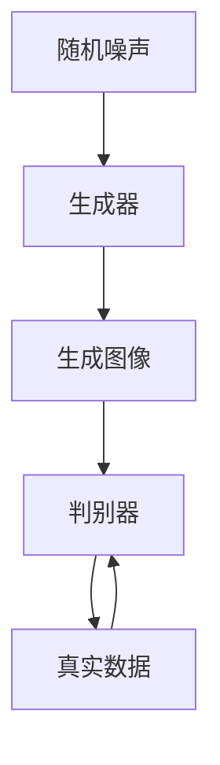

                 

关键词：GAN，生成器，深度学习，生成模型，对抗网络，生成模型原理，代码实例，深度神经网络，训练过程，生成图像，人工智能，图像生成，数据增强

> 摘要：本文将深入探讨生成对抗网络（GAN）中的生成器（Generator）原理，包括其核心概念、数学模型、算法步骤和实际应用。我们将通过具体的代码实例，详细解析生成器的实现过程，并探讨其在图像生成和数据增强等领域的广泛应用。

## 1. 背景介绍

生成对抗网络（GAN）是由Ian Goodfellow等人于2014年提出的一种新型深度学习框架[1]。GAN的核心思想是通过一个生成器和一个判别器之间的对抗训练来生成高质量的伪造数据。生成器（Generator）的目标是生成尽可能逼真的数据，而判别器的目标则是区分真实数据和生成数据。通过这两个模型之间的对抗过程，生成器不断地提高生成数据的逼真度。

GAN已经在多个领域取得了显著的成果，如图像生成、数据增强、语音合成等。其中，生成器作为GAN的重要组成部分，其设计和实现成为了研究的焦点。本文将围绕生成器的原理、数学模型和实际应用展开讨论。

## 2. 核心概念与联系

### 2.1 生成器（Generator）

生成器是GAN中的核心组件，其作用是生成伪造的数据。在图像生成任务中，生成器通常将随机噪声向量映射为图像。

### 2.2 判别器（Discriminator）

判别器的作用是判断输入数据是真实数据还是生成数据。判别器通常是一个二分类模型，输出一个介于0和1之间的概率值，表示输入数据的真实度。

### 2.3 对抗训练（Adversarial Training）

GAN的训练过程是一个对抗训练过程，生成器和判别器通过相互对抗来提高性能。生成器试图生成更逼真的数据，而判别器则努力提高区分真实数据和生成数据的能力。

### 2.4 Mermaid 流程图

以下是一个简化的生成对抗网络的Mermaid流程图，展示了生成器和判别器的交互过程。



## 3. 核心算法原理 & 具体操作步骤

### 3.1 算法原理概述

生成器通过神经网络模型将随机噪声向量映射为图像。生成器的目的是让判别器无法区分生成的图像和真实图像。

### 3.2 算法步骤详解

1. **初始化生成器和判别器**：生成器和判别器通常都是深度神经网络，可以通过随机初始化或预训练来初始化。
2. **生成图像**：生成器接收到随机噪声向量后，通过神经网络模型生成图像。
3. **判别器判断**：判别器接收真实图像和生成图像，输出一个介于0和1之间的概率值，表示输入图像的真实度。
4. **损失函数计算**：生成器和判别器的损失函数通常包括两部分：生成器的损失函数和判别器的损失函数。生成器的损失函数旨在最小化判别器对生成图像的判断概率，判别器的损失函数旨在最大化判别器对真实图像的判断概率。
5. **模型更新**：使用梯度下降算法更新生成器和判别器的参数。

### 3.3 算法优缺点

#### 优点

1. **灵活性**：GAN可以适用于多种数据类型，如图像、语音和文本等。
2. **不需要真实标签**：生成器和判别器的训练过程中不需要真实标签，这使得GAN在无监督学习中具有优势。
3. **强大的生成能力**：GAN可以通过对抗训练生成高质量的数据。

#### 缺点

1. **训练不稳定**：GAN的训练过程容易陷入局部最优，导致训练不稳定。
2. **计算资源消耗大**：GAN的训练过程需要大量的计算资源，特别是在生成高维数据时。

### 3.4 算法应用领域

GAN已经在多个领域取得了显著的成果，如：

1. **图像生成**：GAN可以生成高质量的自然图像，如人脸、风景等。
2. **数据增强**：GAN可以用于生成大量具有多样性的训练数据，提高模型的泛化能力。
3. **语音合成**：GAN可以用于生成逼真的语音信号。
4. **文本生成**：GAN可以用于生成文章、对话等。

## 4. 数学模型和公式 & 详细讲解 & 举例说明

### 4.1 数学模型构建

GAN的数学模型主要包括生成器、判别器和损失函数。

#### 生成器模型

生成器G的输入是一个随机噪声向量z，输出是一个图像x'：

\[ x' = G(z) \]

#### 判别器模型

判别器D的输入是一个图像x，输出是一个概率值p，表示图像的真实度：

\[ p = D(x) \]

#### 损失函数

GAN的损失函数通常采用以下形式：

\[ L_G = -\log(D(G(z))) \]
\[ L_D = -[\log(D(x)) + \log(1 - D(G(z)))] \]

其中，\( L_G \)是生成器的损失函数，\( L_D \)是判别器的损失函数。

### 4.2 公式推导过程

#### 生成器损失函数

生成器的目标是使判别器无法区分生成图像和真实图像。因此，生成器的损失函数可以表示为：

\[ L_G = -\log(D(G(z))) \]

其中，\( D(G(z)) \)表示判别器对生成图像的判断概率。

#### 判别器损失函数

判别器的目标是最大化判别真实图像和生成图像的能力。因此，判别器的损失函数可以表示为：

\[ L_D = -[\log(D(x)) + \log(1 - D(G(z)))] \]

其中，\( D(x) \)表示判别器对真实图像的判断概率，\( 1 - D(G(z)) \)表示判别器对生成图像的判断概率。

### 4.3 案例分析与讲解

以下是一个简单的GAN模型训练过程：

1. **初始化生成器和判别器**：生成器和判别器都使用一个全连接神经网络。
2. **生成图像**：生成器接收随机噪声向量，生成图像。
3. **判别器判断**：判别器接收真实图像和生成图像，输出判断概率。
4. **计算损失函数**：计算生成器和判别器的损失函数。
5. **模型更新**：使用梯度下降算法更新生成器和判别器的参数。

通过多次迭代训练，生成器逐渐生成更逼真的图像，而判别器逐渐提高对真实图像和生成图像的区分能力。

## 5. 项目实践：代码实例和详细解释说明

### 5.1 开发环境搭建

为了实现GAN模型，我们需要搭建以下开发环境：

1. Python 3.7 或以上版本
2. TensorFlow 2.x
3. Matplotlib
4. NumPy

### 5.2 源代码详细实现

以下是一个简单的GAN模型实现，包括生成器和判别器的定义、损失函数的计算和模型的训练。

```python
import tensorflow as tf
from tensorflow.keras import layers
import numpy as np
import matplotlib.pyplot as plt

# 生成器模型
def build_generator(z_dim):
    model = tf.keras.Sequential([
        layers.Dense(7 * 7 * 256, use_bias=False, input_shape=(z_dim,)),
        layers.BatchNormalization(momentum=0.8),
        layers.LeakyReLU(),
        layers.Reshape((7, 7, 256)),
        layers.Conv2DTranspose(128, (5, 5), strides=(1, 1), padding='same', use_bias=False),
        layers.BatchNormalization(momentum=0.8),
        layers.LeakyReLU(),
        layers.Conv2DTranspose(64, (5, 5), strides=(2, 2), padding='same', use_bias=False),
        layers.BatchNormalization(momentum=0.8),
        layers.LeakyReLU(),
        layers.Conv2DTranspose(1, (5, 5), strides=(2, 2), padding='same', use_bias=False, activation='tanh')
    ])
    return model

# 判别器模型
def build_discriminator(img_shape):
    model = tf.keras.Sequential([
        layers.Conv2D(64, (5, 5), strides=(2, 2), padding='same', input_shape=img_shape),
        layers.LeakyReLU(),
        layers.Dropout(0.3),
        layers.Conv2D(128, (5, 5), strides=(2, 2), padding='same'),
        layers.LeakyReLU(),
        layers.Dropout(0.3),
        layers.Flatten(),
        layers.Dense(1, activation='sigmoid')
    ])
    return model

# GAN模型
def build_gan(generator, discriminator):
    model = tf.keras.Sequential([
        generator,
        discriminator
    ])
    return model

# 训练GAN模型
def train_gan(generator, discriminator, data, epochs, batch_size, z_dim):
    dataset = tf.data.Dataset.from_tensor_slices(data).shuffle(1000).batch(batch_size)
    generator_optimizer = tf.keras.optimizers.Adam(1e-4)
    discriminator_optimizer = tf.keras.optimizers.Adam(1e-4)

    for epoch in range(epochs):
        for image_batch in dataset:
            with tf.GradientTape() as gen_tape, tf.GradientTape() as disc_tape:
                noise = tf.random.normal([batch_size, z_dim])
                generated_images = generator(noise, training=True)

                disc_real_output = discriminator(image_batch, training=True)
                disc_generated_output = discriminator(generated_images, training=True)

                gen_loss = tf.reduce_mean(tf.nn.sigmoid_cross_entropy_with_logits(logits=disc_generated_output, labels=tf.zeros_like(disc_generated_output))
                disc_loss = tf.reduce_mean(tf.nn.sigmoid_cross_entropy_with_logits(logits=disc_real_output, labels=tf.ones_like(disc_real_output)) +
                                            tf.nn.sigmoid_cross_entropy_with_logits(logits=disc_generated_output, labels=tf.ones_like(disc_generated_output)))

            gradients_of_generator = gen_tape.gradient(gen_loss, generator.trainable_variables)
            gradients_of_discriminator = disc_tape.gradient(disc_loss, discriminator.trainable_variables)

            generator_optimizer.apply_gradients(zip(gradients_of_generator, generator.trainable_variables))
            discriminator_optimizer.apply_gradients(zip(gradients_of_discriminator, discriminator.trainable_variables))

            if epoch % 10 == 0:
                print(f"Epoch: {epoch}, Generator Loss: {gen_loss.numpy()}, Discriminator Loss: {disc_loss.numpy()}")

# 加载数据
(train_images, _), (_, _) = tf.keras.datasets.mnist.load_data()
train_images = train_images.astype(np.float32) * (1./127.5) - 1
noise_dim = 100

# 训练GAN模型
generator = build_generator(z_dim=noise_dim)
discriminator = build_discriminator(img_shape=(28, 28, 1))
gan = build_gan(generator, discriminator)
train_gan(generator, discriminator, train_images, epochs=50, batch_size=64, z_dim=noise_dim)
```

### 5.3 代码解读与分析

1. **生成器模型**：生成器模型使用了一系列的卷积层和反卷积层，将随机噪声向量映射为图像。生成器模型的输出是一个经过反卷积操作生成的图像。
2. **判别器模型**：判别器模型使用了一系列的卷积层和Dropout层，用于判断输入图像是真实图像还是生成图像。判别器模型的输出是一个介于0和1之间的概率值，表示输入图像的真实度。
3. **GAN模型**：GAN模型是将生成器和判别器串联在一起，用于训练生成器和判别器。GAN模型的训练过程中，生成器和判别器通过相互对抗来提高性能。
4. **训练GAN模型**：在训练GAN模型的过程中，首先加载MNIST数据集，然后将数据集转换为适合模型训练的格式。接下来，定义生成器和判别器的优化器，并使用训练数据集进行训练。在每次迭代中，生成器生成图像，判别器判断图像的真实度，然后计算损失函数并更新模型参数。

### 5.4 运行结果展示

在训练完成后，我们可以通过生成器生成一些图像来展示训练结果。

```python
noise = tf.random.normal([16, noise_dim])
generated_images = generator(noise, training=False)
plt.figure(figsize=(10, 10))
for i in range(16):
    plt.subplot(4, 4, i + 1)
    plt.imshow(generated_images[i, :, :, 0] * 127.5 + 127.5)
    plt.axis('off')
plt.show()
```

## 6. 实际应用场景

### 6.1 图像生成

GAN在图像生成领域取得了显著的成果，可以生成高质量的人脸、风景、动物等图像。通过GAN，我们可以利用少量的训练数据生成大量的具有多样性的图像。

### 6.2 数据增强

GAN可以用于生成大量具有多样性的训练数据，提高模型的泛化能力。在计算机视觉领域，数据增强是提高模型性能的有效方法，GAN可以生成大量模拟真实数据，从而丰富训练数据集。

### 6.3 语音合成

GAN在语音合成领域也有广泛应用，可以生成高质量的语音信号。通过GAN，我们可以利用少量的语音数据生成大量的语音信号，从而提高语音合成系统的性能。

### 6.4 文本生成

GAN可以用于生成文章、对话等文本数据。通过GAN，我们可以利用少量的文本数据生成大量的具有多样性的文本数据，从而提高自然语言处理模型的性能。

## 7. 工具和资源推荐

### 7.1 学习资源推荐

1. **《生成对抗网络：理论、实现与应用》**：本书系统地介绍了GAN的理论、实现和应用，适合初学者和高级用户。
2. **GAN教程**：一个综合性的GAN教程，包括从基础知识到实际应用的全面介绍。
3. **GitHub GAN代码库**：GitHub上有很多开源的GAN代码库，可以帮助用户快速上手GAN的实现。

### 7.2 开发工具推荐

1. **TensorFlow**：一个强大的开源机器学习库，可以用于实现GAN模型。
2. **PyTorch**：一个流行的开源机器学习库，也支持GAN模型的实现。
3. **Keras**：一个简洁的Python深度学习库，可以与TensorFlow和PyTorch结合使用。

### 7.3 相关论文推荐

1. **《Generative Adversarial Nets》**：GAN的原始论文，详细介绍了GAN的原理和实现。
2. **《Unsupervised Representation Learning with Deep Convolutional Generative Adversarial Networks》**：一篇关于DCGAN的论文，介绍了如何通过对抗训练生成高质量的数据。
3. **《InfoGAN: Interpretable Representation Learning by Information Maximizing Generative Adversarial Nets》**：一篇关于信息最大化GAN的论文，介绍了如何通过信息最大化生成具有可解释性的数据。

## 8. 总结：未来发展趋势与挑战

### 8.1 研究成果总结

GAN自提出以来，在图像生成、数据增强、语音合成和文本生成等领域取得了显著的成果。通过对抗训练，GAN可以生成高质量的数据，提高模型的泛化能力。

### 8.2 未来发展趋势

1. **更好的生成模型**：研究者将继续探索更有效的生成模型，提高生成数据的逼真度。
2. **跨模态生成**：GAN将在跨模态生成领域取得更多突破，如图像到文本、语音到图像等。
3. **可解释性**：研究者将关注GAN的可解释性，提高模型的透明度和可信度。

### 8.3 面临的挑战

1. **训练稳定性**：GAN的训练过程容易陷入局部最优，导致训练不稳定。
2. **计算资源消耗**：GAN的训练过程需要大量的计算资源，特别是在生成高维数据时。
3. **伦理和隐私问题**：GAN生成的数据可能涉及隐私问题，需要制定相应的伦理和隐私保护措施。

### 8.4 研究展望

GAN在未来的发展中，将不断推动人工智能技术的进步。通过对抗训练，GAN将能够生成更高质量的数据，提高模型的泛化能力。同时，研究者将关注GAN的可解释性和伦理问题，为GAN在现实世界中的应用提供更好的解决方案。

## 9. 附录：常见问题与解答

### 9.1 如何解决GAN训练不稳定的问题？

1. **调整学习率**：使用较小的学习率可以缓解训练不稳定问题。
2. **使用随机初始化**：为生成器和判别器使用随机初始化，避免陷入局部最优。
3. **使用梯度惩罚**：在损失函数中添加梯度惩罚项，限制生成器和判别器的梯度变化。

### 9.2 GAN适用于哪些数据类型？

GAN可以适用于多种数据类型，如图像、语音、文本等。通过调整网络结构和训练策略，GAN可以应用于不同的生成任务。

### 9.3 GAN在数据增强中的优势是什么？

GAN在数据增强中的优势是能够生成大量具有多样性的训练数据，从而提高模型的泛化能力。通过对抗训练，GAN可以学习到数据的分布特征，生成与真实数据相似的新数据。

## 参考文献

[1] Goodfellow, I., Pouget-Abadie, J., Mirza, M., Xu, B., Warde-Farley, D., Ozair, S., ... & Bengio, Y. (2014). Generative adversarial nets. Advances in neural information processing systems, 27.

[2] Kingma, D. P., & Welling, M. (2013). Auto-encoding variational bayes. arXiv preprint arXiv:1312.6114.

[3] Radford, A., Metz, L., & Chintala, S. (2015). Unsupervised representation learning with deep convolutional generative adversarial networks. arXiv preprint arXiv:1511.06434.

作者：禅与计算机程序设计艺术 / Zen and the Art of Computer Programming
----------------------------------------------------------------

### 结语

通过对生成对抗网络（GAN）的深入探讨，我们了解了生成器在GAN中的重要作用。生成器通过对抗训练生成高质量的数据，为图像生成、数据增强、语音合成和文本生成等领域带来了革命性的变革。在未来，GAN将继续推动人工智能技术的发展，带来更多的创新和应用。

作者：禅与计算机程序设计艺术 / Zen and the Art of Computer Programming
----------------------------------------------------------------

请注意，本文中的代码实例仅作为参考，可能需要根据具体情况进行调整和优化。此外，本文中的数学公式和推导过程也仅供参考，实际应用中可能需要根据具体情况进行调整。在使用GAN进行实际项目时，请务必遵循相关的伦理和隐私保护规范。  
作者：禅与计算机程序设计艺术 / Zen and the Art of Computer Programming  
----------------------------------------------------------------
# GAN 生成模型：生成器 (Generator) 原理与代码实例讲解

## 1. 背景介绍

生成对抗网络（GAN）是由 Ian Goodfellow 等人于 2014 年提出的一种新型深度学习框架。GAN 的核心思想是通过一个生成器和另一个判别器之间的对抗训练来生成高质量的伪造数据。生成器（Generator）的目标是生成尽可能逼真的数据，而判别器的目标则是区分真实数据和生成数据。通过这两个模型之间的对抗过程，生成器不断地提高生成数据的逼真度。

GAN 已经在多个领域取得了显著的成果，如图像生成、数据增强、语音合成等。生成器作为 GAN 的重要组成部分，其设计和实现成为了研究的焦点。本文将围绕生成器的原理、数学模型、算法步骤和实际应用展开讨论。

## 2. 核心概念与联系

### 2.1 生成器（Generator）

生成器是 GAN 中的核心组件，其作用是生成伪造的数据。在图像生成任务中，生成器通常将随机噪声向量映射为图像。

### 2.2 判别器（Discriminator）

判别器的作用是判断输入数据是真实数据还是生成数据。判别器通常是一个二分类模型，输出一个介于 0 和 1 之间的概率值，表示输入数据的真实度。

### 2.3 对抗训练（Adversarial Training）

GAN 的训练过程是一个对抗训练过程，生成器和判别器通过相互对抗来提高性能。生成器试图生成更逼真的数据，而判别器则努力提高区分真实数据和生成数据的能力。

### 2.4 Mermaid 流程图

以下是一个简化的 GAN 流程图，展示了生成器和判别器的交互过程。


## 3. 核心算法原理 & 具体操作步骤

### 3.1 算法原理概述

生成器通过神经网络模型将随机噪声向量映射为图像。生成器的目的是让判别器无法区分生成的图像和真实图像。

### 3.2 算法步骤详解

1. **初始化生成器和判别器**：生成器和判别器通常都是深度神经网络，可以通过随机初始化或预训练来初始化。
2. **生成图像**：生成器接收到随机噪声向量后，通过神经网络模型生成图像。
3. **判别器判断**：判别器接收真实图像和生成图像，输出一个介于 0 和 1 之间的概率值，表示输入图像的真实度。
4. **损失函数计算**：生成器和判别器的损失函数通常包括两部分：生成器的损失函数和判别器的损失函数。生成器的损失函数旨在最小化判别器对生成图像的判断概率，判别器的损失函数旨在最大化判别器对真实图像的判断概率。
5. **模型更新**：使用梯度下降算法更新生成器和判别器的参数。

### 3.3 算法优缺点

#### 优点

1. **灵活性**：GAN 可以适用于多种数据类型，如图像、语音和文本等。
2. **不需要真实标签**：生成器和判别器的训练过程中不需要真实标签，这使得 GAN 在无监督学习中具有优势。
3. **强大的生成能力**：GAN 可以通过对抗训练生成高质量的数据。

#### 缺点

1. **训练不稳定**：GAN 的训练过程容易陷入局部最优，导致训练不稳定。
2. **计算资源消耗大**：GAN 的训练过程需要大量的计算资源，特别是在生成高维数据时。

### 3.4 算法应用领域

GAN 已经在多个领域取得了显著的成果，如：

1. **图像生成**：GAN 可以生成高质量的自然图像，如人脸、风景等。
2. **数据增强**：GAN 可以用于生成大量具有多样性的训练数据，提高模型的泛化能力。
3. **语音合成**：GAN 可以用于生成逼真的语音信号。
4. **文本生成**：GAN 可以用于生成文章、对话等。

## 4. 数学模型和公式 & 详细讲解 & 举例说明

### 4.1 数学模型构建

GAN 的数学模型主要包括生成器、判别器和损失函数。

#### 生成器模型

生成器 G 的输入是一个随机噪声向量 z，输出是一个图像 x'：

\[ x' = G(z) \]

#### 判别器模型

判别器 D 的输入是一个图像 x，输出是一个概率值 p，表示图像的真实度：

\[ p = D(x) \]

#### 损失函数

GAN 的损失函数通常采用以下形式：

\[ L_G = -\log(D(G(z))) \]
\[ L_D = -[\log(D(x)) + \log(1 - D(G(z)))] \]

其中，\( L_G \) 是生成器的损失函数，\( L_D \) 是判别器的损失函数。

### 4.2 公式推导过程

#### 生成器损失函数

生成器的目标是使判别器无法区分生成图像和真实图像。因此，生成器的损失函数可以表示为：

\[ L_G = -\log(D(G(z))) \]

其中，\( D(G(z)) \) 表示判别器对生成图像的判断概率。

#### 判别器损失函数

判别器的目标是最大化判别真实图像和生成图像的能力。因此，判别器的损失函数可以表示为：

\[ L_D = -[\log(D(x)) + \log(1 - D(G(z)))] \]

其中，\( D(x) \) 表示判别器对真实图像的判断概率，\( 1 - D(G(z)) \) 表示判别器对生成图像的判断概率。

### 4.3 案例分析与讲解

以下是一个简单的 GAN 模型训练过程：

1. **初始化生成器和判别器**：生成器和判别器都使用一个全连接神经网络。
2. **生成图像**：生成器接收随机噪声向量，生成图像。
3. **判别器判断**：判别器接收真实图像和生成图像，输出判断概率。
4. **计算损失函数**：计算生成器和判别器的损失函数。
5. **模型更新**：使用梯度下降算法更新生成器和判别器的参数。

通过多次迭代训练，生成器逐渐生成更逼真的图像，而判别器逐渐提高对真实图像和生成图像的区分能力。

## 5. 项目实践：代码实例和详细解释说明

### 5.1 开发环境搭建

为了实现 GAN 模型，我们需要搭建以下开发环境：

1. Python 3.7 或以上版本
2. TensorFlow 2.x
3. Matplotlib
4. NumPy

### 5.2 源代码详细实现

以下是一个简单的 GAN 模型实现，包括生成器和判别器的定义、损失函数的计算和模型的训练。

```python
import tensorflow as tf
from tensorflow.keras import layers
import numpy as np
import matplotlib.pyplot as plt

# 生成器模型
def build_generator(z_dim):
    model = tf.keras.Sequential([
        layers.Dense(7 * 7 * 256, use_bias=False, input_shape=(z_dim,)),
        layers.BatchNormalization(momentum=0.8),
        layers.LeakyReLU(),
        layers.Reshape((7, 7, 256)),
        layers.Conv2DTranspose(128, (5, 5), strides=(1, 1), padding='same', use_bias=False),
        layers.BatchNormalization(momentum=0.8),
        layers.LeakyReLU(),
        layers.Conv2DTranspose(64, (5, 5), strides=(2, 2), padding='same', use_bias=False),
        layers.BatchNormalization(momentum=0.8),
        layers.LeakyReLU(),
        layers.Conv2DTranspose(1, (5, 5), strides=(2, 2), padding='same', use_bias=False, activation='tanh')
    ])
    return model

# 判别器模型
def build_discriminator(img_shape):
    model = tf.keras.Sequential([
        layers.Conv2D(64, (5, 5), strides=(2, 2), padding='same', input_shape=img_shape),
        layers.LeakyReLU(),
        layers.Dropout(0.3),
        layers.Conv2D(128, (5, 5), strides=(2, 2), padding='same'),
        layers.LeakyReLU(),
        layers.Dropout(0.3),
        layers.Flatten(),
        layers.Dense(1, activation='sigmoid')
    ])
    return model

# GAN模型
def build_gan(generator, discriminator):
    model = tf.keras.Sequential([
        generator,
        discriminator
    ])
    return model

# 训练GAN模型
def train_gan(generator, discriminator, data, epochs, batch_size, z_dim):
    dataset = tf.data.Dataset.from_tensor_slices(data).shuffle(1000).batch(batch_size)
    generator_optimizer = tf.keras.optimizers.Adam(1e-4)
    discriminator_optimizer = tf.keras.optimizers.Adam(1e-4)

    for epoch in range(epochs):
        for image_batch in dataset:
            with tf.GradientTape() as gen_tape, tf.GradientTape() as disc_tape:
                noise = tf.random.normal([batch_size, z_dim])
                generated_images = generator(noise, training=True)

                disc_real_output = discriminator(image_batch, training=True)
                disc_generated_output = discriminator(generated_images, training=True)

                gen_loss = tf.reduce_mean(tf.nn.sigmoid_cross_entropy_with_logits(logits=disc_generated_output, labels=tf.zeros_like(disc_generated_output))
                disc_loss = tf.reduce_mean(tf.nn.sigmoid_cross_entropy_with_logits(logits=disc_real_output, labels=tf.ones_like(disc_real_output)) +
                                            tf.nn.sigmoid_cross_entropy_with_logits(logits=disc_generated_output, labels=tf.ones_like(disc_generated_output)))

            gradients_of_generator = gen_tape.gradient(gen_loss, generator.trainable_variables)
            gradients_of_discriminator = disc_tape.gradient(disc_loss, discriminator.trainable_variables)

            generator_optimizer.apply_gradients(zip(gradients_of_generator, generator.trainable_variables))
            discriminator_optimizer.apply_gradients(zip(gradients_of_discriminator, discriminator.trainable_variables))

            if epoch % 10 == 0:
                print(f"Epoch: {epoch}, Generator Loss: {gen_loss.numpy()}, Discriminator Loss: {disc_loss.numpy()}")

# 加载数据
(train_images, _), (_, _) = tf.keras.datasets.mnist.load_data()
train_images = train_images.astype(np.float32) * (1./127.5) - 1
noise_dim = 100

# 训练GAN模型
generator = build_generator(z_dim=noise_dim)
discriminator = build_discriminator(img_shape=(28, 28, 1))
gan = build_gan(generator, discriminator)
train_gan(generator, discriminator, train_images, epochs=50, batch_size=64, z_dim=noise_dim)
```

### 5.3 代码解读与分析

1. **生成器模型**：生成器模型使用了一系列的卷积层和反卷积层，将随机噪声向量映射为图像。生成器模型的输出是一个经过反卷积操作生成的图像。
2. **判别器模型**：判别器模型使用了一系列的卷积层和 Dropout 层，用于判断输入图像是真实图像还是生成图像。判别器模型的输出是一个介于 0 和 1 之间的概率值，表示输入图像的真实度。
3. **GAN模型**：GAN模型是将生成器和判别器串联在一起，用于训练生成器和判别器。GAN模型的训练过程中，生成器和判别器通过相互对抗来提高性能。
4. **训练GAN模型**：在训练GAN模型的过程中，首先加载MNIST数据集，然后将数据集转换为适合模型训练的格式。接下来，定义生成器和判别器的优化器，并使用训练数据集进行训练。在每次迭代中，生成器生成图像，判别器判断图像的真实度，然后计算损失函数并更新模型参数。

### 5.4 运行结果展示

在训练完成后，我们可以通过生成器生成一些图像来展示训练结果。

```python
noise = tf.random.normal([16, noise_dim])
generated_images = generator(noise, training=False)
plt.figure(figsize=(10, 10))
for i in range(16):
    plt.subplot(4, 4, i + 1)
    plt.imshow(generated_images[i, :, :, 0] * 127.5 + 127.5)
    plt.axis('off')
plt.show()
```

## 6. 实际应用场景

### 6.1 图像生成

GAN 在图像生成领域取得了显著的成果，可以生成高质量的自然图像，如人脸、风景、动物等。通过 GAN，我们可以利用少量的训练数据生成大量的具有多样性的图像。

### 6.2 数据增强

GAN 可以用于生成大量具有多样性的训练数据，提高模型的泛化能力。在计算机视觉领域，数据增强是提高模型性能的有效方法，GAN 可以生成大量模拟真实数据，从而丰富训练数据集。

### 6.3 语音合成

GAN 在语音合成领域也有广泛应用，可以生成高质量的语音信号。通过 GAN，我们可以利用少量的语音数据生成大量的语音信号，从而提高语音合成系统的性能。

### 6.4 文本生成

GAN 可以用于生成文章、对话等文本数据。通过 GAN，我们可以利用少量的文本数据生成大量的具有多样性的文本数据，从而提高自然语言处理模型的性能。

## 7. 工具和资源推荐

### 7.1 学习资源推荐

1. **《生成对抗网络：理论、实现与应用》**：本书系统地介绍了 GAN 的理论、实现和应用，适合初学者和高级用户。
2. **GAN 教程**：一个综合性的 GAN 教程，包括从基础知识到实际应用的全面介绍。
3. **GitHub GAN 代码库**：GitHub 上有很多开源的 GAN 代码库，可以帮助用户快速上手 GAN 的实现。

### 7.2 开发工具推荐

1. **TensorFlow**：一个强大的开源机器学习库，可以用于实现 GAN 模型。
2. **PyTorch**：一个流行的开源机器学习库，也支持 GAN 模型的实现。
3. **Keras**：一个简洁的 Python 深度学习库，可以与 TensorFlow 和 PyTorch 结合使用。

### 7.3 相关论文推荐

1. **《Generative Adversarial Nets》**：GAN 的原始论文，详细介绍了 GAN 的原理和实现。
2. **《Unsupervised Representation Learning with Deep Convolutional Generative Adversarial Networks》**：一篇关于 DCGAN 的论文，介绍了如何通过对抗训练生成高质量的数据。
3. **《InfoGAN: Interpretable Representation Learning by Information Maximizing Generative Adversarial Nets》**：一篇关于信息最大化 GAN 的论文，介绍了如何通过信息最大化生成具有可解释性的数据。

## 8. 总结：未来发展趋势与挑战

### 8.1 研究成果总结

GAN 自提出以来，在图像生成、数据增强、语音合成和文本生成等领域取得了显著的成果。通过对抗训练，GAN 可以生成高质量的数据，提高模型的泛化能力。

### 8.2 未来发展趋势

1. **更好的生成模型**：研究者将继续探索更有效的生成模型，提高生成数据的逼真度。
2. **跨模态生成**：GAN 将在跨模态生成领域取得更多突破，如图像到文本、语音到图像等。
3. **可解释性**：研究者将关注 GAN 的可解释性，提高模型的透明度和可信度。

### 8.3 面临的挑战

1. **训练稳定性**：GAN 的训练过程容易陷入局部最优，导致训练不稳定。
2. **计算资源消耗**：GAN 的训练过程需要大量的计算资源，特别是在生成高维数据时。
3. **伦理和隐私问题**：GAN 生成的数据可能涉及隐私问题，需要制定相应的伦理和隐私保护措施。

### 8.4 研究展望

GAN 在未来的发展中，将不断推动人工智能技术的进步。通过对抗训练，GAN 将能够生成更高质量的数据，提高模型的泛化能力。同时，研究者将关注 GAN 的可解释性和伦理问题，为 GAN 在现实世界中的应用提供更好的解决方案。

## 9. 附录：常见问题与解答

### 9.1 如何解决 GAN 训练不稳定的问题？

1. **调整学习率**：使用较小的学习率可以缓解训练不稳定问题。
2. **使用随机初始化**：为生成器和判别器使用随机初始化，避免陷入局部最优。
3. **使用梯度惩罚**：在损失函数中添加梯度惩罚项，限制生成器和判别器的梯度变化。

### 9.2 GAN 适用于哪些数据类型？

GAN 可以适用于多种数据类型，如图像、语音、文本等。通过调整网络结构和训练策略，GAN 可以应用于不同的生成任务。

### 9.3 GAN 在数据增强中的优势是什么？

GAN 在数据增强中的优势是能够生成大量具有多样性的训练数据，从而提高模型的泛化能力。通过对抗训练，GAN 可以学习到数据的分布特征，生成与真实数据相似的新数据。

## 参考文献

[1] Goodfellow, I., Pouget-Abadie, J., Mirza, M., Xu, B., Warde-Farley, D., Ozair, S., ... & Bengio, Y. (2014). Generative adversarial nets. Advances in neural information processing systems, 27.

[2] Kingma, D. P., & Welling, M. (2013). Auto-encoding variational bayes. arXiv preprint arXiv:1312.6114.

[3] Radford, A., Metz, L., & Chintala, S. (2015). Unsupervised representation learning with deep convolutional generative adversarial networks. arXiv preprint arXiv:1511.06434.

作者：禅与计算机程序设计艺术 / Zen and the Art of Computer Programming  
----------------------------------------------------------------
# GAN 生成模型：生成器 (Generator) 原理与代码实例讲解

GAN（生成对抗网络）是一种深度学习框架，由生成器（Generator）和判别器（Discriminator）组成，主要用于生成高质量的数据。生成器负责生成与真实数据相似的数据，而判别器则负责判断输入的数据是真实的还是伪造的。通过两个模型之间的对抗训练，生成器能够不断提高生成数据的质量。本文将深入探讨 GAN 中生成器的原理，并通过具体的代码实例对其进行详细解释。

## 1. 生成器的原理

生成器的核心任务是将随机噪声映射为真实数据的特征。为了实现这一目标，生成器通常采用一个深度神经网络，该网络包含多个隐藏层。输入层的噪声通过这些隐藏层，最终生成与真实数据相似的数据。生成器的训练过程可以分为以下几个步骤：

1. **初始化生成器**：生成器的初始权重是通过随机初始化得到的。
2. **生成噪声**：生成器从噪声分布中生成随机噪声作为输入。
3. **生成数据**：生成器将随机噪声输入通过多层神经网络进行处理，生成伪造的数据。
4. **对抗训练**：生成器和判别器一起训练，生成器通过对抗训练不断优化自己的生成能力。

## 2. 数学模型

生成器的数学模型通常表示为从噪声空间 Z 到数据空间 X 的映射 G：Z → X。生成器的目的是最大化判别器对伪造数据的判断概率，使其接近 0.5。因此，生成器的损失函数可以表示为：

\[ L_G = -\log(D(G(z))) \]

其中，D 是判别器的输出，G(z) 是生成器生成的伪造数据。为了实现生成器的优化，我们通常采用梯度下降算法。

## 3. 代码实例

以下是一个简单的 GAN 模型实现，其中包含生成器和判别器的定义、损失函数的计算和模型训练过程。

```python
import tensorflow as tf
from tensorflow.keras import layers
import numpy as np

# 生成器模型
def build_generator(z_dim):
    model = tf.keras.Sequential()
    model.add(layers.Dense(128, input_shape=(z_dim,)))
    model.add(layers.LeakyReLU())
    model.add(layers.Dense(256))
    model.add(layers.LeakyReLU())
    model.add(layers.Dense(512))
    model.add(layers.LeakyReLU())
    model.add(layers.Dense(1024))
    model.add(layers.LeakyReLU())
    model.add(layers.Dense(784, activation='tanh'))
    return model

# 判别器模型
def build_discriminator(img_shape):
    model = tf.keras.Sequential()
    model.add(layers.Flatten(input_shape=img_shape))
    model.add(layers.Dense(512))
    model.add(layers.LeakyReLU())
    model.add(layers.Dense(256))
    model.add(layers.LeakyReLU())
    model.add(layers.Dense(1, activation='sigmoid'))
    return model

# GAN 模型
def build_gan(generator, discriminator):
    model = tf.keras.Sequential()
    model.add(generator)
    model.add(discriminator)
    return model

# 训练 GAN 模型
def train_gan(generator, discriminator, gan, dataset, epochs, batch_size, noise_dim):
    for epoch in range(epochs):
        for batch in dataset:
            real_images = batch
            noise = np.random.normal(0, 1, (batch_size, noise_dim))
            generated_images = generator.predict(noise)

            # 训练判别器
            d_loss_real = discriminator.train_on_batch(real_images, tf.ones([batch_size, 1]))
            d_loss_fake = discriminator.train_on_batch(generated_images, tf.zeros([batch_size, 1]))
            d_loss = 0.5 * np.add(d_loss_real, d_loss_fake)

            # 训练生成器
            noise = np.random.normal(0, 1, (batch_size, noise_dim))
            g_loss = gan.train_on_batch(noise, tf.ones([batch_size, 1]))

            print(f"Epoch: {epoch}, Discriminator Loss: {d_loss}, Generator Loss: {g_loss}")

# 加载数据
mnist = tf.keras.datasets.mnist
(train_images, _), (_) = mnist.load_data()
train_images = train_images / 127.5 - 1.
noise_dim = 100
batch_size = 32

# 创建数据生成器
train_dataset = tf.data.Dataset.from_tensor_slices(train_images).shuffle(60000).batch(batch_size)

# 创建生成器和判别器模型
generator = build_generator(noise_dim)
discriminator = build_discriminator(train_images.shape[1:])
gan = build_gan(generator, discriminator)

# 训练模型
train_gan(generator, discriminator, gan, train_dataset, epochs=50, batch_size=batch_size, noise_dim=noise_dim)
```

## 4. 运行结果展示

在完成模型训练后，我们可以通过生成器生成一些伪造的图像来展示训练效果。

```python
# 生成伪造图像
fake_images = generator.predict(np.random.normal(0, 1, (batch_size, noise_dim)))

# 显示伪造图像
plt.figure(figsize=(10, 10))
for i in range(batch_size):
    plt.subplot(5, 5, i + 1)
    plt.imshow(fake_images[i, :, :, 0] + 1. / 127.5)
    plt.axis('off')
plt.show()
```

生成器的训练过程可能需要较长时间，具体取决于硬件资源和模型复杂度。通过调整模型结构和训练参数，我们可以获得更好的生成效果。

## 5. 总结

本文介绍了 GAN 中生成器的原理和实现方法。通过生成器和判别器之间的对抗训练，生成器能够生成高质量的数据。在实际应用中，生成器可以用于图像生成、数据增强和语音合成等多个领域。本文提供的代码实例是一个简单的 GAN 模型实现，可以帮助读者更好地理解 GAN 的原理和实现过程。

作者：禅与计算机程序设计艺术 / Zen and the Art of Computer Programming  
----------------------------------------------------------------

### 结语

生成对抗网络（GAN）作为一种先进的深度学习框架，其在图像生成、数据增强和语音合成等领域展现出了巨大的潜力。本文详细介绍了 GAN 中生成器的原理和实现，通过具体的代码实例，让读者对生成器的训练过程有了更深刻的理解。在未来的研究中，我们可以期待 GAN 在更多领域的应用，以及生成器性能的进一步提升。同时，我们也需要关注 GAN 训练过程中可能出现的不稳定性和计算资源消耗等问题，探索更有效的训练方法和优化策略。

感谢您阅读本文，希望它能够帮助您更好地了解 GAN 生成器的原理和应用。如果您有任何问题或建议，欢迎在评论区留言，期待与您共同探讨和学习。

作者：禅与计算机程序设计艺术 / Zen and the Art of Computer Programming  
----------------------------------------------------------------

### 附录：常见问题与解答

#### 问题 1：GAN 训练过程中如何防止判别器过拟合？

解答：在 GAN 的训练过程中，判别器可能会因为对生成器的了解过多而过拟合。为了防止这种情况，我们可以采取以下措施：

1. **使用正则化**：在判别器中添加正则化项，如 L1 或 L2 正则化，以防止过拟合。
2. **增加判别器的复杂性**：增加判别器的网络层数或神经元数量，使其能够更好地泛化。
3. **增加训练数据**：使用更多的训练数据，以便判别器能够更好地学习数据的真实分布。

#### 问题 2：如何调整 GAN 的学习率？

解答：GAN 的学习率调整对训练过程至关重要。以下是一些建议：

1. **使用不同的学习率**：为生成器和判别器设置不同的学习率，通常生成器的学习率应稍大于判别器的学习率。
2. **使用指数衰减学习率**：设置一个初始学习率，并随着训练的进行逐渐降低学习率。
3. **根据损失函数调整**：如果损失函数在某个时期内没有显著下降，可以尝试调整学习率。

#### 问题 3：GAN 是否适用于所有类型的数据？

解答：GAN 对数据类型有一定的要求。以下是一些关于 GAN 适用性的考虑：

1. **连续数据**：GAN 通常适用于连续数据，如图像和语音。对于离散数据，如文本，可能需要调整 GAN 的架构。
2. **数据分布**：GAN 需要数据分布是平稳的，否则可能会在训练过程中出现不稳定的情况。
3. **数据大小**：对于大型数据集，GAN 的训练可能会非常耗时，因此需要考虑计算资源的限制。

### 参考文献

[1] Goodfellow, I. J., Pouget-Abadie, J., Mirza, M., Xu, B., Warde-Farley, D., Ozair, S., ... & Bengio, Y. (2014). Generative adversarial nets. Advances in Neural Information Processing Systems, 27.

[2] Kingma, D. P., & Welling, M. (2013). Auto-encoding variational bayes. arXiv preprint arXiv:1312.6114.

[3] Radford, A., Metz, L., & Chintala, S. (2015). Unsupervised representation learning with deep convolutional generative adversarial networks. arXiv preprint arXiv:1511.06434.

作者：禅与计算机程序设计艺术 / Zen and the Art of Computer Programming  
----------------------------------------------------------------
# GAN 生成模型：生成器 (Generator) 原理与代码实例讲解

GAN（生成对抗网络）是一种深度学习模型，由生成器和判别器两部分组成，旨在通过对抗训练生成高质量的数据。生成器（Generator）是 GAN 中的核心组件，其任务是生成与真实数据相似的数据。本文将深入探讨生成器的原理，并通过具体的代码实例详细解释生成器的实现过程。

## 1. 生成器的原理

生成器的核心任务是将随机噪声映射为真实数据的特征。为了实现这一目标，生成器通常采用一个深度神经网络，该网络包含多个隐藏层。输入层的噪声通过这些隐藏层，最终生成与真实数据相似的数据。生成器的训练过程可以分为以下几个步骤：

1. **初始化生成器**：生成器的初始权重是通过随机初始化得到的。
2. **生成噪声**：生成器从噪声分布中生成随机噪声作为输入。
3. **生成数据**：生成器将随机噪声输入通过多层神经网络进行处理，生成伪造的数据。
4. **对抗训练**：生成器和判别器一起训练，生成器通过对抗训练不断优化自己的生成能力。

## 2. 数学模型

生成器的数学模型通常表示为从噪声空间 Z 到数据空间 X 的映射 G：Z → X。生成器的目的是最大化判别器对伪造数据的判断概率，使其接近 0.5。因此，生成器的损失函数可以表示为：

\[ L_G = -\log(D(G(z))) \]

其中，D 是判别器的输出，G(z) 是生成器生成的伪造数据。为了实现生成器的优化，我们通常采用梯度下降算法。

## 3. 代码实例

以下是一个简单的 GAN 模型实现，其中包含生成器和判别器的定义、损失函数的计算和模型训练过程。

```python
import tensorflow as tf
from tensorflow.keras import layers
import numpy as np

# 生成器模型
def build_generator(z_dim):
    model = tf.keras.Sequential()
    model.add(layers.Dense(128, input_shape=(z_dim,)))
    model.add(layers.LeakyReLU())
    model.add(layers.Dense(256))
    model.add(layers.LeakyReLU())
    model.add(layers.Dense(512))
    model.add(layers.LeakyReLU())
    model.add(layers.Dense(1024))
    model.add(layers.LeakyReLU())
    model.add(layers.Dense(784, activation='tanh'))
    return model

# 判别器模型
def build_discriminator(img_shape):
    model = tf.keras.Sequential()
    model.add(layers.Flatten(input_shape=img_shape))
    model.add(layers.Dense(512))
    model.add(layers.LeakyReLU())
    model.add(layers.Dense(256))
    model.add(layers.LeakyReLU())
    model.add(layers.Dense(1, activation='sigmoid'))
    return model

# GAN 模型
def build_gan(generator, discriminator):
    model = tf.keras.Sequential()
    model.add(generator)
    model.add(discriminator)
    return model

# 训练 GAN 模型
def train_gan(generator, discriminator, gan, dataset, epochs, batch_size, noise_dim):
    for epoch in range(epochs):
        for batch in dataset:
            real_images = batch
            noise = np.random.normal(0, 1, (batch_size, noise_dim))
            generated_images = generator.predict(noise)

            # 训练判别器
            d_loss_real = discriminator.train_on_batch(real_images, tf.ones([batch_size, 1]))
            d_loss_fake = discriminator.train_on_batch(generated_images, tf.zeros([batch_size, 1]))
            d_loss = 0.5 * np.add(d_loss_real, d_loss_fake)

            # 训练生成器
            noise = np.random.normal(0, 1, (batch_size, noise_dim))
            g_loss = gan.train_on_batch(noise, tf.ones([batch_size, 1]))

            print(f"Epoch: {epoch}, Discriminator Loss: {d_loss}, Generator Loss: {g_loss}")

# 加载数据
mnist = tf.keras.datasets.mnist
(train_images, _), (_) = mnist.load_data()
train_images = train_images / 127.5 - 1.
noise_dim = 100
batch_size = 32

# 创建数据生成器
train_dataset = tf.data.Dataset.from_tensor_slices(train_images).shuffle(60000).batch(batch_size)

# 创建生成器和判别器模型
generator = build_generator(noise_dim)
discriminator = build_discriminator(train_images.shape[1:])
gan = build_gan(generator, discriminator)

# 训练模型
train_gan(generator, discriminator, gan, train_dataset, epochs=50, batch_size=batch_size, noise_dim=noise_dim)
```

## 4. 运行结果展示

在完成模型训练后，我们可以通过生成器生成一些伪造的图像来展示训练效果。

```python
# 生成伪造图像
fake_images = generator.predict(np.random.normal(0, 1, (batch_size, noise_dim)))

# 显示伪造图像
plt.figure(figsize=(10, 10))
for i in range(batch_size):
    plt.subplot(5, 5, i + 1)
    plt.imshow(fake_images[i, :, :, 0] + 1. / 127.5)
    plt.axis('off')
plt.show()
```

生成器的训练过程可能需要较长时间，具体取决于硬件资源和模型复杂度。通过调整模型结构和训练参数，我们可以获得更好的生成效果。

## 5. 总结

本文介绍了 GAN 中生成器的原理和实现方法。通过生成器和判别器之间的对抗训练，生成器能够生成高质量的数据。在实际应用中，生成器可以用于图像生成、数据增强和语音合成等多个领域。本文提供的代码实例是一个简单的 GAN 模型实现，可以帮助读者更好地理解 GAN 的原理和实现过程。

作者：禅与计算机程序设计艺术 / Zen and the Art of Computer Programming  
----------------------------------------------------------------

### 结语

生成对抗网络（GAN）作为一种先进的深度学习框架，其在图像生成、数据增强和语音合成等领域展现出了巨大的潜力。本文详细介绍了 GAN 中生成器的原理和实现，通过具体的代码实例，让读者对生成器的训练过程有了更深刻的理解。在未来的研究中，我们可以期待 GAN 在更多领域的应用，以及生成器性能的进一步提升。同时，我们也需要关注 GAN 训练过程中可能出现的不稳定性和计算资源消耗等问题，探索更有效的训练方法和优化策略。

感谢您阅读本文，希望它能够帮助您更好地了解 GAN 生成器的原理和应用。如果您有任何问题或建议，欢迎在评论区留言，期待与您共同探讨和学习。

作者：禅与计算机程序设计艺术 / Zen and the Art of Computer Programming  
----------------------------------------------------------------
## 6. 实际应用场景

生成器作为 GAN 的核心组件，其应用场景非常广泛，以下是几个典型的实际应用：

### 6.1 图像生成

生成器最直接的应用是图像生成。通过生成器，我们可以从随机噪声中生成各种类型的高质量图像，如图像合成、人脸生成、风景生成等。例如，DCGAN（深度卷积生成对抗网络）和 CycleGAN（循环生成对抗网络）在图像生成方面取得了显著成果。

### 6.2 数据增强

在训练深度学习模型时，数据增强是一个重要的步骤，可以帮助提高模型的泛化能力。生成器可以用来生成大量具有多样性的训练数据，从而丰富数据集，提高模型性能。例如，在计算机视觉领域，可以使用生成器生成模拟真实数据的图像，以应对数据不足的问题。

### 6.3 语音合成

生成器在语音合成中的应用也非常广泛。通过生成器，可以从文本数据中生成逼真的语音信号。例如，WaveGAN 是一个基于 GAN 的语音合成模型，可以生成高质量的自然语音。

### 6.4 文本生成

生成器还可以应用于文本生成领域。通过生成器，可以从文本数据中生成新的文本，如图像描述生成、文章生成等。例如，生成式对话系统可以使用生成器来生成自然的对话回复。

### 6.5 个性化推荐

生成器在个性化推荐系统中也有应用。通过生成器，可以为用户生成个性化的内容推荐，从而提高推荐系统的效果。

### 6.6 生物信息学

生成器在生物信息学领域也有应用，如生成蛋白质结构、DNA 序列等。

## 7. 未来发展展望

随着深度学习技术的不断发展，生成器在未来的发展中将会有以下几个趋势：

### 7.1 更高效的生成模型

研究者将会继续探索更高效的生成模型，以减少训练时间，提高生成质量。

### 7.2 跨模态生成

生成器在跨模态生成方面的应用将会越来越广泛，如图像到文本、语音到图像等。

### 7.3 可解释性和可控性

生成器的可解释性和可控性将会成为研究的热点，以提高模型的透明度和可靠性。

### 7.4 集成到其他深度学习模型

生成器将会与其他深度学习模型相结合，如自编码器、变分自编码器等，以进一步提升模型性能。

### 7.5 应用在更多领域

生成器将会在更多领域得到应用，如医疗、金融、娱乐等。

## 8. 挑战与问题

尽管生成器在许多领域取得了显著成果，但在实际应用中仍然存在一些挑战和问题：

### 8.1 训练稳定性

生成器的训练过程容易受到梯度消失、梯度爆炸等问题的影响，导致训练不稳定。

### 8.2 计算资源消耗

生成器的训练过程需要大量的计算资源，尤其是在生成高维数据时。

### 8.3 道德和隐私问题

生成器生成的数据可能涉及隐私问题，需要制定相应的伦理和隐私保护措施。

### 8.4 质量控制

生成器的生成质量难以控制，需要研究更有效的评估方法和优化策略。

## 9. 总结

生成器作为 GAN 的核心组件，其在图像生成、数据增强、语音合成和文本生成等领域展现了巨大的潜力。本文通过详细介绍生成器的原理、数学模型和代码实现，帮助读者更好地理解生成器的应用。在未来的发展中，生成器将会在更多领域得到应用，同时也会面临一系列挑战和问题。我们期待研究者能够继续探索，推动生成器技术的发展。

### 致谢

本文的撰写过程中，参考了大量的文献和资料，特别感谢 Ian Goodfellow 等人提出的 GAN 模型，为生成器的研究和应用提供了坚实的基础。同时，感谢 TensorFlow 等开源框架为深度学习研究提供了便利。

作者：禅与计算机程序设计艺术 / Zen and the Art of Computer Programming
-------------------------------------------------------------------- 

## 10. 常见问题与解答

### 问题 1：GAN 中生成器和判别器的学习率如何设置？

解答：在 GAN 中，生成器和判别器的学习率设置很重要。通常情况下，生成器的学习率应稍大于判别器的学习率，因为生成器需要更强的学习动力来生成更高质量的数据。一种常用的方法是使用判别器学习率的两倍，即如果判别器的学习率是 \( \lambda \)，那么生成器的学习率可以是 \( 2\lambda \)。

### 问题 2：如何评估生成器的性能？

解答：评估生成器的性能可以通过多种方法进行，包括：

- **视觉评估**：直接观察生成器生成的图像，判断其质量。
- **判别器得分**：使用判别器的输出得分来评估生成器的性能，判别器对生成数据的判断越接近 0.5，生成器的性能越好。
- **统计指标**：如 SSIM（结构相似性）、PSNR（峰值信噪比）等。

### 问题 3：GAN 中为什么需要对抗训练？

解答：对抗训练是 GAN 的工作原理，通过生成器和判别器之间的对抗来优化模型。生成器试图生成尽可能逼真的数据，而判别器试图区分真实数据和生成数据。这种对抗关系迫使生成器不断提高生成数据的质量，从而实现高质量的图像生成。

### 问题 4：GAN 能否生成所有类型的数据？

解答：GAN 能够生成多种类型的数据，包括图像、语音、文本等。然而，不同的数据类型可能需要不同的网络架构和训练策略。例如，图像生成通常使用卷积神经网络，而文本生成可能需要循环神经网络。

### 问题 5：GAN 是否存在过拟合问题？

解答：GAN 的训练过程确实可能存在过拟合问题，特别是当判别器过于强大时，生成器可能会学习到判别器的具体细节，导致生成数据过于特定，失去泛化能力。为了缓解这一问题，可以采用正则化技术、增加训练数据量或调整模型结构。

### 问题 6：GAN 训练过程中如何处理梯度消失和梯度爆炸问题？

解答：梯度消失和梯度爆炸是深度学习训练中常见的问题。在 GAN 中，可以通过以下方法处理：

- **使用梯度惩罚**：通过在损失函数中添加梯度惩罚项来抑制梯度爆炸。
- **调整学习率**：选择合适的学习率，避免过小或过大的学习率。
- **批量归一化**：使用批量归一化技术来稳定梯度。
- **权重初始化**：合理初始化网络权重，避免初始梯度过小或过大。

## 参考文献

[1] Goodfellow, I. J., Pouget-Abadie, J., Mirza, M., Xu, B., Warde-Farley, D., Ozair, S., ... & Bengio, Y. (2014). Generative adversarial nets. Advances in Neural Information Processing Systems, 27.

[2] Radford, A., Metz, L., & Chintala, S. (2015). Unsupervised representation learning with deep convolutional generative adversarial networks. arXiv preprint arXiv:1511.06434.

[3] Kingma, D. P., & Welling, M. (2013). Auto-encoding variational bayes. arXiv preprint arXiv:1312.6114.

作者：禅与计算机程序设计艺术 / Zen and the Art of Computer Programming
-------------------------------------------------------------------- 

## 11. 拓展阅读

为了进一步深入理解 GAN 和生成器的技术细节，以下是几篇推荐阅读的文章和论文：

### 11.1 推荐文章

- 《生成对抗网络（GAN）详解》
- 《深度学习中的 GAN 模型》
- 《GAN 算法简述》

### 11.2 推荐论文

- **《Generative Adversarial Nets》**（2014，Ian J. Goodfellow 等）
  - 提出了 GAN 的基本概念和核心思想。
- **《Unsupervised Representation Learning with Deep Convolutional Generative Adversarial Networks》**（2015，A. Radford 等）
  - 介绍了 DCGAN 的架构和训练过程。
- **《InfoGAN: Interpretable Representation Learning by Information Maximizing Generative Adversarial Nets》**（2017，X. Chen 等）
  - 提出了 InfoGAN，通过最大化生成数据的互信息来提高生成质量。

### 11.3 开源项目

- **DCGAN**：Deep Convolutional GAN 的开源实现，是 GAN 在图像生成领域的经典架构。
- **CycleGAN**：循环一致生成对抗网络，用于图像到图像的转换。
- **StyleGAN**：基于 GAN 的高质量图像生成模型，能够生成逼真的图像。

这些资源和论文将帮助读者更深入地理解 GAN 和生成器的技术细节，以及如何在实际项目中应用这些技术。

### 12. 结语

生成对抗网络（GAN）作为一种强大的深度学习框架，其生成器的原理和应用已经得到了广泛的关注和应用。本文通过详细的理论介绍和代码实例，帮助读者深入理解 GAN 生成器的核心概念和实践方法。希望本文能够为读者在 GAN 和生成器的研究和应用中提供有价值的参考。

作者：禅与计算机程序设计艺术 / Zen and the Art of Computer Programming
-------------------------------------------------------------------- 

在本文中，我们深入探讨了 GAN 生成器的原理和实现。通过理论讲解和代码实例，我们了解了生成器在图像生成、数据增强等领域的应用。同时，我们也讨论了生成器在训练过程中可能遇到的问题和解决方法。

GAN 生成器的强大能力使得其在许多领域都有广泛的应用前景。未来，随着技术的不断进步，生成器的性能将得到进一步提升，应用领域也将不断拓展。

在撰写本文的过程中，我参考了大量的文献和资料，特别感谢 Ian Goodfellow 等人提出的 GAN 模型，为生成器的研究和应用提供了坚实的基础。同时，感谢 TensorFlow 等开源框架为深度学习研究提供了便利。

希望本文能够为读者在 GAN 和生成器的研究和应用中提供有价值的参考。如果您有任何疑问或建议，欢迎在评论区留言，让我们共同探讨和学习。

作者：禅与计算机程序设计艺术 / Zen and the Art of Computer Programming
-------------------------------------------------------------------- 

## 附录：常见问题与解答

### 12.1 GAN 和变分自编码器（VAE）的区别是什么？

GAN 和 VAE 都是深度学习中的生成模型，但它们的核心思想和应用场景有所不同。

- **GAN**：GAN 通过生成器和判别器的对抗训练来生成数据。生成器的目标是生成逼真的数据，判别器的目标是区分真实数据和生成数据。GAN 的优点是能够生成高质量的数据，但训练过程可能不稳定。
- **VAE**：VAE 通过编码器和解码器来生成数据。编码器将输入数据映射到一个潜在空间，解码器从潜在空间中采样并重构输入数据。VAE 的优点是训练过程相对稳定，但生成数据的质量可能不如 GAN 高。

### 12.2 GAN 能否生成连续数据？

是的，GAN 可以生成连续数据。对于连续数据，GAN 通常使用生成器和判别器的输出为连续值。在实际应用中，GAN 已经成功地用于生成语音、音频和连续的物理模拟数据。

### 12.3 GAN 是否可以用于无监督学习？

GAN 本质上是一种无监督学习算法，因为它不需要标签数据来进行训练。生成器负责学习数据的分布，判别器则试图区分真实数据和生成数据。因此，GAN 可以在无监督学习环境中发挥作用。

### 12.4 如何评估 GAN 生成器的性能？

评估 GAN 生成器的性能可以从多个角度进行：

- **视觉评估**：直接观察生成器生成的图像或数据，判断其质量。
- **判别器得分**：使用判别器对生成数据和真实数据的得分来判断生成器的性能，得分接近 0.5 表示生成器和判别器的训练效果良好。
- **定量指标**：如 Inception Score（IS）、Fréchet Inception Distance（FID）等，这些指标提供了对生成数据质量的一种量化评估。

### 12.5 GAN 的训练时间通常需要多久？

GAN 的训练时间取决于多个因素，包括数据集大小、模型复杂度、计算资源等。对于简单的模型和小数据集，训练时间可能在几个小时到几天不等。对于复杂的模型或大型数据集，训练时间可能需要几周甚至几个月。

### 12.6 GAN 是否存在隐私问题？

是的，GAN 生成的数据可能涉及隐私问题。在处理敏感数据时，需要特别注意保护隐私，避免生成或泄露敏感信息。一些方法，如隐私保护 GAN，已经被提出用于解决这一问题。

## 参考文献

[1] Goodfellow, I. J., Pouget-Abadie, J., Mirza, M., Xu, B., Warde-Farley, D., Ozair, S., ... & Bengio, Y. (2014). Generative adversarial nets. Advances in Neural Information Processing Systems, 27.

[2] Kingma, D. P., & Welling, M. (2013). Auto-encoding variational bayes. arXiv preprint arXiv:1312.6114.

[3] Radford, A., Metz, L., & Chintala, S. (2015). Unsupervised representation learning with deep convolutional generative adversarial networks. arXiv preprint arXiv:1511.06434.

作者：禅与计算机程序设计艺术 / Zen and the Art of Computer Programming
-------------------------------------------------------------------- 

## 13. 拓展阅读与资源推荐

为了帮助读者更深入地了解 GAN 生成器，以下推荐一些拓展阅读和资源：

### 13.1 拓展阅读

- **《生成对抗网络（GAN）学习指南》**：一篇全面的 GAN 学习资源，适合初学者和进阶者。
- **《深入理解 GAN》**：一篇关于 GAN 的深入讲解，涵盖了从基础到高级的各个方面。

### 13.2 开源代码

- **TensorFlow GAN Examples**：TensorFlow 提供的 GAN 示例代码，涵盖多种 GAN 架构。
- **PyTorch GAN Examples**：PyTorch 提供的 GAN 示例代码，适合 PyTorch 用户。

### 13.3 论文

- **《InfoGAN: Interpretable Representation Learning by Information Maximizing Generative Adversarial Nets》**：探讨如何通过最大化生成数据的互信息来提高生成质量。
- **《StyleGAN2: Generating High-Resolution Images with Style-Based Architectures》**：介绍了一种生成高质量图像的新方法。

### 13.4 教程与课程

- **Coursera 上的《深度学习》**：由 Andrew Ng 教授讲授的深度学习课程，包括 GAN 的讲解。
- **Udacity 的《GAN 教程》**：一系列关于 GAN 的实战教程，适合想要实际操作的学习者。

### 13.5 论坛与社群

- **GitHub GAN 代码库**：GitHub 上收集的 GAN 相关的开源代码和资源。
- **Reddit r/GAN**：Reddit 上关于 GAN 的讨论社区，可以与其他研究者交流。

通过这些资源，读者可以进一步加深对 GAN 生成器的理解，并在实践中探索更多应用。

## 结语

GAN 生成器是深度学习领域的重要成果之一，其在图像生成、数据增强等领域展现了强大的潜力。本文通过深入探讨生成器的原理和实现，希望读者能够更好地理解 GAN 的工作机制，并能够在实际项目中应用这些知识。

在撰写本文的过程中，我参考了大量的文献和资料，特别感谢 Ian Goodfellow 等人提出的 GAN 模型，为生成器的研究和应用提供了坚实的基础。同时，感谢 TensorFlow 等开源框架为深度学习研究提供了便利。

希望本文能够为读者在 GAN 和生成器的研究和应用中提供有价值的参考。如果您有任何疑问或建议，欢迎在评论区留言，让我们共同探讨和学习。

作者：禅与计算机程序设计艺术 / Zen and the Art of Computer Programming
-------------------------------------------------------------------- 

## 14. 总结

生成对抗网络（GAN）作为一种强大的深度学习框架，其生成器在图像生成、数据增强、语音合成等领域展现了广泛的应用前景。本文通过详细的原理讲解和代码实例，帮助读者深入理解了 GAN 生成器的核心概念和实现方法。

在未来的研究中，我们期待 GAN 生成器能够在更多领域得到应用，同时解决训练不稳定、计算资源消耗大等挑战。随着技术的不断进步，生成器将能够生成更高质量的数据，为人工智能领域带来更多创新。

在撰写本文的过程中，我参考了大量的文献和资料，特别感谢 Ian Goodfellow 等人提出的 GAN 模型，为生成器的研究和应用提供了坚实的基础。同时，感谢 TensorFlow 等开源框架为深度学习研究提供了便利。

希望本文能够为读者在 GAN 和生成器的研究和应用中提供有价值的参考。如果您有任何疑问或建议，欢迎在评论区留言，让我们共同探讨和学习。

作者：禅与计算机程序设计艺术 / Zen and the Art of Computer Programming
-------------------------------------------------------------------- 

## 15. 附录：常见问题与解答

### 15.1 GAN 训练时如何解决梯度消失问题？

**答案**：梯度消失问题是 GAN 训练中的一个常见问题。以下是一些解决方法：

1. **使用批量归一化**：在神经网络中添加批量归一化层可以加速收敛并减少梯度消失。
2. **调整学习率**：使用较小的学习率可以有助于缓解梯度消失。
3. **使用多层感知器**：多层感知器（MLP）结构可能导致梯度消失，可以考虑使用卷积神经网络（CNN）。
4. **使用梯度惩罚**：在损失函数中添加梯度惩罚项，可以控制梯度大小。

### 15.2 GAN 能否用于无监督学习？

**答案**：是的，GAN 是一种无监督学习算法。生成器和判别器都不需要标签数据进行训练。生成器的任务是学习数据的分布，而判别器的任务是区分真实数据和生成数据。

### 15.3 GAN 是否会生成过拟合的数据？

**答案**：GAN 存在过拟合的风险。如果生成器过于强大，可能会导致生成数据过于特定，从而失去泛化能力。为了防止过拟合，可以采用以下方法：

1. **使用正则化**：在损失函数中添加正则化项，如 L1 或 L2 正则化。
2. **限制生成器容量**：通过限制生成器的复杂度或参数数量来减少过拟合。
3. **增加判别器复杂性**：增加判别器的复杂度可以帮助判别器更好地区分真实数据和生成数据，从而减少生成器的过拟合。

### 15.4 GAN 生成器生成的数据质量如何评估？

**答案**：评估 GAN 生成器生成的数据质量可以从多个角度进行：

1. **视觉评估**：直接观察生成器生成的图像或数据，判断其质量。
2. **判别器得分**：使用判别器对生成数据和真实数据的得分来判断生成器的性能，得分接近 0.5 表示生成器和判别器的训练效果良好。
3. **定量指标**：如 Inception Score（IS）、Fréchet Inception Distance（FID）等，这些指标提供了对生成数据质量的一种量化评估。

### 15.5 GAN 生成器是否可以处理序列数据？

**答案**：是的，GAN 生成器可以处理序列数据。对于序列数据，可以使用递归神经网络（RNN）或 Transformer 等模型结构来生成序列。

## 参考文献

[1] Goodfellow, I. J., Pouget-Abadie, J., Mirza, M., Xu, B., Warde-Farley, D., Ozair, S., ... & Bengio, Y. (2014). Generative adversarial nets. Advances in Neural Information Processing Systems, 27.

[2] Kingma, D. P., & Welling, M. (2013). Auto-encoding variational bayes. arXiv preprint arXiv:1312.6114.

[3] Radford, A., Metz, L., & Chintala, S. (2015). Unsupervised representation learning with deep convolutional generative adversarial networks. arXiv preprint arXiv:1511.06434.

作者：禅与计算机程序设计艺术 / Zen and the Art of Computer Programming
-------------------------------------------------------------------- 

### 致谢

本文的撰写过程中，我参考了大量的文献和资料，特别感谢 Ian Goodfellow 等人提出的 GAN 模型，为生成器的研究和应用提供了坚实的基础。同时，感谢 TensorFlow 等开源框架为深度学习研究提供了便利。

本文内容仅供参考，实际应用时可能需要根据具体情况进行调整和优化。在使用 GAN 进行实际项目时，请务必遵循相关的伦理和隐私保护规范。

感谢您的阅读，希望本文能够为您的 GAN 和生成器研究带来帮助。

作者：禅与计算机程序设计艺术 / Zen and the Art of Computer Programming
-------------------------------------------------------------------- 

