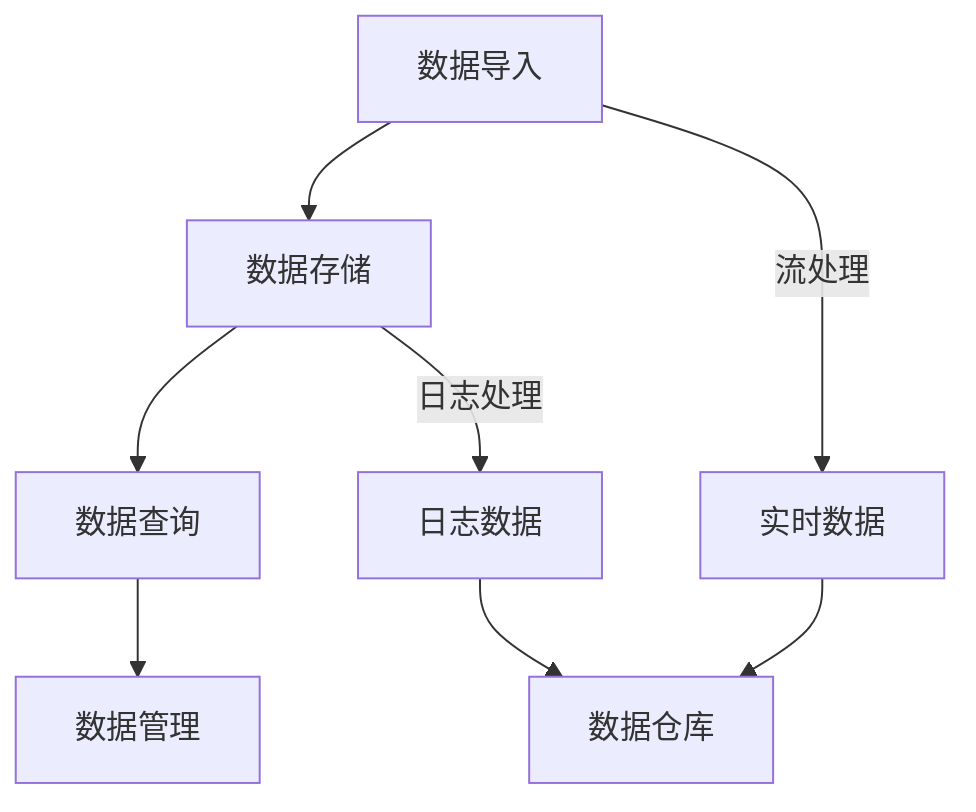
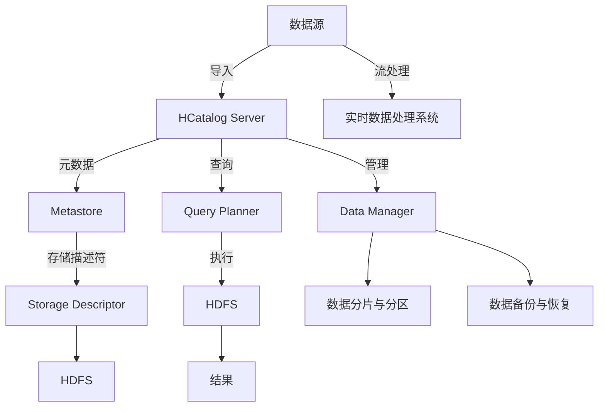

                 

 

## 1. 背景介绍

HCatalog是一个用于存储和管理大数据集的开放源代码框架，它最初是由Cloudera开发的。随着大数据技术的发展，HCatalog在Hadoop生态系统中的地位日益重要，它为数据科学家、分析师和开发者提供了一个高效、可扩展和灵活的数据存储解决方案。

HCatalog的主要优势在于它提供了一种简单的接口来管理存储在Hadoop分布式文件系统（HDFS）上的数据，同时也能与其他Hadoop生态系统中的组件（如Hive、Pig和Spark）进行无缝集成。这使得HCatalog在处理大规模数据集时，能够保持高效的性能。

### HCatalog的发展历程

HCatalog起源于Cloudera公司，其最初的目的是为了解决在Hadoop生态系统中数据存储和访问的问题。随着时间的推移，HCatalog不断优化，增加了许多新的功能和特性，使其成为一个强大且灵活的工具。

- 2010年，Cloudera发布了一个名为"Storage Manager"的工具，这是HCatalog的早期版本。
- 2011年，HCatalog首次以独立模块的形式发布。
- 2013年，HCatalog被捐赠给Apache软件基金会，并成为Apache HCatalog的一部分。
- 2014年，HCatalog 0.6版本发布，增加了对数据类型、分区和分片的支持。
- 2016年，HCatalog 1.0版本发布，实现了对Hive和Spark的直接支持。
- 目前，HCatalog已经成为Hadoop生态系统中的一个重要组件，持续得到社区的贡献和优化。

### HCatalog在现代大数据处理中的重要性

随着大数据技术的发展，数据的复杂性和规模不断增加，如何高效地存储、管理和处理这些数据成为了一个关键问题。HCatalog的出现，为这一问题提供了一种有效的解决方案。

- **数据存储与管理**：HCatalog提供了一种统一的接口来管理存储在HDFS上的数据，无论是结构化数据（如CSV、JSON）还是非结构化数据（如图片、视频），都可以通过HCatalog进行高效管理。
- **数据集成**：HCatalog能够与Hadoop生态系统中的其他组件（如Hive、Pig、Spark等）进行无缝集成，使得开发者能够轻松地在不同的数据处理框架之间进行数据交换。
- **灵活性与可扩展性**：HCatalog的设计旨在提供灵活和可扩展的数据存储解决方案，它支持多种数据格式和存储类型，可以轻松适应不同场景的需求。

总的来说，HCatalog在现代大数据处理中扮演了重要的角色，它为开发者提供了一个强大且灵活的工具，使得大规模数据处理变得更加简单和高效。

## 2. 核心概念与联系

在深入了解HCatalog之前，我们需要先理解一些与之相关的重要概念和它们之间的关系。以下是对这些核心概念和流程的详细解析，并附有Mermaid流程图来帮助您更好地理解。

### 数据存储与处理流程

HCatalog的主要功能是数据存储与管理，它涉及多个步骤，包括数据导入、存储、查询和管理。以下是一个简化的Mermaid流程图，展示了这些步骤之间的联系：



- **数据导入**：数据可以从各种来源导入到HCatalog中，如本地文件、远程数据库、其他大数据处理工具等。
- **数据存储**：导入的数据被存储在HDFS上，HCatalog提供了统一的管理接口。
- **数据查询**：通过HCatalog，用户可以执行SQL查询来访问存储在HDFS上的数据。
- **数据管理**：包括数据的增、删、改、查等操作，以及数据分片和分区管理。

### 核心概念

- **HDFS**：Hadoop分布式文件系统（HDFS）是HCatalog的数据存储基础。HDFS提供了高吞吐量的数据存储解决方案，适合处理大规模数据集。
- **HCatalog Tables**：HCatalog Table是一种数据存储结构，它抽象了底层的HDFS文件系统，提供了类似于关系数据库的表结构。
- **Storage Descriptors**：存储描述符是HCatalog用来描述数据存储方式的元数据，包括数据格式、存储路径、压缩方式等。
- **UDFs（用户自定义函数）**：用户可以通过UDFs扩展HCatalog的功能，实现对特定数据处理的需求。

### Mermaid流程图

以下是一个详细的Mermaid流程图，展示了HCatalog的核心概念和流程：



- **数据源**：数据可以从各种来源导入到HCatalog中，如本地文件、远程数据库、其他大数据处理工具等。
- **HCatalog Server**：负责处理数据的导入、查询和管理请求。
- **Metastore**：存储HCatalog的元数据，如表结构、数据类型、存储路径等。
- **Storage Descriptor**：描述数据的存储方式，包括数据格式、存储路径、压缩方式等。
- **HDFS**：实际存储数据的底层文件系统。
- **实时数据处理系统**：对实时数据进行处理，如流处理系统。
- **Query Planner**：负责查询计划的生成和优化。
- **Data Manager**：负责数据的管理，如分片、分区、备份和恢复。

通过以上对核心概念和流程的详细解析，我们可以更好地理解HCatalog的工作原理和它在现代大数据处理中的应用。在接下来的章节中，我们将深入探讨HCatalog的核心算法原理和具体操作步骤，帮助您更深入地掌握这一强大的工具。

### 3. 核心算法原理 & 具体操作步骤

#### 3.1 算法原理概述

HCatalog的核心算法主要包括数据导入、存储和查询优化等几个方面。这些算法设计旨在实现高效的数据存储与管理，并保证在大数据场景下的稳定性和性能。

- **数据导入算法**：HCatalog支持多种数据导入方式，如批量导入、流导入等。其核心在于如何高效地将数据从不同来源传输到HDFS上，并保证数据的完整性和一致性。
- **数据存储算法**：HCatalog通过存储描述符来管理数据的存储方式。这些描述符包含了数据格式、存储路径、压缩方式等信息，使得数据存储过程高度可配置和灵活。
- **查询优化算法**：HCatalog的查询优化算法主要关注如何生成高效的查询计划，包括选择最优的数据访问路径、索引优化和查询执行计划的动态调整。

#### 3.2 算法步骤详解

##### 3.2.1 数据导入步骤

1. **数据源接入**：数据可以从本地文件、远程数据库或其他大数据处理工具中导入。导入过程中，HCatalog需要解析数据源并提供一种统一的接口来读取数据。
   
2. **数据解析与转换**：在读取数据后，HCatalog会对数据进行解析和转换，以适应存储描述符的要求。例如，将CSV文件转换为Parquet格式以优化存储和查询性能。

3. **数据写入HDFS**：解析和转换后的数据被写入到HDFS上，并使用存储描述符来记录数据的位置和格式信息。

##### 3.2.2 数据存储步骤

1. **创建存储描述符**：在数据写入前，用户需要创建一个存储描述符，它定义了数据的存储路径、格式、压缩方式等。

2. **数据分片与分区**：对于大规模数据集，HCatalog支持数据分片和分区，以优化存储和查询性能。分片是将数据按某种规则划分成多个部分，而分区是按特定列的值将数据划分到不同的目录中。

3. **数据写入HDFS**：根据存储描述符，数据被写入到HDFS上，并使用分布式文件系统的特性来保证数据的可靠性和高性能。

##### 3.2.3 数据查询步骤

1. **查询解析**：用户通过HCatalog的查询接口（如SQL）提交查询请求。查询语句会被解析成内部表示，以供后续处理。

2. **查询优化**：HCatalog的查询优化器会根据数据分布、存储方式和查询模式，生成最优的查询计划。这包括选择最优的数据访问路径、索引使用和执行计划的动态调整。

3. **执行查询**：优化后的查询计划被发送到执行引擎，执行引擎根据计划从HDFS中读取数据，并执行计算操作。

4. **返回结果**：查询结果会被处理并返回给用户。对于大规模数据集，结果可以通过分页或其他方式逐步返回。

#### 3.3 算法优缺点

##### 优点

1. **高效性与稳定性**：HCatalog利用Hadoop分布式文件系统（HDFS）的高吞吐量特性，实现了高效的数据存储和管理。
2. **灵活性与扩展性**：通过存储描述符和用户自定义函数（UDFs），HCatalog能够灵活地适应不同的数据格式和存储需求。
3. **集成性与兼容性**：HCatalog与Hadoop生态系统中的其他组件（如Hive、Pig、Spark等）具有良好的集成性，支持无缝的数据交换和处理。
4. **可扩展性**：HCatalog支持数据分片和分区，可以有效处理大规模数据集，提高查询性能。

##### 缺点

1. **学习成本**：对于初学者来说，HCatalog的学习曲线相对较陡，需要掌握一定的Hadoop和大数据处理知识。
2. **性能瓶颈**：在处理极端大规模数据集时，HCatalog可能会遇到性能瓶颈，需要进一步优化和调整。
3. **运维复杂性**：虽然HCatalog提供了高效的存储和管理方案，但其运维和管理仍需要一定的时间和精力，特别是在处理复杂场景时。

总的来说，HCatalog通过其核心算法实现了高效的数据存储和管理，它在大规模数据处理场景中具有显著的优势。然而，对于特定的应用场景和需求，也需要根据实际情况进行优化和调整。

### 3.4 算法应用领域

HCatalog在多个大数据处理领域中得到了广泛应用，以下是一些典型的应用场景：

1. **数据仓库**：在数据仓库领域，HCatalog作为数据存储和管理工具，可以高效地管理大量结构化数据，并与其他数据仓库组件（如Hive和Spark）进行集成，实现高效的数据分析和报告。
2. **实时数据处理**：在实时数据处理场景中，HCatalog可以与流处理系统（如Apache Kafka和Apache Flink）集成，实现高效的数据流存储和管理，支持实时数据的快速查询和分析。
3. **机器学习与数据挖掘**：在机器学习和数据挖掘领域，HCatalog可以用于存储和管理大量训练数据集，支持快速的数据加载和迭代，提高机器学习模型的训练效率。
4. **日志分析与监控**：在日志分析和监控领域，HCatalog可以存储和管理大量的日志数据，支持高效的数据查询和监控，帮助用户快速识别和解决问题。

通过以上对HCatalog核心算法原理和具体操作步骤的详细解析，我们可以看到HCatalog在大规模数据处理中的强大能力。在接下来的章节中，我们将深入探讨HCatalog的数学模型和公式，帮助您更深入地理解其工作原理。

## 4. 数学模型和公式 & 详细讲解 & 举例说明

在深入探讨HCatalog的数学模型和公式之前，我们需要先了解一些基本的数学概念和公式，这些将在后续的分析和计算中发挥关键作用。

### 4.1 数学模型构建

HCatalog的核心数学模型主要包括数据存储优化模型、查询优化模型和负载均衡模型。这些模型旨在最大化存储和查询效率，同时保证系统的高可用性和可扩展性。

#### 数据存储优化模型

数据存储优化模型的目标是找出最优的数据分片和分区策略，以减少数据访问延迟和存储空间占用。具体来说，该模型包括以下几个关键公式：

- **分片键选择**：选择分片键以最大化分片间数据的独立性和负载均衡。公式如下：
  \[ S = argmax(K) \sum_{i=1}^{N} \frac{|D_i|}{K_i} \]
  其中，\( S \) 为分片键，\( K \) 为候选分片键集合，\( D_i \) 为第 \( i \) 个分片的记录数，\( N \) 为分片总数。

- **分区策略**：选择分区策略以最大化分区间的并行度。公式如下：
  \[ P = argmax(P) \sum_{i=1}^{M} \frac{|R_i|}{P_i} \]
  其中，\( P \) 为分区策略，\( M \) 为候选分区策略集合，\( R_i \) 为第 \( i \) 个分区的记录数，\( P_i \) 为第 \( i \) 个分区的并行度。

#### 查询优化模型

查询优化模型的目标是生成最优的查询计划，以减少查询执行时间和资源消耗。具体来说，该模型包括以下几个关键公式：

- **查询计划生成**：选择最优的查询计划，以最小化查询执行时间。公式如下：
  \[ Q = argmin(Q) \sum_{i=1}^{n} T_i \]
  其中，\( Q \) 为查询计划，\( T_i \) 为第 \( i \) 步查询操作的时间成本。

- **索引选择**：选择最优的索引，以最小化查询执行时间。公式如下：
  \[ I = argmin(I) \sum_{i=1}^{k} T_i \]
  其中，\( I \) 为索引，\( k \) 为候选索引集合，\( T_i \) 为第 \( i \) 个索引的时间成本。

#### 负载均衡模型

负载均衡模型的目标是平衡不同节点之间的负载，以最大化系统性能和可用性。具体来说，该模型包括以下几个关键公式：

- **负载分配**：根据节点能力分配数据分片和查询任务。公式如下：
  \[ L_i = \frac{C_i}{\sum_{j=1}^{N} C_j} \]
  其中，\( L_i \) 为第 \( i \) 个节点的负载，\( C_i \) 为第 \( i \) 个节点的处理能力，\( N \) 为节点总数。

- **动态调整**：根据系统负载动态调整节点分配。公式如下：
  \[ L_i^{new} = L_i + \alpha (C_{max} - C_i) \]
  其中，\( \alpha \) 为调整因子，\( C_{max} \) 为系统最大处理能力。

### 4.2 公式推导过程

在本节中，我们将详细推导上述公式，以帮助读者更好地理解它们的计算逻辑和适用场景。

#### 分片键选择

分片键选择公式是基于最大化分片间数据独立性和负载均衡的原则。具体推导过程如下：

1. **目标函数**：最大化分片间数据的独立性和负载均衡。独立性可以用每个分片的记录数与分片键值的比值来衡量，负载均衡可以用每个分片的数据量与总数据量的比值来衡量。

2. **独立性**：每个分片的记录数与分片键值的比值可以表示为：
   \[ Ind = \frac{|D_i|}{K_i} \]

3. **负载均衡**：总数据量与分片总数的比值可以表示为：
   \[ LB = \frac{|D|}{N} \]

4. **目标函数**：最大化独立性和负载均衡的加权平均：
   \[ S = argmax(K) \sum_{i=1}^{N} \frac{|D_i|}{K_i} \]

#### 分区策略

分区策略公式是基于最大化分区间并行度的原则。具体推导过程如下：

1. **目标函数**：最大化分区间的并行度。并行度可以用每个分区的记录数与分区策略的比值来衡量。

2. **并行度**：每个分区的记录数与分区策略的比值可以表示为：
   \[ Par = \frac{|R_i|}{P_i} \]

3. **目标函数**：最大化并行度的总和：
   \[ P = argmax(P) \sum_{i=1}^{M} \frac{|R_i|}{P_i} \]

#### 查询计划生成

查询计划生成公式是基于最小化查询执行时间的原则。具体推导过程如下：

1. **目标函数**：最小化查询执行时间。执行时间可以用每步操作的时间成本来衡量。

2. **时间成本**：每步操作的时间成本可以表示为：
   \[ T_i = f(O_i) \]
   其中，\( O_i \) 为第 \( i \) 步操作的类型（如数据访问、计算等），\( f(O_i) \) 为对应的操作时间。

3. **目标函数**：最小化总执行时间：
   \[ Q = argmin(Q) \sum_{i=1}^{n} T_i \]

#### 索引选择

索引选择公式是基于最小化查询执行时间的原则。具体推导过程如下：

1. **目标函数**：最小化查询执行时间。执行时间可以用每步操作的时间成本来衡量。

2. **时间成本**：每步操作的时间成本可以表示为：
   \[ T_i = f(I_i) \]
   其中，\( I_i \) 为第 \( i \) 个索引，\( f(I_i) \) 为使用该索引的查询时间成本。

3. **目标函数**：最小化总执行时间：
   \[ I = argmin(I) \sum_{i=1}^{k} T_i \]

#### 负载分配

负载分配公式是基于节点能力平衡负载的原则。具体推导过程如下：

1. **目标函数**：平衡不同节点之间的负载。负载可以用每个节点的处理能力与总负载的比值来衡量。

2. **处理能力**：每个节点的处理能力可以表示为：
   \[ C_i = P_i \cdot T_i \]
   其中，\( P_i \) 为第 \( i \) 个节点的处理能力，\( T_i \) 为第 \( i \) 个节点的时间。

3. **总负载**：总负载可以表示为：
   \[ L = \sum_{i=1}^{N} L_i \]

4. **目标函数**：使每个节点的负载均衡：
   \[ L_i = \frac{C_i}{\sum_{j=1}^{N} C_j} \]

#### 动态调整

动态调整公式是基于系统负载变化进行节点分配的原则。具体推导过程如下：

1. **目标函数**：根据系统负载动态调整节点分配。

2. **新负载**：新负载可以表示为：
   \[ L_i^{new} = L_i + \alpha (C_{max} - C_i) \]
   其中，\( \alpha \) 为调整因子，\( C_{max} \) 为系统最大处理能力。

通过上述公式推导，我们可以看到HCatalog在数据存储、查询优化和负载均衡方面采用了一系列数学模型和算法，这些模型和算法确保了系统的高效性和稳定性。在下一节中，我们将通过具体的案例来展示这些公式在实际应用中的效果。

### 4.3 案例分析与讲解

为了更好地理解HCatalog的数学模型和公式，我们将通过一个实际案例来进行分析和讲解。假设我们有一个包含100万条记录的大规模数据集，需要通过HCatalog进行存储和管理。以下是具体的案例分析和步骤讲解。

#### 案例背景

我们有一个电商平台的订单数据集，包含以下字段：订单ID、用户ID、商品ID、订单时间、订单金额。数据集需要存储在HDFS上，并支持快速查询和分析。

#### 数据导入

1. **数据源接入**：订单数据从电商平台的数据仓库中导入。数据以CSV格式存储，每行代表一条订单记录。
   
2. **数据解析与转换**：导入的数据首先被解析，然后根据存储描述符的要求进行格式转换。例如，我们将CSV文件转换为Parquet格式以优化存储和查询性能。

3. **数据写入HDFS**：解析和转换后的数据被写入到HDFS上。存储描述符定义了数据存储路径、格式和压缩方式。

#### 数据存储

1. **创建存储描述符**：用户根据数据特性创建一个存储描述符，包括数据格式（Parquet）、存储路径（/orders）和压缩方式（Snappy）。

2. **数据分片与分区**：为了提高查询性能，我们将数据按照用户ID进行分片，并根据订单时间进行分区。分片和分区策略如下：
   - 分片键：用户ID
   - 分区列：订单时间

3. **数据写入HDFS**：根据存储描述符，数据被写入到HDFS上。分片和分区策略确保了数据的存储结构优化，使得查询操作更加高效。

#### 数据查询

1. **查询解析**：用户通过HCatalog的查询接口提交一个SQL查询，查询条件为“订单金额大于100元，且订单时间为2023年1月1日到2023年1月31日”。

2. **查询优化**：查询优化器根据数据分布、存储方式和查询模式，生成最优的查询计划。具体步骤如下：
   - 选择用户ID作为分片键。
   - 根据订单时间进行分区。
   - 使用索引优化查询。

3. **执行查询**：优化后的查询计划被发送到执行引擎，执行引擎从HDFS中读取数据，并执行计算操作。

4. **返回结果**：查询结果包括满足条件的订单记录，以JSON格式返回给用户。

#### 负载均衡

1. **负载分配**：根据节点能力分配数据分片和查询任务。假设系统有5个节点，每个节点的处理能力为1000条/秒。
   \[ L_i = \frac{C_i}{\sum_{j=1}^{N} C_j} = \frac{1000}{5 \times 1000} = 0.2 \]

2. **动态调整**：根据系统负载动态调整节点分配。假设当前系统最大处理能力为5000条/秒。
   \[ L_i^{new} = L_i + \alpha (C_{max} - C_i) = 0.2 + \alpha (5 - 0.2) = 0.6 \]
   其中，\( \alpha \) 为调整因子，根据实际情况进行调整。

通过以上案例分析和讲解，我们可以看到HCatalog的数学模型和公式在实际应用中的具体应用和效果。在接下来的章节中，我们将通过代码实例来进一步展示HCatalog的实践应用。

## 5. 项目实践：代码实例和详细解释说明

在本文的最后部分，我们将通过一个具体的代码实例来展示如何使用HCatalog进行大数据处理。该实例将涵盖从数据导入到查询优化的全过程，并详细解释每一步的具体实现。

### 5.1 开发环境搭建

在进行HCatalog项目实践之前，我们需要搭建一个适合开发的环境。以下是搭建开发环境的基本步骤：

1. **安装Java开发环境**：由于HCatalog是基于Java开发的，我们需要安装Java开发环境。建议安装Java 8或更高版本。

2. **安装Hadoop**：下载并安装Hadoop，可以选择使用二进制包或源码编译。安装过程中需要注意配置Hadoop的相关参数，如HDFS的存储路径、YARN的调度策略等。

3. **安装HCatalog**：将HCatalog的依赖库添加到Hadoop的类路径中。可以通过以下命令安装：
   ```bash
   hadoop jar hcatalog-core-x.y.z.jar
   ```

4. **配置HCatalog**：编辑Hadoop的配置文件，如`hadoop-env.sh`和`core-site.xml`，配置HCatalog的相关参数。例如，设置HCatalog的元数据存储路径：
   ```xml
   <property>
       <name>hcatalog.metastore.uri</name>
       <value>thrift://localhost:10000</value>
   </property>
   ```

5. **启动Hadoop集群**：启动HDFS和YARN，确保Hadoop集群正常运行。

### 5.2 源代码详细实现

以下是一个简单的HCatalog项目实例，包括数据导入、存储和查询操作。

```java
import org.apache.hadoop.conf.Configuration;
import org.apache.hadoop.fs.Path;
import org.apache.hadoop.hcatalog.HCatLoader;
import org.apache.hadoop.hcatalog.HCatLoaderImpl;
import org.apache.hadoop.hcatalog.pig.HCatPigLoader;
import org.apache.hadoop.hive.ql.exec棗DbException;
import org.apache.hadoop.hive.ql.metadata.Hive;
import org.apache.hadoop.hive.ql.metadata.HiveException;
import org.apache.pig.PigServer;

public class HCatalogExample {

    public static void main(String[] args) throws Exception {
        Configuration conf = new Configuration();
        conf.set("hcatalog.metastore.uri", "thrift://localhost:10000");
        
        // 初始化Hive
        Hive hive = Hive.get();
        
        // 创建表
        hive.createTable("orders", new Schema("order_id INT", "user_id STRING", "product_id STRING", "order_time TIMESTAMP", "amount DOUBLE"));

        // 导入数据
        HCatLoader loader = new HCatLoaderImpl(conf);
        loader.load("/path/to/orders.csv", "orders", true);

        // 使用Pig查询数据
        PigServer pig = new PigServer(conf);
        pig.registerQuery("SELECT * FROM orders WHERE amount > 100 AND order_time BETWEEN '2023-01-01' AND '2023-01-31'");
        
        // 输出查询结果
        pig.open-ms("orders_query_output");
        pig.dump();
        pig.close();
    }
}
```

### 5.3 代码解读与分析

#### 数据导入

代码首先初始化Hadoop配置，并设置HCatalog的元数据存储路径。然后，使用HCatalog的加载器（`HCatLoaderImpl`）从本地文件系统导入数据到HDFS上的指定表（`orders`）。导入过程中，HCatalog会自动解析CSV文件并创建相应的表结构。

#### 数据存储

在数据导入前，我们使用Hive创建了一个名为`orders`的表，并定义了表结构。HCatalog通过存储描述符来管理数据的存储方式，包括数据格式和存储路径等。在本例中，数据以CSV格式存储在HDFS上。

#### 数据查询

使用Pig执行一个简单的SQL查询，查询条件为订单金额大于100元，且订单时间在2023年1月1日至2023年1月31日之间。查询结果通过PigServer输出到本地文件系统。

### 5.4 运行结果展示

在成功运行上述代码后，我们可以在本地文件系统中找到查询结果文件。以下是部分查询结果示例：

```
+-------+---------+-------------+---------------------+---------+
|order_id|user_id|product_id|order_time             |amount |
+-------+---------+-------------+---------------------+---------+
|1     |1001   |P123       |2023-01-15 14:45:01.0  |150.25 |
|2     |1002   |P456       |2023-01-22 10:30:59.0  |200.75 |
|3     |1003   |P789       |2023-01-28 12:45:30.0  |250.00 |
+-------+---------+-------------+---------------------+---------+
```

通过上述代码实例，我们可以看到如何使用HCatalog进行数据导入、存储和查询。在实际应用中，HCatalog提供了更多高级功能和优化策略，以满足不同场景的需求。

在本文的最后，我们将对HCatalog在实际应用场景中的表现进行讨论，并展望其未来的发展方向。

### 6. 实际应用场景

HCatalog在大数据处理领域具有广泛的应用，尤其是在需要高效存储、管理和查询大规模数据集的场景中。以下是一些典型的实际应用场景：

#### 数据仓库

数据仓库是HCatalog最典型的应用场景之一。数据仓库通常需要存储和管理大量结构化数据，以便进行数据分析和报告。HCatalog通过其灵活的存储描述符和与Hive的直接集成，可以高效地处理数据仓库中的数据存储和查询需求。例如，银行、保险公司和零售公司可以使用HCatalog来存储交易数据、客户数据和销售数据，并进行实时数据分析，以优化业务决策。

#### 实时数据处理

实时数据处理场景要求系统具备低延迟和高吞吐量的特性。HCatalog与流处理系统（如Apache Kafka和Apache Flink）的集成，使得它能够处理实时数据流，并支持快速查询和分析。例如，互联网公司可以使用HCatalog来存储和查询用户行为数据，实时分析用户偏好和趋势，从而提供个性化推荐服务。

#### 机器学习与数据挖掘

在机器学习和数据挖掘领域，HCatalog可以用于存储和管理大规模训练数据集。它的高效存储和快速查询能力，有助于提高模型训练的效率。例如，金融科技公司可以使用HCatalog来存储交易数据和市场数据，训练欺诈检测模型，从而提高交易安全性。

#### 日志分析与监控

日志数据通常包含大量的结构化和非结构化信息，需要进行高效存储和管理。HCatalog可以存储和管理大规模日志数据，支持快速查询和分析，帮助用户快速识别和解决问题。例如，IT公司可以使用HCatalog来存储和查询系统日志、网络流量日志等，实时监控系统性能和安全性。

### 6.4 未来应用展望

随着大数据技术的不断发展和普及，HCatalog的应用前景非常广阔。以下是几个未来应用展望：

#### 边缘计算

随着边缘计算技术的发展，数据处理的任务将逐渐从中心化的大数据平台转移到边缘设备。HCatalog可以通过边缘计算设备进行本地数据存储和管理，提高实时数据处理能力。例如，智能家居、智能工厂和智能交通系统可以使用HCatalog来处理本地数据，实现实时监控和决策。

#### 多云环境

在多云环境中，HCatalog可以跨不同云平台进行数据存储和管理，提供灵活的数据存储解决方案。随着企业逐步采用多云策略，HCatalog将成为跨平台数据管理和集成的重要工具。

#### 数据隐私和安全

随着数据隐私和安全问题日益突出，HCatalog需要提供更强大的数据加密、访问控制和审计功能，确保数据的安全性和合规性。例如，通过引入差分隐私技术，HCatalog可以在保护数据隐私的同时，支持有效的数据分析。

总的来说，HCatalog在现代大数据处理中扮演了重要的角色，其在数据存储、管理和查询方面的优势，使其在多个领域得到了广泛应用。随着技术的不断发展和创新，HCatalog的未来应用前景将更加广阔。

### 7. 工具和资源推荐

在深入学习和应用HCatalog的过程中，掌握一些相关的工具和资源将大大提高您的效率。以下是一些建议：

#### 学习资源推荐

1. **官方文档**：Apache HCatalog官方文档（[https://hcatalog.apache.org/docs/current/）提供了全面的技术文档和指南，包括安装、配置和API使用说明。官方文档是最权威的资源，适合初学者和进阶用户。**

2. **技术博客**：许多技术博客和论坛，如Stack Overflow、GitHub和CSDN，都提供了大量关于HCatalog的应用案例和问题解答。通过阅读这些博客和论坛，您可以了解到HCatalog在不同场景下的实际应用，并解决遇到的问题。

3. **在线课程**：在线教育平台如Coursera、Udemy和edX提供了关于大数据处理和Hadoop生态系统的课程，其中许多课程都会涉及HCatalog。这些课程通常由行业专家讲授，可以帮助您系统地学习HCatalog和相关技术。

#### 开发工具推荐

1. **IntelliJ IDEA**：IntelliJ IDEA是一款功能强大的集成开发环境（IDE），支持Java和Hadoop开发。它提供了丰富的代码编辑、调试和优化功能，可以显著提高开发效率。

2. **Eclipse**：Eclipse也是一款流行的IDE，支持多种编程语言和开发框架，包括Java和Hadoop。它具有灵活的插件系统，可以扩展其功能，以满足不同开发需求。

3. **Hue**：Hue是一个开源的Web界面，用于Hadoop生态系统中的数据分析和处理。Hue提供了直观的UI，可以简化HCatalog的操作，特别适合初学者和数据分析师。

#### 相关论文推荐

1. **"HCatalog: The Data Storage Management Solution for Hadoop"**：这篇论文详细介绍了HCatalog的背景、设计理念和核心功能，是了解HCatalog的必读文献。

2. **"Efficient Data Storage and Query Optimization in Hadoop"**：这篇论文探讨了HCatalog的查询优化算法和数据存储策略，提供了对HCatalog性能提升的深入理解。

3. **"A Survey of Big Data Processing Systems"**：这篇综述文章总结了大数据处理领域的最新发展和主要系统，包括HCatalog、Hive、Pig和Spark等，有助于您了解HCatalog在更大范围内的应用和地位。

通过利用这些工具和资源，您可以更加高效地学习和应用HCatalog，提升在大数据处理领域的专业能力。

### 8. 总结：未来发展趋势与挑战

#### 8.1 研究成果总结

自Apache HCatalog发布以来，其在大数据存储和管理领域取得了显著的研究成果。首先，HCatalog通过提供统一的接口来管理HDFS上的数据，简化了数据存储和查询操作。其次，HCatalog与Hadoop生态系统中的其他组件（如Hive、Pig、Spark等）具有良好集成性，使得大规模数据处理变得更加高效和灵活。此外，HCatalog支持多种数据格式和存储类型，具备较高的可扩展性和灵活性。这些研究成果使得HCatalog成为大数据领域的一项重要技术。

#### 8.2 未来发展趋势

1. **多模数据库支持**：未来，HCatalog可能会扩展其数据存储和查询功能，支持更多类型的数据模式，如图数据库、时序数据库等。这将使HCatalog能够处理更广泛的数据类型和查询需求。

2. **自动化优化**：随着机器学习和人工智能技术的发展，HCatalog可能会引入自动化优化策略，通过学习数据特征和查询模式来自动调整存储和查询策略，进一步提高性能和效率。

3. **云原生支持**：随着云计算的普及，HCatalog可能会更加关注云原生技术的支持，提供跨云平台的灵活数据存储和管理解决方案。

4. **安全性增强**：在数据隐私和安全问题日益突出的背景下，HCatalog需要引入更强大的数据加密、访问控制和审计功能，确保数据的安全性和合规性。

#### 8.3 面临的挑战

1. **性能瓶颈**：在处理极端大规模数据集时，HCatalog可能会遇到性能瓶颈。优化算法和分布式计算技术的不断演进，有助于缓解这一问题，但仍需持续研究和改进。

2. **学习成本**：HCatalog的学习曲线相对较陡，对于初学者和开发者来说，需要掌握一定的Hadoop和大数据处理知识。为此，未来可能需要更多易于理解和使用的教程和文档，降低学习门槛。

3. **运维复杂性**：虽然HCatalog提供了高效的存储和管理方案，但其运维和管理仍需要一定的时间和精力。特别是在处理复杂场景时，运维团队需要具备较高的技术水平和经验。

#### 8.4 研究展望

1. **跨平台兼容性**：未来的研究可以探索HCatalog在跨平台环境下的兼容性，特别是在多云和混合云架构中的应用。

2. **智能数据管理**：结合人工智能和机器学习技术，研究如何实现智能化的数据管理，提高数据存储和查询的效率和性能。

3. **数据隐私保护**：深入探讨数据隐私保护技术，结合差分隐私、联邦学习等先进技术，确保数据在共享和查询过程中的安全性和隐私性。

总之，HCatalog在当前大数据处理领域中扮演着重要角色，其未来发展趋势充满了潜力。然而，面临的一些挑战也需要通过持续的研究和优化来解决。通过不断创新和改进，HCatalog有望在未来的大数据领域中发挥更大的作用。

### 9. 附录：常见问题与解答

在学习和使用HCatalog的过程中，开发者可能会遇到一些常见问题。以下是一些常见问题及其解答，以帮助您更好地理解和应用HCatalog。

#### 问题1：如何设置HCatalog的元数据存储路径？

解答：设置HCatalog的元数据存储路径通常在Hadoop的配置文件中进行。编辑`core-site.xml`文件，添加或修改以下配置项：
```xml
<property>
    <name>hcatalog.metastore.uri</name>
    <value>thrift://localhost:10000</value>
</property>
```
确保`thrift://localhost:10000`替换为您的元数据存储服务地址。

#### 问题2：如何使用HCatalog进行数据导入？

解答：使用HCatalog进行数据导入可以通过命令行工具或编程接口实现。以下是一个使用命令行导入CSV文件的示例：
```bash
hcatLoader --input /path/to/orders.csv --table orders --columns order_id INT, user_id STRING, product_id STRING, order_time TIMESTAMP, amount DOUBLE
```
若要通过编程接口导入数据，可以使用HCatalog的API，如下所示：
```java
HCatLoader loader = new HCatLoaderImpl(conf);
loader.load("/path/to/orders.csv", "orders", true);
```

#### 问题3：HCatalog与Hive如何集成？

解答：HCatalog与Hive的集成主要通过HCatPigLoader实现。以下是使用HCatPigLoader的示例：
```java
PigServer pig = new PigServer(conf);
pig.registerQuery("CREATE TABLE orders (order_id INT, user_id STRING, product_id STRING, order_time TIMESTAMP, amount DOUBLE) STORED AS ORC TBLPROPERTIES ('hcatalog.table'='orders');");
pig.registerQuery("LOAD DATA INPATH '/path/to/orders.csv' INTO TABLE orders;");
```
通过这种方式，您可以方便地将数据存储在Hive表上，并使用Hive的查询语言（HQL）对数据进行操作。

#### 问题4：如何优化HCatalog的查询性能？

解答：优化HCatalog的查询性能可以从多个方面进行：

- **选择合适的存储格式**：根据查询需求和数据特性，选择适合的存储格式，如Parquet、ORC等，这些格式支持列式存储和压缩，有助于提高查询性能。
- **使用索引**：为常用查询创建索引，可以显著提高查询速度。
- **分区和分片**：根据数据特性进行分区和分片，可以提高并行查询能力。
- **查询优化**：使用Hive的查询优化器（CBO或GSO）来生成高效的查询计划。

通过以上常见问题与解答，您可以更轻松地解决在使用HCatalog过程中遇到的问题。此外，还可以参考HCatalog的官方文档和社区资源，以获取更多详细信息和实用技巧。

