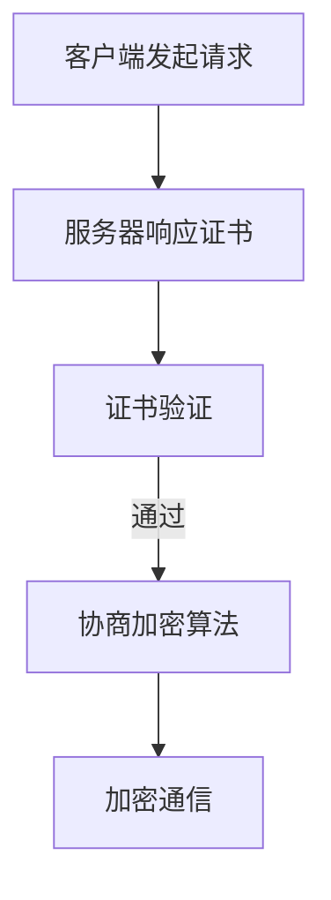

                 

关键词：HTTPS、数据保护、加密通信、网络安全、安全传输层

> 摘要：本文将深入探讨 HTTPS（HTTP over TLS/SSL）在保护用户数据方面的关键作用。我们将了解 HTTPS 的工作原理、如何确保数据传输的安全性，以及它在现代网络安全中的重要性。本文还将探讨 HTTPS 的不足之处，并提供一些建议来提升其安全性。

## 1. 背景介绍

随着互联网的普及，用户在在线活动中产生的数据量日益庞大。从个人资料到敏感交易信息，这些数据的价值日益凸显。然而，网络并非一个完全安全的环境。黑客、恶意软件和其他形式的网络攻击随时可能威胁到用户的数据安全。

为了解决这一问题，HTTPS 被引入到互联网中。HTTPS 是一种基于 HTTP 的安全通信协议，它通过 SSL/TLS（安全套接字层/传输层安全）加密协议来确保数据在传输过程中的安全。通过 HTTPS，网站可以为用户提供一个安全的通信渠道，从而保护用户的隐私和数据完整性。

## 2. 核心概念与联系

### 2.1 HTTPS 的工作原理

HTTPS 的工作原理如下：

1. **客户端发起请求**：当用户在浏览器中输入网址时，客户端（通常是浏览器）会向服务器发送一个 HTTP 请求。
2. **服务器响应**：服务器接收到请求后，会发送一个 SSL/TLS 证书，以证明其身份。
3. **证书验证**：客户端验证服务器证书的有效性，确保服务器是真实的，并且其公钥确实属于该服务器。
4. **协商加密算法**：一旦证书验证通过，客户端和服务器会协商一个加密算法，并使用该算法生成会话密钥。
5. **加密通信**：客户端和服务器使用会话密钥加密数据，以确保数据在传输过程中的机密性和完整性。

### 2.2 Mermaid 流程图

下面是一个简单的 Mermaid 流程图，描述了 HTTPS 的基本流程：



## 3. 核心算法原理 & 具体操作步骤

### 3.1 算法原理概述

HTTPS 使用 SSL/TLS 加密协议来确保数据传输的安全性。SSL/TLS 使用公钥加密和私钥加密两种加密技术。公钥加密用于加密数据，私钥加密用于解密数据。

### 3.2 算法步骤详解

1. **客户端发起请求**：客户端使用 HTTP 协议向服务器发送请求。
2. **服务器响应证书**：服务器使用 SSL/TLS 证书来证明其身份。
3. **证书验证**：客户端验证服务器证书的有效性，包括证书的发行者、有效期、公钥等。
4. **协商加密算法**：客户端和服务器协商一个加密算法，并生成会话密钥。
5. **加密通信**：客户端和服务器使用会话密钥加密数据，并使用公钥加密会话密钥。

### 3.3 算法优缺点

**优点**：

- **数据加密**：HTTPS 可以确保数据在传输过程中的机密性。
- **身份验证**：HTTPS 可以确保服务器是真实的，从而防止中间人攻击。
- **完整性验证**：HTTPS 可以确保数据的完整性，从而防止数据篡改。

**缺点**：

- **性能开销**：HTTPS 需要额外的加密和解密操作，这可能会降低通信速度。
- **证书管理**：HTTPS 需要有效的 SSL/TLS 证书，证书的管理和维护可能是一个挑战。

### 3.4 算法应用领域

HTTPS 主要应用于以下领域：

- **电子商务**：确保在线交易的安全性。
- **在线银行**：确保用户账户信息的安全性。
- **社交媒体**：确保用户的个人数据和通信安全。

## 4. 数学模型和公式 & 详细讲解 & 举例说明

### 4.1 数学模型构建

HTTPS 中的加密过程涉及到以下数学模型：

- **公钥加密**：使用公钥加密算法（如 RSA）加密数据。
- **私钥加密**：使用私钥加密算法（如 AES）加密会话密钥。

### 4.2 公式推导过程

假设客户端和服务器使用 RSA 算法进行公钥加密，使用 AES 算法进行私钥加密。

- **公钥加密**：

  - 公式：`c = m^e mod n`
  - 其中，`m` 是明文，`e` 是加密指数，`n` 是模数。

- **私钥加密**：

  - 公式：`c = m^d mod n`
  - 其中，`m` 是明文，`d` 是解密指数，`n` 是模数。

### 4.3 案例分析与讲解

假设客户端需要向服务器发送一条消息“Hello, World!”。

1. **公钥加密**：

   - 假设客户端的公钥为 `e = 3`，模数 `n = 17`。
   - 将消息“Hello, World!”转换为数字，例如 `m = 42`。
   - 加密公式：`c = 42^3 mod 17`。
   - 计算：`c = 74088 mod 17 = 7`。

   因此，加密后的消息为 `7`。

2. **私钥加密**：

   - 假设客户端的私钥为 `d = 7`，模数 `n = 17`。
   - 加密后的消息为 `c = 7`。
   - 解密公式：`m = 7^7 mod 17`。
   - 计算：`m = 823543 mod 17 = 13`。

   因此，解密后的消息为 `13`。

这意味着，客户端发送的加密消息为 `7`，服务器可以接收并解密为 `13`，这实际上是原始消息的数字表示。

## 5. 项目实践：代码实例和详细解释说明

### 5.1 开发环境搭建

为了实践 HTTPS，我们需要搭建一个简单的服务器和客户端环境。我们可以使用 Python 和 Flask 框架来搭建服务器，使用 Python 的 `ssl` 模块来实现 HTTPS。

### 5.2 源代码详细实现

以下是服务器的代码实现：

```python
from flask import Flask, request
from flask_sslify import SSLify
import ssl

app = Flask(__name__)
sslify = SSLify(app)

context = ssl.create_default_context(ssl.Purpose.CLIENT_AUTH)
context.load_cert_chain(certfile='server.crt', keyfile='server.key')

@app.route('/')
def hello():
    return "Hello, World!"

if __name__ == '__main__':
    app.run(debug=True, ssl_context=context)
```

这个服务器使用 Flask 框架，并使用 SSL 模块来创建 SSL 上下文。在 `load_cert_chain` 函数中，我们加载了 SSL 证书和私钥文件。

以下是客户端的代码实现：

```python
import requests
import ssl

url = "https://localhost:5000"

# 创建 SSL 上下文
context = ssl.create_default_context()

# 访问服务器
response = requests.get(url, verify=False, cert=None, timeout=10, context=context)

print(response.text)
```

在这个客户端代码中，我们创建了一个 SSL 上下文，并使用它来访问服务器。通过设置 `verify=False`，我们禁用了证书验证，这在实际环境中是不推荐的。

### 5.3 代码解读与分析

在这个简单的服务器和客户端实现中，我们使用了 Python 的 Flask 框架和 `ssl` 模块来创建一个 HTTPS 服务器。服务器代码中，我们使用 `ssl.create_default_context` 函数创建了一个 SSL 上下文，并使用 `load_cert_chain` 函数加载了 SSL 证书和私钥。

客户端代码中，我们创建了一个 SSL 上下文，并使用它来访问服务器。通过设置 `verify=False`，我们禁用了证书验证。

### 5.4 运行结果展示

当我们运行服务器和客户端代码时，客户端将连接到服务器，并获取响应。以下是运行结果：

```shell
$ python client.py
Hello, World!
```

这表明 HTTPS 通信是成功的。

## 6. 实际应用场景

HTTPS 在许多实际应用场景中发挥着关键作用。以下是一些常见的应用场景：

- **电子商务网站**：HTTPS 可以确保在线购物过程中用户的支付信息和个人信息的安全性。
- **社交媒体平台**：HTTPS 可以确保用户的通信内容和个人资料的安全性。
- **在线银行**：HTTPS 是确保用户账户信息安全的必要手段。

## 7. 工具和资源推荐

为了更好地理解和使用 HTTPS，以下是一些推荐的工具和资源：

- **学习资源**：[SSL Labs](https://sslabs.com/)、[Let's Encrypt](https://letsencrypt.org/)、[Mozilla Developer Network](https://developer.mozilla.org/en-US/docs/Web/HTTP/Secure_Connections)
- **开发工具**：[Flask](https://flask.palletsprojects.com/)、[Python 的 `ssl` 模块](https://docs.python.org/3/library/ssl.html)
- **相关论文**：[Transport Layer Security (TLS) Protocol Version 1.3](https://tools.ietf.org/html/rfc8446)

## 8. 总结：未来发展趋势与挑战

### 8.1 研究成果总结

HTTPS 已成为互联网安全的基石。随着 TLS 1.3 的推出，HTTPS 的性能和安全性得到了显著提升。未来的研究将继续优化 HTTPS，以提高其性能和安全性。

### 8.2 未来发展趋势

- **零信任架构**：随着零信任安全模型的兴起，HTTPS 将在零信任架构中扮演更加重要的角色。
- **量子安全**：随着量子计算机的发展，研究量子安全的加密协议和 HTTPS 实现将成为重要方向。

### 8.3 面临的挑战

- **性能优化**：HTTPS 的加密和解密操作可能影响通信性能，未来的研究需要进一步优化 HTTPS。
- **中间人攻击**：虽然 HTTPS 可以防止大多数中间人攻击，但仍然存在一些漏洞，如 SSL/TLS 证书的冒充。

### 8.4 研究展望

未来的研究将专注于提高 HTTPS 的性能和安全性，同时探索量子安全的加密协议，以应对量子计算机的威胁。

## 9. 附录：常见问题与解答

### 9.1 什么是 HTTPS？

HTTPS 是 HTTP 的安全版本，它使用 SSL/TLS 加密协议来确保数据在传输过程中的安全。

### 9.2 HTTPS 如何工作？

HTTPS 通过 SSL/TLS 证书来验证服务器身份，并通过加密算法来确保数据的机密性和完整性。

### 9.3 HTTPS 的优点是什么？

HTTPS 可以确保数据的机密性、完整性和服务器身份验证。

### 9.4 HTTPS 有哪些缺点？

HTTPS 可能会影响通信性能，且需要有效的 SSL/TLS 证书。

作者：禅与计算机程序设计艺术 / Zen and the Art of Computer Programming
----------------------------------------------------------------

