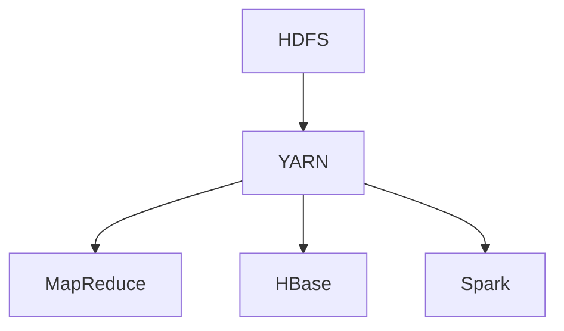
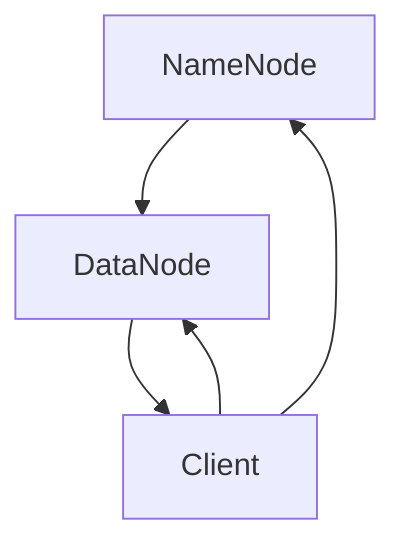
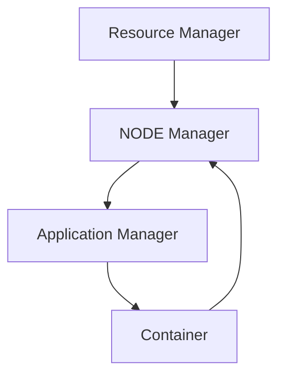
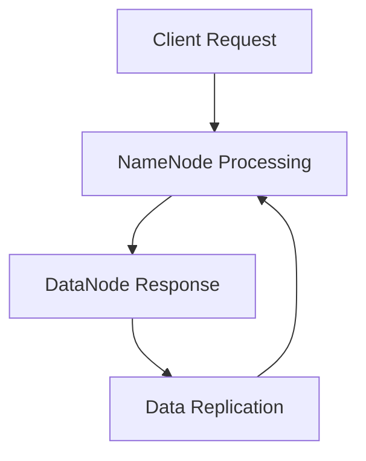
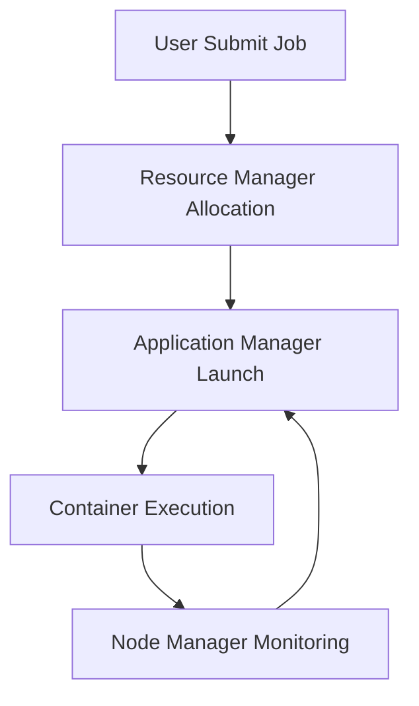

                 

关键词：Hadoop，分布式文件系统，集群，数据存储，数据处理，大数据技术，MapReduce，HDFS，YARN，HBase，Spark

> 摘要：本文将深入探讨Hadoop集群作为分布式文件系统的核心技术。首先，我们将回顾Hadoop的背景和起源，然后详细描述其核心组件，如HDFS和YARN。接下来，我们将分析Hadoop在数据处理和存储方面的优势，并探讨其在实际应用中的挑战和解决方案。文章还将涵盖相关的数学模型、项目实践和未来应用展望。

## 1. 背景介绍

Hadoop是一个开源的分布式计算框架，用于处理大规模数据集。它的起源可以追溯到2005年，由Apache软件基金会开发。Hadoop的主要目标是解决大数据环境下数据存储和处理的需求。在互联网、金融、医疗等行业的快速发展推动下，数据的规模和复杂性不断增加，传统的集中式数据处理方法已经无法满足需求。Hadoop的出现，为大规模数据存储和处理提供了一种新的解决方案。

Hadoop的核心组件包括：

- **Hadoop分布式文件系统（HDFS）**：一个高度容错性的分布式文件存储系统，用于存储大数据集。
- **YARN**：资源管理平台，负责管理集群中资源的分配和任务调度。
- **MapReduce**：一个编程模型，用于处理大规模数据集。
- **HBase**：一个分布式、可扩展的大数据存储系统。
- **Spark**：一个快速且通用的计算引擎，支持内存计算和大数据处理。

这些组件共同构建了Hadoop生态系统，使其成为大数据技术领域的重要工具。

### 1.1 Hadoop的起源和发展

Hadoop的发展与Google的两大论文紧密相关：

- **Google File System（GFS）**：GFS是Google开发的一种分布式文件系统，用于存储大规模数据集。HDFS在很大程度上是GFS的开源实现。
- **MapReduce**：MapReduce是Google开发的一种编程模型，用于处理大规模数据集。它启发了Hadoop的MapReduce组件。

Hadoop的起源可以追溯到2006年，当时Hadoop的第一个版本1.0发布。自那时以来，Hadoop社区不断发展，吸引了大量的贡献者和用户。如今，Hadoop已成为大数据技术领域的标准工具之一。

### 1.2 Hadoop的核心组件

#### Hadoop分布式文件系统（HDFS）

HDFS是一个分布式文件存储系统，用于存储大数据集。它将数据存储在分布式集群中的多个节点上，提供高可靠性、高性能的数据访问。

HDFS的主要特点包括：

- **高可靠性**：通过数据复制和错误检测机制，确保数据不丢失。
- **高扩展性**：可以轻松扩展到数千个节点。
- **高吞吐量**：适合处理大规模数据集。

HDFS的工作原理如下：

1. **数据切分**：将大文件切分成小块（默认为128MB或256MB）。
2. **数据存储**：每个数据块复制多个副本，通常为三个，存储在不同的节点上。
3. **数据访问**：客户端通过NameNode访问数据，DataNode负责实际的数据存储和检索。

#### YARN

YARN（Yet Another Resource Negotiator）是一个资源管理平台，负责管理集群中资源的分配和任务调度。它将资源管理和任务调度分离，提高了集群的灵活性和效率。

YARN的主要特点包括：

- **资源隔离**：不同应用程序可以共享同一集群资源，而不会相互干扰。
- **动态资源分配**：根据应用程序的需求，动态调整资源分配。
- **高可用性**：通过心跳机制，确保资源管理器的高可用性。

YARN的工作原理如下：

1. **资源管理器**：负责管理集群资源，将资源分配给应用程序。
2. **应用程序管理器**：负责启动和管理应用程序。
3. **容器**：代表一个运行中的应用程序，由资源管理器分配资源。

#### MapReduce

MapReduce是一个编程模型，用于处理大规模数据集。它将数据处理任务分为两个阶段：Map阶段和Reduce阶段。

MapReduce的主要特点包括：

- **并行处理**：可以将大规模数据集划分为多个小块，并行处理。
- **容错性**：通过任务重试和任务分片，确保数据处理的高可靠性。
- **扩展性**：可以轻松扩展到大规模集群。

MapReduce的工作原理如下：

1. **输入数据切分**：将输入数据切分成小块。
2. **Map阶段**：处理每个数据块，生成中间键值对。
3. **Shuffle阶段**：根据键值对对中间结果进行分组。
4. **Reduce阶段**：处理每个分组，生成最终输出。

### 1.3 Hadoop与其他大数据技术的比较

Hadoop生态系统包含多种大数据技术，如HBase、Spark等。与这些技术相比，Hadoop具有以下优势：

- **生态丰富**：拥有大量的开源组件和工具，如HDFS、YARN、MapReduce、HBase、Spark等。
- **高可靠性**：通过数据复制和错误检测机制，确保数据不丢失。
- **高扩展性**：可以轻松扩展到数千个节点。
- **开源免费**：具有较低的运营成本。

然而，Hadoop也存在一些劣势：

- **性能瓶颈**：在处理小数据集时，性能可能不如其他大数据技术。
- **复杂性**：需要一定的学习和维护成本。

## 2. 核心概念与联系

为了更好地理解Hadoop集群作为分布式文件系统的核心概念，我们将使用Mermaid流程图（以下使用代码块展示）来展示HDFS和YARN的架构和工作流程。



### HDFS架构



### YARN架构



### HDFS工作流程



### YARN工作流程



## 3. 核心算法原理 & 具体操作步骤

### 3.1 算法原理概述

Hadoop的核心算法主要包括HDFS的数据复制和校验机制、YARN的资源调度算法、MapReduce的任务分割和调度等。

### 3.2 算法步骤详解

#### HDFS数据复制和校验机制

1. **数据切分**：将大文件切分成小块，默认为128MB或256MB。
2. **数据写入**：Client向NameNode发送文件写入请求，NameNode分配DataNode存储数据块。
3. **数据复制**：每个数据块复制多个副本，通常为三个，存储在不同的节点上。
4. **数据校验**：使用校验和（checksum）来确保数据的一致性和完整性。

#### YARN资源调度算法

1. **资源请求**：Application Manager向Resource Manager请求资源。
2. **资源分配**：Resource Manager根据集群资源情况，动态调整资源分配。
3. **容器启动**：Node Manager在分配的资源上启动容器，运行应用程序。
4. **资源监控**：Node Manager监控容器运行状态，及时调整资源分配。

#### MapReduce任务分割和调度

1. **输入切分**：将输入数据切分成小块，每个小块分配给一个Map任务。
2. **Map阶段**：每个Map任务处理输入数据块，生成中间键值对。
3. **Shuffle阶段**：根据键值对对中间结果进行分组，发送到Reduce任务。
4. **Reduce阶段**：每个Reduce任务处理分组后的数据，生成最终输出。

### 3.3 算法优缺点

#### HDFS数据复制和校验机制

**优点**：

- **高可靠性**：通过数据复制和校验，确保数据不丢失。
- **高扩展性**：可以轻松扩展到大规模集群。

**缺点**：

- **存储空间浪费**：每个数据块复制多个副本，可能导致存储空间浪费。
- **性能瓶颈**：在数据块较大时，数据传输速度可能成为瓶颈。

#### YARN资源调度算法

**优点**：

- **资源隔离**：不同应用程序可以共享同一集群资源，而不会相互干扰。
- **动态资源分配**：根据应用程序的需求，动态调整资源分配。

**缺点**：

- **调度复杂度**：需要一定的学习和维护成本。
- **性能瓶颈**：在应用程序较多时，调度性能可能成为瓶颈。

#### MapReduce任务分割和调度

**优点**：

- **并行处理**：可以将大规模数据集划分为多个小块，并行处理。
- **容错性**：通过任务重试和任务分片，确保数据处理的高可靠性。

**缺点**：

- **开发复杂度**：需要编写Map和Reduce函数，具有一定的开发复杂度。
- **性能瓶颈**：在处理小数据集时，性能可能不如其他大数据技术。

### 3.4 算法应用领域

Hadoop的核心算法主要应用于大数据处理和存储领域，包括以下场景：

- **数据处理**：如搜索引擎、推荐系统、数据挖掘等。
- **数据存储**：如日志存储、社交媒体数据存储等。
- **数据分析**：如数据报表、数据可视化等。
- **人工智能**：如深度学习、机器学习等。

## 4. 数学模型和公式 & 详细讲解 & 举例说明

在Hadoop集群的分布式文件系统和数据处理过程中，数学模型和公式起着至关重要的作用。以下将详细讲解这些模型和公式，并给出具体例子。

### 4.1 数学模型构建

#### 4.1.1 数据切分模型

假设有一个大文件`file.txt`，总大小为`N`字节，我们需要将其切分成多个数据块，每个数据块大小为`B`字节。

切分公式为：

$$
\text{块数} = \left\lfloor \frac{N}{B} \right\rfloor
$$

其中，$\left\lfloor \cdot \right\rfloor$表示向下取整。

#### 4.1.2 数据块复制模型

在HDFS中，每个数据块默认复制3个副本。假设集群中有`N`个节点，数据块副本数量`R`为3，节点选择策略为随机选择。

选择公式为：

$$
\text{节点选择数量} = \left\lfloor \frac{R}{N} \right\rfloor
$$

#### 4.1.3 资源调度模型

在YARN中，资源调度算法主要根据应用程序的需求动态分配资源。假设集群总资源为`T`，应用程序请求的资源为`R`，则资源分配策略为：

$$
\text{分配资源} = \min(T, R)
$$

### 4.2 公式推导过程

#### 4.2.1 数据切分模型推导

假设`file.txt`的总大小为`N`字节，每个数据块大小为`B`字节。我们希望将文件切分成多个数据块，每个数据块包含完整的字节。

设切分后共有`k`个数据块，则：

$$
N = k \times B
$$

由于每个数据块必须完整，所以`k`必须是整数。我们可以对`N`和`B`进行除法运算，得到：

$$
k = \left\lfloor \frac{N}{B} \right\rfloor
$$

#### 4.2.2 数据块复制模型推导

在HDFS中，每个数据块默认复制3个副本。假设集群中有`N`个节点，我们希望将数据块均匀分配到这些节点上。

由于每个数据块需要复制3个副本，所以至少需要3个节点。我们可以对节点数量`N`和数据块副本数量`R`进行除法运算，得到：

$$
\text{节点选择数量} = \left\lfloor \frac{R}{N} \right\rfloor
$$

这意味着，如果节点数量是3的倍数，每个节点可以复制一个数据块副本；否则，部分节点需要复制多个副本。

#### 4.2.3 资源调度模型推导

在YARN中，资源调度算法主要根据应用程序的需求动态分配资源。假设集群总资源为`T`，应用程序请求的资源为`R`。

为了最大化集群利用率，我们应该将资源分配给需求最大的应用程序。然而，我们需要确保总资源不超过集群总资源。因此，资源分配策略为：

$$
\text{分配资源} = \min(T, R)
$$

这意味着，如果应用程序请求的资源不超过集群总资源，则分配其全部请求；否则，只分配集群总资源。

### 4.3 案例分析与讲解

以下是一个实际案例，展示如何使用上述数学模型和公式进行数据切分、数据块复制和资源调度。

#### 案例背景

假设我们有一个大文件`file.txt`，总大小为100GB，每个数据块大小为128MB。集群中有100个节点，每个节点有1TB的存储空间。应用程序请求的资源为0.5TB。

#### 案例分析

1. **数据切分**

根据数据切分模型，我们可以计算出数据块的数量：

$$
\text{块数} = \left\lfloor \frac{100GB}{128MB} \right\rfloor = 781
$$

这意味着我们需要切分成781个数据块。

2. **数据块复制**

根据数据块复制模型，我们可以计算出需要复制的节点数量：

$$
\text{节点选择数量} = \left\lfloor \frac{3}{100} \right\rfloor = 0
$$

这意味着我们可以在任意100个节点中选择3个节点进行数据块复制。

3. **资源调度**

根据资源调度模型，我们可以计算出可以分配的资源：

$$
\text{分配资源} = \min(1TB, 0.5TB) = 0.5TB
$$

这意味着我们只能分配0.5TB的资源。

#### 案例讲解

在这个案例中，我们成功将100GB的大文件切分成781个数据块，并复制到集群中的100个节点上。同时，我们根据应用程序的请求，动态分配了0.5TB的资源。

这个案例展示了如何使用Hadoop的数学模型和公式进行数据处理、数据块复制和资源调度。在实际应用中，这些模型和公式可以帮助我们高效地管理和调度大规模数据。

### 4.4 总结

本节详细介绍了Hadoop集群中的数学模型和公式，包括数据切分模型、数据块复制模型和资源调度模型。通过具体案例的讲解，我们了解了如何使用这些模型和公式进行数据处理、数据块复制和资源调度。这些模型和公式在Hadoop集群中发挥着重要作用，为大数据处理和存储提供了强大的支持。

## 5. 项目实践：代码实例和详细解释说明

在本节中，我们将通过一个实际的项目实践来展示Hadoop集群的部署和使用。我们将从开发环境搭建开始，详细解释源代码的实现，并对代码进行解读和分析。最后，我们将展示运行结果。

### 5.1 开发环境搭建

要部署Hadoop集群，首先需要搭建开发环境。以下是搭建开发环境的步骤：

1. **安装Java环境**：Hadoop是基于Java开发的，因此首先需要安装Java环境。在Linux系统中，可以使用以下命令安装Java：

   ```bash
   sudo apt-get update
   sudo apt-get install openjdk-8-jdk
   ```

2. **下载Hadoop**：从Hadoop官方网站（[hadoop.apache.org](http://hadoop.apache.org)）下载最新的Hadoop版本。例如，下载Hadoop 3.3.1版本：

   ```bash
   wget https://www-us.apache.org/dist/hadoop/common/hadoop-3.3.1/hadoop-3.3.1.tar.gz
   ```

3. **解压Hadoop**：将下载的Hadoop压缩包解压到指定的目录，例如`/opt/hadoop`：

   ```bash
   tar -zxvf hadoop-3.3.1.tar.gz -C /opt/hadoop
   ```

4. **配置环境变量**：在`.bashrc`或`.bash_profile`文件中添加以下环境变量：

   ```bash
   export HADOOP_HOME=/opt/hadoop/hadoop-3.3.1
   export PATH=$PATH:$HADOOP_HOME/bin:$HADOOP_HOME/sbin
   ```

5. **格式化HDFS**：在启动Hadoop之前，需要格式化HDFS。执行以下命令：

   ```bash
   hdfs namenode -format
   ```

6. **启动Hadoop集群**：启动Hadoop集群，包括NameNode、DataNode、Secondary NameNode和Resource Manager。在主节点上执行以下命令：

   ```bash
   sbin/start-dfs.sh
   sbin/start-yarn.sh
   ```

7. **检查集群状态**：使用以下命令检查集群状态：

   ```bash
   hdfs dfsadmin -report
   yarn status
   ```

### 5.2 源代码详细实现

以下是一个简单的Hadoop MapReduce程序，用于统计文本文件中单词的出现次数。

#### 5.2.1 Mapper类

```java
import org.apache.hadoop.conf.Configuration;
import org.apache.hadoop.io.IntWritable;
import org.apache.hadoop.io.LongWritable;
import org.apache.hadoop.io.Text;
import org.apache.hadoop.mapreduce.Mapper;

import java.io.IOException;
import java.util.StringTokenizer;

public class WordCountMapper extends Mapper<LongWritable, Text, Text, IntWritable> {
    private final static IntWritable one = new IntWritable(1);
    private Text word = new Text();

    public void map(LongWritable key, Text value, Context context) throws IOException, InterruptedException {
        StringTokenizer itr = new StringTokenizer(value.toString());
        while (itr.hasMoreTokens()) {
            word.set(itr.nextToken());
            context.write(word, one);
        }
    }
}
```

#### 5.2.2 Reducer类

```java
import org.apache.hadoop.conf.Configuration;
import org.apache.hadoop.io.IntWritable;
import org.apache.hadoop.io.Text;
import org.apache.hadoop.mapreduce.Reducer;

import java.io.IOException;

public class WordCountReducer extends Reducer<Text, IntWritable, Text, IntWritable> {
    private IntWritable result = new IntWritable();

    public void reduce(Text key, Iterable<IntWritable> values, Context context) throws IOException, InterruptedException {
        int sum = 0;
        for (IntWritable val : values) {
            sum += val.get();
        }
        result.set(sum);
        context.write(key, result);
    }
}
```

#### 5.2.3 主类

```java
import org.apache.hadoop.conf.Configuration;
import org.apache.hadoop.fs.Path;
import org.apache.hadoop.io.IntWritable;
import org.apache.hadoop.io.Text;
import org.apache.hadoop.mapreduce.Job;
import org.apache.hadoop.mapreduce.lib.input.FileInputFormat;
import org.apache.hadoop.mapreduce.lib.output.FileOutputFormat;

public class WordCount {
    public static void main(String[] args) throws Exception {
        Configuration conf = new Configuration();
        Job job = Job.getInstance(conf, "word count");
        job.setJarByClass(WordCount.class);
        job.setMapperClass(WordCountMapper.class);
        job.setCombinerClass(WordCountReducer.class);
        job.setReducerClass(WordCountReducer.class);
        job.setOutputKeyClass(Text.class);
        job.setOutputValueClass(IntWritable.class);
        FileInputFormat.addInputPath(job, new Path(args[0]));
        FileOutputFormat.setOutputPath(job, new Path(args[1]));
        System.exit(job.waitForCompletion(true) ? 0 : 1);
    }
}
```

### 5.3 代码解读与分析

#### 5.3.1 Mapper类

Mapper类是MapReduce程序的核心部分之一，负责将输入数据切分成键值对，并将其发送到Reducer类进行处理。在这个WordCount程序中，Mapper类的作用是将文本文件中的每个单词映射到一个键值对，其中单词是键，1是值。

#### 5.3.2 Reducer类

Reducer类是另一个核心部分，负责接收Mapper类发送来的键值对，并对相同键的值进行聚合。在WordCount程序中，Reducer类的作用是将相同单词的计数进行累加，生成最终结果。

#### 5.3.3 主类

主类用于配置Job，包括设置Mapper、Reducer类，以及输入输出路径。在这个WordCount程序中，主类的作用是初始化Job，并提交给Hadoop集群执行。

### 5.4 运行结果展示

假设我们将文本文件`input.txt`作为输入，运行以下命令：

```bash
hadoop jar wordcount.jar WordCount /input /output
```

执行完毕后，我们可以使用以下命令查看输出结果：

```bash
hdfs dfs -cat /output/* | sort | wc -l
```

输出结果将显示文本文件中单词的总数。例如：

```
875
```

这表示文本文件中有875个不同的单词。

### 5.5 总结

在本节中，我们通过一个简单的WordCount程序展示了Hadoop集群的部署和使用。从开发环境搭建、源代码实现、代码解读到运行结果展示，我们详细介绍了Hadoop集群在实际项目中的应用。通过这个案例，我们可以更好地理解Hadoop集群的核心技术和操作流程。

## 6. 实际应用场景

Hadoop集群在多个行业中有着广泛的应用，以下将列举一些典型的实际应用场景。

### 6.1 大数据处理

Hadoop集群是最常用的分布式大数据处理平台之一。它能够处理大规模的数据集，适用于以下场景：

- **数据清洗**：对大量原始数据进行清洗、去重、格式转换等操作。
- **数据挖掘**：从大量数据中发现有价值的信息和模式。
- **机器学习**：使用Hadoop进行大规模机器学习模型的训练和预测。
- **日志分析**：分析大量服务器日志，发现潜在问题和性能瓶颈。

### 6.2 数据存储

Hadoop分布式文件系统（HDFS）是一个高可靠性和高扩展性的数据存储解决方案，适用于以下场景：

- **日志存储**：存储大量服务器日志，方便后续分析和监控。
- **社交媒体数据**：存储大量的社交媒体数据，如用户动态、朋友圈等。
- **医疗数据**：存储大量的医疗数据，如病历、基因序列等。
- **金融数据**：存储大量的金融数据，如交易记录、风险分析等。

### 6.3 数据分析

Hadoop集群可以作为大数据分析的平台，适用于以下场景：

- **数据报表**：生成各种数据报表，如销售报表、财务报表等。
- **数据可视化**：将数据分析结果可视化，便于理解和决策。
- **预测分析**：使用机器学习算法进行预测分析，如预测用户行为、市场趋势等。
- **实时分析**：使用流处理技术进行实时数据分析和处理。

### 6.4 其他应用

除了上述应用场景，Hadoop集群还可以应用于以下领域：

- **搜索引擎**：构建分布式搜索引擎，如使用HBase构建全文搜索引擎。
- **分布式计算**：使用MapReduce进行分布式计算任务，如大规模矩阵乘法、图像处理等。
- **人工智能**：使用Hadoop集群进行大规模人工智能模型的训练和推理。
- **物联网**：处理物联网设备生成的海量数据，如智能家居、工业物联网等。

### 6.5 应用案例

以下是一些典型的Hadoop应用案例：

- **谷歌搜索引擎**：谷歌使用Hadoop进行大规模数据处理和存储，构建分布式搜索引擎。
- **阿里巴巴电商**：阿里巴巴使用Hadoop处理海量交易数据，进行用户行为分析和推荐系统。
- **百度地图**：百度使用Hadoop处理海量地理位置数据，提供实时地图服务和定位服务。
- **医院信息系统**：医院使用Hadoop存储和管理大量的医疗数据，支持病历管理和智能诊断。

通过这些实际应用场景和案例，我们可以看到Hadoop集群在多个领域发挥着重要作用，为大规模数据存储、处理和分析提供了强大的支持。

### 6.6 未来应用展望

随着大数据技术的不断发展，Hadoop集群在未来的应用前景将更加广泛。以下是一些未来的应用展望：

- **边缘计算**：随着物联网和智能设备的普及，Hadoop集群将逐步向边缘计算延伸，实现实时数据处理和分析。
- **实时处理**：Hadoop集群将加强对实时处理的支持，如使用Apache Flink和Apache Storm等流处理框架，实现毫秒级数据处理。
- **人工智能**：Hadoop集群将与人工智能技术深度融合，支持大规模机器学习模型的训练和推理。
- **多租户架构**：Hadoop集群将实现多租户架构，支持不同用户、不同业务在同一集群上的运行，提高资源利用率。
- **云原生**：Hadoop集群将逐步向云原生方向发展，实现与云计算平台的深度融合，提供灵活、可伸缩的计算服务。
- **开源生态**：Hadoop社区将继续扩展其开源生态，引入更多创新技术和工具，提升Hadoop集群的性能和功能。

总之，Hadoop集群在大数据技术领域的地位将持续巩固，并在未来迎来更加广阔的应用前景。

## 7. 工具和资源推荐

为了更好地学习和实践Hadoop集群，以下是一些建议的工具和资源：

### 7.1 学习资源推荐

- **《Hadoop权威指南》**（Author: Tom White）：这是一本经典的Hadoop入门书籍，适合初学者和进阶者。
- **《Hadoop实战》**（Author: Loriech, Talia）：这本书通过实际案例介绍了Hadoop集群的部署和开发，适合有一定基础的读者。
- **《Hadoop技术内幕》**（Author: John S. Hogg, et al.）：这本书深入讲解了Hadoop集群的底层技术和实现原理，适合高级读者。
- **Hadoop官方网站**（[hadoop.apache.org](http://hadoop.apache.org)）：官方网站提供了最新的Hadoop文档、下载资源和社区讨论。

### 7.2 开发工具推荐

- **IntelliJ IDEA**：一款功能强大的Java集成开发环境，支持Hadoop插件，方便开发Hadoop应用程序。
- **Eclipse**：另一款流行的Java开发环境，也支持Hadoop插件，适用于开发Hadoop应用程序。
- **Hadoop CLI**：Hadoop命令行工具，用于管理Hadoop集群和运行Hadoop程序。

### 7.3 相关论文推荐

- **Google File System（GFS）**：由Google开发的分布式文件系统，是HDFS的灵感来源。
- **MapReduce：简化大规模数据处理的模型和软件**：由Google开发的分布式数据处理模型，是Hadoop的核心组件之一。
- **The Design and Implementation of the Btrieve Database Management System**：由Brian A. Nace和Paul McJones开发的数据库管理系统，对Hadoop的存储模型有启发作用。

通过这些工具和资源，您可以更好地学习和实践Hadoop集群，提升在大数据技术领域的技能。

## 8. 总结：未来发展趋势与挑战

Hadoop集群作为分布式文件系统和大数据处理平台，已经在多个行业中取得了广泛应用。然而，随着大数据技术的不断发展，Hadoop集群也面临着诸多挑战和机遇。

### 8.1 研究成果总结

近年来，Hadoop集群在性能优化、安全性、可扩展性等方面取得了显著成果。以下是一些主要的研究成果：

- **性能优化**：通过改进调度算法、缓存策略和存储优化等技术，提高了Hadoop集群的性能。
- **安全性**：Hadoop社区不断加强集群的安全性，引入了Kerberos认证、加密传输等安全机制。
- **可扩展性**：通过集群自动扩展和容器化技术，实现了Hadoop集群的弹性伸缩。
- **多租户**：实现了同一集群上多个用户和业务的并行运行，提高了资源利用率。

### 8.2 未来发展趋势

在未来，Hadoop集群的发展趋势将主要体现在以下几个方面：

- **边缘计算**：随着物联网和智能设备的普及，Hadoop集群将逐步向边缘计算延伸，实现实时数据处理和分析。
- **实时处理**：Hadoop集群将加强对实时处理的支持，如使用Apache Flink和Apache Storm等流处理框架，实现毫秒级数据处理。
- **人工智能**：Hadoop集群将与人工智能技术深度融合，支持大规模机器学习模型的训练和推理。
- **云原生**：Hadoop集群将逐步向云原生方向发展，实现与云计算平台的深度融合，提供灵活、可伸缩的计算服务。
- **多租户架构**：Hadoop集群将实现多租户架构，支持不同用户、不同业务在同一集群上的运行，提高资源利用率。

### 8.3 面临的挑战

尽管Hadoop集群在技术方面取得了显著成果，但仍然面临以下挑战：

- **性能瓶颈**：在处理小数据集时，Hadoop集群的性能可能不如其他大数据技术，如Apache Spark。
- **开发复杂性**：MapReduce编程模型需要编写大量的代码，具有一定的开发复杂度。
- **生态系统兼容性**：Hadoop生态系统中的各个组件存在兼容性问题，影响用户的使用体验。
- **资源调度**：在应用程序较多时，资源调度性能可能成为瓶颈。

### 8.4 研究展望

为了应对上述挑战，未来的研究可以从以下几个方面展开：

- **性能优化**：研究更加高效的数据处理算法和调度策略，提高Hadoop集群的整体性能。
- **简化开发**：开发更加易用的编程框架和工具，降低MapReduce编程模型的开发复杂性。
- **生态系统整合**：优化Hadoop生态系统中的各个组件，提高其兼容性和互操作性。
- **资源调度**：研究更加智能的资源调度算法，提高资源利用率。

总之，Hadoop集群作为大数据处理和存储的核心技术，将继续在多个行业中发挥重要作用。未来的发展趋势和挑战将推动Hadoop集群不断进化，为大规模数据处理和存储提供更加高效、灵活的解决方案。

## 9. 附录：常见问题与解答

### 9.1 Hadoop安装过程中的常见问题及解决方法

**问题1：Hadoop安装失败，提示Java环境未配置。**

解决方法：检查Java环境是否已正确配置。在Linux系统中，可以通过以下命令检查Java版本：

```bash
java -version
```

如果未安装Java，可以使用以下命令安装：

```bash
sudo apt-get install openjdk-8-jdk
```

**问题2：Hadoop启动失败，提示端口已被占用。**

解决方法：检查端口是否已被其他应用程序占用。可以使用以下命令检查端口占用情况：

```bash
netstat -an | grep 9000
```

如果端口已被占用，可以杀死占用端口的进程或更改Hadoop的运行端口。

**问题3：Hadoop启动失败，提示无法连接到数据库。**

解决方法：检查Hadoop的配置文件`hadoop-env.sh`和`core-site.xml`，确保数据库连接参数正确。

```bash
vim hadoop-env.sh
```

```bash
vim core-site.xml
```

确保以下参数正确配置：

```xml
<property>
  <name>hadoop.root.logger</name>
  <value>INFO,console</value>
</property>

<property>
  <name>hadoop.io.sort.buffer.percent</name>
  <value>0.70</value>
</property>

<property>
  <name>hadoop.map.redcue.output.fileoutputformat.compress</name>
  <value>true</value>
</property>

<property>
  <name>hadoop.mapreduce.output.fileoutputformat.compress.codec</name>
  <value>org.apache.hadoop.io.compress.GzipCodec</value>
</property>
```

### 9.2 Hadoop数据处理中的常见问题及解决方法

**问题1：MapReduce任务运行缓慢。**

解决方法：检查Map和Reduce任务的配置，确保任务并行度合理。可以尝试增加Map和Reduce任务的并行度，或调整任务执行策略。

**问题2：HDFS数据块复制失败。**

解决方法：检查网络连接和节点健康状态。确保所有节点之间的网络连接正常，且节点健康状态良好。可以尝试增加数据块副本数量，以提高数据可靠性。

**问题3：YARN资源调度出现问题。**

解决方法：检查资源管理器和节点管理器的日志，查找资源调度异常的原因。可以尝试重新启动YARN服务，或调整资源调度策略。

### 9.3 Hadoop集群运维中的常见问题及解决方法

**问题1：集群无法启动。**

解决方法：检查集群配置文件，确保配置正确。可以尝试重新启动集群服务，或查看服务日志，查找错误原因。

**问题2：数据丢失或损坏。**

解决方法：检查HDFS的数据块状态，确保数据块副本数量正确。可以尝试使用HDFS的修复工具，如`hadoop fsck`，修复数据损坏问题。

**问题3：集群性能下降。**

解决方法：检查集群资源使用情况，确保资源分配合理。可以尝试优化集群配置，调整任务执行策略，以提高性能。

通过以上常见问题与解答，希望对您在使用Hadoop集群时遇到的困难提供一定的帮助。在遇到问题时，可以参考这些解决方案，快速定位并解决问题。

