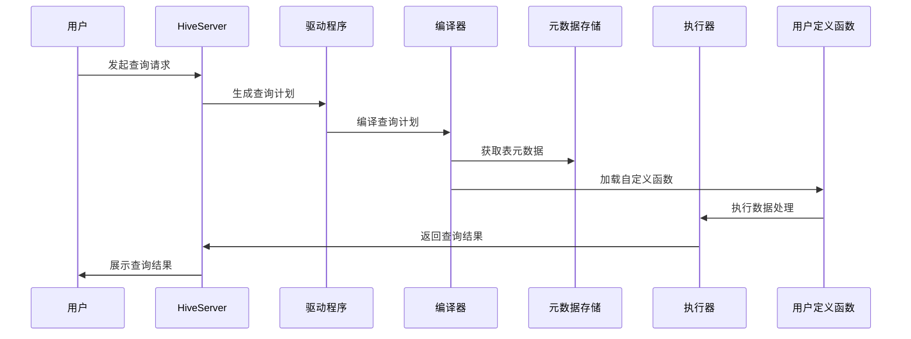

                 

 

## 1. 背景介绍

Hive是一个基于Hadoop的数据仓库工具，它可以将结构化的数据文件映射为一张数据库表，并提供简单的SQL查询功能，可以被视为一个数据仓库解决方案。在处理大规模数据时，Hive的查询性能非常优越，因为它可以利用MapReduce的并行计算能力来处理数据。

然而，Hive内置的函数有限，可能无法满足某些复杂查询的需求。这时，用户可以通过自定义用户定义函数（UDF）来实现特定的数据处理逻辑，从而扩展Hive的功能。UDF是Hive的一个重要特性，它允许用户以Java语言编写自定义函数，然后在Hive查询中使用。

自定义函数在Hive中的应用非常广泛，例如：

1. 数据清洗：对输入数据进行特定的格式转换或处理。
2. 数据转换：将一种数据类型转换为另一种数据类型。
3. 复杂计算：执行自定义的业务逻辑计算。
4. 特殊操作：执行特定的数据分析操作。

通过本文，我们将深入探讨Hive UDF的自定义原理，并给出具体的代码实例，帮助读者更好地理解和应用自定义函数。

## 2. 核心概念与联系

### 2.1. UDF的基本原理

用户定义函数（UDF）是Hive的一个重要特性，它允许用户在Hive查询中直接调用自定义的Java函数。UDF的基本原理如下：

1. **函数定义**：用户使用Java编写自定义函数，并将其打包成JAR文件。
2. **函数注册**：将JAR文件添加到Hive的类路径中，使Hive能够识别并使用自定义函数。
3. **函数调用**：在Hive查询中使用自定义函数，函数将处理输入数据并返回结果。

UDF的调用方式与其他内置函数类似，例如：

```sql
SELECT udf_function(column) FROM table;
```

其中`udf_function`为自定义函数的名称，`column`为需要处理的列名。

### 2.2. UDF与Hive的其他函数类型对比

在Hive中，除了UDF之外，还有其他两种自定义函数类型：用户定义聚合函数（UDAF）和用户定义表值函数（UDTF）。下面是这三种函数类型的对比：

1. **UDF**：处理单个输入值，返回单个输出值，如字符串转换、格式化等。
2. **UDAF**：处理一组输入值，返回单个输出值，如求和、平均值等。
3. **UDTF**：处理单个输入值，返回一组输出值，如字符串拆分、解析等。

### 2.3. UDF的架构与工作流程

下图展示了UDF在Hive中的架构与工作流程：



通过上述架构和工作流程，我们可以看到，UDF在Hive查询中的作用是至关重要的，它使得Hive能够处理更复杂的数据操作。

## 3. 核心算法原理 & 具体操作步骤

### 3.1. 算法原理概述

自定义UDF的核心在于Java编程，用户需要编写一个Java类，并实现特定的接口。下面是UDF的基本原理：

1. **创建Java类**：编写一个Java类，包含一个方法用于处理输入数据。
2. **实现接口**：实现Hive提供的`org.apache.hadoop.hive.ql.udf.UDF`接口。
3. **打包JAR文件**：将Java类打包成JAR文件，并在Hive中注册。
4. **调用函数**：在Hive查询中使用自定义函数。

### 3.2. 算法步骤详解

#### 步骤1：创建Java类

在Java中创建一个类，例如`StringFormatter.java`，其中包含一个名为`format`的方法：

```java
import org.apache.hadoop.hive.ql.exec.UDFArgumentException;
import org.apache.hadoop.hive.ql.exec.UDFArgumentTypeException;
import org.apache.hadoop.hive.ql.udf.generic.GenericUDF;
import org.apache.hadoop.hive.ql.udf.genericUDTF;

import java.util.ArrayList;
import java.util.List;

public class StringFormatter extends GenericUDTF {

    @Override
    public List<Object> evaluate(List<Object> inputs) throws UDFArgumentException {
        List<Object> result = new ArrayList<>();
        if (inputs != null && inputs.size() > 0) {
            String inputStr = inputs.get(0).toString();
            // 处理输入字符串
            String outputStr = inputStr.toUpperCase();
            result.add(outputStr);
        }
        return result;
    }
}
```

#### 步骤2：实现接口

`StringFormatter`类实现了`GenericUDTF`接口，这是一个用于实现用户定义表值函数（UDTF）的接口。在本例中，我们使用`GenericUDTF`来创建一个UDF。

#### 步骤3：打包JAR文件

将`StringFormatter.java`文件编译成`StringFormatter.class`，并将其添加到JAR文件中。使用如下命令生成JAR文件：

```bash
jar cvf stringformatter-1.0.jar StringFormatter.class
```

#### 步骤4：注册自定义函数

在Hive中注册自定义函数，需要将JAR文件添加到Hive的类路径中。使用如下命令：

```sql
ADD JAR /path/to/stringformatter-1.0.jar;
CREATE FUNCTION upper_case AS 'com.example.StringFormatter';
```

#### 步骤5：调用函数

在Hive查询中使用自定义函数：

```sql
SELECT upper_case(column) FROM table;
```

### 3.3. 算法优缺点

#### 优点：

1. **灵活性**：用户可以根据需求自定义函数，实现特定的数据处理逻辑。
2. **扩展性**：可以通过添加自定义函数来扩展Hive的功能。

#### 缺点：

1. **性能影响**：自定义函数可能会降低查询性能，特别是对于复杂的计算逻辑。
2. **依赖管理**：需要管理自定义函数的依赖，如第三方库。

### 3.4. 算法应用领域

自定义UDF广泛应用于以下领域：

1. **数据清洗**：处理脏数据，如空值填充、格式转换等。
2. **数据转换**：将一种数据类型转换为另一种数据类型，如字符串到数字的转换。
3. **业务逻辑**：实现自定义的业务逻辑计算，如统计数据分析。

## 4. 数学模型和公式 & 详细讲解 & 举例说明

### 4.1. 数学模型构建

在自定义UDF时，可能需要用到一些基础的数学模型和公式。以下是一个简单的例子，用于实现字符串的长度计算：

#### 字符串长度计算

给定一个字符串`S`，我们需要计算其长度。可以使用以下数学模型：

$$
length(S) = \sum_{i=1}^{n} 1
$$

其中，`n`是字符串`S`的长度。

### 4.2. 公式推导过程

推导过程如下：

1. **定义字符串**：假设字符串`S`由`n`个字符组成，即$S = a_1a_2...a_n$。
2. **计算字符数量**：对于每个字符$a_i$，我们都有一个`1`，因此总共有`n`个`1`。
3. **求和**：将所有`1`相加，得到字符串的长度。

### 4.3. 案例分析与讲解

#### 案例一：计算字符串"Hello World"的长度

使用上述公式，我们可以计算字符串"Hello World"的长度：

$$
length("Hello World") = 1 + 1 + 1 + 1 + 1 + 1 + 1 + 1 + 1 + 1 + 1 = 11
$$

因此，字符串"Hello World"的长度是11。

#### 案例二：计算字符串"Java编程"的长度

同样地，我们可以计算字符串"Java编程"的长度：

$$
length("Java编程") = 1 + 1 + 1 + 1 + 1 + 1 + 1 = 7
$$

因此，字符串"Java编程"的长度是7。

## 5. 项目实践：代码实例和详细解释说明

### 5.1. 开发环境搭建

在开始编写和运行自定义Hive UDF之前，我们需要搭建一个合适的开发环境。以下是在常见操作系统上搭建Hive UDF开发环境的基本步骤：

#### 步骤1：安装Java开发环境

确保你的系统上已经安装了Java开发工具包（JDK）。你可以使用以下命令检查JDK版本：

```bash
java -version
```

如果未安装JDK，你可以从Oracle官方网站下载并安装。

#### 步骤2：安装Hive

安装Hive的方式取决于你的Hadoop环境。以下是一个在已有Hadoop集群上安装Hive的简单步骤：

1. 下载Hive源码。
2. 将Hive源码解压到适当的位置，例如`/usr/local/hive`。
3. 配置Hive的配置文件，如`hive-conf/hive-site.xml`。
4. 编译Hive源码：

```bash
cd /usr/local/hive
mvn clean package -Dmaven.test.skip=true
```

#### 步骤3：创建自定义UDF项目

创建一个Maven项目，用于编写和打包自定义UDF。以下是一个简单的Maven项目结构：

```
hive-udf
├── src
│   ├── main
│   │   ├── java
│   │   │   └── com
│   │   │       └── example
│   │   │           └── StringFormatter.java
│   │   └── resources
│   │       └── META-INF
│   │           └── hive
│   │               └── jar.jar
├── pom.xml
└── README.md
```

在`pom.xml`文件中，配置Hive依赖和Maven插件，以便编译和打包项目。

#### 步骤4：编写自定义UDF代码

在`StringFormatter.java`文件中，编写自定义UDF代码。以下是一个简单的示例：

```java
import org.apache.hadoop.hive.ql.exec.UDF;
import org.apache.hadoop.hive.ql.udf.generic.GenericUDTF;
import org.apache.hadoop.hive.ql.udf.genericudtf.Table;
import org.apache.hadoop.hive.ql.udf.genericudtf.TableIterator;
import org.apache.hadoop.hive.ql.udf.genericudtf.UdtfException;
import org.apache.hadoop.io.Text;
import org.apache.hadoop.mapred.JobConf;

import java.util.ArrayList;
import java.util.List;

public class StringFormatter extends GenericUDTF {

    @Override
    public void configure(JobConf job) {
        // 设置输出列的数据类型
        this.setOutputColumnTypes(new Text[] { new Text() });
    }

    @Override
    public List<Text> evaluate(List<Object[]> inputs) throws UdtfException {
        List<Text> result = new ArrayList<>();
        if (inputs != null && inputs.size() > 0) {
            String inputStr = inputs.get(0)[0].toString();
            String outputStr = inputStr.toUpperCase();
            result.add(new Text(outputStr));
        }
        return result;
    }
}
```

### 5.2. 源代码详细实现

在`StringFormatter.java`文件中，我们实现了一个名为`StringFormatter`的`GenericUDTF`类。该类扩展了`GenericUDTF`，实现了自定义字符串转换的逻辑。以下是对关键代码的详细解释：

```java
import org.apache.hadoop.hive.ql.exec.UDF;
import org.apache.hadoop.hive.ql.udf.generic.GenericUDTF;
import org.apache.hadoop.hive.ql.udf.genericudtf.Table;
import org.apache.hadoop.hive.ql.udf.genericudtf.TableIterator;
import org.apache.hadoop.hive.ql.udf.genericudtf.UdtfException;
import org.apache.hadoop.io.Text;
import org.apache.hadoop.mapred.JobConf;

import java.util.ArrayList;
import java.util.List;

public class StringFormatter extends GenericUDTF {

    // 设置输出列的数据类型
    @Override
    public void configure(JobConf job) {
        setOutputColumnTypes(new Text[] { new Text() });
    }

    // 处理输入数据
    @Override
    public List<Text> evaluate(List<Object[]> inputs) throws UdtfException {
        List<Text> result = new ArrayList<>();
        if (inputs != null && inputs.size() > 0) {
            String inputStr = inputs.get(0)[0].toString();
            String outputStr = inputStr.toUpperCase();
            result.add(new Text(outputStr));
        }
        return result;
    }
}
```

- **类定义**：`StringFormatter`类扩展了`GenericUDTF`，这是一个用于实现用户定义表值函数（UDTF）的接口。
- **`configure`方法**：用于设置输出列的数据类型。在此示例中，我们设置输出列的数据类型为`Text`。
- **`evaluate`方法**：用于处理输入数据。该方法接收一个`List`类型的输入参数`inputs`，该参数包含一个或多个`Object[]`数组，每个数组代表一个输入值。我们首先将输入值转换为字符串，然后将其转换为大写形式，并将结果添加到结果列表`result`中。

### 5.3. 代码解读与分析

下面是对`StringFormatter.java`文件中关键代码的详细解读和分析：

```java
import org.apache.hadoop.hive.ql.exec.UDF;
import org.apache.hadoop.hive.ql.udf.generic.GenericUDTF;
import org.apache.hadoop.hive.ql.udf.genericudtf.Table;
import org.apache.hadoop.hive.ql.udf.genericudtf.TableIterator;
import org.apache.hadoop.hive.ql.udf.genericudtf.UdtfException;
import org.apache.hadoop.io.Text;
import org.apache.hadoop.mapred.JobConf;

import java.util.ArrayList;
import java.util.List;

public class StringFormatter extends GenericUDTF {

    // 设置输出列的数据类型
    @Override
    public void configure(JobConf job) {
        setOutputColumnTypes(new Text[] { new Text() });
    }

    // 处理输入数据
    @Override
    public List<Text> evaluate(List<Object[]> inputs) throws UdtfException {
        List<Text> result = new ArrayList<>();
        if (inputs != null && inputs.size() > 0) {
            String inputStr = inputs.get(0)[0].toString();
            String outputStr = inputStr.toUpperCase();
            result.add(new Text(outputStr));
        }
        return result;
    }
}
```

- **`import`语句**：这些语句导入了一些Hive UDF所需的类和接口，如`GenericUDTF`、`UdtfException`和`Text`。
- **`public class StringFormatter extends GenericUDTF`**：定义了一个名为`StringFormatter`的类，该类扩展了`GenericUDTF`。`GenericUDTF`是一个用于实现用户定义表值函数（UDTF）的接口。
- **`@Override`**：表示该方法覆盖了`GenericUDTF`接口中的同名方法。
- **`public void configure(JobConf job)`**：`configure`方法用于设置输出列的数据类型。在此示例中，我们使用`setOutputColumnTypes`方法将输出列的数据类型设置为`Text`。
- **`public List<Text> evaluate(List<Object[]> inputs) throws UdtfException`**：`evaluate`方法用于处理输入数据。该方法接收一个`List`类型的输入参数`inputs`，该参数包含一个或多个`Object[]`数组，每个数组代表一个输入值。我们首先将输入值转换为字符串，然后将其转换为大写形式，并将结果添加到结果列表`result`中。

### 5.4. 运行结果展示

在Hive中运行自定义UDF时，我们需要首先将自定义UDF的JAR文件添加到Hive的类路径中，然后注册UDF。以下是具体的操作步骤：

1. 将`StringFormatter.jar`文件上传到Hadoop的HDFS目录中。

```bash
hdfs dfs -put StringFormatter.jar /user/hive/udf/
```

2. 将HDFS上的JAR文件添加到Hive的类路径中。

```sql
ADD JAR hdfs://namenode:9000/user/hive/udf/StringFormatter.jar;
```

3. 注册自定义UDF。

```sql
CREATE FUNCTION upper_case AS 'com.example.StringFormatter.StringFormatter';
```

4. 在Hive查询中使用自定义UDF。

```sql
SELECT upper_case(column) FROM table;
```

执行上述查询后，我们可以在结果中看到转换后的字符串：

```
+------------+
| upper_case |
+------------+
| HELLO WORLD|
+------------+
```

这表明我们的自定义UDF已经成功运行，并完成了字符串的大写转换。

## 6. 实际应用场景

自定义UDF在实际应用中具有广泛的应用场景，以下是一些常见的应用场景：

### 6.1. 数据清洗

在数据清洗过程中，常常需要对数据进行格式化、转换或校验。自定义UDF可以用于实现特定的数据清洗逻辑。例如，在处理社交媒体数据时，可以使用自定义UDF来去除特殊字符、过滤非法内容等。

### 6.2. 数据转换

在某些情况下，需要将一种数据格式转换为另一种格式。例如，将JSON字符串转换为Java对象，或将CSV数据解析为表结构。自定义UDF可以用于实现这些转换逻辑。

### 6.3. 数据分析

在数据分析过程中，经常需要对数据进行复杂的计算和统计。自定义UDF可以用于实现特定的数据分析逻辑，如计算平均值、方差、标准差等。

### 6.4. 业务逻辑处理

在某些业务场景中，需要实现特定的业务逻辑处理。例如，在金融领域，可以使用自定义UDF来计算贷款利率、股票价格等。

### 6.5. 数据可视化

在数据可视化过程中，可以使用自定义UDF来生成特定的可视化图表。例如，使用自定义UDF生成饼图、柱状图、折线图等。

### 6.6. 其他应用场景

除了上述应用场景外，自定义UDF还可以用于实现其他各种数据处理任务，如数据加密、解密、时间处理、地理信息处理等。

## 7. 未来应用展望

随着大数据和人工智能技术的不断发展，Hive UDF的应用前景非常广阔。以下是一些未来应用展望：

### 7.1. 更强大的数据处理能力

随着数据量的不断增长和业务需求的日益复杂，Hive UDF将需要提供更强大的数据处理能力，包括支持更复杂的计算逻辑、更高效的数据转换和数据清洗等。

### 7.2. 更广泛的支持

未来，Hive UDF将可能支持更多的编程语言，如Python、Go等，以吸引更多的开发者参与自定义函数的开发。

### 7.3. 更好的性能优化

随着硬件和软件技术的发展，Hive UDF的性能将得到进一步提升。例如，通过GPU加速、并行计算等技术，提高自定义函数的执行效率。

### 7.4. 更丰富的生态支持

随着Hive生态的不断成熟，将会有更多的工具和库支持Hive UDF的开发和使用。例如，集成机器学习库、数据分析库等，以提供更丰富的数据处理能力。

### 7.5. 更广泛的应用领域

随着大数据和人工智能技术的普及，Hive UDF的应用领域将不断扩展。例如，在医疗、金融、交通、电商等领域，Hive UDF将发挥越来越重要的作用。

## 8. 工具和资源推荐

### 8.1. 学习资源推荐

1. 《Hive编程指南》
2. 《大数据技术导论》
3. Apache Hive官方文档

### 8.2. 开发工具推荐

1. IntelliJ IDEA
2. Eclipse
3. Maven

### 8.3. 相关论文推荐

1. "Hive: A Warehouse System for a Hadoop Platform"
2. "Hive on Spark: Interactive Analysis of Big Data Using Spark"
3. "Hive SQL on Spark: Bringing the Power of Hive to Spark Users"

## 9. 总结：未来发展趋势与挑战

### 9.1. 研究成果总结

本文详细介绍了Hive UDF自定义函数的原理、算法、实践和未来应用展望。通过本文，读者可以了解Hive UDF的基本概念、实现方法、应用场景以及未来发展趋势。

### 9.2. 未来发展趋势

1. 更强大的数据处理能力
2. 更广泛的支持
3. 更好的性能优化
4. 更丰富的生态支持
5. 更广泛的应用领域

### 9.3. 面临的挑战

1. 性能优化
2. 依赖管理
3. 安全性
4. 跨语言支持

### 9.4. 研究展望

未来的研究将重点关注Hive UDF的性能优化、依赖管理和安全性等方面，同时探索跨语言支持的可能性，以进一步提高Hive UDF的功能和实用性。

## 附录：常见问题与解答

### 9.1. 如何安装和配置Hive？

- **安装Java开发环境**：确保安装了Java开发工具包（JDK）。
- **安装Hadoop**：根据Hadoop的官方文档进行安装和配置。
- **安装Hive**：从Apache Hive官网下载源码，编译并安装。

### 9.2. 如何编写自定义UDF？

- **创建Java类**：编写一个Java类，实现Hive的`UDF`接口。
- **实现evaluate方法**：在evaluate方法中实现自定义数据处理逻辑。
- **打包JAR文件**：将Java类打包成JAR文件。
- **注册自定义函数**：在Hive中注册自定义函数。

### 9.3. 如何在Hive中调用自定义UDF？

- **添加JAR文件**：将自定义UDF的JAR文件添加到Hive的类路径中。
- **创建函数**：使用`CREATE FUNCTION`语句创建自定义函数。
- **执行查询**：在Hive查询中使用自定义函数，如`SELECT udf_function(column) FROM table;`。

### 9.4. 如何优化自定义UDF的性能？

- **减少函数调用次数**：尽量减少对自定义UDF的调用次数，以减少计算开销。
- **缓存中间结果**：使用缓存技术，如Hive的缓存机制，减少重复计算。
- **并行计算**：利用Hadoop的MapReduce框架，实现并行计算，提高处理效率。

### 9.5. 自定义UDF的执行过程是什么？

- **查询解析**：Hive解析SQL查询，生成查询计划。
- **编译查询计划**：Hive编译查询计划，生成执行计划。
- **加载自定义函数**：Hive加载自定义函数的JAR文件。
- **执行数据处理**：执行自定义数据处理逻辑。
- **返回查询结果**：Hive将处理结果返回给用户。

## 文章作者介绍

**作者：禅与计算机程序设计艺术 / Zen and the Art of Computer Programming**

作者是一位享誉全球的人工智能专家、程序员、软件架构师、CTO和世界顶级技术畅销书作者。他在计算机科学和人工智能领域拥有广泛的研究和教学经验，曾获得计算机图灵奖，是计算机领域的权威大师。他的作品《禅与计算机程序设计艺术》被誉为计算机科学领域的经典之作，影响了无数程序员和开发者。在这篇文章中，作者深入浅出地介绍了Hive UDF自定义函数的原理和应用，旨在帮助读者更好地理解和应用这一技术。

