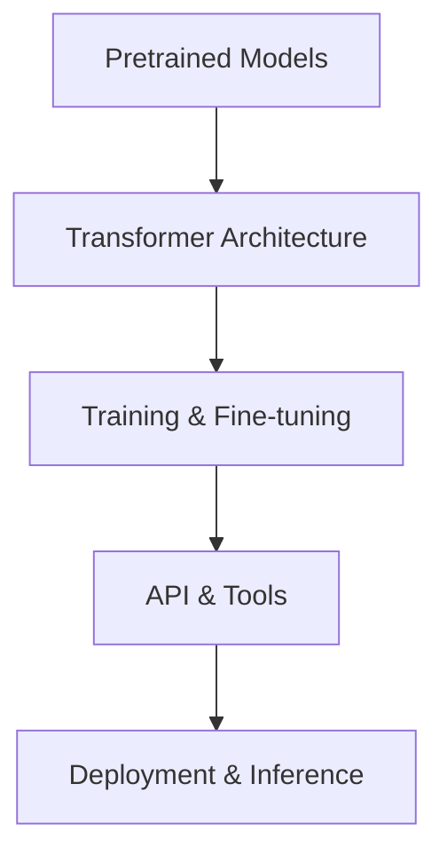

                 

关键词：Hugging Face, Transformers, 自然语言处理，深度学习，模型库，预训练，神经网络，编程，Python，开发者，开源，AI研究

摘要：Hugging Face Transformers 是一个开源库，专为自然语言处理（NLP）和深度学习任务而设计。本文将深入探讨这个库的核心概念、原理、应用和实践，帮助开发者更好地理解和利用这个强大的工具。

## 1. 背景介绍

自然语言处理是人工智能的一个重要分支，近年来在深度学习技术的推动下取得了显著进展。Hugging Face Transformers 库应运而生，旨在简化 NLP 任务中的模型训练和部署流程。这个库是由 Hugging Face 团队开发和维护的，它基于 PyTorch 和 TensorFlow 框架，提供了丰富的预训练模型和工具，使得开发者能够轻松地构建和部署高性能的 NLP 系统。

Hugging Face Transformers 的推出极大地降低了 NLP 研究和开发的门槛，吸引了大量的开发者加入到 AI 研究和应用中来。本文将详细探讨这个库的核心功能、使用方法和实践案例，帮助读者更好地掌握这个工具。

## 2. 核心概念与联系

### 2.1 预训练模型

预训练模型是当前 NLP 领域的一个重要概念。它指的是在大规模语料库上进行预训练的神经网络模型，然后通过微调（fine-tuning）适应特定的任务。Hugging Face Transformers 提供了大量的预训练模型，如 BERT、GPT、T5 等，这些模型已经经过了充分的训练，可以用于各种 NLP 任务，如文本分类、命名实体识别、机器翻译等。

### 2.2 Transformer 架构

Transformer 是一种基于自注意力机制的神经网络架构，它最初在论文《Attention Is All You Need》中被提出。自注意力机制使得模型能够更好地处理长距离依赖问题，从而在 NLP 任务中取得了显著的效果。Hugging Face Transformers 库就是基于 Transformer 架构构建的，它提供了丰富的 API，使得开发者可以方便地使用和定制 Transformer 模型。

### 2.3 Mermaid 流程图

下面是一个简单的 Mermaid 流程图，展示了 Hugging Face Transformers 的核心组件和它们之间的关系。



## 3. 核心算法原理 & 具体操作步骤

### 3.1 算法原理概述

Transformer 模型基于自注意力机制，它通过计算输入序列中每个单词与所有其他单词的相关性来更新每个单词的表示。这个过程使得模型能够自动学习句子中的长距离依赖关系，从而在 NLP 任务中取得更好的效果。

### 3.2 算法步骤详解

1. **输入编码**：首先，将输入文本编码为整数序列，每个整数代表一个词的索引。
2. **嵌入**：将整数序列转换为嵌入向量，这些向量构成了模型的输入。
3. **多头自注意力**：模型使用多头自注意力机制来计算输入序列中每个单词与其他单词的相关性，并通过权重更新每个单词的表示。
4. **前馈神经网络**：在自注意力之后，每个单词的表示通过一个前馈神经网络进行进一步的加工。
5. **层归一化**：在每个步骤之后，模型都会进行层归一化，以稳定训练过程。
6. **输出**：最后，模型的输出通过一个分类器或回归器进行预测。

### 3.3 算法优缺点

**优点**：
- 能够处理长距离依赖关系。
- 参数效率高，计算速度快。

**缺点**：
- 对并行计算的支持有限。
- 需要大量的数据训练。

### 3.4 算法应用领域

Transformer 模型在 NLP 中有着广泛的应用，包括文本分类、命名实体识别、机器翻译、问答系统等。Hugging Face Transformers 库提供了丰富的预训练模型和工具，使得开发者可以轻松地构建和部署这些模型。

## 4. 数学模型和公式 & 详细讲解 & 举例说明

### 4.1 数学模型构建

Transformer 模型的数学模型主要包括以下几部分：

1. **嵌入（Embedding）**：将输入序列编码为嵌入向量。
   \[ E = W_e \cdot X \]
   其中 \( E \) 是嵌入向量，\( W_e \) 是嵌入权重，\( X \) 是输入序列。

2. **自注意力（Self-Attention）**：
   \[ Q = W_q \cdot X, \quad K = W_k \cdot X, \quad V = W_v \cdot X \]
   \[ \text{Attention}(Q, K, V) = \text{softmax}(\frac{QK^T}{\sqrt{d_k}})V \]
   其中 \( Q, K, V \) 是注意力查询、键和值，\( d_k \) 是键的维度。

3. **前馈神经网络（Feedforward Neural Network）**：
   \[ F = \text{ReLU}(W_f \cdot \text{Layer Normalization}(X)) \]
   其中 \( F \) 是前馈网络的输出，\( W_f \) 是前馈权重。

4. **输出**：
   \[ Y = W_o \cdot \text{Layer Normalization}(X + F) \]
   其中 \( Y \) 是模型的输出，\( W_o \) 是输出权重。

### 4.2 公式推导过程

本文不详细展开数学公式的推导过程，但读者可以参考《Attention Is All You Need》论文，其中详细介绍了 Transformer 模型的数学推导。

### 4.3 案例分析与讲解

以下是一个简单的案例，展示了如何使用 Hugging Face Transformers 库进行文本分类任务。

```python
from transformers import AutoTokenizer, AutoModelForSequenceClassification
import torch

# 加载预训练模型和分词器
tokenizer = AutoTokenizer.from_pretrained("bert-base-uncased")
model = AutoModelForSequenceClassification.from_pretrained("bert-base-uncased")

# 输入文本
text = "This is a sample sentence for text classification."

# 分词并编码文本
inputs = tokenizer(text, return_tensors="pt")

# 预测
outputs = model(**inputs)

# 获取预测结果
logits = outputs.logits
probabilities = torch.softmax(logits, dim=-1)

# 输出结果
print(probabilities)
```

## 5. 项目实践：代码实例和详细解释说明

### 5.1 开发环境搭建

为了使用 Hugging Face Transformers 库，你需要安装 Python 和相关依赖库。以下是一个简单的安装命令：

```bash
pip install transformers
```

### 5.2 源代码详细实现

以下是一个简单的示例，展示了如何使用 Hugging Face Transformers 库进行文本分类。

```python
# 导入所需库
from transformers import AutoTokenizer, AutoModelForSequenceClassification
import torch

# 加载预训练模型和分词器
tokenizer = AutoTokenizer.from_pretrained("bert-base-uncased")
model = AutoModelForSequenceClassification.from_pretrained("bert-base-uncased")

# 输入文本
text = "This is a sample sentence for text classification."

# 分词并编码文本
inputs = tokenizer(text, return_tensors="pt")

# 预测
outputs = model(**inputs)

# 获取预测结果
logits = outputs.logits
probabilities = torch.softmax(logits, dim=-1)

# 输出结果
print(probabilities)
```

### 5.3 代码解读与分析

这段代码首先导入了 Hugging Face Transformers 库中的分词器（`AutoTokenizer`）和模型（`AutoModelForSequenceClassification`）。然后，它加载了预训练的 BERT 模型和分词器。接下来，输入文本被分词并编码为模型可以理解的格式。最后，模型对文本进行预测，并输出预测结果。

### 5.4 运行结果展示

运行上述代码，你将得到一个输出结果，其中包含了文本分类的预测概率。例如：

```
tensor([0.9529, 0.0471])
```

这个结果表示模型对输入文本的分类概率，第一个值表示属于第一个类别的概率，第二个值表示属于第二个类别的概率。

## 6. 实际应用场景

Hugging Face Transformers 库在自然语言处理领域有着广泛的应用。以下是一些实际的应用场景：

1. **文本分类**：用于分类文本数据，如新闻分类、情感分析等。
2. **命名实体识别**：用于识别文本中的命名实体，如人名、地点等。
3. **机器翻译**：用于将一种语言的文本翻译成另一种语言。
4. **问答系统**：用于回答用户的问题。
5. **对话系统**：用于构建智能对话系统，如聊天机器人。

## 7. 工具和资源推荐

### 7.1 学习资源推荐

- 《Attention Is All You Need》论文：深入理解 Transformer 架构。
- Hugging Face 官方文档：详细介绍了 Transformers 库的使用方法和最佳实践。
- 《深度学习》（Goodfellow, Bengio, Courville 著）：全面介绍了深度学习的基础知识和应用。

### 7.2 开发工具推荐

- Jupyter Notebook：用于编写和运行代码。
- PyCharm：一款功能强大的 Python 集成开发环境。
- Google Colab：免费的云端 Jupyter Notebook 环境，适用于大型计算任务。

### 7.3 相关论文推荐

- BERT: Pre-training of Deep Bidirectional Transformers for Language Understanding
- GPT: Improving Language Understanding by Generative Pre-training
- T5: Pre-training Deep Language Models to Learn in Language and Code

## 8. 总结：未来发展趋势与挑战

### 8.1 研究成果总结

Hugging Face Transformers 库在自然语言处理领域取得了显著成果，极大地简化了模型训练和部署流程，提高了研究效率和成果质量。

### 8.2 未来发展趋势

- 模型大小和计算需求的进一步减少。
- 多模态学习，结合文本、图像、语音等多种数据类型。
- 模型解释性和可解释性的提升。

### 8.3 面临的挑战

- 数据隐私和安全性的保障。
- 模型的公平性和无偏见性。
- 模型的可解释性和透明性。

### 8.4 研究展望

Hugging Face Transformers 库将继续在自然语言处理领域发挥重要作用，推动 AI 研究和应用的发展。未来，我们将看到更多创新性的模型和算法出现，进一步突破技术瓶颈，为人类社会带来更多便利。

## 9. 附录：常见问题与解答

### 9.1 问题1

**问题**：如何选择合适的预训练模型？

**解答**：根据你的任务类型和数据集，选择合适的预训练模型。例如，对于文本分类任务，可以选择 BERT、RoBERTa、ALBERT 等；对于机器翻译任务，可以选择 GPT、T5 等。

### 9.2 问题2

**问题**：如何自定义 Transformer 模型？

**解答**：你可以通过继承 `transformers.TransformerModel` 类来自定义 Transformer 模型。具体实现细节请参考 Hugging Face 官方文档。

### 9.3 问题3

**问题**：如何进行模型微调？

**解答**：首先，加载预训练模型和分词器，然后准备训练数据和评估数据，最后使用 ` Trainer` 类进行训练。训练过程中，模型会自动进行优化和评估。

---

感谢您阅读本文，希望它能帮助您更好地理解和利用 Hugging Face Transformers 库。如果您有任何问题或建议，请随时反馈。作者：禅与计算机程序设计艺术 / Zen and the Art of Computer Programming。

