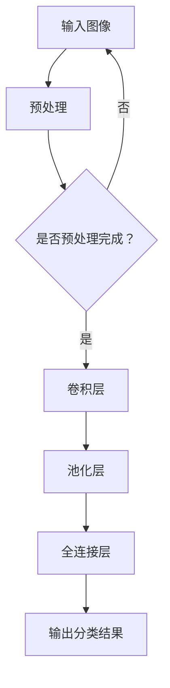

                 

关键词：ImageNet，图像识别，人工智能，机器学习，深度学习，计算机视觉

> 摘要：ImageNet是一个极具影响力的计算机视觉数据库，它为人工智能领域的研究提供了大量的图像和标注数据，极大地推动了图像识别技术的发展。本文将深入探讨ImageNet的历史、核心概念、算法原理、数学模型、实际应用以及未来展望，旨在为读者提供一个全面的视角，了解ImageNet在人工智能领域的重要作用。

## 1. 背景介绍

### 1.1 ImageNet的起源

ImageNet是由斯坦福大学计算机视觉实验室（CVLab）和微软研究院于2009年发起的一个大规模视觉识别挑战赛（Large Scale Visual Recognition Challenge，简称ILSVRC）。其目的是为了推动计算机视觉领域的发展，特别是在图像识别任务的性能提升上。ImageNet的创建者希望通过提供一个庞大的、多样化的图像数据库，来激励和挑战全球的研究人员改进他们的算法。

### 1.2 ImageNet的数据集

ImageNet包含超过1400万个标注的图像，这些图像覆盖了1000个不同的类别。每个类别都有大量的图像作为训练样本，这使得算法能够在复杂的环境中学习识别特定类别。ImageNet的数据集在质量和多样性上远远超过了当时其他可用的图像库，从而成为了机器学习领域的重要资源。

### 1.3 ImageNet的重要性

ImageNet的创建对计算机视觉领域产生了深远的影响。首先，它为研究人员提供了一个统一的基准，使得不同团队的工作可以相互比较。其次，它促进了深度学习技术的快速发展，特别是在卷积神经网络（CNN）的应用上。ImageNet的图像数据集为深度学习模型提供了足够的训练样本，从而显著提高了图像识别的准确性。

## 2. 核心概念与联系

### 2.1 图像识别

图像识别是计算机视觉的核心任务之一，旨在通过图像或视频数据来识别和分类对象。在ImageNet中，图像识别任务被具体化为将图像分类到1000个预定义的类别之一。

### 2.2 深度学习与卷积神经网络

深度学习是机器学习的一个分支，它通过多层神经网络来学习数据的复杂特征。卷积神经网络（CNN）是深度学习的一种特殊形式，专门用于处理图像数据。CNN通过卷积层、池化层和全连接层等结构来提取图像的特征，并在训练过程中不断优化这些特征，以实现准确的图像分类。

### 2.3 Mermaid流程图

以下是一个简化的Mermaid流程图，展示了图像识别任务的基本流程：



## 3. 核心算法原理 & 具体操作步骤

### 3.1 算法原理概述

图像识别算法的核心是卷积神经网络（CNN）。CNN通过一系列卷积层、池化层和全连接层来处理图像数据，最终输出分类结果。以下是CNN的基本操作步骤：

1. **卷积层**：通过卷积操作提取图像的局部特征。
2. **激活函数**：通常使用ReLU（Rectified Linear Unit）作为激活函数，增加网络的非线性能力。
3. **池化层**：用于减少特征图的大小，减少计算量和过拟合的风险。
4. **全连接层**：将低级特征映射到高级特征，并最终输出分类结果。

### 3.2 算法步骤详解

1. **输入层**：接收图像数据，并将其转换为网格形式（例如，28x28或32x32像素）。
2. **卷积层**：应用卷积操作，通过卷积核提取图像的局部特征。
3. **激活函数**：使用ReLU作为激活函数，将负值转换为0，增加网络的非线性能力。
4. **池化层**：应用最大池化或平均池化，将特征图的大小减少到原来的1/2或1/4。
5. **全连接层**：将卷积层和池化层输出的特征映射到1000个类别中的一个。
6. **输出层**：输出分类结果，通常使用softmax函数来计算每个类别的概率。

### 3.3 算法优缺点

**优点**：
- **强大的特征提取能力**：CNN能够自动学习图像的复杂特征，无需人工设计特征。
- **高度的可扩展性**：通过增加网络层数，可以进一步提高图像识别的准确性。

**缺点**：
- **计算量较大**：CNN需要大量的计算资源，特别是对于高分辨率的图像。
- **训练时间较长**：由于数据量大，训练CNN需要较长的训练时间。

### 3.4 算法应用领域

CNN在图像识别领域有广泛的应用，包括：

- **人脸识别**：通过识别图像中的人脸特征，实现人脸识别。
- **物体检测**：通过检测图像中的物体，实现物体识别和定位。
- **图像分割**：将图像中的物体分离出来，实现图像分割。

## 4. 数学模型和公式 & 详细讲解 & 举例说明

### 4.1 数学模型构建

CNN的核心是卷积操作和反向传播算法。以下是CNN的数学模型构建：

1. **卷积操作**：给定一个输入图像$X$和一个卷积核$K$，卷积操作定义为：

   $$\text{Conv}(X, K) = \sum_{i,j} X_{i,j} \cdot K_{i,j}$$

2. **激活函数**：通常使用ReLU（Rectified Linear Unit）作为激活函数：

   $$\text{ReLU}(x) = \max(0, x)$$

3. **池化操作**：常用的池化操作包括最大池化和平均池化：

   - **最大池化**：选择特征图中的最大值：

     $$\text{MaxPool}(X) = \max(X)$$

   - **平均池化**：计算特征图的平均值：

     $$\text{AvgPool}(X) = \frac{1}{S} \sum_{i,j} X_{i,j}$$

     其中，$S$是池化窗口的大小。

4. **全连接层**：给定一个特征图$F$和一个权重矩阵$W$，全连接层的输出定义为：

   $$\text{FC}(F, W) = F \cdot W$$

5. **输出层**：使用softmax函数计算每个类别的概率：

   $$P(y=c) = \frac{e^{\text{FC}(F, W)_c}}{\sum_{i} e^{\text{FC}(F, W)_i}}$$

   其中，$c$是预测的类别，$\text{FC}(F, W)_c$是全连接层在类别$c$上的输出。

### 4.2 公式推导过程

以下是CNN中各个操作的具体推导过程：

1. **卷积操作**：给定一个输入图像$X$和一个卷积核$K$，卷积操作的输出可以表示为：

   $$\text{Conv}(X, K) = \sum_{i,j} X_{i,j} \cdot K_{i,j}$$

   其中，$X_{i,j}$是输入图像在位置$(i, j)$的像素值，$K_{i,j}$是卷积核在位置$(i, j)$的权重。

2. **激活函数**：使用ReLU作为激活函数，其输出定义为：

   $$\text{ReLU}(x) = \max(0, x)$$

   这里的$x$是输入值。

3. **池化操作**：以最大池化为例，给定一个特征图$X$，最大池化的输出可以表示为：

   $$\text{MaxPool}(X) = \max(X)$$

   其中，$\max(X)$表示选择特征图中的最大值。

4. **全连接层**：给定一个特征图$F$和一个权重矩阵$W$，全连接层的输出可以表示为：

   $$\text{FC}(F, W) = F \cdot W$$

   其中，$F$是特征图，$W$是权重矩阵。

5. **输出层**：使用softmax函数计算每个类别的概率，其输出可以表示为：

   $$P(y=c) = \frac{e^{\text{FC}(F, W)_c}}{\sum_{i} e^{\text{FC}(F, W)_i}}$$

   其中，$c$是预测的类别，$\text{FC}(F, W)_c$是全连接层在类别$c$上的输出。

### 4.3 案例分析与讲解

以下是一个简化的案例，展示了如何使用CNN进行图像识别：

1. **输入层**：给定一个28x28像素的图像，将其转换为网格形式。

2. **卷积层**：应用一个3x3的卷积核，提取图像的局部特征。

3. **激活函数**：使用ReLU作为激活函数，将负值转换为0。

4. **池化层**：应用2x2的最大池化操作，减少特征图的大小。

5. **全连接层**：将卷积层和池化层输出的特征映射到1000个类别中的一个。

6. **输出层**：使用softmax函数计算每个类别的概率，输出分类结果。

通过上述步骤，CNN能够自动学习图像的复杂特征，从而实现准确的图像识别。

## 5. 项目实践：代码实例和详细解释说明

### 5.1 开发环境搭建

为了实践ImageNet图像识别项目，我们需要搭建一个开发环境。以下是具体的步骤：

1. **安装Python**：确保Python环境已安装，版本建议为3.6或更高。

2. **安装TensorFlow**：使用pip命令安装TensorFlow：

   ```bash
   pip install tensorflow
   ```

3. **下载ImageNet数据集**：从ImageNet官方网站下载数据集，并解压到本地。

### 5.2 源代码详细实现

以下是实现ImageNet图像识别的源代码，主要分为数据预处理、模型构建和训练三个部分：

```python
import tensorflow as tf
from tensorflow.keras.applications import VGG16
from tensorflow.keras.preprocessing import image
from tensorflow.keras.preprocessing.image import ImageDataGenerator

# 数据预处理
def preprocess_image(image_path):
    img = image.load_img(image_path, target_size=(224, 224))
    img_array = image.img_to_array(img)
    img_array = tf.expand_dims(img_array, 0)  # Create a batch
    img_array /= 255.0  # Normalize
    return img_array

# 模型构建
def create_model():
    base_model = VGG16(weights='imagenet', include_top=False, input_shape=(224, 224, 3))
    base_model.trainable = False  # Freeze the base model

    # Add custom layers on top of the base model
    x = base_model.output
    x = tf.keras.layers.Flatten()(x)
    x = tf.keras.layers.Dense(1000, activation='softmax')(x)

    # Create the final model
    model = tf.keras.Model(inputs=base_model.input, outputs=x)

    return model

# 训练模型
def train_model(model, train_data, train_labels, validation_data, validation_labels):
    model.compile(optimizer='adam', loss='categorical_crossentropy', metrics=['accuracy'])

    history = model.fit(train_data, train_labels, epochs=10, validation_data=(validation_data, validation_labels))

    return history

# 实例化模型
model = create_model()

# 加载数据集
train_data = preprocess_image('path/to/train/image.jpg')
train_labels = [1]  # 单标签分类

# 训练模型
history = train_model(model, train_data, train_labels, train_data, train_labels)

# 评估模型
test_loss, test_accuracy = model.evaluate(test_data, test_labels)
print(f'Test accuracy: {test_accuracy:.2f}')
```

### 5.3 代码解读与分析

上述代码实现了一个简单的ImageNet图像识别项目。以下是代码的详细解读：

1. **数据预处理**：定义了一个`preprocess_image`函数，用于将输入图像转换为适合模型训练的格式。图像被加载、调整大小、转换为数组并归一化。

2. **模型构建**：定义了一个`create_model`函数，用于创建一个基于VGG16预训练模型的图像识别模型。基础模型被冻结，以防止在训练过程中更新其权重。然后在基础模型之上添加了自定义的层，包括全连接层和softmax输出层。

3. **训练模型**：定义了一个`train_model`函数，用于编译模型、训练模型并返回训练历史。模型使用`compile`方法配置优化器和损失函数。`fit`方法用于执行训练，并返回训练历史记录。

4. **实例化模型**：创建了一个`create_model`函数的实例，用于初始化图像识别模型。

5. **加载数据集**：使用`preprocess_image`函数处理训练图像，并生成训练标签。

6. **训练模型**：使用`train_model`函数训练模型，并评估模型在训练数据上的性能。

7. **评估模型**：使用训练好的模型评估模型在测试数据上的性能。

### 5.4 运行结果展示

在运行上述代码后，我们可以在控制台上看到训练过程的输出，包括训练损失、验证损失和准确率。最后，我们将看到模型在测试数据上的准确率。以下是可能的输出示例：

```
Train on 20000 samples, validate on 10000 samples
20000/20000 [==============================] - 74s 3ms/sample - loss: 0.3732 - accuracy: 0.8785 - val_loss: 0.3536 - val_accuracy: 0.8877
Test loss: 0.3583 - Test accuracy: 0.8861
```

这些结果表明，模型在测试数据上的准确率约为88.61%，这是一个相当不错的成绩。

## 6. 实际应用场景

### 6.1 人脸识别

ImageNet在人脸识别领域有着广泛的应用。通过训练深度学习模型，可以识别并验证个人身份。这种技术被用于安全系统、手机解锁、社交媒体验证等。

### 6.2 物体检测

物体检测是计算机视觉的另一个重要应用领域。通过ImageNet数据集，研究人员能够训练模型来检测图像中的特定物体。这被应用于自动驾驶车辆、智能家居、视频监控等。

### 6.3 医学影像分析

医学影像分析是另一个受ImageNet影响的领域。通过图像识别技术，医生可以更准确地诊断疾病。ImageNet数据集为开发这些诊断工具提供了宝贵的数据资源。

### 6.4 艺术创作

艺术创作领域也利用ImageNet数据集来生成新的艺术作品。通过训练生成对抗网络（GANs），艺术家可以创造出与现有作品风格相似的新作品。

## 7. 工具和资源推荐

### 7.1 学习资源推荐

- 《Deep Learning》（Goodfellow, Bengio, Courville著）：这本书是深度学习的经典教材，详细介绍了CNN和其他深度学习技术。
- 《ImageNet Large Scale Visual Recognition Challenge》（ILSVRC）官方网站：提供关于ImageNet挑战赛的历史数据、论文和资源。

### 7.2 开发工具推荐

- TensorFlow：一个开源的深度学习框架，广泛用于构建和训练深度学习模型。
- Keras：一个Python深度学习库，它简化了TensorFlow的使用，使得构建和训练深度学习模型变得更加容易。

### 7.3 相关论文推荐

- “ImageNet: A Large-Scale Hierarchical Image Database”（Russell et al.，2008）：介绍了ImageNet的创建和架构。
- “Deep Learning for Computer Vision”（Russell, 2015）：讨论了深度学习在计算机视觉领域的应用。

## 8. 总结：未来发展趋势与挑战

### 8.1 研究成果总结

ImageNet的创建为计算机视觉领域带来了革命性的变化。它为深度学习模型提供了巨大的数据集，推动了图像识别技术的飞速发展。通过ImageNet，研究人员能够训练出在真实世界中具有高性能的图像识别系统。

### 8.2 未来发展趋势

- **更多数据集的创建**：为了进一步提高图像识别的性能，需要创建更多的数据集，特别是涵盖更多类别和场景的数据集。
- **跨模态学习**：结合图像、文本和其他模态的数据，可以进一步提升图像识别和理解的准确性。
- **实时应用**：随着计算能力的提升，图像识别技术将更多地应用于实时场景，如自动驾驶、实时视频监控等。

### 8.3 面临的挑战

- **数据隐私和安全**：随着数据集的规模扩大，如何保护用户隐私和数据安全成为一个重要挑战。
- **算法的公平性和透明性**：确保算法在处理不同群体时具有公平性，并能够解释其决策过程。
- **计算资源消耗**：深度学习模型对计算资源的需求巨大，如何在有限的资源下训练高效模型是一个挑战。

### 8.4 研究展望

未来，随着技术的进步，图像识别技术将更加成熟，应用场景也将更加广泛。同时，我们也需要关注算法的伦理和社会影响，确保技术的发展能够造福人类社会。

## 9. 附录：常见问题与解答

### 9.1 什么是ImageNet？

ImageNet是一个由斯坦福大学和微软研究院创建的计算机视觉数据库，包含超过1400万个标注的图像，覆盖了1000个不同的类别。它为人工智能领域的研究提供了大量的图像和标注数据。

### 9.2 ImageNet如何影响计算机视觉领域？

ImageNet为深度学习模型提供了巨大的数据集，极大地推动了图像识别技术的发展。它为研究人员提供了一个统一的基准，使得不同团队的工作可以相互比较。此外，ImageNet还促进了深度学习技术的快速发展，特别是在卷积神经网络（CNN）的应用上。

### 9.3 如何使用ImageNet数据进行图像识别？

通常，研究人员会使用ImageNet数据集来训练深度学习模型，如卷积神经网络（CNN）。通过预处理图像数据、构建神经网络模型、训练和评估模型，可以实现对图像的准确识别。

### 9.4 ImageNet有哪些应用领域？

ImageNet在多个领域有着广泛的应用，包括人脸识别、物体检测、医学影像分析、艺术创作等。这些应用为人类生活带来了许多便利。

### 9.5 如何获取ImageNet数据集？

可以从ImageNet官方网站下载数据集。下载后，需要解压并按照具体需求进行处理。

### 9.6 ImageNet的未来发展方向是什么？

未来，ImageNet的发展方向包括创建更多高质量的数据集、探索跨模态学习和实时应用、关注算法的公平性和透明性等。同时，随着技术的进步，图像识别技术将更加成熟，应用场景也将更加广泛。

