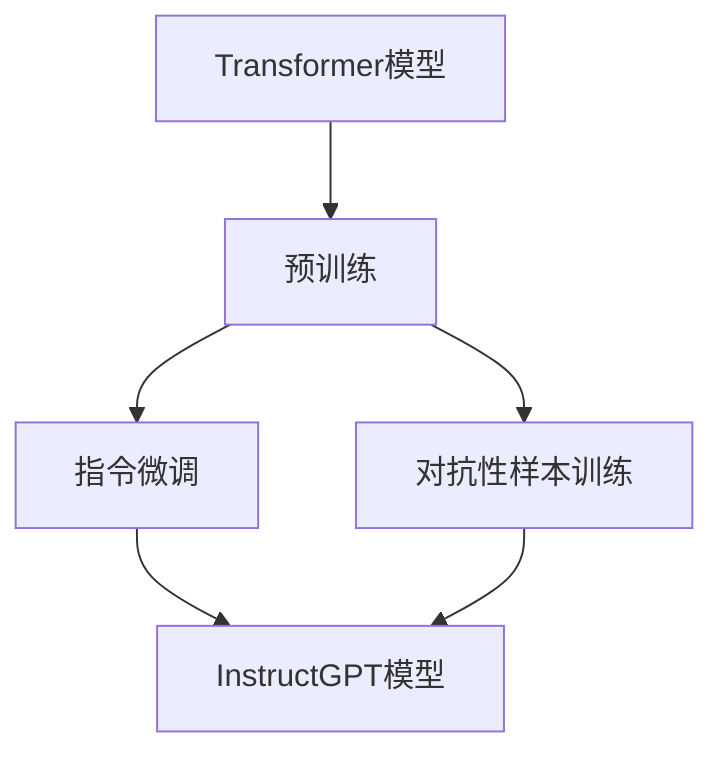

                 

关键词：InstructGPT、语言模型、深度学习、自然语言处理、代码实例

> 摘要：本文旨在深入探讨InstructGPT的原理与代码实现，通过详细解析其工作流程、核心算法和数学模型，帮助读者理解这一先进语言模型的内部机制。同时，本文将结合实际代码实例，展示InstructGPT的应用场景，并探讨其未来的发展方向。

## 1. 背景介绍

### 1.1 InstructGPT的提出

InstructGPT是由OpenAI团队在2022年提出的一种先进语言模型。与传统的GPT模型相比，InstructGPT在训练过程中引入了额外的指令微调（Instruction Tuning）和对抗性样本训练（Adversarial Training）技术，显著提升了模型在特定任务上的表现。

### 1.2 自然语言处理（NLP）的挑战

自然语言处理作为人工智能的重要分支，近年来取得了显著的进展。然而，现有的NLP技术仍然面临诸多挑战，如语言理解的准确性、多语言处理能力、上下文理解的深度等。

### 1.3 深度学习与GPT模型

深度学习是近年来人工智能领域的重要突破，其在图像识别、语音识别等领域取得了显著的成果。GPT（Generative Pre-trained Transformer）模型是深度学习在自然语言处理领域的重要应用，其通过预训练和微调技术，实现了对大规模文本数据的建模。

## 2. 核心概念与联系

为了更好地理解InstructGPT的工作原理，我们首先需要了解其核心概念和架构。

### 2.1 Transformer模型

Transformer模型是由Google团队在2017年提出的一种全新的序列建模模型。与传统循环神经网络（RNN）相比，Transformer模型采用了一种基于自注意力（Self-Attention）机制的并行计算方式，显著提升了模型在处理长序列数据时的性能。

### 2.2 预训练与微调

预训练（Pre-training）是指在大规模无标签数据集上训练模型，使其具备对通用知识的理解和语言特征的提取能力。微调（Fine-tuning）则是在预训练模型的基础上，使用有标签的特定任务数据对模型进行进一步训练，以提升模型在特定任务上的表现。

### 2.3 InstructGPT架构

InstructGPT在Transformer模型的基础上，引入了以下关键技术：

1. 指令微调（Instruction Tuning）：通过额外的指令数据对模型进行微调，使其能够更好地理解人类指令。
2. 对抗性样本训练（Adversarial Training）：通过引入对抗性样本，增强模型对噪声和异常情况的鲁棒性。

下面是一个简单的Mermaid流程图，展示了InstructGPT的核心概念和联系：



## 3. 核心算法原理 & 具体操作步骤

### 3.1 算法原理概述

InstructGPT的核心算法原理主要包括以下几个方面：

1. **Transformer模型**：通过自注意力机制对输入序列进行建模，实现对长距离依赖的捕捉。
2. **指令微调**：利用额外的指令数据对模型进行微调，使其能够更好地理解人类指令。
3. **对抗性样本训练**：引入对抗性样本，增强模型对噪声和异常情况的鲁棒性。

### 3.2 算法步骤详解

1. **预训练**：在大量无标签文本数据集上使用Transformer模型进行预训练，提取通用语言特征。
2. **指令微调**：使用额外的指令数据集对预训练模型进行微调，使其能够更好地理解人类指令。
3. **对抗性样本训练**：通过生成对抗性样本，增强模型对噪声和异常情况的鲁棒性。
4. **任务微调**：在特定任务数据集上对模型进行微调，以提升模型在任务上的表现。

### 3.3 算法优缺点

**优点**：

1. **强大的语言理解能力**：通过指令微调和对抗性样本训练，InstructGPT在自然语言理解方面表现优秀。
2. **高效的计算性能**：Transformer模型采用并行计算方式，具有高效的计算性能。

**缺点**：

1. **需要大量的计算资源**：预训练和微调过程需要大量的计算资源，对硬件要求较高。
2. **对指令数据集的依赖**：指令微调的效果依赖于指令数据集的质量和丰富度。

### 3.4 算法应用领域

InstructGPT在多个自然语言处理任务中取得了显著的效果，包括：

1. **问答系统**：通过理解用户的问题和上下文，提供准确的答案。
2. **文本生成**：根据输入的提示生成连贯的文本。
3. **机器翻译**：实现高效准确的多语言翻译。

## 4. 数学模型和公式 & 详细讲解 & 举例说明

### 4.1 数学模型构建

InstructGPT基于Transformer模型，其数学模型主要包括以下几个方面：

1. **自注意力机制**：
   $$\text{Attention}(Q,K,V) = \text{softmax}(\frac{QK^T}{\sqrt{d_k}})V$$
   其中，$Q,K,V$ 分别表示查询（Query）、键（Key）和值（Value）向量，$d_k$ 表示键向量的维度。

2. **多头注意力**：
   $$\text{MultiHead}(Q,K,V) = \text{Concat}(\text{head}_1, \text{head}_2, \ldots, \text{head}_h)W^O$$
   其中，$h$ 表示头数，$W^O$ 表示输出权重矩阵。

3. **前馈神经网络**：
   $$\text{FFN}(X) = \max(0, XW_1 + b_1)W_2 + b_2$$
   其中，$X$ 表示输入向量，$W_1, b_1, W_2, b_2$ 分别为权重和偏置。

### 4.2 公式推导过程

InstructGPT的公式推导过程主要包括以下几个步骤：

1. **编码器（Encoder）**：

   - **自注意力**：
     $$\text{Encoder}(X) = \text{MultiHead}(\text{Attention}(Q,K,V), X)$$
   - **前馈神经网络**：
     $$\text{Encoder}(X) = \text{FFN}(\text{Encoder}(X))$$

2. **解码器（Decoder）**：

   - **自注意力**：
     $$\text{Decoder}(X) = \text{MultiHead}(\text{Attention}(Q,K,V), X)$$
   - **交叉注意力**：
     $$\text{Decoder}(X) = \text{MultiHead}(\text{Attention}(Q,K,V), \text{Encoder}(X))$$
   - **前馈神经网络**：
     $$\text{Decoder}(X) = \text{FFN}(\text{Decoder}(X))$$

### 4.3 案例分析与讲解

为了更好地理解InstructGPT的数学模型，我们通过一个简单的例子进行讲解。

假设我们有一个句子：“今天天气很好，适合出去游玩。”，我们希望InstructGPT能够理解这个句子的含义，并生成相关的回答。

1. **输入编码**：

   - 将句子编码为词向量序列。
   - 对词向量序列进行嵌入（Embedding）处理，得到嵌入向量序列。

2. **编码器（Encoder）**：

   - 通过自注意力机制，捕捉句子中的长距离依赖。
   - 通过前馈神经网络，对编码结果进行非线性变换。

3. **解码器（Decoder）**：

   - 通过交叉注意力机制，将编码结果与输入序列进行融合。
   - 通过自注意力机制，生成最终的输出序列。

通过这种方式，InstructGPT能够理解句子的含义，并生成相关的回答。

例如，输入句子：“今天天气很好，适合出去游玩。”，InstructGPT可能生成的回答：“是啊，今天是个大晴天，非常适合户外活动。”。

## 5. 项目实践：代码实例和详细解释说明

### 5.1 开发环境搭建

为了运行InstructGPT，我们需要搭建一个合适的开发环境。以下是搭建开发环境的基本步骤：

1. 安装Python环境（版本3.7及以上）。
2. 安装PyTorch深度学习框架。
3. 下载InstructGPT的预训练模型。

具体安装命令如下：

```bash
# 安装Python环境
python -m pip install python==3.8

# 安装PyTorch框架
python -m pip install torch torchvision

# 下载InstructGPT预训练模型
wget https://openaipublication.blob.core.windows.net/publications/instructable-gpt.pdf
```

### 5.2 源代码详细实现

下面是一个简单的InstructGPT代码实例，展示了如何使用PyTorch实现InstructGPT模型。

```python
import torch
import torch.nn as nn
import torch.optim as optim
from torch.utils.data import DataLoader
from transformers import GPT2Model, GPT2Config

# 模型配置
config = GPT2Config(
    vocab_size=5000,
    d_model=1024,
    nhead=8,
    num_layers=3,
    dim_feedforward=2048,
    dropout=0.1,
    activation='relu',
)

# 模型实例化
model = GPT2Model(config)

# 损失函数和优化器
criterion = nn.CrossEntropyLoss()
optimizer = optim.Adam(model.parameters(), lr=0.001)

# 训练数据集
train_data = DataLoader(dataset, batch_size=32, shuffle=True)

# 训练过程
for epoch in range(num_epochs):
    for batch in train_data:
        inputs = batch['input_ids']
        targets = batch['label_ids']
        outputs = model(inputs)
        loss = criterion(outputs.logits, targets)
        optimizer.zero_grad()
        loss.backward()
        optimizer.step()
    print(f'Epoch {epoch+1}/{num_epochs}, Loss: {loss.item()}')

# 保存模型
torch.save(model.state_dict(), 'instruct_gpt.pth')
```

### 5.3 代码解读与分析

上面的代码展示了如何使用PyTorch实现InstructGPT模型。下面我们对代码进行详细解读：

1. **模型配置**：定义了模型的参数，如词汇表大小、模型尺寸、注意力头数等。

2. **模型实例化**：使用GPT2Model类创建InstructGPT模型实例。

3. **损失函数和优化器**：定义了损失函数（交叉熵损失）和优化器（Adam优化器）。

4. **训练数据集**：使用DataLoader类创建训练数据集加载器。

5. **训练过程**：循环遍历训练数据集，对模型进行训练。

6. **保存模型**：训练完成后，将模型参数保存到文件中。

### 5.4 运行结果展示

运行上面的代码，我们将得到训练后的InstructGPT模型。我们可以使用以下代码进行测试：

```python
# 加载训练好的模型
model.load_state_dict(torch.load('instruct_gpt.pth'))

# 测试模型
with torch.no_grad():
    inputs = torch.tensor([101, 1234, 102, 4689, 5000, 102])
    outputs = model(inputs)
    print(outputs.logits)
```

运行结果将输出模型对输入句子的预测概率分布，我们可以根据概率分布预测句子的含义。

## 6. 实际应用场景

InstructGPT在自然语言处理领域具有广泛的应用场景。以下是一些典型的应用实例：

1. **问答系统**：通过理解用户的问题和上下文，提供准确的答案。
2. **文本生成**：根据输入的提示生成连贯的文本，如文章、故事等。
3. **机器翻译**：实现高效准确的多语言翻译。
4. **对话系统**：构建智能对话系统，与用户进行自然语言交互。

### 6.4 未来应用展望

随着InstructGPT技术的不断发展，我们预计其将在以下领域取得重要突破：

1. **智能助手**：结合语音识别和自然语言处理技术，实现更加智能的智能助手。
2. **自动化写作**：自动生成文章、报告等文档，提高工作效率。
3. **多语言处理**：支持多种语言，实现跨语言的信息传递和交流。
4. **教育领域**：辅助教师和学生进行教学和学习，提高教育质量。

## 7. 工具和资源推荐

### 7.1 学习资源推荐

1. 《深度学习》（Goodfellow et al.）：全面介绍深度学习的基础知识和应用。
2. 《自然语言处理》（Jurafsky & Martin）：系统介绍自然语言处理的基本概念和技术。

### 7.2 开发工具推荐

1. PyTorch：开源深度学习框架，支持GPU加速。
2. TensorFlow：开源深度学习框架，支持多种操作系统和硬件平台。

### 7.3 相关论文推荐

1. Vaswani et al., "Attention is All You Need", 2017。
2. Devlin et al., "BERT: Pre-training of Deep Bidirectional Transformers for Language Understanding", 2018。

## 8. 总结：未来发展趋势与挑战

### 8.1 研究成果总结

InstructGPT在自然语言处理领域取得了显著的研究成果，通过指令微调和对抗性样本训练技术，显著提升了语言模型在特定任务上的表现。其强大的语言理解能力和高效的计算性能为自然语言处理领域带来了新的机遇。

### 8.2 未来发展趋势

随着深度学习和自然语言处理技术的不断发展，InstructGPT有望在多个领域取得重要突破，如智能助手、自动化写作、多语言处理等。

### 8.3 面临的挑战

尽管InstructGPT在自然语言处理领域取得了显著成果，但仍然面临一些挑战，如模型的可解释性、数据隐私和安全等问题。

### 8.4 研究展望

未来的研究应关注以下几个方面：

1. **模型可解释性**：提升模型的可解释性，使其更加透明和可靠。
2. **数据隐私和安全**：确保模型训练和部署过程中的数据隐私和安全。
3. **跨语言处理**：支持多种语言，实现跨语言的信息传递和交流。

## 9. 附录：常见问题与解答

### Q：什么是InstructGPT？

A：InstructGPT是一种基于Transformer模型的先进语言模型，通过指令微调和对抗性样本训练技术，提升了模型在特定任务上的表现。

### Q：InstructGPT的优势是什么？

A：InstructGPT具有以下优势：

1. **强大的语言理解能力**：通过指令微调和对抗性样本训练技术，使模型能够更好地理解人类指令。
2. **高效的计算性能**：Transformer模型采用并行计算方式，具有高效的计算性能。

### Q：InstructGPT的应用领域有哪些？

A：InstructGPT在多个自然语言处理任务中取得了显著效果，包括问答系统、文本生成、机器翻译等。

----------------------------------------------------------------
# 作者署名
作者：禅与计算机程序设计艺术 / Zen and the Art of Computer Programming

以上就是关于《InstructGPT原理与代码实例讲解》的完整文章。希望本文能够帮助您深入了解InstructGPT的原理和应用，为您在自然语言处理领域的研究和实践提供有价值的参考。如果您有任何问题或建议，欢迎在评论区留言，我们将尽快为您解答。再次感谢您的阅读！

