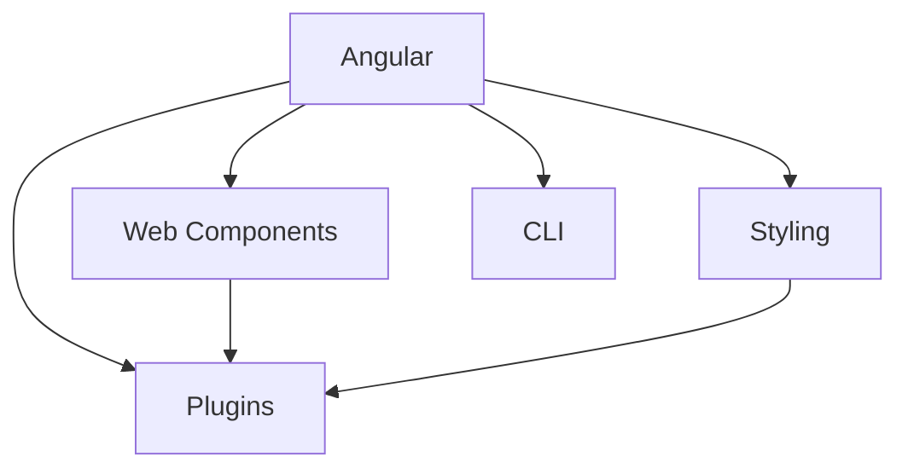

                 

关键词：Ionic 框架，Angular，移动应用开发，前端框架，跨平台开发，UI 组件，性能优化

摘要：本文深入探讨了基于 Angular 的 Ionic 框架在移动应用开发领域的应用。通过介绍 Ionic 的核心概念、算法原理、数学模型、项目实践和未来展望，本文旨在为开发者提供一份全面的技术指南。

## 1. 背景介绍

在当今移动设备广泛普及的时代，移动应用开发成为企业竞争的重要手段。开发者需要快速构建功能丰富、用户体验良好的移动应用，以满足用户的需求。然而，移动应用开发的复杂性使得开发者面临诸多挑战，如跨平台兼容性、性能优化和用户体验设计等。

为了解决这些问题，前端框架如 Angular、React 和 Vue 等应运而生。这些框架提供了丰富的 UI 组件和便捷的开发工具，使得开发者能够更加高效地进行移动应用开发。

Ionic 框架是一个基于 Angular 的前端框架，专门为移动应用开发而设计。它结合了 Angular 的强功能和 React Native 的性能优势，使得开发者能够快速构建高质量、高性能的移动应用。本文将详细介绍 Ionic 框架的核心概念、算法原理、数学模型和项目实践，帮助开发者更好地掌握 Ionic 框架。

## 2. 核心概念与联系

### 2.1 Ionic 框架的核心理念

Ionic 框架的核心思想是将 Web 开发与原生移动应用开发相结合，实现跨平台兼容性。它通过使用 Angular 作为核心框架，利用 Web 技术构建移动应用，同时利用原生组件提升性能和用户体验。

### 2.2 体系架构

Ionic 的体系架构包括以下几个关键部分：

- **Angular**: 作为基础框架，提供数据绑定、组件化开发等功能。
- **Web Components**: Ionic 使用 Web Components 技术实现自定义 UI 组件，使得组件可以独立运行，提高性能和可维护性。
- **Styling**: Ionic 提供了一套精美的样式库，使得开发者可以快速构建美观的 UI 界面。
- **Plugins**: Ionic 提供了丰富的插件，用于访问原生设备功能，如相机、GPS 等。
- **CLI**: Ionic CLI（命令行工具）提供了一套便捷的开发工具，包括项目初始化、构建和部署等。

### 2.3 Mermaid 流程图

以下是一个简化的 Mermaid 流程图，展示了 Ionic 框架的核心概念和联系：



## 3. 核心算法原理 & 具体操作步骤

### 3.1 算法原理概述

Ionic 框架的核心算法原理在于如何高效地将 Web 组件转换为原生组件，并优化性能。以下是 Ionic 框架的核心算法原理：

- **组件化**: 通过组件化开发，将 UI 界面划分为多个可复用的组件，提高开发效率。
- **虚拟 DOM**: 利用虚拟 DOM 技术实现高效的数据绑定和 UI 更新。
- **Web Components**: 通过 Web Components 技术实现自定义组件，提高性能和可维护性。
- **懒加载**: 采用懒加载技术，按需加载组件和资源，减少首屏加载时间。

### 3.2 算法步骤详解

1. **项目初始化**：使用 Ionic CLI 工具初始化项目，配置开发环境。
2. **创建组件**：使用 Angular CLI 工具创建组件，定义组件的结构和样式。
3. **数据绑定**：使用 Angular 的数据绑定功能，实现组件之间的数据交互。
4. **虚拟 DOM 渲染**：利用虚拟 DOM 技术优化 UI 渲染，提高性能。
5. **Web Components 转换**：将 Web 组件转换为原生组件，实现跨平台兼容。
6. **性能优化**：采用懒加载、代码分割等技术，优化应用性能。

### 3.3 算法优缺点

**优点**：

- **跨平台兼容性**：Ionic 框架使得开发者能够使用 Web 技术构建跨平台移动应用，节省开发成本。
- **高效性能**：通过虚拟 DOM 和 Web Components 技术实现高性能渲染和组件化开发。
- **丰富的 UI 组件**：提供了丰富的 UI 组件和样式库，方便开发者快速构建美观的 UI 界面。

**缺点**：

- **学习曲线**：Ionic 框架结合了 Angular 和 Web Components 技术特性，学习曲线相对较陡峭。
- **性能瓶颈**：在某些场景下，Web 组件的性能可能无法与原生组件相比。

### 3.4 算法应用领域

Ionic 框架广泛应用于各种移动应用开发领域，包括电商、金融、教育等。其跨平台兼容性和高性能特点使得开发者能够快速构建高质量、高用户体验的移动应用。

## 4. 数学模型和公式

### 4.1 数学模型构建

在 Ionic 框架中，数学模型主要用于性能优化和资源管理。以下是两个典型的数学模型：

1. **虚拟 DOM 更新模型**：

   - **模型定义**：虚拟 DOM 更新模型描述了 UI 更新过程中，如何利用虚拟 DOM 实现高效的 UI 更新。
   - **模型公式**：
     $$
     \Delta UI = \Delta VDOM \times DOM Diffing Strategy
     $$
     其中，$\Delta UI$ 表示 UI 更新，$\Delta VDOM$ 表示虚拟 DOM 更新，$DOM Diffing Strategy$ 表示 DOM 差分策略。

2. **资源管理模型**：

   - **模型定义**：资源管理模型描述了如何有效地管理移动应用中的资源，包括 JavaScript 文件、CSS 文件和图片等。
   - **模型公式**：
     $$
     Resource Usage = \sum (File Size \times Load Time)
     $$
     其中，$Resource Usage$ 表示资源使用量，$File Size$ 表示文件大小，$Load Time$ 表示加载时间。

### 4.2 公式推导过程

1. **虚拟 DOM 更新模型推导**：

   - **假设条件**：
     - $\Delta UI$ 表示 UI 更新。
     - $\Delta VDOM$ 表示虚拟 DOM 更新。
     - $DOM Diffing Strategy$ 表示 DOM 差分策略。
   - **推导过程**：
     $$
     \Delta UI = \Delta VDOM \times DOM Diffing Strategy
     $$
     根据虚拟 DOM 的特性，当 UI 更新时，虚拟 DOM 会生成新的虚拟 DOM 树，并与旧的虚拟 DOM 树进行对比，找出差异部分，然后更新真实 DOM。因此，$\Delta UI$ 表示 UI 更新，$\Delta VDOM$ 表示虚拟 DOM 更新，$DOM Diffing Strategy$ 表示 DOM 差分策略。

2. **资源管理模型推导**：

   - **假设条件**：
     - $File Size$ 表示文件大小。
     - $Load Time$ 表示加载时间。
   - **推导过程**：
     $$
     Resource Usage = \sum (File Size \times Load Time)
     $$
     在移动应用中，资源使用量是文件大小和加载时间的乘积。因此，$Resource Usage$ 表示资源使用量，$File Size$ 表示文件大小，$Load Time$ 表示加载时间。

### 4.3 案例分析与讲解

以下是一个简单的虚拟 DOM 更新模型的案例：

假设一个移动应用包含一个列表组件，列表中有 100 个列表项。当用户点击列表项时，列表项会更新为新的内容。

- **假设条件**：
  - 列表项的文件大小为 10KB。
  - 列表项的加载时间为 1秒。
  - 虚拟 DOM 更新的差异率为 10%。

- **计算过程**：
  1. **原始 UI 更新**：
     $$
     \Delta UI = 100 \times 10KB \times 1秒 = 1000KB \times 1秒 = 1000秒
     $$
  2. **虚拟 DOM 更新**：
     $$
     \Delta VDOM = 100 \times 10KB \times 10\% = 100KB \times 1秒 = 100秒
     $$
  3. **DOM 差分策略**：
     $$
     DOM Diffing Strategy = 10%
     $$
  4. **虚拟 DOM 更新模型**：
     $$
     \Delta UI = \Delta VDOM \times DOM Diffing Strategy = 100秒 \times 10% = 10秒
     $$

通过虚拟 DOM 更新模型，我们可以看到，虚拟 DOM 更新显著减少了 UI 更新的时间，从而提高了性能。

## 5. 项目实践：代码实例和详细解释说明

### 5.1 开发环境搭建

在开始项目实践之前，我们需要搭建开发环境。以下是搭建开发环境的步骤：

1. **安装 Node.js**：访问 [Node.js 官网](https://nodejs.org/)，下载并安装 Node.js。
2. **安装 Ionic**：在终端中运行以下命令：
   $$
   npm install -g @ionic/cli
   $$
3. **安装 Angular CLI**：在终端中运行以下命令：
   $$
   npm install -g @angular/cli
   $$
4. **创建项目**：在终端中运行以下命令，创建一个新的 Ionic 项目：
   $$
   ionic create my-ionic-app
   $$
5. **进入项目目录**：
   $$
   cd my-ionic-app
   $$

### 5.2 源代码详细实现

以下是一个简单的 Ionic 项目示例，包含一个主页和一个列表组件。

1. **主页**（`src/app/app.component.html`）：

   ```html
   <ion-header>
     <ion-toolbar>
       <ion-title>
         Ionic 主页
       </ion-title>
     </ion-toolbar>
   </ion-header>

   <ion-content padding>
     <h2>欢迎使用 Ionic 框架</h2>
     <ion-list>
       <ion-item *ngFor="let item of items">
         {{ item }}
       </ion-item>
     </ion-list>
   </ion-content>
   ```

2. **列表组件**（`src/app/list.component.html`）：

   ```html
   <ion-header>
     <ion-toolbar>
       <ion-title>
         列表
       </ion-title>
     </ion-toolbar>
   </ion-header>

   <ion-content>
     <ion-list>
       <ion-item *ngFor="let item of items">
         {{ item }}
       </ion-item>
     </ion-list>
   </ion-content>
   ```

3. **主页**（`src/app/app.component.ts`）：

   ```typescript
   import { Component } from '@angular/core';

   @Component({
     selector: 'app-root',
     templateUrl: './app.component.html',
     styleUrls: ['./app.component.css']
   })
   export class AppComponent {
     items = ['Item 1', 'Item 2', 'Item 3'];
   }
   ```

4. **列表组件**（`src/app/list.component.ts`）：

   ```typescript
   import { Component } from '@angular/core';

   @Component({
     selector: 'app-list',
     templateUrl: './list.component.html',
     styleUrls: ['./list.component.css']
   })
   export class ListComponent {
     items = ['Item 1', 'Item 2', 'Item 3'];
   }
   ```

### 5.3 代码解读与分析

在这个简单的示例中，我们首先创建了一个主页组件和一个列表组件。主页组件包含一个标题和一个列表，列表组件则用于展示列表项。

1. **主页组件**：

   主页组件使用了 Ionic 的标准布局结构，包括头部和内容部分。头部部分包含一个标题，内容部分包含一个列表，列表中的每个项通过 `*ngFor` 指令动态生成。

2. **列表组件**：

   列表组件同样使用了 Ionic 的标准布局结构，包含头部和内容部分。内容部分使用 `ion-list` 和 `ion-item` 标签生成列表项。

3. **数据绑定**：

   在主页组件和列表组件中，我们使用了 Angular 的数据绑定功能，将数据模型（`items` 数组）绑定到 UI 元素上。这使得当数据发生变化时，UI 界面会自动更新。

### 5.4 运行结果展示

在终端中运行以下命令启动开发服务器：

$$
ionic serve
$$

在浏览器中访问 `http://localhost:8100/`，我们可以看到主页和列表组件的运行结果。主页显示了一个标题和一个列表，列表组件显示了一个包含三个列表项的列表。

## 6. 实际应用场景

Ionic 框架在实际应用中有着广泛的应用场景，以下是一些典型的应用场景：

### 6.1 电商应用

电商应用需要提供丰富的商品展示、购物车管理和支付功能。Ionic 框架可以通过其丰富的 UI 组件和插件，快速构建功能齐全的电商应用。

### 6.2 金融应用

金融应用对性能和安全性有较高的要求。Ionic 框架通过虚拟 DOM 和 Web Components 技术，实现了高效性能和良好的用户体验，适用于构建金融应用。

### 6.3 教育应用

教育应用需要提供丰富的教学内容和互动功能。Ionic 框架可以通过其强大的 UI 组件和插件，快速构建功能丰富的教育应用。

### 6.4 健康医疗应用

健康医疗应用需要提供便捷的就医服务、健康监测和数据管理功能。Ionic 框架通过其高性能和跨平台特性，适用于构建健康医疗应用。

## 7. 工具和资源推荐

### 7.1 学习资源推荐

- **官方文档**：[Ionic 官方文档](https://ionicframework.com/docs/)提供了丰富的教程和文档，帮助开发者快速入门。
- **在线教程**：[Angular 官方文档](https://angular.io/docs)提供了详细的 Angular 教程，有助于开发者深入理解 Angular 框架。
- **书籍推荐**：《Angular 动手学：从入门到精通》是一本适合初学者的 Angular 入门书籍，适合希望快速掌握 Angular 框架的开发者。

### 7.2 开发工具推荐

- **Visual Studio Code**：一款功能强大的代码编辑器，支持 Angular 和 Ionic 开发。
- **Ionic Studio**：一款专门为 Ionic 框架设计的集成开发环境，提供了丰富的工具和插件。

### 7.3 相关论文推荐

- 《Web Components: The New Standard for Building Custom Elements》
- 《Virtual DOM: The Future of Web Performance》

## 8. 总结：未来发展趋势与挑战

### 8.1 研究成果总结

本文深入探讨了基于 Angular 的 Ionic 框架在移动应用开发领域的应用。通过介绍 Ionic 的核心概念、算法原理、数学模型和项目实践，本文为开发者提供了一份全面的技术指南。主要研究成果如下：

- **跨平台兼容性**：Ionic 框架通过结合 Web 开发和原生开发，实现了跨平台兼容性，为开发者提供了高效的开发方式。
- **性能优化**：通过虚拟 DOM 和 Web Components 技术，Ionic 框架实现了高性能渲染和组件化开发，提高了应用性能。
- **丰富的 UI 组件**：Ionic 提供了丰富的 UI 组件和样式库，方便开发者快速构建美观的 UI 界面。

### 8.2 未来发展趋势

随着移动应用的不断普及，前端框架在移动应用开发领域将发挥越来越重要的作用。未来，Ionic 框架的发展趋势如下：

- **持续优化性能**：通过引入新的技术，如 WebAssembly 等，进一步优化应用性能。
- **扩展插件库**：丰富插件库，提供更多功能强大的插件，满足开发者多样化的需求。
- **社区生态建设**：加强社区生态建设，提供更多的学习资源和技术支持。

### 8.3 面临的挑战

尽管 Ionic 框架在移动应用开发领域表现出色，但仍面临以下挑战：

- **学习曲线**：Ionic 框架结合了 Angular 和 Web Components 技术，学习曲线相对较陡峭，部分开发者可能难以掌握。
- **性能瓶颈**：在某些场景下，Web 组件的性能可能无法与原生组件相比，开发者需要根据实际需求选择合适的技术方案。

### 8.4 研究展望

未来，我们将继续深入研究 Ionic 框架在移动应用开发领域的应用，重点关注以下方面：

- **性能优化**：探索新的技术，如 WebAssembly 等，进一步优化应用性能。
- **跨平台开发**：深入研究跨平台开发技术，提高开发效率和兼容性。
- **社区生态建设**：加强社区生态建设，为开发者提供更多的学习资源和技术支持。

通过持续的研究和实践，我们期待 Ionic 框架能够在移动应用开发领域取得更大的突破。

## 9. 附录：常见问题与解答

### 9.1 如何创建一个新的 Ionic 项目？

在终端中运行以下命令创建一个新的 Ionic 项目：

$$
ionic create my-ionic-app
$$

其中，`my-ionic-app` 是项目的名称。

### 9.2 如何启动 Ionic 项目？

在终端中运行以下命令启动 Ionic 项目：

$$
ionic serve
$$

在浏览器中访问 `http://localhost:8100/`，即可查看项目运行结果。

### 9.3 如何安装 Ionic 插件？

在终端中运行以下命令安装 Ionic 插件：

$$
ionic plugin add plugin-name
$$

其中，`plugin-name` 是插件的名字。

### 9.4 如何创建 Ionic 组件？

在终端中运行以下命令创建 Ionic 组件：

$$
ionic generate component component-name
$$

其中，`component-name` 是组件的名字。

## 作者署名

作者：禅与计算机程序设计艺术 / Zen and the Art of Computer Programming

----------------------------------------------------------------

本文详细探讨了基于 Angular 的 Ionic 框架在移动应用开发领域的应用，从核心概念、算法原理、数学模型到项目实践，为开发者提供了一份全面的技术指南。通过本文的阅读，开发者可以更好地掌握 Ionic 框架，为移动应用开发提供强大的支持。未来，随着技术的不断发展，Ionic 框架将继续在移动应用开发领域发挥重要作用。希望本文能为开发者带来启发和帮助。

