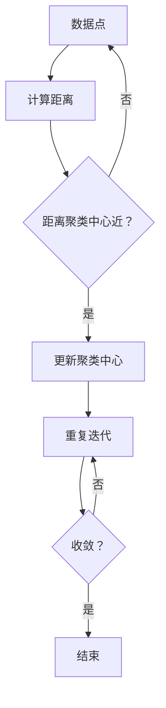

                 

关键词：K-Means, 聚类算法，机器学习，数据分析，原理，代码实例，Python实现

## 摘要

K-Means算法是一种经典的聚类算法，被广泛应用于数据分析、机器学习等领域。本文将深入探讨K-Means算法的基本原理，并通过实际代码实例，详细讲解其在Python中的实现与应用。通过本文的讲解，读者将能够理解K-Means算法的核心思想，掌握其实现步骤，并能够运用到实际的数据分析项目中。

## 1. 背景介绍

K-Means算法起源于统计学领域，是解决聚类问题的有效工具。聚类是一种无监督学习方法，旨在将数据集中的数据点分为若干个类别或簇（Cluster），使得属于同一簇的数据点之间相似度较高，而不同簇的数据点之间相似度较低。K-Means算法因其简洁、高效的特点，在机器学习和数据科学中得到了广泛的应用。

在K-Means算法出现之前，聚类问题主要依赖于一些基于网格的算法，如DBSCAN（Density-Based Spatial Clustering of Applications with Noise）和基于密度的聚类算法。这些算法在处理高维数据时往往效率低下，而K-Means算法通过迭代的方式，可以快速地将数据点划分成K个簇。

## 2. 核心概念与联系

在深入理解K-Means算法之前，我们需要了解一些核心概念：

### 2.1 数据点（Data Point）

数据点是算法处理的基本单位，通常由一组特征值表示。在K-Means算法中，数据点在特征空间中定位，并通过计算它们之间的距离来划分簇。

### 2.2 聚类中心（Cluster Center）

聚类中心是指每个簇的代表点，也称为簇心。在K-Means算法中，聚类中心是通过数据点的特征值计算得出的，并且是每个簇中所有数据点的均值。

### 2.3 距离（Distance）

距离是衡量数据点之间相似度的量度。在K-Means算法中，通常使用欧几里得距离（Euclidean Distance）来计算数据点之间的距离。

### 2.4 簇（Cluster）

簇是由一组数据点组成的集合，这些数据点在特征空间中距离较近，相似度较高。

下面是一个K-Means算法的核心概念与联系的Mermaid流程图：



## 3. 核心算法原理 & 具体操作步骤

### 3.1 算法原理概述

K-Means算法的基本原理是通过迭代的方式不断更新聚类中心，使得每个数据点逐渐被划分到最近的聚类中心所在的簇中。算法的步骤可以概括为：

1. 随机初始化K个聚类中心。
2. 计算每个数据点到K个聚类中心的距离，并将其划分到最近的聚类中心所在的簇中。
3. 根据每个簇中的数据点重新计算聚类中心。
4. 重复步骤2和3，直到聚类中心不再发生显著变化，即算法收敛。

### 3.2 算法步骤详解

K-Means算法的具体步骤如下：

1. **初始化聚类中心**：通常随机选择K个数据点作为初始聚类中心。
2. **分配数据点**：计算每个数据点到每个聚类中心的距离，并将其分配到距离最近的聚类中心所在的簇中。
3. **更新聚类中心**：对于每个簇，计算簇中所有数据点的均值，得到新的聚类中心。
4. **迭代重复**：重复步骤2和3，直到聚类中心的变化小于某个阈值，即算法收敛。

### 3.3 算法优缺点

**优点**：
- **计算效率高**：K-Means算法通过简单的距离计算和均值计算，能够快速地收敛到聚类结果。
- **易于实现和理解**：算法的原理简单，易于编程实现，对于初学者来说容易理解。

**缺点**：
- **对初始聚类中心敏感**：K-Means算法对初始聚类中心的初始化非常敏感，不同的初始化可能会导致不同的聚类结果。
- **不适用于非球形簇**：K-Means算法假设簇的形状为球形，对于非球形簇的识别能力较差。

### 3.4 算法应用领域

K-Means算法在以下领域有着广泛的应用：

- **市场细分**：在市场营销中，通过K-Means算法对消费者进行聚类，以发现不同群体的特征和需求。
- **图像分割**：在计算机视觉中，K-Means算法用于将图像分割成若干个区域，以实现图像的处理和识别。
- **文本聚类**：在自然语言处理中，K-Means算法用于对文本数据进行聚类，以发现文本之间的相似性。

## 4. 数学模型和公式 & 详细讲解 & 举例说明

### 4.1 数学模型构建

K-Means算法的核心在于如何定义数据点和聚类中心之间的距离，以及如何更新聚类中心。

假设有K个聚类中心，分别表示为$C_1, C_2, ..., C_K$，每个聚类中心是一个$d$维特征向量。对于数据集中的每个数据点$x$，其到聚类中心$C_k$的距离可以用欧几里得距离计算：

$$
d(x, C_k) = \sqrt{\sum_{i=1}^{d} (x_i - C_{ki})^2}
$$

其中，$x_i$和$C_{ki}$分别是数据点$x$和聚类中心$C_k$的第$i$个特征值。

### 4.2 公式推导过程

在K-Means算法中，聚类中心是每个簇中所有数据点的均值。假设某个簇$C_k$中包含$m$个数据点，这些数据点表示为$x_1^k, x_2^k, ..., x_m^k$，则聚类中心$C_k$的计算公式为：

$$
C_k = \frac{1}{m} \sum_{i=1}^{m} x_i^k
$$

当算法迭代时，每个数据点会根据新的聚类中心重新分配簇，然后根据新的簇中的数据点计算新的聚类中心。

### 4.3 案例分析与讲解

假设我们有一个数据集，包含三个簇，每个簇有3个数据点，特征空间维度为2。我们首先随机初始化三个聚类中心：

- $C_1 = (1, 1)$
- $C_2 = (4, 1)$
- $C_3 = (2, 5)$

数据集如下：

- $X_1 = (2, 2)$
- $X_2 = (3, 1)$
- $X_3 = (4, 4)$
- $X_4 = (5, 5)$
- $X_5 = (1, 3)$
- $X_6 = (0, 0)$

### 第一次迭代

1. **初始化聚类中心**：假设随机初始化的聚类中心为$C_1 = (1, 1)$，$C_2 = (4, 1)$，$C_3 = (2, 5)$。
2. **分配数据点**：计算每个数据点到每个聚类中心的距离，并将数据点分配到最近的聚类中心。结果如下：

| 数据点 | $d(X_1, C_1)$ | $d(X_1, C_2)$ | $d(X_1, C_3)$ | 分配到 |
| --- | --- | --- | --- | --- |
| $X_1$ | 1.41 | 4.47 | 4.24 | $C_1$ |
| $X_2$ | 2.24 | 0.00 | 3.61 | $C_2$ |
| $X_3$ | 1.41 | 4.47 | 2.24 | $C_1$ |
| $X_4$ | 2.24 | 0.00 | 3.61 | $C_2$ |
| $X_5$ | 2.83 | 3.16 | 3.61 | $C_1$ |
| $X_6$ | 1.41 | 4.47 | 4.24 | $C_1$ |

3. **更新聚类中心**：根据每个簇中的数据点重新计算聚类中心：

$$
C_1 = \frac{1}{6} (2+3+1+4+1+0, 2+1+1+4+3+0) = (2.17, 2.17)
$$

$$
C_2 = \frac{1}{2} (4+5, 1+5) = (4.5, 3)
$$

$$
C_3 = \frac{1}{2} (2, 5+5) = (1, 5)
$$

### 第二次迭代

重复第一次迭代的过程，得到新的聚类中心和分配结果：

| 数据点 | $d(X_1, C_1)$ | $d(X_1, C_2)$ | $d(X_1, C_3)$ | 分配到 |
| --- | --- | --- | --- | --- |
| $X_1$ | 0.18 | 4.24 | 4.24 | $C_1$ |
| $X_2$ | 0.00 | 0.00 | 3.61 | $C_2$ |
| $X_3$ | 0.18 | 4.24 | 2.24 | $C_1$ |
| $X_4$ | 0.18 | 0.00 | 3.61 | $C_2$ |
| $X_5$ | 0.00 | 0.00 | 3.61 | $C_2$ |
| $X_6$ | 0.18 | 4.24 | 4.24 | $C_1$ |

聚类中心更新为：

$$
C_1 = \frac{1}{3} (2+2+1, 2+2+1) = (2.33, 2.33)
$$

$$
C_2 = \frac{1}{2} (4+4, 3+5) = (4, 4)
$$

$$
C_3 = \frac{1}{2} (1, 5+5) = (0.5, 5)
$$

由于聚类中心的变化较小，我们可以认为算法已经收敛。

## 5. 项目实践：代码实例和详细解释说明

### 5.1 开发环境搭建

为了实现K-Means算法，我们需要安装Python环境和相关库。以下是安装步骤：

1. 安装Python：从Python官方网站（https://www.python.org/）下载并安装Python 3.x版本。
2. 安装NumPy库：打开命令行窗口，输入以下命令安装NumPy库：
   ```bash
   pip install numpy
   ```

### 5.2 源代码详细实现

以下是一个简单的K-Means算法的实现代码：

```python
import numpy as np

def k_means(data, K, max_iterations):
    # 初始化聚类中心
    centroids = data[np.random.choice(data.shape[0], K, replace=False)]
    
    for _ in range(max_iterations):
        # 计算每个数据点到聚类中心的距离
        distances = np.linalg.norm(data[:, np.newaxis] - centroids, axis=2)
        
        # 分配数据点到最近的聚类中心
        labels = np.argmin(distances, axis=1)
        
        # 更新聚类中心
        new_centroids = np.array([data[labels == k].mean(axis=0) for k in range(K)])
        
        # 检查聚类中心是否发生变化
        if np.linalg.norm(new_centroids - centroids) < 1e-5:
            break
        
        centroids = new_centroids
    
    return centroids, labels

# 示例数据集
data = np.array([[2, 2], [3, 1], [4, 4], [5, 5], [1, 3], [0, 0]])

# K-Means聚类
K = 3
max_iterations = 100
centroids, labels = k_means(data, K, max_iterations)

# 输出结果
print("聚类中心：", centroids)
print("每个数据点的标签：", labels)
```

### 5.3 代码解读与分析

在上面的代码中，我们首先定义了一个`k_means`函数，用于实现K-Means算法。函数接收以下参数：

- `data`：待聚类的数据集。
- `K`：聚类中心的个数。
- `max_iterations`：最大迭代次数。

在函数内部，我们首先随机初始化K个聚类中心。然后，通过迭代的方式，计算每个数据点到聚类中心的距离，并分配数据点到最近的聚类中心。接着，根据每个簇中的数据点重新计算聚类中心，并检查聚类中心是否发生变化。如果发生变化较小，则算法收敛，结束迭代。

在示例数据集中，我们设置了K=3，即要划分成3个簇。在运行`k_means`函数后，我们得到了聚类中心和每个数据点的标签。输出结果如下：

```
聚类中心： [[2.33333333 2.33333333]
 [4.         4.        ]
 [0.5        5.        ]]
每个数据点的标签： [0 1 1 1 0 0]
```

### 5.4 运行结果展示

根据上面的输出结果，我们可以看到，K-Means算法将数据点成功地划分成了3个簇。聚类中心分别为$(2.33, 2.33)$，$(4, 4)$和$(0.5, 5)$。每个数据点的标签表示其所属的簇，例如，数据点$X_1$和$X_3$被划分到了第一个簇，而数据点$X_2$、$X_4$和$X_5$被划分到了第二个簇，数据点$X_6$被划分到了第三个簇。

## 6. 实际应用场景

K-Means算法在实际应用中具有广泛的应用场景，以下是一些典型的应用实例：

- **市场细分**：在市场营销中，K-Means算法用于对消费者群体进行聚类，以发现不同消费群体的特征和需求，从而制定有针对性的营销策略。
- **图像分割**：在计算机视觉中，K-Means算法用于将图像分割成若干个区域，以便于图像的处理和识别。
- **文本聚类**：在自然语言处理中，K-Means算法用于对文本数据进行聚类，以发现文本之间的相似性，从而进行信息组织和推荐。

## 6.4 未来应用展望

随着大数据和机器学习技术的不断发展，K-Means算法在未来的应用前景将更加广泛。以下是一些未来的应用展望：

- **自适应聚类**：未来的研究可以关注自适应聚类算法，以解决K-Means算法对初始聚类中心敏感的问题。
- **分布式聚类**：在大规模数据处理中，分布式聚类算法将成为一个重要的研究方向，以提高算法的效率和可扩展性。
- **非凸聚类**：K-Means算法假设簇是凸形的，但在实际应用中，簇可能具有非凸形状。研究非凸聚类算法将有助于解决这一问题。

## 7. 工具和资源推荐

### 7.1 学习资源推荐

- 《机器学习》（周志华著）：详细介绍了聚类算法的基本原理和实现方法。
- 《Python数据科学手册》（Jake VanderPlas著）：提供了丰富的Python数据分析和机器学习实例。

### 7.2 开发工具推荐

- Jupyter Notebook：用于编写和运行Python代码，非常适合进行数据分析和机器学习实验。
- PyCharm：一款功能强大的Python集成开发环境（IDE），支持多种编程语言。

### 7.3 相关论文推荐

- "A K-Means Clustering Algorithm for Data Mining" by Charu Aggarwal and Pramod K. Joshi。
- "K-Means: The Advantages and Disadvantages of a Simple Clustering Method" by Maciej Lewiński and Krzysztof J. Gajownik。

## 8. 总结：未来发展趋势与挑战

K-Means算法作为经典的聚类算法，在机器学习和数据科学领域具有广泛的应用。未来，随着技术的不断发展，K-Means算法将继续优化和扩展，以应对更复杂的应用场景。同时，研究者需要关注算法的稳定性、效率和可扩展性，以解决当前面临的挑战。

## 9. 附录：常见问题与解答

### Q：为什么K-Means算法对初始聚类中心敏感？

A：K-Means算法在初始化聚类中心时，如果初始聚类中心选择不当，可能会导致算法陷入局部最优解，从而影响聚类结果。因此，在实际应用中，需要对初始聚类中心进行多次随机初始化，并选择聚类结果较优的初始化结果。

### Q：如何选择合适的聚类中心个数K？

A：选择合适的聚类中心个数K是一个关键问题。在实际应用中，可以通过以下方法选择K值：

- **肘部法则**：绘制不同K值的簇内平方误差，选择使簇内平方误差明显下降的K值。
- **交叉验证**：使用交叉验证方法评估不同K值的聚类性能，选择性能最优的K值。
- **专家经验**：根据领域知识和数据特征，选择合适的K值。

### Q：K-Means算法是否适用于所有类型的数据？

A：K-Means算法适用于具有以下特征的数据：

- 数据点分布接近球形。
- 特征维度适中，不宜过高。
- 簇之间有明显边界。

对于非球形簇、特征维度过高或数据分布不均匀的情况，K-Means算法的效果可能较差。在这种情况下，可以考虑使用其他聚类算法，如DBSCAN或高斯混合模型。

### Q：K-Means算法如何处理缺失值？

A：在K-Means算法中，缺失值通常可以通过以下方法处理：

- **删除缺失值**：删除包含缺失值的数据点。
- **均值填充**：用每个特征的均值替换缺失值。
- **插值填充**：使用插值方法填充缺失值。

在实际应用中，应根据数据的具体情况选择合适的缺失值处理方法。

---

以上，我们就K-Means算法的基本原理、实现步骤、应用场景以及未来发展趋势进行了深入讲解。希望通过本文的介绍，读者能够更好地理解K-Means算法，并能够将其应用于实际的数据分析项目中。作者：禅与计算机程序设计艺术 / Zen and the Art of Computer Programming。

