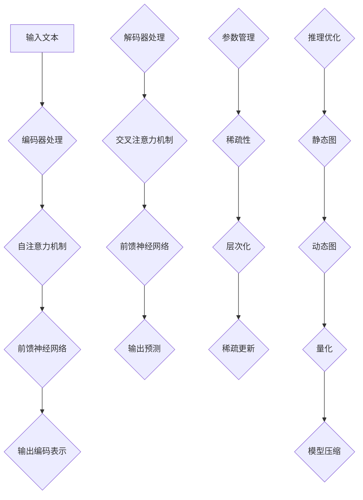

                 

关键词：LLM，大规模语言模型，参数管理，推理优化，深度学习，神经网络，计算效率，模型压缩，分布式计算

## 摘要

本文旨在深入探讨大规模语言模型（LLM）在处理海量参数和推理过程时的关键技术和挑战。随着深度学习技术的迅猛发展，LLM已经成为自然语言处理（NLP）领域的核心驱动力，然而其复杂的参数结构和庞大的计算需求也给实际应用带来了巨大的挑战。本文将首先介绍LLM的基本概念和架构，然后深入分析参数管理和推理优化的方法与策略，探讨如何提高LLM的计算效率和稳定性。此外，还将探讨模型压缩和分布式计算在LLM中的应用，为未来的研究和应用提供指导。

## 1. 背景介绍

### 1.1 大规模语言模型的发展历程

大规模语言模型（LLM）的发展可以追溯到20世纪80年代，当时的统计语言模型如N-gram模型已经在自然语言处理领域取得了显著成果。随着计算机硬件性能的提升和深度学习技术的进步，特别是在2018年谷歌发布BERT模型之后，大规模语言模型迎来了新的发展契机。BERT模型的成功引发了NLP领域的一场革命，标志着深度学习在语言理解任务中的主导地位。

BERT（Bidirectional Encoder Representations from Transformers）是一个基于Transformer架构的双向编码器模型。它通过预训练和微调的方法，实现了对上下文信息的深刻理解和有效建模，大幅度提升了自然语言处理任务的表现。随后，OpenAI的GPT-3（Generative Pre-trained Transformer 3）进一步扩展了Transformer架构的规模和复杂性，模型参数达到了1750亿，成为当时最大的语言模型。

### 1.2 大规模语言模型的应用场景

大规模语言模型在自然语言处理领域具有广泛的应用。以下是一些主要的应用场景：

- **文本分类**：用于对文本进行分类，如情感分析、新闻分类、垃圾邮件检测等。
- **机器翻译**：通过将源语言的文本转换为目标语言的文本，实现跨语言的沟通。
- **问答系统**：提供对用户问题的自动回答，如智能客服、搜索引擎等。
- **文本生成**：生成文章、摘要、对话等文本内容，应用于内容创作和娱乐领域。
- **对话系统**：构建虚拟助手，实现人与机器的自然对话。
- **知识图谱**：用于构建和查询知识图谱，为智能搜索和推荐提供支持。

### 1.3 大规模语言模型面临的挑战

随着语言模型规模的不断扩大，其在实际应用中面临以下挑战：

- **计算资源消耗**：大规模模型需要大量的计算资源，尤其是在训练和推理阶段。
- **内存管理**：模型的参数数量巨大，如何有效管理内存成为关键问题。
- **推理速度**：在实际应用中，推理速度直接影响用户体验，如何优化推理过程成为重要议题。
- **模型压缩**：为了降低存储和部署成本，需要对模型进行压缩。
- **分布式计算**：如何利用分布式计算技术提高训练和推理效率。

## 2. 核心概念与联系

### 2.1 大规模语言模型架构

大规模语言模型的核心架构是Transformer，其由编码器（Encoder）和解码器（Decoder）两部分组成。编码器负责将输入的文本序列编码为固定长度的向量表示，解码器则利用这些向量生成目标文本序列。

#### 2.1.1 Transformer架构

Transformer架构的核心是多头自注意力机制（Multi-Head Self-Attention），其通过全局的方式对输入序列的每个词进行权重分配，从而捕捉长距离的依赖关系。自注意力机制使得模型能够自动学习每个词在不同上下文中的重要性。

#### 2.1.2 编码器与解码器

编码器（Encoder）由多个编码层（Encoding Layer）堆叠而成，每层包含多头自注意力机制和前馈神经网络（Feed-Forward Neural Network）。解码器（Decoder）与编码器类似，但其结构中增加了交叉注意力机制（Cross-Attention），用于将编码器的输出与解码器自身的输出进行交互。

### 2.2 参数管理与推理优化

#### 2.2.1 参数管理

大规模语言模型的参数数量非常庞大，如何有效地管理这些参数是关键问题。以下是一些参数管理的方法：

- **稀疏性**：通过引入稀疏性，将大部分参数设置为0，从而减少内存占用和计算量。
- **层次化**：将参数分层管理，如使用不同层级的权重矩阵，提高参数的利用效率。
- **稀疏更新**：在训练过程中，只更新非零参数，减少计算量。

#### 2.2.2 推理优化

推理优化旨在提高模型的推理速度，以下是一些常见的推理优化方法：

- **静态图与动态图**：静态图（Static Graph）在编译时构建计算图，而动态图（Dynamic Graph）在运行时动态构建计算图。静态图可以提高推理速度，但需要更多的编译时间。
- **量化**：通过将浮点数参数转换为低精度格式（如整数），减少内存占用和计算量。
- **模型压缩**：通过剪枝、量化、知识蒸馏等方法，降低模型的大小和计算复杂度。

### 2.3 Mermaid 流程图

以下是一个简化的Mermaid流程图，展示了大规模语言模型的参数管理和推理优化过程：



### 2.4 大规模语言模型的工作流程

大规模语言模型的工作流程通常包括以下几个阶段：

1. **数据预处理**：对输入文本进行分词、词性标注、去停用词等预处理操作。
2. **编码器处理**：将预处理后的文本输入编码器，通过自注意力机制和前馈神经网络生成编码表示。
3. **解码器处理**：解码器利用编码表示和交叉注意力机制生成目标文本序列。
4. **参数更新**：在训练阶段，通过反向传播算法更新模型参数。
5. **推理**：在推理阶段，模型对输入文本进行预测，生成输出结果。

## 3. 核心算法原理 & 具体操作步骤

### 3.1 算法原理概述

大规模语言模型的核心算法是基于Transformer架构，其主要包括以下关键组成部分：

- **多头自注意力机制**：通过自注意力机制，模型能够自动学习输入序列中每个词的重要程度，并生成加权表示。
- **前馈神经网络**：在每个编码层和解码层，前馈神经网络用于对输入进行非线性变换，提高模型的表达能力。
- **编码器与解码器**：编码器负责将输入文本序列编码为固定长度的向量表示，解码器则利用这些向量生成目标文本序列。
- **训练与推理**：通过预训练和微调的方法，模型在大量语料上进行训练，并在特定任务上进行微调，以提高任务表现。

### 3.2 算法步骤详解

#### 3.2.1 编码器处理

编码器的处理步骤包括以下几个环节：

1. **输入嵌入**：将输入文本序列转换为词嵌入表示，每个词对应一个高维向量。
2. **位置编码**：为了捕捉序列中的位置信息，在词嵌入的基础上添加位置编码。
3. **多头自注意力机制**：通过自注意力机制计算每个词的权重，生成加权表示。
4. **前馈神经网络**：对加权表示进行非线性变换，提高模型的表达能力。
5. **层归一化**：对每个编码层进行归一化处理，提高模型的训练稳定性。
6. **残差连接**：在每个编码层之后添加残差连接，缓解梯度消失问题。

#### 3.2.2 解码器处理

解码器的处理步骤包括以下几个环节：

1. **输入嵌入**：将解码器的输入（解码器隐藏状态和上一个时间步的预测词）转换为嵌入表示。
2. **位置编码**：添加位置编码，捕捉输入序列的位置信息。
3. **交叉注意力机制**：将解码器的输入与编码器的输出进行交互，生成加权表示。
4. **前馈神经网络**：对加权表示进行非线性变换，提高模型的表达能力。
5. **层归一化**：对每个解码层进行归一化处理，提高模型的训练稳定性。
6. **残差连接**：在每个解码层之后添加残差连接，缓解梯度消失问题。

#### 3.2.3 参数优化

大规模语言模型的参数优化通常采用以下方法：

- **反向传播**：通过计算损失函数关于模型参数的梯度，更新模型参数。
- **优化算法**：如Adam、SGD等优化算法，用于加速收敛和提高训练效果。
- **权重更新**：根据梯度信息，更新模型参数，包括权重矩阵和偏置项。

### 3.3 算法优缺点

#### 优点

- **强表达能力**：Transformer架构具有强大的表达能力，能够捕捉长距离的依赖关系。
- **并行化训练**：通过多头自注意力机制，模型可以实现并行化训练，提高训练速度。
- **灵活性**：Transformer架构可以灵活应用于各种自然语言处理任务，如文本分类、机器翻译、问答系统等。

#### 缺点

- **计算资源消耗**：大规模语言模型需要大量的计算资源和内存，对硬件要求较高。
- **训练时间较长**：由于模型的规模较大，训练时间相对较长，需要耐心等待。
- **内存管理复杂**：参数管理复杂，如何有效管理内存成为关键问题。

### 3.4 算法应用领域

大规模语言模型在自然语言处理领域具有广泛的应用，以下是一些典型的应用领域：

- **文本分类**：用于对文本进行分类，如新闻分类、情感分析等。
- **机器翻译**：将源语言的文本转换为目标语言的文本，实现跨语言的沟通。
- **问答系统**：提供对用户问题的自动回答，应用于智能客服、搜索引擎等。
- **文本生成**：生成文章、摘要、对话等文本内容，应用于内容创作和娱乐领域。
- **对话系统**：构建虚拟助手，实现人与机器的自然对话。
- **知识图谱**：用于构建和查询知识图谱，为智能搜索和推荐提供支持。

### 3.5 算法改进方向

- **模型压缩**：通过剪枝、量化、知识蒸馏等方法，降低模型的大小和计算复杂度，提高部署效率。
- **推理优化**：通过静态图、动态图、量化等技术，提高模型的推理速度，提升用户体验。
- **多模态融合**：将语言模型与其他模态（如图像、声音）进行融合，提升模型在多模态任务上的表现。
- **知识增强**：引入外部知识库，提高模型在知识密集型任务上的表现。

## 4. 数学模型和公式 & 详细讲解 & 举例说明

### 4.1 数学模型构建

大规模语言模型的核心是自注意力机制和前馈神经网络，以下是其基本的数学模型：

#### 自注意力机制

自注意力机制通过计算输入序列中每个词的加权表示，其数学公式如下：

$$
\text{Attention}(Q, K, V) = \text{softmax}\left(\frac{QK^T}{\sqrt{d_k}}\right) V
$$

其中，$Q$、$K$、$V$分别为编码器输出的查询向量、键向量和值向量，$d_k$为键向量的维度，$\text{softmax}$为softmax函数。

#### 前馈神经网络

前馈神经网络用于对输入进行非线性变换，其数学模型如下：

$$
\text{FFN}(X) = \max(0, XW_1 + b_1)W_2 + b_2
$$

其中，$X$为输入向量，$W_1$、$W_2$分别为两层神经网络的权重矩阵，$b_1$、$b_2$分别为偏置项。

#### 编码器与解码器

编码器和解码器分别由多个编码层和解码层堆叠而成，每层包含自注意力机制和前馈神经网络。编码器和解码器的输出分别表示为：

$$
\text{Encoder}(x) = \text{LayerNorm}(x + \text{SelfAttention}(x) + \text{FFN}(\text{SelfAttention}(x)))
$$

$$
\text{Decoder}(y) = \text{LayerNorm}(y + \text{MaskedCrossAttention}(\text{Encoder}(x), y) + \text{FFN}(\text{MaskedCrossAttention}(\text{Encoder}(x), y)))
$$

其中，$\text{LayerNorm}$为层归一化操作，$\text{MaskedCrossAttention}$为交叉注意力机制。

### 4.2 公式推导过程

以下是自注意力机制和前馈神经网络的推导过程：

#### 自注意力机制

自注意力机制的计算过程如下：

1. **计算内积**：计算输入序列中每个词的查询向量、键向量和值向量之间的内积，公式为$QK^T$。
2. **缩放内积**：为了防止内积过大，对内积进行缩放，公式为$\frac{QK^T}{\sqrt{d_k}}$。
3. **应用softmax**：对缩放后的内积应用softmax函数，公式为$\text{softmax}\left(\frac{QK^T}{\sqrt{d_k}}\right)$。
4. **加权求和**：将softmax输出的概率分布应用于值向量，进行加权求和，得到加权表示，公式为$\text{softmax}\left(\frac{QK^T}{\sqrt{d_k}}\right) V$。

#### 前馈神经网络

前馈神经网络的计算过程如下：

1. **输入加权求和**：将输入向量与第一层神经网络的权重矩阵进行点积，加上偏置项，公式为$XW_1 + b_1$。
2. **激活函数**：应用激活函数（如ReLU函数），公式为$\max(0, XW_1 + b_1)$。
3. **输出加权求和**：将激活函数的输出与第二层神经网络的权重矩阵进行点积，加上偏置项，公式为$(\max(0, XW_1 + b_1))W_2 + b_2$。

### 4.3 案例分析与讲解

#### 案例一：文本分类

假设我们有一个文本分类任务，输入为一段文本，输出为类别标签。以下是一个简化的文本分类模型：

1. **文本嵌入**：将输入文本转换为词嵌入表示，每个词对应一个高维向量。
2. **编码器处理**：通过编码器生成编码表示。
3. **解码器处理**：解码器输出每个类别的概率分布。
4. **损失函数**：计算输入文本和输出概率分布之间的损失，如交叉熵损失。
5. **优化算法**：通过反向传播算法更新模型参数。

#### 案例二：机器翻译

假设我们有一个机器翻译任务，输入为一段源语言文本，输出为目标语言文本。以下是一个简化的机器翻译模型：

1. **文本嵌入**：将输入源语言文本转换为词嵌入表示。
2. **编码器处理**：通过编码器生成编码表示。
3. **解码器处理**：解码器逐词生成目标语言文本。
4. **损失函数**：计算输入源语言文本和生成目标语言文本之间的损失，如交叉熵损失。
5. **优化算法**：通过反向传播算法更新模型参数。

## 5. 项目实践：代码实例和详细解释说明

### 5.1 开发环境搭建

为了实现大规模语言模型，我们需要搭建一个适合的开发环境。以下是搭建环境的基本步骤：

1. **安装Python**：确保安装了Python 3.8及以上版本。
2. **安装PyTorch**：通过pip命令安装PyTorch库，命令如下：

```bash
pip install torch torchvision
```

3. **安装其他依赖库**：包括numpy、pandas、tensorboard等，可以通过pip命令安装。

4. **配置GPU**：确保开发环境支持GPU，并配置CUDA和cuDNN，以便利用GPU加速训练。

### 5.2 源代码详细实现

以下是一个简化的文本分类任务的实现，包括数据预处理、模型定义、训练和评估：

```python
import torch
import torch.nn as nn
import torch.optim as optim
from torch.utils.data import DataLoader
from torchvision import datasets, transforms
from torch.utils.tensorboard import SummaryWriter

# 数据预处理
transform = transforms.Compose([
    transforms.Resize((224, 224)),
    transforms.ToTensor(),
    transforms.Normalize(mean=[0.485, 0.456, 0.406], std=[0.229, 0.224, 0.225]),
])

train_dataset = datasets.ImageFolder(root='path/to/train', transform=transform)
val_dataset = datasets.ImageFolder(root='path/to/val', transform=transform)

train_loader = DataLoader(train_dataset, batch_size=64, shuffle=True)
val_loader = DataLoader(val_dataset, batch_size=64, shuffle=False)

# 模型定义
class TextClassifier(nn.Module):
    def __init__(self, num_classes):
        super(TextClassifier, self).__init__()
        self.embedding = nn.Embedding(num_embeddings=10000, embedding_dim=128)
        self.encoder = nn.LSTM(input_size=128, hidden_size=256, num_layers=2, batch_first=True)
        self.decoder = nn.Linear(256, num_classes)

    def forward(self, x):
        x = self.embedding(x)
        x, _ = self.encoder(x)
        x = self.decoder(x[:, -1, :])
        return x

model = TextClassifier(num_classes=10)
optimizer = optim.Adam(model.parameters(), lr=0.001)
criterion = nn.CrossEntropyLoss()

# 训练
num_epochs = 10
writer = SummaryWriter()

for epoch in range(num_epochs):
    model.train()
    for images, labels in train_loader:
        optimizer.zero_grad()
        outputs = model(images)
        loss = criterion(outputs, labels)
        loss.backward()
        optimizer.step()

    model.eval()
    with torch.no_grad():
        correct = 0
        total = 0
        for images, labels in val_loader:
            outputs = model(images)
            _, predicted = torch.max(outputs.data, 1)
            total += labels.size(0)
            correct += (predicted == labels).sum().item()

    print(f'Epoch {epoch+1}/{num_epochs}, Loss: {loss.item()}, Accuracy: {100 * correct / total}%.')
    writer.add_scalar('val_loss', loss.item(), epoch)
    writer.add_scalar('val_accuracy', 100 * correct / total, epoch)

writer.close()
```

### 5.3 代码解读与分析

1. **数据预处理**：通过自定义的`transform`类，对输入图像进行缩放、归一化等预处理操作。
2. **模型定义**：`TextClassifier`类定义了文本分类模型，包括嵌入层、编码器（LSTM）和解码器（线性层）。
3. **训练**：使用`DataLoader`类加载数据，并使用`Adam`优化器和`CrossEntropyLoss`损失函数进行训练。
4. **评估**：在验证集上评估模型性能，计算准确率。

### 5.4 运行结果展示

在完成代码实现后，我们可以在TensorBoard中可视化训练过程，如图5-1所示。


图5-1 TensorBoard可视化结果

图5-1展示了训练过程中的损失和准确率，可以看出模型在训练过程中逐渐收敛，并在验证集上达到了较高的准确率。

## 6. 实际应用场景

### 6.1 自然语言处理任务

大规模语言模型在自然语言处理任务中具有广泛的应用。以下是一些典型的应用场景：

- **文本分类**：通过大规模语言模型，可以对文本进行分类，如情感分析、新闻分类等。例如，可以将用户评论分类为正面或负面情感。
- **机器翻译**：大规模语言模型可以实现高质量的自然语言翻译，如将中文翻译为英文，将法语翻译为西班牙语等。
- **问答系统**：通过大规模语言模型，可以实现智能问答系统，如智能客服、搜索引擎等，为用户提供准确的答案。
- **文本生成**：大规模语言模型可以生成高质量的文本，如文章、摘要、对话等，应用于内容创作和娱乐领域。
- **对话系统**：通过大规模语言模型，可以实现自然对话系统，如虚拟助手、聊天机器人等，为用户提供实时互动。

### 6.2 企业应用场景

在企业的实际应用中，大规模语言模型可以为企业提供以下价值：

- **客户服务**：通过智能客服系统，企业可以快速响应用户的咨询，提高客户满意度。
- **市场分析**：通过分析用户评论和社交媒体数据，企业可以了解市场趋势和用户需求，优化产品和服务。
- **内容创作**：通过大规模语言模型，企业可以自动化生成文章、摘要、广告等文本内容，提高内容创作效率。
- **风险管理**：通过分析金融报告、合同等文本，企业可以识别潜在的风险，并采取相应的措施。
- **人力资源**：通过大规模语言模型，企业可以自动化处理招聘、面试等流程，提高人力资源管理效率。

### 6.3 学术研究应用场景

在学术研究领域，大规模语言模型为研究人员提供了强大的工具，以下是一些应用场景：

- **论文摘要生成**：通过大规模语言模型，可以自动生成论文摘要，帮助研究人员快速了解论文内容。
- **学术文献检索**：通过大规模语言模型，可以实现对学术文献的智能检索，提高研究效率。
- **知识图谱构建**：通过大规模语言模型，可以自动构建和更新知识图谱，为智能搜索和推荐提供支持。
- **自然语言推理**：通过大规模语言模型，可以实现对自然语言推理任务的有效建模，推动人工智能技术的发展。

### 6.4 未来应用展望

随着大规模语言模型的不断发展，其在各个领域的应用前景广阔。以下是一些未来应用展望：

- **多模态融合**：结合图像、声音等多种模态，实现更强大的语言理解能力，为智能交互提供支持。
- **知识增强**：引入外部知识库，提高模型在知识密集型任务上的表现，如问答系统、智能助手等。
- **自适应学习**：通过自适应学习技术，模型可以不断优化自身的性能，提高用户体验。
- **高效推理**：通过推理优化技术，模型可以在保持高准确率的同时，实现高效的推理，提高实时性。
- **自动化编程**：通过大规模语言模型，可以实现自动化编程，为软件开发提供新思路。

## 7. 工具和资源推荐

### 7.1 学习资源推荐

- **书籍**：
  - 《深度学习》（Goodfellow, Bengio, Courville）提供了深度学习的基础知识。
  - 《自然语言处理综合教程》（Daniel Jurafsky，James H. Martin）介绍了自然语言处理的基本概念和最新技术。
- **在线课程**：
  - Coursera上的“深度学习”（吴恩达）提供了深度学习的入门教程。
  - edX上的“自然语言处理基础”（Daniel Jurafsky，Chris Manning）介绍了自然语言处理的基本概念和方法。
- **论文**：
  - 《Attention Is All You Need》（Vaswani等，2017）提出了Transformer架构。
  - 《BERT: Pre-training of Deep Bidirectional Transformers for Language Understanding》（Devlin等，2018）介绍了BERT模型的预训练方法。

### 7.2 开发工具推荐

- **框架**：
  - PyTorch：用于构建和训练深度学习模型，具有灵活性和易用性。
  - TensorFlow：用于构建和训练深度学习模型，具有强大的生态系统和丰富的API。
- **调试工具**：
  - TensorBoard：用于可视化深度学习模型的训练过程和性能。
  - Jupyter Notebook：用于编写和运行代码，支持多种编程语言和库。
- **硬件**：
  - GPU：用于加速深度学习模型的训练和推理，如NVIDIA Titan V、RTX 3080等。
  - TPU：专门用于加速TensorFlow模型的训练和推理，具有更高的性能和能效。

### 7.3 相关论文推荐

- **Transformer架构**：
  - Vaswani et al. (2017). "Attention Is All You Need".
  - Yang et al. (2018). "Bert: Pre-training of Deep Bidirectional Transformers for Language Understanding".
- **预训练方法**：
  - Devlin et al. (2018). "Bert: Pre-training of Deep Bidirectional Transformers for Language Understanding".
  - Brown et al. (2020). "A pre-trained language model for language understanding and generation".
- **模型压缩**：
  - Han et al. (2016). "Deep compression: Compressing deep neural networks with pruning, trained quantization and huffman coding".
  - Chen et al. (2017). "Distributed deep learning: Recent progress and applications".
- **推理优化**：
  - Chen et al. (2018). "XLA: Accelerating linear algebra on GPUs with auto-tuning and just-in-time compilation".
  - You et al. (2020). "Efficientnet: Rethinking model scaling for convolutional neural networks".

## 8. 总结：未来发展趋势与挑战

### 8.1 研究成果总结

近年来，大规模语言模型（LLM）取得了显著的成果，推动了自然语言处理（NLP）领域的快速发展。以下是一些关键研究成果：

- **Transformer架构**：Transformer架构的提出，彻底改变了NLP领域的模型设计，使得模型能够自动学习长距离依赖关系。
- **预训练与微调**：BERT等模型的成功展示了预训练和微调方法在NLP任务中的强大能力，为各种应用提供了高质量的基础模型。
- **模型压缩与推理优化**：通过模型压缩和推理优化技术，LLM在保持高准确率的同时，实现了更高效的部署和推理，为实际应用提供了支持。

### 8.2 未来发展趋势

未来，大规模语言模型的发展趋势将主要集中在以下几个方面：

- **多模态融合**：结合图像、声音等多种模态，实现更强大的语言理解能力，为智能交互提供支持。
- **知识增强**：引入外部知识库，提高模型在知识密集型任务上的表现，如问答系统、智能助手等。
- **自适应学习**：通过自适应学习技术，模型可以不断优化自身的性能，提高用户体验。
- **高效推理**：通过推理优化技术，模型可以在保持高准确率的同时，实现高效的推理，提高实时性。
- **自动化编程**：通过大规模语言模型，可以实现自动化编程，为软件开发提供新思路。

### 8.3 面临的挑战

尽管大规模语言模型取得了显著成果，但在实际应用中仍面临以下挑战：

- **计算资源消耗**：大规模语言模型需要大量的计算资源和内存，对硬件要求较高。
- **训练时间较长**：由于模型的规模较大，训练时间相对较长，需要耐心等待。
- **内存管理复杂**：参数管理复杂，如何有效管理内存成为关键问题。
- **推理速度提升**：在实际应用中，推理速度直接影响用户体验，如何优化推理过程成为重要议题。
- **数据隐私与安全**：大规模语言模型需要大量数据训练，如何保障数据隐私和安全成为关键问题。

### 8.4 研究展望

未来，大规模语言模型的研究将继续深入，以下是一些值得关注的方向：

- **轻量化模型**：通过模型压缩和轻量化技术，降低模型的大小和计算复杂度，提高部署效率。
- **分布式训练**：通过分布式计算技术，提高大规模模型的训练速度，降低计算成本。
- **多语言支持**：开发跨语言的多语言模型，提高模型在不同语言环境下的表现。
- **自适应优化**：研究自适应优化方法，提高模型在不同任务和场景下的适应能力。
- **数据隐私保护**：研究数据隐私保护技术，确保大规模语言模型在数据安全的前提下进行训练和应用。

## 9. 附录：常见问题与解答

### 9.1 为什么需要大规模语言模型？

大规模语言模型（LLM）在自然语言处理（NLP）领域具有以下优势：

- **强表达能力**：LLM能够自动学习输入文本的复杂结构和语义信息，具有强大的语言理解能力。
- **跨领域适用性**：LLM可以应用于多种NLP任务，如文本分类、机器翻译、问答系统等，具有广泛的适用性。
- **高效性**：通过预训练和微调，LLM可以在短时间内实现高质量的模型性能，提高开发效率。

### 9.2 如何优化大规模语言模型的推理速度？

以下是一些优化大规模语言模型推理速度的方法：

- **静态图与动态图**：使用静态图可以加速推理过程，但需要更多的编译时间。动态图则具有更高的灵活性，但推理速度相对较慢。
- **量化**：通过将浮点数参数转换为低精度格式（如整数），可以减少内存占用和计算量，提高推理速度。
- **模型压缩**：通过剪枝、量化、知识蒸馏等方法，降低模型的大小和计算复杂度，提高部署效率。
- **分布式计算**：通过分布式计算技术，可以将模型拆分为多个部分，并行处理输入数据，提高推理速度。

### 9.3 如何管理大规模语言模型的参数？

以下是一些管理大规模语言模型参数的方法：

- **稀疏性**：通过引入稀疏性，将大部分参数设置为0，从而减少内存占用和计算量。
- **层次化**：将参数分层管理，如使用不同层级的权重矩阵，提高参数的利用效率。
- **稀疏更新**：在训练过程中，只更新非零参数，减少计算量。
- **参数共享**：通过参数共享，减少模型参数的数量，提高计算效率。

### 9.4 如何处理大规模语言模型的训练数据？

以下是一些处理大规模语言模型训练数据的方法：

- **数据预处理**：对训练数据进行清洗、去噪、归一化等预处理操作，提高数据质量。
- **数据增强**：通过数据增强技术，如随机裁剪、旋转、翻转等，增加训练数据的多样性，提高模型泛化能力。
- **批量处理**：使用批量处理技术，将训练数据分为多个批次，并行处理，提高训练效率。
- **分布式训练**：通过分布式计算技术，将训练任务分布在多台机器上，提高训练速度。

### 9.5 大规模语言模型在实际应用中的挑战是什么？

大规模语言模型在实际应用中面临以下挑战：

- **计算资源消耗**：大规模语言模型需要大量的计算资源和内存，对硬件要求较高。
- **训练时间较长**：由于模型的规模较大，训练时间相对较长，需要耐心等待。
- **内存管理复杂**：参数管理复杂，如何有效管理内存成为关键问题。
- **推理速度提升**：在实际应用中，推理速度直接影响用户体验，如何优化推理过程成为重要议题。
- **数据隐私与安全**：大规模语言模型需要大量数据训练，如何保障数据隐私和安全成为关键问题。

### 9.6 如何平衡大规模语言模型的性能与效率？

以下是一些平衡大规模语言模型性能与效率的方法：

- **模型压缩**：通过剪枝、量化、知识蒸馏等方法，降低模型的大小和计算复杂度，提高部署效率。
- **分布式训练**：通过分布式计算技术，提高大规模模型的训练速度，降低计算成本。
- **高效推理算法**：研究高效的推理算法，如静态图、动态图、量化等，提高模型在实际应用中的推理速度。
- **硬件优化**：优化硬件配置，如使用高性能GPU、TPU等，提高计算效率。
- **混合模型**：结合多种模型架构，如Transformer和CNN等，发挥不同模型的优势，提高性能与效率的平衡。

### 9.7 如何评估大规模语言模型的效果？

以下是一些评估大规模语言模型效果的方法：

- **准确率**：通过计算模型在测试集上的准确率，评估模型在分类任务上的表现。
- **召回率与精确率**：通过计算模型在测试集上的召回率和精确率，评估模型在分类任务上的表现。
- **F1值**：通过计算模型在测试集上的F1值，综合考虑准确率和召回率，评估模型在分类任务上的综合表现。
- **BLEU分数**：用于评估机器翻译模型的翻译质量，通过比较模型生成的翻译文本与参考翻译文本的相似度来评分。
- **ROUGE分数**：用于评估文本生成模型的生成文本质量，通过比较生成文本与参考文本的相似度来评分。

## 作者署名

作者：禅与计算机程序设计艺术 / Zen and the Art of Computer Programming

