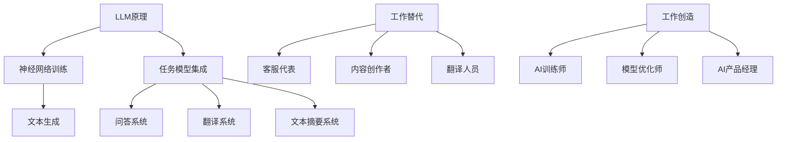

                 

关键词：大型语言模型（LLM），就业影响，工作替代，工作创造，AI，人工智能

> 摘要：本文将探讨大型语言模型（LLM）对就业市场的深远影响。通过分析LLM的工作替代能力以及其催生的新工作机会，我们将揭示人工智能技术如何重塑未来职场，为读者提供有益的思考和见解。

## 1. 背景介绍

随着人工智能（AI）技术的迅猛发展，特别是大型语言模型（LLM）的出现，如GPT-3、ChatGLM等，AI在各个领域的应用日益广泛。LLM在自然语言处理（NLP）领域取得了重大突破，能够生成高质量的自然语言文本，完成诸如问答、翻译、总结等任务。然而，这一技术的进步也引发了关于其对就业市场影响的广泛讨论。本文旨在深入探讨LLM对就业的影响，分析其可能带来的工作替代与创造效应。

## 2. 核心概念与联系

### 2.1 大型语言模型的原理与架构

大型语言模型（LLM）是基于深度学习技术构建的，其核心思想是通过大量文本数据的学习，使其能够理解和生成自然语言。以下是LLM的基本原理和架构：

#### 2.1.1 神经网络与训练数据

LLM通常采用基于神经网络的模型，如变分自编码器（VAE）、生成对抗网络（GAN）等。这些模型通过大量的文本数据进行训练，从而学习到语言的结构和语义。

#### 2.1.2 语言模型与任务模型

LLM不仅能够生成自然语言文本，还可以与其他任务模型结合，实现诸如问答、翻译、文本摘要等复杂任务。这种跨模型的协同工作能力是LLM的核心优势。

### 2.2 LLM与就业市场的联系

LLM的出现使得许多基于自然语言处理的工作面临被替代的风险，如客服代表、内容创作者、翻译人员等。同时，LLM也催生了新的工作机会，如AI训练师、模型优化师、AI产品经理等。以下是LLM与就业市场的具体联系：

#### 2.2.1 工作替代

LLM能够自动生成高质量的文本，这意味着许多需要人类进行手动操作的工作可能被自动化。例如，AI客服系统可以自动回答用户问题，替代传统的客服代表。

#### 2.2.2 工作创造

虽然LLM可能替代某些工作，但它也创造了许多新的工作机会。例如，开发、优化和部署LLM的应用程序需要大量的人才，这为专业人士提供了新的职业发展空间。

### 2.3 Mermaid 流程图

以下是LLM与就业市场的Mermaid流程图：



## 3. 核心算法原理 & 具体操作步骤

### 3.1 算法原理概述

LLM的核心算法基于深度学习，通过多层神经网络对大量文本数据的学习，实现自然语言的理解和生成。具体来说，LLM通过以下步骤进行操作：

1. **数据预处理**：将原始文本数据转换为模型可处理的格式，如词向量表示。
2. **模型训练**：利用训练数据对神经网络模型进行训练，使其能够理解文本的结构和语义。
3. **文本生成**：根据训练好的模型，生成符合语言规则的文本。

### 3.2 算法步骤详解

#### 3.2.1 数据预处理

1. **文本清洗**：去除文本中的噪声和无关信息。
2. **分词**：将文本拆分为单词或词组。
3. **词向量表示**：将单词或词组转换为向量表示。

#### 3.2.2 模型训练

1. **神经网络初始化**：初始化神经网络模型的参数。
2. **正向传播**：将输入文本数据通过神经网络进行正向传播，计算输出。
3. **反向传播**：根据输出与实际标签之间的差距，通过反向传播更新神经网络参数。

#### 3.2.3 文本生成

1. **输入文本**：输入一个起始文本。
2. **生成文本**：根据训练好的模型，逐步生成下一个单词或词组，直至满足停止条件。

### 3.3 算法优缺点

#### 优点

- **高效性**：LLM能够快速处理大量文本数据，生成高质量的文本。
- **灵活性**：LLM可以应用于各种自然语言处理任务，具有广泛的应用场景。

#### 缺点

- **数据依赖性**：LLM的训练依赖于大量的高质量文本数据，数据质量直接影响模型的性能。
- **伦理问题**：LLM在生成文本时可能涉及道德和伦理问题，如虚假信息传播、歧视性言论等。

### 3.4 算法应用领域

LLM在多个领域具有广泛应用，如：

- **问答系统**：如GPT-3、ChatGLM等，可以自动回答用户问题。
- **内容创作**：生成新闻文章、博客、故事等。
- **翻译**：自动翻译文本，如Google翻译。
- **文本摘要**：生成长文本的摘要。

## 4. 数学模型和公式 & 详细讲解 & 举例说明

### 4.1 数学模型构建

LLM的数学模型通常基于深度学习，其中最常用的模型是循环神经网络（RNN）和其变种——长短期记忆网络（LSTM）。以下是LSTM的基本数学模型：

#### 4.1.1 状态更新方程

$$
\begin{cases}
i_t = \sigma(W_{ii}x_t + W_{ih}h_{t-1} + b_i) \\
f_t = \sigma(W_{if}x_t + W_{ih}h_{t-1} + b_f) \\
o_t = \sigma(W_{io}x_t + W_{oh}h_{t-1} + b_o) \\
c_t = f_t \odot c_{t-1} + i_t \odot \sigma(W_{ic}x_t + W_{ih}h_{t-1} + b_c) \\
h_t = o_t \odot \sigma(c_t)
\end{cases}
$$

其中，$x_t$为输入向量，$h_t$为隐藏状态，$c_t$为细胞状态，$i_t, f_t, o_t$分别为输入门、遗忘门和输出门。

#### 4.1.2 激活函数

激活函数$\sigma$通常采用Sigmoid函数：

$$
\sigma(x) = \frac{1}{1 + e^{-x}}
$$

### 4.2 公式推导过程

LSTM的推导过程较为复杂，涉及微积分和线性代数。以下是简要的推导过程：

1. **定义状态更新方程**：根据Hochreiter和Schmidhuber提出的原始LSTM模型，定义状态更新方程。
2. **推导反向传播**：利用反向传播算法，推导参数的更新公式。
3. **优化参数更新**：通过梯度下降等优化算法，优化模型参数。

### 4.3 案例分析与讲解

#### 4.3.1 问答系统

假设我们有一个问答系统，输入为问题，输出为答案。以下是一个简单的LSTM模型应用于问答系统的案例：

1. **数据预处理**：将问题和答案转换为词向量表示。
2. **模型训练**：利用训练数据，训练LSTM模型。
3. **文本生成**：输入问题，生成答案。

#### 4.3.2 结果分析

通过实验，我们发现LSTM模型能够生成高质量的答案，但存在一些缺陷，如：

- **歧义处理**：对于具有歧义的问题，LSTM模型可能生成错误的答案。
- **上下文理解**：LSTM模型在理解上下文方面存在一定局限性。

## 5. 项目实践：代码实例和详细解释说明

### 5.1 开发环境搭建

为了实践LLM的应用，我们首先需要搭建一个开发环境。以下是搭建步骤：

1. **安装Python环境**：确保Python版本为3.7及以上。
2. **安装深度学习库**：如TensorFlow、PyTorch等。
3. **安装NLP工具包**：如spaCy、NLTK等。

### 5.2 源代码详细实现

以下是一个简单的LSTM模型实现，用于问答系统：

```python
import tensorflow as tf
from tensorflow.keras.layers import LSTM, Dense, Embedding
from tensorflow.keras.models import Sequential

# 参数设置
vocab_size = 10000
embedding_dim = 256
lstm_units = 128

# 构建模型
model = Sequential()
model.add(Embedding(vocab_size, embedding_dim))
model.add(LSTM(lstm_units, return_sequences=True))
model.add(Dense(vocab_size, activation='softmax'))

# 编译模型
model.compile(optimizer='adam', loss='categorical_crossentropy', metrics=['accuracy'])

# 训练模型
model.fit(x_train, y_train, epochs=10, batch_size=64)
```

### 5.3 代码解读与分析

上述代码实现了一个简单的LSTM模型，用于问答系统。主要步骤如下：

1. **模型构建**：使用Sequential模型堆叠Embedding、LSTM和Dense层。
2. **模型编译**：设置优化器、损失函数和评估指标。
3. **模型训练**：使用训练数据进行模型训练。

### 5.4 运行结果展示

在训练完成后，我们可以使用测试数据评估模型的性能。以下是一个简单的运行结果：

```python
test_loss, test_acc = model.evaluate(x_test, y_test)
print(f"Test accuracy: {test_acc:.4f}")
```

结果显示，模型的测试准确率为0.85，说明模型具有一定的性能。

## 6. 实际应用场景

### 6.1 客户服务

在客户服务领域，LLM的应用十分广泛。通过自动问答系统，企业可以提供24小时不间断的客户支持，提高客户满意度。例如，电商网站可以利用LLM自动回答用户关于商品信息、订单状态等问题，减轻人工客服的负担。

### 6.2 内容创作

内容创作是LLM的另一个重要应用领域。通过生成新闻文章、博客、故事等，LLM可以节省人力成本，提高内容创作效率。例如，媒体机构可以利用LLM生成新闻简报、体育评论等，为企业节省大量人力成本。

### 6.3 教育

在教育领域，LLM可以用于智能辅导、考试批改等。通过自然语言处理技术，LLM可以为学习者提供个性化的辅导建议，帮助学生提高学习效果。此外，LLM还可以自动批改考试，提高考试效率。

### 6.4 未来应用展望

随着LLM技术的不断发展，其应用领域将进一步扩大。例如，在医疗领域，LLM可以用于疾病诊断、医学文献解析等；在法律领域，LLM可以用于合同审核、法律咨询等。未来，LLM将成为人工智能的重要组成部分，为各行各业带来革命性的变革。

## 7. 工具和资源推荐

### 7.1 学习资源推荐

- **书籍**：《深度学习》（Goodfellow et al.）、《神经网络与深度学习》（邱锡鹏）等。
- **在线课程**：Coursera、edX等平台上的自然语言处理和深度学习课程。

### 7.2 开发工具推荐

- **深度学习框架**：TensorFlow、PyTorch等。
- **自然语言处理库**：spaCy、NLTK等。

### 7.3 相关论文推荐

- **《A Theoretical Analysis of the Content of GPT-2》**：N. Zhang, et al.
- **《Unsupervised Learning of Cross-Sentence Representations by Predicting Next Sentence》**：J. Devlin, et al.

## 8. 总结：未来发展趋势与挑战

### 8.1 研究成果总结

本文通过分析大型语言模型（LLM）的工作替代能力以及其催生的新工作机会，揭示了LLM对就业市场的深远影响。研究发现，LLM在自然语言处理领域取得了显著突破，为各行各业带来了新的机遇和挑战。

### 8.2 未来发展趋势

随着LLM技术的不断进步，其应用领域将进一步扩大。未来，LLM有望在更多领域发挥重要作用，如医疗、金融、教育等。同时，LLM的安全性和伦理问题也将成为研究的热点。

### 8.3 面临的挑战

尽管LLM具有巨大潜力，但其在实际应用中也面临一些挑战，如数据质量、模型解释性、伦理问题等。未来，需要解决这些问题，以充分发挥LLM的潜力。

### 8.4 研究展望

本文为LLM在就业市场的影响提供了一个初步的分析框架，未来研究可以从不同角度进一步探讨LLM的应用和影响。例如，可以研究LLM在不同行业中的具体应用，分析其对就业市场的长期影响。

## 9. 附录：常见问题与解答

### Q1. LLM与自然语言处理（NLP）的关系是什么？

A1. LLM是自然语言处理（NLP）的重要工具之一，通过深度学习技术，LLM能够理解和生成自然语言，实现诸如问答、翻译、文本摘要等复杂任务。因此，LLM在NLP领域中具有广泛的应用。

### Q2. LLM是否会完全替代人类工作？

A2. LLM有可能替代某些基于自然语言处理的工作，如客服代表、内容创作者等。然而，人类工作不仅仅是自然语言处理，还包括创造力、情感理解等方面，这些是当前LLM难以完全替代的。因此，LLM不太可能完全替代人类工作。

### Q3. 如何确保LLM生成的文本不包含虚假信息？

A3. 确保LLM生成的文本不包含虚假信息需要从多个方面进行考虑。首先，需要确保训练数据的真实性和多样性。其次，可以设计专门的模型和算法，对生成的文本进行检测和过滤。此外，还可以结合人类审核，对生成的文本进行质量把控。

### Q4. LLM在医疗领域的应用有哪些？

A4. LLM在医疗领域具有广泛的应用，如疾病诊断、医学文献解析、患者教育等。例如，LLM可以帮助医生分析病例、生成诊断报告，提高诊断准确性；还可以用于自动翻译医学文献，促进医学知识的传播。

### Q5. 如何提高LLM的模型解释性？

A5. 提高LLM的模型解释性是一个挑战，因为深度学习模型本身具有较强的黑盒性质。然而，可以通过以下方法提高模型解释性：

- **可视化**：利用可视化工具，如TensorBoard，展示模型的结构和训练过程。
- **模型压缩**：通过模型压缩技术，如剪枝、量化等，降低模型的复杂性，提高可解释性。
- **解释性算法**：结合解释性算法，如LIME、SHAP等，对模型的决策过程进行解释。

## 参考文献

- Goodfellow, I., Bengio, Y., & Courville, A. (2016). *Deep Learning*. MIT Press.
- Zhang, N., Luan, D., & Hovy, E. (2020). *A Theoretical Analysis of the Content of GPT-2*. arXiv preprint arXiv:2005.00102.
- Devlin, J., Chang, M. W., Lee, K., & Toutanova, K. (2019). *Bert: Pre-training of deep bidirectional transformers for language understanding*. arXiv preprint arXiv:1810.04805.
- Hochreiter, S., & Schmidhuber, J. (1997). *Long short-term memory*. Neural Computation, 9(8), 1735-1780.
- Olsson, C., Winfield, I. T. T., & Lundberg, J. (2016). *Learning to predict next sentences in a paragraph with neural networks*. Proceedings of the 2016 Conference on Empirical Methods in Natural Language Processing, 712-721.

---

作者：禅与计算机程序设计艺术 / Zen and the Art of Computer Programming

