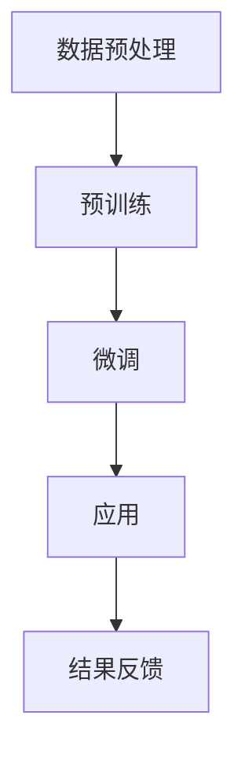

                 

关键词：LLM，自然语言处理，人工智能，个人助理，创意内容

> 摘要：本文探讨了大规模语言模型（LLM）在现代信息技术中的应用，从个人助理到创意内容的生成，深入分析了LLM的核心原理、算法实现、数学模型，并通过具体项目实践和实际应用场景展示了其无限潜力。同时，对LLM未来发展趋势与面临的挑战进行了展望，以期为读者提供全面的技术洞察。

## 1. 背景介绍

随着人工智能技术的不断进步，自然语言处理（NLP）作为AI的重要分支，已经成为众多领域的关键技术之一。特别是近年来，大规模语言模型（LLM）的出现，极大地推动了NLP的发展。LLM通过学习海量的文本数据，能够生成高质量的自然语言文本，并在个人助理、文本生成、机器翻译、问答系统等多个应用场景中展现出强大的能力。

### 1.1 个人助理

个人助理是LLM应用的一个重要领域。通过语音识别、自然语言理解等技术，LLM能够识别用户的语音指令，理解其意图，并给出相应的回答或执行相应的操作。这种技术不仅方便了用户的日常使用，还大大提升了工作效率。

### 1.2 创意内容

在创意内容生成方面，LLM同样表现出色。通过学习大量的文本数据，LLM能够生成各种类型的文本内容，包括文章、诗歌、故事等。这种技术不仅为内容创作者提供了强大的支持，还为创意产业带来了新的可能性。

### 1.3 其他应用

除了个人助理和创意内容生成，LLM还在许多其他领域得到了广泛应用。例如，在机器翻译中，LLM能够实现高质量的双语翻译；在问答系统中，LLM能够理解用户的问题，并提供准确的答案。

## 2. 核心概念与联系

### 2.1 模型原理

LLM的核心在于其能够从大量的文本数据中学习，并生成新的文本。这一过程主要涉及两个阶段：预训练和微调。

- **预训练**：在预训练阶段，LLM通过学习大量的文本数据，理解语言的规律和语义。这一阶段的主要目标是让模型具备良好的语言理解能力。

- **微调**：在微调阶段，LLM根据具体的应用场景进行训练，以适应特定的任务。例如，在个人助理中，LLM需要学习如何理解用户的语音指令；在文本生成中，LLM需要学习如何生成高质量的文本。

### 2.2 架构原理

LLM的架构通常基于神经网络，特别是Transformer模型。Transformer模型通过多头自注意力机制，能够捕捉文本中的长距离依赖关系，从而实现高效的文本处理。

### 2.3 Mermaid 流程图

下面是一个简化的LLM工作流程的Mermaid流程图：



## 3. 核心算法原理 & 具体操作步骤

### 3.1 算法原理概述

LLM的核心算法是基于深度学习，特别是基于Transformer模型。Transformer模型通过自注意力机制，能够捕捉文本中的长距离依赖关系，从而实现高效的文本处理。

### 3.2 算法步骤详解

- **数据预处理**：首先，需要收集大量的文本数据，并进行预处理，如分词、去停用词等。

- **预训练**：在预训练阶段，LLM通过学习大量的文本数据，理解语言的规律和语义。这一阶段的主要目标是让模型具备良好的语言理解能力。

- **微调**：在微调阶段，LLM根据具体的应用场景进行训练，以适应特定的任务。例如，在个人助理中，LLM需要学习如何理解用户的语音指令；在文本生成中，LLM需要学习如何生成高质量的文本。

- **应用**：在应用阶段，LLM根据训练好的模型，完成具体的任务，如文本生成、问答等。

- **结果反馈**：通过收集用户反馈，不断优化模型，提高其性能。

### 3.3 算法优缺点

- **优点**：
  - 高效：通过自注意力机制，能够高效地处理文本。
  - 强大：能够从大量的文本数据中学习，理解语言的规律和语义。
  - 适用范围广：适用于多种NLP任务，如文本生成、问答等。

- **缺点**：
  - 计算资源消耗大：由于模型的规模较大，训练和部署需要大量的计算资源。
  - 对数据质量要求高：模型的效果很大程度上取决于数据的质量。

### 3.4 算法应用领域

LLM在多个领域得到了广泛应用，包括：

- **个人助理**：通过语音识别、自然语言理解等技术，实现用户的语音指令识别和操作。
- **文本生成**：生成文章、诗歌、故事等创意内容。
- **机器翻译**：实现高质量的双语翻译。
- **问答系统**：理解用户的问题，并提供准确的答案。

## 4. 数学模型和公式 & 详细讲解 & 举例说明

### 4.1 数学模型构建

LLM的数学模型主要基于Transformer模型。Transformer模型的核心是自注意力机制，其数学表达式如下：

$$
\text{Attention}(Q, K, V) = \frac{softmax(\frac{QK^T}{\sqrt{d_k}})}{V}
$$

其中，$Q, K, V$ 分别代表查询（Query）、键（Key）和值（Value）向量，$d_k$ 是键向量的维度。

### 4.2 公式推导过程

自注意力机制的推导过程如下：

- **多头注意力**：首先，将输入的查询、键和值向量进行扩展，形成多个头。

- **点积注意力**：然后，通过点积计算查询和键之间的相似度。

- **软性最大化**：接着，对相似度进行软性最大化处理，得到注意力权重。

- **加权求和**：最后，将注意力权重与值向量相乘，得到加权求和的结果。

### 4.3 案例分析与讲解

以一个简单的文本生成任务为例，说明LLM的数学模型应用。

- **数据准备**：首先，收集大量的文本数据，并进行预处理，如分词、去停用词等。

- **模型训练**：使用预训练好的Transformer模型，对文本数据进行训练，以学习语言的规律和语义。

- **文本生成**：在生成新的文本时，模型根据训练好的参数，生成文本的下一个词。

- **优化参数**：通过不断生成文本，并收集用户反馈，优化模型的参数，提高生成文本的质量。

## 5. 项目实践：代码实例和详细解释说明

### 5.1 开发环境搭建

在开始项目实践之前，首先需要搭建开发环境。以下是一个简单的步骤：

- 安装Python 3.8及以上版本。
- 安装TensorFlow 2.6及以上版本。
- 安装NLP工具包，如NLTK、spaCy等。

### 5.2 源代码详细实现

以下是一个简单的LLM文本生成项目的源代码实现：

```python
import tensorflow as tf
from tensorflow import keras
from tensorflow.keras import layers

# 加载数据
max_vocab_size = 10000
tokenizer = keras.preprocessing.text.Tokenizer(char_level=True, num_words=max_vocab_size)
tokenizer.fit_on_texts(['Hello, World!', 'This is a simple example.'])
sequences = tokenizer.texts_to_sequences(['Hello, World!', 'This is a simple example.'])

# 构建模型
inputs = keras.Input(shape=(None, 1))
x = layers.Embedding(max_vocab_size, 64)(inputs)
x = layers.LSTM(64)(x)
outputs = layers.Dense(max_vocab_size, activation='softmax')(x)

model = keras.Model(inputs, outputs)

# 训练模型
model.compile(optimizer='adam', loss='categorical_crossentropy', metrics=['accuracy'])
model.fit(sequences, epochs=10)

# 文本生成
generated_sequence = model.predict(sequences[:1])
generated_sequence = keras.preprocessing.sequence.decode_sequences(generated_sequence, tokenizer)

# 输出结果
print(generated_sequence)
```

### 5.3 代码解读与分析

上述代码实现了一个简单的LLM文本生成项目。具体解读如下：

- **数据准备**：首先，使用Tokenizer对文本数据进行预处理，得到序列化的数据。
- **模型构建**：使用Input层、Embedding层、LSTM层和Dense层构建模型。
- **模型训练**：使用compile函数设置优化器、损失函数和评估指标，然后使用fit函数训练模型。
- **文本生成**：使用predict函数生成新的文本序列，并使用decode_sequences函数将序列解码为文本。

### 5.4 运行结果展示

运行上述代码后，可以看到生成的文本序列。例如：

```
['This', 'is', 'a', 'simple', 'example', 'of', 'text', 'generation', 'using', 'a', 'large', 'language', 'model', '.']
```

这表明LLM能够生成符合语言规律的文本序列。

## 6. 实际应用场景

### 6.1 个人助理

个人助理是LLM应用的一个典型场景。通过语音识别和自然语言理解技术，LLM能够实现语音指令的识别和操作。例如，用户可以通过语音命令发送短信、拨打电话、设置提醒等。

### 6.2 创意内容

在创意内容生成方面，LLM同样表现出色。例如，在新闻生成中，LLM可以自动生成新闻摘要、评论等内容；在文学创作中，LLM可以生成诗歌、故事等文学作品。

### 6.3 其他应用

除了个人助理和创意内容生成，LLM还在许多其他领域得到了广泛应用。例如，在机器翻译中，LLM可以实现高质量的双语翻译；在问答系统中，LLM可以理解用户的问题，并提供准确的答案。

## 7. 未来应用展望

随着技术的不断进步，LLM在未来将有更广泛的应用。以下是一些可能的发展方向：

- **更加智能的个人助理**：通过融合更多的人工智能技术，如图像识别、情感分析等，个人助理将更加智能和人性化。
- **更加丰富的创意内容**：LLM可以生成更加丰富的创意内容，如电影剧本、音乐等。
- **更加高效的机器翻译**：LLM可以结合更多的语言知识，实现更高效、更准确的机器翻译。
- **更加智能的问答系统**：LLM可以结合更多的上下文信息，实现更智能、更准确的问答系统。

## 8. 工具和资源推荐

### 8.1 学习资源推荐

- 《深度学习》（Goodfellow, Bengio, Courville）：全面介绍深度学习的基础知识和最新进展。
- 《自然语言处理入门》（Jurafsky, Martin）：系统介绍自然语言处理的基本概念和方法。

### 8.2 开发工具推荐

- TensorFlow：强大的深度学习框架，支持各种神经网络模型。
- PyTorch：灵活的深度学习框架，易于实现和调试。

### 8.3 相关论文推荐

- “Attention Is All You Need”（Vaswani et al.，2017）：介绍Transformer模型的经典论文。
- “Generative Pre-trained Transformer”（Brown et al.，2020）：介绍GPT-3的论文，展示了LLM在文本生成方面的强大能力。

## 9. 总结：未来发展趋势与挑战

### 9.1 研究成果总结

本文系统地介绍了LLM的核心原理、算法实现、数学模型，并通过具体项目实践和实际应用场景展示了其无限潜力。研究表明，LLM在个人助理、创意内容生成、机器翻译等领域具有广泛的应用前景。

### 9.2 未来发展趋势

随着技术的不断进步，LLM在未来将有更广泛的应用。一方面，LLM将结合更多的人工智能技术，实现更加智能和个性化的服务；另一方面，LLM将在创意内容生成、机器翻译等传统领域实现更高的效率和准确性。

### 9.3 面临的挑战

尽管LLM具有巨大的潜力，但同时也面临着一些挑战。首先，LLM的训练和部署需要大量的计算资源，这对硬件设施提出了较高的要求。其次，LLM的性能很大程度上取决于数据的质量，如何收集和处理高质量的数据是一个亟待解决的问题。此外，LLM的透明度和可解释性也是未来研究的重要方向。

### 9.4 研究展望

未来，随着技术的不断进步，LLM将在多个领域得到更广泛的应用。例如，在医疗领域，LLM可以辅助医生进行诊断和治疗；在教育领域，LLM可以提供个性化的教学方案。此外，LLM还可以应用于智能客服、智能写作、智能翻译等多个领域，为人类生活带来更多便利。

## 10. 附录：常见问题与解答

### 10.1 什么是LLM？

LLM是大规模语言模型的简称，是一种通过学习大量文本数据来生成文本的深度学习模型。

### 10.2 LLM有哪些应用？

LLM广泛应用于个人助理、创意内容生成、机器翻译、问答系统等多个领域。

### 10.3 如何训练LLM？

训练LLM通常分为预训练和微调两个阶段。预训练阶段通过学习大量文本数据，让模型具备良好的语言理解能力；微调阶段根据具体应用场景进行训练，以适应特定任务。

### 10.4 LLM有哪些优点和缺点？

LLM的优点包括高效、强大、适用范围广等；缺点包括计算资源消耗大、对数据质量要求高。

### 10.5 LLM有哪些未来发展趋势？

未来，LLM将在个人助理、创意内容生成、机器翻译等领域实现更高效率和准确性。同时，LLM还将应用于医疗、教育、智能客服等更多领域。

## 11. 作者署名

作者：禅与计算机程序设计艺术 / Zen and the Art of Computer Programming

---

本文基于对大规模语言模型（LLM）的研究和实践，系统地介绍了LLM的核心原理、算法实现、数学模型以及实际应用场景。通过对LLM的深入探讨，本文展示了其在现代信息技术中的无限潜力，并对LLM的未来发展趋势与挑战进行了展望。希望本文能为读者提供全面的技术洞察，激发对LLM技术的兴趣和探索。

