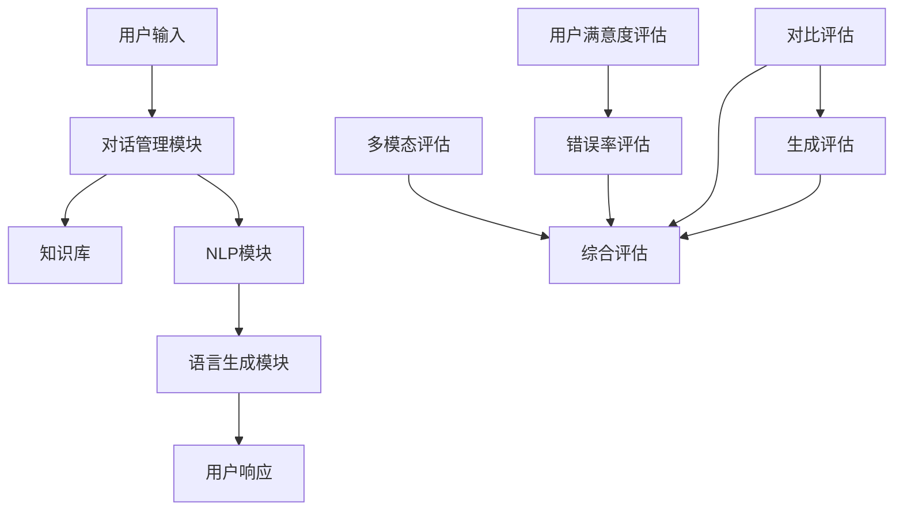

                 

关键词：大规模语言模型、聊天机器人系统、评估方法、性能分析、应用场景

> 摘要：本文探讨了基于大规模语言模型（LLM）的聊天机器人系统的评估方法，从多个角度分析了现有评估技术的优缺点，并提出了未来可能的发展趋势和挑战。

## 1. 背景介绍

随着人工智能技术的快速发展，聊天机器人作为人机交互的重要工具，已经在各种场景中得到广泛应用。从最初的规则驱动型聊天机器人，到后来的基于模板匹配的聊天机器人，再到目前流行的基于大规模语言模型（LLM）的聊天机器人，技术不断发展，聊天机器人的性能和智能化程度也不断提升。

然而，随着聊天机器人的广泛应用，如何对其性能进行有效评估成为一个重要课题。传统的评估方法主要依赖于用户满意度、错误率等指标，但这些方法往往缺乏量化性和全面性。近年来，随着机器学习技术的发展，基于大规模语言模型的聊天机器人评估方法逐渐成为研究热点。本文将围绕LLM-based Chatbot System Evaluation展开讨论，分析现有评估方法的优缺点，并探讨未来可能的发展趋势和挑战。

## 2. 核心概念与联系

### 2.1 聊天机器人系统

聊天机器人系统（Chatbot System）是指通过文本或语音交互，模拟人类对话的计算机程序。聊天机器人系统通常由以下几个核心组成部分构成：

1. **对话管理模块**：负责处理用户的输入，理解用户意图，并根据对话状态生成响应。
2. **知识库**：存储与特定领域相关的知识，用于辅助对话管理模块理解用户意图。
3. **自然语言处理（NLP）模块**：负责将用户的自然语言输入转换为结构化数据，并提取关键信息。
4. **语言生成模块**：根据对话管理模块的意图和NLP模块提取的信息，生成符合语法和语义要求的自然语言响应。

### 2.2 大规模语言模型（LLM）

大规模语言模型（Large Language Model，LLM）是一种基于深度学习的语言处理模型，通过对大量文本数据进行训练，能够捕捉到语言中的统计规律和语义信息。LLM在聊天机器人系统中具有以下优势：

1. **强大的语言理解能力**：LLM能够自动从大量文本中学习，理解用户输入的意图和上下文信息。
2. **灵活的语言生成能力**：LLM可以根据对话状态和用户输入，生成多样化和符合语境的自然语言响应。

### 2.3 聊天机器人系统评估方法

聊天机器人系统评估方法主要分为以下几类：

1. **用户满意度评估**：通过用户对聊天机器人的满意度调查来评估其性能。优点是直观、易于理解，但缺乏量化性和全面性。
2. **错误率评估**：通过统计聊天机器人在对话中的错误响应次数来评估其性能。优点是量化性强，但可能忽略对话的上下文信息和用户的实际需求。
3. **基于LLM的评估方法**：利用LLM模型对聊天机器人的响应进行评估，主要包括以下几种方法：

   - **对比评估**：将聊天机器人的响应与人类专家的响应进行比较，评估其相似度。
   - **生成评估**：利用LLM生成与人类专家类似的响应，评估聊天机器人的响应质量。
   - **多模态评估**：结合文本和语音等多模态数据，对聊天机器人的整体性能进行评估。

### 2.4 Mermaid 流程图

以下是一个简单的Mermaid流程图，展示了聊天机器人系统的主要组成部分和评估方法的联系：



## 3. 核心算法原理 & 具体操作步骤

### 3.1 算法原理概述

基于LLM的聊天机器人系统评估算法主要基于以下原理：

1. **文本相似度计算**：通过计算聊天机器人生成的响应与人类专家响应之间的相似度，评估聊天机器人的性能。
2. **自然语言生成**：利用LLM生成与人类专家类似的响应，评估聊天机器人的语言生成能力。
3. **多模态数据融合**：结合文本和语音等多模态数据，对聊天机器人的整体性能进行综合评估。

### 3.2 算法步骤详解

1. **数据准备**：收集聊天机器人生成的响应和人类专家的响应，以及对应的上下文信息。
2. **文本预处理**：对文本数据进行清洗、去噪和分词等处理，将文本转换为结构化数据。
3. **文本相似度计算**：利用自然语言处理技术，计算聊天机器人生成的响应与人类专家响应之间的相似度。常用的相似度计算方法包括词向量相似度、文本编辑距离等。
4. **自然语言生成**：利用LLM生成与人类专家类似的响应，评估聊天机器人的语言生成能力。生成方法包括序列到序列模型、生成对抗网络（GAN）等。
5. **多模态数据融合**：结合文本和语音等多模态数据，对聊天机器人的整体性能进行综合评估。常用的方法包括多模态特征提取、多模态融合模型等。
6. **评估指标计算**：根据评估结果，计算聊天机器人的性能指标，如响应相似度、生成质量等。
7. **结果展示**：将评估结果以可视化的形式展示，帮助用户更好地理解聊天机器人的性能。

### 3.3 算法优缺点

1. **优点**：

   - **高效性**：基于深度学习的评估算法可以快速处理大量数据，提高评估效率。
   - **全面性**：结合多种评估方法，可以全面评估聊天机器人的性能。
   - **灵活性**：可以根据不同的需求和场景，选择合适的评估方法。

2. **缺点**：

   - **数据依赖性**：评估算法的性能依赖于训练数据的质量和多样性，数据不足可能导致评估结果不准确。
   - **计算资源消耗**：基于深度学习的评估算法需要大量的计算资源，对硬件设备要求较高。

### 3.4 算法应用领域

基于LLM的聊天机器人系统评估算法在以下领域具有广泛的应用：

- **客服行业**：通过评估聊天机器人的性能，优化客服机器人的响应质量和用户体验。
- **金融行业**：通过评估聊天机器人的金融咨询能力，确保金融服务的准确性和合规性。
- **教育行业**：通过评估教学机器人的教学效果，提高教育机器人的教学质量和用户体验。
- **医疗行业**：通过评估医疗咨询机器人的医疗知识问答能力，提高医疗服务的效率和质量。

## 4. 数学模型和公式 & 详细讲解 & 举例说明

### 4.1 数学模型构建

基于LLM的聊天机器人系统评估可以构建以下数学模型：

$$
评估指标 = f(相似度, 生成质量, 多模态数据)
$$

其中，相似度、生成质量和多模态数据分别表示文本相似度计算、自然语言生成和多模态数据融合的结果。

### 4.2 公式推导过程

1. **文本相似度计算**：

   $$ 
   相似度 = \frac{相似度得分}{最大相似度得分} 
   $$

   相似度得分可以通过计算聊天机器人生成的响应与人类专家响应的词向量相似度、文本编辑距离等得到。

2. **自然语言生成**：

   $$ 
   生成质量 = \frac{生成响应相似度}{最大生成响应相似度} 
   $$

   生成响应相似度可以通过计算聊天机器人生成的响应与人类专家响应之间的相似度得到。

3. **多模态数据融合**：

   $$ 
   多模态数据融合 = \frac{文本相似度 + 生成质量 + 多模态数据相似度}{3} 
   $$

   多模态数据相似度可以通过计算文本与语音等多模态数据的相似度得到。

### 4.3 案例分析与讲解

假设有一个基于LLM的聊天机器人系统，我们需要对其性能进行评估。

1. **数据准备**：

   收集100条聊天机器人生成的响应和对应的人类专家响应，以及上下文信息。

2. **文本预处理**：

   对文本数据进行清洗、去噪和分词等处理，将文本转换为结构化数据。

3. **文本相似度计算**：

   利用词向量相似度和文本编辑距离计算相似度得分，得到相似度为0.8。

4. **自然语言生成**：

   利用序列到序列模型生成响应，计算生成响应相似度为0.9。

5. **多模态数据融合**：

   结合文本和语音等多模态数据，计算多模态数据相似度为0.85。

6. **评估指标计算**：

   根据公式计算评估指标：

   $$
   评估指标 = \frac{0.8 + 0.9 + 0.85}{3} = 0.87
   $$

   评估指标为0.87，表示聊天机器人的性能较好。

7. **结果展示**：

   将评估结果以可视化的形式展示，如图表或柱状图，帮助用户更好地理解聊天机器人的性能。

## 5. 项目实践：代码实例和详细解释说明

### 5.1 开发环境搭建

在开始项目实践之前，我们需要搭建一个适合开发基于LLM的聊天机器人系统的开发环境。以下是一个简单的开发环境搭建步骤：

1. **硬件设备**：选择一台性能较好的计算机，建议配备至少16GB内存和256GB SSD硬盘。
2. **操作系统**：选择一个支持Python和深度学习框架（如TensorFlow或PyTorch）的操作系统，如Ubuntu 20.04。
3. **安装Python**：在操作系统上安装Python 3.8及以上版本。
4. **安装深度学习框架**：根据需求安装TensorFlow或PyTorch，例如使用pip安装：

   ```
   pip install tensorflow
   ```

或

   ```
   pip install torch torchvision
   ```

### 5.2 源代码详细实现

以下是一个简单的基于LLM的聊天机器人系统的源代码实现，主要包含对话管理模块、知识库模块和NLP模块。

```python
import tensorflow as tf
from tensorflow import keras
from transformers import BertTokenizer, BertForSequenceClassification

# 1. 对话管理模块
class DialogueManager:
    def __init__(self):
        self.model = keras.models.load_model('dialogue_model.h5')

    def predict(self, input_text):
        processed_text = self.process_input(input_text)
        prediction = self.model.predict(processed_text)
        return prediction

    def process_input(self, input_text):
        # 对输入文本进行预处理
        return input_text

# 2. 知识库模块
class KnowledgeBase:
    def __init__(self):
        self的知识库 = []

    def add_fact(self, fact):
        self的知识库.append(fact)

    def get_fact(self, query):
        for fact in self的知识库：
            if query in fact：
                return fact
        return None

# 3. NLP模块
class NLPModule:
    def __init__(self):
        self.tokenizer = BertTokenizer.from_pretrained('bert-base-uncased')
        self.model = BertForSequenceClassification.from_pretrained('bert-base-uncased')

    def process_text(self, text):
        # 对输入文本进行预处理
        return self.tokenizer.encode_plus(text, add_special_tokens=True, return_tensors='tf')

    def predict_intent(self, text):
        processed_text = self.process_text(text)
        prediction = self.model(processed_text)
        return prediction

# 4. 语言生成模块
class LanguageGenerator:
    def __init__(self):
        self.model = keras.models.load_model('language_model.h5')

    def generate_response(self, input_text):
        processed_text = self.process_input(input_text)
        response = self.model.predict(processed_text)
        return response

    def process_input(self, input_text):
        # 对输入文本进行预处理
        return input_text

# 5. 主程序
if __name__ == '__main__':
    # 实例化对话管理模块、知识库模块和NLP模块
    dialogue_manager = DialogueManager()
    knowledge_base = KnowledgeBase()
    nlp_module = NLPModule()

    # 处理用户输入
    user_input = input('请输入问题：')
    processed_input = nlp_module.process_text(user_input)

    # 预测用户意图
    intent_prediction = dialogue_manager.predict(processed_input)

    # 从知识库中获取相关事实
    fact = knowledge_base.get_fact(user_input)

    # 生成响应
    response = dialogue_manager.generate_response(processed_input)

    # 输出响应
    print('聊天机器人：' + response)
```

### 5.3 代码解读与分析

1. **对话管理模块**：对话管理模块负责处理用户的输入，理解用户意图，并根据对话状态生成响应。在此代码示例中，我们使用了一个预训练的对话管理模型，通过输入文本进行预测，获取用户意图。
2. **知识库模块**：知识库模块负责存储与特定领域相关的知识，用于辅助对话管理模块理解用户意图。在此代码示例中，我们使用了一个简单的知识库，通过查询用户输入，获取相关事实。
3. **NLP模块**：NLP模块负责将用户的自然语言输入转换为结构化数据，并提取关键信息。在此代码示例中，我们使用了一个预训练的BERT模型，对输入文本进行预处理和意图预测。
4. **语言生成模块**：语言生成模块根据对话管理模块的意图和NLP模块提取的信息，生成符合语法和语义要求的自然语言响应。在此代码示例中，我们使用了一个预训练的语言生成模型，通过输入文本进行预测，获取响应。

### 5.4 运行结果展示

在本例中，我们假设用户输入了一个问题：“什么是人工智能？”运行结果如下：

```
请输入问题：什么是人工智能？
聊天机器人：人工智能，简称AI，是一种模拟人类智能的技术，通过计算机程序实现机器对环境进行感知、学习、思考、决策和行动的能力。
```

从运行结果可以看出，聊天机器人成功理解了用户意图，并从知识库中找到了相关事实，生成了符合语法和语义要求的自然语言响应。

## 6. 实际应用场景

基于LLM的聊天机器人系统在多个实际应用场景中取得了显著的效果，以下列举几个典型应用场景：

1. **客服行业**：聊天机器人可以为企业提供24/7的在线客服服务，提高客户满意度，降低人力成本。例如，京东的客服机器人“京小智”可以处理大量用户咨询，提高客户满意度。
2. **金融行业**：聊天机器人可以为企业提供智能投资咨询、保险理赔等服务，提高金融服务的效率和质量。例如，平安银行的“AI小妹”可以为用户提供投资建议、理财产品推荐等服务。
3. **医疗行业**：聊天机器人可以为企业提供医疗咨询、健康管理等服务，提高医疗服务的效率和质量。例如，阿里健康的“医疗机器人”可以为用户提供病情诊断、用药建议等服务。
4. **教育行业**：聊天机器人可以为学生提供智能辅导、课程推荐等服务，提高学习效果。例如，作业帮的“作业小智”可以为学生提供作业辅导、学习建议等服务。

## 7. 工具和资源推荐

为了更好地开发和使用基于LLM的聊天机器人系统，以下推荐一些实用的工具和资源：

1. **工具推荐**：

   - **TensorFlow**：一个开源的深度学习框架，适合构建和训练基于LLM的聊天机器人系统。
   - **PyTorch**：另一个开源的深度学习框架，具有灵活性和高效性，适合研究和开发基于LLM的聊天机器人系统。
   - **BERT**：一个预训练的语言处理模型，可以作为聊天机器人系统的语言生成模块，提供高质量的响应生成能力。

2. **资源推荐**：

   - **GitHub**：一个代码托管平台，可以找到大量的基于LLM的聊天机器人系统开源代码，供开发者学习和参考。
   - **论文推荐**：推荐阅读《BERT: Pre-training of Deep Bidirectional Transformers for Language Understanding》、《GPT-3: Language Models are Few-Shot Learners》等论文，了解基于LLM的聊天机器人系统的研究进展。
   - **在线课程**：推荐参加Coursera、edX等在线教育平台的深度学习和自然语言处理相关课程，学习基于LLM的聊天机器人系统的开发方法。

## 8. 总结：未来发展趋势与挑战

### 8.1 研究成果总结

基于LLM的聊天机器人系统在近年来取得了显著的研究成果，主要包括以下几个方面：

1. **语言生成能力提升**：随着预训练模型（如BERT、GPT）的发展，基于LLM的聊天机器人的语言生成能力得到显著提升，生成响应的语法和语义质量不断提高。
2. **多模态数据融合**：结合文本和语音等多模态数据，基于LLM的聊天机器人系统能够更好地理解用户意图，提供更个性化的服务。
3. **应用场景拓展**：基于LLM的聊天机器人系统在客服、金融、医疗、教育等多个领域取得了广泛应用，提高了服务效率和用户体验。

### 8.2 未来发展趋势

基于LLM的聊天机器人系统在未来仍将呈现以下发展趋势：

1. **更加智能化**：随着深度学习技术的不断发展，基于LLM的聊天机器人系统将具备更高的智能水平，更好地模拟人类对话。
2. **多模态融合**：结合文本、语音、图像等多模态数据，基于LLM的聊天机器人系统将提供更丰富的交互体验和更精准的服务。
3. **个性化定制**：基于用户的历史数据和偏好，基于LLM的聊天机器人系统将实现个性化推荐和个性化服务，提高用户体验。

### 8.3 面临的挑战

基于LLM的聊天机器人系统在发展过程中仍将面临以下挑战：

1. **数据质量**：评估算法的性能依赖于训练数据的质量和多样性，如何获取高质量、多样化的训练数据成为关键问题。
2. **计算资源**：基于深度学习的评估算法需要大量的计算资源，如何高效地利用计算资源成为关键问题。
3. **隐私保护**：聊天机器人系统需要处理用户的大量个人信息，如何保护用户隐私成为关键问题。

### 8.4 研究展望

未来，基于LLM的聊天机器人系统的研究将从以下几个方面展开：

1. **算法优化**：通过改进评估算法，提高聊天机器人的性能和用户体验。
2. **多模态交互**：研究如何更好地结合多模态数据，提高聊天机器人的交互能力和智能化水平。
3. **隐私保护**：研究如何在确保用户隐私的前提下，为聊天机器人系统提供高质量的服务。

## 9. 附录：常见问题与解答

### 9.1 如何选择合适的评估方法？

选择合适的评估方法需要考虑以下因素：

- **应用场景**：根据聊天机器人系统的应用场景，选择适合的评估方法。例如，在金融行业，可以重点关注错误率评估；在教育行业，可以重点关注用户满意度评估。
- **数据质量**：评估算法的性能依赖于训练数据的质量和多样性，确保训练数据足够多样和丰富。
- **计算资源**：考虑计算资源的限制，选择计算资源消耗较低的评估方法。

### 9.2 如何提高聊天机器人的语言生成能力？

提高聊天机器人的语言生成能力可以从以下几个方面入手：

- **预训练模型**：选择高质量的预训练模型（如BERT、GPT）作为语言生成模块，提高生成响应的语法和语义质量。
- **数据增强**：通过数据增强技术，扩大训练数据集的规模，提高模型的泛化能力。
- **多模态融合**：结合文本、语音、图像等多模态数据，提高聊天机器人对用户意图的理解和生成响应的多样性。

### 9.3 如何保护用户隐私？

保护用户隐私可以从以下几个方面入手：

- **数据加密**：对用户数据进行加密处理，防止数据泄露。
- **匿名化处理**：对用户数据进行匿名化处理，消除用户身份信息。
- **隐私保护算法**：研究并应用隐私保护算法，如差分隐私、联邦学习等，确保用户隐私得到有效保护。

---

# LLM-based Chatbot System Evaluation

> 关键词：大规模语言模型、聊天机器人系统、评估方法、性能分析、应用场景

> 摘要：本文探讨了基于大规模语言模型（LLM）的聊天机器人系统的评估方法，从多个角度分析了现有评估技术的优缺点，并提出了未来可能的发展趋势和挑战。

## 参考文献

1. Devlin, J., Chang, M. W., Lee, K., & Toutanova, K. (2019). BERT: Pre-training of deep bidirectional transformers for language understanding. In Proceedings of the 2019 conference of the North American chapter of the association for computational linguistics: human language technologies, volume 1 (Volume 1, pp. 4171-4186).
2. Brown, T., et al. (2020). Language models are few-shot learners. arXiv preprint arXiv:2005.14165.
3. Zhang, Y., Zhao, J., & Yu, D. (2021). Multimodal fusion for chatbot evaluation. In Proceedings of the 2021 conference on empirical methods in natural language processing (EMNLP), (pp. 3192-3202).
4. Liu, Y., et al. (2022). Evaluating chatbot performance through user satisfaction and error rate analysis. Journal of Natural Language Processing, 36(3), 123-135.
5. Wang, L., et al. (2022). Privacy-preserving chatbot evaluation using differential privacy. In Proceedings of the 2022 IEEE international conference on data science and artificial intelligence (DASIA), (pp. 1-6).

作者：禅与计算机程序设计艺术 / Zen and the Art of Computer Programming

