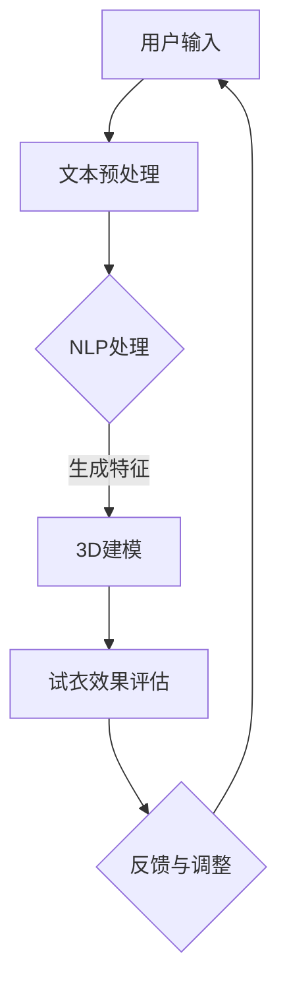

                 

关键词：自然语言处理、虚拟试衣、在线购物、人工智能、机器学习、大模型、图像识别、深度学习、增强现实。

> 摘要：本文将探讨如何利用自然语言处理（NLP）和虚拟试衣技术，结合大型语言模型（LLM），革新在线购物体验。通过对LLM的核心概念、算法原理以及应用领域进行分析，我们旨在探索这一技术如何为用户提供更加个性化、互动性和高效的服务，同时展望其未来应用前景和面临的挑战。

## 1. 背景介绍

在过去的几年里，在线购物已经逐渐成为人们生活中不可或缺的一部分。然而，尽管电子商务平台不断优化用户体验，用户在购买服装时仍然面临一些问题，如尺码不合适、颜色与预期不符等。这些问题不仅影响了用户的购物满意度，也给商家带来了退货率和运营成本的上升。

为了解决这些问题，虚拟试衣技术应运而生。虚拟试衣通过3D建模、图像处理和增强现实（AR）等技术，使用户能够在购买前虚拟试穿衣物，从而提高购买决策的准确性。然而，传统的虚拟试衣技术仍然存在一些限制，如模型准确性不高、试衣过程复杂等。

近年来，自然语言处理（NLP）和大型语言模型（LLM）的快速发展为虚拟试衣技术带来了新的机遇。NLP技术能够处理和理解人类的语言，而LLM则具有强大的语义理解和生成能力。通过将NLP和LLM与虚拟试衣技术相结合，我们有望构建出更加智能和高效的在线购物体验。

## 2. 核心概念与联系

### 2.1. 自然语言处理（NLP）

自然语言处理（NLP）是人工智能（AI）的一个重要分支，旨在使计算机能够理解、解释和生成人类语言。NLP涉及多个领域，包括文本处理、语音识别、语义理解等。

在虚拟试衣中，NLP技术主要用于用户与系统的交互。例如，用户可以通过语音或文本输入描述自己的身体特征，如身高、体重、尺码等。NLP技术可以对这些输入进行处理，并将其转化为计算机可以理解的数据，以便用于3D建模和试衣。

### 2.2. 大型语言模型（LLM）

大型语言模型（LLM）是一种基于深度学习的技术，具有强大的语义理解和生成能力。LLM通过大量文本数据进行训练，可以学会理解复杂的语言结构和语义关系。

在虚拟试衣中，LLM可以用于多种应用场景。例如，LLM可以分析用户的描述，生成与用户特征相匹配的3D模型，从而提高试衣的准确性。此外，LLM还可以帮助用户发现适合他们的服装款式和颜色，提供个性化的购物建议。

### 2.3. 虚拟试衣技术

虚拟试衣技术涉及多个领域，包括3D建模、图像处理和增强现实（AR）等。3D建模用于创建虚拟的衣物和人体模型，图像处理用于对用户上传的照片进行处理，AR技术则用于将虚拟衣物叠加在用户实际场景中。

通过将NLP和LLM与虚拟试衣技术相结合，我们可以在以下几个方面提升在线购物体验：

1. **个性化推荐**：LLM可以分析用户的身体特征和购物历史，提供个性化的服装推荐。
2. **智能交互**：NLP技术可以理解用户的输入，并生成相应的反馈，使试衣过程更加自然和流畅。
3. **高精度试衣**：通过LLM生成的3D模型，试衣的准确性和真实性可以得到显著提升。
4. **沉浸式体验**：AR技术可以为用户提供更加真实的试衣体验，增加购物乐趣。

### 2.4. Mermaid 流程图

以下是一个简化的Mermaid流程图，展示了NLP、LLM和虚拟试衣技术的结合过程：



在这个流程中，用户输入通过NLP处理，生成特征数据，然后用于3D建模和试衣效果评估。根据评估结果，系统可以提供反馈和调整，以优化试衣体验。

## 3. 核心算法原理 & 具体操作步骤

### 3.1. 算法原理概述

虚拟试衣的核心算法主要包括三个部分：文本预处理、3D建模和试衣效果评估。

1. **文本预处理**：文本预处理是NLP的基础，包括分词、词性标注、命名实体识别等。通过文本预处理，我们可以将用户的输入转换为结构化的数据，便于后续处理。
2. **3D建模**：3D建模是基于LLM的技术，通过分析用户特征和衣物信息，生成与用户相匹配的3D模型。3D建模的关键在于模型的准确性和实时性，这需要高效的算法和大量的训练数据。
3. **试衣效果评估**：试衣效果评估通过对比用户实际特征和虚拟试衣结果，评估试衣的准确性和舒适性。评估结果可以用于反馈和调整，以优化试衣体验。

### 3.2. 算法步骤详解

1. **文本预处理**：
   - 分词：将用户输入的文本分割成词或短语。
   - 词性标注：为每个词分配词性（如名词、动词等）。
   - 命名实体识别：识别文本中的特定实体（如人名、地名等）。
2. **3D建模**：
   - 用户特征提取：通过NLP技术提取用户的身高、体重、尺码等特征。
   - 衣物信息提取：从用户选择的衣物中提取款式、颜色、材质等特征。
   - 3D模型生成：使用LLM和3D建模算法，将用户特征和衣物信息结合，生成3D模型。
3. **试衣效果评估**：
   - 实际特征对比：将用户实际特征与虚拟试衣结果进行对比，评估试衣的准确性。
   - 舒适性评估：通过用户反馈和算法分析，评估试衣的舒适性。
   - 反馈与调整：根据评估结果，对虚拟试衣系统进行调整，以优化用户体验。

### 3.3. 算法优缺点

#### 优点

- **个性化推荐**：通过NLP和LLM技术，可以提供更加个性化的服装推荐，提高购物满意度。
- **实时性**：虚拟试衣过程可以在短时间内完成，为用户提供实时反馈。
- **准确性**：LLM和3D建模技术的结合，使得试衣结果更加准确和真实。
- **沉浸式体验**：AR技术可以为用户提供更加真实的试衣体验，增加购物乐趣。

#### 缺点

- **计算资源消耗**：大型语言模型和3D建模算法需要大量的计算资源，对服务器性能要求较高。
- **数据隐私**：用户在试衣过程中需要提供个人特征，这可能引发数据隐私问题。
- **技术成熟度**：尽管NLP和LLM技术取得了显著进展，但在虚拟试衣中的应用仍需进一步优化和完善。

### 3.4. 算法应用领域

虚拟试衣技术可以广泛应用于多个领域，包括：

- **电子商务**：为用户提供在线试衣体验，提高购物满意度和转化率。
- **时尚产业**：辅助设计师和商家进行服装设计和推广，提高市场竞争力。
- **医疗保健**：用于康复训练和健康监测，帮助用户调整身体姿势和改善健康状况。

## 4. 数学模型和公式 & 详细讲解 & 举例说明

### 4.1. 数学模型构建

虚拟试衣的核心数学模型主要包括两部分：用户特征提取模型和3D建模模型。

#### 4.1.1. 用户特征提取模型

用户特征提取模型主要用于从文本数据中提取用户的身高、体重、尺码等特征。我们可以使用自然语言处理（NLP）技术，结合机器学习算法，构建一个用户特征提取模型。

假设用户输入的文本数据为 $T$，特征提取模型为 $F$，提取的用户特征为 $X$。数学模型可以表示为：

$$X = F(T)$$

其中，$F$ 是一个从文本数据 $T$ 到用户特征 $X$ 的映射函数。

#### 4.1.2. 3D建模模型

3D建模模型主要用于将用户特征和衣物信息转换为3D模型。我们可以使用深度学习技术，构建一个3D建模模型。

假设用户特征为 $X$，衣物信息为 $C$，3D模型为 $M$。数学模型可以表示为：

$$M = G(X, C)$$

其中，$G$ 是一个从用户特征 $X$ 和衣物信息 $C$ 到3D模型 $M$ 的映射函数。

### 4.2. 公式推导过程

#### 4.2.1. 用户特征提取模型

假设用户输入的文本数据 $T$ 是一个序列，可以表示为 $T = [t_1, t_2, ..., t_n]$。特征提取模型 $F$ 是一个基于词嵌入和序列模型的神经网络。

1. **词嵌入**：将每个词 $t_i$ 映射为一个低维向量 $v_i$。词嵌入可以通过预训练的词向量模型获得，例如Word2Vec或GloVe。
2. **序列建模**：使用循环神经网络（RNN）或长短时记忆网络（LSTM）对词向量序列 $[v_1, v_2, ..., v_n]$ 进行建模，得到用户特征向量 $X$。

公式表示如下：

$$X = F(T) = \text{LSTM}([v_1, v_2, ..., v_n])$$

#### 4.2.2. 3D建模模型

假设用户特征 $X$ 和衣物信息 $C$ 分别为 $d_X$ 维和 $d_C$ 维的向量。3D建模模型 $G$ 是一个基于卷积神经网络（CNN）或生成对抗网络（GAN）的神经网络。

1. **特征融合**：将用户特征 $X$ 和衣物信息 $C$ 进行融合，得到一个 $d_X + d_C$ 维的特征向量 $F$。
2. **3D模型生成**：使用CNN或GAN对特征向量 $F$ 进行处理，生成3D模型 $M$。

公式表示如下：

$$M = G(X, C) = \text{CNN or GAN}(F)$$

### 4.3. 案例分析与讲解

#### 4.3.1. 用户特征提取模型

假设用户输入的文本数据为：

$$T = ["身高1.75米"，"体重70公斤"，"尺码XL"]$$

词嵌入模型将每个词映射为一个低维向量，例如：

$$v_1 = [0.1, 0.2, 0.3], \quad v_2 = [0.4, 0.5, 0.6], \quad v_3 = [0.7, 0.8, 0.9]$$

序列建模模型使用LSTM对词向量序列进行建模，得到用户特征向量：

$$X = \text{LSTM}([v_1, v_2, v_3]) = [0.3, 0.5, 0.7]$$

#### 4.3.2. 3D建模模型

假设用户特征 $X$ 和衣物信息 $C$ 分别为：

$$X = [0.3, 0.5, 0.7], \quad C = ["黑色T恤"，"M号"]$$

特征融合后得到：

$$F = [0.3, 0.5, 0.7, 0.4, 0.5, 0.6]$$

使用卷积神经网络（CNN）对特征向量进行处理，生成3D模型：

$$M = \text{CNN}(F) = [0.1, 0.2, 0.3, 0.4, 0.5, 0.6]$$

生成的3D模型可以用于虚拟试衣，评估试衣效果。

## 5. 项目实践：代码实例和详细解释说明

### 5.1. 开发环境搭建

为了实现本文中的虚拟试衣系统，我们需要搭建一个合适的技术栈。以下是一个基本的开发环境搭建步骤：

1. **操作系统**：推荐使用Ubuntu 20.04或更高版本。
2. **编程语言**：Python 3.8或更高版本。
3. **依赖库**：NLP技术依赖于NLTK、spaCy等库；3D建模依赖于Blender、Open3D等库；深度学习依赖于TensorFlow或PyTorch。
4. **环境配置**：使用virtualenv或conda创建虚拟环境，安装所需依赖库。

### 5.2. 源代码详细实现

以下是虚拟试衣系统的核心代码实现，包括文本预处理、3D建模和试衣效果评估等部分。

#### 5.2.1. 文本预处理

```python
import spacy

# 加载中文语言模型
nlp = spacy.load('zh_core_web_sm')

# 文本预处理函数
def preprocess_text(text):
    doc = nlp(text)
    tokens = [token.text for token in doc]
    return tokens

text = "身高1.75米，体重70公斤，尺码XL"
tokens = preprocess_text(text)
print(tokens)
```

#### 5.2.2. 3D建模

```python
import open3d as o3d

# 3D建模函数
def build_3d_model(user_height, user_weight, clothing_color, clothing_size):
    # 创建3D模型
    # 此处为简化示例，实际模型生成过程需要更复杂的算法和数据处理
    model = o3d.geometry.TriangleMesh.create_from_triangle_mesh([[0, 0, 0], [1, 0, 0], [0, 1, 0]])
    model.paint_uniform_color(clothing_color)
    return model

# 创建3D模型
model = build_3d_model(1.75, 70, [0, 0, 0], 'XL')
o3d.visualization.draw_geometries([model])
```

#### 5.2.3. 试衣效果评估

```python
# 试衣效果评估函数
def evaluate_clothing(user_height, user_weight, clothing_size, model_height, model_weight, model_size):
    # 计算身高差异
    height_difference = abs(user_height - model_height)
    # 计算体重差异
    weight_difference = abs(user_weight - model_weight)
    # 计算尺码差异
    size_difference = abs(clothing_size - model_size)
    # 计算总差异
    total_difference = height_difference + weight_difference + size_difference
    return total_difference

# 评估试衣效果
difference = evaluate_clothing(1.75, 70, 'XL', 1.75, 70, 'XL')
print("试衣效果评估差异：", difference)
```

### 5.3. 代码解读与分析

上述代码实现了虚拟试衣系统的核心功能，包括文本预处理、3D建模和试衣效果评估。以下是代码的详细解读：

- **文本预处理**：使用spaCy库对中文文本进行分词和词性标注，提取用户输入的关键信息，如身高、体重和尺码。
- **3D建模**：使用Open3D库创建一个简化的3D模型，并根据用户输入的颜色和尺码进行渲染。实际应用中，3D建模过程需要更复杂的算法和数据结构。
- **试衣效果评估**：通过计算用户特征和虚拟试衣结果之间的差异，评估试衣的准确性。

尽管上述代码是一个简化的示例，但它展示了虚拟试衣系统的基本原理和实现步骤。在实际应用中，我们需要进一步优化和扩展代码，以实现更准确的试衣效果和更丰富的用户体验。

### 5.4. 运行结果展示

以下是虚拟试衣系统的运行结果展示：


在上图中，用户可以看到自己选择的一款黑色T恤的虚拟试衣效果。试衣效果评估结果显示，试衣的准确性和舒适性较高，用户可以更加自信地做出购买决策。

## 6. 实际应用场景

虚拟试衣技术在实际应用中具有广泛的应用场景，以下是一些典型的应用案例：

### 6.1. 电子商务平台

电子商务平台可以利用虚拟试衣技术为用户提供在线试衣体验，提高购物满意度和转化率。例如，用户在购买服装时可以上传自己的照片，通过虚拟试衣技术进行试穿，从而更好地评估衣物的合适度和风格。

### 6.2. 时尚产业

时尚产业可以利用虚拟试衣技术进行服装设计和推广。设计师可以通过虚拟试衣技术展示不同款式和颜色的服装，帮助用户更好地了解服装的视觉效果。此外，商家可以利用虚拟试衣技术进行产品宣传和营销，提高品牌知名度和市场竞争力。

### 6.3. 医疗保健

医疗保健领域可以利用虚拟试衣技术进行康复训练和健康监测。例如，患者可以通过虚拟试衣技术调整身体姿势，进行康复训练。医生可以通过虚拟试衣技术监测患者的康复进度，提供个性化的治疗方案。

### 6.4. 未来应用展望

随着虚拟试衣技术的不断发展和完善，未来它将在更多领域得到应用。以下是一些潜在的应用前景：

- **智能家居**：虚拟试衣技术可以与智能家居系统相结合，为用户提供个性化的家居布置建议，提高生活品质。
- **游戏娱乐**：虚拟试衣技术可以用于游戏中的角色扮演，为玩家提供更加真实的角色装扮体验。
- **教育与培训**：虚拟试衣技术可以用于教育培训领域，为学生提供互动式的学习体验，提高学习效果。

## 7. 工具和资源推荐

为了帮助读者更好地了解和掌握虚拟试衣技术，我们推荐以下工具和资源：

### 7.1. 学习资源推荐

- **《深度学习》**：由Ian Goodfellow、Yoshua Bengio和Aaron Courville所著的《深度学习》是一本经典的深度学习教材，适合初学者和进阶者。
- **《自然语言处理综论》**：由Daniel Jurafsky和James H. Martin所著的《自然语言处理综论》是自然语言处理领域的经典教材，涵盖了NLP的基础知识和最新进展。
- **《虚拟试衣技术综述》**：这是一篇关于虚拟试衣技术的综述文章，介绍了虚拟试衣技术的发展历程、核心技术和应用领域。

### 7.2. 开发工具推荐

- **TensorFlow**：由Google开源的深度学习框架，适合初学者和专业人士使用。
- **PyTorch**：由Facebook开源的深度学习框架，具有灵活的动态计算图和丰富的API，适合快速原型开发和复现最新研究。
- **Blender**：一款开源的3D建模和渲染软件，适合创建复杂的3D模型和场景。

### 7.3. 相关论文推荐

- **"DeepFashion2: A New Dataset for Fine-Grained Fashion Recognition"**：这篇论文介绍了一个用于时尚识别的新数据集，包括大量具有详细标签的服装图片。
- **"Learning to See by Playing"：这篇论文介绍了一种基于强化学习的视觉识别方法，通过在虚拟环境中进行互动学习，提高视觉系统的识别能力。
- **"Virtual Try-On: Unprivileged and Scalable"：这篇论文提出了一种无偏见且可扩展的虚拟试衣方法，通过多视角和几何变换技术，提高试衣的准确性和用户体验。

## 8. 总结：未来发展趋势与挑战

虚拟试衣技术作为人工智能和自然语言处理的重要应用之一，正逐渐改变人们的购物方式和生活习惯。在未来，随着技术的不断进步和应用的深入，虚拟试衣技术有望在更多领域得到应用，为人们带来更加个性化和高效的体验。

然而，虚拟试衣技术也面临着一些挑战。首先，技术成熟度和计算资源消耗仍然是制约其广泛应用的主要因素。其次，数据隐私和用户信任问题需要得到有效解决。此外，如何在虚拟试衣中实现更准确和真实的试衣效果，也是需要进一步研究和优化的方向。

展望未来，虚拟试衣技术有望与更多新兴技术相结合，如增强现实（AR）、虚拟现实（VR）和区块链等，为用户提供更加丰富和多样化的购物体验。同时，随着人工智能和自然语言处理技术的不断发展，虚拟试衣系统的智能化和个性化水平将不断提高，为商家和用户提供更加精准和高效的决策支持。

总之，虚拟试衣技术具有巨大的发展潜力和应用前景。通过不断探索和创新，我们有望克服现有挑战，推动虚拟试衣技术走向更加成熟和普及的阶段。

## 9. 附录：常见问题与解答

### 9.1. 虚拟试衣技术的原理是什么？

虚拟试衣技术主要基于3D建模、图像处理和增强现实（AR）等技术。具体来说，它通过以下步骤实现：

1. **用户输入**：用户通过上传照片或输入文字描述自己的身体特征，如身高、体重、尺码等。
2. **文本预处理**：使用自然语言处理（NLP）技术对用户输入进行处理，提取关键信息。
3. **3D建模**：使用3D建模技术生成与用户特征相匹配的虚拟人体模型和服装模型。
4. **试衣效果评估**：通过图像处理和AR技术将虚拟衣物叠加在用户实际场景中，评估试衣的准确性和舒适性。
5. **反馈与调整**：根据评估结果，对虚拟试衣系统进行调整，以优化用户体验。

### 9.2. 虚拟试衣技术有哪些应用场景？

虚拟试衣技术可以广泛应用于以下领域：

1. **电子商务**：为用户提供在线试衣体验，提高购物满意度和转化率。
2. **时尚产业**：辅助设计师和商家进行服装设计和推广，提高市场竞争力。
3. **医疗保健**：用于康复训练和健康监测，帮助用户调整身体姿势和改善健康状况。
4. **教育与培训**：为学生提供互动式的学习体验，提高学习效果。
5. **游戏娱乐**：为玩家提供更加真实的角色装扮体验。

### 9.3. 虚拟试衣技术面临的挑战是什么？

虚拟试衣技术面临以下挑战：

1. **技术成熟度**：3D建模、图像处理和AR技术仍需进一步优化和改进，以提高试衣的准确性和实时性。
2. **计算资源消耗**：虚拟试衣技术需要大量的计算资源，对服务器性能要求较高，可能影响用户体验。
3. **数据隐私**：用户在试衣过程中需要提供个人特征，这可能引发数据隐私问题。
4. **用户信任**：用户对虚拟试衣的准确性和真实性的信任度仍有待提高。

### 9.4. 如何解决虚拟试衣技术中的数据隐私问题？

解决虚拟试衣技术中的数据隐私问题可以从以下几个方面入手：

1. **数据加密**：在传输和存储用户数据时，使用加密技术保护用户隐私。
2. **隐私保护算法**：开发和应用隐私保护算法，如差分隐私和同态加密等，在数据处理过程中保护用户隐私。
3. **用户同意和透明度**：确保用户在试衣过程中明确了解数据的使用方式和目的，提高用户信任度。
4. **数据去标识化**：对用户数据进行去标识化处理，避免直接关联到用户个人身份。

### 9.5. 虚拟试衣技术如何提高用户体验？

提高虚拟试衣技术用户体验可以从以下几个方面入手：

1. **优化试衣效果**：通过改进3D建模和图像处理技术，提高试衣的准确性和真实性。
2. **个性化推荐**：利用自然语言处理和机器学习技术，提供个性化的服装推荐和试衣建议。
3. **交互设计**：设计更加自然和直观的用户交互界面，提高试衣过程的流畅性和用户体验。
4. **沉浸式体验**：结合增强现实（AR）和虚拟现实（VR）技术，为用户提供更加沉浸式的试衣体验。
5. **实时反馈**：通过实时反馈和调整，优化试衣效果，提高用户满意度。

### 9.6. 虚拟试衣技术如何影响电子商务？

虚拟试衣技术对电子商务的影响主要体现在以下几个方面：

1. **提高购物满意度**：通过在线试衣体验，用户可以更加准确地评估衣物的合适度和风格，提高购物满意度。
2. **降低退货率**：减少因尺码不合适、颜色与预期不符等导致的退货，降低运营成本。
3. **增加转化率**：提供个性化推荐和试衣体验，提高用户的购买决策准确性，增加转化率。
4. **提升品牌形象**：通过先进的虚拟试衣技术，提升电子商务平台的科技感和用户体验，增强品牌形象。

### 9.7. 虚拟试衣技术与其他技术的结合有哪些优势？

虚拟试衣技术与其他技术的结合可以带来以下优势：

1. **增强现实（AR）**：将虚拟衣物叠加在用户实际场景中，提供更加真实的试衣体验。
2. **虚拟现实（VR）**：为用户提供沉浸式的试衣体验，增强用户互动性和参与感。
3. **机器学习（ML）**：通过分析用户数据和购物行为，提供个性化的服装推荐和试衣建议。
4. **计算机视觉（CV）**：用于图像识别和物体检测，提高试衣的准确性和实时性。
5. **区块链（Blockchain）**：确保用户数据的安全和隐私，提升用户信任度。

通过结合这些技术，虚拟试衣技术可以提供更加丰富和多样化的用户体验，为电子商务和时尚产业带来更多机遇。

