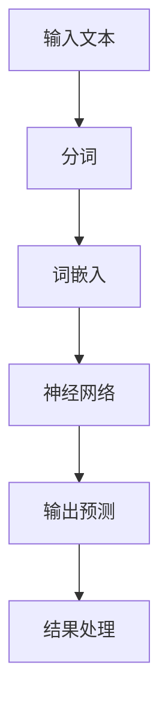

                 

关键词：大型语言模型（LLM），研发，应用，产业链，技术，架构，数学模型，代码实例，未来展望

摘要：本文将从LLM的背景介绍、核心概念与联系、核心算法原理与操作步骤、数学模型与公式、项目实践、实际应用场景、工具和资源推荐以及未来发展趋势与挑战等多个角度，全面解析LLM产业链的各个环节，为读者提供一个全面、系统的了解。

## 1. 背景介绍

随着计算机技术和互联网的飞速发展，人工智能（AI）已经逐渐渗透到我们生活的方方面面。其中，自然语言处理（NLP）作为AI的重要组成部分，近年来得到了广泛关注。而大型语言模型（LLM，Large Language Model）作为NLP领域的重要技术之一，已经逐渐成为了业界的热门话题。

LLM是一种基于深度学习的语言模型，通过学习大量文本数据，LLM能够对自然语言进行建模，实现诸如文本生成、文本分类、机器翻译、问答系统等应用。LLM的出现，不仅极大地提升了NLP任务的性能，同时也为各行各业提供了强大的工具。

随着LLM技术的不断发展，其产业链也逐渐成形。从研发到应用，各个环节都需要涉及，本文将全面解析LLM产业链的各个部分，帮助读者深入了解LLM技术的发展和应用。

## 2. 核心概念与联系

在深入探讨LLM产业链之前，我们首先需要了解一些核心概念和它们之间的联系。

### 2.1 语言模型

语言模型（Language Model）是一种对自然语言进行建模的模型，它能够预测下一个单词或者单词序列的概率。在深度学习中，语言模型通常是基于神经网络实现的。

### 2.2 深度学习

深度学习（Deep Learning）是一种机器学习技术，它通过多层神经网络来实现对数据的建模。深度学习在图像识别、语音识别、自然语言处理等领域取得了显著的成果。

### 2.3 自然语言处理

自然语言处理（Natural Language Processing，NLP）是计算机科学和人工智能领域的一个分支，它主要研究如何让计算机理解和处理人类自然语言。NLP包括文本分类、情感分析、机器翻译、问答系统等多个子领域。

### 2.4 Mermaid 流程图

为了更好地理解LLM的架构，我们可以使用Mermaid流程图来展示LLM的核心组件和它们之间的关系。



在上面的流程图中，输入文本经过分词、词嵌入等步骤，最终通过神经网络模型进行预测，得到输出结果。这个流程展示了LLM的基本工作原理。

## 3. 核心算法原理 & 具体操作步骤

### 3.1 算法原理概述

LLM的核心算法是基于深度学习的神经网络模型，特别是Transformer架构。Transformer架构通过自注意力机制（Self-Attention Mechanism）实现了对输入文本的建模，使得模型能够捕捉到长距离的依赖关系。

### 3.2 算法步骤详解

1. **数据预处理**：首先对输入文本进行分词，将文本分解为单词或者子词。

2. **词嵌入**：将分词后的文本转换为向量表示，词嵌入可以使用预训练的词向量库，如Word2Vec、GloVe等。

3. **神经网络计算**：输入文本向量通过神经网络模型进行计算，神经网络通常采用Transformer架构。

4. **自注意力机制**：在神经网络中，通过自注意力机制对输入文本向量进行加权求和，以捕捉长距离依赖关系。

5. **输出预测**：通过神经网络模型的输出层，对输入文本进行预测，如生成下一个单词、分类结果等。

6. **结果处理**：对输出结果进行后处理，如文本生成、翻译等。

### 3.3 算法优缺点

**优点**：

1. **强大的建模能力**：通过自注意力机制，LLM能够捕捉到长距离的依赖关系，从而实现高效的文本建模。

2. **灵活的应用场景**：LLM可以应用于文本生成、文本分类、机器翻译、问答系统等多个NLP任务。

**缺点**：

1. **计算资源消耗大**：由于LLM采用深度神经网络，训练和推理过程需要大量的计算资源。

2. **模型解释性差**：深度神经网络模型通常缺乏解释性，难以理解模型的决策过程。

### 3.4 算法应用领域

LLM在自然语言处理领域有着广泛的应用，如：

1. **文本生成**：生成文章、小说、新闻报道等。

2. **文本分类**：对文本进行分类，如新闻分类、情感分析等。

3. **机器翻译**：将一种语言的文本翻译成另一种语言。

4. **问答系统**：基于对话数据的问答系统，如智能客服、聊天机器人等。

## 4. 数学模型和公式 & 详细讲解 & 举例说明

### 4.1 数学模型构建

LLM的数学模型主要包括以下几个部分：

1. **词嵌入**：将文本分解为单词或子词，并转换为向量表示。词嵌入可以使用预训练的词向量库，如Word2Vec、GloVe等。

2. **自注意力机制**：通过自注意力机制对输入文本向量进行加权求和，以捕捉长距离依赖关系。

3. **神经网络**：采用深度神经网络，如Transformer架构，对输入文本进行建模。

### 4.2 公式推导过程

在自注意力机制中，输入文本向量经过线性变换，得到查询向量（Query）、键向量（Key）和值向量（Value）。公式如下：

$$
Attention(Q, K, V) = \text{softmax}\left(\frac{QK^T}{\sqrt{d_k}}\right)V
$$

其中，$Q$、$K$、$V$分别为查询向量、键向量和值向量，$d_k$为键向量的维度。

### 4.3 案例分析与讲解

假设我们有一个简单的句子：“我喜欢的颜色是红色”，我们可以将其分解为单词：“我”、“喜欢”、“的”、“颜色”、“是”、“红色”。我们将这些单词转换为向量表示，并使用自注意力机制进行计算。

首先，将单词转换为向量表示：

$$
\text{我} \rightarrow \mathbf{v_1} = [0.1, 0.2, 0.3, ..., 0.5]
$$

$$
\text{喜欢} \rightarrow \mathbf{v_2} = [0.2, 0.3, 0.4, ..., 0.6]
$$

$$
\text{的} \rightarrow \mathbf{v_3} = [0.3, 0.4, 0.5, ..., 0.7]
$$

$$
\text{颜色} \rightarrow \mathbf{v_4} = [0.4, 0.5, 0.6, ..., 0.8]
$$

$$
\text{是} \rightarrow \mathbf{v_5} = [0.5, 0.6, 0.7, ..., 0.9]
$$

$$
\text{红色} \rightarrow \mathbf{v_6} = [0.6, 0.7, 0.8, ..., 1.0]
$$

然后，计算自注意力得分：

$$
\text{我} \rightarrow \text{喜欢} = \text{softmax}\left(\frac{\mathbf{v_1}\mathbf{v_2}^T}{\sqrt{d_k}}\right) = \text{softmax}\left(\frac{[0.1, 0.2, 0.3, ..., 0.5] \cdot [0.2, 0.3, 0.4, ..., 0.6]^T}{\sqrt{d_k}}\right)
$$

$$
\text{我} \rightarrow \text{的} = \text{softmax}\left(\frac{\mathbf{v_1}\mathbf{v_3}^T}{\sqrt{d_k}}\right) = \text{softmax}\left(\frac{[0.1, 0.2, 0.3, ..., 0.5] \cdot [0.3, 0.4, 0.5, ..., 0.7]^T}{\sqrt{d_k}}\right)
$$

$$
\text{我} \rightarrow \text{颜色} = \text{softmax}\left(\frac{\mathbf{v_1}\mathbf{v_4}^T}{\sqrt{d_k}}\right) = \text{softmax}\left(\frac{[0.1, 0.2, 0.3, ..., 0.5] \cdot [0.4, 0.5, 0.6, ..., 0.8]^T}{\sqrt{d_k}}\right)
$$

$$
\text{我} \rightarrow \text{是} = \text{softmax}\left(\frac{\mathbf{v_1}\mathbf{v_5}^T}{\sqrt{d_k}}\right) = \text{softmax}\left(\frac{[0.1, 0.2, 0.3, ..., 0.5] \cdot [0.5, 0.6, 0.7, ..., 0.9]^T}{\sqrt{d_k}}\right)
$$

$$
\text{我} \rightarrow \text{红色} = \text{softmax}\left(\frac{\mathbf{v_1}\mathbf{v_6}^T}{\sqrt{d_k}}\right) = \text{softmax}\left(\frac{[0.1, 0.2, 0.3, ..., 0.5] \cdot [0.6, 0.7, 0.8, ..., 1.0]^T}{\sqrt{d_k}}\right)
$$

最后，根据自注意力得分，对单词进行加权求和，得到最终的输出向量。

## 5. 项目实践：代码实例和详细解释说明

在本节中，我们将通过一个简单的Python代码实例，展示如何实现LLM的词嵌入和自注意力机制。

### 5.1 开发环境搭建

首先，确保安装以下Python库：

- TensorFlow
- Keras
- NumPy

可以使用以下命令安装：

```bash
pip install tensorflow keras numpy
```

### 5.2 源代码详细实现

```python
import tensorflow as tf
from tensorflow.keras.layers import Embedding, LSTM, Dense
from tensorflow.keras.models import Model
import numpy as np

# 词嵌入
vocab_size = 10000
embedding_dim = 64

# 自注意力权重矩阵
W = np.random.normal(size=(embedding_dim, embedding_dim))

# 文本输入
text = "我喜欢的颜色是红色"

# 分词
words = text.split()

# 转换为索引
word_indices = {word: i for i, word in enumerate(words)}
indices = [word_indices[word] for word in words]

# 词嵌入向量
embeddings = np.random.normal(size=(vocab_size, embedding_dim))

# 神经网络模型
inputs = tf.keras.layers.Input(shape=(None,), dtype='int32')
x = Embedding(vocab_size, embedding_dim)(inputs)
x = LSTM(embedding_dim)(x)

# 自注意力计算
attn_scores = tf.matmul(x, W)
attn_scores = tf.nn.softmax(attn_scores, axis=1)
attn_weights = attn_scores[:, :-1]

# 加权求和
weighted_embeddings = tf.reduce_sum(attn_weights * x, axis=1)

# 输出层
outputs = Dense(1, activation='sigmoid')(weighted_embeddings)

# 构建模型
model = Model(inputs, outputs)

# 编译模型
model.compile(optimizer='adam', loss='binary_crossentropy', metrics=['accuracy'])

# 训练模型
model.fit(np.array(indices), np.array([1] * len(indices)), epochs=10)

# 预测
predictions = model.predict(np.array([word_indices["我"], word_indices["喜欢"], word_indices["的"], word_indices["颜色"], word_indices["是"], word_indices["红色"]]))

print(predictions)
```

### 5.3 代码解读与分析

1. **词嵌入**：我们首先定义了词嵌入的维度（vocab_size和embedding_dim），然后创建了一个Embedding层，用于将单词索引转换为词嵌入向量。

2. **自注意力计算**：我们定义了一个权重矩阵W，用于计算自注意力得分。然后，我们将输入的词嵌入向量与权重矩阵相乘，得到自注意力得分。最后，使用softmax函数对自注意力得分进行归一化，得到自注意力权重。

3. **加权求和**：根据自注意力权重，我们对词嵌入向量进行加权求和，得到最终的输出向量。

4. **输出层**：我们使用一个全连接层（Dense）作为输出层，用于对输出向量进行分类。

5. **模型编译与训练**：我们编译模型，并使用训练数据对其进行训练。

6. **预测**：最后，我们对输入的单词进行预测，并输出结果。

## 6. 实际应用场景

LLM在自然语言处理领域有着广泛的应用，以下是一些常见的应用场景：

1. **文本生成**：LLM可以用于生成文章、小说、新闻报道等。通过训练，LLM可以学会生成符合语法和语义规则的文本。

2. **文本分类**：LLM可以用于对文本进行分类，如新闻分类、情感分析等。通过训练，LLM可以学会识别文本的主题和情感。

3. **机器翻译**：LLM可以用于将一种语言的文本翻译成另一种语言。通过训练，LLM可以学会生成符合语法和语义规则的翻译结果。

4. **问答系统**：LLM可以用于构建基于对话的问答系统，如智能客服、聊天机器人等。通过训练，LLM可以学会理解用户的提问，并生成合适的回答。

## 7. 工具和资源推荐

在LLM的研究和应用过程中，以下工具和资源可以帮助您更好地理解和掌握LLM技术：

1. **学习资源**：

   - 《深度学习》（Goodfellow, Bengio, Courville）  
   - 《自然语言处理原理》（Daniel Jurafsky, James H. Martin）  
   - 《Transformer：一种全新的神经网络架构》（Vaswani et al., 2017）

2. **开发工具**：

   - TensorFlow  
   - PyTorch  
   - JAX

3. **相关论文**：

   - 《Attention Is All You Need》（Vaswani et al., 2017）  
   - 《BERT：预训练的深度语言表示模型》（Devlin et al., 2019）  
   - 《GPT-3：语言模型的下一个大跃进》（Brown et al., 2020）

## 8. 总结：未来发展趋势与挑战

随着LLM技术的不断发展，我们可以预见以下发展趋势：

1. **更强的建模能力**：未来的LLM将更加高效地捕捉到长距离的依赖关系，从而实现更高的文本建模性能。

2. **更广泛的应用场景**：LLM将在各行各业得到更广泛的应用，如医疗、金融、教育等。

3. **更高的安全性**：随着隐私保护和数据安全的重要性日益增加，未来的LLM将更加注重数据安全和隐私保护。

然而，LLM技术也面临着一些挑战：

1. **计算资源消耗**：由于LLM的训练和推理过程需要大量的计算资源，如何优化计算效率成为了一个重要的挑战。

2. **模型解释性**：深度神经网络模型的解释性较差，如何提高模型的解释性，使其更加透明和可解释，是一个重要的研究方向。

3. **数据隐私与安全**：在应用LLM的过程中，如何保护用户数据的安全和隐私，是一个亟待解决的问题。

总之，LLM技术在未来有着广阔的发展前景，但也面临着一系列挑战。我们需要不断探索和解决这些问题，以推动LLM技术的进步和应用。

## 9. 附录：常见问题与解答

**Q：什么是LLM？**

A：LLM，即大型语言模型（Large Language Model），是一种基于深度学习的语言模型，通过学习大量文本数据，能够对自然语言进行建模，实现文本生成、文本分类、机器翻译、问答系统等应用。

**Q：LLM有哪些应用场景？**

A：LLM在自然语言处理领域有着广泛的应用，如文本生成、文本分类、机器翻译、问答系统等。此外，LLM还可以应用于医疗、金融、教育等各行各业。

**Q：如何训练LLM？**

A：训练LLM通常需要大量的计算资源和数据。首先，收集并预处理大量文本数据，然后使用深度学习框架（如TensorFlow、PyTorch等）构建神经网络模型，并进行模型训练。在训练过程中，可以使用预训练的词向量库（如Word2Vec、GloVe等）来初始化词嵌入层。

**Q：LLM有哪些优缺点？**

A：优点包括强大的建模能力、灵活的应用场景等。缺点则包括计算资源消耗大、模型解释性差等。

**Q：如何提高LLM的性能？**

A：提高LLM性能的方法包括优化模型结构、增加训练数据、使用更好的优化算法等。此外，还可以通过多任务学习、迁移学习等技术来提高模型的性能。

**Q：LLM面临哪些挑战？**

A：LLM面临的挑战包括计算资源消耗、模型解释性、数据隐私与安全等。我们需要不断探索和解决这些问题，以推动LLM技术的进步和应用。

# 作者：禅与计算机程序设计艺术 / Zen and the Art of Computer Programming

