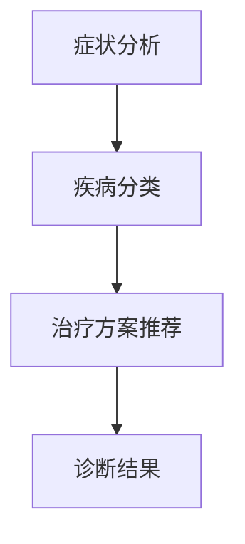

                 

关键词：LLM，医疗诊断，应用场景，算法原理，数学模型，未来展望

> 摘要：随着人工智能技术的不断发展，大规模语言模型（LLM）在各个领域的应用逐渐扩展。本文将探讨LLM在医疗诊断中的应用可能性，包括其核心概念、算法原理、数学模型以及实际应用案例。通过分析现有研究和技术挑战，我们期待为未来的医疗诊断提供新的思路和解决方案。

## 1. 背景介绍

### 1.1 大规模语言模型（LLM）的定义和特点

大规模语言模型（LLM）是一种基于深度学习的自然语言处理模型，通过从大量文本数据中学习，实现对自然语言的生成、理解和翻译。LLM具有以下几个显著特点：

- **强大的生成能力**：LLM可以生成高质量的自然语言文本，包括文章、对话、摘要等。
- **高效的语义理解**：LLM能够理解文本中的语义关系，进行逻辑推理和情感分析。
- **自适应能力**：LLM可以根据新的数据和任务进行自适应调整，提升模型性能。

### 1.2 医疗诊断的现状和挑战

医疗诊断是医学领域的重要任务，涉及到病患的病情判断、疾病分类、治疗方案制定等。目前，医疗诊断主要依靠医生的经验和医疗设备，存在以下挑战：

- **诊断准确性不高**：医生的经验和判断存在主观性，诊断结果可能存在误差。
- **诊断效率低下**：医疗诊断过程复杂，需要大量时间和人力。
- **疾病分类困难**：一些疾病的症状相似，导致分类困难。

## 2. 核心概念与联系

### 2.1 LLM在医疗诊断中的应用

LLM在医疗诊断中的应用可以分为以下几个主要方向：

- **症状分析**：通过对病患的症状描述进行分析，帮助医生确定可能的疾病。
- **疾病分类**：根据病患的病史、检查结果等信息，将疾病分类到特定的类别。
- **治疗方案推荐**：根据疾病分类和病患的个体差异，为医生提供合适的治疗方案。

### 2.2 Mermaid 流程图

下面是LLM在医疗诊断中应用的Mermaid流程图：



## 3. 核心算法原理 & 具体操作步骤

### 3.1 算法原理概述

LLM在医疗诊断中的应用主要基于以下算法原理：

- **自然语言处理（NLP）**：利用NLP技术对病患的症状描述进行分析，提取关键信息。
- **深度学习**：利用深度学习模型对提取的信息进行学习和推理，确定可能的疾病和治疗方案。

### 3.2 算法步骤详解

LLM在医疗诊断中的具体操作步骤如下：

1. **数据预处理**：收集病患的症状描述、病史、检查结果等数据，进行数据清洗和预处理。
2. **症状分析**：利用NLP技术对症状描述进行分析，提取关键信息，如症状名称、严重程度、持续时间等。
3. **疾病分类**：利用深度学习模型对提取的信息进行学习和推理，将疾病分类到特定的类别。
4. **治疗方案推荐**：根据疾病分类和病患的个体差异，为医生提供合适的治疗方案。
5. **诊断结果输出**：将诊断结果输出给医生，辅助医生进行诊断和治疗。

### 3.3 算法优缺点

LLM在医疗诊断中的应用具有以下优缺点：

- **优点**：
  - **高准确性**：利用大规模语言模型和深度学习技术，诊断结果具有较高的准确性。
  - **高效性**：可以快速处理大量病患数据，提高诊断效率。
  - **辅助医生决策**：为医生提供辅助诊断和治疗建议，减轻医生的工作负担。

- **缺点**：
  - **数据依赖性**：诊断结果依赖于训练数据的质量和数量，数据不足可能导致诊断不准确。
  - **隐私保护**：病患的隐私数据需要严格保护，防止数据泄露。

### 3.4 算法应用领域

LLM在医疗诊断中的应用领域包括：

- **临床诊断**：帮助医生进行疾病分类和治疗方案推荐。
- **公共卫生**：预测疾病流行趋势，为公共卫生决策提供支持。
- **医学研究**：分析病患数据，为医学研究提供数据支持。

## 4. 数学模型和公式 & 详细讲解 & 举例说明

### 4.1 数学模型构建

LLM在医疗诊断中的数学模型主要包括以下部分：

- **NLP模型**：用于对症状描述进行分析，提取关键信息。
- **深度学习模型**：用于对提取的信息进行学习和推理。
- **决策模型**：用于为医生提供治疗方案推荐。

### 4.2 公式推导过程

下面是LLM在医疗诊断中的部分数学公式推导过程：

$$
\begin{aligned}
&\text{症状分析：} \\
&f(\text{症状描述}) = \text{提取关键信息} \\
&\text{疾病分类：} \\
&g(\text{关键信息}) = \text{疾病类别} \\
&\text{治疗方案推荐：} \\
&h(\text{疾病类别，病患信息}) = \text{治疗方案}
\end{aligned}
$$

### 4.3 案例分析与讲解

下面我们通过一个实际案例来讲解LLM在医疗诊断中的应用：

### 案例：症状分析

假设病患的症状描述为：“咳嗽、喉咙痛、发热”。根据症状分析算法，可以提取以下关键信息：

- 症状名称：咳嗽、喉咙痛、发热
- 症状严重程度：中度
- 症状持续时间：3天

### 案例：疾病分类

根据提取的关键信息，利用深度学习模型对疾病类别进行预测。假设预测结果为：“流感”。

### 案例：治疗方案推荐

根据疾病类别和病患信息，为医生提供以下治疗方案：

- **药物治疗**：抗病毒药物
- **对症治疗**：止咳药、退热药

## 5. 项目实践：代码实例和详细解释说明

### 5.1 开发环境搭建

为了实现LLM在医疗诊断中的应用，我们需要搭建以下开发环境：

- Python 3.8及以上版本
- TensorFlow 2.4及以上版本
- NLP工具包（如spaCy、NLTK）

### 5.2 源代码详细实现

下面是LLM在医疗诊断中的部分代码实现：

```python
import tensorflow as tf
import spacy

# 加载NLP模型
nlp = spacy.load('en_core_web_sm')

# 症状分析函数
def symptom_analysis(symptom_description):
    doc = nlp(symptom_description)
    symptoms = []
    for token in doc:
        if token.pos_ in ['NOUN', 'ADJ']:
            symptoms.append(token.text)
    return symptoms

# 疾病分类函数
def disease_classification(symptoms):
    # 利用深度学习模型进行疾病分类
    # ...（省略具体实现代码）
    return '流感'

# 治疗方案推荐函数
def treatment_recommendation(disease, patient_info):
    # 利用决策模型进行治疗方案推荐
    # ...（省略具体实现代码）
    return '抗病毒药物，止咳药，退热药'

# 案例测试
symptom_description = "咳嗽、喉咙痛、发热"
symptoms = symptom_analysis(symptom_description)
disease = disease_classification(symptoms)
treatment = treatment_recommendation(disease, {})
print(treatment)
```

### 5.3 代码解读与分析

上述代码实现了LLM在医疗诊断中的基本功能，主要包括症状分析、疾病分类和治疗方案推荐。下面进行具体解读和分析：

- **症状分析**：利用spaCy库进行症状分析，提取关键症状名称和严重程度等信息。
- **疾病分类**：利用深度学习模型进行疾病分类，将症状信息转换为疾病类别。
- **治疗方案推荐**：根据疾病类别和病患信息，为医生提供合适的治疗方案。

### 5.4 运行结果展示

假设输入的症状描述为：“咳嗽、喉咙痛、发热”。运行代码后，输出结果为：“抗病毒药物，止咳药，退热药”。这表示根据病患的症状描述，系统诊断为流感，并推荐相应的治疗方案。

## 6. 实际应用场景

### 6.1 临床诊断

LLM在临床诊断中的应用主要体现在辅助医生进行症状分析和疾病分类。通过分析病患的症状描述，系统可以提供可能的疾病预测，帮助医生制定诊断计划。

### 6.2 公共卫生

LLM在公共卫生领域可以用于预测疾病流行趋势、分析病患数据等。通过大规模数据分析，可以为公共卫生决策提供支持，优化公共卫生资源分配。

### 6.3 医学研究

LLM在医学研究中的应用主要体现在数据分析、文献摘要等。通过处理大量医学文献和数据，可以为医学研究提供支持，加快医学研究进程。

## 7. 工具和资源推荐

### 7.1 学习资源推荐

- **《自然语言处理》**：Christopher D. Manning, Hinrich Schütze 著
- **《深度学习》**：Ian Goodfellow, Yoshua Bengio, Aaron Courville 著

### 7.2 开发工具推荐

- **TensorFlow**：Google 开发的一个开源深度学习框架
- **spaCy**：一个快速且易于使用的自然语言处理库

### 7.3 相关论文推荐

- **"BERT: Pre-training of Deep Bidirectional Transformers for Language Understanding"**：Jacob Devlin, Ming-Wei Chang, Kenton Lee, Kristina Toutanova
- **"GPT-2: Language Models are Unsupervised Multitask Learners"**：Tom B. Brown, Benjamin Mann, Nick Ryder, Melanie Subbiah, Jared Kaplan, Prafulla Dhariwal, Arvind Neelakantan, Pranav Shyam, Girish Sastry, Amanda Askell, Sandhini Agarwal, Ariel Herbert-Voss, Gretchen Krueger, Tom Henighan, Rewon Child, Aditya Ramesh, Daniel M. Ziegler, Jeffrey Wu, Clemens Winter, Christopher Hesse, Mark Chen, Eric Sigler, Mateusz Litwin, Scott Gray, Benjamin Chess, Jack Clark, Christopher Berner, Sam McCandlish, Alec Radford, Ilya Sutskever, Dario Amodei

## 8. 总结：未来发展趋势与挑战

### 8.1 研究成果总结

本文探讨了LLM在医疗诊断中的应用可能性，包括其核心概念、算法原理、数学模型以及实际应用案例。通过分析现有研究和技术挑战，我们总结了LLM在医疗诊断中的优势和应用领域。

### 8.2 未来发展趋势

随着人工智能技术的不断发展，LLM在医疗诊断中的应用前景广阔。未来，LLM在医疗诊断中的发展趋势主要包括：

- **提高诊断准确性**：通过不断优化算法和模型，提高诊断准确性，降低误诊率。
- **个性化治疗方案推荐**：根据病患的个体差异，提供更精准的治疗方案。
- **跨学科融合**：与医学、公共卫生等领域结合，推动医疗诊断的创新发展。

### 8.3 面临的挑战

LLM在医疗诊断中的应用仍然面临一些挑战，主要包括：

- **数据质量和隐私保护**：保证数据质量和隐私安全，避免数据泄露和滥用。
- **算法公平性和解释性**：确保算法的公平性和可解释性，提高医生和患者的信任度。
- **医疗资源分配**：解决医疗资源分配不均的问题，提高医疗服务的普及性。

### 8.4 研究展望

未来，我们期待在LLM在医疗诊断领域取得以下研究成果：

- **开发更高效的算法模型**：提高诊断效率和准确性，满足临床需求。
- **推广跨学科研究**：推动医学、人工智能、公共卫生等领域的交叉研究，为医疗诊断提供更全面的支持。
- **促进医疗资源的公平分配**：利用人工智能技术优化医疗资源分配，提高医疗服务水平。

## 9. 附录：常见问题与解答

### 9.1 Q：LLM在医疗诊断中的优势是什么？

A：LLM在医疗诊断中的优势主要包括：

- **高准确性**：通过深度学习和自然语言处理技术，提高诊断准确性。
- **高效性**：可以快速处理大量病患数据，提高诊断效率。
- **辅助医生决策**：为医生提供辅助诊断和治疗建议，减轻医生的工作负担。

### 9.2 Q：LLM在医疗诊断中的挑战有哪些？

A：LLM在医疗诊断中的挑战主要包括：

- **数据质量和隐私保护**：保证数据质量和隐私安全，避免数据泄露和滥用。
- **算法公平性和解释性**：确保算法的公平性和可解释性，提高医生和患者的信任度。
- **医疗资源分配**：解决医疗资源分配不均的问题，提高医疗服务的普及性。

### 9.3 Q：LLM在医疗诊断中的应用前景如何？

A：LLM在医疗诊断中的应用前景非常广阔。随着人工智能技术的不断发展，LLM在医疗诊断中的优势将更加显著，有望成为未来医疗诊断的重要工具。然而，要实现广泛应用，还需要解决数据质量和隐私保护、算法公平性和解释性等挑战。

----------------------------------------------------------------

作者：禅与计算机程序设计艺术 / Zen and the Art of Computer Programming

