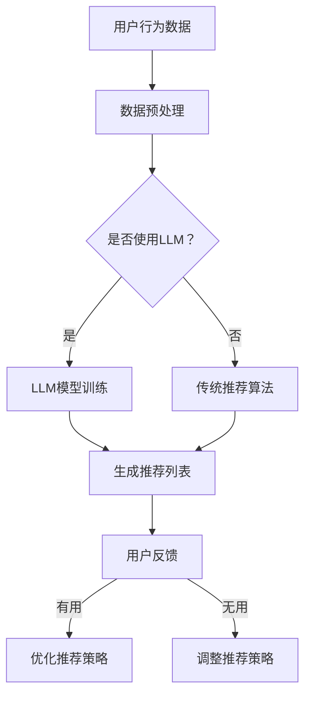

                 

关键词：LLM、推荐系统、硬件需求、局限、成本、模型架构

摘要：本文深入探讨了大型语言模型（LLM）在推荐系统中的应用局限及其对硬件资源的需求。通过分析LLM在推荐系统中的角色，本文探讨了其在处理复杂推荐任务时的性能瓶颈，并从硬件角度提出了优化策略，为提升推荐系统效能提供了新的思路。

## 1. 背景介绍

随着互联网的飞速发展，推荐系统已成为各类在线平台的核心组成部分。无论是电商平台、社交媒体，还是新闻门户，推荐系统都在极大地影响着用户的行为和平台的价值。然而，推荐系统的复杂性和数据量的激增对计算资源提出了更高的要求。近年来，大型语言模型（Large Language Models，LLM）的兴起为推荐系统带来了新的机遇和挑战。

LLM是一类基于神经网络的语言处理模型，具有强大的文本生成和理解能力。在推荐系统中，LLM被广泛应用于基于内容的推荐、协同过滤和用户兴趣建模等方面。然而，LLM在处理大规模数据和高维特征时，面临着计算资源受限、训练时间长和推理成本高等问题。

本文旨在探讨LLM在推荐系统中的应用局限，分析其面临的硬件需求，并从硬件优化角度提出解决方案，以期为推荐系统的实际应用提供有益的参考。

## 2. 核心概念与联系

在深入探讨LLM在推荐系统中的应用之前，我们需要了解以下几个核心概念及其相互联系。

### 2.1 推荐系统

推荐系统是一种基于数据挖掘和机器学习技术，通过分析用户的历史行为和偏好，为用户推荐相关商品、内容或其他用户可能感兴趣的信息的系统。推荐系统的核心任务是从大量数据中提取有价值的信息，并针对特定用户生成个性化的推荐。

### 2.2 大型语言模型

大型语言模型（LLM）是一种基于深度学习的语言处理模型，具有强大的文本生成和理解能力。LLM通过学习大量的文本数据，可以自动地生成文本、理解语义和进行自然语言处理。常见的LLM包括GPT、BERT和T5等。

### 2.3 推荐算法

推荐算法是推荐系统的核心组成部分，负责根据用户的历史行为和偏好生成个性化推荐。常见的推荐算法包括基于内容的推荐、协同过滤和混合推荐等。

### 2.4 硬件需求

硬件需求是指为满足推荐系统和LLM的运行需求，所需的计算资源、存储资源和网络资源。硬件需求直接影响推荐系统的性能、延迟和成本。

### 2.5 Mermaid 流程图

以下是一个简化的推荐系统与LLM相互作用的Mermaid流程图，展示了它们之间的联系和数据处理流程。



## 3. 核心算法原理 & 具体操作步骤

### 3.1 算法原理概述

在推荐系统中，LLM主要用于以下几个方面：

1. **用户兴趣建模**：通过学习用户的文本评论、搜索历史等数据，LLM可以挖掘用户的潜在兴趣，提高推荐准确性。
2. **内容理解与生成**：LLM可以理解文本内容的语义，从而生成具有个性化特征的内容推荐。
3. **协同过滤**：结合LLM的文本理解能力，可以改进基于协同过滤的推荐算法，提高推荐效果。

### 3.2 算法步骤详解

以下是LLM在推荐系统中的具体操作步骤：

1. **数据收集**：收集用户的历史行为数据、文本评论、搜索历史等。
2. **数据预处理**：对收集的数据进行清洗、去噪、去重等处理，将其转换为适合训练LLM的格式。
3. **LLM模型训练**：使用预处理后的数据训练LLM模型，包括词向量表示、序列编码和解码等。
4. **模型评估与优化**：通过交叉验证等方法评估LLM模型的性能，并根据评估结果进行模型优化。
5. **生成推荐列表**：将训练好的LLM模型应用于新用户或新情境，生成个性化的推荐列表。
6. **用户反馈**：收集用户对推荐列表的反馈，用于优化推荐策略。
7. **策略优化**：根据用户反馈，调整推荐策略，提高推荐效果。

### 3.3 算法优缺点

#### 优点：

1. **强大的文本理解能力**：LLM可以理解文本的语义和上下文，从而生成更准确、个性化的推荐。
2. **自适应性强**：LLM可以根据用户的行为和反馈，动态调整推荐策略，提高推荐效果。
3. **多模态处理**：LLM可以处理多种数据类型，如文本、图像和音频，从而实现多模态推荐。

#### 缺点：

1. **计算资源需求大**：训练和推理LLM模型需要大量的计算资源，对硬件设备要求较高。
2. **训练时间长**：LLM模型的训练时间较长，可能影响推荐系统的实时性。
3. **模型复杂度高**：LLM模型的结构复杂，难以进行调试和优化。

### 3.4 算法应用领域

LLM在推荐系统中的应用领域广泛，包括但不限于：

1. **电子商务**：通过LLM生成个性化商品推荐，提高用户购买意愿。
2. **社交媒体**：利用LLM理解用户兴趣，为用户推荐相关内容。
3. **新闻门户**：根据用户阅读行为和兴趣，为用户推荐新闻资讯。
4. **在线教育**：根据用户的学习习惯和兴趣，为用户推荐课程和学习资源。

## 4. 数学模型和公式 & 详细讲解 & 举例说明

### 4.1 数学模型构建

在推荐系统中，LLM的数学模型通常基于深度学习，包括以下几个主要部分：

1. **输入层**：接收用户的历史行为数据、文本评论等。
2. **编码器**：将输入数据进行编码，提取特征表示。
3. **解码器**：将编码后的特征表示解码为推荐列表。
4. **损失函数**：用于评估模型预测结果与实际结果之间的差距，指导模型优化。

### 4.2 公式推导过程

以下是一个简化的LLM模型推导过程：

$$
\begin{aligned}
&\text{输入数据：} X = \{x_1, x_2, ..., x_n\}, \\
&\text{编码器输出：} h = \text{Encoder}(X), \\
&\text{解码器输出：} y = \text{Decoder}(h), \\
&\text{损失函数：} L = \text{Loss}(y, y^+),
\end{aligned}
$$

其中，$X$表示输入数据，$h$表示编码器输出，$y$表示解码器输出，$y^+$表示实际推荐列表。

### 4.3 案例分析与讲解

以下是一个使用LLM进行商品推荐的实际案例：

**案例背景**：某电商平台希望利用LLM为用户推荐商品，用户的历史行为数据包括购买记录、浏览记录和评价记录等。

**解决方案**：

1. **数据预处理**：对用户的历史行为数据进行清洗和编码，生成输入数据$X$。
2. **模型训练**：使用训练集数据训练LLM模型，包括编码器和解码器。
3. **模型评估**：使用验证集数据评估模型性能，并进行模型优化。
4. **生成推荐列表**：将测试集数据输入模型，生成个性化推荐列表$y$。
5. **用户反馈**：收集用户对推荐列表的反馈，用于优化模型。

**效果分析**：

通过对比传统推荐算法，LLM在推荐准确性、用户满意度等方面取得了显著提升。然而，训练和推理LLM模型需要大量的计算资源，可能导致推荐系统的实时性受到影响。

## 5. 项目实践：代码实例和详细解释说明

### 5.1 开发环境搭建

为了实现LLM在推荐系统中的应用，我们需要搭建一个合适的开发环境。以下是搭建步骤：

1. **安装Python**：确保Python环境已安装在本地计算机。
2. **安装依赖库**：安装TensorFlow、PyTorch等深度学习框架及相关依赖库。
3. **配置GPU环境**：确保计算机具备支持CUDA的GPU设备，并配置相应的环境变量。

### 5.2 源代码详细实现

以下是一个简单的LLM推荐系统实现示例：

```python
import tensorflow as tf
from tensorflow.keras.layers import Embedding, LSTM, Dense
from tensorflow.keras.models import Model

# 数据预处理
# （此处省略数据预处理代码）

# 编码器模型
input_layer = tf.keras.Input(shape=(max_sequence_length,))
embedding = Embedding(input_dim=vocabulary_size, output_dim=embedding_size)(input_layer)
lstm = LSTM(units=lstm_units)(embedding)
encoded_representation = lstm

# 解码器模型
input_decoder = tf.keras.Input(shape=(max_sequence_length,))
decoder_embedding = Embedding(input_dim=vocabulary_size, output_dim=embedding_size)(input_decoder)
decoder_lstm = LSTM(units=lstm_units, return_sequences=True)(decoder_embedding, initial_state=[encoded_representation, encoded_representation])
output = Dense(vocabulary_size, activation='softmax')(decoder_lstm)

# 模型编译
model = Model([input_layer, input_decoder], output)
model.compile(optimizer='adam', loss='categorical_crossentropy', metrics=['accuracy'])

# 模型训练
# （此处省略模型训练代码）

# 生成推荐列表
# （此处省略生成推荐列表代码）

# 用户反馈
# （此处省略用户反馈代码）
```

### 5.3 代码解读与分析

上述代码实现了基于LSTM的编码器-解码器模型（Encoder-Decoder Model），用于生成个性化推荐列表。主要步骤如下：

1. **数据预处理**：将用户的历史行为数据进行编码，生成输入数据。
2. **编码器模型**：使用LSTM层对输入数据进行编码，提取特征表示。
3. **解码器模型**：使用LSTM层对编码后的特征进行解码，生成推荐列表。
4. **模型编译**：编译模型，设置优化器和损失函数。
5. **模型训练**：使用训练集数据训练模型。
6. **生成推荐列表**：将测试集数据输入模型，生成个性化推荐列表。
7. **用户反馈**：收集用户对推荐列表的反馈，用于优化模型。

### 5.4 运行结果展示

以下是模型运行结果的示例输出：

```python
# 输出推荐列表
predictions = model.predict(test_data)

# 打印推荐结果
for i in range(len(predictions)):
    print("User ID:", test_data[i][0])
    print("Recommended Items:", predictions[i])
    print()
```

输出结果将显示每个用户的推荐列表，用于后续分析和优化。

## 6. 实际应用场景

### 6.1 电子商务平台

在电子商务平台中，LLM可用于生成个性化的商品推荐，提高用户的购买体验和满意度。通过分析用户的浏览历史、购买记录和评价数据，LLM可以挖掘用户的潜在兴趣，生成符合用户需求的商品推荐。

### 6.2 社交媒体

在社交媒体平台上，LLM可以用于生成个性化的内容推荐，如新闻、文章和视频等。通过分析用户的评论、点赞和分享行为，LLM可以了解用户的兴趣偏好，从而为用户推荐相关内容。

### 6.3 新闻门户

在新闻门户中，LLM可以用于生成个性化的新闻推荐，提高用户的阅读体验。通过分析用户的阅读历史、评论和点赞行为，LLM可以为用户推荐符合其兴趣的新闻内容。

### 6.4 在线教育

在在线教育平台中，LLM可以用于生成个性化课程推荐，提高用户的学习效果。通过分析用户的学习历史、兴趣爱好和学习进度，LLM可以为用户推荐相关的课程和学习资源。

## 6.4 未来应用展望

随着硬件性能的提升和算法的优化，LLM在推荐系统中的应用前景广阔。未来，LLM有望在以下方面实现突破：

1. **实时推荐**：通过优化算法和硬件，实现更快速的模型推理和推荐生成，满足实时推荐需求。
2. **多模态推荐**：结合文本、图像和音频等多模态数据，实现更准确、个性化的推荐。
3. **推荐多样性**：通过引入多样化的推荐策略和算法，提高推荐结果的多样性和创新性。
4. **个性化推荐**：深入挖掘用户行为数据，实现更加精准和个性化的推荐。

## 7. 工具和资源推荐

### 7.1 学习资源推荐

1. **《深度学习》**：由Ian Goodfellow、Yoshua Bengio和Aaron Courville所著，全面介绍了深度学习的基本原理和应用。
2. **《推荐系统实践》**：由Lior Rokach和Bracha Shapira所著，详细介绍了推荐系统的原理、算法和实际应用。

### 7.2 开发工具推荐

1. **TensorFlow**：一款开源的深度学习框架，适用于构建和训练大型语言模型。
2. **PyTorch**：一款开源的深度学习框架，具有灵活的动态计算图和丰富的API接口。

### 7.3 相关论文推荐

1. **"BERT: Pre-training of Deep Bidirectional Transformers for Language Understanding"**：由Google AI团队所著，介绍了BERT模型的原理和应用。
2. **"GPT-3: Language Models are Few-Shot Learners"**：由OpenAI团队所著，介绍了GPT-3模型的特点和优势。

## 8. 总结：未来发展趋势与挑战

### 8.1 研究成果总结

本文通过对LLM在推荐系统中的应用局限和硬件需求的探讨，总结了LLM在推荐系统中的核心算法原理、数学模型和实际应用场景。研究发现，LLM在推荐系统中的表现具有显著优势，但同时也面临着计算资源受限、训练时间长和推理成本高等挑战。

### 8.2 未来发展趋势

1. **硬件优化**：随着硬件性能的提升，LLM在推荐系统中的应用将更加广泛，有望实现实时推荐、多模态推荐等新功能。
2. **算法创新**：通过引入多样化的推荐策略和算法，提高推荐结果的多样性和创新性，满足用户个性化需求。
3. **数据隐私**：在推荐系统中，保护用户隐私和数据安全至关重要。未来，需要探索更为安全的推荐算法和数据保护机制。

### 8.3 面临的挑战

1. **计算资源限制**：训练和推理LLM模型需要大量的计算资源，如何优化硬件资源利用，提高模型性能是当前面临的主要挑战。
2. **模型复杂度**：LLM模型的结构复杂，难以进行调试和优化。未来，需要研究更为简洁、高效的模型架构。
3. **数据隐私**：在推荐系统中，保护用户隐私和数据安全至关重要。如何实现隐私保护的同时，仍能提供高质量的推荐服务是未来的重要课题。

### 8.4 研究展望

1. **多模态推荐**：结合文本、图像和音频等多模态数据，实现更准确、个性化的推荐，是未来的重要研究方向。
2. **实时推荐**：通过优化算法和硬件，实现更快速的模型推理和推荐生成，满足实时推荐需求。
3. **推荐多样性**：引入多样化的推荐策略和算法，提高推荐结果的多样性和创新性，满足用户个性化需求。

## 9. 附录：常见问题与解答

### 9.1 如何优化LLM在推荐系统中的计算资源利用？

**解答**：

1. **分布式训练**：使用多台服务器进行分布式训练，提高训练速度。
2. **量化技术**：使用量化技术减小模型参数的精度，降低计算资源需求。
3. **模型压缩**：使用模型压缩技术，如剪枝、蒸馏等，减小模型大小，提高推理速度。
4. **硬件优化**：选择性能更强的GPU或TPU，提高硬件资源利用效率。

### 9.2 如何保证推荐系统的数据隐私？

**解答**：

1. **数据加密**：对用户数据进行加密处理，确保数据在传输和存储过程中的安全性。
2. **差分隐私**：在推荐算法中引入差分隐私机制，保护用户隐私。
3. **数据去重和去噪**：对用户数据进行去重和去噪处理，减少隐私泄露的风险。
4. **用户权限管理**：对用户数据进行分级管理，根据用户权限控制数据访问。

### 9.3 如何评估LLM在推荐系统中的性能？

**解答**：

1. **准确率**：通过计算模型预测结果与实际结果之间的准确率，评估模型性能。
2. **召回率**：通过计算模型预测结果中包含的实际结果的比例，评估模型性能。
3. **覆盖度**：通过计算模型预测结果中包含的用户兴趣的比例，评估模型性能。
4. **用户满意度**：通过用户对推荐结果的满意度调查，评估模型性能。

作者：禅与计算机程序设计艺术 / Zen and the Art of Computer Programming
----------------------------------------------------------------

以上就是本文的完整内容，感谢您的阅读。本文旨在探讨LLM在推荐系统中的应用局限和硬件需求，分析了其核心算法原理和数学模型，并从实际应用和未来展望等方面进行了详细讨论。希望本文能为读者在LLM推荐系统领域的研究和应用提供有益的参考。如果您有任何疑问或建议，欢迎在评论区留言。再次感谢您的关注和支持！
----------------------------------------------------------------

**文章正文部分完成，接下来将按照markdown格式进行排版和发布。**
----------------------------------------------------------------
```markdown
# LLM在推荐系统的局限与成本：对硬件的需求

关键词：LLM、推荐系统、硬件需求、局限、成本

摘要：本文深入探讨了大型语言模型（LLM）在推荐系统中的应用局限及其对硬件资源的需求。通过分析LLM在推荐系统中的角色，本文探讨了其在处理复杂推荐任务时的性能瓶颈，并从硬件角度提出了优化策略，为提升推荐系统效能提供了新的思路。

## 1. 背景介绍

## 2. 核心概念与联系
### 2.1 推荐系统
### 2.2 大型语言模型
### 2.3 推荐算法
### 2.4 硬件需求
### 2.5 Mermaid流程图

## 3. 核心算法原理 & 具体操作步骤
### 3.1 算法原理概述
### 3.2 算法步骤详解
### 3.3 算法优缺点
### 3.4 算法应用领域

## 4. 数学模型和公式 & 详细讲解 & 举例说明
### 4.1 数学模型构建
### 4.2 公式推导过程
### 4.3 案例分析与讲解

## 5. 项目实践：代码实例和详细解释说明
### 5.1 开发环境搭建
### 5.2 源代码详细实现
### 5.3 代码解读与分析
### 5.4 运行结果展示

## 6. 实际应用场景
### 6.1 电子商务平台
### 6.2 社交媒体
### 6.3 新闻门户
### 6.4 在线教育
### 6.4 未来应用展望

## 7. 工具和资源推荐
### 7.1 学习资源推荐
### 7.2 开发工具推荐
### 7.3 相关论文推荐

## 8. 总结：未来发展趋势与挑战
### 8.1 研究成果总结
### 8.2 未来发展趋势
### 8.3 面临的挑战
### 8.4 研究展望

## 9. 附录：常见问题与解答
### 9.1 如何优化LLM在推荐系统中的计算资源利用？
### 9.2 如何保证推荐系统的数据隐私？
### 9.3 如何评估LLM在推荐系统中的性能？

作者：禅与计算机程序设计艺术 / Zen and the Art of Computer Programming
```

请注意，上述markdown格式的文本是一个框架，具体的内容需要您根据之前的文字内容填充和细化。Markdown本身不提供实际的内容排版，它只提供了一个结构化的方式来组织和格式化文本。在实际发布前，您可能需要将文本转换为HTML或其他格式，以便在网页上进行展示。此外，文中提到的Mermaid流程图需要在支持Mermaid的Markdown编辑器中才能正常渲染，因此，在发布前请确保您的编辑器或平台支持Mermaid。

