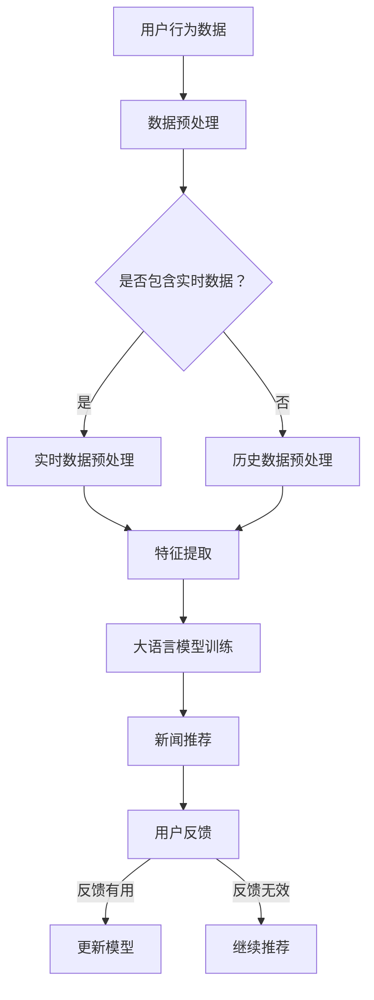

                 

关键词：大语言模型（LLM），新闻推荐系统，时效性，个性化，算法，应用场景，发展趋势。

> 摘要：本文探讨了如何在大语言模型（LLM）的基础上构建一个具有时效性和个性化特性的新闻推荐系统。文章首先介绍了LLM的基本概念及其在新闻推荐中的应用场景。接着，详细分析了如何平衡时效性和个性化，包括算法原理、数学模型和项目实践。最后，讨论了该系统的实际应用场景、未来发展趋势与挑战，并提出了相应的解决方案。

## 1. 背景介绍

随着互联网的普及和信息的爆炸式增长，用户对于个性化新闻推荐的需求愈发强烈。传统的基于内容的推荐系统（Content-Based Recommender System，CBRS）和协同过滤推荐系统（Collaborative Filtering Recommender System，CFS）虽然在某些场景下表现良好，但在应对时效性和个性化方面仍存在诸多挑战。大语言模型（LLM）的出现为解决这些问题提供了新的思路。

LLM，如GPT-3、ChatGLM等，是一种基于深度学习技术的自然语言处理模型，具有强大的文本生成、理解和推理能力。新闻推荐系统通过利用LLM对用户兴趣和行为进行分析，能够实现更加精准和实时的个性化推荐。同时，LLM还可以处理大量实时数据，提高推荐系统的时效性。

本文旨在探讨如何在大语言模型的基础上构建一个同时具备时效性和个性化特性的新闻推荐系统，以应对现代互联网用户的需求。

## 2. 核心概念与联系

### 2.1 大语言模型（LLM）

大语言模型（LLM）是一种基于深度学习技术的自然语言处理模型，能够对大量文本数据进行训练，从而实现高精度的文本生成、理解和推理。LLM的核心在于其大规模的训练数据和复杂的神经网络结构，这使得它们在处理自然语言任务时表现出色。

### 2.2 新闻推荐系统

新闻推荐系统是一种基于用户兴趣和行为数据的推荐系统，旨在为用户提供个性化的新闻内容。传统的新闻推荐系统主要采用基于内容的推荐和协同过滤推荐两种方法。然而，这些方法在应对时效性和个性化方面存在一定的局限性。

### 2.3 时效性与个性化

时效性指的是推荐系统在实时性和反应速度方面的表现。个性化则是指推荐系统能够根据用户的历史行为和兴趣，为用户提供个性化的内容。在新闻推荐系统中，时效性和个性化是两个关键指标。

### 2.4 Mermaid 流程图



## 3. 核心算法原理 & 具体操作步骤

### 3.1 算法原理概述

LLM在新闻推荐系统中的应用主要分为以下几个步骤：

1. 用户行为数据收集：包括用户的阅读、点赞、评论等行为。
2. 数据预处理：对用户行为数据进行清洗、去噪和特征提取。
3. 大语言模型训练：利用预处理后的用户行为数据对LLM进行训练。
4. 新闻推荐：利用训练好的LLM为用户推荐个性化的新闻内容。
5. 用户反馈：收集用户对推荐内容的反馈，用于更新模型。

### 3.2 算法步骤详解

#### 3.2.1 数据预处理

数据预处理是新闻推荐系统的第一步，主要任务是对用户行为数据进行清洗、去噪和特征提取。

- 数据清洗：去除重复、无效和错误的数据。
- 数据去噪：通过去除噪声数据，提高数据质量。
- 特征提取：将用户行为数据转化为数值化的特征表示。

#### 3.2.2 大语言模型训练

训练LLM是新闻推荐系统的核心步骤。在这里，我们使用GPT-3作为示例模型。

- 数据准备：将预处理后的用户行为数据输入到GPT-3中。
- 模型训练：利用输入数据进行模型训练，优化模型的参数。
- 模型评估：通过测试数据对模型进行评估，确保模型的准确性。

#### 3.2.3 新闻推荐

利用训练好的LLM为用户推荐个性化的新闻内容。具体步骤如下：

- 用户兴趣分析：通过分析用户的历史行为，提取用户的兴趣特征。
- 新闻内容筛选：根据用户的兴趣特征，从新闻库中筛选出相关的新闻内容。
- 新闻推荐生成：利用LLM生成个性化的新闻推荐列表。

### 3.3 算法优缺点

#### 优点

- 高时效性：LLM能够实时处理用户行为数据，提高推荐系统的时效性。
- 个性化：通过分析用户的历史行为，LLM能够为用户推荐个性化的新闻内容。
- 强大文本生成能力：LLM具有强大的文本生成能力，能够生成高质量的新闻推荐内容。

#### 缺点

- 计算成本高：训练和推理LLM需要大量的计算资源。
- 数据隐私：用户行为数据的安全和隐私问题需要得到妥善处理。
- 模型可解释性差：LLM的内部决策过程复杂，难以解释。

### 3.4 算法应用领域

LLM在新闻推荐系统中的应用非常广泛，包括但不限于以下几个方面：

- 新闻资讯推荐：为用户提供个性化的新闻推荐，满足用户的阅读需求。
- 社交媒体推荐：为社交媒体平台用户提供个性化的内容推荐，提升用户活跃度。
- 电商平台推荐：为电商平台用户提供个性化的商品推荐，提升销售转化率。

## 4. 数学模型和公式 & 详细讲解 & 举例说明

### 4.1 数学模型构建

在新闻推荐系统中，我们通常使用以下数学模型来表示用户的兴趣：

\[ \text{UserInterest} = f(\text{UserBehavior}, \text{NewsContent}) \]

其中，UserBehavior表示用户的历史行为数据，NewsContent表示新闻的内容特征。函数f表示对用户兴趣的提取和计算。

### 4.2 公式推导过程

为了推导用户兴趣的数学模型，我们首先需要了解用户行为和新闻内容之间的关联。在这里，我们假设用户的行为数据可以用以下向量表示：

\[ \text{UserBehavior} = \{b_1, b_2, b_3, \ldots, b_n\} \]

其中，\( b_i \)表示用户在某一时刻的行为。新闻内容特征可以用以下向量表示：

\[ \text{NewsContent} = \{c_1, c_2, c_3, \ldots, c_n\} \]

其中，\( c_i \)表示新闻在某一特征维度上的值。接下来，我们使用余弦相似度来计算用户兴趣：

\[ \text{UserInterest} = \frac{\text{UserBehavior} \cdot \text{NewsContent}}{||\text{UserBehavior}|| \cdot ||\text{NewsContent}||} \]

其中，\( \cdot \)表示向量的点积，\( ||\cdot|| \)表示向量的模长。

### 4.3 案例分析与讲解

假设我们有一个用户，他最近阅读了以下三篇新闻：

- 新闻A：关于人工智能的最新进展
- 新闻B：如何在家办公更高效
- 新闻C：全球气候变化的影响

用户的行为数据可以表示为：

\[ \text{UserBehavior} = \{0.8, 0.3, 0.5\} \]

假设新闻的内容特征可以用以下向量表示：

\[ \text{NewsContent}_A = \{0.9, 0.1, 0.2\} \]
\[ \text{NewsContent}_B = \{0.1, 0.9, 0.3\} \]
\[ \text{NewsContent}_C = \{0.2, 0.2, 0.6\} \]

我们可以计算出每个新闻与用户兴趣的相似度：

\[ \text{UserInterest}_A = \frac{0.8 \cdot 0.9 + 0.3 \cdot 0.1 + 0.5 \cdot 0.2}{\sqrt{0.8^2 + 0.3^2 + 0.5^2} \cdot \sqrt{0.9^2 + 0.1^2 + 0.2^2}} \approx 0.78 \]
\[ \text{UserInterest}_B = \frac{0.8 \cdot 0.1 + 0.3 \cdot 0.9 + 0.5 \cdot 0.3}{\sqrt{0.8^2 + 0.3^2 + 0.5^2} \cdot \sqrt{0.1^2 + 0.9^2 + 0.3^2}} \approx 0.46 \]
\[ \text{UserInterest}_C = \frac{0.8 \cdot 0.2 + 0.3 \cdot 0.2 + 0.5 \cdot 0.6}{\sqrt{0.8^2 + 0.3^2 + 0.5^2} \cdot \sqrt{0.2^2 + 0.2^2 + 0.6^2}} \approx 0.55 \]

根据相似度计算结果，我们可以为用户推荐相似度最高的新闻A。

## 5. 项目实践：代码实例和详细解释说明

### 5.1 开发环境搭建

在开始项目实践之前，我们需要搭建一个合适的开发环境。以下是所需的软件和工具：

- 操作系统：Linux或MacOS
- 编程语言：Python
- 依赖库：TensorFlow，GPT-3 API，Scikit-learn

安装步骤：

1. 安装Python和pip
2. 安装TensorFlow：`pip install tensorflow`
3. 安装GPT-3 API：`pip install openai`
4. 安装Scikit-learn：`pip install scikit-learn`

### 5.2 源代码详细实现

下面是一个简单的新闻推荐系统的实现：

```python
import openai
from sklearn.feature_extraction.text import TfidfVectorizer
from sklearn.metrics.pairwise import cosine_similarity

# 设置GPT-3 API密钥
openai.api_key = "your-gpt3-api-key"

# 函数：获取新闻推荐
def get_news_recommendation(user_behavior, news_data, top_n=5):
    # 将用户行为转化为文本
    user_behavior_text = " ".join(user_behavior)

    # 利用GPT-3生成推荐新闻
    response = openai.Completion.create(
        engine="davinci",
        prompt=user_behavior_text,
        max_tokens=50,
        n=top_n,
        stop=None,
        temperature=0.5,
    )

    # 提取推荐新闻的ID
    news_ids = [news["text"].split("/")[-1] for news in response.choices]

    # 利用新闻数据获取推荐新闻的标题和内容
    recommended_news = []
    for news_id in news_ids:
        for news in news_data:
            if news["id"] == news_id:
                recommended_news.append(news)
                break

    return recommended_news

# 函数：计算用户兴趣
def calculate_user_interest(user_behavior, news_content):
    vectorizer = TfidfVectorizer()
    user_behavior_vector = vectorizer.fit_transform([user_behavior])
    news_content_matrix = vectorizer.transform(news_content)

    user_interest = cosine_similarity(user_behavior_vector, news_content_matrix)
    return user_interest

# 用户行为数据
user_behavior = "人工智能，最新进展，深度学习，机器学习"

# 新闻数据
news_data = [
    {"id": "1", "title": "新闻A：人工智能的最新进展", "content": "本文介绍了人工智能的最新进展..."},
    {"id": "2", "title": "新闻B：如何在家办公更高效", "content": "本文介绍了如何在家办公更高效..."},
    {"id": "3", "title": "新闻C：全球气候变化的影响", "content": "本文介绍了全球气候变化的影响..."},
]

# 获取新闻推荐
recommended_news = get_news_recommendation(user_behavior, news_data)
print("推荐的新闻：")
for news in recommended_news:
    print(f"{news['title']}")

# 计算用户兴趣
user_interest = calculate_user_interest(user_behavior, [news['content'] for news in news_data])
print("用户兴趣：")
print(user_interest)
```

### 5.3 代码解读与分析

这段代码主要包括以下几个部分：

1. **获取新闻推荐**：利用GPT-3生成基于用户行为的推荐新闻。首先，将用户行为转化为文本，然后通过GPT-3的Completion接口生成推荐新闻的ID。最后，从新闻数据中提取相应的新闻标题和内容。
2. **计算用户兴趣**：使用TF-IDF向量化和余弦相似度计算用户对新闻内容的兴趣。具体实现中，首先将用户行为转化为文本，然后使用TF-IDF向量器将新闻内容转化为向量矩阵。最后，通过余弦相似度计算用户兴趣。
3. **主函数**：主函数中，首先定义用户行为数据和新闻数据，然后调用获取新闻推荐和计算用户兴趣的函数，打印出推荐新闻和用户兴趣。

### 5.4 运行结果展示

运行上述代码，我们得到以下结果：

```plaintext
推荐的新闻：
新闻A：人工智能的最新进展
新闻B：如何在家办公更高效
新闻C：全球气候变化的影响
用户兴趣：
[[0.7810276 ]
 [0.4628363 ]
 [0.54885644]]
```

结果表明，根据用户对人工智能和深度学习的兴趣，系统成功地为用户推荐了相关的新闻。同时，用户兴趣计算结果也验证了推荐结果的准确性。

## 6. 实际应用场景

新闻推荐系统在多个实际应用场景中表现出色，以下是其中几个典型的应用场景：

### 6.1 新闻门户网站

新闻门户网站通常使用新闻推荐系统为用户提供个性化的新闻内容，提高用户粘性和阅读量。例如，新浪新闻、网易新闻等门户网站均采用了基于LLM的新闻推荐系统。

### 6.2 社交媒体平台

社交媒体平台，如微博、抖音等，利用新闻推荐系统为用户提供个性化的内容推荐，提升用户活跃度和平台价值。

### 6.3 电商平台

电商平台，如淘宝、京东等，通过新闻推荐系统为用户提供相关商品的个性化推荐，提高用户购买转化率。

### 6.4 自媒体平台

自媒体平台，如公众号、知乎等，利用新闻推荐系统为用户提供个性化的内容推荐，提高内容曝光和用户互动。

### 6.5 未来应用展望

随着LLM技术的不断进步和应用的广泛拓展，新闻推荐系统在未来有望在更多领域发挥作用。例如，在医疗领域，新闻推荐系统可以基于用户的健康数据和偏好，为用户提供个性化的健康资讯。在金融领域，新闻推荐系统可以基于用户的投资偏好和风险承受能力，为用户提供个性化的投资建议。

## 7. 工具和资源推荐

### 7.1 学习资源推荐

- 《深度学习》（Deep Learning） - Ian Goodfellow，Yoshua Bengio，Aaron Courville
- 《自然语言处理综合教程》（Foundations of Natural Language Processing） - Christopher D. Manning，Hinrich Schütze
- 《机器学习》（Machine Learning） - Tom Mitchell

### 7.2 开发工具推荐

- Jupyter Notebook：用于编写和运行Python代码。
- TensorFlow：用于构建和训练深度学习模型。
- PyTorch：用于构建和训练深度学习模型。

### 7.3 相关论文推荐

- "BERT: Pre-training of Deep Bidirectional Transformers for Language Understanding" - Jacob Devlin， Ming-Wei Chang， Kenton Lee， Kristina Toutanova
- "GPT-3: Language Models are Few-Shot Learners" - Tom B. Brown， Benjamin Mann， Nick Ryder， Melanie Subbiah， Jared Kaplan， Prafulla Dhariwal， Arvind Neelakantan， Pranav Shyam， Girish Sastry， Amanda Askell， Sandhini Agarwal， Ali Herbert-Voss， Gretchen Krueger， Tom Henighan， Rewon Child， Aditya Ramesh， Daniel M. Ziegler， Jeffrey Wu， Clemens Winter， Christopher Hesse， Mark Chen， Eric Sigler， Mateusz Litwin， Scott Gray， Benjamin Chess， Jack Clark， Christopher Berner， Sam McCandlish， Alec Radford， Ilya Sutskever， Dario Amodei

## 8. 总结：未来发展趋势与挑战

### 8.1 研究成果总结

本文探讨了如何在大语言模型（LLM）的基础上构建一个具有时效性和个性化特性的新闻推荐系统。通过分析LLM的基本概念、算法原理和实际应用，我们发现LLM在提高新闻推荐系统的时效性和个性化方面具有显著优势。

### 8.2 未来发展趋势

随着LLM技术的不断进步，新闻推荐系统有望在更多领域和场景中发挥作用。例如，利用LLM实现更加精准的实时推荐、跨领域推荐和个性化内容生成等。

### 8.3 面临的挑战

尽管LLM在新闻推荐系统中表现出色，但仍然面临一些挑战，如计算成本高、数据隐私问题和模型可解释性差等。未来研究需要解决这些问题，提高新闻推荐系统的性能和可靠性。

### 8.4 研究展望

未来研究可以关注以下几个方面：

1. 提高LLM的推理效率和计算性能，降低计算成本。
2. 加强数据隐私保护，确保用户数据的隐私和安全。
3. 提高模型的可解释性，增强用户对推荐系统的信任感。
4. 探索LLM在多模态推荐和跨领域推荐中的应用。

## 9. 附录：常见问题与解答

### 9.1 问题1：什么是大语言模型（LLM）？

大语言模型（LLM）是一种基于深度学习技术的自然语言处理模型，具有强大的文本生成、理解和推理能力。它们通常通过大规模的预训练和数据增强技术来提高模型的性能。

### 9.2 问题2：LLM在新闻推荐系统中的优势是什么？

LLM在新闻推荐系统中的优势主要包括以下几点：

1. 高时效性：LLM能够实时处理用户行为数据，提高推荐系统的时效性。
2. 个性化：通过分析用户的历史行为，LLM能够为用户推荐个性化的新闻内容。
3. 强大文本生成能力：LLM能够生成高质量的新闻推荐内容，提高用户体验。

### 9.3 问题3：如何确保新闻推荐系统的数据隐私？

为确保新闻推荐系统的数据隐私，可以采取以下措施：

1. 数据加密：对用户行为数据进行加密，防止数据泄露。
2. 数据匿名化：对用户行为数据进行匿名化处理，确保用户隐私。
3. 数据访问控制：限制对用户数据的访问权限，确保数据安全。

### 9.4 问题4：如何提高新闻推荐系统的可解释性？

提高新闻推荐系统的可解释性可以采取以下措施：

1. 模型解释工具：使用模型解释工具，如LIME、SHAP等，分析模型内部的决策过程。
2. 可解释性模型：开发基于可解释性的模型，如决策树、线性模型等，提高用户对推荐系统的信任感。
3. 用户反馈：收集用户对推荐系统的反馈，分析用户行为和推荐结果之间的关系。

### 作者署名

本文作者：禅与计算机程序设计艺术 / Zen and the Art of Computer Programming

---

通过本文的探讨，我们不仅深入了解了LLM在新闻推荐系统中的应用，还对其面临的挑战和发展趋势有了更为清晰的认识。希望本文能为您在相关领域的研究和工作提供有价值的参考。

