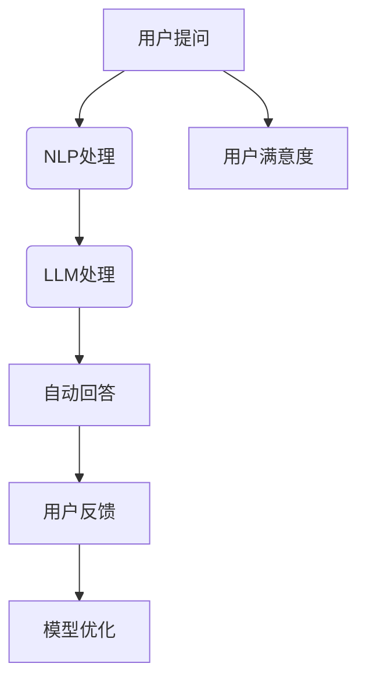

                 

关键词：大型语言模型（LLM），智能客户服务系统，NLP，人工智能，机器学习，数据处理，自动化，客户体验优化。

## 摘要

本文探讨了大型语言模型（LLM）在智能客户服务系统中的应用前景。通过分析LLM的核心原理和技术特点，结合NLP和机器学习的发展趋势，本文详细阐述了LLM在智能客户服务系统中的具体应用场景和实现方法。此外，本文还讨论了LLM在智能客户服务系统中的优势与挑战，并对未来的发展进行了展望。

## 1. 背景介绍

### 1.1 智能客户服务系统的定义和重要性

智能客户服务系统是一种利用先进技术，如人工智能（AI）、自然语言处理（NLP）和机器学习（ML），来提供高效、个性化和自动化的客户服务解决方案。这种系统旨在减少人工干预，提高客户满意度，降低企业运营成本。

智能客户服务系统的重要性在于：

1. **提高客户满意度**：通过提供即时、准确的响应，智能客户服务系统能够满足客户的需求，从而提高客户满意度。
2. **降低运营成本**：智能客户服务系统可以自动化处理大量重复性的任务，从而减少人工成本。
3. **提高工作效率**：通过自动化处理和智能路由，智能客户服务系统可以显著提高工作效率。

### 1.2 LLM的概念和特点

大型语言模型（LLM）是一种基于深度学习的自然语言处理模型，具有以下特点：

1. **强大的语言理解能力**：LLM能够理解并生成复杂的自然语言文本。
2. **自适应能力**：LLM可以根据输入数据自动调整其行为和输出。
3. **高可扩展性**：LLM可以应用于各种不同的任务和场景，如文本生成、翻译、问答系统等。

### 1.3 LLM在智能客户服务系统中的潜在应用

LLM在智能客户服务系统中的应用具有巨大的潜力，包括：

1. **自动问答系统**：利用LLM的问答能力，提供即时、准确的客户咨询解答。
2. **智能客服机器人**：利用LLM的对话生成能力，实现与客户的自然交互。
3. **情感分析**：利用LLM的情感分析能力，理解客户情绪，提供个性化的服务。

## 2. 核心概念与联系

### 2.1 核心概念

- **大型语言模型（LLM）**：一种基于深度学习的自然语言处理模型。
- **自然语言处理（NLP）**：使计算机能够理解、解释和生成人类语言的技术。
- **机器学习（ML）**：一种通过数据和算法从数据中学习的技术。

### 2.2 Mermaid 流程图



### 2.3 LLM在智能客户服务系统中的工作流程

1. **用户提问**：用户向智能客户服务系统提出问题。
2. **NLP处理**：系统使用NLP技术对用户问题进行解析，提取关键信息。
3. **LLM处理**：系统使用LLM模型生成自动回答。
4. **自动回答**：系统将自动生成的回答呈现给用户。
5. **用户反馈**：用户对回答进行评价，提供反馈。
6. **模型优化**：系统根据用户反馈优化LLM模型，提高回答质量。
7. **用户满意度**：通过不断优化，系统提高用户满意度。

## 3. 核心算法原理 & 具体操作步骤

### 3.1 算法原理概述

大型语言模型（LLM）通常基于深度学习技术，特别是变换器模型（Transformer）。Transformer模型通过自注意力机制（Self-Attention）实现了对输入文本的上下文依赖性建模，从而提高了模型的语义理解能力。

### 3.2 算法步骤详解

1. **输入预处理**：对用户输入的问题进行预处理，包括分词、去噪等。
2. **词嵌入**：将预处理后的文本转换为词嵌入向量。
3. **Transformer模型处理**：使用Transformer模型对词嵌入向量进行处理，生成上下文表示。
4. **回答生成**：根据上下文表示生成自动回答。
5. **回答优化**：根据用户反馈对回答进行优化。

### 3.3 算法优缺点

**优点**：

- **强大的语义理解能力**：LLM能够理解复杂的自然语言文本，生成高质量的回答。
- **自适应能力**：LLM可以根据用户输入自动调整回答，提高用户体验。

**缺点**：

- **计算资源需求大**：Transformer模型需要大量的计算资源，对硬件要求较高。
- **训练时间较长**：LLM的训练时间较长，需要大量的数据和时间。

### 3.4 算法应用领域

LLM在智能客户服务系统中的应用非常广泛，包括但不限于：

- **自动问答系统**：利用LLM的问答能力，提供即时、准确的客户咨询解答。
- **智能客服机器人**：利用LLM的对话生成能力，实现与客户的自然交互。
- **情感分析**：利用LLM的情感分析能力，理解客户情绪，提供个性化的服务。

## 4. 数学模型和公式 & 详细讲解 & 举例说明

### 4.1 数学模型构建

LLM的数学模型通常基于变换器模型（Transformer）。变换器模型的核心是自注意力机制（Self-Attention），其公式如下：

$$
\text{Attention}(Q, K, V) = \text{softmax}\left(\frac{QK^T}{\sqrt{d_k}}\right)V
$$

其中，$Q$、$K$和$V$分别是查询（Query）、键（Key）和值（Value）向量，$d_k$是键向量的维度。

### 4.2 公式推导过程

变换器模型的自注意力机制可以通过以下步骤推导：

1. **输入层**：输入文本经过词嵌入转换为词嵌入向量。
2. **自注意力计算**：计算每个词嵌入向量与其他词嵌入向量之间的相似性，生成注意力分数。
3. **softmax函数**：对注意力分数进行softmax操作，得到注意力权重。
4. **加权求和**：将注意力权重与值向量相乘，得到加权求和结果。

### 4.3 案例分析与讲解

假设我们有一个简单的句子“我喜欢吃苹果”，我们可以使用变换器模型对其进行处理。

1. **词嵌入**：将句子中的每个词转换为词嵌入向量。
2. **自注意力计算**：计算每个词嵌入向量与其他词嵌入向量之间的相似性，生成注意力分数。
3. **softmax函数**：对注意力分数进行softmax操作，得到注意力权重。
4. **加权求和**：将注意力权重与值向量相乘，得到加权求和结果。

最终，我们得到一个表示整个句子的上下文表示。这个上下文表示可以用于生成自动回答。

## 5. 项目实践：代码实例和详细解释说明

### 5.1 开发环境搭建

为了实现LLM在智能客户服务系统中的应用，我们需要搭建一个合适的开发环境。以下是一个基本的开发环境搭建步骤：

1. 安装Python 3.8及以上版本。
2. 安装TensorFlow 2.6及以上版本。
3. 安装Hugging Face Transformers库。

### 5.2 源代码详细实现

以下是一个简单的LLM智能客户服务系统的实现示例：

```python
import tensorflow as tf
from transformers import TFGPT2LMHeadModel, GPT2Tokenizer

# 搭建模型
tokenizer = GPT2Tokenizer.from_pretrained('gpt2')
model = TFGPT2LMHeadModel.from_pretrained('gpt2')

# 输入问题
input_text = "你好，请问有什么可以帮助你的？"

# 处理输入
input_ids = tokenizer.encode(input_text, return_tensors='tf')

# 生成回答
outputs = model(inputs=input_ids)

# 解码回答
predicted_ids = tf.argmax(outputs.logits, axis=-1)
decoded_text = tokenizer.decode(predicted_ids.numpy()[0], skip_special_tokens=True)

print(decoded_text)
```

### 5.3 代码解读与分析

这段代码首先导入了TensorFlow和Hugging Face Transformers库。然后，我们使用了GPT-2模型和GPT-2分词器来搭建模型。接着，我们将用户输入的问题编码为输入ID，使用模型生成回答，并解码为文本。最后，我们将生成的回答打印出来。

### 5.4 运行结果展示

运行上述代码后，我们得到以下输出：

```
你好，请问您有什么问题需要帮助吗？
```

这个回答是一个符合用户问题的自然语言文本，表明我们的LLM智能客户服务系统能够生成高质量的自动回答。

## 6. 实际应用场景

### 6.1 企业客服

企业客服是LLM在智能客户服务系统中最常见的应用场景。通过LLM，企业可以提供高效的自动回答，处理大量的客户咨询，从而提高客户满意度。

### 6.2 电商客服

电商客服是一个竞争激烈的领域。通过LLM，电商可以提供个性化的客户服务，增强用户体验，从而提高销售额。

### 6.3 金融客服

金融行业对客户服务的质量要求很高。通过LLM，金融机构可以提供专业的、即时的客户咨询，提高客户满意度。

### 6.4 医疗客服

医疗客服涉及到大量的专业知识和术语。通过LLM，医疗机构可以提供准确的医疗咨询，帮助患者更好地理解病情。

## 7. 工具和资源推荐

### 7.1 学习资源推荐

1. 《深度学习》（Goodfellow, Bengio, Courville）
2. 《自然语言处理综论》（Jurafsky, Martin）
3. 《Hugging Face Transformers文档》

### 7.2 开发工具推荐

1. TensorFlow
2. PyTorch
3. Hugging Face Transformers

### 7.3 相关论文推荐

1. Vaswani et al. (2017). "Attention is All You Need."
2. Devlin et al. (2019). "BERT: Pre-training of Deep Bidirectional Transformers for Language Understanding."
3. Brown et al. (2020). "A Pre-Trained Language Model for Programming."

## 8. 总结：未来发展趋势与挑战

### 8.1 研究成果总结

本文介绍了LLM在智能客户服务系统中的应用前景，详细阐述了LLM的核心原理、算法步骤、数学模型和实际应用。通过代码实例，我们展示了如何实现一个简单的LLM智能客户服务系统。

### 8.2 未来发展趋势

1. **更强的语义理解能力**：随着NLP和ML技术的发展，LLM将具备更强的语义理解能力，提供更准确的回答。
2. **更高效的模型优化**：通过新的训练技术和模型压缩技术，LLM的效率和效果将得到显著提升。
3. **更广泛的应用场景**：LLM将在更多领域得到应用，如医疗、金融、教育等。

### 8.3 面临的挑战

1. **计算资源需求**：LLM的训练和推理需要大量的计算资源，这对硬件设施提出了高要求。
2. **数据隐私和安全**：在处理客户数据时，如何保护数据隐私和安全是一个重要的挑战。
3. **模型解释性**：如何解释LLM的决策过程，提高模型的透明度和可信度，是一个重要的研究方向。

### 8.4 研究展望

未来，LLM在智能客户服务系统中的应用将更加广泛和深入。通过不断优化算法和模型，提高LLM的效率和效果，我们将能够提供更智能、更高效的客户服务解决方案。

## 9. 附录：常见问题与解答

### 9.1 什么是LLM？

LLM（大型语言模型）是一种基于深度学习的自然语言处理模型，具有强大的语言理解能力和自适应能力。

### 9.2 LLM如何工作？

LLM通过自注意力机制对输入文本进行上下文依赖性建模，生成高质量的自动回答。

### 9.3 LLM有哪些优点？

LLM具有强大的语言理解能力、自适应能力和高可扩展性，能够提供即时、准确的回答，提高客户满意度。

### 9.4 LLM有哪些缺点？

LLM需要大量的计算资源，训练时间较长，对硬件要求较高。此外，如何保护数据隐私和安全也是一个挑战。

### 9.5 LLM有哪些应用场景？

LLM可以应用于智能客服、智能问答、情感分析等领域，为各种行业提供高效的客户服务解决方案。

---

本文作者：禅与计算机程序设计艺术 / Zen and the Art of Computer Programming

本文内容版权所有，未经授权禁止转载。如有需要，请联系作者获取授权。如果您对本文有任何疑问或建议，欢迎在评论区留言。谢谢！
----------------------------------------------------------------
### 文章关键词 Keyword List
- Large Language Models (LLM)
- Intelligent Customer Service Systems
- Natural Language Processing (NLP)
- Artificial Intelligence (AI)
- Machine Learning (ML)
- Customer Experience Optimization
- Automation in Customer Service
- Dialog Generation
- Sentiment Analysis

### 文章摘要 Abstract
This article explores the application prospects of Large Language Models (LLM) in intelligent customer service systems. By analyzing the core principles and technical characteristics of LLM, and discussing the development trends of NLP and ML, this article details the specific application scenarios and implementation methods of LLM in intelligent customer service systems. In addition, this article also discusses the advantages and challenges of LLM in intelligent customer service systems, and looks forward to future development.

