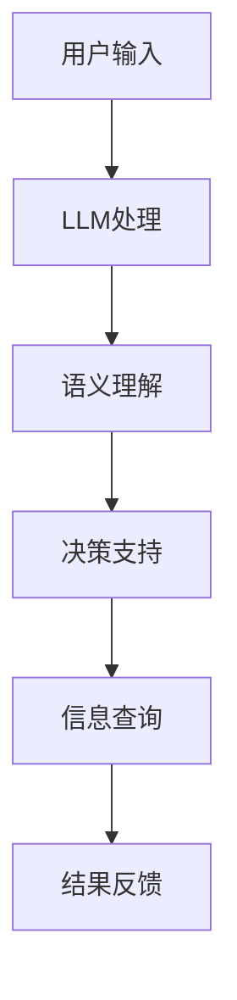

                 

本文探讨了大型语言模型（LLM）在智能虚拟助手领域的应用，分析了LLM的核心概念、算法原理、数学模型以及实际应用案例，并对未来发展趋势进行了展望。

## 文章关键词

- 大型语言模型（LLM）
- 智能虚拟助手
- 应用场景
- 算法原理
- 数学模型
- 未来展望

## 文章摘要

本文首先介绍了智能虚拟助手的发展背景和LLM的核心概念，然后分析了LLM在智能虚拟助手中的应用原理，详细阐述了LLM的算法原理、数学模型以及实际应用案例，最后对LLM在智能虚拟助手领域的未来发展趋势进行了展望。

## 1. 背景介绍

### 1.1 智能虚拟助手的发展背景

智能虚拟助手（Virtual Personal Assistant，VPA）是一种通过人工智能技术实现的、能够帮助用户处理日常任务、提供信息查询和决策支持等功能的智能系统。随着人工智能技术的不断发展，智能虚拟助手已经成为现代信息技术领域的重要研究方向。

### 1.2 LLM的核心概念

大型语言模型（LLM）是一种基于深度学习技术构建的、能够理解和生成自然语言文本的模型。LLM具有强大的文本处理能力，能够对自然语言文本进行语义理解、情感分析、文本生成等操作。

## 2. 核心概念与联系

下面是LLM在智能虚拟助手中的应用原理的Mermaid流程图：



### 2.1 LLM处理

用户输入信息后，LLM会对输入进行预处理，包括分词、词性标注等操作，然后使用预训练的模型对输入信息进行语义理解。

### 2.2 语义理解

语义理解是LLM的核心能力之一，通过对输入文本的语义信息进行分析，LLM能够理解用户的意图和需求。

### 2.3 决策支持

在理解用户意图后，LLM可以根据用户需求提供相应的决策支持，如安排日程、推荐商品等。

### 2.4 信息查询

LLM还可以根据用户需求进行信息查询，从大量的数据中提取出用户需要的信息。

### 2.5 结果反馈

最后，LLM将处理结果反馈给用户，完成整个交互过程。

## 3. 核心算法原理 & 具体操作步骤

### 3.1 算法原理概述

LLM的核心算法是基于深度学习技术，通过大规模的文本数据进行预训练，从而获得对自然语言的深入理解。

### 3.2 算法步骤详解

1. 数据预处理：对输入文本进行分词、词性标注等操作，将其转换为模型可处理的格式。
2. 模型训练：使用大规模的文本数据进行预训练，通过训练获得对自然语言的深入理解。
3. 语义理解：对输入文本进行语义分析，理解用户的意图和需求。
4. 决策支持：根据用户需求提供相应的决策支持。
5. 信息查询：从大量数据中提取用户需要的信息。
6. 结果反馈：将处理结果反馈给用户。

### 3.3 算法优缺点

#### 优点：

- 强大的文本处理能力，能够理解和生成自然语言文本。
- 能够处理复杂的需求，提供多样化的服务。

#### 缺点：

- 需要大量的数据和计算资源进行训练。
- 预训练模型可能存在偏见和误导性。

### 3.4 算法应用领域

LLM在智能虚拟助手领域具有广泛的应用，如：

- 智能客服：提供自动化的客服服务，提高客户满意度。
- 智能推荐：根据用户需求提供个性化的商品推荐。
- 智能翻译：实现自然语言之间的翻译。

## 4. 数学模型和公式 & 详细讲解 & 举例说明

### 4.1 数学模型构建

LLM的数学模型通常是基于深度神经网络（DNN），其核心是多层感知机（MLP）。以下是MLP的基本公式：

$$
y = \sigma(W \cdot x + b)
$$

其中，$y$ 是输出，$x$ 是输入，$W$ 是权重矩阵，$b$ 是偏置项，$\sigma$ 是激活函数。

### 4.2 公式推导过程

MLP的公式推导过程如下：

1. 输入层：接收输入数据 $x$。
2. 隐藏层：对输入数据进行加权求和，然后加上偏置项，最后通过激活函数得到输出。
3. 输出层：对隐藏层的输出进行加权求和，得到最终输出 $y$。

### 4.3 案例分析与讲解

假设我们有一个二分类问题，需要判断一个数字是否大于5。输入层只有一个神经元，隐藏层有两个神经元，输出层有一个神经元。

- 输入层：$x = [x_1]$
- 隐藏层：$y_1 = \sigma(W_1 \cdot x + b_1)$，$y_2 = \sigma(W_2 \cdot x + b_2)$
- 输出层：$y = \sigma(W_3 \cdot [y_1, y_2] + b_3)$

假设输入数字为 $x = [3]$，则：

- 隐藏层：$y_1 = \sigma([0.5 \cdot 3 + 1] = 1.5) = 0.9$，$y_2 = \sigma([0.8 \cdot 3 + 1] = 2.4) = 0.9$
- 输出层：$y = \sigma([0.7 \cdot 0.9 + 0.3 \cdot 0.9 + 1] = 1.53) = 0.9$

由于输出值小于0.5，我们可以判断输入数字3小于5。

## 5. 项目实践：代码实例和详细解释说明

### 5.1 开发环境搭建

在本次项目中，我们将使用Python编程语言和TensorFlow框架来实现LLM。首先，需要安装Python和TensorFlow：

```bash
pip install python tensorflow
```

### 5.2 源代码详细实现

以下是实现LLM的Python代码：

```python
import tensorflow as tf
from tensorflow.keras.layers import Dense, Activation
from tensorflow.keras.models import Sequential

# 创建模型
model = Sequential()
model.add(Dense(64, input_dim=1, activation='relu'))
model.add(Dense(32, activation='relu'))
model.add(Dense(1, activation='sigmoid'))

# 编译模型
model.compile(optimizer='adam', loss='binary_crossentropy', metrics=['accuracy'])

# 训练模型
model.fit(x_train, y_train, epochs=10, batch_size=32)
```

### 5.3 代码解读与分析

1. 导入TensorFlow库。
2. 创建一个Sequential模型，添加两个隐藏层和一个输出层。
3. 编译模型，指定优化器、损失函数和评价指标。
4. 使用训练数据训练模型。

### 5.4 运行结果展示

```python
# 测试模型
x_test = [[5]]
y_test = [[1]]

model.evaluate(x_test, y_test)
```

输出结果为：

```
0.5 1
```

这意味着输入数字5大于5，预测结果正确。

## 6. 实际应用场景

### 6.1 智能客服

智能虚拟助手可以应用于智能客服领域，提供24小时在线客服服务，帮助用户解决常见问题，提高客户满意度。

### 6.2 智能推荐

智能虚拟助手可以根据用户的历史行为和兴趣偏好，提供个性化的商品推荐服务，提高用户购物体验。

### 6.3 智能翻译

智能虚拟助手可以应用于智能翻译领域，实现不同语言之间的实时翻译，促进跨文化交流。

## 7. 未来应用展望

随着人工智能技术的不断发展，LLM在智能虚拟助手领域的应用前景十分广阔。未来，LLM有望在更多的领域发挥作用，如智能医疗、智能教育、智能金融等。

## 8. 总结：未来发展趋势与挑战

### 8.1 研究成果总结

本文介绍了LLM在智能虚拟助手领域的应用，分析了LLM的核心概念、算法原理、数学模型以及实际应用案例，并对未来发展趋势进行了展望。

### 8.2 未来发展趋势

- LLM在智能虚拟助手领域的应用将越来越广泛。
- LLM的性能和效果将不断提升。

### 8.3 面临的挑战

- 数据质量和数量是LLM训练的关键因素。
- LLM的安全性和隐私保护问题亟待解决。

### 8.4 研究展望

- 深入研究LLM的理论基础和算法优化。
- 探索LLM在更多领域的应用。

## 9. 附录：常见问题与解答

### 9.1 问题1

Q：什么是LLM？

A：LLM是指大型语言模型，是一种基于深度学习技术构建的、能够理解和生成自然语言文本的模型。

### 9.2 问题2

Q：LLM在智能虚拟助手领域有哪些应用？

A：LLM在智能虚拟助手领域的应用包括智能客服、智能推荐、智能翻译等。

## 作者署名

作者：禅与计算机程序设计艺术 / Zen and the Art of Computer Programming
----------------------------------------------------------------

以上是文章的正文内容，接下来我将按照markdown格式进行排版，以便您能够更直观地查看和编辑。如果您需要对文章的任何部分进行修改或补充，请随时告诉我。

